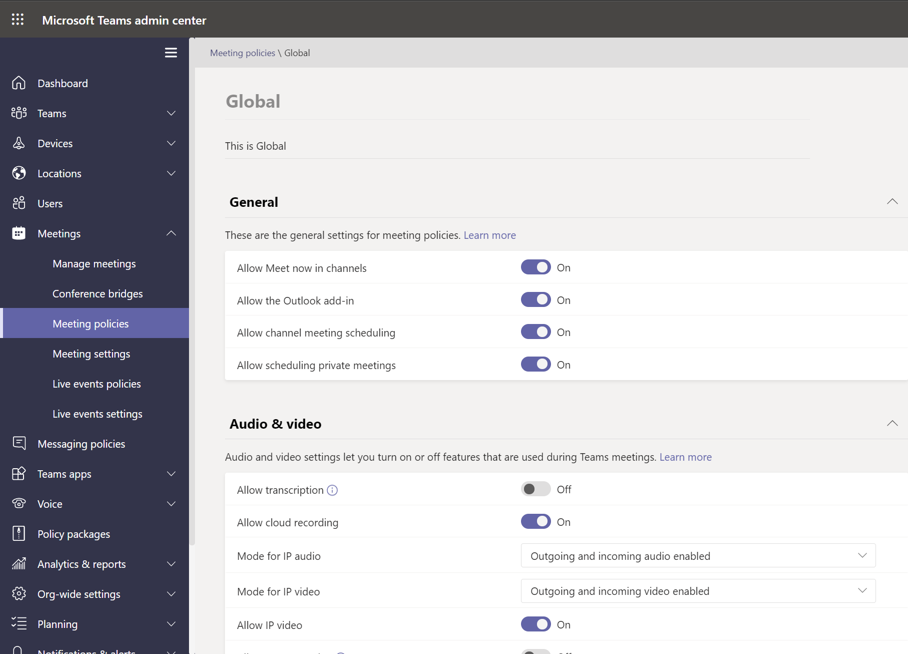

# <a name="assign-policies-in-teams--getting-started"></a>Asignar directivas en Teams: introducción

Como administrador, usa directivas para controlar las características de Teams que están disponibles para los usuarios de su organización. Por ejemplo, hay directivas de llamadas, directivas de reunión y directivas de mensajería, por nombrar solo algunas.

Las organizaciones tienen diferentes tipos de usuarios con necesidades únicas. Las directivas personalizadas que cree y asigne le permiten adaptar la configuración de directiva a diferentes conjuntos de usuarios en función de esas necesidades.

Para administrar fácilmente las directivas de su organización, Teams ofrece varias formas de asignar directivas a los usuarios. Asigne una directiva directamente a los usuarios, ya sea individualmente o a escala a través de una asignación por lotes, o a un grupo del que los usuarios sean miembros. También puede usar paquetes de directivas para asignar una colección predefinida de directivas a los usuarios de su organización que tengan roles similares. La opción que elija depende del número de directivas que administra y del número de usuarios a los que asigne directivas. Las directivas globales (predeterminadas para toda la organización) se aplican al mayor número de usuarios de su organización. Solo tiene que asignar directivas a los usuarios que requieren directivas especializadas.

En este artículo se describen las diferentes formas de asignar directivas a los usuarios y los escenarios recomendados para cuándo usar qué.

Para obtener información detallada sobre cómo **asignar directivas a usuarios y** grupos, vea Asignar directivas a usuarios y [grupos.](assign-policies-users-and-groups.md) Para obtener más información sobre cómo **asignar paquetes de directiva,** vea [Asignar paquetes de directiva.](assign-policy-packages.md)

## <a name="which-policy-takes-precedence"></a>¿Qué directiva tiene prioridad?

Un usuario tiene una directiva eficaz para cada tipo de directiva. Es posible, o incluso probable, que a un usuario se le asigne directamente una directiva y que también sea miembro de uno o varios grupos a los que se ha asignado una directiva del mismo tipo. En estos tipos de escenarios, ¿qué directiva tiene prioridad? La directiva efectiva de un usuario se determina según las reglas de prioridad, como se muestra a continuación.

Si a un usuario se le asigna directamente una directiva (ya sea individualmente o a través de una asignación por lotes), esa directiva tiene prioridad. En el siguiente ejemplo visual, la directiva efectiva del usuario es la directiva de reunión de Lincoln Square, que se asigna directamente al usuario.


Si a un usuario no se le asigna directamente una directiva de un tipo determinado, la directiva asignada a un grupo del que el usuario es miembro tiene prioridad. Si un usuario es miembro de varios grupos, la directiva que tiene la mayor (clasificación de asignaciones de[grupo)](assign-policies-users-and-groups.md#group-assignment-ranking)para el tipo de directiva determinado tiene prioridad.

En este ejemplo visual, la directiva efectiva del usuario es la directiva Exec Teams y HD, que tiene la clasificación de asignaciones más alta con respecto a otros grupos a los que el usuario es miembro y a los que también se les asigna una directiva del mismo tipo de directiva.  


Si a un usuario no se le asigna directamente una directiva o no es miembro de ningún grupo al que se le haya asignado una directiva, el usuario obtiene la directiva global (predeterminada para toda la organización) para ese tipo de directiva. Este es un ejemplo visual.


Para obtener más información, vea ([Reglas de prioridad).](assign-policies-users-and-groups.md#precedence-rules)

## <a name="ways-to-assign-policies"></a>Formas de asignar directivas

A continuación se ofrece información general sobre las formas en que puede asignar directivas a los usuarios y los escenarios recomendados para cada uno de ellos. Seleccione los vínculos para obtener más información.

Antes de asignar directivas a usuarios o grupos individuales, empiece estableciendo las directivas globales (predeterminadas para toda la [organización)](#set-the-global-policies) para que se apliquen al mayor número de usuarios de su organización.  Una vez establecidas las directivas globales, solo tendrá que asignar directivas a los usuarios que requieran directivas especializadas.

|Haga esto  |Si...  | Usar...
|---------|---------|----|
|[Asignar una directiva a usuarios individuales](assign-policies-users-and-groups.md#assign-a-policy-to-individual-users)   | Es nuevo en Teams y acaba de empezar o solo necesita asignar una o un par de directivas a un pequeño número de usuarios. |El centro de administración de Microsoft Teams o los cmdlets de PowerShell en el módulo de PowerShell de Teams
|[Asignar una directiva a un grupo](assign-policies-users-and-groups.md#assign-a-policy-to-a-group) |Asigne directivas basadas en la pertenencia a un grupo de usuarios. Por ejemplo, asigne una directiva a todos los usuarios de un grupo de seguridad o una lista de distribución.| El centro de administración de Microsoft Teams o los cmdlets de PowerShell en el módulo de PowerShell de Teams|
|[Asignar una directiva a un lote de usuarios](assign-policies-users-and-groups.md#assign-a-policy-to-a-batch-of-users)   | Asignar directivas a grandes conjuntos de usuarios. Por ejemplo, asigne una directiva a cientos o miles de usuarios de su organización a la vez. |El centro de administración de Microsoft Teams o los cmdlets de PowerShell en el módulo de PowerShell de Teams|
|[Asignar un paquete de directiva a los usuarios](assign-policy-packages.md#assign-a-policy-package-to-users)  |Asigne varias directivas a conjuntos específicos de usuarios de su organización que tengan los mismos roles o similares. Por ejemplo, asigne el paquete de directivas educación (profesor) a los profesores de su escuela para darles acceso completo a chats, llamadas y reuniones. Asigne el paquete de directivas Educación (estudiante de secundaria) a los alumnos secundarios para limitar ciertas capacidades, como las llamadas privadas.  |El centro de administración de Microsoft Teams o los cmdlets de PowerShell en el módulo de PowerShell de Teams|
|[Asignar un paquete de directiva a un grupo](assign-policy-packages.md#assign-a-policy-package-to-a-group) (en versión preliminar privada)   |Asigne varias directivas a un grupo de usuarios de su organización que tengan los mismos roles o roles similares. Por ejemplo, asigne un paquete de directiva a todos los usuarios de un grupo de seguridad o una lista de distribución. |El Centro de administración de Microsoft Teams (próximamente) o cmdlets de PowerShell en el módulo de PowerShell de Teams|
|[Asignar un paquete de directiva a un lote de usuarios](assign-policy-packages.md#assign-a-policy-package-to-a-batch-of-users)|Asigne varias directivas a un lote de usuarios de su organización que tengan los mismos roles o similares. Por ejemplo, asigne el paquete de directivas Educación (Profesor) a todos los profesores de su escuela con asignación por lotes para darles acceso completo a chats, llamadas y reuniones. Asigne el paquete de directivas Educación (estudiante de secundaria) a un lote de alumnos secundarios para limitar ciertas capacidades, como las llamadas privadas.|Cmdlets de PowerShell en el módulo de PowerShell de Teams|

## <a name="set-the-global-policies"></a>Establecer las directivas globales

Siga estos pasos para establecer las directivas globales (predeterminadas para toda la organización) para cada tipo de directiva.

### <a name="using-the-microsoft-teams-admin-center"></a>Usar el Centro de administración de Microsoft Teams

1. En el panel de navegación izquierdo del Centro de administración de Microsoft Teams, vaya a la página de directiva del tipo de directiva que desea actualizar. Por ejemplo, directivas **de Teams**  >  **Teams,** **directivas de**  >  reuniones, **directivas de** mensajería o directivas de **llamadas** de  >  **voz.**
2. Seleccione la **directiva Global (predeterminada para toda la organización)** para ver la configuración actual.
3. Actualice la directiva según sea necesario y, a continuación, **seleccione Aplicar**.



### <a name="using-powershell"></a>Con PowerShell

Para establecer las directivas globales con PowerShell, use el identificador global.  Empiece revisando la directiva global actual para determinar qué configuración desea cambiar.

```powershell
Get-CsTeamsMessagingPolicy -Identity Global
 
Identity                      : Global
Description                   :
AllowUrlPreviews              : True
AllowOwnerDeleteMessage       : False
AllowUserEditMessage          : True
AllowUserDeleteMessage        : True
AllowUserChat                 : True
AllowRemoveUser               : True
AllowGiphy                    : True
GiphyRatingType               : Moderate
AllowMemes                    : True
AllowImmersiveReader          : True
AllowStickers                 : True
AllowUserTranslation          : False
ReadReceiptsEnabledType       : UserPreference
AllowPriorityMessages         : True
ChannelsInChatListEnabledType : DisabledUserOverride
AudioMessageEnabledType       : ChatsAndChannels
Expand (20 lines) Collapse 
```

A continuación, actualice la directiva global según sea necesario.  Solo tiene que especificar valores para la configuración que desea cambiar.

```powershell
Set-CsTeamsMessagingPolicy -Identity Global -AllowUserEditMessage $false
```

## <a name="view-your-policy-assignments-in-the-activity-log"></a>Ver las asignaciones de directivas en el registro de actividades

Al asignar directivas a usuarios en el Centro de administración de Microsoft Teams, puede ver el estado de esas asignaciones de directivas en el registro de actividades. El registro de actividades muestra las asignaciones de directivas a lotes de más de 20 usuarios a través del Centro de administración de Microsoft Teams desde los últimos 30 días. Tenga en cuenta que el registro de actividades no muestra asignaciones de paquetes de directiva, asignaciones de directivas a lotes de menos de 20 usuarios a través del Centro de administración de Microsoft Teams o asignaciones de directivas a través de PowerShell.


## <a name="view-your-policy-assignment-activities-in-the-activity-log"></a>Ver las actividades de asignación de directivas en el registro de actividades

Para ver las asignaciones de directivas en el registro de actividades:

1. En el panel de navegación izquierdo del Centro de administración de Microsoft Teams, vaya a **Panel** y, a continuación, en Registro de **actividades,** seleccione **Ver detalles.**
2. Puede ver todas las asignaciones de directivas o filtrar la lista por estado para mostrar solo las tareas no iniciadas, en curso **o** **completadas.** Verá la siguiente información sobre cada tarea:
    - **Nombre:** el nombre de la asignación de directivas. Haga clic en el vínculo para ver más detalles. Esto incluye el número de usuarios a los que se asignó la directiva y el número de tareas completadas, en curso y no iniciadas. También verá la lista de usuarios en el lote, así como el estado y el resultado de cada usuario. Aquí se muestra un ejemplo:

        

    - **Enviado:** Fecha y hora en que se envió la asignación de directiva.
    - **Hora de finalización:** fecha y hora en que se completó la asignación de directivas.
    - **Impacto en:** Número de usuarios en el lote.
    - **Estado general:** Estado de la asignación de directivas.

> [!NOTE]
> También puede acceder al registro de actividades desde la **página** Usuarios. Después de hacer **clic en Aplicar** para enviar una asignación de directiva en masa, verá un banner en la parte superior de la página. Haga clic en **el vínculo Registro** de actividades en el banner.

## <a name="related-topics"></a>Temas relacionados

- [Asignar directivas a usuarios y grupos](assign-policies-users-and-groups.md)
- [Asignar paquetes de directiva a usuarios y grupos](assign-policy-packages.md)
- [Administrar Teams con directivas](manage-teams-with-policies.md)
- [Descripción de PowerShell para Teams](teams-powershell-overview.md)