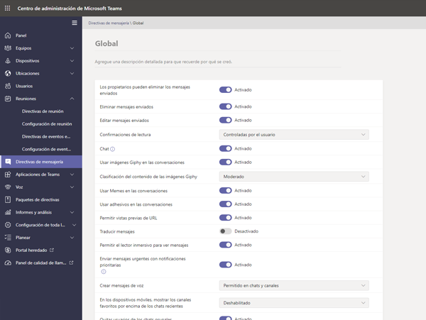
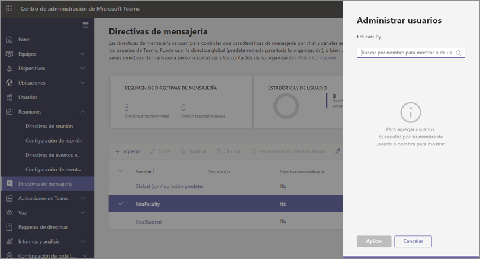
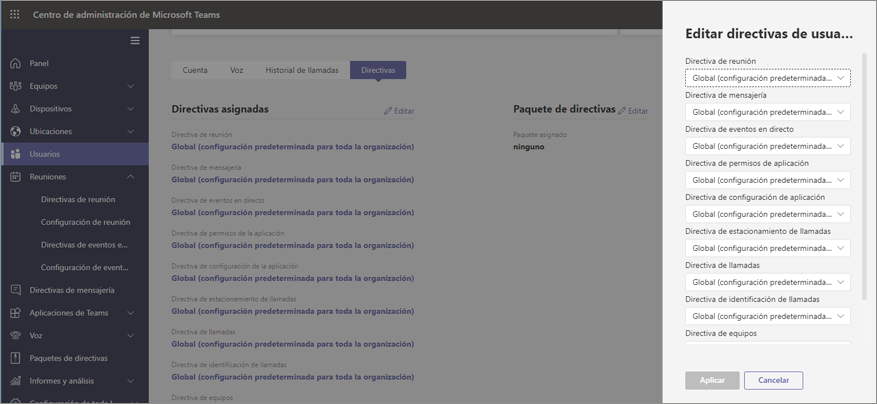
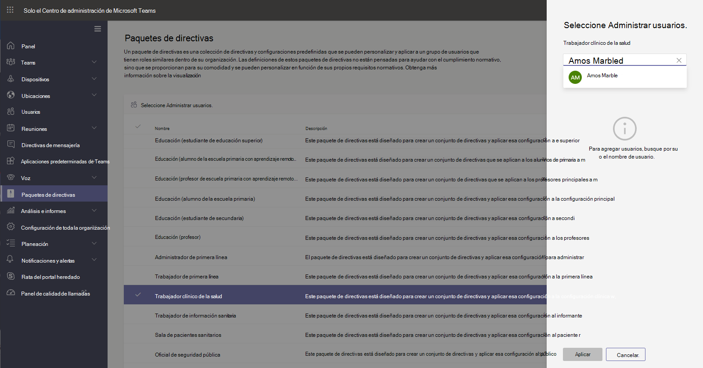

# Directivas de Teams y paquetes de directivas para educación

[!INCLUDE [policy-wizard-edu](includes/policy-wizard-edu.md)]

> [!NOTE]
> Para más información sobre las directivas en Microsoft Teams, consulte [Asignar directivas a los usuarios en Microsoft Teams](assign-policies.md).

## Administradores: Introducción a la administración de directivas de Microsoft Teams

Microsoft Teams permite a los usuarios realizar tareas como asistir a reuniones en línea o eventos en directo, chatear, realizar llamadas y usar aplicaciones. Establecer las directivas administrativas correctas de Microsoft Teams es un paso crítico para crear un entorno de aprendizaje seguro para los estudiantes dentro de Teams. Como administrador, puede usar directivas para controlar las características de Teams que están disponibles para los usuarios de su institución educativa. En la mayoría de los casos, es necesario ajustar las directivas para que tanto los estudiantes como los educadores mantengan un entorno seguro.  

Esta es una lista de las principales áreas de directivas que encontrará en Microsoft Teams. Para obtener más información sobre las directivas en cada área y las funciones que controlan, use los siguientes vínculos:

- [Reuniones](meeting-policies-in-teams.md)
- [Eventos en directo](teams-live-events/configure-teams-live-events.md)
- [Llamadas](teams-calling-policy.md) 
- [Mensajería](messaging-policies-in-teams.md)
- [Teams](teams-policies.md)
- [Permisos de la aplicación](teams-app-permission-policies.md)

:::image type="content" source="media/edu-admin-center-users.png" alt-text="Captura de pantalla de un usuario con las directivas aplicadas.":::

Puede administrar fácilmente todas las directivas de Teams en el [Centro de administración de Microsoft Teams](https://admin.teams.microsoft.com) iniciando sesión con sus credenciales de administrador.

### Dónde encontrar directivas de Microsoft Teams

Una vez que haya iniciado sesión en el centro de administración de Teams, podrá ir a la configuración de la directiva para cada área de Teams que necesita administrar; para ello, haga clic en la opción de directiva en la navegación de la izquierda del centro de administración de Teams. Hemos incluido una captura de pantalla de la ubicación de las directivas de mensajería.

:::image type="content" source="media/edu-messaging-policies.png" alt-text="Ubicación de la directiva de mensajes en el centro de administración de Teams.":::

### Cómo crear y actualizar una definición de directiva

Antes de asignar directivas a los usuarios, tiene que agregar y crear las definiciones de directiva para cada área de funciones con Teams.

> [!NOTE]
> Le recomendamos que establezca distintas definiciones de directiva para los alumnos y los profesores.

De forma predeterminada, todos los usuarios nuevos (estudiantes o educadores) tendrán asignada la definición de directiva global (predeterminada para toda la organización) para cada área de funciones. Se recomienda usar Global (predeterminada para toda la organización) para el conjunto más estricto de definiciones de directivas. En la mayoría de los casos, este conjunto más estricto de directivas será el más adecuado para los alumnos. Usar la definición de directiva Global (predeterminada para toda la organización) de esta forma garantiza que los nuevos usuarios tendrán las restricciones más estrictas cuando se agreguen a su espacio empresarial. Para seguir estas instrucciones, le recomendamos que siga estos pasos:

1. Cree una definición de directiva personalizada para cada área de funcionalidad de Teams con valores de directiva que se ajusten a las necesidades de los educadores [sin esto, los educadores tendrán el mismo acceso restringido que los alumnos, según lo establece la definición de directiva Global (predeterminada para toda la organización)].

1. Asigne estas nuevas definiciones de directiva personalizada a los educadores.

1. Edite la definición de directiva Global (predeterminada para toda la organización) para cada área de función con valores adecuados para los alumnos.

1. Las definiciones de la directiva global (predeterminada para toda la organización) se aplicarán a los alumnos siempre que no se haya asignado ninguna otra definición de directiva.

Para crear o editar definiciones de directiva, vaya al área de funcionalidad de la directiva en la que quiera trabajar (por ejemplo, directivas de Mensajería). Seleccione **Agregar** para crear una nueva definición de directiva personalizada. Para cambiar una definición de directiva existente, seleccione **Editar**.

:::image type="content" source="media/edu-messaging-policies-add-closeup.png" alt-text="Primer plano de la sección directivas de mensajería con una vista del botón Agregar.":::

Si elige agregar o editar una definición de directiva, accederá a la vista de todas las opciones de directiva relacionadas con este área de directiva. Use esta lista para seleccionar los valores que quiere definir en la definición de directiva.

> [!IMPORTANT]
> No olvide seleccionar **Guardar** antes de salir de la página.

### Asignación de definiciones de directiva 
Existen varios métodos que puede usar para asignar definiciones de directiva a los usuarios. Cada método tiene sus propias ventajas y desventajas, las cuales variarán en función de las necesidades específicas de su institución.  

En la mayoría de los casos, le recomendamos que use la asignación de directivas de grupo para asignar las directivas a los usuarios. Este método permite una aplicación de directivas más rápida y continua.  Cuando se agrega un usuario a un grupo que tiene una definición de directiva asignada, el nuevo usuario hereda automáticamente las directivas del grupo.  Esto permite que la administración de directivas resulte más fácil cuando necesite agregar y quitar a un número grande de usuarios del entorno, como por ejemplo, al principio y al final de un período escolar.  

En el caso de empresas grandes, también recomendamos la asignación de directivas por lotes, la cual está diseñada para casos en los que es necesario asignar directivas a grandes grupos de usuarios. Para obtener más información sobre estos métodos de aplicación, consulte [Asignar directivas a grandes grupos de usuarios en su escuela](batch-group-policy-assignment-edu.md).

Si tiene una institución más pequeña o necesita actualizar la configuración de directiva de un estudiante o educador individual, siga las instrucciones que se indican a continuación.  

> [!IMPORTANT]
> Las asignaciones de directivas que se especifican en el nivel de usuario individual anulan las directivas de grupo asignadas al usuario. Asegúrese de usar únicamente asignaciones de directivas individuales cuando desee anular la configuración de la directiva de grupo. 

#### Cómo asignar una definición de directiva a un usuario

> [!NOTE]
> La asignación de una definición de directiva puede tardar un tiempo en propagarse a todos los usuarios y clientes. Es posible que quiera hacer esto cuando las cuentas de usuario se crean por primera vez en Azure o M365 y siempre que un alumno nuevo se una a ña institución educativa.

Una vez que se ha creado o actualizado la definición de la directiva, puede asignarla a un usuario seleccionando **Administrar usuarios** en la página de directivas, buscando al usuario deseado y aplicando la directiva.

También puede asignar una directiva a un usuario desplazándose hasta **Usuarios** y seleccionando al usuario al que desea actualizar las directivas, luego elija **Directivas** y por último **Editar**. Desde allí, puede seleccionar la definición de directiva que le gustaría asignar al usuario por cada área de funciones.

### Paquetes de directivas en Microsoft Teams
> [!NOTE]
> Para más información, consulte [Administrar paquetes de directivas en Microsoft Teams](manage-policy-packages.md) para ver instrucciones paso a paso para asignar un paquete a usuarios individuales, asignar paquetes de forma masiva hasta a 5 000 usuarios y administrar y actualizar las directivas vinculadas a cada paquete.

Un paquete de directivas en Teams recopila directivas predefinidas y configuraciones de directiva que aprendió en el apartado anterior, y las asigna a los usuarios con roles similares en la institución. Los paquetes de directivas simplifican y ayudan a proporcionar consistencia al administrar directivas. En la práctica normal, asigna a cada uno de los usuarios un paquete de directivas y redefine las directivas de cada paquete en función de las necesidades de cada grupo de usuarios. Cuando actualiza la configuración de un paquete, todos los usuarios asignados a ese paquete se cambian como una actualización masiva.

Las instituciones educativas en general tienen un gran número de usuarios con necesidades diferentes, en función de la edad y la madurez de los alumnos. Por ejemplo, es posible que quiera conceder a los educadores y al personal acceso total a Microsoft Teams, pero quiera limitar las funciones de Microsoft Teams para los alumnos, para fomentar un entorno de aprendizaje seguro y centrado. Puede usar paquetes de directivas para adaptar las configuraciones en función de las necesidades de los distintos grupos en la comunidad de su institución educativa.

> [!IMPORTANT] 
> Nuestra recomendación principal es que use la definición de directiva Global (predeterminada para toda la organización) para los alumnos, en lugar de un paquete de directivas. Esto garantiza que los nuevos usuarios en sus organizaciones siempre tengan el conjunto más estricto de directivas adecuadas para los alumnos. Si esta recomendación no cubre las necesidades de su institución, es posible que alguno de los siguientes paquetes de directiva para alumnos sea una buena alternativa. 

Al igual que en la lista de directivas citada anteriormente en este artículo, los paquetes de directivas predefinen directivas para:

- Reuniones
- Eventos en directo
- Llamadas
- Mensajería 
- Permisos de aplicación

Microsoft Teams actualmente incluye los siguientes paquetes de directiva:

|Nombre de paquete enumerado en el centro de administración de Microsoft Teams |Recomendado para  |Descripción |
|:--- |:--- |:--- |
|**Education_Teacher**| Educadores y personal| Use este conjunto de directivas y configuraciones de directiva para conceder a los educadores y miembros del personal de su organización acceso completo a chat, llamadas y reuniones a través de Microsoft Teams. |
|**Education_PrimaryStudent**| Estudiantes de primaria  | Los estudiantes más jóvenes de primaria de su institución pueden necesitar más límites en Microsoft Teams. Use este conjunto de directivas y configuraciones de directiva para limitar la funcionalidad, como la creación y administración de reuniones, la administración de chats y las llamadas privadas. |
|**Education_SecondaryStudent**| Estudiantes de secundaria | Los estudiantes de secundaria de la institución pueden necesitar más límites en Microsoft Teams. Use este conjunto de directivas y configuraciones de directiva para limitar la funcionalidad, como la creación y administración de reuniones, la administración de chats y las llamadas privadas. |
|**Education_HigherEducationStudent**| Estudiantes de educación superior | Los estudiantes de educación superior de su institución pueden necesitar menos límites que los estudiantes más jóvenes, pero se pueden recomendar algunas limitaciones. Puede usar este conjunto de directivas y configuraciones de directiva para dar acceso a chat, llamadas y reuniones en su organización, pero limitar la forma en que los alumnos usan Microsoft Teams con participantes externos. |
|**Education_PrimaryTeacher_RemoteLearning**| Educadores y personal | Crea un conjunto de directivas que se aplican a los profesores de primaria para maximizar la seguridad y colaboración de los alumnos al usar la formación remota. |
|**Education_PrimaryStudent_RemoteLearning**| Estudiantes de primaria| Crea un conjunto de directivas que se aplican a los alumnos de primaria para maximizar la seguridad y colaboración de los alumnos al usar la formación remota.
|||

:::image type="content" source="media/edu-policy-packages-list.png" alt-text="Página de paquetes de directiva con una lista de paquetes de directivas entre los que elegir.":::

Cada directiva individual recibe el nombre del paquete de directivas para que pueda identificar fácilmente las directivas vinculadas a un paquete de directivas. Por ejemplo, cuando asigna el paquete de directiva de Education_Teacher a educadores en la institución educativa, se crea una directiva denominada Education_Teacher para cada directiva del paquete.

> [!NOTE]
> Si decide que los educadores y el personal de apoyo administrativo necesitan directivas diferentes, puede reutilizar un paquete existente: identifique un paquete que no esté utilizando actualmente y cambie la configuración para que sea apropiado para ese grupo. Es posible que tenga que anotarse qué grupo tiene cada paquete, pero ese es el único impedimento para reutilizar un paquete.

## Administrar los paquetes de directivas

### Ver

Ver la configuración de cada directiva en un paquete de directivas antes de asignar un paquete. En el panel de navegación izquierdo del Centro de administración de Microsoft Teams, seleccione **Paquetes de directivas**, escoja el nombre del paquete y seleccione el nombre de la directiva.

Decida si los valores predefinidos son adecuados para su organización o si necesita personalizarlos para que sean más restrictivos o flexibles en función de las necesidades de su organización.

### Personalizar

Personalice la configuración de las directivas en el paquete de directivas, según sea necesario, para adecuarlas a las necesidades de su organización. Los cambios que realice en la configuración de directivas se aplican automáticamente a los usuarios a los que se les asigna el paquete. Para editar la configuración de una directiva en un paquete de directivas, seleccione el paquete de directivas en el Centro de administración de Microsoft Teams. Luego, seleccione el nombre de la directiva que quiera editar y, finalmente, seleccione **Editar**.

Tenga en cuenta que también puede cambiar la configuración de las directivas en un paquete después de asignar el paquete de directivas. Para obtener más información, consulte [Personalizar directivas en un paquete de directivas](manage-policy-packages.md#customize-policies-in-a-policy-package). 

### Asignar

Asigne el paquete de directivas a los usuarios. Si un usuario tiene una directiva asignada y posteriormente asigna otra directiva, la asignación más reciente tendrá prioridad.

#### Asignar un paquete de directivas a uno o más usuarios

Para asignar un paquete de directivas a uno o más usuarios, vaya al panel de navegación izquierdo del Centro de administración de Microsoft Teams. Allí, seleccione **Paquetes de directivas** y, después, **Administrar usuarios**.  

Para obtener más información, consulte [Asignar un paquete de directivas](manage-policy-packages.md#assign-a-policy-package).

Si un usuario tiene una directiva asignada y posteriormente asigna otra directiva, la asignación más reciente tendrá prioridad.

#### Asignar un paquete de directivas a un grupo

**Esta característica está en versión preliminar privada**

La opción de asignar un paquete de directiva a grupos le permite asignar múltiples directivas a un grupo de usuarios, como un grupo de seguridad o una lista de distribución. La asignación de directiva se extiende a los miembros del grupo en función de las reglas de prioridad. A medida que se agregan o se eliminan miembros de un grupo, sus asignaciones de directivas heredadas se actualizan correspondientemente. Este método es el recomendado para grupos de hasta 50 000 usuarios, pero también funciona con grupos más grandes.

Para obtener más información, consulte [Asignar un paquete de directivas a un grupo](assign-policies.md#assign-a-policy-package-to-a-group).

#### Asignar un paquete de directivas a un conjunto amplio (un lote) de usuarios

Use la asignación de paquete de directiva por lotes para asignar un paquete de directivas a grandes grupos de usuarios de una sola vez. Use el cmdlet [New-CsBatchPolicyPackageAssignmentOperation](/powershell/module/teams/new-csbatchpolicypackageassignmentoperation) para enviar un lote de usuarios y el paquete de directivas que quiera asignar. Las asignaciones se procesan como una operación de segundo plano y se genera un identificador de operación para cada lote.

Un lote puede contener hasta 5000 usuarios. Puede especificar los usuarios por su identificador de objeto, UPN, dirección SIP o dirección de correo electrónico. Para obtener más información, consulte [Asignar un paquete de directivas a un lote de usuarios](assign-policies.md#assign-a-policy-package-to-a-batch-of-users).

## Directivas que se deben asignar para la seguridad de los alumnos

Para obtener más información sobre los pasos que debe seguir para proteger a los alumnos en su entorno, revise detenidamente [Cómo mantener a los alumnos a salvo al usar Teams para el aprendizaje a distancia](https://support.office.com/article/keeping-students-safe-while-using-meetings-in-teams-for-distance-learning-f00fa399-0473-4d31-ab72-644c137e11c8).