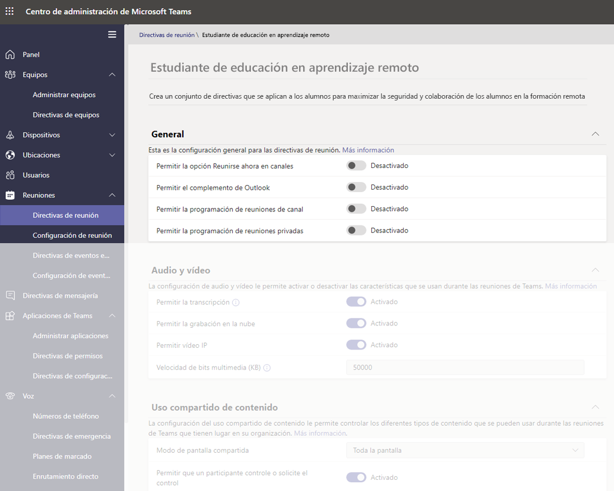
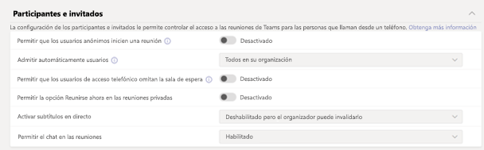
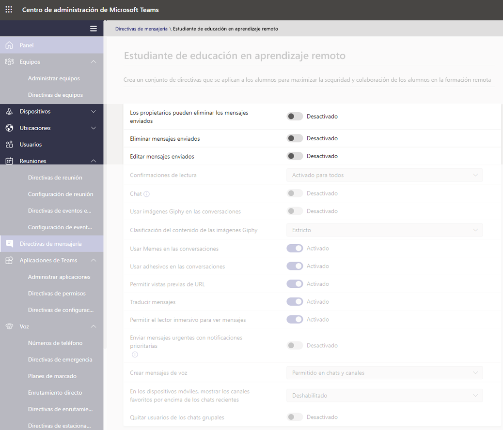
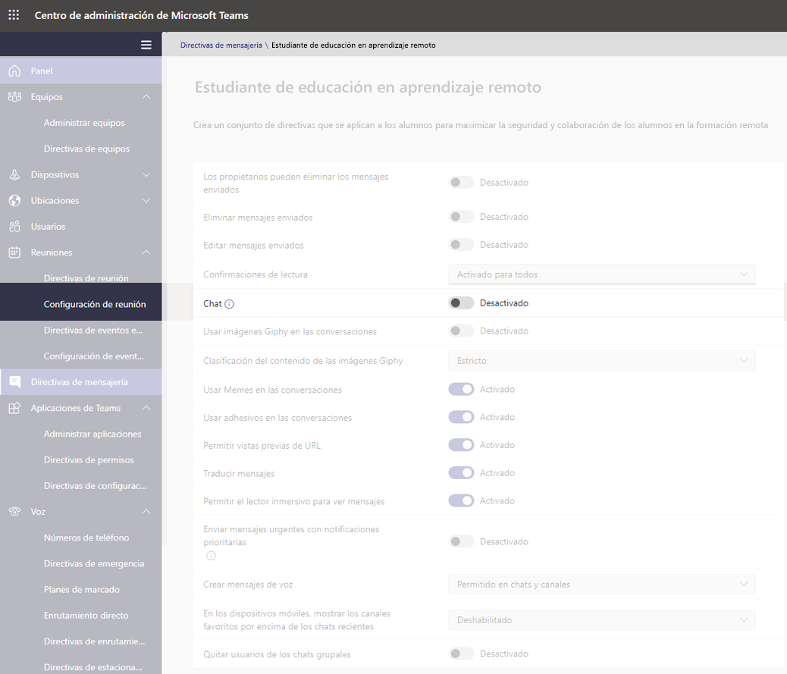
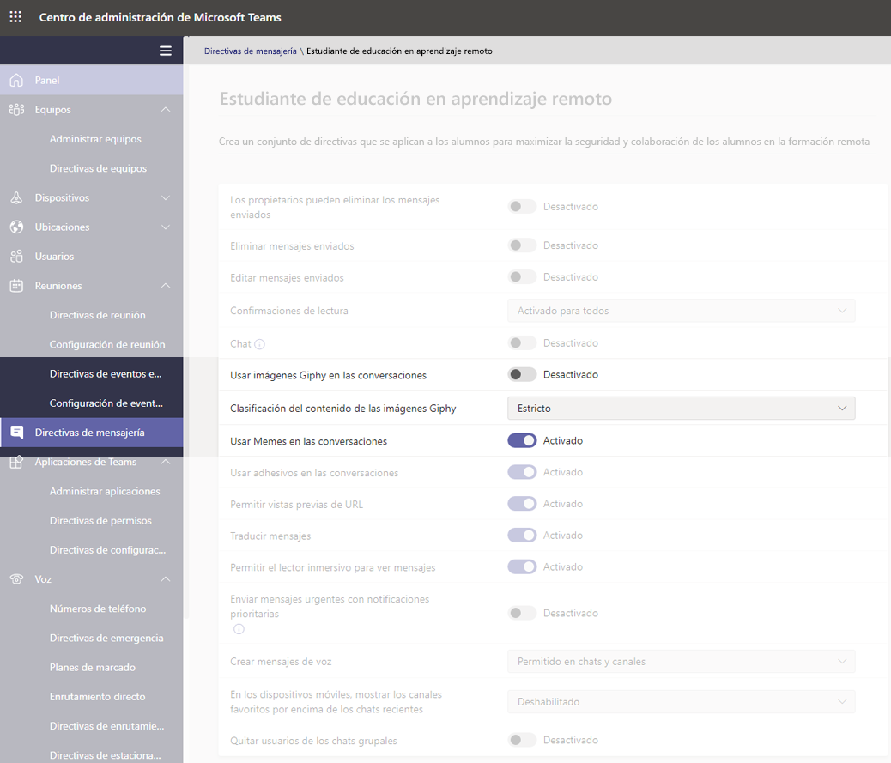
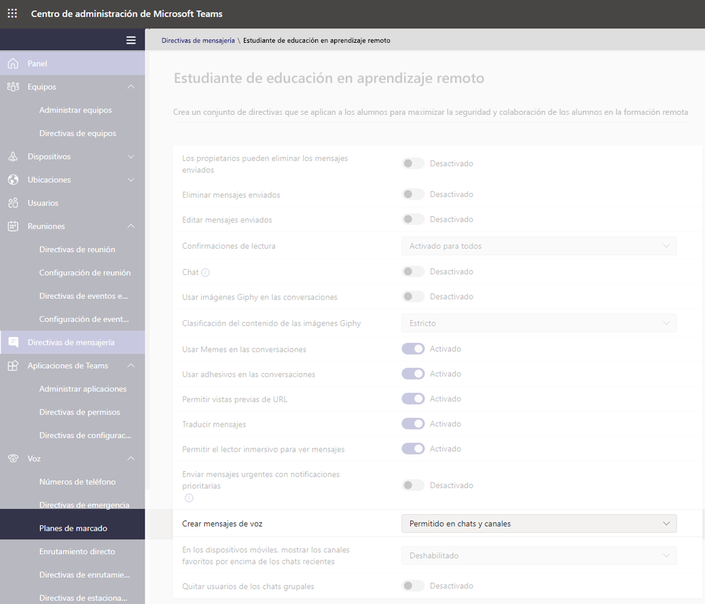
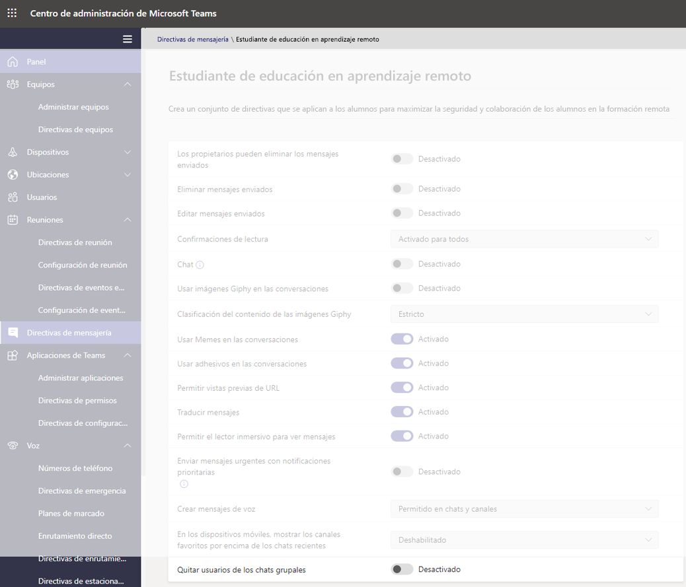
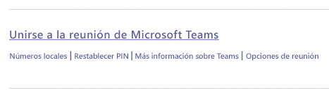
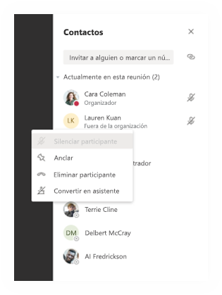
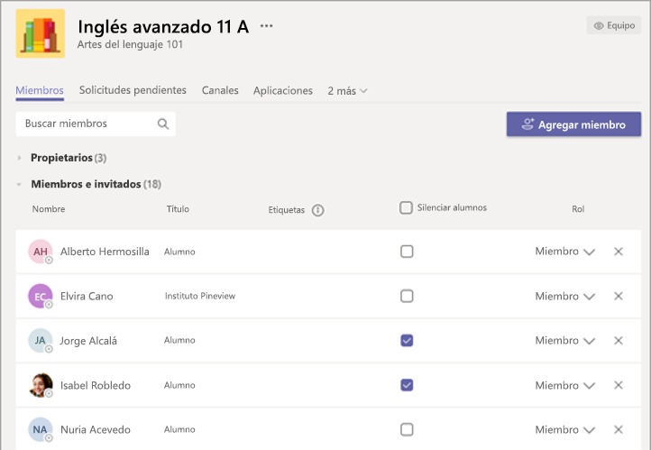

# Directivas de Teams y paquetes de directivas para educación

> [!NOTE]
> Para más información sobre las directivas en Microsoft Teams, consulte [Asignar directivas a los usuarios en Microsoft Teams](assign-policies.md).

Es importante que tenga en cuenta que este artículo cubrirá varias formas de asignar directivas a los usuarios en Teams.

- Asignación manual a usuarios individuales.
- Asignación masiva mediante PowerShell a varios usuarios.
- Asignación de paquetes de directivas a uno o varios usuarios.

Las ventajas y desventajas de estos métodos se reducen a las necesidades individuales de la institución.

## Administradores: introducción a la administración de directivas de Microsoft Teams

Microsoft Teams, en esencia, consiste en que los usuarios puedan hacer cosas como ir a reuniones o eventos en directo, chatear, hacer llamadas y usar aplicaciones. Y establecer las directivas administrativas correctas de Microsoft Teams es un paso crítico para crear un entorno de aprendizaje seguro para los estudiantes dentro de Teams. Como administrador, puede usar directivas para controlar las características de Teams que están disponibles para los usuarios de su institución educativa.

Aquí se muestra una lista de las áreas de directiva que encontrará en Microsoft Teams:

- Reuniones
- Eventos en directo
- Llamadas
- Mensajería 
- Equipos
- Permisos de aplicación

:::image type="content" source="media/edu-admin-center-users.png" alt-text="Captura de pantalla de usuario con directivas aplicadas.":::

Puede administrar fácilmente todas las directivas de Teams en el [Centro de administración de Microsoft Teams](https://admin.teams.microsoft.com) iniciando sesión con sus credenciales de administrador.

### Dónde encontrar directivas de Microsoft Teams

Una vez que haya iniciado sesión en el centro de administración de Teams, podrá ir a la configuración de la directiva para cada área de Teams que necesita administrar; para ello, haga clic en la opción de directiva en la navegación de la izquierda del centro de administración de Teams. Hemos incluido una captura de pantalla de la ubicación de las directivas de mensajería.

:::image type="content" source="media/edu-messaging-policies.png" alt-text="Ubicación de la directiva de mensajes en el centro de administración de Teams.":::

### Cómo crear y actualizar una definición de directiva

Antes de asignar directivas a los usuarios, tiene que agregar y crear las definiciones de directiva para cada área de funciones con Teams.

> [!NOTE]
> Le recomendamos que establezca distintas definiciones de directiva para los alumnos y los profesores.

De forma predeterminada, todos los usuarios nuevos (estudiantes o educadores) tendrán asignada la definición de directiva global (predeterminada para toda la organización) para cada área de funciones. Le recomendamos que siga estos pasos:

1. Cree una definición de directiva personalizada para cada área de funcionalidad de Teams que luego pueda asignarse a sus educadores (sin esto, cualquier cambio que realice en la directiva global restringirá a los educadores hasta que tengan su propia directiva).
1. Asigne a los educadores esta nueva definición de directiva.
1. Actualice la definición de directiva global (predeterminada para toda la organización) y asígnela a los alumnos.

Para crear o editar definiciones de directiva, vaya al área de funcionalidad de la directiva en la que quiera trabajar (por ejemplo, directivas de mensajería). Seleccione **Agregar** si quiere crear una nueva definición de directiva personalizada (que realizará para la definición de directiva personalizada que cree para educadores). En caso contrario, para cambiar una definición de directiva existente, seleccione **Editar** (que será lo que haga si decide actualizar la directiva global para estudiantes).

:::image type="content" source="media/edu-messaging-policies-add-closeup.png" alt-text="Primer plano de la sección directivas de mensajería con una vista del botón Agregar.":::

Si elige agregar o editar una definición de directiva, accederá a la vista de todas las opciones de directiva relacionadas con este área de directiva. Use esta lista para seleccionar los valores que quiere definir en la definición de directiva.

> [!IMPORTANT]
> No olvide seleccionar **Guardar** antes de salir de la página.

### Cómo asignar una definición de directiva a un usuario

> [!NOTE]
> La asignación de una definición de directiva puede tardar un tiempo en propagarse a todos los usuarios y clientes. Es posible que quiera hacer esto cuando las cuentas de usuario se crean por primera vez en Azure o M365 y siempre que un alumno nuevo se una a ña institución educativa.

Una vez que se ha creado o actualizado la definición de la directiva, puede asignarla a un usuario seleccionando **Administrar usuarios** en la página de directivas, buscando el usuario que quiera usar y aplicando la directiva.

También puede asignar una directiva a un usuario al navegar a Usuarios, seleccionando el usuario para el que quiere actualizar las directivas, después Directivas y luego Editar. Desde allí, puede seleccionar la definición de directiva que le gustaría usar para asignar al usuario en cada área de funciones.

> [!IMPORTANT]
> Si forma parte de un gran centro educativo, usar la experiencia del portal de administración de Microsoft Teams para establecer directivas para cada usuario puede ser difícil. Le resultará más fácil asignar directivas en lotes a través de PowerShell. Tenemos cierta información específica de EDU sobre cómo [Asignar directivas a grandes grupos de usuarios en su institución educativa](batch-policy-assignment-edu.md) si la necesita, y también puede consultar la sección siguiente sobre paquetes de directivas, que es otro método ideal para administrar directivas y opciones de configuración para grandes grupos de usuarios.

### Paquetes de directivas en Microsoft Teams

Un paquete de directivas en Teams recopila directivas predefinidas y configuraciones de directiva que aprendió en el apartado anterior, y las asigna a los usuarios con roles similares en la institución. Los paquetes de directivas simplifican y ayudan a proporcionar consistencia al administrar directivas. En la práctica normal, asigna a cada uno de los usuarios un paquete de directivas y redefine las directivas de cada paquete en función de las necesidades de cada grupo de usuarios. Cuando actualiza la configuración de un paquete, todos los usuarios asignados a ese paquete se cambian como una actualización masiva.

Las instituciones educativas en general tienen un gran número de usuarios con necesidades diferentes, en función de la edad y la madurez de los alumnos. Por ejemplo, es posible que quiera conceder a los educadores y al personal acceso total a Microsoft Teams, pero quiera limitar las funciones de Microsoft Teams para los alumnos, para fomentar un entorno de aprendizaje seguro y centrado. Puede usar paquetes de directivas para adaptar las configuraciones en función de las necesidades de los distintos grupos en la comunidad de su institución educativa.

> [!NOTE]
> Para más información, consulte [Administrar paquetes de directivas en Microsoft Teams](manage-policy-packages.md) para ver instrucciones paso a paso para asignar un paquete a usuarios individuales, asignar paquetes de forma masiva hasta a 5 000 usuarios y administrar y actualizar las directivas vinculadas a cada paquete.

Al igual que en la lista de directivas citada anteriormente en este artículo, los paquetes de directivas predefinen directivas para:

- Reuniones
- Eventos en directo
- Llamadas
- Mensajería 
- Equipos
- Permisos de aplicación

Microsoft Teams actualmente incluye los siguientes paquetes de directiva:

|Nombre de paquete enumerado en el centro de administración de Microsoft Teams |Recomendado para  |Descripción |
|:--- |:--- |:--- |
|**Education_Teacher**| Educadores y personal| Use este conjunto de directivas y configuraciones de directiva para conceder a los educadores y miembros del personal de su organización acceso completo a chat, llamadas y reuniones a través de Microsoft Teams. |
|**Education_PrimaryStudent**| Estudiantes de primaria  | Los estudiantes más jóvenes de primaria de su institución pueden necesitar más límites en Microsoft Teams. Use este conjunto de directivas y configuraciones de directiva para limitar la funcionalidad, como la creación y administración de reuniones, la administración de chats y las llamadas privadas. |
|**Education_SecondaryStudent**| Estudiantes de secundaria | Los estudiantes de secundaria de la institución pueden necesitar más límites en Microsoft Teams. Use este conjunto de directivas y configuraciones de directiva para limitar la funcionalidad, como la creación y administración de reuniones, la administración de chats y las llamadas privadas. |
|**Education_HigherEducationStudent**| Estudiantes de educación superior | Los estudiantes de educación superior de su institución pueden necesitar menos límites que los estudiantes más jóvenes, pero se pueden recomendar algunas limitaciones. Puede usar este conjunto de directivas y configuraciones de directiva para dar acceso a chat, llamadas y reuniones en su organización, pero limitar la forma en que los alumnos usan Microsoft Teams con participantes externos. |
|**Education_PrimaryTeacher_RemoteLearning**| Educadores y personal | Crea un conjunto de directivas que se aplican a los profesores de primaria para maximizar la seguridad y colaboración de los alumnos al usar la formación remota. |
|**Education_PrimaryStudent_RemoteLearning**| Estudiantes de primaria| Crea un conjunto de directivas que se aplican a los alumnos de primaria para maximizar la seguridad y colaboración de los alumnos al usar la formación remota.
|||

:::image type="content" source="media/edu-policy-packages-list.png" alt-text="Página de paquetes de directiva con una lista de paquetes de directivas entre los que elegir.":::

Cada directiva individual se indica con el nombre del paquete de directivas para que pueda identificar fácilmente las directivas vinculadas a un paquete de directivas. Por ejemplo, cuando asigna el paquete de directiva de Education_Teacher a educadores en la institución educativa, se crea una directiva denominada Education_Teacher para cada directiva del paquete.

> [!NOTE]
> Si decide que los educadores y el personal de apoyo administrativo necesitan directivas diferentes, puede reutilizar un paquete existente: identifique un paquete que no esté utilizando actualmente y cambie la configuración para que sea apropiado para ese grupo. Es posible que tenga que anotarse qué grupo tiene cada paquete, pero ese es el único impedimento para reutilizar un paquete.

## Directivas que se deben asignar para la seguridad de los alumnos

### Directivas de reunión

#### Desactivar la posibilidad de crear e iniciar reuniones

Para asegurarse de que los alumnos no puedan programar una reunión para comunicarse sin supervisión, en las directivas de reunión establezca en **Desactivado** las funciones de creación de reunión a través de esta configuración general:

- **Permitir la opción Reunirse ahora en canales**: desactivado
- **Permitir el complemento de Outlook**: desactivado
- **Permitir la programación de reuniones de canal**: desactivado
- **Permitir la programación de reuniones privadas**: desactivado

- Y, en la misma página, en la sección Participantes e invitados en la reunión: **Permitir Reunirse ahora en reuniones privadas**: desactivado

#### Controlar si los alumnos pueden compartir o no sus vídeos durante las llamadas y reuniones

En la sección directivas de reunión, asegúrese de que los valores de audio y los visuales que defina para los estudiantes se alineen con las directrices de la institución educativa, así como los deseos de los estudiantes, los educadores y los padres y tutores (con la excepción de **Permitir la grabación en la nube**, que recomendamos que se establezca en **Desactivado**).

Las opciones aquí:

- **Permitir transcripción**: desactivado/activado
- **Permitir la grabación en la nube**: **desactivado**
- **Permitir vídeo IP**: desactivado/activado

:::image type="content" source="media/edu-policy-list-b.png" alt-text="Estudiantes en la página de aprendizaje remoto mostrando las opciones de vídeo.":::

### Directivas de eventos en directo

#### Desactivar la posibilidad de crear e iniciar eventos en directo

Para asegurarse de que los alumnos no puedan programar eventos en directo para comunicarse sin supervisión, deshabilite la directiva **Permitir programación** para los estudiantes estableciéndola en **Desactivado**.

:::image type="content" source="media/edu-allow-scheduling-off.png" alt-text="Estudiante en la página de aprendizaje remoto con la opción permitir programación Desactivada.":::

### Directivas de llamada

#### Desactivar la posibilidad de realizar llamadas privadas

Para asegurarse de que los alumnos no pueden realizar llamadas privadas con otros estudiantes o educadores, deshabilite **Hacer llamadas privadas** para los alumnos configurándola como **Desactivada**.

:::image type="content" source="media/edu-private-calls-off.png" alt-text="Estudiante en la página de aprendizaje remoto con la opción Hacer llamadas privadas configurada como Desactivada.":::

### Directivas de mensajería

#### Desactivar la posibilidad de eliminar o editar mensajes enviados

- Para los alumnos: para asegurarse de que los mensajes que envían los alumnos no se eliminen o se modifiquen, los alumnos deben tener estas configuraciones en **Desactivado**:
  - **Eliminar mensajes enviados**
  - **Editar mensajes enviados**
- Para educadores: para asegurarse de que los formadores pueden moderar o eliminar los mensajes inadecuados que envíen los alumnos, los educadores deben tener estas opciones configuradas en **Activado**:
  - **Los propietarios pueden eliminar los mensajes enviados** (esta configuración permite a los educadores eliminar mensajes inadecuados de alumnos).
  - **Eliminar mensajes enviados**
  - **Editar mensajes enviados**

> [!NOTE]
> Para más información sobre este tema, consulte [Silenciar comentarios de los alumnos en un equipo de clase.](https://support.office.com/article/Mute-student-comments-in-a-class-team-a378de16-ffc0-420c-b08d-e17ec08e7c17).

#### Controlar si los alumnos pueden chatear de forma privada

Asegúrese de que el valor **Activar o desactivar chat** que haya establecido para los alumnos se alinee con las directrices de la institución educativa, así como con los deseos de estudiantes y educadores. Este control activa o desactiva la posibilidad de que los usuarios se comuniquen de forma privada en el chat de 1:1 o en un chat de grupo en Teams.

#### Controlar si los alumnos pueden personalizar sus mensajes

Asegúrese de que el valor que haya establecido para los alumnos se alinee con las directrices de la institución educativa, así como con los deseos de estudiantes, educadores, padres y tutores. Nuestra recomendación es establecer **Giphy para los alumnos** en **Desactivado** y mantener **Memes y adhesivos** en **Activado**.

#### Controlar si los alumnos pueden enviar mensajes de voz

Asegúrese de que el valor que haya establecido para **Crear mensajes de voz** para los alumnos se alinee con las directrices de la institución educativa, así como con los deseos de estudiantes y educadores.

#### Desactivar la posibilidad de quitar usuarios de chat para estudiantes

Los alumnos no deberían tener la posibilidad de quitar otros usuarios de los chat en los que estén incluidos. La configuración de **Quitar usuarios de chats grupales** debe establecerse en **Desactivado**.

### Directivas de equipos

#### Desactivar la posibilidad de detectar y crear canales privados

Para asegurarse de que los alumnos no puedan crear un canal privado como espacio personal para comunicarse sin supervisión, configure la directiva **Crear canales privados** para los alumnos en **Desactivada**.

> [!IMPORTANT]
> Es probable que también quiera asegurarse de que los alumnos no puedan crear nuevos equipos en Microsoft Teams. Esta es en realidad una configuración de grupos de M365, y puede leer más al respecto [aquí](https://docs.microsoft.com/microsoft-365/admin/create-groups/manage-creation-of-groups).

### Directivas de permisos de aplicación

#### Controlar si los alumnos pueden agregar aplicaciones en Teams

Asegúrese de que el valor que haya establecido para los alumnos se alinee con las directrices de la institución educativa. Por ejemplo, si quiere que los alumnos se expongan a las aplicaciones que apruebe, puede seleccionar:

- **Aplicaciones de Microsoft**: **Permitir todas las aplicaciones**
- **Para aplicaciones de terceros**: **Permitir aplicaciones específicas y bloquear todas las demás.**
- **Para las aplicaciones de espacio empresarial**: **Permitir aplicaciones específicas y bloquear todas las demás.**

:::image type="content" source="media/edu-policies-apps.png" alt-text="Estudiante en la página de aprendizaje remoto con las opciones de directivas de aplicación establecidas.":::

> [!NOTE]
> Este es un ejemplo y, como se indicó anteriormente, debe establecer estas directivas en función de las directrices de la institución educativa.

## Directivas que se deberían asignar para educadores

Se recomienda a los administradores aplicar esta configuración de directiva para los educadores, de modo que puedan tener una experiencia de clase segura para los alumnos.

> [!NOTE]
> Las recomendaciones de directiva para los alumnos contienen más información que las secciones de educadores que se muestran a continuación. Aunque puede establecer la configuración de directivas en línea con las directivas y los procedimientos propios de su centro educativo, las recomendaciones aquí indicadas son estrictamente relevantes en lo que respecta a la seguridad de los estudiantes.

### Directivas de reunión

Esta configuración permitirá que los formadores puedan controlar el acceso a sus reuniones.

- **Permitir que los usuarios anónimos inicien una reunión**: **Desactivado**
- **Admitir automáticamente personas**: **Todas las personas de la organización**
- **Permitir que los usuarios de acceso telefónico omitan la sala de espera**: **Desactivado**
- 1**DesignatedPresenterRoleMode**: **OrganizerOnlyUserOverride**

1 Esta configuración no se encuentra en el centro de administración de Microsoft Teams, por lo que tendrá que usar PowerShell para establecer el parámetro **DesignatedPresenterRoleMode** con el cmdlet [Set-CsTeamsMeetingPolicy](https://docs.microsoft.com/powershell/module/skype/set-csteamsmeetingpolicy) o [New-CsTeamsMeetingPolicy](https://docs.microsoft.com/powershell/module/skype/new-csteamsmeetingpolicy). Esto establece el valor predeterminado de la configuración **¿Quién puede presentar?** en **Opciones de reunión** en Teams en **Solo yo**. Con esta configuración, solo el organizador de la reunión puede ser moderador y el resto de los participantes de la reunión se designan como asistentes. Para más información, consulte [Configuración de la directiva de reunión: modo de rol de moderador designado](meeting-policies-in-teams.md#meeting-policy-settings---designated-presenter-role-mode).

> [!NOTE]
> Para los miembros que no sean educadores, puede que quiera establecer el parámetro en **EveryoneUserOverride** (que corresponde a la configuración **Todos** en Teams) o **EveryoneInCompanyUserOverride** (que corresponde a la configuración **Personas de mi organización** en Teams).

### Directivas de mensajería

La configuración de **Los propietarios pueden eliminar mensajes enviados** en **Activado** permitirá a los educadores supervisar las sesiones de chat y eliminar los mensajes inapropiados en las reuniones del canal.

> [!NOTE]
> Esto permite a los educadores quitar los mensajes inadecuados en chats de clase cuando la reunión se crea dentro del canal, o quitar mensajes del propio canal.

## Qué pueden hacer los formadores para proteger a los alumnos

Por supuesto, aunque al establecer directivas los administradores pueden proteger de forma proactiva a los estudiantes en una configuración de Teams, los educadores son las personas que interactúan con los alumnos de forma periódica y también desempeñan un papel fundamental para que los alumnos puedan estar seguros. Los administradores pueden querer discutir la siguiente información con los educadores con los que trabajan

### Establecer los roles de reunión a través de las opciones de reunión

Las opciones de reunión le permiten controlar si los participantes de la reunión se unen a las reuniones como asistente o moderador. Tiene las siguientes opciones:

- Vaya a **Calendario** y navegue a la reunión que quiera actualizar. Haga clic o pulse en **Opciones de reunión** junto al vínculo para unirse a la reunión para abrir las **Opciones de reunión**.

- Controle qué usuarios pueden entrar directamente en la reunión con la selección de **Quién puede pasar por alto la sala de espera**. Configúrelo en **Personas de mi organización** para impedir que los usuarios externos tengan la opción de ingresar y establezca **Las personas que llaman siempre omiten la sala de espera** en **Desactivado** para que los participantes tengan que esperar para poder participar en la reunión en lugar de unirse inmediatamente. También tiene la opción de **Anunciar cuando las personas que llaman se unen o se van**, y esto debe establecerse en **Activado** por lo que siempre estará al tanto de quién está en la reunión.
- Controle quién se une a la reunión como moderador o asistente. Puede seleccionar **Solo yo** para designar al resto de los participantes como asistentes. Esta es la configuración más segura para las reuniones que se celebran en una configuración de clase.
  - Si espera tener más de un moderador en la reunión, seleccione **Usuarios específicos** y elija a los demás participantes que deben unirse como moderadores. Seleccione **Todos los usuarios** si quiere que todos los participantes se unan a la reunión como moderadores.

:::image type="content" source="media/edu-meeting-options.png" alt-text="Lista desplegable de Usuarios que pueden omitir la sala de espera con Personas de mi organización seleccionado y el menú desplegable Quién pueden presentar con Solo yo seleccionado.":::

### Roles en una reunión en línea

Se asigna un rol como moderador o asistente a todos los participantes de una reunión. El rol de un participante controla lo que puede hacer en una reunión. Consulte la tabla siguiente.

|Capacidades  |Organizador/moderador  |Asistente  |
|---------|---------|---------|
|Hablar y compartir vídeo     |     v     |     v     |
|Participar en el chat de la reunión     |     v     |     v     |
|Ver de forma privada un archivo de PowerPoint compartido por otra persona     |     v     |     v     |
|Compartir contenido     |     v     |     N     |
|Silenciar a otros participantes|     v     |     N     |
|Quitar participantes      |     v     |     N     |
|Admitir a participantes de la sala de espera|     v     |     N     |
|Cambiar los roles de otros participantes     |     v     |     N     |
|Iniciar o detener una grabación     |     v     |     N     |

### Cambiar roles durante una reunión

Se asigna un rol como moderador o asistente a todos los participantes de una reunión. El rol de un participante controla lo que puede hacer mientras se encuentra en una reunión.

- Para cambiar el rol de un participante, haga clic o pulse para **Mostrar participantes** en los controles de llamada. Haga clic con el botón derecho en el participante cuyo rol necesita cambiar y seleccione **Convertir en asistente** o **Convertir en moderador**.

- Para obtener acceso rápido a las opciones de la reunión y cambiar la configuración de rol de la reunión tanto para los participantes actuales como para los usuarios que se unan a la reunión en el futuro, haga clic o pulse en **Más acciones** en los controles de llamada y después en **Mostrar detalles de la reunión** Encontrará el vínculo a las **Opciones de la reunión** junto al vínculo de la reunión.

:::image type="content" source="media/edu-meeting-details.png" alt-text="Ventana de la reunión con el panel Detalles de la reunión en la parte derecha.":::

### Silenciar comentarios de estudiante

Después de la reunión, puede impedir que los alumnos agreguen un comentario si programó una reunión de canal.

#### Para una reunión específica

Cuando programe una reunión en un canal, la reunión en sí será una publicación de canal y las conversaciones de la reunión serán réplicas de la publicación. Como propietario del equipo, puede hacer clic o pulsar en **Más acciones** para esa publicación, haga clic en **Editar**.

:::image type="content" source="media/edu-meeting-edit.png" alt-text="Elegir Más opciones en una publicación de canal y ver la opción de Editar menú como la segunda opción en el menú emergente.":::

En el panel de edición, tiene una opción desplegable, donde puede configurar esa opción para que sea **Usted y los moderadores pueden responder**.

### Para todas las reuniones y publicaciones de un equipo

Puede controlar cuándo los estudiantes pueden publicar y responder en los chats de reuniones y el equipo de clase. Haga clic o pulse en **Más acciones** del equipo, haga clic en **Administrar equipo**, vaya a **Miembros** y seleccione las personas para silenciar el audio o **Silenciar todos los alumnos**.

## Lecturas adicionales

Revise [Mantener a los estudiantes seguros mientras usa las reuniones en Teams para aprendizaje a distancia](https://support.office.com/article/keeping-students-safe-while-using-meetings-in-teams-for-distance-learning-f00fa399-0473-4d31-ab72-644c137e11c8) para obtener más información sobre cómo proteger a los estudiantes.
