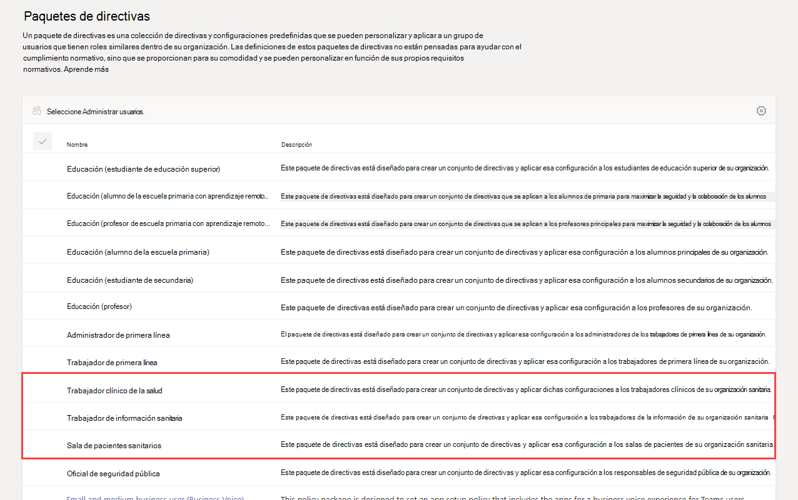
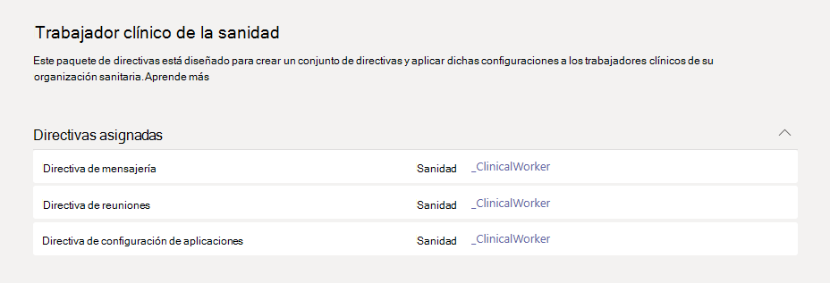

# Paquetes de directivas de Teams para atención sanitaria

## Descripción general

Un [paquete de directivas](manage-policy-packages.md) en Microsoft Teams es una colección de directivas predefinidas y configuraciones de directiva que puede asignar a los usuarios que tienen roles similares en su organización. Los paquetes de directivas simplifican y ayudan a proporcionar consistencia al administrar directivas. Puede personalizar la configuración de las directivas del paquete para adaptarla a las necesidades de los usuarios. Al cambiar la configuración de directivas en un paquete de directivas, todos los usuarios asignados a ese paquete obtienen la configuración actualizada. Puede administrar paquetes de directivas mediante el Centro de administración de Microsoft Teams o PowerShell.

> [!VIDEO https://www.microsoft.com/videoplayer/embed/RE4Ht2o]

Los paquetes de directiva definen previamente directivas para las siguientes, dependiendo del paquete:

- Mensajería 
- Reuniones
- Llamadas
- Configuración de la aplicación
- Eventos en directo

Teams incluye actualmente los siguientes paquetes de directivas sanitarias.

|Nombre del paquete en el Centro de administración de Microsoft Teams|Recomendado para|Descripción |
|---------|---------|---------|
|Trabajador sanitario  |Trabajadores clínicos de su organización sanitaria  |Crea un conjunto de directivas y configuraciones de directivas que proporciona a los trabajadores clínicos como enfermeras registradas, enfermeras responsables, médicos y trabajadores sociales acceso total a chat, llamadas, administración de turnos y reuniones. |
|Trabajador de la información sanitaria  |Trabajadores de la información de su organización sanitaria |Crea un conjunto de directivas y configuraciones de directivas que proporciona a los trabajadores de la información, como el personal de IT, el personal de informática, el personal de finanzas y los responsables de cumplimiento normativo, acceso total a chats, llamadas y reuniones.|
|Sala de pacientes sanitarios  |Dispositivos de sala para pacientes|Crea un conjunto de directivas y configuraciones de directivas que se aplican a las salas de pacientes de su organización sanitaria.|

A cada directiva individual se le da el nombre del paquete de directiva para que pueda identificar fácilmente las directivas vinculadas a un paquete de directivas. Por ejemplo, al asignar el paquete de directiva de trabajador médico médico a médicos de su organización, se crea una directiva denominada Healthcare_ClinicalWorker para cada directiva del paquete.

## Introducción a los paquetes de directivas

Para empezar con los paquetes de directivas sanitarias, en el centro de integración del Centro de administración de Microsoft, seleccione Atención sanitaria y, a continuación, seleccione Asignar configuración de directiva **por rol.** Cuando estés listo para empezar, decide a qué paquetes de directiva te gustaría asignar a las personas de tu organización.

Seleccione **Ver detalles de directiva** para obtener más información sobre las directivas específicas de un paquete y sus respectivas configuraciones. Estos [se pueden personalizar después de](manage-policy-packages.md#customize-policies-in-a-policy-package) la asignación en el Centro de administración de Teams.

Elige uno o varios paquetes para asignar y, a continuación, haz clic **en Siguiente.** Puede buscar y agregar personas al paquete de directivas más adecuado para su rol. No se puede asignar a una persona más de un paquete de directiva a la vez.

Una vez que haya agregado personas al paquete de directiva correcto, **finalice** las selecciones. Puede seguir personalizando y administrando paquetes de directivas en el Centro de administración de Microsoft Teams.

## Administrar los paquetes de directivas

### Ver

Ver la configuración de cada directiva en un paquete de directivas antes de asignar un paquete. En el panel de navegación izquierdo del Centro de administración de Microsoft Teams, vaya a Paquetes de **directiva,** seleccione el nombre del paquete y, a continuación, seleccione el nombre de la directiva.

Decida si los valores predefinidos son adecuados para su organización o si necesita personalizarlos para que sean más restrictivos o flexibles en función de las necesidades de su organización.

### Personalizar

Personalice la configuración de las directivas en el paquete de directivas, según sea necesario, para adecuarlas a las necesidades de su organización. Los cambios que realice en la configuración de directivas se aplican automáticamente a los usuarios a los que se les asigna el paquete. Para editar la configuración de una directiva en un paquete de directivas, en el panel de navegación izquierdo del Centro de administración de Microsoft Teams, vaya a Paquetes de **directiva,** seleccione el paquete de directiva, seleccione el nombre de la directiva que desea editar y, después, seleccione **Editar.**

Tenga en cuenta que también puede cambiar la configuración de las directivas en un paquete después de asignar el paquete de directivas. Para obtener más información, consulte [Personalizar directivas en un paquete de directivas](manage-policy-packages.md#customize-policies-in-a-policy-package).

### Asignar

Asigne el paquete de directivas a los usuarios. Si un usuario tiene una directiva asignada y posteriormente asigna otra directiva, la asignación más reciente tendrá prioridad.

#### Asignar un paquete de directivas a uno o más usuarios

Para asignar un paquete de directivas a uno o más usuarios, vaya al panel de navegación izquierdo del Centro de administración de Microsoft Teams. Allí, seleccione **Paquetes de directivas** y, después, **Administrar usuarios**.  

Para obtener más información, consulte [Asignar un paquete de directivas](manage-policy-packages.md#assign-a-policy-package).

Si un usuario tiene una directiva asignada y posteriormente asigna otra directiva, la asignación más reciente tendrá prioridad.

#### Asignar un paquete de directivas a un grupo

**Esta característica está en versión preliminar privada**

La opción de asignar un paquete de directiva a grupos le permite asignar múltiples directivas a un grupo de usuarios, como un grupo de seguridad o una lista de distribución. La asignación de directiva se extiende a los miembros del grupo en función de las reglas de prioridad. A medida que se agregan o se eliminan miembros de un grupo, sus asignaciones de directivas heredadas se actualizan correspondientemente. Este método es el recomendado para grupos de hasta 50 000 usuarios, pero también funciona con grupos más grandes.

Para obtener más información, consulte [Asignar un paquete de directivas a un grupo](assign-policies.md#assign-a-policy-package-to-a-group).

#### Asignar un paquete de directivas a un conjunto amplio (un lote) de usuarios

Use la asignación de paquete de directiva por lotes para asignar un paquete de directivas a grandes grupos de usuarios de una sola vez. Use el cmdlet [New-CsBatchPolicyPackageAssignmentOperation](https://docs.microsoft.com/powershell/module/teams/new-csbatchpolicypackageassignmentoperation) para enviar un lote de usuarios y el paquete de directivas que quiera asignar. Las asignaciones se procesan como una operación de segundo plano y se genera un identificador de operación para cada lote.

Un lote puede contener hasta 5000 usuarios. Puede especificar los usuarios por su identificador de objeto, UPN, dirección SIP o dirección de correo electrónico. Para obtener más información, consulte [Asignar un paquete de directivas a un lote de usuarios](assign-policies.md#assign-a-policy-package-to-a-batch-of-users).

## Temas relacionados

[Administrar los paquetes de directivas para Teams](manage-policy-packages.md)

[Asignar directivas a los usuarios en Teams](assign-policies.md)
