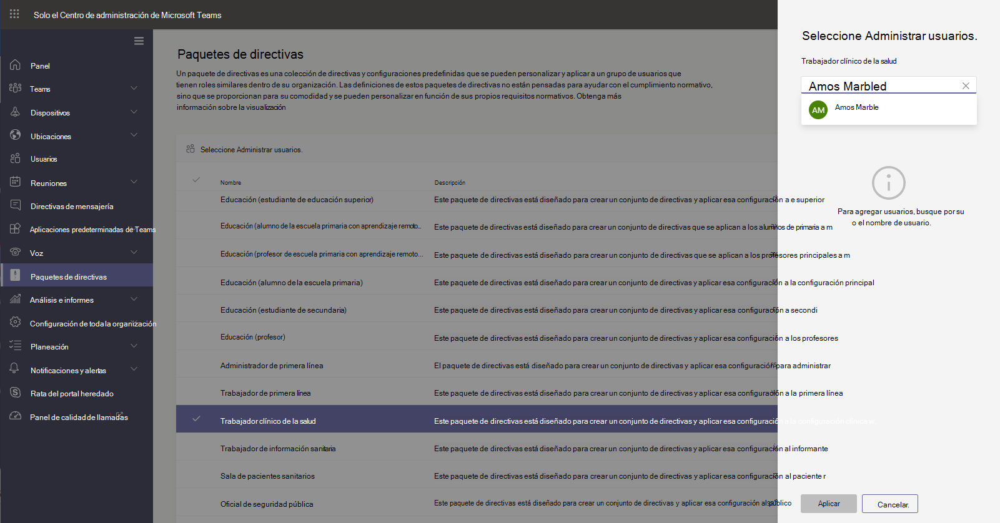

# Paquetes de directivas de Teams para el cuidado de la saludTeams policy packages for healthcare

## Información generalOverview

Un [paquete de directivas](manage-policy-packages.md) de Microsoft Teams es una colección de directivas y opciones de directiva predefinidas que puede asignar a los usuarios que tienen roles similares en su organización.A [policy package](manage-policy-packages.md) in Microsoft Teams is a collection of predefined policies and policy settings that you can assign to users who have similar roles in your organization. Los paquetes de directivas simplifican y ayudan a proporcionar consistencia al administrar directivas.Policy packages simplify, streamline, and help provide consistency when managing policies. Puede personalizar la configuración de las directivas en el paquete para satisfacer las necesidades de los usuarios.You can customize the settings of the policies in the package to suit the needs of your users. Al cambiar la configuración de las directivas en un paquete de directivas, todos los usuarios asignados a ese paquete obtienen la configuración actualizada.When you change the settings of policies in a policy package, all users who are assigned to that package get the updated settings. Puede administrar paquetes de directivas mediante el centro de administración de Microsoft Teams o PowerShell.You can manage policy packages by using the Microsoft Teams admin center or PowerShell.

Los paquetes de directivas predefinen directivas para los siguientes elementos, según el paquete:Policy packages pre-define policies for the following, depending on the package:

- ReunionesMeetings
- Eventos en directoLive events
- LlamadasCalling
- Mensajería Messaging
- EquiposTeams
- Configuración de la aplicaciónApp setup

Teams actualmente incluye los siguientes paquetes de política de cuidado de la salud.Teams currently includes the following healthcare policy packages.

|Nombre del paquete en el centro de administración de Microsoft TeamsPackage name in the Microsoft Teams admin center|Recomendado paraBest used for|DescripciónDescription |
|---------|---------|---------|
|Trabajador clínico de sanidadHealthcare clinical worker  |Trabajadores clínicos de su organización de saludClinical workers in your healthcare organization  |Crea un conjunto de directivas y configuraciones de directivas que proporcionan a los trabajadores clínicos como enfermeras registradas, enfermeras, médicos y trabajadores sociales acceso completo a chats, llamadas, administración de turnos y reuniones.Creates a set of policies and policy settings that give clinical workers such as registered nurses, charge nurses, physicians, and social workers full access to chat, calling, shift management, and meetings. |
|Trabajador de información de asistencia sanitariaHealthcare information worker  |Trabajadores de la información en su organización de la saludInformation workers in your healthcare organization |Crea un conjunto de directivas y opciones de directiva que ofrecen a trabajadores de la información como personal de ti, personal de informática, personal de finanzas y funcionarios de cumplimiento, acceso completo a chats, llamadas y reuniones.Creates a set of policies and policy settings that give information workers such as IT personnel, informatics staff, finance personnel, and compliance officers, full access to chat, calling, and meetings.|
|Sala de pacientes sanitariosHealthcare patient room  |Dispositivos de sala de pacientesPatient room devices|Crea un conjunto de directivas y parámetros de directivas que se aplican a las salas de pacientes de su organización de salud.Creates a set of policies and policy settings that apply to patient rooms in your healthcare organization.|

A cada directiva individual se le da el nombre del paquete de directivas para que pueda identificar fácilmente las directivas vinculadas a un paquete de directivas.Each individual policy is given the name of the policy package so you can easily identify the policies that are linked to a policy package. Por ejemplo, cuando se asigna el paquete de política de trabajadores de salud clínica a médicos de su organización, se crea una directiva llamada Healthcare_ClinicalWorker para cada Directiva del paquete.For example, when you assign the Healthcare clinical worker policy package to clinicians in your organization, a policy named Healthcare_ClinicalWorker is created for each policy in the package.

## Administrar los paquetes de directivas Manage policy packages

### VerView

Vea la configuración de cada directiva en un paquete de directivas antes de asignar un paquete.View the settings of each policy in a policy package before you assign a package. En el centro de navegación izquierdo del centro de administración de Microsoft Teams, seleccione **paquetes de directivas**, seleccione el nombre del paquete y, a continuación, seleccione el nombre de la Directiva.In the left navigation of the Microsoft Teams admin center, select **Policy packages**, select the package name, and then select the policy name.

Decida si los valores predefinidos son adecuados para su organización o si necesita personalizarlos para que sean más restrictivos o flexibles según las necesidades de su organización.Decide whether the predefined values are appropriate for your organization or whether you need to customize them to be more restrictive or lenient based on your organization's needs.

### PersonalizarCustomize

Personalice la configuración de las directivas en el paquete de directivas según sea necesario para adaptarse a las necesidades de su organización.Customize the settings of policies in the policy package, as needed, to fit the needs of your organization. Los cambios que realice en la configuración de la Directiva se aplican automáticamente a los usuarios que tienen asignado el paquete.Any changes you make to policy settings are automatically applied to users who are assigned the package. Para editar la configuración de una directiva en un paquete de directivas, en el centro de administración de Microsoft Teams, seleccione el paquete de directivas, seleccione el nombre de la Directiva que desea editar y, después, haga clic en **Editar**.To edit the settings of a policy in a policy package, in the Microsoft Teams admin center, select the policy package, select the name of the policy you want to edit, and then select **Edit**.

Tenga en cuenta que también puede cambiar la configuración de las directivas en un paquete después de asignar el paquete de directivas.Keep in mind that you can also change the settings of policies in a package after you assign the policy package. Para obtener más información, consulte [personalizar directivas en un paquete de directivas](manage-policy-packages.md#customize-policies-in-a-policy-package).To learn more, see [Customize policies in a policy package](manage-policy-packages.md#customize-policies-in-a-policy-package). 

### AsignarAssign

Asignar el paquete de directivas a los usuarios.Assign the policy package to users. Para asignar un paquete de directivas a uno o varios usuarios, haga clic en **administrar usuarios**.To assign a policy package to one or multiple users, click **Manage users**. También puede usar PowerShell para asignar un paquete de directivas a lotes grandes de usuarios.You can also use PowerShell to assign a policy package to large batches of users. Para conocer los pasos sobre cómo asignar un paquete de directivas, consulte [asignar un paquete de directivas](manage-policy-packages.md#assign-a-policy-package).For steps on how to assign a policy package, see [Assign a policy package](manage-policy-packages.md#assign-a-policy-package).

Si un usuario tiene asignada una directiva y posteriormente asigna otra, la asignación más reciente tendrá prioridad.If a user has a policy assigned, and then later you assign a different policy, the most recent assignment will take priority.

## Temas relacionadosRelated topics

[Administrar los paquetes de directivas para TeamsManage policy packages in Teams](manage-policy-packages.md)

[Asignar directivas a los usuarios de TeamsAssign policies to your users in Teams](assign-policies.md)
