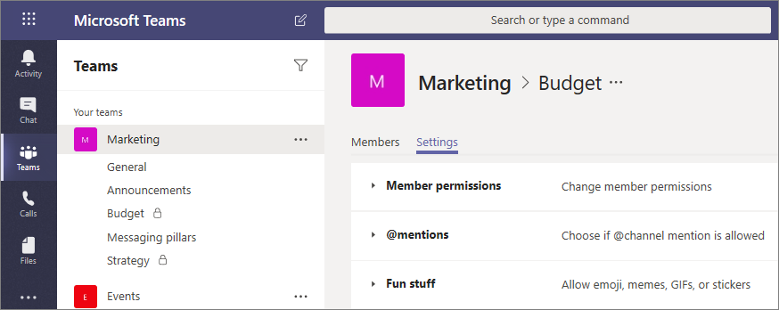

# Canales privados en Microsoft Teams

Los canales privados de Microsoft Teams crean espacios prioritarios para la colaboración de los equipos. Solo los usuarios del equipo que sean propietarios o miembros del canal privado podrán acceder al canal. Cualquier persona, incluidos los invitados, puede agregarse como miembro de un canal privado siempre y cuando ya sean miembros del equipo.

Un canal privado puede ser útil para limitar la colaboración a solo aquellos usuarios que necesitan conocer una información o para facilitar la comunicación entre un grupo de personas asignadas a un proyecto específico, sin tener que crear un equipo adicional para administrar.

Por ejemplo, un canal privado es útil en estos escenarios:

- Un grupo de personas en un equipo desean un espacio prioritario para colaborar sin tener que crear un equipo independiente.
- Un subconjunto de usuarios de un equipo desea un canal privado para analizar información confidencial, como presupuestos, reabastecimiento, colocación estratégica, etc.

Un icono de bloqueo indica un canal privado. Solo los miembros de canales privados pueden ver y participar en canales privados a los que se agregan.

Cuando se crea un canal privado, está vinculado al equipo principal y no se puede mover a un equipo diferente. Además, los canales privados no se pueden convertir en canales estándar, y viceversa.

## Creación de canales privados

De forma predeterminada, los miembros del equipo o el propietario del equipo pueden crear un canal privado. Los invitados no pueden crear canales privados. La capacidad de crear canales privados se puede administrar en el nivel del equipo y en el nivel de la organización. Use [directivas](teams-policies.md) para controlar los usuarios de su organización que pueden crear canales privados. Una vez que haya establecido las directivas, los propietarios del equipo pueden desactivar o activar la posibilidad de que los miembros creen canales privados en la pestaña **configuración** de un equipo.

La persona que crea un canal privado es el propietario del canal privado y solo el propietario del canal privado puede agregar o quitar personas directamente. El propietario de un canal privado puede agregar cualquier miembro del equipo a un canal privado que haya creado, incluyendo invitados. Los miembros de un canal privado tienen un espacio de conversación seguro, y cuando se agregan nuevos miembros, pueden ver todas las conversaciones (incluso las conversaciones antiguas) en ese canal privado.

Los propietarios del equipo pueden ver los nombres de todos los canales privados de su equipo y también pueden quitar cualquier canal privado del equipo. (Los canales privados eliminados se pueden restaurar en un plazo de 30 días después de su eliminación). Los propietarios del equipo no pueden ver los archivos en un canal privado o en las conversaciones y la lista de miembros de un canal privado, a menos que sean miembros de ese canal privado.

Los miembros del equipo solo pueden ver los canales privados a los que se hayan agregado.

## Agregar y quitar propietarios y miembros

El propietario de un canal privado no se puede eliminar a través del cliente Teams si es el último propietario de uno o más canales privados.

Si un propietario de un canal privado abandona su organización o se ha quitado del grupo de Microsoft 365 asociado al equipo, un miembro del canal privado se promueve automáticamente al propietario del canal privado.

Si un miembro del equipo lo abandona o es quitado de un equipo, también abandonará o se quitará de todos los canales privados del equipo. Si el usuario se vuelve a agregar al equipo, tiene que volver a agregarse a los canales privados del equipo.

## Configuración del propietario del canal

Cada canal privado tiene su propia configuración que puede administrar el propietario del canal, incluida la capacidad de agregar y quitar miembros, agregar pestañas y @mentioning para todo el canal. Estas opciones son independientes de la configuración del equipo principal. Cuando se crea un canal privado, hereda la configuración del equipo principal, tras lo cual se pueden cambiar las configuraciones independientemente de la configuración del equipo principal.

El propietario del canal privado puede hacer clic en **Administrar canal** y, después, usar las pestañas **Miembros** y **Configuración** para agregar o quitar miembros y editar la configuración.

## Acciones para miembros y propietarios de canales privados

En la siguiente tabla se describen las acciones que los propietarios, miembros e invitados pueden hacer en canales privados.

|Acción  |Propietario del equipo|Integrante de grupo|Invitado de equipo|Propietario del canal privado|Miembro de canal privado|Invitado de canal privado|
|---------|---------|---------|---------|---------|---------|---------|
|Crear un canal privado|Controlada por el administrador|Administrador y propietario del equipo controlado|No|N/D|N/D|N/D|
|Quitar canal privado|Sí|No|No|Sí|No|No|
|Abandonar canal privado|N/D|N/D|N/D|Sí, a menos que sean el último propietario|Sí|Sí|
|Editar canal privado|No|N/D|N/D|Sí|No|No|
|Restaurar el canal privado eliminado|Sí|No|No|Sí|No|No|
|Agregar miembros|No|N/D|N/D|Sí|No|No|
|Editar la configuración|No|N/D|N/D|Sí|No|No|
|Administrar pestañas y aplicaciones|No|N/D|N/D|Sí, las aplicaciones deben estar instaladas para el equipo|Controlado por el propietario del canal|No|

## Administrar el ciclo de vida de los canales privados

Consulte [administrar el ciclo de vida de los canales privados en Teams](private-channels-life-cycle-management.md) para obtener instrucciones sobre cómo administrar el ciclo de vida de los canales privados de su organización. Esto incluye cómo controlar si los usuarios de su organización pueden crear canales privados, cómo crear un canal privado en nombre de un propietario del equipo, cómo obtener una lista de todos los mensajes de canales privados para propósitos de archivado y auditoría, y otras tareas de administración.  

## Sitios de SharePoint de canal privado

Cada canal privado tiene su propio sitio de SharePoint. El sitio independiente es asegurarse de que el acceso a los archivos de canal privado está restringido solo a miembros del canal privado. Estos sitios se crean con una biblioteca de documentos de forma predeterminada y se pueden mejorar fácilmente en un sitio completo mediante la [interfaz de administración de sitios](https://support.office.com/article/A2F2A5C2-093D-4897-8B7F-37F86D83DF04). Cada sitio se crea en la misma región geográfica que el sitio para el equipo principal. Estos sitios livianos tienen un identificador de plantilla personalizado, "TEAMCHANNEL # 0", para facilitar la administración mediante la API de PowerShell y Graph.

Un sitio de canal privado sincroniza la clasificación de datos y hereda los permisos de acceso de invitado del sitio del equipo principal. La pertenencia al propietario del sitio y a los grupos de miembros se mantiene sincronizada con la pertenencia al canal privado de Teams. Cualquier cambio en la pertenencia al propietario o los grupos de miembros de SharePoint se revertirá a la pertenencia a un canal privado en un plazo de cuatro horas. En escenarios donde ciertos usuarios necesitan acceder a documentos sin necesidad de acceder a mensajes de canales privados, agréguelos al grupo visitantes del sitio o a un grupo nuevo que sea independiente de los propietarios y miembros.

Teams administra el ciclo de vida del sitio del canal privado. Si el sitio se elimina fuera de Teams, un trabajo en segundo plano restaura el sitio dentro de un plazo de cuatro horas, siempre y cuando el canal privado aún esté activo. Si el sitio se elimina permanentemente, se aprovisiona un sitio nuevo para el canal privado.

Si se restaura un canal privado o un equipo que contiene un canal privado, los sitios se restauran con él. Si se restaura un sitio de canal privado y esta fuera de la ventana de eliminación de software de 30 días para el canal privado, el sitio funciona como un sitio independiente.

## Registros de cumplimiento de mensajes de canal privado

Los registros de los mensajes enviados en un canal privado se entregan en el buzón de todos los miembros del canal privado, en lugar de hacerlo en un buzón de grupo. Los títulos de los registros tienen un formato que indica desde qué canal privado fueron enviados.

Para obtener más información sobre cómo realizar búsquedas en eDiscovery para mensajes de canal privado, consulte [eDiscovery de canales privados](ediscovery-investigation.md#ediscovery-of-private-channels).

## Consideraciones sobre el acceso a archivos en canales privados

Cuando se crea un nuevo Bloc de notas de OneNote en un canal privado, los usuarios adicionales aún pueden obtener acceso al bloc de notas, ya que este es el mismo comportamiento que comparte el acceso a cualquier otro elemento de un sitio de SharePoint de canal privado con un usuario.

Si se concede acceso a un usuario a un bloc de notas en un canal privado a través de SharePoint, al quitarlo del equipo o el canal privado, no se eliminará el acceso del usuario al bloc de notas.

Si se agrega un bloc de notas existente como una pestaña a un canal privado, no se cambiará el acceso al canal privado y el Bloc de notas conservará los permisos existentes.

## Limitaciones del canal privado

Actualmente, los canales privados son compatibles con conectores y pestañas (excepto Stream, Planner y Forms). Estamos trabajando para brindarle soporte completo de aplicaciones para canales privados, incluidas extensiones de mensajería y bots.

Cada equipo puede tener un máximo de 30 canales privados y cada canal privado puede tener un máximo de 250 miembros. El límite de 30 canales privados es adicional al límite de 200 canales estándar por equipo. 

Al crear un equipo a partir de un equipo existente, los canales privados del equipo existente no se copiarán.

## Temas relacionados

[Información general de los equipos y canales en Microsoft Teams](teams-channels-overview.md)

[Información general de PowerShell para Teams](teams-powershell-overview.md)

[Usar la API de Microsoft Graph para trabajar con Microsoft Teams](https://docs.microsoft.com/graph/api/resources/teams-api-overview)
