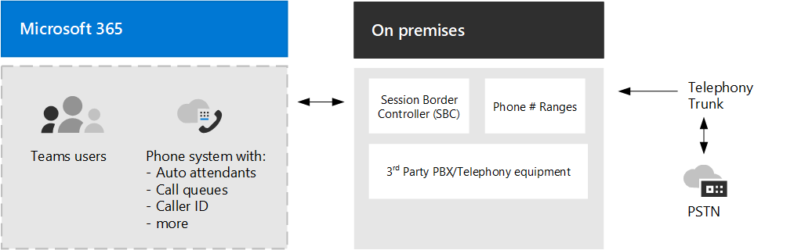

# Opciones de conectividad RTC

Microsoft proporciona funcionalidades completas de Exchange de sucursales privadas (PBX) para su organización a través de Sistema telefónico. Sin embargo, para permitir a los usuarios realizar llamadas fuera de su organización, debe conectarse Sistema telefónico a la red telefónica conmutada (RTC).

Este artículo se centra en las opciones de conectividad RTC. Para obtener más información sobre las soluciones de voz de Microsoft, incitar a los detalles sobre Sistema telefónico características, vea Planear su [Teams de voz.](cloud-voice-landing-page.md)

Para conectar Sistema telefónico a la RTC, puede elegir entre las siguientes opciones:

- [**Plan de llamadas**](#phone-system-with-calling-plan). Una solución todo en la nube con Microsoft como operador rtc.

- [**Operador Conectar**](#phone-system-with-operator-connect), que actualmente solo está disponible en **versión preliminar pública.**  Con operador Conectar, si su operador existente es un participante en el programa operador de Microsoft Conectar, pueden administrar las llamadas RTC y los controladores de borde de sesión (SBC). 

- [**Enrutamiento directo**](#phone-system-with-direct-routing), que le permite usar su propio operador RTC conectando los controladores de borde de sesión (SBC) a Sistema telefónico.

También puede elegir una combinación de opciones, que le permite diseñar una solución para un entorno complejo o administrar una migración de varios pasos.

Tenga en cuenta que la opción o las opciones que elija afectan a la configuración de Sistema telefónico características. Para obtener más información, vea [Consideraciones de configuración](#configuration-considerations) más adelante en este artículo.

## Sistema telefónico con plan de llamadas 

Sistema telefónico con Plan de llamadas es la solución de voz de Microsoft en la nube para Teams usuarios. Esta es la opción más sencilla que se conecta Sistema telefónico a la RTC. Con esta opción, Microsoft actúa como su operador RTC, como se muestra en el siguiente diagrama:

Si responde sí a lo siguiente, Sistema telefónico con Plan de llamadas es la solución adecuada para usted:

- Plan de llamadas está disponible en su región.
- No es necesario conservar el operador RTC actual.
- Desea usar el acceso administrado por Microsoft a la RTC.

Con esta opción: 

- Obtiene un Teléfono Microsoft con planes de llamadas nacionales o internacionales agregados que permiten llamar a teléfonos de todo el mundo (dependiendo del nivel de servicio que se esté autorizando).

- No necesita la implementación o el mantenimiento de una implementación local porque el plan de llamadas funciona &mdash; sin Microsoft 365.

- Nota: Si es necesario, puede elegir conectar un controlador de borde de sesión (SBC) compatible a través del enrutamiento directo para la interoperabilidad con PBX de terceros, dispositivos analógicos y otros equipos de telefonía de terceros compatibles con el SBC.

Esta opción requiere una conexión ininterrumpida a Microsoft 365.

Para obtener más información sobre el plan de llamadas, vea los artículos siguientes:

- [¿Qué plan de llamada es adecuado para usted?](calling-plan-landing-page.md)
- [Cómo comprar un plan de llamadas](calling-plans-for-office-365.md)
- [Países y regiones donde el Plan de llamadas está disponible](./country-and-region-availability-for-audio-conferencing-and-calling-plans/country-and-region-availability-for-audio-conferencing-and-calling-plans.md)
- [Configurar plan de llamadas](set-up-calling-plans.md)

## Sistema telefónico con operador Conectar

Con Operador Conectar, actualmente en versión preliminar pública, si su operador existente es un participante en el programa Operador de Microsoft Conectar, puede administrar el servicio para llevar llamadas RTC Teams. Su operador administra los servicios de llamadas RTC y los controladores de borde de sesión (SBC), lo que le permite ahorrar en la compra y administración de hardware.

La Conectar operador podría ser la solución adecuada para su organización si:

- Microsoft Calling Plan no está disponible en su ubicación geográfica.
- Su operador preferido es un participante del programa de Conectar microsoft.
- Desea buscar un operador nuevo para habilitar las llamadas en Teams.

Para obtener información sobre las ventajas y requisitos de Operador Conectar, y para obtener una lista de operadores que participan en este programa, vea [Plan operador Conectar](operator-connect-plan.md). Para obtener información sobre cómo configurar el operador Conectar, vea [Configurar operador Conectar](operator-connect-configure.md).

## Sistema telefónico con enrutamiento directo

Esta opción conecta Sistema telefónico a la red de telefonía mediante enrutamiento directo, como se muestra en el siguiente diagrama: 

Si responde sí a las siguientes preguntas, Sistema telefónico enrutamiento directo es la solución adecuada para usted:

- Desea usar Teams con Sistema telefónico.
- Debe conservar el operador RTC actual.
- Desea mezclar el enrutamiento, con algunas llamadas pasando por el Plan de llamadas, otras a través de su operador.
- Necesita interoperar con PBX y/o equipos de terceros, como los paginadores generales, dispositivos analógicos, entre otros.

Con esta opción:

- Conecta su propio controlador de borde de sesión (SBC) compatible con Sistema telefónico sin necesidad de software local adicional.

- Puede usar prácticamente cualquier operador de telefonía con Sistema telefónico.

- Puede configurar y administrar esta opción, o puede configurarla y administrarla su operador o partner (pregunte si su operador o partner proporciona esta opción).

- Puede configurar la interoperabilidad entre los equipos de telefonía, como pbx de terceros y &mdash; dispositivos analógicos &mdash; y Sistema telefónico.

Esta opción requiere lo siguiente:

- Conexión ininterrumpida a Microsoft 365.

- Implementar y mantener un SBC compatible.

- Un contrato con un operador de terceros.
  (A menos que se implemente como una opción para proporcionar conexión a PBX de terceros, dispositivos analógicos u otro equipo de telefonía para los usuarios que están en Sistema telefónico con plan de llamadas).

Para obtener más información sobre enrutamiento directo, vea los artículos siguientes:

- [Planear el enrutamiento directo](direct-routing-plan.md)
- [Configurar el enrutamiento directo](direct-routing-configure.md)
- [Administrar directivas de enrutamiento de voz para su uso con Enrutamiento directo](manage-voice-routing-policies.md)
- [Planear enrutamiento basado en la ubicación para el enrutamiento directo](location-based-routing-plan.md)
- [Lista de controladores de borde de sesión certificados para el enrutamiento directo](direct-routing-border-controllers.md)

## Consideraciones de configuración

La mayoría Sistema telefónico características son las mismas, independientemente de la opción de conectividad RTC que elija. Por ejemplo, la configuración de llamadas sin responder y reenvío, la transferencia de llamadas, la música personalizada en espera, el parque de llamadas, la línea compartida y las aplicaciones de voz están disponibles. Para obtener una lista completa de Sistema telefónico características, vea Esto es lo [que obtiene](here-s-what-you-get-with-phone-system.md)con Sistema telefónico .

Sin embargo, hay algunas diferencias en la funcionalidad que afectan a la forma en que se configuran determinadas Sistema telefónico características. Por ejemplo, enrutamiento directo requiere pasos adicionales para configurar el enrutamiento de llamadas. Como otro ejemplo, Enrutamiento directo proporciona enrutamiento basado en ubicación (LBR) para que pueda restringir la omisión de peaje en determinadas ubicaciones geográficas donde no está permitido. 

En la tabla siguiente se resaltan las diferencias de configuración principales. Las secciones que siguen a la tabla proporcionan vínculos a más información y detalles.

| Opción | Descripción | Teléfono de números | Enrutamiento de llamada | Disponibilidad de llamadas de emergencia |
| :------------| :-------| :-------| :-------| :-------| 
| Planes de llamadas | -Microsoft actúa como operador RTC. -No es necesario comprar o administrar SBC.| Obtenido a través de Microsoft.| -Administrado por Microsoft.   -Admin configura los planes de marcado de usuario para la traducción de números. | -Habilitado por Microsoft.   -Administrador registra direcciones.   -Se admiten llamadas dinámicas. |
| Operador Conectar | -Carrier administra la conectividad RTC y los SBC.   -No es necesario comprar o administrar SBC. | -Obtenido a través del operador.   - Números asociados a direcciones de emergencia administradas por el operador.  | -Administrado por el operador.  -Admin configura los planes de marcado de usuario para la traducción de números. | -Habilitado por el operador.   -Administrador registra direcciones.   -Se admiten llamadas dinámicas. |
| Enrutamiento directo | -Requiere SBC certificado comprado a un proveedor de terceros. -Conectar su SBC para Sistema telefónico.  -Use el operador RTC existente. | Obtenido a través del operador. | -Requiere una configuración adicional por parte del administrador. -Admin configura los planes de marcado troncal para la traducción de números.  -LBR disponible para restringir la omisión de peaje. | -Requiere una configuración adicional por parte del administrador.  -Las direcciones registradas no son compatibles.  -Las llamadas dinámicas son compatibles, pero requieren una configuración adicional. |
|||||

### Teléfono de números

Microsoft tiene dos tipos de números de teléfono disponibles: números de suscriptor (usuario), que se pueden asignar a los usuarios de su organización, y números de servicio, disponibles como números de servicio gratuitos y de pago. Los números de servicio tienen mayor capacidad de llamada simultánea que los números de suscriptor y se pueden asignar a servicios como Audioconferencia, Operadores automáticos o Colas de llamadas.

Tendrá que decidir lo siguiente:

- ¿Qué ubicaciones de usuario necesitan nuevos números de teléfono de Microsoft?
- ¿Qué tipo de número de teléfono (suscriptor o servicio) necesito?
- ¿Cómo puedo portabilidad de números de teléfono existentes a Teams?

La forma en que adquiere y administra los números de teléfono varía en función de la opción de conectividad RTC.

- Para obtener información sobre cómo administrar números de teléfono para el plan de llamadas, vea [Administrar números de teléfono para su organización.](manage-phone-numbers-for-your-organization/manage-phone-numbers-for-your-organization.md)

- Para obtener información sobre cómo administrar números de teléfono con Conectar operador, vea Configurar números de teléfono con [operador Conectar](operator-connect-configure.md#set-up-phone-numbers).

- Para obtener información sobre cómo administrar números de teléfono para enrutamiento directo, vea Configurar el número de teléfono y habilitar la voz y el correo [de voz empresariales.](direct-routing-enable-users.md#configure-the-phone-number-and-enable-enterprise-voice-and-voicemail-online)

### Planes de marcado y enrutamiento de llamadas

La forma de configurar el enrutamiento de llamadas varía en función de la opción de conectividad RTC.  

- En el caso de los planes de llamadas, la mayor parte del enrutamiento de llamadas se administra mediante la infraestructura del Plan de llamadas de Microsoft. Configure los planes de marcado de usuario para fines de traducción de números para la autorización de llamadas y el enrutamiento de llamadas. Para obtener más información, vea [¿Qué son los planes de marcado?](what-are-dial-plans.md).

- En el Conectar operador, el operador administra la mayor parte del enrutamiento de llamadas.  Configure los planes de marcado de usuario para fines de traducción de números para la autorización de llamadas y el enrutamiento de llamadas. Para obtener más información, vea [¿Qué son los planes de marcado?](what-are-dial-plans.md).

- Para enrutamiento directo, debe configurar el enrutamiento de llamadas especificando las rutas de voz y asignando directivas de enrutamiento de voz a los usuarios. Puede configurar los planes de marcado para la traducción de números en el nivel de tronco para garantizar la interoperabilidad con los controladores de borde de sesión (SBC). Para obtener más información, vea Configurar enrutamiento [de voz para enrutamiento](direct-routing-voice-routing.md)directo, Administrar directivas de enrutamiento [de](manage-voice-routing-policies.md) voz y Traducir números [de teléfono.](direct-routing-translate-numbers.md) 

### Location-Based enrutamiento directo

En algunos países y regiones, es ilegal omitir el operador RTC para reducir los costos de llamadas de larga distancia. Location-Based enrutamiento automático (LBR) para enrutamiento directo le permite restringir la omisión de peaje para Teams usuarios en función de su ubicación geográfica. Para obtener más información sobre cómo planear y configurar LBR, vea los siguientes artículos:

- [Planear enrutamiento basado en la ubicación para el enrutamiento directo](location-based-routing-plan.md)
- [Configuración de red de enrutamiento basado en la ubicación](location-based-routing-configure-network-settings.md)
- [Habilitar enrutamiento basado en la ubicación para el enrutamiento directo](location-based-routing-enable.md)
- [Caso práctico de Contoso: Location-Based enrutamiento](voice-case-study-location-based-routing.md) 
  Describe cómo una corporación multinacional ficticia, Contoso, implementó Location-Based enrutamiento para su organización.

### Llamadas de emergencia

La forma en que configura las llamadas de emergencia varía en función de la opción de conectividad RTC.

- Para el Plan de llamadas, cada usuario se habilita automáticamente para las llamadas de emergencia y es necesario que tenga una dirección de emergencia registrada asociada con su número de teléfono asignado. Se admiten las llamadas de emergencia dinámicas (basadas en la ubicación del Teams cliente).  

- En el caso de Conectar operador, cada usuario está habilitado automáticamente para las llamadas de emergencia y es necesario que tenga una dirección de emergencia registrada asociada con su número de teléfono asignado, pero solo el partner del operador puede establecerlo. Se admiten las llamadas de emergencia dinámicas (basadas en la ubicación del Teams cliente).

- Para enrutamiento directo, debe definir directivas de llamadas de emergencia para los usuarios mediante una directiva de enrutamiento de llamadas de emergencia de Teams (TeamsEmergencyCallRoutingPolicy) para definir los números de emergencia y su destino de enrutamiento asociado. Las ubicaciones de emergencia registradas no son compatibles con los usuarios de Enrutamiento directo. Para las llamadas de emergencia dinámicas, se requiere una configuración adicional para el enrutamiento de llamadas de emergencia y, posiblemente, para la conectividad de partners.

Para obtener más información sobre conceptos y terminología de llamadas de emergencia y cómo configurar las llamadas de emergencia y las llamadas de emergencia dinámicas, vea los siguientes artículos:

- [Administrar llamadas de emergencia](what-are-emergency-locations-addresses-and-call-routing.md)
- [Planear y configurar las llamadas de emergencia dinámicas](configure-dynamic-emergency-calling.md)
- [Administrar directivas de llamadas de emergencia](manage-emergency-calling-policies.md)
- [Administrar directivas de enrutamiento de llamadas de emergencia para enrutamiento directo](manage-emergency-call-routing-policies.md)
- [Caso práctico de Contoso: Llamadas de emergencia](voice-case-study-emergency-calling.md) 
  Describe cómo una corporación multinacional ficticia, Contoso, implementó llamadas de emergencia para su organización.

### Topología de red para características de voz

Si va a implementar llamadas de emergencia dinámicas o Location-Based enrutamiento directo, debe configurar la configuración de red para usarla con estas características en Microsoft Teams. Para obtener información sobre cómo configurar la configuración de red para regiones de red, sitios de red, subredes de red y direcciones IP de confianza, vea los siguientes artículos:

- [Configuración de red para las características de voz en la nube Microsoft Teams: conceptos y terminología](cloud-voice-network-settings.md)
- [Administre la topología de red para las características de voz en la nube en Microsoft Teams](manage-your-network-topology.md)

