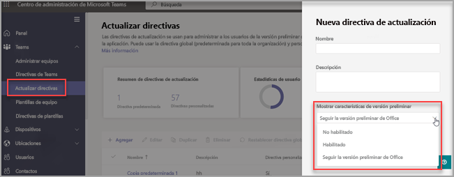

# <a name="microsoft-teams-public-preview"></a>Versión preliminar pública en Microsoft Teams

> [!NOTE] 
> Es posible que las características de la versión preliminar no estén completas y experimenten cambios antes de que estén disponibles en la versión pública. Se ofrecen solo para fines de evaluación y exploración. Las características de la versión preliminar no están admitidas en Office 365 Government Community Cloud (GCC).

La versión preliminar pública de Microsoft Teams ofrece acceso anticipado a características no publicadas en Teams. Las versiones preliminares le permiten explorar y probar características futuras. También agradecemos sus comentarios sobre cualquier característica de la versión preliminar pública. La versión preliminar pública se habilita independientemente para cada usuario de Teams, por lo que no tiene que preocuparse de que afecte a toda la organización.

Para una lista de lo que hay disponible en la versión preliminar pública, visite [Notas técnicas de la versión preliminar pública de Microsoft Teams](https://techcommunity.microsoft.com/t5/microsoft-teams-public-preview/bd-p/MicrosoftTeamsPublicPreview), [Notas de la versión para las características de administradores de Teams](/OfficeUpdates/teams-admin), y [Novedades de Teams](https://support.microsoft.com/office/what-s-new-in-microsoft-teams-d7092a6d-c896-424c-b362-a472d5f105de).

## <a name="set-the-update-policy"></a>Configure la directiva de actualización

La versión preliminar pública se habilita independientemente para cada usuario y la opción para activarla se controla con una directiva de administración. Las directivas de actualización se usan para administrar qué usuarios de la versión preliminar de Teams y Office verán las características de la versión preliminar de la aplicación Teams. Puede usar la directiva global (predeterminada para toda la organización) y personalizarla, o bien crear una o varias directivas personalizadas para sus usuarios. La directiva debe asignarse a usuarios específicos porque no sobrescribe la directiva global.

1. Inicie sesión en el [Centro de administración de Microsoft Teams](https://admin.teams.microsoft.com/).

2. Seleccione **Teams** > **Directivas de actualización de Teams**.

1. Seleccione **Agregar** para crear una nueva directiva o seleccione una ya existente para abrir **Directiva de actualización**.

2. Asigne un nombre a la directiva de actualización, agregue una descripción y seleccione el valor para **Mostrar características de versión preliminar**.

   -   **Seguir Office Preview** (predeterminado)
       - Esta nueva opción predeterminada habilitará automáticamente las características de vista previa pública de Teams para cualquier usuario inscrito en el canal actual de Office (versión preliminar). 
       - El usuario final no necesita hacer nada más.
   -   **Habilitado**
       - Esta opción habilita la vista previa pública de Teams independientemente de si un usuario está inscrito en el canal actual de Office (versión preliminar). 
       - El usuario final también debe optar por la versión preliminar pública de Teams en su aplicación de Teams.

   > [!NOTE]  
   > Para los usuarios de la versión preliminar pública de Teams que NO estén en el **Canal actual (versión preliminar)**, los administradores de TI deberán cambiar la opción predeterminada **Seguir la versión preliminar de Office** a **Habilitado**.
 
   - **No habilitado** 
     - Las características de la versión preliminar pública de Teams no estarán disponibles para los usuarios finales.

      

También puede establecer la directiva mediante PowerShell con el cmdlet `Set-CsTeamsUpdateManagementPolicy` con el parámetro `-AllowPublicPreview` .

## <a name="enable-public-preview"></a>Habilite la versión preliminar pública

Para habilitar la versión preliminar pública en un cliente de escritorio o cliente web, siga los siguientes pasos:

1. Seleccione los tres puntos a la izquierda de su perfil para mostrar el menú Teams.
2. Seleccione **Acerca de** > **Versión preliminar pública**.
3. Seleccione **Cambiar a la Versión preliminar pública**.

> [!NOTE]  
> Esta opción solo está disponible cuando **Mostrar características de la versión preliminar** está **Habilitado**.

### <a name="public-preview-for-microsoft-teams-rooms-on-windows"></a>Versión preliminar pública de las Salas de Microsoft Teams en Windows

La versión preliminar pública está desactivada de forma predeterminada. Cuando la versión preliminar pública está activada, los usuarios finales tienen acceso a las funciones que están en la versión preliminar pública en las salas de Teams habilitadas. Para activar la versión preliminar pública, agregue ```<EnablePublicPreview>True</EnablePublicPreview>``` a su archivo de configuración XML.

Recomendamos inscribir entre 5 y 10 dispositivos en la versión preliminar pública. 

Todas las características de la versión preliminar pública se anuncian en la versión preliminar pública de [Microsoft Teams - Microsoft Tech Community ](https://techcommunity.microsoft.com/t5/microsoft-teams-public-preview/bd-p/MicrosoftTeamsPublicPreview)

## <a name="teams-now-follows-office-preview-users"></a>Teams ahora sigue a los usuarios de Office Preview

La nueva directiva global predeterminada de **Follow Office Preview** permitirá a los usuarios estar automáticamente en el canal de vista previa pública de Teams si están en el canal actual (versión preliminar) para el cliente de Office 365 en Windows y Mac.

Microsoft Office seguirá recibiendo actualizaciones del Canal actual (versión preliminar) y el cliente de Teams recibirá actualizaciones a través del canal de la versión preliminar pública. Esta directiva NO cambiará los canales de Office en función de los canales de Teams. 

**¿Cómo conservar los usuarios existentes de la versión preliminar de Teams que NO usan el Canal actual de Office (versión preliminar)?**

Para aquellos usuarios con permiso para decidir si participan o no en la versión preliminar pública de Teams que deseen mantener esa configuración en su estado actual, deberá cambiar el nuevo valor predeterminado, **Seguir la versión preliminar de Office**, a **Habilitado** (consulte [Establecer la directiva de actualización](#set-the-update-policy))

**¿Cómo desactivar esta configuración?**

Puede deshabilitar la configuración desde el Centro de administración de Teams estableciendo **Seguir la versión preliminar de Office** en **No habilitado** (consulte [Establecer la directiva de actualización](#set-the-update-policy))

## <a name="related-topics"></a>Temas relacionados

[Versión preliminar pública para desarrolladores](/microsoftteams/platform/resources/dev-preview/developer-preview-intro)
