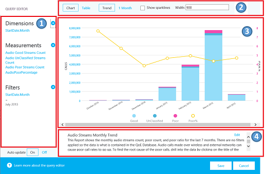

# Calidad de experiencia consulte la GuíaQuality of Experience Review Guide

Esta guía es acerca de la fase de valor de unidad para Microsoft Teams y Skype para profesionales en línea.This guide is about the Drive Value phase for Microsoft Teams and Skype for Business Online. Puede [descargar una versión de Word](https://github.com/MicrosoftDocs/OfficeDocs-SkypeForBusiness/blob/live/Teams/downloads/quality-of-experience-review-guide.docx?raw=true) de esta guía.You can [download a Word version](https://github.com/MicrosoftDocs/OfficeDocs-SkypeForBusiness/blob/live/Teams/downloads/quality-of-experience-review-guide.docx?raw=true) of this guide.

## IntroducciónIntroduction

Para que el mayor impacto sobre cómo mejorar la experiencia del usuario, las organizaciones necesitan que controle las áreas clave que se muestran en la ilustración siguiente.To have the greatest impact on improving the user experience, organizations need to operationalize the key areas that are shown in the following figure.
Áreas adicionales incluyen la identificación de las tareas operativas, establecimiento de los objetivos de métricas de calidad, determinar las métricas para utilizar para medir el éxito organizativo y áreas de investigación de restricción según sea necesario.Additional areas include identifying operational tasks, establishing targets for quality metrics, ascertaining the metrics to use to gauge organizational success, and narrowing areas of investigation as needed.

_En la figura 1 - áreas operativas clave tratadas a lo largo de este documento__Figure 1 - Key operational areas covered throughout this document_

Al continuamente evaluar y solucionar relativos a las áreas que se describen en este documento, puede reducir su potencial de afectar negativamente a la calidad de la experiencia de los usuarios.By continually assessing and remediating the areas described in this document, you can reduce their potential to negatively affect the quality of your users’ experience. Mayoría de experiencia de usuario los problemas encontrada en una implementación puede agruparse en las siguientes categorías:Most user-experience problems encountered in a deployment can be grouped into the following categories:

-   Configuración de firewall o proxy incompletoIncomplete firewall or proxy configuration

-   Cobertura Wi-Fi deficientePoor Wi-Fi coverage

-   Ancho de banda insuficienteInsufficient bandwidth

-   VPNVPN

-   Versiones de cliente incoherentes o no actualizadaInconsistent or outdated client versions

-   Dispositivos de audio integrados o no optimizadosUnoptimized or built-in audio devices

-   Subredes problemáticas o dispositivos de redProblematic subnets or network devices

A través de planear y diseñar correctamente antes de implementar los equipos o Skype para profesionales en línea, puede reducir la cantidad de esfuerzo que será necesarios para mantener experiencias de alta calidad.Through proper planning and design before deploying Teams or Skype for Business Online, you can reduce the amount of effort that will be required to maintain high-quality experiences.

Esta guía se centra en usar el panel de calidad de llamadas (CQD) Online como la principal herramienta para notificar e investigar cada área, con especial hincapié en audio para maximizar la adopción y el impacto.This guide focuses on using the Call Quality Dashboard (CQD) Online as the primary tool to report and investigate each area, with a special emphasis on audio to maximize adoption and impact. Todas las mejoras realizadas a la red para mejorar la experiencia de audio traducirá también directamente a las mejoras en uso compartido de escritorio y de vídeo.Any improvements made to the network to improve the audio experience will also directly translate to improvements in video and desktop sharing.

Para acelerar la evaluación, se proporcionan dos plantillas CQD curated: uno para administrar todas las redes y la otra se filtra como administrado sólo redes (internas).To accelerate your assessment, two curated CQD templates are provided: one for managing all networks and the other is filtered for managed (internal) networks only. Aunque los informes de la plantilla de todas las redes están configurados para mostrar la creación y la información de red, aún puede usarse mientras trabaja hacia la recopilación y la carga de información de creación.Although the All Networks template reports are configured to display building and network information, it can still be used while you work toward collecting and uploading building information. Cargar información en CQD de compilación, habilita el servicio mejorar la creación de informes mediante la adición de información de creación, la red y la ubicación personalizada mientras diferenciar interno de subredes externas.Uploading building information into CQD enables the service to enhance reporting by adding custom building, network, and location information while differentiating internal from external subnets. Para obtener más información, vea [asignación de creación](#building-mapping) más adelante en este documento.For more information, see [Building mapping](#building-mapping) later in this document.

### ¿Qué es la CQD?What is the CQD?

Use el panel de calidad de llamadas (CQD) para obtener información sobre la calidad de las llamadas realizadas mediante el uso de los equipos y Skype para servicios de negocios.You use the Call Quality Dashboard (CQD) to gain insight into the quality of calls made by using Teams and Skype for Business services. CQD está diseñado para ayudar a Skype para profesionales y los equipos de los administradores y los ingenieros de red optimizan la red.CQD is designed to help Skype for Business and Teams admins and network engineers optimize the network. CQD busca agregada información para una organización completa donde patrones generales pueden convertirse en evidentes, lo que permite personal realizar las evaluaciones informadas de calidad de la llamada.CQD looks at aggregate information for an entire organization where overall patterns can become apparent, allowing staff to make informed assessments of call quality. CQD proporciona informes de métricas de llamada que brindar información sobre la calidad general de las llamadas, llamada de confiabilidad y experiencia del usuario.CQD provides reports of call metrics that give you insight into overall call quality, call reliability, and user experience.

> [!NOTE]
> CQD no contiene información de identificación personal (PII).CQD doesn’t contain any personally identifiable information (PII). PII es información que puede usar en su propio o con otra información para identificar, póngase en contacto con o busque a una sola persona, o para identificar a un individuo en contexto.PII is information that can be used on its own or with other information to identify, contact, or locate a single person, or to identify an individual in context. 

### Público objetivoIntended audience

Este documento está destinado a ser utilizado por las partes interesadas de clientes y socios con funciones como arquitecto o jefe de colaboración, consultor, especialista en administración y adopción de cambio, jefe de soporte técnico y ayuda de asistencia al cliente, potenciales de red, potenciales de escritorio y Admin de TI.This document is intended to be used by partner and customer stakeholders with roles such as Collaboration Lead/Architect, Consultant, Change Management/Adoption Specialist, Support/Help Desk Lead, Network Lead, Desktop Lead, and IT Admin.

Este documento también está pensada para usarse por la champion(s) calidad designada.This document is also intended to be used by the designated quality champion(s).
Para obtener más información, vea [la función de los pesos pesados calidad](https://docs.microsoft.com/MicrosoftTeams/4-envision-plan-my-service-management#the-quality-champion-role).For more information, see [the Quality Champion role](https://docs.microsoft.com/MicrosoftTeams/4-envision-plan-my-service-management#the-quality-champion-role).

## Requisitos previosPrerequisites

Antes de usar a esta guía, asegúrese de que tiene el inquilino adecuados [roles](https://support.office.com/article/About-Office-365-admin-roles-da585eea-f576-4f55-a1e0-87090b6aaa9d) asignados por lo que puede tener acceso a CQD.Before using this guide, make sure you have the proper tenant [roles](https://support.office.com/article/About-Office-365-admin-roles-da585eea-f576-4f55-a1e0-87090b6aaa9d) assigned so that you can access CQD.

-   **Función de administrador Global de office 365:** Tiene acceso a todas las características administrativas en el conjunto de aplicaciones de Office 365 de servicios en el plan, incluyendo Skype para la empresa.**Office 365 Global Administrator role:** Accesses all administrative features in the Office 365 suite of services in your plan, including Skype for Business.

-   **Skype para el rol de administrador empresarial:** Configura Skype para la empresa para su organización y puede ver todos los [informes de actividad](https://support.office.com/article/activity-reports-0d6dfb17-8582-4172-a9a9-aed798150263) en el centro de administración de Office 365.**Skype for Business Administrator role:** Configures Skype for Business for your organization and is able to view all the [activity reports](https://support.office.com/article/activity-reports-0d6dfb17-8582-4172-a9a9-aed798150263) in the Office 365 admin center. Esta función es necesaria, incluso si se implementación sólo los equipos.This role is required even if you deploy only Teams.

Como alternativa, puede asignar la siguiente función a una cuenta de usuario de Office 365 para permitir el acceso a sólo las características de informes.Alternatively, you can assign the following role to an Office 365 user account to allow access to reporting features only.

-   **Lector de informes:** Puede ver todos los [informes de actividad](https://support.office.com/article/activity-reports-0d6dfb17-8582-4172-a9a9-aed798150263) en el centro de administración de Office 365, los informes desde el [paquete de contenido de Office 365 adopción](https://support.office.com/article/Office-365-Adoption-content-pack-77ff780d-ab19-4553-adea-09cb65ad0f1f)e informes CQD.**Reports Reader:** Can view all the [activity reports](https://support.office.com/article/activity-reports-0d6dfb17-8582-4172-a9a9-aed798150263) in the Office 365 admin center, any reports from the [Office 365 Adoption content pack](https://support.office.com/article/Office-365-Adoption-content-pack-77ff780d-ab19-4553-adea-09cb65ad0f1f), and CQD reports.

Descripción de los conceptos clave de CQD ayuda a maximizar el impacto que puede realizar en la mejora de la experiencia de los usuarios con los equipos o Skype para profesionales en línea.Understanding the key concepts of CQD helps maximize the impact you can make in improving your users’ experience with Teams or Skype for Business Online.
Recursos adicionales pueden encontrarse en el [Apéndice](#other-resources).Additional resources can be found in the [Appendix](#other-resources).

## ¿Qué es la calidad?What is quality?

Al hablar de calidad en los equipos y Skype para la empresa, es importante definir el término para lograr una comprensión común.When discussing quality in Teams and Skype for Business, it’s important to define the term to achieve a common understanding. Calidad, tal como se define aquí, es una combinación de la experiencia de usuario y las métricas de servicio.Quality, as defined here, is a combination of service metrics and user experience.

_La figura 2: ¿qué es la calidad?__Figure 2 - What is quality?_

### Definir las métricas de destinoDefine your target metrics

En esta sección se describe las métricas de servicio principal que usamos para evaluar cómo servicios experimentan mantenimiento.This section discusses the core service metrics that we use to assess how services experience health. Al continuamente evaluar y que dirigen los esfuerzos para mantener estas métricas debajo de destino, ayudaremos a garantizar la que calidad de la llamada coherente y confiable de experiencia de los usuarios.By continually assessing and driving efforts to keep these metrics below target, you’ll help ensure your users experience consistent, reliable call quality. Para comenzar, se proporcionan los siguientes objetivos.To get you started, the following targets are provided.
Vamos a explicar brevemente la diferencia entre una red administrada y no administrada:Let’s briefly cover the difference between a managed and unmanaged network:

-   Una red *administrada* puede ser influenciada y controlada por la organización.A *managed* network can be influenced and controlled by the organization.
    Esto incluye la LAN interna, WAN remoto y VPN.This includes the internal LAN, the remote WAN, and VPN.

-   Una red *no administrada* no se puede ser influenciada o controlada por la organización.An *unmanaged* network can’t be influenced or controlled by the organization. Un ejemplo de una red no administrada es una red de hotel o un aeropuerto.An example of an unmanaged network is a hotel or airport network.

_Tabla 1 - medidas de evaluación de estado de destino principales__Table 1 - Core target health assessment metrics_

|               | Calidad para redes administradasQuality for managed networks | Confiabilidad para redes administradasReliability for managed networks |                      |
|---------------|------------------------------|----------------------------------|----------------------|
| Nombre de la métricaMetric name   | Relación entre % de llamadas de audioconferencias deficientesAudio Poor Call Ratio %      | Configuración de la llamada % de erroresCall Setup Failures %            | Llamar a colocar % de erroresCall Drop Failures % |
| Destino de ejemploSample target | \<% 3\<3%                         | \<% 1\<1%                             | \<% 4\<4%                 |

Es importante discutir y definir los objetivos de la organización para cumplir los objetivos del negocio.It’s important to discuss and define your organization’s targets to meet your business objectives. Idealmente, debe identificar estos destinos antes de la implementación.Ideally, you should identify these targets prior to deployment.

#### % De audio PCRAudio PCR % 

Audio deficiente llamar proporción (PCR) representa el porcentaje general de la organización de las llamadas que tengan la mala calidad de audio.Audio Poor Call Ratio (PCR) represents the organization’s overall percentage of calls that have poor audio quality. Esta métrica está diseñada para resaltar las áreas donde la organización puede centrarse en tener el impacto más sólido hacia reducir este valor y mejora de la experiencia del usuario, lo que las redes administradas son el foco principal cuando se mira PCR.This metric is meant to highlight areas where your organization can concentrate effort to have the strongest impact toward reducing this value and improving the user experience, which is why managed networks are the primary focus when looking at PCR. Los usuarios externos son importantes demasiado, pero difiere de investigaciones de forma organizativa y usuario.External users are important too, but investigations differs on an organizational and user basis.
Considere la posibilidad de proporcionar procedimientos recomendados para los usuarios externos y fíjese en las llamadas externas independientemente de la organización global.Consider providing best practices for external users, and look at external calls independently from the overall organization.

#### Configuración de la llamada % de erroresCall Setup Failures % 

Esto representa cualquier sesión de medios que no se ha podido establecerse.This represents any media session that couldn’t be established. Dada la gravedad del impacto en la experiencia del usuario que se mide aquí, el objetivo es reducir este valor para como cercanos a cero como sea posible.Given the severity of the impact on the user experience measured here, the goal is to reduce this value to as close to zero as possible. Un valor alto para que esta métrica es más frecuente en las nuevas implementaciones con reglas de firewall incompletos que una implementación consolidada, pero sigue siendo importante inspeccionar de forma regular.A high value for this metric is more common in new deployments with incomplete firewall rules than a mature deployment, but it’s still important to watch on a regular basis. A medida que crezca su exactitud operativa, puede expandir esta métrica para incluir las cargas de trabajo de vídeo y uso compartido de escritorio.As your operational rigor matures, you can expand this metric to include video and desktop-sharing workloads.

#### Llamar a colocar % de erroresCall Drop Failures % 

Esto se aplica a una carga de trabajo de audio donde finalizó la sesión de forma inesperada.This applies to an audio workload where the session terminated unexpectedly. A medida que crezca su exactitud operativa, puede expandir esta métrica para incluir las cargas de trabajo de vídeo y uso compartido de escritorio.As your operational rigor matures, you can expand this metric to include video and desktop-sharing workloads.

### Métricas de servicioService metrics

Los objetivos de métricas de servicio constan de las medidas específicas basadas en cliente.Service metric targets consist of specific client-based metrics.

#### PCRPCR

La base para determinar si una llamada se clasificó como deficiente es mediante el uso de la relación de llamada deficiente (PCR).The basis for determining whether a call is classified as poor is by using the poor call ratio (PCR). PCR se compone de las cinco métricas de red que se describen en la siguiente tabla.PCR is made up of the five network metrics described in the following table. Para que una llamada se clasifican como deficiente, sólo una métrica necesita supere el umbral definido.For a call to be classified as poor, only one metric needs to exceed the defined threshold. Para obtener más información acerca del proceso de clasificación de llamadas, vea [esta entrada de blog](https://blogs.technet.microsoft.com/jenstr/2013/09/20/what-is-the-basis-for-classifying-a-call-as-poor-in-lync-2013-qoe/).For more information about the call classification process, see [this blog post](https://blogs.technet.microsoft.com/jenstr/2013/09/20/what-is-the-basis-for-classifying-a-call-as-poor-in-lync-2013-qoe/).

_Tabla 2 - métricas de servicio de llamadas deficientes__Table 2 - Poor Call Service Metrics_

| MétricaMetric                                           | DescripciónDescription                                                                                                                                                                                                                                                                                                                                                                  | Experiencia de usuarioUser experience                                                                                                                                                          |
|--------------------------------------------------|------------------------------------------------------------------------------------------------------------------------------------------------------------------------------------------------------------------------------------------------------------------------------------------------------------------------------------------------------------------------------|--------------------------------------------------------------------------------------------------------------------------------------------------------------------------|
| Vibración \>30 msJitter \>30 ms                                   | Éste es el cambio promedio de retraso entre envíos sucesivos de paquetes.This is the average change in delay between successive packets. Los equipos y Skype para la empresa pueden adaptarse a algunos niveles de vibración a través de almacenamiento en búfer.Teams and Skype for Business can adapt to some levels of jitter through buffering. Es sólo cuando la vibración supera el almacenamiento en búfer que un participante avisos de los efectos de vibración.It’s only when the jitter exceeds the buffering that a participant notices the effects of jitter.                                                                                                                         | Los paquetes que llegan a diferentes velocidades provocarán voz de un altavoz se oye robótica.The packets arriving at different speeds cause a speaker’s voice to sound robotic.                                                                                       |
| Tasa de pérdida de paquetes \>0,1 o 10%Packet loss rate \>10% or 0.1                    | A menudo se define como un porcentaje de paquetes que se pierden.This is often defined as a percentage of packets that are lost. Pérdida de paquetes afecta directamente a la calidad de audio: desde pequeñas, individual los paquetes perdidos que no tienen casi afectar a las pérdidas de ráfagas opuesta que causa el audio para recortar completamente.Packet loss directly affects audio quality—from small, individual lost packets that have almost no impact to back-to-back burst losses that cause audio to cut out completely.                                                                                                                               | Los paquetes se perdidos y que no llegan a su destino previsto provocarán diferencias en los medios, resultantes en palabras y sílabas perdidas y entrecortados vídeo y uso compartidos.The packets being dropped and not arriving at their intended destination cause gaps in the media, resulting in missed syllables and words, and choppy video and sharing. |
| Tiempo de ida y vuelta \>500 msRound-trip time \>500 ms                         | Esto es el tiempo necesario para obtener un paquete IP de punto A punto b y volver al punto A. Este retraso de propagación de red está asociado a la distancia física entre los dos puntos y la velocidad de la luz e incluye una sobrecarga adicional realizada por los diversos dispositivos en la ruta de acceso de red.This is the time it takes to get an IP packet from point A to point B and back to point A. This network propagation delay is tied to the physical distance between the two points and the speed of light and includes additional overhead taken by the various devices in the network path.                                                                                  | Los paquetes tarda mucho tiempo para llegar a su destino causar un efecto transmisor-receptor portátil.The packets taking too long to arrive at their destination cause a walkie-talkie effect.                                                                                 |
| Promedio de degradación de NMOS \> 1.0NMOS degradation average \> 1.0                  | Una o varias de estas métricas de red, aunque individualmente no estaban deficiente, juntos deberse a que la [Media de puntuación de opinión](https://technet.microsoft.com/library/bb894481(v=office.12).aspx) de red (NMOS) para colocar más de un punto.One or more of these network metrics, although individually weren’t poor, together caused the Network [Mean Opinion Score](https://technet.microsoft.com/library/bb894481(v=office.12).aspx) (NMOS) to drop by more than one point. Esto no significa necesariamente la conexión de red es deficiente, pero se han producido suficiente problemas durante la llamada que se ha reducido la calidad.This doesn’t necessarily mean the network connection is poor, but enough issues occurred during the call that quality was reduced. | Esto es una combinación de vibración, la pérdida de paquetes, y, en menor grado, aumenta el tiempo de ida y vuelta.This is a combination of jitter, packet loss, and—to a lesser degree—increased round-trip time. El usuario puede haber una combinación de estos síntomas.The user might be experiencing a combination of these symptoms.          |
| Relación media de muestras ocultas \> 7% o 0,07Average ratio of concealed samples \> 7% or 0.07 | Una o varias de estas métricas de red, aunque individualmente no estaban deficiente, causó el cliente para resolver problemas de los medios.One or more of these network metrics, although individually weren’t poor, caused the client to self-heal the media. Un ejemplo de audio oculto es una técnica que se utiliza para emparejar la abrupta transición que normalmente podría deberse a paquetes de red perdidos.A concealed audio sample is a technique used to smooth out the abrupt transition that would usually be caused by dropped network packets.                                                                                                                | Valores altos indican que se han aplicado niveles significativos de ocultación de pérdida y esperó audio distorsionado o pierden.High values indicate that significant levels of loss concealment were applied, and resulted in distorted or lost audio.                                                  |

#### Preparación de clientes y dispositivosClient and device readiness

Se necesita una estrategia de cliente y dispositivo sólida para asegurarse de que los usuarios tengan una experiencia de usuario coherente y positiva.You need a solid client and device strategy to ensure that your users have a consistent and positive user experience. Unos principios claves de cada estrategia de preparación para la unidad.A few key principles drive each readiness strategy.

##### Preparación del clienteClient readiness

Una estrategia de preparación de cliente seguro garantiza que los usuarios están ejecutando la versión más reciente del cliente disfrutando de la mejor experiencia posible.A strong client readiness strategy ensures that your users are running the most recent version of the client while enjoying the best experience possible.
Microsoft revisiones rutinariamente el Skype para clientes empresariales; asegurarse de que la mantenga actualizados en su entorno es vital para el éxito general.Microsoft routinely patches the Skype for Business client; ensuring that you keep it up to date in your environment is vital to your overall success.

Se recomienda que no permita que sus versiones de cliente se dividen por más de seis meses.We recommend that you not let your client versions fall behind by more than six months. Si está utilizando Office Click-to-Run, está ya que se mantiene actualizados por el servicio.If you’re using Office Click-to-Run, you’re already being kept up to date by the service. Use el incluye [Un informe de cliente](#determine-client-versions), tal como se describe más adelante en esta guía, para ayudarle con este proceso.Use the included [Client Report](#determine-client-versions), as described later in this guide, to assist you with this process. También puede aprovechar los informes de ejemplo tasa Mis llamadas para mejorar aún más la estrategia de preparación del cliente.You can also leverage the Rate My Call sample reports to further enhance your client readiness strategy.

> [!IMPORTANT]
> Actualmente, los clientes de los equipos se distribuye y se actualizan automáticamente a través de la red de entrega de contenido de Azure y se mantengan actualizados por el servicio.Currently, Teams clients are distributed and updated automatically through the Azure Content Delivery Network and will be kept up to date by the service. Preparación de cliente y las actividades de investigación no son aplicables a los equipos.Client readiness and investigative activities aren’t applicable to Teams.

##### Preparación de dispositivoDevice readiness

No hay una estrategia de único puede afectar a la experiencia del usuario más que la estrategia de preparación del dispositivo.No one single strategy can affect the user experience more than your device readiness strategy. Mayoría de las organizaciones es feliz quitar los dispositivos innecesarios de los usuarios (por ejemplo, teléfonos de escritorio u otros dispositivos de audioconferencias dedicados) y, a menudo, esto es una justificación del negocio principales para cambiar a los equipos o Skype para la empresa.Most organizations are happy to remove unnecessary devices from users (for example, desk phones or other dedicated audio devices), and this is often a core business justification for switching to Teams or Skype for Business. Sin embargo, esas organizaciones mismas dudan a veces para proporcionar dispositivos de sustitución, incluso si esos dispositivos son menos costosas.However, those same organizations sometimes hesitate to provide replacement devices, even if those devices are less expensive. Equipos portátiles moderna y PCs, aunque dispongan de micrófono y altavoz, no están optimizados para voz de clase empresarial sobre IP (VoIP).Modern-day laptops and PCs, though equipped with built-in microphone and speaker, aren’t optimized for business-class voice over IP (VoIP). A menudo esto crea una mala experiencia para todos los participantes, especialmente si el altavoz está en un entorno con mucho ruido.This often creates a poor experience for all participants, especially if the speaker is in a noisy environment. Programa de certificación de dispositivo de Microsoft se asegura de que, cuando un usuario participa en una llamada telefónica mediante el uso de cualquier dispositivo certificado para los equipos o Skype para la empresa, genera una experiencia que es superior de un dispositivo no certificados.Microsoft’s device certification program ensures that when a user participates in a phone call by using any device certified for Teams or Skype for Business, it produces an experience that’s superior to a non-certified device.

Siempre se recomienda que los equipos y Skype para usuarios profesionales usar un certificado de auriculares con micrófono o altavoz cuando participa en una llamada de voz mediante el uso de un cliente de escritorio.We always recommend that Teams and Skype for Business users use a certified headset or speaker when participating in a voice call by using a desktop client.
Para obtener más información acerca de los dispositivos de certificación de Microsoft, revise este [artículo sobre teléfonos y dispositivos compatibles](https://technet.microsoft.com/office/dn788944.aspx).For more information about Microsoft certified devices, review this [article about phones and qualified devices](https://technet.microsoft.com/office/dn788944.aspx). Use el [Informe de dispositivos](#devices-investigations), más adelante en esta guía, para obtener ayuda con la administración de los dispositivos.Use the [Device Report](#devices-investigations), later in this guide, for assistance with managing your devices. También puede usar los informes de ejemplo tasa Mis llamadas para mejorar aún más la estrategia de preparación del dispositivo.You can also use the Rate My Call sample reports to further enhance your device readiness strategy.

### Experiencia de usuarioUser experience

Análisis de la experiencia del usuario es más que science, debido a que las métricas se recopilan aquí no siempre significa que hay un problema con la red o servicio, pero en su lugar, que indican que el usuario percibe un problema.Analyzing the user experience is more art than science, because the metrics gathered here don’t always mean that there’s a problem with the network or service but rather, they indicate that the user perceives a problem. Microsoft ofrece un mecanismo de encuesta integrada, conocido como tasa Mis llamadas (RMC): para ayudar a medir la experiencia global del usuario.Microsoft offers a built-in survey mechanism—known as Rate My Call (RMC)—to help gauge overall user experience. RMC le ayudarán a responder a las preguntas siguientes desde la perspectiva de los usuarios:RMC will help you answer the following questions from your users’ perspective:

-   ¿Sabe cómo usar la solución?Do I know how to use the solution?

-   ¿Es la solución intuitiva y fácil de usar, y es compatible con las necesidades de comunicación diarias?Is the solution easy to use and intuitive, and does it support my day-to-day communication needs?

-   ¿La solución me ayuda a realizar mi trabajo?Does the solution help me get my job done?

-   ¿Qué es mi percepción general de la solución?What’s my overall perception of the solution?

-   ¿Puedo usar la solución en cualquier momento en el tiempo, independientemente de donde estoy?Can I use the solution at any point in time, regardless of where I am?

-   ¿Puedo configurar y mantener una llamada?Can I set up and maintain a call?

#### RMCRMC

RMC se basa en equipos y Skype para la empresa y se configura automáticamente para que se muestre después de que uno en todas las llamadas de 10, o un 10% de todas las llamadas.RMC is built into Teams and Skype for Business and is automatically configured to be displayed after one in every 10 calls, or 10 percent of all calls. En este breve encuesta pregunta al usuario para valorar la llamada y proporcionar un contexto poco de por qué la calidad de la llamada es posible que han sido deficiente.This brief survey asks the user to rate the call and provide a little context for why the call quality might have been poor. Una clasificación de uno o dos se considera mala, es buena tres o cuatro y cinco es excelente.A one or two rating is considered poor, three to four is good, and five is excellent. Aunque es un poco de un indicador al retraso, esto es una métrica útil para descubrir problemas que pueden pasar por alto las métricas de servicio.Although it’s somewhat of a lagging indicator, this is a useful metric for uncovering issues that service metrics can miss.

> [!NOTE]
> Hasta que se indique a los usuarios para responder a encuestas RMC por darnos su opinión buena además de las respuestas incorrectos, normalmente volveremos como muy negativos.Until users are instructed to respond to RMC surveys by giving good feedback in addition to bad, responses typically come back as overwhelmingly negative. La mayoría de los usuarios sólo responden cuando es mala calidad de la llamada.Most users only respond when call quality is poor. Por este motivo, los informes RMC podrían ser asimétrica hasta el lado deficiente incluso mientras las métricas de servicio son una buena opción.Because of this, your RMC reports might be skewed to the poor side even while service metrics are good. 

Puede usar CQD para informar sobre las respuestas del usuario RMC, y se incluyen informes de muestra en la plantilla de CQD.You can use CQD to report on RMC user responses, and sample reports are included in the CQD template. Sin embargo, no se analizan detalladamente en esta guía.However, they aren’t discussed in detail in this guide. Para obtener más información sobre RMC en Skype para profesionales en línea e instrucciones para informar a los usuarios para dar respuestas RMC útiles, vea esta [entrada de blog](https://blogs.technet.microsoft.com/jenstr/2015/05/05/rate-my-call-in-skype-for-business-2015/).For more information about RMC in Skype for Business Online and guidance for educating users to give useful RMC responses, see this [blog post](https://blogs.technet.microsoft.com/jenstr/2015/05/05/rate-my-call-in-skype-for-business-2015/).

### Categorías de calidadCategories of quality

El éxito de una implementación de alta calidad y confiable en marcha depende de la exactitud operativas de creación.The success of operationalizing a high-quality and reliable deployment depends on your building operational rigor. En concreto, preste especial atención a las tres categorías que se muestra en la figura siguiente; Estos son el enfoque de esta guía:Specifically, pay special attention to the three categories illustrated in the following figure; these are the focus of this guide:

-   **Red:** Calidad de audio centrado en la métrica PCR, uso TCP, subredes con cable e inalámbricas e identificar el uso de servidores proxy HTTP y VPN.**Network:** Audio quality focused on the PCR metric, TCP usage, wired and wireless subnets, and identifying the use of HTTP proxies and VPN.

-   **Extremos:** Dispositivos de audio y la versión de cliente (Skype para la empresa sólo).**Endpoints:** Audio devices and client version (Skype for Business only).

-   **Administración de servicios:** Esta categoría compone de dos secciones:**Service Management:** This category comprises two sections:

    -   En primer lugar, es responsabilidad de Microsoft para administrar y mantener los equipos y Skype para servicios en línea de negocio.First is Microsoft’s responsibility to manage and maintain the Teams and Skype for Business Online services.

    -   En segundo lugar las tareas que debe administrar su organización para garantizar un acceso confiable a del servicio, como actualizar la información de creación y mantenimiento de firewalls para nuevas direcciones IP de Office 365 como infraestructura se agrega al servicio.Second are tasks your organization must manage to ensure reliable access to the service, such as updating building information and maintaining firewalls for new Office 365 IP addresses as infrastructure is added to the service.

_La figura 3 - categorías críticas para los equipos y Skype para la implementación empresarial en línea__Figure 3 - Critical categories for Teams and Skype for Business Online deployment_

El gráfico siguiente describe las tareas que debe ejecutar para cada categoría.The graphic below outlines the tasks you must execute for each category. Le recomendamos que ejecute estas tareas una vez por semana, como mínimo.We recommend that you run these tasks once a week, at a minimum.

La primera vez que realice estas tareas le llevará más esfuerzo que las iteraciones posteriores, debido a que muchas de estas categorías requieren que validar las configuraciones de implementación.The first time you perform these tasks will take more effort than subsequent iterations, because many of these categories require that you validate your deployment configurations. Una vez que haya alcanzado el estado que desea con las reuniones de los destinos que ha definido, llevar a cabo estas tareas le ayudará a mantener ese estado.After you’ve achieved the state you want by meeting the targets you’ve defined, performing these tasks will help you maintain that state.

#### Tareas de administración de servicioService management tasks

En un mundo de la nube en primer lugar, debe realizar ciertas tareas de administración de servicio para mantener experiencias de usuario de alta calidad.In a cloud-first world, you must perform certain service management tasks to maintain high-quality user experiences. Estas tareas oscilar entre asegurarse de que hay suficiente ancho de banda ponerse en contacto con el servicio sin saturar vínculos de internet, validar que la calidad de servicio (QoS) en lugar de todas las áreas de la red administrada, y, por último: permanecer en la parte superior [rangos IP de Office 365 en los servidores de seguridad](https://support.office.com/article/Office-365-URLs-and-IP-address-ranges-8548a211-3fe7-47cb-abb1-355ea5aa88a2).These tasks range from ensuring there is sufficient bandwidth to reach the service without saturating internet links, validating that quality of service (QoS) is in place on all managed network areas, and—lastly—staying on top of [Office 365 IP ranges on firewalls](https://support.office.com/article/Office-365-URLs-and-IP-address-ranges-8548a211-3fe7-47cb-abb1-355ea5aa88a2).

#### Tareas de redNetwork tasks

Existen dos categorías de tareas de red: confiabilidad y calidad.There are two categories of network tasks: reliability and quality. Confiabilidad se centra en la medición de la capacidad del usuario para realizar llamadas correctamente y permanecer conectado.Reliability focuses on measuring the user’s ability to make calls successfully and stay connected. Calidad se centra en la telemetría agregada que se envía a los equipos y Skype para profesionales en línea por el cliente del usuario durante y después de la llamada ha finalizado.Quality focuses on the aggregated telemetry sent to Teams and Skype for Business Online by the user’s client during and after the call has ended.

Dado el impacto crítico que disponga de confiabilidad en la experiencia del usuario, empezar a evaluar e investigar estas métricas antes de comenzar con la calidad.Given the critical impact that reliability has on the user experience, begin assessing and investigating those metrics before diving into quality.

#### Tareas de extremosEndpoints tasks

La tarea principal en esta categoría está validando qué versiones de cliente ejecutan Skype para la empresa en generaciones de escritorio de los últimos seis meses para asegurarse de que los usuarios reciben la ventaja de las optimizaciones continuas realizadas a la Skype para el cliente de escritorio empresarial.The main task in this category is validating which client versions are running Skype for Business on desktop builds from the last six months to ensure users are getting the benefit of the continual optimizations made to the Skype for Business desktop client. Además, esto simplifica las tareas de administración de cliente general y proporciona una experiencia de usuario coherente.Additionally, this simplifies overall client management tasks and provides a consistent user experience.

La otra área importante es qué dispositivos son frecuentes en su implementación de supervisión y que dirigen el uso de dispositivos certificados para proporcionar la mejor experiencia de usuario.The other important area is monitoring which devices are prevalent in your deployment and driving the use of certified devices to provide the best user experience.

> [!IMPORTANT]
> Actualmente, los clientes de los equipos se distribuye y se actualizan automáticamente a través de la red de entrega de contenido de Azure y se mantengan actualizados por el servicio.Currently, Teams clients are distributed and updated automatically through the Azure Content Delivery Network and will be kept up to date by the service. Preparación de cliente y las actividades de investigación no son aplicables a los equipos.Client readiness and investigative activities aren’t applicable to Teams.

## Uso de los informesUsing the reports

En esta sección se describe los aspectos básicos del trabajo con CQD.This section describes the fundamentals of working with CQD. Se proporcionan directrices para los siguientes temas:Guidance is given for the following topics:

-   Buscar el identificador de inquilinoFinding your tenant ID

-   Creación de informes en los equipos frente a Skype para la empresaReporting on Teams versus Skype for Business

-   En primer lugar frente a clasificaciones de segundoFirst versus second classifications

-   Dimensiones, medidas y filtrosDimensions, measures, and filters

-   Secuencias frente a las llamadasStreams versus calls

-   Llamadas de buena, deficientes y sin clasificarGood, poor, and unclassified calls

-   Introducción a CQDGetting started with CQD

-   Edición de informes en CQDEditing reports in CQD

-   Filtrado de informes en CQDFiltering reports in CQD

Para obtener información más detallada sobre recursos de aprendizaje y recursos, consulte el [Apéndice](#other-resources).For more in-depth training and resources, see the [Appendix](#other-resources).

### Identificador de inquilinoTenant ID

Algunos informes CQD requieren que incluir un filtro para el identificador del inquilino.Some CQD reports require that you include a filter for your tenant ID. Debido a la forma que CQD agrega datos, se incluye telemetría participante federado.Due to the way CQD aggregates data, federated participant telemetry is included.
Aunque esto puede resultar valiosa al analizar las métricas de llamadas deficientes, informes de cliente y dispositivo requieren el filtrado de datos para un inquilino específico para excluir telemetría participante federado.Although this can prove valuable when analyzing poor call metrics, client and device reports require the filtering of data to a specific tenant to exclude federated participant telemetry. Si no conoce su identificador de inquilino, puede usar uno de los métodos siguientes para encontrarlo.If you don’t know your tenant ID, you can use one of the following methods to find it.

Requisitos de permisosPermission requirements

-   Función de administrador globalGlobal Administrator Role

-   Skype para el rol de administrador de negocioSkype for Business Administrator Role

#### Portal de Azure ADAzure AD Portal

1.  Inicie sesión el portal de Microsoft Azure:<https://portal.azure.com>Sign in to the Microsoft Azure portal: <https://portal.azure.com>

2.  Seleccione **Azure Active Directory**.Select **Azure Active Directory**.

3.  En **Administrar**, seleccione **Propiedades**.Under **Manage**, select **Properties**. El identificador de inquilino se muestra en el cuadro **Identificador de directorio** .The tenant ID is shown in the **Directory ID** box.

#### PowerShell de AzureAzure PowerShell

1.  [Instalar el módulo de administración de servicio de Microsoft Azure PowerShell](https://docs.microsoft.com/powershell/azure/servicemanagement/install-azure-ps?view=azuresmps-4.0.0).[Install the Microsoft Azure PowerShell Service Management module](https://docs.microsoft.com/powershell/azure/servicemanagement/install-azure-ps?view=azuresmps-4.0.0).

2.  Abra una ventana de comandos de Windows Azure PowerShell y ejecute el siguiente script, escribir las credenciales de Office 365 cuando se le solicite:Open an Azure PowerShell command window and run the following script, entering your Office 365 credentials when prompted:  
    **Inicio de sesión AzureRmAccount****Login-AzureRmAccount**

3.  El identificador de inquilino aparece en el resultado.The tenant ID is listed in the output.

#### Skype para el centro de administración en línea de negocioSkype for Business Online Admin Center

1.  Vete a<https://portal.office.com>Go to <https://portal.office.com>

2.  Inicie sesión con su cuenta profesional de administrador de inquilinos.Sign in with your tenant administrator organizational account.

3.  Seleccione **Skype para la empresa** en **Centros de administrador**.Select **Skype for Business** under **Admin Centers**.

4.  El identificador de inquilino aparece como **Identificador de organización** en la página de bienvenida.The tenant ID is listed as **Organization ID** on the Welcome page.

#### Skype para profesionales Online mediante PowerShellSkype for Business Online using PowerShell

1.  [Conectarse a Skype para la empresa en línea a través de PowerShell](https://technet.microsoft.com/library/dn362839(v=ocs.15).aspx).[Connect to Skype for Business Online via PowerShell](https://technet.microsoft.com/library/dn362839(v=ocs.15).aspx).

2.  Ejecute el siguiente comando:Run the following command:  
    **.Tenantid (get-cstenant)****(Get-cstenant).tenantid**

3.  El identificador de inquilino se muestra como un GUID.The tenant ID is displayed as a GUID.

### Los equipos frente a Skype para la empresaTeams vs. Skype for Business

CQD puede informar sobre los equipos y Skype para telemetría empresarial.CQD can report on both Teams and Skype for Business telemetry. Sin embargo, puede haber ocasiones cuando desea desarrollar un informe que mirar telemetría equipos independiente de Skype para la empresa.However, there might be times when you want to develop a report to look at Teams telemetry separate from Skype for Business.

#### Informes de resumenSummary reports

Para modificar la página de informes de resumen para ver sólo los equipos o Skype para la empresa, seleccione el menú desplegable de **Filtro del producto** desde la parte superior de la pantalla y, a continuación, seleccione el producto que desee.To modify the summary reports page to look at only Teams or Skype for Business, select the **Product Filter** drop-down menu from the top of the screen, and then select the product you want.

_La figura 4 - seleccionar un filtro de producto__Figure 4 - Select a Product Filter_

#### Informes detalladosDetailed reports

Para filtrar un informe detallado, agregue el filtro de **Los equipos es** para el informe y establecer en True o False.To filter a detailed report, add the filter **Is Teams** to the report and set it to True or False. Para obtener más información, vea [informes de edición](#editing-reports) más adelante en esta sección.For more information, see [Editing reports](#editing-reports) later in this section.

_La figura 5 - agregar un filtro de Microsoft Teams a un informe__Figure 5 - Adding a Microsoft Teams filter to a report_

### Dimensiones, medidas y filtrosDimensions, measures, and filters

Una consulta CQD bien formada contiene las tres de los siguientes parámetros:A well-formed CQD query contains all three of the following parameters:

-   **Dimensión:** ¿Cómo desea en los datos de tabla dinámica.**Dimension:** How I want to pivot on the data.

-   **Medida:** ¿Qué deseo informar sobre.**Measure:** What I want to report on.

-   **Filtro:** ¿Cómo desea reducir el conjunto de datos que devuelve la consulta.**Filter:** How do I want to reduce the data set the query returns.

Otra forma de analizar esto es una dimensión es la función de agrupación, una medida los datos en que estoy interesado, y un filtro es cómo desea restringir los resultados a aquellos que son relevantes para la consulta.Another way to look at this is a dimension is the grouping function, a measure is the data I’m interested in, and a filter is how I want to narrow down the results to those that are relevant to my query.

Un ejemplo de una consulta con formato correcto es "Mostrarme deficientes secuencias [medida] por subred [dimensión] para la creación de 6 [filtro]."An example of a well-formed query is "Show me Poor Streams [Measure] by Subnet [Dimension] for Building 6 [Filter]."

Para obtener más información, vea [las dimensiones y medidas disponibles en CQD](https://aka.ms/cqd-dm).For more information, see [Dimensions and measures available in CQD](https://aka.ms/cqd-dm).

Para las dimensiones, las medidas y filtros para los informes que se utilizan en las plantillas de CQD, consulte el [Apéndice](#CQD-training).For dimensions, measures, and filters for the reports used in the CQD templates, see the [Appendix](#CQD-training).

### En primer lugar frente a segundoFirst vs. second 

Muchas de las dimensiones y medidas en CQD se clasifican como primera o segunda.Many of the dimensions and measures in CQD are classified as first or second.
CQD no usar los campos de autor de la llamada y el destinatario, éstas han sido cuyo nombre ha cambiado _en primer lugar_ y el _segundo_ porque hay pasos intermedios entre el autor de la llamada y el destinatario de la llamada.CQD doesn’t use caller/callee fields—these have been renamed _first_ and _second_ because there are intervening steps between the caller and callee. La siguiente lógica determina qué punto de conexión implicado en la transmisión o la llamada se etiqueta como primero:The following logic determines which endpoint involved in the stream or call is labeled as first:

-   En primer lugar siempre será un extremo de servidor (servidor de conferencia, el servidor de mediación etc.) si un servidor está involucrado en la secuencia o la llamada.First will always be a server endpoint (Conference Server, Mediation Server, and so on) if a server is involved in the stream or call.

-   En segundo lugar siempre será un extremo de cliente a menos que la secuencia se encuentra entre dos extremos de un servidor.Second will always be a client endpoint unless the stream is between two server endpoints.

-   Si ambos extremos son del mismo tipo, la elección de los cuales es el primera se basa en orden interno de la categoría de agente de usuario.If both endpoints are the same type, the choice of which is first is based on internal ordering of the user agent category. De este modo se asegura que el orden es coherente.This ensures the ordering is consistent.

Para obtener más información acerca de cómo determinar el extremo de la primero o segundo cuando están ambos el mismo, vea [las dimensiones y medidas disponibles en CQD](https://aka.ms/cqd-dm).For more information about determining the first or second endpoint when they’re both the same, see [Dimensions and measures available in CQD](https://aka.ms/cqd-dm).

### Secuencia frente a la llamadaStream vs. call

Es necesario comprender la diferencia entre una llamada y una secuencia correctamente elegir qué dimensiones o medidas que se utilizan en CQD.You need to understand the difference between a call and a stream to properly choose which dimensions or measures you’ll be looking at in CQD.

**Secuencia:** Existe una secuencia entre solo dos extremos.**Stream:** A stream exists between only two endpoints. Hay sólo una secuencia para cada dirección, y dos secuencias son necesarias para la comunicación.There is only one stream for each direction, and two streams are required for communication. Las secuencias son útiles para analizar los edificios o redes.Streams are useful for analyzing buildings or networks. En algunos casos, llamada y stream se usan en el nombre (por ejemplo, secuencia de llamada del programa de instalación o secuencia de llamada de texto).In some cases, both call and stream are used in the name (for example, Call Setup Stream or Call Dropped Stream).
Estos aún se clasifican como único secuencias.These are still classified as single streams.

**De llamadas:** Una llamada es una agrupación de todas las secuencias de todos los participantes.**Call:** A call is a grouping of all streams from all participants. Consta de una llamada de, como mínimo, dos secuencias.A call consists of—at minimum—two streams. Una sola llamada tendrá dos participantes con un mínimo de una secuencia.A single call will have two participants each with a minimum of one stream. Las llamadas son útiles para analizar las tendencias a través del tiempo.Calls are useful for analyzing trends over time.

Para obtener instrucciones adicionales sobre si la dimensión o medida es cómo hacer referencia a una llamada o una secuencia, vea [las dimensiones y medidas disponibles en CQD](https://aka.ms/cqd-dm)For additional guidance on whether the dimension or measure is referring to a call or a stream, see [Dimensions and measures available in CQD](https://aka.ms/cqd-dm)

### Llamadas de buena, deficientes y sin clasificarGood, poor, and unclassified calls

Una llamada se categoriza ya sea como una buena, deficiente o sin clasificar.A call is categorized either as good, poor, or unclassified. Hablemos un poco para hablar de cada uno de ellos con más detalle.Let’s take a moment to talk about each one in more detail.

**Buena o mala:** Una llamada buena o mala consta de una llamada que contiene un conjunto completo de las métricas de servicio, para la que se generó un informe de QoE completo.**Good or poor:** A good or poor call consists of a call that contains a complete set of service metrics, for which a full QoE report was generated.
Determinar si una llamada es buena o mala es descritas [anteriormente en esta guía](#pcr).Determining whether a call is good or poor is described [earlier in this guide](#pcr).

**Sin clasificar:** Una llamada sin clasificar no contiene un conjunto completo de las métricas de servicio.**Unclassified:** An unclassified call doesn’t contain a full set of service metrics. A menudo son llamadas breves, normalmente menos de 60 segundos: donde no se ha podido calcular promedios y no se genera un informe de QoE.These are often short calls—usually less than 60 seconds—where averages couldn’t be computed and a QoE report wasn’t generated.

### Acceso CQD en líneaAccess CQD Online

Puede tener acceso a CQD de dos maneras.You can access CQD one of two ways.

-   Vaya a <https://cqd.lync.com>.Go to <https://cqd.lync.com>.

-   Vaya a **Skype para el centro de administración de negocio** \> **Herramientas**y seleccione el vínculo a CQD, tal y como se muestra a continuación.Go to **Skype for Business admin center** \> **tools**, and select the link to CQD, as shown below.

_La figura 6: acceso a CQD a través de la Skype para el centro de administración de negocio__Figure 6 – Accessing CQD through the Skype for Business admin center_

### IntroducciónGetting started

Cuando en primer lugar, vaya a CQD, verá la página informes de resumen.When you first browse to CQD, you’ll see the Summary Reports page. La mayoría de los informes que se describen en esta guía están personalizados informes detallados.Most of the reports described in this guide are custom detailed reports. Para empezar a usar los informes detallados, seleccione **Informes de resumen** en la parte superior de la página y, a continuación, elija **Informes detallados**.To get started using the detailed reports, select **Summary Reports** at the top of the page, and then choose **Detailed Reports**.

_La figura 7 - navegar a informes detallados__Figure 7 - Navigating to Detailed Reports_

La página de informes detallados en CQD es similar a la ilustración se muestra a continuación.The Detailed Reports page in CQD looks like the figure shown below.

_La figura 8 - página de informes detallados__Figure 8 - Detailed Reports page_

1.  El panel Resumen muestra contexto para el conjunto de informe que aparece a la derecha.The summary pane shows context for the report set that appears to the right.

2.  Puede seleccionar **Editar** en el panel Resumen para establecer propiedades de nivel de informe (incluido el alto del eje y).You can select **Edit** in the summary pane to set report–level properties (including y-axis height).

3.  La ruta de exploración ayuda a los usuarios a identificar su ubicación actual en la jerarquía del conjunto de informe.The breadcrumb helps users identify their current location in the report set hierarchy.

4.  Informes que tienen informes secundarios se muestran con un vínculo azul.Reports that have child reports are shown with a blue link. Al seleccionar el vínculo, puede desglosar los informes secundarios.By selecting the link, you can drill down to the child reports.

Elija a las líneas de tendencia para mostrar los valores detallados y gráficos de barras.Point to the bar charts and trend lines to display detailed values. El informe que tiene el foco mostrará el menú Acción: **Editar**, **clon**, **Eliminar**, **Descargar**y **Exportar informe de árbol**.The report that has focus will show the action menu: **Edit**, **Clone**, **Delete**, **Download**, and **Export Report Tree**.

### Edición de informesEditing reports

Cuando seleccione **Editar** en el menú Acción de un informe, podrá abrir Editor de consultas.When you select **Edit** on the action menu of a report, you’ll open Query Editor. Cada informe se respaldados por una consulta.Each report is backed by a query. Un informe es una visualización de los datos devueltos por su consulta.A report is a visualization of the data returned by its query. El Editor de consultas es una interfaz de usuario para su edición estas consultas además de las opciones de presentación para el informe, como se muestra en la ilustración siguiente.The Query Editor is a UI for editing these queries in addition to the display options for the report, as illustrated in the following figure.

_En la figura 9 - Editor de informes__Figure 9 - Report Editor_

1.  Elija filtros, medidas y dimensiones desde el panel izquierdo.You choose dimensions, measures, and filters from the left pane. Apuntar a un valor existente, muestra un botón Cerrar (**X**), que puede optar por quitar el valor.Pointing to an existing value displays a close button (**X**) you can select to remove the value.

    1.  Mediante la selección de la dimensión o medida, puede cambiar el título mediante la edición en el campo **título** .By selecting the dimension or measure, you can change the title by editing the **Title** field. También puede cambiar el orden seleccionando el azul hacia arriba o hacia abajo flechas en el panel superior.You can also change the order by selecting the blue Up or Down arrows in the top pane.

    2.  Selección (**+**) junto a un título, se abre el cuadro de diálogo para agregar una nueva dimensión, una medida o un filtro.Selecting (**+**) next to a heading opens the dialog box for adding a new dimension, measure, or filter.

    3.  Escriba las primeras letras de la dimensión, una medida o un filtro en la **Buscar un** campo para filtrar la lista para facilitar su búsqueda.Enter the first few letters of the dimension, measure, or filter in the **Find a** field to filter the list for easier searching.

2.  El panel superior muestra las opciones para la personalización de gráfico.The top pane shows options for chart customization.

3.  El Editor de consultas, se muestra una vista previa del informe.The Query Editor shows a preview of the report.

4.  Use el cuadro de **Edición** en la parte inferior de la pantalla para crear o editar una descripción detallada del informe.Use the **Edit** box at the bottom of the screen to create or edit a detailed description of the report.

### Filtrado de informesFiltering reports

Las plantillas que proporciona incluye varias consultas integradas y filtros del informe.The templates provided includes several built-in queries and report filters. En las secciones siguientes se describen los filtros más comunes que se utilizan a lo largo de las plantillas.The following sections describe the most common filters used throughout the templates.

#### Filtro CQDCQD filter

Puede usar el filtro CQD o filtro para direcciones URL, para filtrar temporalmente cada consulta de informe.You can use the CQD filter, or URL filter, to temporarily filter every report query. Es el filtro CQD más comunes que va a utilizar filtrar informes que se deben excluir telemetría participante federado.The most common CQD filter you’ll use is to filter reports to exclude federated participant telemetry. Se recomienda que este filtro se define un marcador para que se convierta en la vista predeterminada.We recommend that you bookmark this filter so it becomes the default view. Exclusión de datos federados de informes CQD es útil cuando está solucionar relativos a los edificios administrados o redes donde datos federados pueden influir en el informe.Excluding federated data from CQD reports is useful when you’re remediating managed buildings or networks where federated data might influence your report.

Para implementar un filtro de CQD, en la barra de direcciones del explorador, anexe lo siguiente al final de la dirección URL:To implement a CQD filter, in the browser address bar, append the following to the end of the URL:

/Filter/ [AllStreams]. [Segundo identificador de inquilino] \|[Su identificador de INQUILINO aquí]/filter/[AllStreams].[Second Tenant Id]\|[YOUR TENANT ID HERE]

**Ejemplo:****Example:**  
https://cqd.lync.com/cqd/\#/1234567/2018-02/filter/[AllStreams]. [Segundo identificador de inquilino] \|[TENANTID] & inquilino = TENANTIDhttps://cqd.lync.com/cqd/\#/1234567/2018-02/filter/[AllStreams].[Second Tenant Id]\|[TENANTID]&tenant=TENANTID

> [!NOTE]
> El ejemplo de dirección URL anterior es para obtener sólo la representación visual.The URL example above is for visual representation only. Utilice el vínculo CQD predeterminado de <https://cqd.lync.com>.Please use the default CQD link of <https://cqd.lync.com>.

#### Filtros de consultaQuery filters

Filtros de consulta se implementan mediante el Editor de informes.Query filters are implemented by using the Report Editor. Estos filtros se utilizan para reducir el número de registros devueltos por CQD, lo cual se minimiza tamaño total del informe.These filters are used to reduce the number of records returned by CQD, thus minimizing the report’s overall size. Esto es especialmente útil para el filtrado de redes no administradas.This is especially useful for filtering out unmanaged networks.
Los filtros siguientes usan expresiones regulares (RegEx).The filters below use regular expressions (RegEx).

_Tabla 3 - filtros de consulta__Table 3 - Query filters_

| FiltroFilter               | DescripciónDescription          | Ejemplo de filtro de consulta CQDCQD query filter example                                  |
|----------------------|---------------------------------------------------------------------------------------------------------------------------------------------------------------------------------------------------------------------------------------------------------------------------------------------------------------------------|-----------------------------------------------------------|
| Valores en blancoBlank values         | Algunos filtros no tienen la opción para filtrar los valores en blanco.Some filters don’t have the option to filter for blank values. Para filtrar manualmente valores en blanco, use la expresión en blanco y establezca el filtro en es igual a o no es igual a, según sus necesidades.To filter blank values manually, use the blank expression and set the filter to Equals or Not Equals, depending on your needs.                                                                                                                             | Nombre del segundo edificio \< \> \^ \\s\*\$Second Building Name \<\> \^\\s\*\$                       |
| Subredes particulares popularesPopular home subnets | Sin un archivo de creación válido para separar administrada desde redes no administradas, obtener incluirá redes particulares en los informes.Without a valid building file to separate managed from unmanaged networks, home networks will get included in the reports. Estas subredes particulares están fuera del ámbito del control de TI y pueden excluirse rápidamente de un informe.These home subnets are outside the scope of IT’s control and can be quickly excluded from a report. Subredes particulares populares, como se define en esta guía, son 10.0.0.0, 192.168.1.0 y 192.168.0.0.Popular home subnets, as defined in this guide, are 10.0.0.0, 192.168.1.0 and 192.168.0.0. | Segunda subred \< \> 10.0.0.0 \| 192.168.0.0 \| 192.168.1.0Second Subnet \<\> 10.0.0.0 \| 192.168.0.0 \| 192.168.1.0 |
| Inside frente a fueraInside vs. outside   | Se usa para filtrar un informe para (inside) administrado o no administrado (externa).Used to filter a report for managed (inside) or unmanaged (outside). La plantilla CQD administrada ya está preconfigurada con estos filtros.The managed CQD template is already preconfigured with these filters.                                                                                                                                                                                | En segundo lugar dentro de Corp = dentro deSecond Inside Corp = Inside                               |

#### Filtros del informeReport filters

Filtros del informe se implementan mediante la adición de un filtro en el informe representado, ya sea en el Editor de informes o directamente en el informe.Report filters are implemented by adding a filter to the rendered report either in the Report Editor or directly to the report. Los siguientes filtros de informes se usan en toda la plantilla.The following reports filters are used throughout the template.

_Tabla 4 - filtro de informe__Table 4 - Report Filter_

| FiltroFilter     | DescripciónDescription                            | Ejemplo de filtro de informe CQDCQD report filter example         |
|------------|----------------------------------------|-----------------------------------|
| MonthMonth      | Empiece con el año inicial y, a continuación, mes.Start with the year first, then month. | 10 de 20172017-10                           |
| AlfabéticosAlphabetic | Filtra todos los caracteres alfabéticos.Filters for any alphabetic characters. | [a-z][a-z]                             |
| NuméricoNumeric    | Filtra todos los caracteres numéricos.Filters for any numeric characters.    | [0-9][0-9]                             |
| PorcentajePercentage | Filtra por un porcentaje.Filters for a percentage.              | ([3-9]\\.) \|([3-9])\|([1-9][0-9])([3-9]\\.)\|([3-9])\|([1-9][0-9]) |

## Importar las plantillas CQDImport the CQD templates

Esta guía consta de [dos plantillas de CQD curated](https://github.com/MicrosoftDocs/OfficeDocs-SkypeForBusiness/blob/live/Teams/downloads/quality-of-experience-review-lite-templates-v-2-1.zip?raw=true).This guide includes [two curated CQD templates](https://github.com/MicrosoftDocs/OfficeDocs-SkypeForBusiness/blob/live/Teams/downloads/quality-of-experience-review-lite-templates-v-2-1.zip?raw=true). Estas plantillas aceleran su uso de CQD y proporcionan una oportunidad de aprovechar rápidamente las capacidades del CQD para realizar un impacto en los equipos o Skype de los usuarios para que la experiencia empresarial.These templates accelerate your usage of CQD and provide you an opportunity to quickly leverage CQD’s capabilities to make an impact on your users’ Teams or Skype for Business experience. La plantilla de todas las redes, aunque optimizado para trabajar con un edificio se puede usar el archivo de datos, mientras se trabaja hacia la recopilación y la carga de información de creación en CQD, tal como se describe en la siguiente sección.The All Networks template, though optimized to work with a building data file, can be used while you work toward collecting and uploading building information into CQD, as described in the next section.

**Para importar las plantillas (. CQDX) en CQD en línea****To import the templates (.CQDX) into CQD Online**

1.  Vaya a <https://cqd.lync.com>.Go to <https://cqd.lync.com>.

2.  Realice la autenticación mediante el uso de las credenciales administrativas de Office 365.Authenticate by using your Office 365 Administrative credentials.

> [!NOTE]
> Debe tener Office 365 administrador Global, Skype para Administrador empresarial o rol de lectores de informes tener acceso a CQD.You must have the Office 365 Global Administrator, Skype for Business Administrator, or Report Readers role to access CQD. 

3.  Seleccione el menú de **Informes de resumen** en la parte superior de la página y, a continuación, elija **Informes detallados**.Select the **Summary Reports** menu at the top of the page, and then choose **Detailed Reports**.

4.  En el panel Resumen, seleccione **Importar**.On the summary pane, select **Import**. Vaya a la ubicación de guardado de CQDX, seleccione la plantilla CQDX y, a continuación, seleccione **Abrir**.Go to the CQDX saved location, select the CQDX template, and then select **Open**.

5.  Después de carga la plantilla, como una ventana emergente mostrará el mensaje "importación de informe fue correcta".After the template is uploaded, a pop-up window will display the message “Report import was successful.” Seleccione **Aceptar.**Select **OK.**

6.  Repita los pasos 4 y 5 para la segunda plantilla CQD.Repeat steps 4 and 5 for the second CQD template.

> [!NOTE]
> Las plantillas CQD se importan por usuario.The CQD templates are imported per user. Si necesitan usar el informe de usuarios adicionales, debe iniciar sesión en e importar las plantillas a su instancia CQD.If additional users need to use the report, they must sign in and import the templates into their CQD instance. 

## Asignación de creaciónBuilding mapping

En un equipo o Skype para la implementación empresarial en línea, todos los clientes son externos.In a Teams or Skype for Business Online deployment, all clients are external.
Que tiene la implicación que de forma predeterminada, todos los clientes son conocida como fuera de CQD en línea, independientemente de si el cliente se ha conectado en una red corporativa interna.That has the implication that by default, all clients are reported as outside in CQD Online, regardless of whether the client was connected on an internal corporate network.

Cuando se trabaja con la calidad de las llamadas, necesita conocer la ubicación de un cliente y si estaba conectado a una red puede administrar o una red no se puede administrar: la suposición de que se va a que solo puede mejorar las redes puede administrar.When you work with call quality, you need to know the location of a client and whether it was connected to a network you can manage or a network you can’t manage—the assumption being that you can only improve networks you can manage.
Mediante la carga de red y la información de creación a CQD Online, habilitar CQD determinar si un cliente se conecta a una red interna corporativa o administrados o a una red externa y no administrado.By uploading network and building information to CQD Online, you enable CQD to determine whether a client was connected to an internal corporate/managed network or to an external/unmanaged network.

### Estructura de archivos de datos de creaciónBuilding data file structure

El formato del archivo de datos que se carga debe cumplir los siguientes requisitos para pasar la comprobación de validación antes de cargarlas.The format of the data file you upload must meet the following requirements to pass the validation check before uploading.

-   El archivo debe ser un archivo TSV, lo que significa que, para cada fila, cada columna viene separada por un carácter de tabulación, o un archivo CSV en el que cada columna viene separada por una coma.The file must be either a TSV file, which means that for each row, each column is separated by a Tab character, or a CSV file in which each column is separated by a comma.

-   El archivo no se puede tener más de 50 MB.The file can’t be larger than 50 MB.

-   El contenido de los datos de archivo *no debe incluir los encabezados de tabla*.The content of the data file *must not include table headers*. En otras palabras, la primera línea del archivo de datos debe ser datos reales, no los encabezados de columna, como "Red".In other words, the first line of the data file must be real data, not column headings such as “Network.”

-   Para cada columna, el tipo de datos sólo puede ser cadena, número o Bool.For each column, the data type can only be String, Number, or Bool. Si el tipo de datos es el número, el valor debe ser un valor numérico; Si es Bool, el valor debe ser 0 o 1.If the data type is Number, the value must be a numeric value; if it’s Bool, the value must be either 0 or 1.

-   Para cada columna, si el tipo de datos es la cadena, los datos pueden estar vacíos (pero aún deben estar separados por un delimitador adecuado, que es un carácter de tabulación o una coma).For each column, if the data type is String, the data can be empty (but still must be separated by an appropriate delimiter, that is a Tab character or comma). Esto sólo asigna ese campo un valor de cadena vacía.This just assigns that field an empty string value.

-   Debe haber 14 columnas para cada fila.There must be 14 columns for each row. Cada columna debe tener el tipo de datos que se describen en la siguiente tabla y las columnas deben estar en el orden indicado en la tabla.Each column must have the data type described in the following table, and the columns must be in the order listed in the table.

_Tabla 5: creación de la estructura de archivos__Table 5 - Building file structure_

| Nombre de columnaColumn name        | Tipo de datosData type | EjemploExample                   | OrientaciónGuidance    |
|--------------------|-----------|---------------------------|-------------|
| RedNetwork            | CadenaString    | 192.168.1.0192.168.1.0               |  ObligatorioRequired    |
| NetworkNameNetworkName        | CadenaString    | Estados Unidos/Seattle/SEATTLE-mar-1USA/Seattle/SEATTLE-SEA-1 | Obligatorio\*Required\*  |
| NetworkRangeNetworkRange       | NúmeroNumber    | 2626                        |  ObligatorioRequired    |
| NombredeedificioBuildingName       | CadenaString    | SEATTLE-MAR-1SEATTLE-SEA-1             | Obligatorio\*Required\*  |
| OwnershipTypeOwnershipType      | CadenaString    | ContosoContoso                   | Opcional Optional    |
| BuildingTypeBuildingType       | CadenaString    | Terminación de TIIT Termination            | Opcional Optional    |
| BuildingOfficeTypeBuildingOfficeType | CadenaString    | De ingenieríaEngineering               | Opcional Optional    |
| CiudadCity               | CadenaString    | SeattleSeattle                   | RecomendadoRecommended |
| Código postalZipCode            | CadenaString    | 9800198001                     | RecomendadoRecommended |
| PaísCountry            | CadenaString    | NOSOTROSUS                        | RecomendadoRecommended |
| EstadoState              | CadenaString    | WAWA                        | RecomendadoRecommended |
| RegionRegion             | CadenaString    | MSUSMSUS                      | RecomendadoRecommended |
| InsideCorpInsideCorp         | BooleanoBool      | 11                         |  ObligatorioRequired    |
| ExpressRouteExpressRoute       | BooleanoBool      | 00                         |  ObligatorioRequired    |

\*Si bien no es necesario por CQD, las plantillas están configuradas para mostrar la generación y red nombre.\*While not required by CQD, the templates are configured to display Building and Network name.

#### Creación de superredesSupernetting

Puede usar la creación de superredes, denominado habitualmente enrutamiento de interdominios sin clases (CIDR), en lugar de definir cada subred.You can use supernetting, commonly called Classless Inter-Domain Routing (CIDR,) in place of defining each subnet. Una *supernet* es una combinación de varias subredes que comparten un solo prefijo de enrutamiento.A *supernet* is a combination of several subnets that share a single routing prefix. En lugar de agregar una entrada para cada subred, puede usar la dirección de superredes/CIDR.Instead of adding an entry for each subnet, you can use the supernetted/CIDR address. Se admite la creación de superredes, pero no se recomienda usarlo.Supernetting is supported, but we don’t recommend using it.

Por ejemplo, la creación de marketing de Contoso se compone de las subredes que aparece a continuación:For example, Contoso’s marketing building is made up of the subnets below:

-   10.1.0.0/24 – primera planta10.1.0.0/24 – first floor

-   10.1.1.0/24 – segundo piso10.1.1.0/24 – second floor

-   10.1.2.0/24 – tercer piso10.1.2.0/24 – third floor

-   10.1.3.0/24 – cuarto floor10.1.3.0/24 – fourth floor

En lugar de agregar una entrada para cada subred, puede usar la dirección de superredes/CIDR: en este ejemplo, 10.1.0.0/22.Instead of adding an entry for each subnet, you can use the supernetted/CIDR address—in this example, 10.1.0.0/22.

-   Red = red dividida 10.1.0.0Network = 10.1.0.0

-   Intervalo de red = 22Network Range = 22

A continuación presentamos algunas cosas que se deben considerar antes de implementar la creación de superredes:Here are a few things to consider before you implement supernetting:

-   Creación de superredes tarda menos tiempo front-, pero lo que respecta a costa de la reducción de la flexibilidad de los datos.Supernetting takes less time up front, but it comes at the cost of reducing the richness of your data. Supongamos que hay un problema de calidad que implican subred 200.1.2.0.Let’s say there’s a quality problem involving subnet 200.1.2.0. Si implementa la creación de superredes, no sabrá donde se encuentra la subred en el edificio o qué tipo de red es (por ejemplo, un laboratorio).If you implemented supernetting, you won’t know where in the building the subnet is located or what type of network it is (for example, a lab). Si se hubiera definido todas las subredes de un edificio y cargar información de ubicación de planta, podrá vea esa distinción.If you’d defined all the subnets for a building and uploaded floor location information, you’d be able to see that distinction.

-   Es importante para asegurarse de que la dirección de superredes/CIDR es correcta y no captura de subredes no deseadas.It’s important to ensure that the supernetted/CIDR address is correct and isn’t catching unwanted subnets.

-   Creación de superredes se puede usar en una asignación de creación con máscara de bits de 8 a 28 bits.Supernetting can be used in a building mapping with 8-bit to 28-bit mask.

-   Es un proceso bastante común para buscar 192.168.0.0 en los datos.It’s quite common to find 192.168.0.0 in data. Para muchas organizaciones, esto indica que el usuario está en casa.For many organizations, this indicates that the user is at home. Para otras personas, éste es el esquema de direcciones IP de una oficina satélite.For others, this is the IP address scheme for a satellite office. Si su organización tiene oficinas que usan esta configuración, no la incluye en su archivo de creación como es difícil distinguir entre las redes domésticas e internas mediante el uso de subredes comunes.If your organization does have offices that use this configuration, don’t include it in your building file as it’s difficult to distinguish between home and internal networks by using common subnets.

> [!IMPORTANT]
> El intervalo de red puede usarse para representar un supernet.The network range can be used to represent a supernet. Creación de todas las nuevas cargas de archivos de datos se comprobarán para cualquier intervalos superpuestos.All new building data file uploads will be checked for any overlapping ranges. Si anteriormente se ha cargado un archivo de creación, debe descargar el archivo actual y cargar nuevo para identificar cualquier superposiciones y solucionar el problema.If you have previously uploaded a building file, you should download the current file and upload it again to identify any overlaps and fix the issue. Cualquier superposición en los archivos cargados previamente puede provocar en las asignaciones de incorrectos de subredes a edificios en los informes.Any overlap in previously uploaded files might result in the wrong mappings of subnets to buildings in the reports. 

#### VPNVPN

La calidad de los datos de la experiencia (QoE) que los clientes de envían a Office 365, que es donde se proceden de datos CQD: incluye una marca VPN.The quality of experience (QoE) data that clients send to Office 365—which is where CQD data is sourced from—includes a VPN flag. Sin embargo, esta marca se basa en proveedores de VPN informar a Windows de que el adaptador de red VPN registrado es un adaptador de acceso remoto.However, this flag relies on VPN vendors’ reporting to Windows that the VPN network adapter registered is a Remote Access adapter. No todos los proveedores de VPN registran correctamente los adaptadores de acceso remoto.Not all VPN vendors properly register Remote Access adapters. Por este motivo, es posible que no pueda utilizar los filtros de consulta integrados de VPN.Because of this, you might not be able to use the built-in VPN query filters. Existen dos enfoques para adaptación a subredes VPN en la creación del archivo de información.There are two approaches to accommodating VPN subnets in the building information file.

-   Definir un **Nombre de red** mediante el texto "VPN" en este campo para subredes VPN.Define a **Network Name** by using the text “VPN” in this field for VPN subnets.

_La figura 10 - VPN mediante el nombre de red__Figure 10 - VPN using network name_

-   Para definir un **Nombre del edificio** , con el texto "VPN" en este campo para subredes VPN.Define a **Building Name** by using the text “VPN” in this field for VPN subnets.

_La figura 11 - VPN mediante el nombre del edificio__Figure 11 - VPN using building name_

> [!IMPORTANT]
> Algunas implementaciones de VPN no notificar con precisión la información de subred.Certain VPN implementations don’t accurately report subnet information. Si esto ocurre en la creación de informes, que se recomienda que cuando se agrega una subred VPN para el archivo de creación, en lugar de una entrada para la subred, agregar entradas independientes para cada dirección de la subred VPN como una red independiente de 32 bits.If this occurs in your reporting, we recommend that when you add a VPN subnet to the building file, instead of one entry for the subnet, add separate entries for each address in the VPN subnet as a separate 32-bit network. Cada fila puede tener los mismos metadatos de creación.Each row can have the same building metadata. Por ejemplo, en lugar de una fila por 172.16.18.0/24, tiene 253 filas, con una fila por cada dirección de 172.16.18.1/32 a través de 172.16.18.254/32, ambos inclusive.For example, instead of one row for 172.16.18.0/24, you have 253 rows, with one row for each address from 172.16.18.1/32 through 172.16.18.254/32, inclusive.

> [!NOTE]
> Se sabe que las conexiones VPN identificar incorrectamente la conexión de red como por cable cuando la conexión a internet subyacente es inalámbrica.VPN connections have been known to misidentify the network connection as wired when the underlying internet connection is wireless. Cuando se mira calidad a través de conexiones VPN, no se puede suponer que el tipo de conexión se ha identificado con precisión.When looking at quality over VPN connections, you can’t assume that the connection type has been accurately identified.

### Cargar información de creaciónUploading building information

El panel de informes de resumen de CQD incluye una página **Inquilino la carga de datos** , puede tener acceso seleccionando la etiqueta de vínculo **Inquilino la carga de datos** en la esquina superior derecha (busque el icono del engranaje).The CQD Summary Reports dashboard includes a **Tenant Data Upload** page, accessed by selecting the **Tenant Data Upload** link tag on the upper-right corner (look for the gear icon). Esta página se usa para los administradores para cargar su propia información, como la asignación de dirección IP y la información geográfica, asignación de cada punto de acceso inalámbrico y su dirección MAC y así sucesivamente.This page is used for admins to upload their own information, such as mapping of IP address and geographical information, mapping each wireless access point and its MAC address, and so on.

1.  Vaya a CQD Online buscando en <https://cqd.lync.com>.Go to CQD Online by browsing to <https://cqd.lync.com>.

2.  Seleccione el icono del engranaje en la esquina superior derecha y elija el **Inquilino al cargar los datos** desde la página **Informes de resumen** .Select the gear icon in the upper-right corner, and choose **Tenant Data Upload** from the **Summary Reports** page.

_La figura 12 - menú cargar datos de inquilinos__Figure 12 - Tenant Data Upload menu_

1.  Como alternativa, si se trata de la primera vez que visita CQD, se solicitará a cargar los datos de creación.Alternatively, if this is your first time visiting CQD, you’ll be asked to upload building data. Puede seleccionar **Cargar ahora** para navegar rápidamente a la página de **Carga de datos de inquilinos** .You can select **Upload Now** to quickly navigate to the **Tenant Data Upload** page.

_La figura 13: creación de pancarta de carga de datos__Figure 13 - Building data upload banner_

1.  En la página de **Carga de datos de inquilinos** , seleccione **Examinar** para elegir un archivo de datos.On the **Tenant Data Upload** page, select **Browse** to choose a data file.

2.  Después de seleccionar un archivo de datos, especifique la **fecha de inicio** y, opcionalmente, especifique una fecha de finalización.After selecting a data file, specify **Start date** and, optionally, specify an end date.

3.  Después de seleccionar la **fecha de inicio**, seleccione la opción **cargar** para cargar el archivo en el CQD.After selecting **Start date**, select **Upload** to upload the file to the CQD.   Antes de que se carga el archivo, se valida.Before the file is uploaded, it’s validated. Si se produce un error de validación, se muestra un mensaje de error que solicita que se corrija el archivo.If validation fails, an error message is displayed requesting that you correct the file. La siguiente ilustración muestra un error que se producen cuando el número de columnas en el archivo de datos es incorrecto.The following figure shows an error occurring when the number of columns in the data file is incorrect.

_La figura 14: creación de error de carga de datos__Figure 14 - Building data upload error_

4.  Si no se producen errores durante la validación, la carga de archivos se realizará correctamente.If no errors occur during validation, the file upload will succeed. A continuación, puede ver el archivo de datos que se cargan en la tabla **Mis cargas** , que muestra la lista completa de todos los archivos que se cargan para el inquilino actual en la parte inferior de la página.You can then see the uploaded data file in the **My uploads** table, which shows the full list of all uploaded files for the current tenant at the bottom of that page.

> [!NOTE]
> Puede tardar hasta cuatro horas para finalizar el procesamiento del archivo de creación.It can take up to four hours to finish processing the building file.    Si ya se ha cargado un archivo de creación y necesita para agregar subredes que es posible que se han cumplido o excluidos, modifique el archivo original mediante la adición de las nuevas subredes, quite el archivo actual y volver a cargar el archivo recién editado.If you’ve already uploaded a building file and need to add subnets that might have been missed or excluded, modify the original file by adding the new subnets, remove the current file, and re-upload the newly edited file. Puede haber creación activo sólo un archivo de datos en CQD.There can be only one active building data file in CQD. 

### Subredes que faltanMissing subnets

Después de cargar información de creación para redes administradas, cada red administrada debe tener una asociación de creación.After uploading building information for managed networks, every managed network should have a building association. Sin embargo, esto no siempre es el caso; Normalmente, se pierden algunas subredes.However, this isn’t always the case; typically, a few subnets are missed. En esta sección, se explica cómo validar las redes que faltan.This section covers how to validate those missing networks.

Vaya a la página de **Informes detallados** en CQD en línea y navegue hasta el **Informe de subred falta** incluidas en las plantillas CQD.Browse to the **Detailed Reports** page in CQD Online and navigate to the **Missing Subnet Report** included in the CQD templates. Esto presenta todas las subredes con secuencias de 10 o más audio que no están definidas en la creación de archivo de datos.This presents all the subnets with 10 or more audio streams that are not defined in the building data file. Asegúrese de que no hay ninguna red administrada en esta lista.Ensure that there are no managed networks in this list. Si faltan subredes, actualice la creación original del archivo de datos y volver a cargarla a CQD.If subnets are missing, update the original building data file and re-upload it to CQD.

> [!IMPORTANT]
> Debe agregar el identificador de inquilino como un filtro de consulta para el **Segundo identificador de inquilino** a este informe para filtrar el informe para ver sólo los datos de inquilino de su organización.You’ll need to add your tenant ID as a query filter for **Second Tenant ID** to this report to filter the report to view only your organization’s tenant data. De lo contrario, el informe mostrará subredes federadas.Otherwise, the report will show federated subnets.

> [!NOTE] 
> Asegúrese de ajustar el filtro de informe de año mes al mes actual.Be sure to adjust the Month Year report filter to the current month. Seleccione **Editar**y ajustar el filtro de informe de **Mes año** para guardar el nuevo mes predeterminado.Select **Edit**, and adjust the **Month Year** report filter to save the new default month.                                                  |

_La figura 15: informe de creación que falta__Figure 15 - Missing Building Report_

## Investigaciones de confiabilidadReliability investigations

El primer paso para mejorar la calidad es para evaluar el estado de confiabilidad de audio en toda la organización.The first step to improving quality is to assess the state of audio reliability across the organization. Debido a que la confiabilidad de audio es vital para una experiencia de usuario positivo, empezamos con los dos componentes que miden la confiabilidad:Because audio reliability is vital to a positive user experience, we start with the two components that measure reliability:

1.  **Errores en la instalación de llamadas:** No se puede establecer la sesión.**Call Setup Failures:** Session couldn’t be established.

2.  **Colocar errores de llamadas:** Sesión se haya establecido y finalizado de forma inesperada**Call Drop Failures:** Session was established and unexpectedly terminated

En esta sección, trataremos métodos para investigar ambas áreas.Throughout this section, we’ll cover methods to investigate both areas.

> [!NOTE]
> No todos los informes que se incluyen en las plantillas se tratan en esta guía.Not all reports included in the templates are covered in this guide. La descripción del informe individuales para obtener más información, consulte.Please refer to the individual report description for more information.

### Programa de instalación de la llamadaCall setup

Establecer prioridades de solucionar errores del programa de instalación de llamadas en esta área en primer lugar, ya que estos errores tienen un impacto negativo significativo en la experiencia del usuario.Prioritize remediating call setup failures in this area first, because these failures have a significant negative impact on the user experience.

Comenzar su investigación evaluando el porcentaje de errores en la instalación llamada general para la organización y, a continuación, asignar prioridades a las áreas de investigación según el porcentaje más alto mediante la creación o la red.Begin your investigation by assessing the percentage of overall call setup failures for the organization, and then prioritize areas of investigation based on the highest percentage by building or network.

#### Errores de configuración generales de llamadasCall setup failures overall

Este informe de gráfico muestra la cantidad total de llamada correcta, configurar y errores del programa de instalación de llamadas a través del tiempo.This chart report displays the total amount of successful call set up and call setup failures over time. Seleccione cualquiera de las columnas para mostrar sus valores individuales, como se muestra en la figura siguiente.Point to any one of the columns to display its individual values, as shown in the figure below.

_Errores de la figura 16 - confiabilidad de Audio - llamadas secuencia del programa de instalación__Figure 16 - Audio Reliability - Call Stream Setup Failures_

##### AnálisisAnalysis

Este informe muestra el uso del programa de instalación de llamada de audio y los errores de su organización a través del tiempo.This report displays your organization’s audio call setup usage and failures over time. Mediante el uso de este informe, puede responder a las siguientes preguntas y determinar el curso de acción siguiente:By using this report, you can answer the following questions and determine your next course of action:

1.  ¿Qué es el porcentaje de error del programa de instalación de llamada total para el mes actual?What is the total call setup failure percentage for the current month?

2.  ¿Es el porcentaje de errores de llamada total del programa de instalación por debajo o por encima de la métrica de destino definido?Is the total call setup failure percentage below or above the defined target metric?

3.  ¿Es la tendencia de error peor o mejor que el mes pasado?Is the failure trend worse or better than the previous month?

4.  ¿La tendencia de errores aumenta, steady, o disminuye?Is the failure trend increasing, steady, or decreasing?

La información presentada en este informe indicará a la historia de ¿con qué frecuencia se producen errores en sus configuraciones de llamada general en toda la organización.The information presented in this report will tell the story of how often your overall call setups are failing across your organization.

Independientemente de las respuestas anteriores, tómese tiempo para investigar más mediante el uso de los informes de subcaracterística incluye para buscar cualquier edificios individuales o las redes que necesiten corrección.Irrespective of the previous answers, take the time to investigate further by using the included sub-reports to look for any individual buildings or networks that might need remediation. Aunque es posible que el porcentaje de errores generales por debajo de la métrica de destino, a menudo las tasas de error para uno o varios de los edificios o redes están por encima de la métrica y necesitan corrección.Although the overall failure rate might be below the target metric, often the failure rates for one or more buildings or networks are above the metric and need remediation.

#### Llamar a errores en la instalación mediante la creación y la subredCall setup failures by building and subnet 

Este informe de tabla se usa para detectar y aislar los edificios o las redes que necesiten corrección.This table report is used to discover and isolate any buildings or networks that need remediation.

> [!NOTE]
> Asegúrese de ajustar el filtro de informe de año mes al mes actual.Be sure to adjust the Month Year report filter to the current month. Seleccione **Editar**y ajustar el filtro de informe de **Mes año** para guardar el nuevo mes predeterminado.Select **Edit**, and adjust the **Month Year** report filter to save the new default month.

_Figura 17 - errores de Audio del programa de instalación mediante la creación o subred__Figure 17 - Audio Setup Failures by Building or Subnet_

##### CorrecciónRemediation 

Centrar los esfuerzos de corrección en los edificios o subredes que tienen el mayor volumen de errores en primer lugar, ya que esto maximizar el impacto en la experiencia del usuario y ayudan a reducir rápidamente los errores del programa de instalación de llamada organizativa.Focus your remediation efforts on buildings or subnets that have the largest volume of failures first, because this will maximize impact to the user experience and help to quickly reduce the organizational call setup failures.
En la siguiente tabla se enumera las dos razones para errores de llamadas del programa de instalación beneficiarán de acuerdo con CQD.The following table lists the two reasons for call setup failures as reported by CQD.

_Tabla 6: razones para errores de llamadas del programa de instalación__Table 6 – Reasons for Call Setup Failures_

| Llamar a causa de errores en la instalaciónCall Setup Failures reason                       | Causa típicaTypical cause                                                                                                                                                                                                                                                                                   |
|--------------------------------------------------|-------------------------------------------------------------------------------------------------------------------------------------------------------------------------------------------------------------------------------------------------------------------------------------------------|
| Falta una regla de exención de inspección RV profunda del paqueteMissing FW Deep Packet Inspection Exemption Rule | Indica que el equipo de red a lo largo de la ruta de acceso impide que la ruta de acceso de medios está estableciendo debido a las reglas de inspección profunda del paquete.Indicates that network equipment along the path prevented the media path from being established due to deep packet inspection rules. Esto es probable que debido a las reglas de firewall no está configuradas correctamente.This is likely due to firewall rules not being correctly configured. En este caso se ha realizado correctamente en el protocolo de enlace TCP pero no se ejecutó el protocolo de enlace SSL.In this case the TCP handshake succeeded but the SSL handshake did not.               |
| Falta una regla de excepción del bloque RV IPMissing FW IP Block Exception Rule               | Indica que el equipo de red a lo largo de la ruta de acceso impide que la ruta de acceso de medios está estableciendo a la red de Office 365.Indicates that network equipment along the path prevented the media path from being established to the Office 365 network. Esto puede resultar debido a las reglas de proxy o firewall no está configuradas correctamente para permitir el acceso a direcciones IP y los puertos usados para los equipos y Skype para el tráfico de negocio.This might be due to proxy or firewall rules not being correctly configured to allow access to IP addresses and ports used for Teams and Skype for Business traffic. |

Ahora cuando comience la corrección, puede Centrar los esfuerzos de un determinado edificio o subred.Now as you begin your remediation, you can focus your efforts on a particular building or subnet. Como se muestra en la tabla anterior, estos problemas son debido a las configuraciones de firewall o proxy.As the preceding table shows, these issues are due to firewall or proxy configurations. Revise las opciones en la tabla siguiente para las acciones de corrección.Review the options in the following table for remediation actions.

_Tabla 7: pasos siguientes para llamada de corrección de error del programa de instalación__Table 7 - Next Steps for Call Setup Failure Remediation_

| CorrecciónRemediation           | OrientaciónGuidance     |
|-----------------------|--------------------------------------------------------------------------------------------------------------------------------------------------------------------------------------------------------------------------------------------------------------------------------------------------------------------------------------------------------------------------------------------------------------------------------------------------------------------------------------------------|
| Configurar servidoresConfigure firewall(s) | Trabajar con el equipo de red y comprobar la configuración de servidores frente a [la lista de direcciones IP de Office 365](https://aka.ms/o365ips).Work with your network team and verify your firewall(s) configuration against [the Office 365 IP address list](https://aka.ms/o365ips). Compruebe que las [subredes de medios](https://support.office.com/article/Office-365-URLs-and-IP-address-ranges-8548a211-3fe7-47cb-abb1-355ea5aa88a2#bkmk_teams) y puertos se encuentran en las reglas de firewall.Verify that the [media subnets](https://support.office.com/article/Office-365-URLs-and-IP-address-ranges-8548a211-3fe7-47cb-abb1-355ea5aa88a2#bkmk_teams) and ports are included in the firewall rules. Compruebe que se abren los puertos TCP y UDP necesarios en el servidor de seguridad.Verify that the necessary TCP and UDP ports are opened in the firewall. Medios prefiere UDP a través de TCP.Media prefers UDP over TCP. TCP se considera un protocolo de la conmutación por recuperación.TCP is considered a failback protocol. <ul><li>**TCP:** el puerto 443**TCP:** port 443</li><li>**UDP:** puertos 3478 – 3481**UDP:** ports 3478–3481</li><ul> |
| ComprobarVerify                | Sacar provecho de la [Herramienta de evaluación de red de Microsoft](https://www.microsoft.com/download/details.aspx?id=53885) para comprobar la conectividad de la creación afectado o subred mediante el uso de la función de comprobación de conectividad.Leverage the [Microsoft Network Assessment Tool](https://www.microsoft.com/download/details.aspx?id=53885) to verify connectivity from the affected building or subnet by using the connectivity check function.    |

### Colocación de llamadaCall drop

A diferencia de errores de llamadas del programa de instalación, no hay ningún código de motivo para indicar por qué llamada colocada errores se produjo, lo que dificulta aislar una causa concreta.Unlike call setup failures, there is no reason code to indicate why call dropped failures occurred, which makes it difficult to isolate a specific root cause. Para detectar mejor llamadas interrumpidas, usa un enfoque inferido.To better triage dropped calls, use an inferred approach. Al solucionar relativos a las áreas de interés para el audio, aplicación de revisiones de los clientes y que dirigen el uso de dispositivos certificados para equipos y Skype para la empresa, cabría esperar errores de llamadas colocada a rechazar.By remediating any areas of interest for audio, patching clients, and driving usage of certified devices for Teams and Skype for Business, you’d expect call dropped failures to decline.

#### Errores de entrega general de llamadasCall drop failures overall

Este informe de gráfico muestra la cantidad total de secuencias de audio, las secuencias de audio totales colocadas, y secuencia total colocada porcentaje.This chart report displays the total amount of audio streams, total audio streams dropped, and total stream dropped percentage. Seleccione cualquiera de las columnas para mostrar sus valores, como se muestra en la ilustración siguiente.Point to any one of the columns to display its values, as shown in the following figure.

_Porcentaje de errores de la figura 18 - llamada Total colocada__Figure 18 - Total call dropped failure percentage_

##### AnálisisAnalysis

Este informe de gráfico muestra los errores y el uso de su organización a través del tiempo relacionadas con gotas de llamadas.This chart report displays your organization’s usage and failures over time related to call drops. Mediante el uso de este informe, puede responder a las siguientes preguntas:By using this report, you can answer the following questions:

1.  ¿Qué es la llamada actual total colocada porcentaje?What is the current total call dropped percentage?

2.  ¿Es el porcentaje del total del buzón por debajo de la métrica de destino definido?Is the total drop percentage below the defined target metric?

3.  ¿Es la tendencia de error peor o mejor que el mes pasado?Is the failure trend worse or better than the previous month?

4.  ¿La tendencia de errores aumenta, steady, o disminuye?Is the failure trend increasing, steady, or decreasing?

La información presentada en este informe puede contar la historia de ¿con qué frecuencia se están produciendo sus gotas de llamada general en toda la organización.The information presented in this report can tell the story of how often your overall call drops are occurring across your organization.

Independientemente de las respuestas a las preguntas anteriores, tómese el tiempo para investigar utilizando los subinformes para buscar cualquier edificios o redes que podrían necesitar corrección.Irrespective of the answers to the questions above, take the time to investigate using the sub-reports to look for any buildings or networks that might need remediation. Aunque es posible que la velocidad de buzón global por debajo de la métrica de destino, a menudo la tasa de entrega de uno o varios de los edificios o redes está por encima de la métrica y necesita corrección.Although the overall drop rate might be below the target metric, often the drop rate for one or more buildings or networks is above the metric and needs remediation.

#### Errores de unión de llamadas por edificio o subredCall drop failures by building or subnet

Errores en este informe de tabla indican que la llamada se ha colocado de forma inesperada y resulta en una experiencia de usuario negativo.Failures in this table report indicate that the call was dropped unexpectedly and resulted in a negative user experience. Existen dos informes de tabla incluidos en la plantilla, uno para investigar la conferencia y el otro para entre dos participantes.There are two table reports included in the template, one for investigating conferencing and the other for two-party.

> [!NOTE]
> Asegúrese de ajustar el filtro año mes al mes actual.Be sure to adjust the Month Year filter to the current month. Seleccione **Editar**y ajustar **Mes año** para guardar el nuevo mes predeterminado.Select **Edit**, and adjust **Month Year** to save the new default month.

_La figura 19: llamada de Audio colocada errores por edificio o subred__Figure 19 – Audio call dropped failures by building or subnet_

##### CorrecciónRemediation

Con el informe de tabla anterior, ahora puede aislar "problemáticos" en la red administrada donde se produzcan gotas de llamada por encima de la métrica de destino definido.Using the preceding table report, you can now isolate “hot spots” in the managed network where call drops occur above the defined target metric. Centrar los esfuerzos de corrección en los edificios o las redes que tienen el número de secuencia total más alto en primer lugar, para obtener el mayor impacto.Focus your remediation efforts on buildings or networks that have the highest total stream count first, to make the biggest impact.

Causas habituales de gotas de llamada:Common causes of call drops:

-   Salida de red o de internet en aprovisionadoUnder-provisioned network or internet egress

-   Sin QoS configurado en redes limitadasNo QoS configured on constrained networks

-   Versiones anteriores de clienteOlder client versions

-   Comportamiento de usuarioUser behavior

Después de descubrir problemáticos, puede aprovechar [Análisis llamar](https://techcommunity.microsoft.com/t5/Skype-for-Business-Blog/Introducing-Call-Analytics/ba-p/57309) para revisar aún más los usuarios de dicho edificio problemas específicos.After you discover hot spots, you can leverage [Call Analytics](https://techcommunity.microsoft.com/t5/Skype-for-Business-Blog/Introducing-Call-Analytics/ba-p/57309) to further review users in that building for specific issues. Análisis de llamada contiene datos PII y pueden ser útil para aislar aún más los posibles motivos de gotas de la llamada.Call Analytics contains PII data and can be useful for further isolating potential reasons for the call drops.

Independientemente del siguiente paso, es una práctica recomendada para notificar el departamento de soporte técnico que se ha detectado un problema con los edificios específicos o subredes.Regardless of your next step, it’s a good practice to notify the helpdesk that an issue has been discovered with specific buildings or subnets. De este modo, rápidamente pueden responder a las llamadas entrantes y clasificar los usuarios de forma más eficaz.This way, they can quickly respond to incoming calls and triage users more efficiently. Los usuarios marcados se pueden, a continuación, notificar al equipo de ingeniería para una mayor investigación.Flagged users can then be reported back to the engineering team for further investigation.

En la siguiente tabla se enumera algunos métodos comunes para administrar y corregir gotas de llamada.The following table lists some common methods to manage and remediate call drops.

_Tabla 9 - pasos siguientes para llamada drop corrección__Table 9 - Next steps for call drop remediation_

| CorrecciónRemediation                              | OrientaciónGuidance     |
|------------------------------------------|------------------------------------------------------------------------------------------------------------------------------------------------------------------------------------------------------------------------------------------------------------------------------------------------------------------------------------------------------------------------------------------------------------------------------------------------------------------------------------------------------------------------------------------------------------------------------------------------------------|
| Red o a internetNetwork/internet                         | Ahora que ya sabe qué edificio se ve afectada, trabaje con su equipo de red para supervisar el ancho de banda en dicho edificio para determinar si hay problemas con sobreutilización.Now that you know which building is affected, work with your network team to monitor bandwidth at that building to determine whether there are issues with overutilization. Si se detecta el problema a estar relacionados con la congestión de la red, considere la posibilidad de ancho de banda creciente a dicho edificio.If the issue is discovered to be related to network congestion, consider increasing bandwidth to that building.   **QoS:** Si cada vez mayor ancho de banda es imposible o costo sumamente elevado, considere la implementación de QoS.**QoS:** If increasing bandwidth is impossible or cost-prohibitive, consider implementing QoS. Esto garantizará que se asignan prioridades a los paquetes de multimedia en la red administrada por encima el tráfico de medios que no sean.This will guarantee media packets on the managed network are prioritized above non-media traffic. Como alternativa, si no hay ninguna evidencia borrar que dicho ancho de banda es el punto de entrada, tenga en cuenta estas soluciones:Alternatively, if there is no clear evidence that bandwidth is the culprit, consider these solutions: <ul><li>[Instrucciones de QoS de equipos de MicrosoftMicrosoft Teams QoS Guidance](https://docs.microsoft.com/MicrosoftTeams/qos-in-teams)</li><li>[Skype para obtener instrucciones de QoS de negocioSkype for Business QoS Guidance](https://myadvisor.fasttrack.microsoft.com/CloudVoice/Downloads?SelectedIDs=5_1_0_8)</li></ul> **Realizar una evaluación de disponibilidad de red:** Una evaluación de la red proporciona información detallada sobre el uso del ancho de banda esperado, cómo lidiar con ancho de banda y de la red cambia y redes procedimientos recomendados para los equipos y Skype para la empresa.**Perform a network readiness assessment:** A network assessment provides details about expected bandwidth usage, how to cope with bandwidth and network changes, and recommended networking practices for Teams and Skype for Business. Uso de la tabla anterior como su origen, tener una lista de los edificios o subredes que son candidatos excelentes para una evaluación.Using the preceding table as your source, you have a list of buildings or subnets that are excellent candidates for an assessment.  <ul><li>[Evaluación de preparación de redes de equipos de MicrosoftMicrosoft Teams Network Readiness Assessment](https://docs.microsoft.com/MicrosoftTeams/3-envision-evaluate-my-environment#test-the-network)</li><li>[Skype para evaluación de preparación para la red empresarialSkype for Business Network Readiness Assessment](https://myadvisor.fasttrack.microsoft.com/CloudVoice/Offers/?pageState=NetworkReadiness)</li></ul> **Herramienta de evaluación de la red de Microsoft:** Use esta herramienta para una prueba simple de rendimiento de la red para determinar el grado en que debería realizar la red para los equipos de un o Skype para llamadas en línea de negocio.**Microsoft Network Assessment Tool:** Use this tool for a simple test of network performance to determine how well the network would perform for a Teams or Skype for Business Online call. La herramienta le ayuda a evaluar el rendimiento de una subred y validar la preparación de la red frente a [requisitos](https://aka.ms/performancerequirements)de rendimiento de Microsoft.The tool helps you assess the performance of a subnet and validate the readiness of the network against Microsoft performance [requirements](https://aka.ms/performancerequirements).<ul><li>[Descargar la herramienta de evaluación de la redDownload the Network Assessment Tool](https://www.microsoft.com/download/details.aspx?id=53885)</li></ul>         |
| Los clientes (Skype para la empresa sólo en línea)Clients (Skype for Business Online Only) | Algunos clientes más antiguos tienen conocidos, documentan problemas con la confiabilidad de los medios.Some older clients have known, documented issues with media reliability. Revisar los informes de análisis de llamadas desde varios usuarios afectados o crear un informe de tabla de versión de cliente personalizado en CQD filtrado a edificios específicos o subredes con medida % de error Total de llamadas colocada.Review the Call Analytics reports from multiple affected users or create a custom Client Version table report in CQD filtered to specific buildings or subnets with Total Call Dropped Failure % measure. Esta información le ayudará a comprender si existe una relación entre gotas de llamada en dicho edificio específico y una versión específica del cliente.This information will help you understand whether a relationship exists between call drops in that specific building and a specific version of the client.                                                                                                                                                              |
| DispositivosDevices                                  | La mayoría de los errores de dispositivo son debido al uso de dispositivos que no están certificados para los equipos o Skype para la empresa.The majority of device failures are due to using devices that aren’t certified for Teams or Skype for Business. Errores normalmente adoptan la forma del integrada altavoces o micrófonos que se usan o combinaciones de earbud/micrófono que están conectadas a la toma de audio de 3,5 mm en un dispositivo.Failures usually take the form of the integrated speakers or mics that are being used, or earbud/mic combinations that are plugged into the 3.5 mm audio jack on a device. Recomendación actual de Microsoft es que los usuarios que están experimentando llamar a gotas: o deficientes llama en general y son el uso de dispositivos integrados o controladores debe ser aprovisionar un [certificado auriculares con micrófono o altavoz](https://partnersolutions.skypeforbusiness.com/solutionscatalog/personal-peripherals-pcs).Microsoft’s current recommendation is that any users who are experiencing call drops—or poor calls in general—and are using integrated devices or drivers should be provisioned a [certified headset or speakerphone](https://partnersolutions.skypeforbusiness.com/solutionscatalog/personal-peripherals-pcs). |
| Comportamiento de usuarioUser Behavior                            | Si determina que ni de red, dispositivos o clientes son el problema, considere la posibilidad de contratar [Asesor de mi](https://aka.ms/myadvisor) para obtener orientación en el desarrollo de una estrategia de adopción de usuario para enseñar a los usuarios cómo procedimientos unirse y salir de las reuniones.If you determine that neither network, devices, or clients are the issue, consider engaging [My Advisor](https://aka.ms/myadvisor) for guidance in developing a user adoption strategy to educate users how to best join and exit meetings. Los equipos de una manera más eficaz y usuario de Skype generarán una mejor experiencia de usuario para todos los participantes de la reunión.A smarter Teams and Skype user will produce a better user experience for all participants in the meeting. Un usuario que pone a su equipo portátil en modo de suspensión (cerrando la tapa) sin salir de la reunión se clasifica como un buzón de llamada inesperada.A user who puts their laptop to sleep (by closing the lid) without exiting the meeting will be classified as an unexpected call drop.     |

## Investigaciones de calidadQuality investigations

El siguiente paso para evaluar el estado de calidad de audio a través de la implementación es investigar Audio deficiente llamar proporción (PCR), TCP y uso de proxy.The next step to assess the state of audio quality across the deployment is to investigate Audio Poor Call Ratio (PCR), TCP, and proxy usage. Es importante recordar que datos CQD no proporcionan una causa concreta, sino que proporcionan con áreas de problema es probable que para iniciar una conversación de colaboración con los equipos adecuados para las actividades de corrección.It’s important to remember that CQD data doesn’t provide you a specific root cause, but instead provides you with likely problem areas to begin a collaborative conversation with the appropriate teams for remediation activities.

> [!NOTE]
> No todos los informes que se incluyen en las plantillas se tratan en esta guía.Not all reports included in the templates are covered in this guide. La descripción del informe individuales para obtener más información, consulte.Please refer to the individual report description for more information. 

### Investigue la calidad de la llamadaInvestigate call quality

El porcentaje PCR global se usa principalmente para indicar si la organización cumple los objetivos de métrica audioconferencias definidos.The overall PCR percentage is primarily used to indicate whether the organization is meeting defined audio metric targets. Es importante tener en cuenta que incluso si el porcentaje general es dentro de destino, algunas subredes o edificios podrían no cumplir los objetivos definidos y, por tanto, se necesitan más investigación.It’s important to note that even if the overall percentage is within target, some subnets or buildings might not meet the defined targets and therefore need further investigation. Por ejemplo, si el porcentaje PCR audio organizativo es 3 por ciento en diciembre, que cumple con el destino de ejemplo, los edificios específicos es posible que se teniendo una mala experiencia, dependiendo de la distribución de ese 3 por ciento.For example, if the organizational audio PCR percentage is 3 percent in December, which meets the sample target, specific buildings might still be having poor experiences, depending on the distribution of that 3 percent.

#### Porcentaje de llamadas deficientes organizativa generalOverall organizational poor call percentage

Para evaluar el porcentaje general de las llamadas para el uso de la organización del informe de gráfico general de calidad deficientes.To assess the overall percentage of poor calls for the organization use the Quality Overall chart report.

_Figura 20 – una calidad de Audio - general__Figure 20 – Audio Quality - Overall_

##### InvestigaciónInvestigation

Este informe de gráfico muestra PCR y el uso de su organización a través del tiempo.This chart report displays your organization’s usage and PCR over time. Mediante el uso de este informe, puede responder a las siguientes preguntas:By using this report, you can answer the following questions:

1.  ¿Qué es la PCR total para el mes actual?What is the total PCR for the current month?

2.  ¿Es la PCR debajo de la métrica de destino definido?Is the PCR below the defined target metric?

3.  ¿Es la tendencia de error peor o mejor que el mes pasado?Is the failure trend worse or better than the previous month?

4.  ¿La tendencia de errores aumenta, steady, o disminuye?Is the failure trend increasing, steady, or decreasing?

Independientemente de las respuestas a las preguntas anteriores, tómese el tiempo para investigar mediante el uso de los subinformes para buscar cualquier edificios o redes que podrían necesitar una investigación.Irrespective of the answers to the questions above, take the time to investigate by using the sub-reports to look for any buildings or networks that might need further investigation. Aunque es posible que la PCR general por debajo de la métrica de destino, a menudo la PCR para uno o varios de los edificios o redes está por encima de la métrica y necesita más investigación.Although the overall PCR might be below the target metric, often the PCR for one or more buildings or networks is above the metric and needs further investigation.

#### Calidad de audio generalAudio quality overall

Hay dos árboles de informe incluidos en las plantillas de calidad de audio, uno para investigar la conferencia y el otro para llamadas de dos participantes.There are two report trees included in the templates for audio quality, one for investigating conferencing and the other for two-party calls. Para los fines de corrección de calidad, el proceso de investigación es el mismo, por lo que nos centraremos aquí en la conferencia.For the purposes of quality remediation, the investigative process is the same, so we’ll focus here on conferencing. Mejoras en la calidad de la conferencia positiva también afectará a la calidad de las llamadas entre dos participantes.Improvements in conference quality will also positively affect two-party call quality. Los informes también se incluyen a una calidad de audio para las conferencias y entre dos participantes con cable por la vista y Wi-Fi.Reports are also included to view audio quality for conferencing and two-party by wired and Wi-Fi.

> [!NOTE]
> Investigación de llamadas deficientes de dos participantes es similar a investigar las llamadas de conferencia.Investigating two-party poor calls is similar to investigating conference calls. La tarea consiste en identificar los edificios o subredes que tienen la menor calidad para validar si hay un patrón de llamadas deficientes con otro edificio o subred.The task is to identify buildings or subnets that have the lowest quality to validate whether there’s a pattern of poor calls with another building or subnet. 

_La figura 21: calidad de Audio - conferencia__Figure 21 – Audio Quality - Conferencing_

##### InvestigaciónInvestigation

Este informe de gráfico muestra la conferencia o el uso de dos participantes y PCR de su organización a través del tiempo.This chart report displays your organization’s conferencing or two-party usage and PCR over time. Mediante el uso de este informe, puede responder a las siguientes preguntas:By using this report, you can answer the following questions:

1.  ¿Qué es la PCR total para el mes actual?What is the total PCR for the current month?

2.  ¿Es la PCR debajo de la métrica de destino definido?Is the PCR below the defined target metric?

3.  ¿Es PCR peor o mejor que el mes pasado?Is PCR worse or better than the previous month?

4.  ¿La tendencia PCR aumenta, steady, o disminuye?Is the PCR trend increasing, steady, or decreasing?

Independientemente de las respuestas a las preguntas anteriores, tómese el tiempo para investigar mediante el uso de los subinformes para buscar cualquier edificios o redes que es posible que deben investigarse.Irrespective of the answers to the questions above, take the time to investigate by using the sub-reports to look for any buildings or networks that might need investigation. Aunque es posible que la PCR general por debajo de la métrica de destino, a menudo la PCR para uno o varios de los edificios o redes está por encima de la métrica y necesita corrección.Although the overall PCR might be below the target metric, often the PCR for one or more buildings or networks is above the metric and needs remediation.

#### Secuencia de audio deficiente mediante la creación y la subredPoor audio stream by building and subnet

Este informe de tabla proporciona información adicional sobre qué contribuido a las llamadas que se clasificó como deficiente y ayuda a aislar los puntos activos en la red administrada.This table report gives you additional insight into what contributed to the calls’ being classified as poor and helps to isolate hot spots in the managed network.

El detalle de conexión distingue entre con cable y Wi-Fi e incluye las medidas de tiempo de ida y vuelta (RTT), la pérdida de paquetes y vibración.The connection detail distinguishes between wired and Wi-Fi and includes jitter, packet loss, and round-trip time (RTT) measurements. Un informe similar también existe en los informes de entre dos participantes y se usa para aislar las llamadas entre dos participantes en su red administrada.A similar report also exists under the two-party reports, and is used to isolate two-party calls on your managed network.

> [!NOTE]
> Asegúrese de ajustar el filtro año mes al mes actual.Be sure to adjust the Month Year filter to the current month. Seleccione **Editar**y ajustar **Mes año** para guardar el nuevo mes predeterminado.Select **Edit**, and adjust **Month Year** to save the new default month. 

> [!TIP]
> Redes particulares comunes son difíciles de evaluación de errores debido a su uso extendido.Common home networks are difficult to triage due to their widespread use. Un informe independiente que usa la dirección IP de servidor de seguridad se ha agregado a la plantilla de todas las redes para ayudar a solucionar las oficinas que utilizan redes comunes.A separate report that uses the firewall IP has been added to the All Networks template to assist with remediating offices that use common networks.

_La figura 22 - resumen de secuencia de Audio deficiente mediante la generación de - y subred conferencia__Figure 22 - Poor Audio Stream Summary by Building and Subnet - Conferencing_

##### CorrecciónRemediation

Centrar los esfuerzos de corrección en los edificios o las redes que tienen el mayor volumen de secuencias de audio, ya que esto maximizar el impacto y ayudar a mejorar el usuario experimentan rápidamente.Focus your remediation efforts on buildings or networks that have the largest volume of audio streams, because this will maximize impact and help to improve the user experience quickly. Use la vibración, la pérdida de paquetes y las medidas de RTT para comprender lo que contribuye a la calidad de llamadas deficientes.Use the jitter, packet loss, and RTT measurements to understand what’s contributing to the poor call quality. Es posible que haya más de un problema:It’s possible for there to be more than one problem:

-   **Vibración:** Los paquetes multimedia llegan a diferentes velocidades, que hace que un altavoz se oye robótica.**Jitter:** Media packets are arriving at different speeds, which causes a speaker to sound robotic.

-   **La pérdida de paquetes:** Se está eliminando los paquetes multimedia, que crea el efecto de ausencia de palabras o sílabas.**Packet loss:** Media packets are being dropped, which creates the effect of missing words or syllables.

-   **RTT:** Los paquetes multimedia tardan mucho tiempo para llegar a su destino, que crea un efecto transmisor-receptor portátil.**RTT:** Media packets are taking a long time to get to their destination, which creates a walkie-talkie effect.

Aunque ningún origen único de verdad cuentas para lo que puede provocar una llamada deficiente, varios métodos comunes pueden ayudarle a abordar los problemas con anomalías de la red.Although no single source of truth accounts for what can cause a poor call, several common methods can help you deal with network anomalies.

Para ayudar a la investigación de problemas de calidad, puede aprovechar [Análisis de llamadas](https://techcommunity.microsoft.com/t5/Skype-for-Business-Blog/Introducing-Call-Analytics/ba-p/57309).To assist your investigation into quality issues, you can leverage [Call Analytics](https://techcommunity.microsoft.com/t5/Skype-for-Business-Blog/Introducing-Call-Analytics/ba-p/57309).
Con el análisis de llamadas, puede buscar en una conferencia concreta o informe detallado de llamadas de los usuarios.With Call Analytics, you can look at a specific conference or users’ detailed call report. Este informe contendrá datos PII y es útil cuando se intenta discernir un motivo para errores.This report will contain PII data and is useful when attempting to discern a reason for failures. Una vez que sepa qué edificio se ve afectada, hacer un seguimiento a los usuarios en que creación debe ser un proceso sencillo.Once you know which building that is affected, tracking down users in that building should be straightforward.

No olvide que el departamento de soporte técnico sepan que estas redes están experimentando problemas de calidad, para que puedan detectar y responder a las llamadas entrantes rápidamente.Don’t forget to let the helpdesk know that these networks are experiencing quality issues, so they can quickly triage and respond to incoming calls.

_Tabla 9 - comunes colaboradores PCR alta__Table 9 - Common contributors to high PCR_

| CorrecciónRemediation                              | OrientaciónGuidance       |
|------------------------------------------|-----------------------------------------------------------------------------------------------------------------------------------------------------------------------------------------------------------------------------------------------------------------------------------------------------------------------------------------------------------------------------------------------------------------------------------------------------------------------------------------------------------------------------------------------------------------------------------------------------------------------------------------------------------------------------------------------------------------------------------------------------------------------------------------------------------------------------------------------------------------------------------------------------------------------------------------------------------------------------------------------------------------------------------------------------------------------------------------------------------------------------------------------------------------------------------------------------------------------------------------------------------------------------------------------------------------------------------------------------------------------------------------------------------------------------------------------------------------------------------------------------------------------------------------------------------------------------------------------------------------------------------------------------------------------------------------------------------------------------------------------------------------------------------------------------------------------------------------------------------------------------------------------------------------------------------------|
| RedesNetworks                                 | Una red sobreutilizada o aprovisionado en puede provocar problemas con la calidad de medios.An overused or under-provisioned network can cause issues with media quality. Trabajo con el equipo de red para determinar si las conexiones de red desde el usuario a la salida de internet señalan tiene suficiente ancho de banda para admitir los medios.Work with the network team to determine whether the network connections from the user to the internet egress point has enough bandwidth to support media. **Realizar una evaluación de disponibilidad de red:** Una evaluación de la red proporciona información detallada sobre el uso del ancho de banda esperado, cómo lidiar con ancho de banda y de la red cambia y redes procedimientos recomendados para los equipos y Skype para la empresa.**Perform a network readiness assessment:** A network assessment provides details about expected bandwidth usage, how to cope with bandwidth and network changes, and recommended networking practices for Teams and Skype for Business. Uso de la tabla anterior como su origen, tener una lista de los edificios o subredes que son candidatos excelentes para una evaluación.Using the preceding table as your source, you have a list of buildings or subnets that are excellent candidates for an assessment. <ul><li>[Evaluación de preparación de redes de equipos de MicrosoftMicrosoft Teams Network Readiness Assessment](https://docs.microsoft.com/MicrosoftTeams/3-envision-evaluate-my-environment#test-the-network)</li><li>[Skype para evaluación de preparación para la red empresarialSkype for Business Network Readiness Assessment](https://myadvisor.fasttrack.microsoft.com/CloudVoice/Offers/?pageState=NetworkReadiness)</li></ul> **Herramienta de evaluación de la red de Microsoft:** Use esta herramienta para una prueba simple de rendimiento de la red para determinar el grado en que debería realizar la red para los equipos de un o Skype para llamadas en línea de negocio.**Microsoft Network Assessment Tool:** Use this tool for a simple test of network performance to determine how well the network would perform for a Teams or Skype for Business Online call. Esta herramienta le ayuda a evaluar el rendimiento de una subred y validar la preparación de la red frente a los de rendimiento de Microsoft [requisitos](https://aka.ms/performancerequirements).This tool helps you assess the performance of a subnet and validate the readiness of the network against the Microsoft performance [requirements](https://aka.ms/performancerequirements). <ul><li>[Descargar la herramienta de evaluación de la redDownload the Network Assessment Tool](https://www.microsoft.com/download/details.aspx?id=53885) </li></ul>        |
| Calidad de servicio (QoS)Quality of Service (QoS)                 | QoS es un método probado para dar prioridad a los paquetes en una red para asegurarse de que llegan a su destino intacta y en el tiempo.QoS is a proven method to help prioritize packets on a network to ensure they arrive at their destination intact and on time. Considere la implementación de QoS en toda la organización para maximizar la calidad de la experiencia del usuario donde está limitada o restringida ancho de banda.Consider implementing QoS across your organization to maximize the quality of the user experience where bandwidth is limited or constrained. QoS le ayudará a solucionar problemas asociados normalmente con niveles altos de pérdida de paquetes, y, en menor grado, tiempos de ida y vuelta y vibración.QoS will help solve issues typically associated with high levels of packet loss, and—to a lesser degree—jitter and round-trip times.  <ul><li>[Instrucciones de QoS de equipos de MicrosoftMicrosoft Teams QoS Guidance](https://docs.microsoft.com/MicrosoftTeams/qos-in-teams)</li><li>[Skype para obtener instrucciones de QoS de negocioSkype for Business QoS Guidance](https://myadvisor.fasttrack.microsoft.com/CloudVoice/Downloads?SelectedIDs=5_1_0_8)</li></ul>    |
| Wi-FiWi-Fi                                    | Wi-Fi puede tener un impacto significativo en la calidad de la llamada.Wi-Fi can have a significant impact on call quality. Diseño de Wi-Fi normalmente no tiene en cuenta los requisitos de red para servicios de VoIP y a menudo es una fuente de mala calidad.Wi-Fi design doesn’t typically take into consideration the network requirements for VoIP services and are often a source of poor quality. **QoS:** Redes inalámbricas modernas deben admitir muchos dispositivos.**QoS:** Modern wireless networks must support many devices. Estos dispositivos compiten por el ancho de banda y pueden dar lugar a problemas de calidad para servicios de VoIP donde son vitales velocidad y la latencia.These devices compete for bandwidth and can lead to quality issues for VoIP services where speed and latency are vital. Consulte a su proveedor inalámbrico para obtener detalles específicos y considere la implementación de QoS en su red inalámbrica para dar prioridad a Skype para los medios de negocios y los equipos.Consult your wireless vendor for specifics, and consider implementing QoS on your wireless network to prioritize Skype for Business and Teams media. **Densidad AP:** Puntos de acceso (AP) pueden ser demasiado alejados o no en una ubicación ideal.**AP density:** Access points (APs) might be too far apart or not in an ideal location. Para minimizar las posibles interferencias, coloque los puntos de acceso adicionales en salas de conferencias y en ubicaciones que no están obstruidas por paredes u otros objetos.To minimize potential interference, place extra APs in conference rooms and in locations that aren’t obstructed by walls or other objects. **2,4 GHz frente a 5 GHz:** 5 GHz proporciona menos interferencias de fondo y velocidades superiores y se debe asignar prioridad al implementar VoIP a través de Wi-Fi.**2.4 GHz vs. 5 GHz:** 5 GHz provides less background interference and higher speeds, and should be prioritized when deploying VoIP over Wi-Fi. Sin embargo, 5 GHz no es tan fuerte como a 2,4 GHz y no entrar en las paredes como fácilmente.However, 5 GHz isn’t as strong as 2.4 GHz and doesn’t penetrate walls as easily. Revise el diseño de creación para determinar qué frecuencia puede depender de la conexión de procedimientos.Review your building layout to determine which frequency you can rely on for the best connection. **Intensidad de la señal:** Tradicionalmente, medido en dBm (proporción de energía en decibelios), mide la fuerza de la señal inalámbrica.**Signal strength:** Traditionally measured in dBm (power ratio in decibels), this measures the strength of the wireless signal. Después de que un dispositivo está conectado a un punto de acceso, no desea permitir que ir fácilmente.After a device is connected to an AP, it doesn’t want to let go easily. Medida que el dispositivo se aleja el punto de acceso, la intensidad de señal disminuye hasta un punto que provoca una mala conexión incluso aunque otra, cuanto más cerca esté el punto de acceso está disponible.As the device moves away from the AP, the signal strength falls off to a point that induces a poor connection even though another, closer AP is available. Si es posible, trabajar con su proveedor de AP para asegurarse de que los puntos de acceso estén configurados para eliminar un dispositivo cuando intensidad de la señal cae por debajo de un nivel aceptable.If possible, work with your AP vendor to ensure that the APs are configured to drop a device when signal strength falls below an acceptable level. Esto le permitirá garantizar que el dispositivo no se bloquee un punto de acceso débil.This will ensure that the device doesn’t hang on to a weak AP. Esto es una buena solución cuando no se puede agregar fácilmente más puntos de acceso.This is a good solution when you can’t easily add more APs. **Controlador inalámbricos:** Cuando se produce un error en todo lo demás, asegúrese de que los controladores inalámbricos estén actualizados.**Wireless driver:** When all else fails, ensure that wireless drivers are up to date. Esto le ayudará a mitigar cualquier experiencia de usuario deficiente relacionado con un controlador anticuado.This will help mitigate any poor user experience related to an outdated driver. |
| Dispositivo de redNetwork device                           | Las organizaciones más grandes deberían cientos de dispositivos repartidos por la red.Larger organizations might have hundreds of devices spread out across the network. Trabajo con su equipo de red para asegurarse de los dispositivos de red desde el usuario a internet se conservan y actualizados.Work with your network team to ensure the network devices from the user to the internet are maintained and up to date.     |
| VPNVPN                                      | Ha sido bien documentado que los dispositivos VPN tradicionalmente no están diseñados para administrar cargas de trabajo de medios en tiempo real.It has been well-documented that VPN appliances aren’t traditionally designed to handle real-time media workloads. Algunas configuraciones de VPN prohibirán el uso de UDP (que es el protocolo preferido para el audio) y sólo se basan en TCP.Some VPN configurations prohibit the use of UDP (which is the preferred protocol for audio) and rely on TCP only. Considere la posibilidad de implementar una [solución de división túnel VPN](https://myadvisor.fasttrack.microsoft.com/CloudVoice/Downloads?SelectedIDs=5_1_0_9) para ayudar a reducir la VPN como el origen de mala calidad.Consider implementing a [VPN split-tunnel solution](https://myadvisor.fasttrack.microsoft.com/CloudVoice/Downloads?SelectedIDs=5_1_0_9) to help reduce VPN as a source of poor quality.        |
| Los clientes (Skype para la empresa sólo en línea)Clients (Skype for Business Online Only) | Se sabe que los clientes más antiguos provocar problemas con los medios.Older clients have been known to cause issues with media. Asegúrese de que los clientes se se revisen dentro de seis meses a partir de la versión.Ensure that clients are being patched within six months of release. Sacar provecho de [MyAdvisor](https://aka.ms/myadvisor) para obtener instrucciones sobre el desarrollo de una estrategia de preparación de cliente e implementación de [Click-to-Run](https://technet.microsoft.com/library/jj219427.aspx).Leverage [MyAdvisor](https://aka.ms/myadvisor) for guidance on developing a client readiness strategy and deploy [Click-to-Run](https://technet.microsoft.com/library/jj219427.aspx).      |
| DispositivosDevices                                  | El uso de [optimizado dispositivos](https://partnersolutions.skypeforbusiness.com/solutionscatalog) puede ayudar a mejorar considerablemente la experiencia del usuario.The use of [optimized devices](https://partnersolutions.skypeforbusiness.com/solutionscatalog) can help to significantly improve the user experience. Con todos los componentes iguales, los dispositivos optimizados están diseñados para maximizar la experiencia del usuario con los equipos y Skype para la empresa y producir una calidad superior.With all things being equal, optimized devices are designed to maximize the user experience with Teams and Skype for Business and produce superior quality. Sacar provecho de [MyAdvisor](https://aka.ms/myadvisor) para obtener instrucciones sobre el desarrollo de una estrategia de preparación del dispositivo.Leverage [MyAdvisor](https://aka.ms/myadvisor) for guidance on developing a device readiness strategy.   |

### Investigar las sesiones de audio TCPInvestigate TCP audio sessions

TCP se considera un transporte de la conmutación por recuperación y no el transporte principal que desee para multimedia en tiempo real.TCP is considered a failback transport and not the primary transport you want for real-time media. La razón es un transporte de la conmutación por recuperación es debido a la naturaleza con estado de TCP.The reason it’s a failback transport is due to the stateful nature of TCP. Por ejemplo, si se realiza una llamada en una red latente y tienen un retraso de los paquetes multimedia, a continuación, los paquetes desde hace unos segundos, que ya no son útiles: compiten por el ancho de banda llegar al receptor, que puede hacer que un peor situación incorrecta.For example, if a call is made on a latent network and media packets are delayed, then packets from a few seconds ago—which are no longer useful—compete for bandwidth to get to the receiver, which can make a bad situation worse. Esto hace que el punto de muestra de audio y el audio estiramiento, resultante en audibles artefactos a menudo en forma de vibración.This makes the audio healer stitch and stretch audio, resulting in audible artifacts often in the form of jitter.

Los informes de esta sección no realiza una distinción entre llamadas buenas y mala.The reports in this section don’t make a distinction between good and poor calls. Dado que UDP es preferido, busque los informes para el uso de TCP para el audio.Given that UDP is preferred, the reports look for the use of TCP for audio. Esto se debe principalmente por las reglas de firewall incompleta.This is primarily caused by incomplete firewall rules. Para obtener más información acerca de las reglas de firewall para los equipos y Skype para profesionales en línea, vea [las direcciones URL de Office 365 y los intervalos de direcciones IP](https://aka.ms/o365ips).For more information about firewall rules for Teams and Skype for Business Online, see [Office 365 URLs and IP address ranges](https://aka.ms/o365ips).

> [!IMPORTANT]
> Tener un válido de [crear el archivo](#building-mapping) cargado se recomienda para poder distinguir rápidamente dentro de secuencias de audio externas cuando se examina el uso TCP.Having a valid [building file](#building-mapping) uploaded is recommended to be able to quickly distinguish inside from outside audio streams when looking at TCP usage. 

#### Secuencias de audio con un uso TCP generalAudio streams with TCP usage overall

Este informe indica el uso general de TCP para el audio a través de los últimos siete meses, tal y como se muestra a continuación.This report indicates the overall TCP usage for audio over the last seven months, as shown below.

Todos los otros informes en esta sección se centrarán en restringir hacia abajo los edificios específicos y subredes donde TCP se usa con más frecuencia.All further reports in this section will focus on narrowing down specific buildings and subnets where TCP is most commonly used. Más subinformes desglosar el uso TCP en las conferencias y llamadas de dos participantes.Further sub-reports break down TCP usage by both conferencing and two-party calls.

_La figura 23 – secuencias de Audio con un uso de TCP__Figure 23 – Audio Streams with TCP Usage_

##### InvestigaciónInvestigation

Este informe de gráfico muestra el uso TCP general de la organización.This chart report displays your organization’s overall TCP usage. Mediante el uso de este informe, puede responder a las siguientes preguntas:By using this report, you can answer the following questions:

1.  ¿Qué es el volumen total de llamadas TCP para el mes actual?What is the total volume of TCP calls for the current month?

2.  ¿Es mejor que el mes anterior o peor?Is it worse or better than the previous month?

3.  ¿La tendencia de uso TCP aumenta, steady, o disminuye?Is the TCP usage trend increasing, steady, or decreasing?

Si observa que está aumentando la tendencia de uso TCP, o por encima de uso mensual normal, tómese el tiempo para investigar mediante el uso de los subinformes para buscar cualquier edificios o redes que podrían necesitar corrección.If you notice that the TCP usage trend is increasing, or above normal monthly usage, take the time to investigate by using the sub-reports to look for any buildings or networks that might need remediation. Idealmente, desea que tan solo sesiones de audio basados en TCP como sea posible en la red administrada.Ideally, you want as few TCP-based audio sessions as possible on the managed network.

#### TCP y UDPTCP vs. UDP

Este informe de tabla identifica el volumen de TCP en lugar de en el mes más reciente para las conferencias de audio, vídeo y vídeo-based pantalla (VBSS) de uso compartido de informes de uso UDP.This table report identifies the volume of TCP versus UDP usage reporting on the latest month for conferences for audio, video, and video-based screen sharing (VBSS).

_En la figura 24 – TCP y UDP - conferencia__Figure 24 – TCP vs. UDP - Conferencing_

##### AnálisisAnalysis

Aunque desea que el uso TCP para ser lo más baja como sea posible, es posible que vea un bit de uso TCP en una implementación correcto en caso contrario.Although you want TCP usage to be as low as possible, you might see a bit of TCP usage in an otherwise healthy deployment. Para comparar UDP para el uso TCP, dividir secuencias de audio de TCP por secuencias de audio de UDP para determinar un porcentaje.To compare UDP to TCP usage, divide TCP audio streams by UDP audio streams to determine a percentage. Un valor más del 1 por ciento debe investigar con más detalle.A value over 1 percent needs to be further investigated.

En el ejemplo anterior, que se tomen divididas por secuencias UDP 10,481 para llegar a un valor de porcentaje 17.2 1,806 secuencias TCP.In the example above, we take 1,806 TCP streams divided by 10,481 UDP streams to arrive at a value of 17.2 percent. Este valor está muy por encima de 1 por ciento y nos dice que necesitamos continuar la investigación para determinar dónde se está produciendo el uso TCP.This value is well above 1 percent and tells us that we need to continue our investigation to determine where the TCP usage is occurring.

También se incluyen en el informe es el porcentaje de Audio deficiente.Also included in the report is Audio Poor Percentage. Esto le ofrece una vista en la comparación de calidad de las llamadas entre UDP y TCP para ayudar a ver cómo TCP está afectando a la calidad de llamada overcall.This gives you a view into the comparison of call quality between UDP and TCP to help visualize how TCP is affecting overcall call quality.

Por lo que ahora que ha determinado que hay un uso elevado de audio basados en TCP en la organización, ¿qué hacer a continuación?So now that you’ve determined that there is a high usage of TCP-based audio in your organization, what do you do next? Vaya a los informes de **secuencias TCP mediante la creación y la subred** para desglosar el uso TCP mediante la creación y subredes.Go to the **TCP Streams by Building and Subnet** reports to break down the TCP usage by building and subnets.

#### Secuencias TCP mediante la creación y la subredTCP streams by building and subnet

En las plantillas proporcionadas CQD, vaya a las secuencias TCP por subred y creación de informes de tabla mediante el uso de los recursos administrados o plantilla de todas las redes.In the provided CQD templates, go to the TCP Streams by Building and Subnet table reports by using either the managed or All Networks template. Existen tres informes que se incluye en la plantilla, uno para investigar la conferencia, con y sin información de retransmisión de Microsoft y uno para investigar las llamadas entre dos participantes.There are three reports included in the template, one for investigating conferencing, with and without Microsoft relay information, and one for investigating two-party calls. Con el fin de investigar el uso TCP, el proceso es el mismo, por lo que nos centraremos la discusión aquí en sólo la conferencia.For the purpose of investigating TCP usage, the process is the same, so we’ll focus the discussion here on conferencing only.

> [!IMPORTANT]
> Tener un válido de [crear el archivo](#building-mapping) cargado se recomienda para poder distinguir rápidamente dentro de secuencias de audio externas cuando se examina el uso TCP.Having a valid [building file](#building-mapping) uploaded is recommended to be able to quickly distinguish inside from outside audio streams when looking at TCP usage. 

> [!NOTE]
> Asegúrese de ajustar el filtro año mes al mes actual.Be sure to adjust the Month Year filter to the current month. Seleccione **Editar**y ajustar **Mes año** para guardar el nuevo mes predeterminado.Select **Edit**, and adjust **Month Year** to save the new default month.                                  |

_La figura 25 – secuencias TCP mediante la generación de - y subred conferencia__Figure 25 – TCP Streams by Building and Subnet - Conferencing_

##### CorrecciónRemediation

Este informe identifica los edificios específicos y subredes que contribuyen al volumen de uso TCP.This report identifies specific buildings and subnets that are contributing to the volume of TCP usage. También se incluye un informe de adicional para identificar la dirección IP de retransmisión de Microsoft que se usó en la llamada para ayudar a aislar las reglas de firewall que faltan.An additional report is also included to identify the Microsoft relay IP that was used in the call to help isolate missing firewall rules. Centrar los esfuerzos de corrección en los edificios que tienen el mayor volumen de secuencias de audio para maximizar el impacto.Focus your remediation efforts on those buildings that have the highest volume of audio streams to maximize impact.

La causa más común de uso TCP falta reglas de excepción en los servidores de seguridad o servidores proxy.The most common cause of TCP usage is missing exception rules in firewalls or proxies. Vamos a ser hablando acerca de los servidores proxy en la siguiente sección, por lo que por ahora centrar los esfuerzos en los servidores de seguridad.We’ll be talking about proxies in the next section, so for now focus your efforts on the firewalls. Mediante la creación o subred proporcionado, puede determinar qué servidor de seguridad debe actualizarse.By using the building or subnet provided, you can determine which firewall needs to be updated.

_Tabla 10 - corrección \* instrucciones para las secuencias de TCP mediante la creación y la subred__Table 10 - Remediation\* guidance for TCP streams by building and subnet_

| CorrecciónRemediation        | OrientaciónGuidance     |
|--------------------|--------------------------------------------------------------------------------------------------------------------------------------------------------------------------------------------------------------------------------------------------------------------------------------------------------------------------------------------------------------------------------------------------------------------------------------------------------------------------------------------------------------------------------------------------------------------------------------------------------------------------------------------------------------------------------------------------------------------------------------------------------------------------------------------------------------|
| Configuración del firewallConfigure firewall | Compruebe [las direcciones y puertos IP de Office 365](https://aka.ms/o365ips) se excluyen desde el servidor de seguridad.Verify [Office 365 IP ports and addresses](https://aka.ms/o365ips) are excluded from your firewall. Aunque hay muchas direcciones IP y los puertos que deben estar abiertos, para problemas relacionados con los medios TCP, centrar los esfuerzos de iniciales en lo siguiente: Compruebe las siguientes [subredes de medios](https://support.office.com/article/Office-365-URLs-and-IP-address-ranges-8548a211-3fe7-47cb-abb1-355ea5aa88a2#bkmk_teams) se encuentran en las reglas de firewall.Though there are many IP addresses and ports that need to be opened, for media-related TCP issues, focus your initial efforts on the following: Verify the following [media subnets](https://support.office.com/article/Office-365-URLs-and-IP-address-ranges-8548a211-3fe7-47cb-abb1-355ea5aa88a2#bkmk_teams) are in your firewall rules. Hacer referencia a la fila 4 en la tabla que se muestra para obtener información de subred de medios específico.Refer to Row 4 in the table shown for specific media subnet information. [Puertos UDP 3478 – 3481](https://techcommunity.microsoft.com/t5/Skype-for-Business-Blog/Updated-IP-ranges-and-ports-for-Skype-for-Business-Online/ba-p/47470): estos puertos son los puertos de medios preferido y deben estar abiertos, de lo contrario se producirá un error del cliente al puerto TCP 443.[UDP ports 3478–3481](https://techcommunity.microsoft.com/t5/Skype-for-Business-Blog/Updated-IP-ranges-and-ports-for-Skype-for-Business-Online/ba-p/47470): These ports are the preferred media ports and must be opened, otherwise the client will fail back to TCP port 443. |
| ComprobarVerify             | Use la [Herramienta de evaluación de red de Microsoft](https://www.microsoft.com/download/details.aspx?id=53885) para buscar problemas de conectividad a puertos y direcciones IP de Office 365 específico de la creación afectado o subred.Use the [Microsoft Network Assessment Tool](https://www.microsoft.com/download/details.aspx?id=53885) to check for connectivity issues to specific Office 365 IP addresses and ports from the affected building or subnet.    |

### Investigar el uso de proxy HTTPInvestigate HTTP proxy usage

Servidores proxy HTTP no son la ruta de acceso preferida para establecer sesiones de medios, para un gran número de razones.HTTP proxies aren’t the preferred path for establishing media sessions, for a multitude of reasons. Muchos contienen características de inspección profunda del paquete que pueden impedir conexiones con el servicio se completen y se presentan las interrupciones.Many contain deep packet inspection features that can prevent connections to the service from being completed and introduce disruptions. Además, los servidores proxy podrían forzar TCP en lugar de Permitir UDP, que se recomienda para la calidad de audio óptima.Additionally, proxies might force TCP as opposed to allowing UDP, which is recommended for optimal audio quality.

Siempre es recomendación de Microsoft para configurar el cliente para conectarse directamente a los equipos y Skype para servicios de negocios.It is always Microsoft’s recommendation to configure the client to directly connect to Teams and Skype for Business services. Esto es especialmente importante para el tráfico de medios.This is especially important for media-based traffic.

> [!IMPORTANT]
> Tener un válido de [creación de archivo](#building-mapping) cargado facilita distinguir correctamente dentro de secuencias de audio externas al analizar el uso de proxy.Having a valid [building file](#building-mapping) uploaded makes it easy to properly distinguish inside from outside audio streams when analyzing proxy usage. 

#### Secuencias de audio con un uso de proxy HTTP generalAudio streams with HTTP proxy usage overall

Este informe resume el uso de proxy a través del tiempo en una escala mensual.This report outlines the proxy usage over time on a monthly scale. El informe de secuencia de proxy HTTP de esta sección de la plantilla es muy similar a los informes TCP.The HTTP proxy stream report in this section of the template is much like the TCP reports. No tiene el aspecto en si las llamadas son una buena o mala, pero si la llamada se conecta a través de HTTP.It doesn’t look at whether calls are poor or good, but whether the call is connected over HTTP.

_La figura 26 – secuencias de Audio con un uso de Proxy HTTP__Figure 26 – Audio Streams with HTTP Proxy Usage_

##### AnálisisAnalysis

Si ve un gran volumen de uso HTTP, consulte a su equipo de red para asegurarse de que las exclusiones adecuadas se encuentran disponibles para que los clientes se enrutamiento directamente a los equipos o Skype para subredes de medios en línea de negocio.If you see a high volume of HTTP usage, consult your networking team to ensure the proper exclusions are in place so that clients are directly routing to Teams or Skype for Business Online media subnets. Idealmente, no debería haber ningún uso de HTTP que se muestra aquí.Ideally, there should be no HTTP usage displayed here.

Si tiene un solo proxy de internet de la organización, compruebe la correcta [las direcciones URL de Office 365 y las exclusiones de intervalo de direcciones IP](https://aka.ms/o365ips).If you have only one internet proxy in your organization, verify the proper [Office 365 URLs and IP address range exclusions](https://aka.ms/o365ips). Si más de un proxy de internet está configurado en su organización, aprovechar el HTTP subcaracterísticas informar a aislar qué edificio o subred se ve afectada.If more than one internet proxy is configured in your organization, leverage the HTTP sub-report to isolate which building or subnet is affected.

Para las organizaciones que no se pueden omitir al servidor proxy, asegúrese de que la Skype para clientes empresariales está configurado para iniciar sesión correctamente cuando se encuentra detrás de un proxy tal como se describe en el artículo [Skype para la empresa debe usar servidor proxy para iniciar sesión en lugar de intentar directa conexión](https://support.microsoft.com/help/3207112/skype-for-business-should-use-proxy-server-to-sign-in-instead-of-tryin).For organizations that can’t bypass the proxy, ensure that the Skype for Business client is configured to sign in properly when it’s located behind a proxy as outlined in the article [Skype for Business should use proxy server to sign in instead of trying direct connection](https://support.microsoft.com/help/3207112/skype-for-business-should-use-proxy-server-to-sign-in-instead-of-tryin).

#### Secuencias de proxy HTTP mediante la creación y la subredHTTP proxy streams by building and subnet

Este informe identifica los edificios específicos y subredes que contribuyen al uso HTTP.This report identifies specific buildings and subnets that are contributing to HTTP usage.

> [!IMPORTANT]
> Tener un válido de [creación de archivo](#building-mapping) cargado facilita distinguir correctamente dentro de secuencias de audio externas al analizar el uso de proxy.Having a valid [building file](#building-mapping) uploaded makes it easy to properly distinguish inside from outside audio streams when analyzing proxy usage.

> [!NOTE]
> Asegúrese de ajustar el filtro año mes al mes actual.Be sure to adjust the Month Year filter to the current month. Seleccione **Editar**y ajustar **Mes año** para guardar el nuevo mes predeterminado.Select **Edit**, and adjust **Month Year** to save the new default month.                        |

_Figura 27 – uso de Proxy HTTP mediante la generación y subred__Figure 27 – HTTP Proxy Usage by Building and Subnet_

##### CorrecciónRemediation

Centrar los esfuerzos de corrección en los edificios o subredes que tienen el uso de proxy HTTP.Focus your remediation efforts on any buildings or subnets that have HTTP proxy usage. La causa más común de uso HTTP falta reglas de excepción en los servidores proxy.The most common cause of HTTP usage is missing exception rules in proxies. Mediante la creación o subred proporcionado, puede determinar qué servidor proxy debe actualizarse.By using the building or subnet provided, you can determine which proxy needs to be updated.

Compruebe que los necesarios [Y los FQDN de Office 365](https://aka.ms/o365ips) se excluyen de su proxy.Verify that the required [Office 365 FQDNs](https://aka.ms/o365ips) are excluded from your proxy.

## Investigaciones de extremoEndpoint investigations

En esta sección se centra en las tareas de informes de Skype para versiones de cliente – específicos de su negocio y el uso de dispositivos certificados.This section is focused on the tasks for reporting on Skype for Business–specific client versions and the use of certified devices.

> [!NOTE]
> No todos los informes que se incluyen en las plantillas se tratan en esta guía.Not all reports included in the templates are covered in this guide. La descripción del informe individuales para obtener más información, consulte.Please refer to the individual report description for more information. 

### Determinar las versiones de clienteDetermine client versions

El informe en este espacio se centra en la identificación de Skype para las versiones de cliente de negocio en uso y su volumen relativa en el entorno.The report in this space focuses on identifying Skype for Business client versions in use and their relative volume in the environment.

> [!IMPORTANT]
> Actualmente, los clientes de los equipos están distribuidos y se actualizan automáticamente a través de la red de entrega de contenido (CDN) de Azure y se mantengan actualizados por el servicio.Currently, Teams clients are distributed and updated automatically through the Azure Content Delivery Network (CDN) and will be kept up to date by the service. Preparación de cliente y las actividades de investigación no son aplicables a los equipos.Client readiness and investigative activities aren’t applicable to Teams.

Números de versión de Skype para profesionales de 2015 y 2016 pueden encontrarse a través de los siguientes vínculos:Version numbers for Skype for Business 2015 and 2016 can be found via the links below:

-   [Versiones de canal de actualización de cliente de Office 365Office 365 client update channel releases](https://technet.microsoft.com/office/mt465751?f=255&MSPPError=-2147217396)

-   [Números de versión y de compilación de Office 365 ejecutar, haga clic enOffice 365 version and build numbers for Click to run](https://support.office.com/article/Version-and-build-numbers-of-update-channel-releases-ae942449-1fca-4484-898b-a933ea23def7)

-   [Skype para la empresa, descargas y actualizacionesSkype for Business downloads and updates](https://technet.microsoft.com/office/dn788954.aspx)

> [!NOTE] 
> Asegúrese de ajustar el filtro año mes al mes actual.Be sure to adjust the Month Year filter to the current month. Seleccione **Editar**y ajustar **Mes año** para guardar el nuevo mes predeterminado.Select **Edit**, and adjust **Month Year** to save the new default month.  

> [!IMPORTANT]
> Informes de cliente requieren que se va a excluir datos participantes federados.Client reports require you to exclude federated participant data. Para excluir datos participantes federados, debe agregar un filtro de consulta para el **Segundo identificador de inquilino** establecida en el [identificador de inquilino](#tenant-id)de su organización.To exclude federated participant data, you must add a query filter for **Second Tenant ID** set to your organization’s [tenant ID](#tenant-id). |

_En la figura 28 - informe de versiones de cliente__Figure 28 - Client version report_

#### CorrecciónRemediation

Una parte fundamental de tiende a experiencias de usuario de alta calidad es asegurarse de que los clientes administrados están ejecutando versiones actualizadas de Skype para la empresa.A critical part of driving high-quality user experiences is ensuring that managed clients are running up-to-date versions of Skype for Business. Esto proporciona varios beneficios, entre ellos:This provides several benefits, among them:

-   Es más fácil administrar versiones unas frente a número de versiones.It’s easier to manage a few versions versus many versions.

-   Proporciona un nivel de coherencia de la experiencia.It provides a level of consistency of experience.

-   Resulta más fácil solucionar los problemas con la calidad de las llamadas y facilidad de uso.It makes it easier to troubleshoot problems with call quality and usability.

-   Microsoft no otorga continuamente las optimizaciones y mejoras generales en todo el producto.Microsoft continually makes general improvements and optimizations across the product. Para que los usuarios reciban estas actualizaciones, reduce sus riesgos de ejecutar un problema que ya se ha resuelto.Ensuring that users receive these updates reduces their risk of running into a problem that has already been solved.

Limitación de la implementación para las versiones de cliente que están menos de seis meses se mejorar la experiencia global del usuario y mejorar la manejabilidad en comparación con la necesidad de un gran número de las diferentes versiones del cliente en el mismo entorno.Limiting your deployment to client versions that are less than six months old will improve the overall user experience and improve manageability compared to having large numbers of different versions of the client in the same environment.

Si utiliza sólo Office Click-to-Run, podrá automáticamente dentro de la ventana de seis meses.If you’re using only Office Click-to-Run, you’ll automatically be within the six-month window. Se requiere ninguna acción adicional.No further action is required.

If, al igual que la mayoría de las organizaciones, tiene una mezcla de paquetes de Click-to-Run y installer (MSI), puede utilizar el informe para comprobar que se actualizan con regularidad los clientes MSI.If, like most organizations, you have a mix of Click-to-Run and installer packages (MSI), you can use the report to verify that the MSI clients are being updated regularly. Centrar los esfuerzos en esos clientes donde es el volumen por encima del promedio.Focus your efforts on those clients where the volume is above average. Si observa que los clientes se están quedando anticuados, trabaje con el equipo responsable de administrar las actualizaciones de Office y asegurarse de que está aprobando y la implementación de revisiones de cliente con regularidad.If you notice clients are falling behind, work with the team responsible for managing Office updates and ensure that they’re approving and deploying client patches regularly.

### Investigaciones de dispositivosDevices investigations

Para hacer uso de los siguientes informes de dispositivo, es mejor para comprender el concepto de la opinión Media puntuación (MOS).To make use of the following device report, it’s best to understand the concept of the mean opinion score (MOS). MOS es la medida estándar de oro para evaluar la calidad de audio detectada.MOS is the gold-standard measurement to gauge the perceived audio quality. Se representa como una clasificación de número entero de 0 a 5.It’s represented as an integer rating from 0 to 5.

La base de todas las medidas de calidad de voz es cómo una persona percibe la calidad de voz.The basis of all measures of voice quality is how a person perceives the quality of speech. Debido a que se ve afectada por la percepción humana, es esencialmente subjetiva.Because it’s affected by human perception, it’s inherently subjective. Hay varias metodologías diferentes para probar subjetiva.There are several different methodologies for subjective testing.
La mayoría de las medidas de calidad de voz se basan en una escala de clasificación (ACR) de la categorización absoluta.Most voice quality measures are based on an absolute categorization rating (ACR) scale.

En una prueba ACR subjetiva, un número estadísticamente significativo de personas valora la calidad de la experiencia en una escala del 1 (incorrecta) a 5 (excelente).In an ACR subjective test, a statistically significant number of people rate their quality of experience on a scale of 1 (bad) to 5 (excellent). El promedio de las puntuaciones es el MOS.The average of the scores is the MOS. El MOS resultante depende del intervalo de experiencias que se exponen para el grupo y el tipo de la experiencia que se clasificaron.The resulting MOS depends on the range of experiences that were exposed to the group and to the type of experience being rated.

Debido a que no resulta práctico para realizar pruebas subjetivas de calidad de voz para un sistema de comunicación live, equipos y Skype para la empresa generan valores MOS mediante el uso de algoritmos avanzados para predecir objetiva de los resultados de una prueba subjetiva.Because it’s impractical to conduct subjective tests of voice quality for a live communication system, Teams and Skype for Business generate MOS values by using advanced algorithms to objectively predict the results of a subjective test.

El conjunto disponible de MOS y métricas asociadas proporcionan una vista a la calidad de la experiencia de entregarse a los usuarios.The available set of MOS and associated metrics provide a view into the quality of the experience being delivered to the users.

Al proporcionar a los usuarios con los dispositivos certificados para los equipos y Skype para la empresa, se reduce la probabilidad de que se produzcan experiencias negativas debido al propio dispositivo (que es más probable, por ejemplo, con micrófonos y altavoces portátil integrada).By supplying users with devices certified for Teams and Skype for Business, you reduce the likelihood of encountering negative experiences due to the device itself (which is more likely, for example, with built-in laptop speakers and microphones). Para obtener más información, vea [teléfonos y dispositivos para Skype para la empresa](https://technet.microsoft.com/office/dn947482).For more information, see [Phones and devices for Skype for Business](https://technet.microsoft.com/office/dn947482).

#### Uso de dispositivos de captura (micrófonos) por volumen para la organizaciónOrganizational usage of capture devices (microphones) by volume

Este informe se usa para evaluar el uso de micrófono por volumen y puntuación MOS y puede encontrarse en las plantillas que lo acompaña en los clientes y dispositivos *.*This report is used to assess microphone usage by volume and MOS score, and can be found in the accompanying templates under Clients & Devices *.*

> [!IMPORTANT]
> Dispositivo informes requieren que se va a excluir datos participantes federados.Device reports require you to exclude federated participant data. Para excluir datos participantes federados, debe agregar un filtro de consulta para el **Segundo identificador de inquilino** establecida en el [identificador de inquilino](#tenant-id)de su organización.To exclude federated participant data, you must add a query filter for **Second Tenant ID** set to your organization’s [tenant ID](#tenant-id). 

> [!NOTE] 
> Asegúrese de ajustar el filtro año mes al mes actual.Be sure to adjust the Month Year filter to the current month. Seleccione **Editar**y ajustar **Mes año** para guardar el nuevo mes predeterminado.Select **Edit**, and adjust **Month Year** to save the new default month.   Es posible que tenga en cuenta cuando la visualización de este informe que ve el mismo dispositivo registrada varias veces.You might notice when viewing this report that you see the same device reported multiple times. Esto es debido a la forma en que el dispositivo se indica que se notifiquen al CQD.This is due to the way the device is reported being reported to CQD. Las diferencias de hardware y configuración regional del SO notificar los datos del dispositivo de forma diferente.Differences in hardware and OS locale report device data differently.

_Figura 29 - – informe de dispositivos (micrófono)__Figure 29 - – Device (Microphone) Report_

##### CorrecciónRemediation

La primera tarea es determinar el destino MOS que le gustaría alcanzar.The first task is to determine the MOS target you would like to attain. MOS puntuaciones comprendido entre 1 y 5, con 5 es la mejor.MOS scores range from 1 to 5, with 5 being the best. Elija un destino razonable en función de su entorno y los resultados de la consulta.Choose a reasonable target based on your environment and query results. En el siguiente ejemplo, el destino es una puntuación MOS de 3.6 o superior para todos los dispositivos que tienen más de 100 secuencias.In the following example, the target is an MOS score of 3.6 or better for all devices that have over 100 streams. Obtendrá la calidad de los dispositivos de destino cuando:You’ll achieve your device quality target when:

-   Los resultados de consulta de dispositivo devuelven MOS \> 3.6 para NumStreams \> 100The device query results return MOS \> 3.6 for NumStreams \> 100

Normalmente, necesitará reemplazar dispositivos bajo rendimiento con los dispositivos de certificado.Typically, you’ll need to replace poorly performing devices with certified devices. Se incluyen algunas consideraciones para la revisión del informe de dispositivo:Some considerations when reviewing the device report include:

-   ¿Son las dispositivos certificados o conocidos para ser buena en su entorno?Are the devices certified or known to be good in your environment? Si un dispositivo certificado o buena se devuelve en la consulta con una puntuación MOS inferior a la línea de base, puede haber otros factores desconocidos (por ejemplo, una red deficiente o baja potencia pc) que contribuye a la puntuación de baja.If a certified or good device is returned in the query with a lower MOS score than your baseline, there may be unknown additional factors (such as a poor network or underpowered pc) that is contributing to the low score.
    Se requerirá una investigación adicional.Additional investigation will be required.

-   Puede identificar a los usuarios de un dispositivo a través de [Análisis de llamadas](#call-analytics-training).You can identify users of a device through [Call Analytics](#call-analytics-training). Compruebe para asegurarse de que disponen de los controladores de dispositivo más recientes y que su dispositivo no está conectado a través de un concentrador USB.Check to make sure they have the latest device drivers and that their device isn’t connected through a USB hub.

-   Compruebe si hay una correlación entre los dispositivos defectuosos y creación de un sistema concreto y modelo.Check to see whether there’s a correlation between bad devices and a particular system’s make and model. Si es así, el dispositivo podría ser incompatible o se necesitan actualizaciones de controlador.If so, the device might be incompatible or need driver upgrades.

La segunda tarea es determinar el uso general de dispositivos que no sean certificados.The second task is to determine the overall usage of non-certified devices. Se recomienda que al menos el 80% de todas las secuencias de audioconferencias usar un dispositivo certificado.We recommend that at least 80 percent of all audio streams use a certified device.
Esto se logra mejor por el informe de dispositivos a exportar a Excel y calcular manualmente el uso de dispositivos aprobados o certificados.This is best accomplished by exporting the Devices report to Excel and manually calculating the usage of certified or approved devices. Las organizaciones normalmente mantenga una lista de todos los dispositivos aprobados, para poder filtrar y ordenar los datos deben ser un proceso sencillo.Organizations typically keep a list of all approved devices, so filtering and sorting the data should be straightforward.

## Guía de redes del apéndice Lync r.Appendix A. Lync Networking Guide

Para obtener más información sobre los equipos y Skype para conceptos de redes empresariales y la lógica tras su importancia a la calidad, la [Guía de redes de Lync Server 2013](https://blogs.technet.microsoft.com/nexthop/2013/06/03/lync-server-2013-networking-guide-network-planning-monitoring-and-troubleshooting-with-microsoft-lync-server/) sigue siendo aplicable.For more background on the Teams and Skype for Business networking concepts and rationale behind their importance to quality, the [Lync Server 2013 Networking Guide](https://blogs.technet.microsoft.com/nexthop/2013/06/03/lync-server-2013-networking-guide-network-planning-monitoring-and-troubleshooting-with-microsoft-lync-server/) is still applicable.

## Requisitos de rendimiento de red B. apéndiceAppendix B. Network performance requirements

La calidad de medios en tiempo real (audio, vídeo y uso compartido de aplicaciones) a través de IP depende en gran medida la calidad de la conectividad de red de extremo a otro.The quality of real-time media (audio, video, and application sharing) over IP is greatly affected by the quality of end-to-end network connectivity. Óptima equipos o Skype para calidad de los medios empresariales, de la red debe cumplir las siguientes métricas de rendimiento de red.For optimal Teams or Skype for Business media quality, your network must meet the following network performance metrics.

_Tabla 11 - requisitos de rendimiento de red__Table 11 - Network performance requirements_

| MétricaMetric                           | Cliente a Microsoft EdgeClient to Microsoft Edge           | Perímetro de cliente a Microsoft EdgeCustomer Edge to Microsoft Edge    |
|----------------------------------|------------------------------------|------------------------------------|
| Latencia (unidireccional)Latency (one way)                | \<50 ms\<50 ms                            | \<30 ms\<30 ms                            |
| Latencia (RTT o tiempo de ida y vuelta)Latency (RTT or Round-trip Time) | \<100 ms\<100 ms                           | \<60 ms\<60 ms                            |
| Ráfagas de pérdida de paquetesBurst packet loss                | \<10% durante un intervalo de 200 ms\<10% during any 200-ms interval   | \<% 1 durante cualquier intervalo de 200 ms\<1% during any 200-ms interval    |
| Pérdida de paquetesPacket loss                      | \<% 1 durante cualquier intervalo de 15 segundos\<1% during any 15-sec interval    | \<0,1% durante un intervalo de 15 segundos\<0.1% during any 15-sec interval  |
| Vibración de llegada entre granjas de paquetesPacket inter-arrival Jitter      | \<30 ms durante un intervalo de 15 segundos\<30 ms during any 15-sec interval | \<15 ms durante un intervalo de 15 segundos\<15 ms during any 15-sec interval |
| Reaprovisionamiento de paquetesPacket reorder                   | \<paquetes de salida de orden 0,05%\<0.05% out-of-order packets       | \<paquetes de salida de orden 0,01%\< 0.01% out-of-order packets      |

Para obtener más información, vea el artículo siguiente acerca del [rendimiento de red y de calidad de medios](https://aka.ms/performancerequirements) para los equipos y Skype para profesionales en línea.For more information, see the following article about [media quality and network performance](https://aka.ms/performancerequirements) for Teams and Skype for Business Online.

## Apéndice C. Otros recursosAppendix C. Other resources

### Archivo de datos de creaciónBuilding data file

-   [Activar y usar CQD en Skype para profesionales en líneaTurning on and using CQD in Skype for Business Online](https://support.office.com/article/Turning-on-and-using-Call-Quality-Dashboard-in-Skype-for-Business-Online-553fa13c-92d2-4d5c-a3d5-41a073cb047c)

### Formación de CQDCQD training

-   <https://aka.ms/sof-cqd>

-   Guía de [Introducción a CQD](https://www.skypeoperationsframework.com/Academy?SOFTrainings=Configuring%20Call%20Quality%20Dashboard%20to%20monitor%20your%20Skype%20for%20Business%20Online%20Environment) y taller.[Getting started with CQD](https://www.skypeoperationsframework.com/Academy?SOFTrainings=Configuring%20Call%20Quality%20Dashboard%20to%20monitor%20your%20Skype%20for%20Business%20Online%20Environment) guide and workshop.

-   [Guía en línea CQD dimensiones y medidasCQD Dimensions and Measures online guide](https://support.office.com/article/Dimensions-and-measures-available-in-Call-Quality-Dashboard-in-Skype-for-Business-Online-e97aeeee-9e43-416f-b433-9cdd63d8874b)

### Aprendizaje de análisis de llamadaCall Analytics training

-   [Introducción a la llamada de análisisIntroducing Call Analytics](https://techcommunity.microsoft.com/t5/Skype-for-Business-Blog/Introducing-Call-Analytics/ba-p/57309)

-   [Configurar el análisis de llamadas de Skype EmpresarialSet up Skype for Business Call Analytics](https://support.office.com/article/Set-up-Skype-for-Business-Call-Analytics-FBF7247A-84AE-46CC-9204-2C45B1C734CD)

-   [Análisis de llamada y el panel de calidad de llamadaCall Analytics and Call Quality Dashboard](https://support.office.com/article/What-s-the-difference-between-Call-Analytics-and-Call-Quality-Dashboard-4CD5FE35-8463-4996-A252-086CD3CA2D9A)

-   [Usar el análisis de llamadas para solucionar problemas de mala calidad de llamada en Skype EmpresarialUse Call Analytics to troubleshoot poor Skype for Business call quality](https://support.office.com/article/Use-Call-Analytics-to-troubleshoot-poor-Skype-for-Business-call-quality-66945036-ae87-4c08-a0bb-984e50d6b009)

### Soporte de análisis de llamadaCall Analytics support

-   [Skype para el programa de vista previa de negocio](https://techcommunity.microsoft.com/t5/Skype-for-Business-Preview/bd-p/SkypeforBusinessPreviewProgram) de la Comunidad:Community: [Skype for Business Preview Program](https://techcommunity.microsoft.com/t5/Skype-for-Business-Preview/bd-p/SkypeforBusinessPreviewProgram)

-   Para obtener soporte técnico, inicie sesión en nuestro [www.skypepreview.com](http://www.skypepreview.com)de vista previa del portal, seleccione **informe de un problema**y usar la opción **Crear nuevo error** para notificar un problema.To get support, sign in to our preview portal [www.skypepreview.com](http://www.skypepreview.com), select **Report an issue**, and use the **Create New Bug** option to report an issue. Tenga en cuenta que los ingenieros de soporte técnico están disponibles para proporcionar compatibilidad con del lunes al viernes, entre las horas de 6 AM a 9 P.M. EST.Please note that support engineers are available to provide support from Monday through Friday, between the hours of 6 AM to 9 PM EST. Las solicitudes fuera de las horas se va a evaluar el día siguiente.Requests outside of those hours will be triaged the following day.

### DispositivosDevices

-   [Skype para soluciones empresariales de catálogo periféricos personales y PCsSkype for Business Solutions Catalog Personal Peripherals & PCs](http://partnersolutions.skypeforbusiness.com/solutionscatalog/personal-peripherals-pcs)

### Creación de informes de inquilinosTenant reporting

-   [Paquete de contenido de adopción de Office 365Office 365 Adoption Content Pack](https://blogs.office.com/2017/05/22/announcing-the-public-preview-of-the-office-365-adoption-content-pack-in-powerbi/)

-   [Creación de informes en Skype Empresarial OnlineSkype for Business Online reporting](https://support.office.com/article/Skype-for-Business-Online-reporting-4935cddf-fafa-442d-91a3-246af01f8373)

-   [Teams Microsoft reportingMicrosoft Teams reporting](https://techcommunity.microsoft.com/t5/Microsoft-Teams-Blog/New-usage-reports-for-Microsoft-Teams/ba-p/132614)
