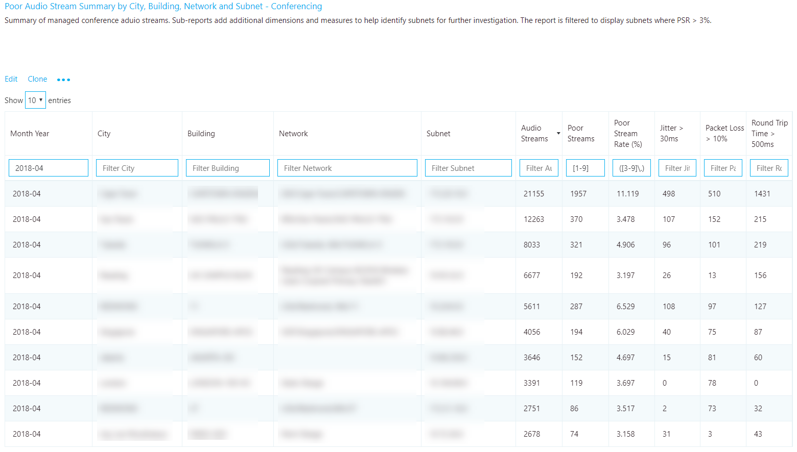
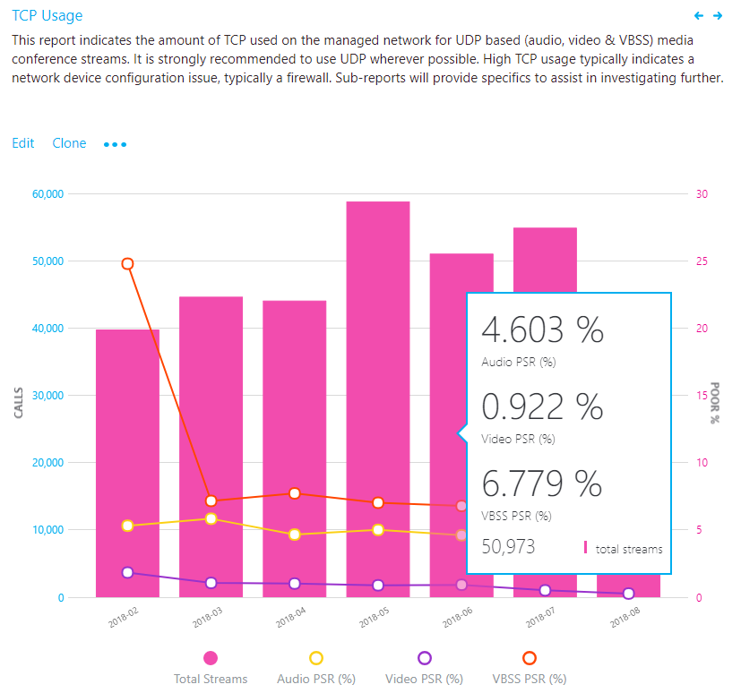

# <a name="quality-of-experience-review-guide"></a><span data-ttu-id="a5468-103">Calidad de experiencia consulte la Guía</span><span class="sxs-lookup"><span data-stu-id="a5468-103">Quality of Experience Review Guide</span></span>

<span data-ttu-id="a5468-104"><!-- Note that this link to the Word doc is intentionally NOT the aka.ms/qerquide link -->Esta guía es acerca de la fase de valor de unidad para Microsoft Teams y Skype para profesionales en línea.</span><span class="sxs-lookup"><span data-stu-id="a5468-104"><!-- Note that this link to the Word doc is intentionally NOT the aka.ms/qerquide link --> This guide is about the Drive Value phase for Microsoft Teams and Skype for Business Online.</span></span> <span data-ttu-id="a5468-105">Puede [descargar una versión de Word](https://github.com/MicrosoftDocs/OfficeDocs-SkypeForBusiness/blob/live/Teams/downloads/quality-of-experience-review-guide.docx?raw=true) de esta guía.</span><span class="sxs-lookup"><span data-stu-id="a5468-105">You can [download a Word version](https://github.com/MicrosoftDocs/OfficeDocs-SkypeForBusiness/blob/live/Teams/downloads/quality-of-experience-review-guide.docx?raw=true) of this guide.</span></span>

## <a name="introduction"></a><span data-ttu-id="a5468-106">Introducción</span><span class="sxs-lookup"><span data-stu-id="a5468-106">Introduction</span></span>

<span data-ttu-id="a5468-107">Para que el mayor impacto sobre cómo mejorar la experiencia del usuario, las organizaciones necesitan que controle las áreas clave que se muestran en la ilustración siguiente.</span><span class="sxs-lookup"><span data-stu-id="a5468-107">To have the greatest impact on improving the user experience, organizations need to operationalize the key areas that are shown in the following figure.</span></span> <span data-ttu-id="a5468-108">Áreas adicionales incluyen la identificación de las tareas operativas, establecimiento de los objetivos de métricas de calidad, determinar las métricas para utilizar para medir el éxito organizativo y áreas de investigación de restricción según sea necesario.</span><span class="sxs-lookup"><span data-stu-id="a5468-108">Additional areas include identifying operational tasks, establishing targets for quality metrics, ascertaining the metrics to use to gauge organizational success, and narrowing areas of investigation as needed.</span></span>


<span data-ttu-id="a5468-109">![Áreas clave para la calidad de la experiencia de usuario incluyen audio, confiabilidad, encuestas al usuario, dispositivos y clientes.] (media/qerguide-image-keyareas.png "Áreas clave para la calidad de la experiencia de usuario incluyen audio, confiabilidad, encuestas al usuario, dispositivos y clientes.")</span><span class="sxs-lookup"><span data-stu-id="a5468-109"></span></span>

<span data-ttu-id="a5468-110">_En la figura 1 - áreas operativas clave tratadas a lo largo de esta guía_</span><span class="sxs-lookup"><span data-stu-id="a5468-110">_Figure 1 - Key operational areas covered throughout this guide_</span></span>

<span data-ttu-id="a5468-111">Al continuamente evaluar y solucionar relativos a las áreas que se describen en esta guía, puede reducir su potencial de afectar negativamente a la calidad de la experiencia de los usuarios.</span><span class="sxs-lookup"><span data-stu-id="a5468-111">By continually assessing and remediating the areas described in this guide, you can reduce their potential to negatively affect the quality of your users’ experience.</span></span> <span data-ttu-id="a5468-112">Mayoría de experiencia de usuario los problemas encontrada en una implementación puede agruparse en las siguientes categorías:</span><span class="sxs-lookup"><span data-stu-id="a5468-112">Most user-experience problems encountered in a deployment can be grouped into the following categories:</span></span>

-   <span data-ttu-id="a5468-113">Configuración de firewall o proxy incompleto</span><span class="sxs-lookup"><span data-stu-id="a5468-113">Incomplete firewall or proxy configuration</span></span>
-   <span data-ttu-id="a5468-114">Cobertura Wi-Fi deficiente</span><span class="sxs-lookup"><span data-stu-id="a5468-114">Poor Wi-Fi coverage</span></span>
-   <span data-ttu-id="a5468-115">Ancho de banda insuficiente</span><span class="sxs-lookup"><span data-stu-id="a5468-115">Insufficient bandwidth</span></span>
-   <span data-ttu-id="a5468-116">VPN</span><span class="sxs-lookup"><span data-stu-id="a5468-116">VPN</span></span>
-   <span data-ttu-id="a5468-117">Controladores y versiones de cliente incoherentes o no actualizada</span><span class="sxs-lookup"><span data-stu-id="a5468-117">Inconsistent or outdated client versions and drivers</span></span>
-   <span data-ttu-id="a5468-118">Dispositivos de audio integrados o no optimizados</span><span class="sxs-lookup"><span data-stu-id="a5468-118">Unoptimized or built-in audio devices</span></span>
-   <span data-ttu-id="a5468-119">Subredes problemáticas o dispositivos de red</span><span class="sxs-lookup"><span data-stu-id="a5468-119">Problematic subnets or network devices</span></span>

<span data-ttu-id="a5468-120">A través de planear y diseñar correctamente antes de implementar los equipos o Skype para profesionales en línea, puede reducir la cantidad de esfuerzo que será necesarios para mantener experiencias de alta calidad.</span><span class="sxs-lookup"><span data-stu-id="a5468-120">Through proper planning and design before deploying Teams or Skype for Business Online, you can reduce the amount of effort that will be required to maintain high-quality experiences.</span></span>

<span data-ttu-id="a5468-121">Esta guía se centra en usar el panel de calidad de llamadas (CQD) Online como la principal herramienta para notificar e investigar cada área, con especial hincapié en audio para maximizar la adopción y el impacto.</span><span class="sxs-lookup"><span data-stu-id="a5468-121">This guide focuses on using the Call Quality Dashboard (CQD) Online as the primary tool to report and investigate each area, with a special emphasis on audio to maximize adoption and impact.</span></span> <span data-ttu-id="a5468-122">Todas las mejoras realizadas a la red para mejorar la experiencia de audio traducirá también directamente a las mejoras en uso compartido de escritorio y de vídeo.</span><span class="sxs-lookup"><span data-stu-id="a5468-122">Any improvements made to the network to improve the audio experience will also directly translate to improvements in video and desktop sharing.</span></span>

<span data-ttu-id="a5468-123">Para acelerar la evaluación, se proporcionan [dos plantillas CQD curated](https://aka.ms/qertemplates) : uno es para la administración de todas las redes y la otra se filtra para administrada sólo redes (internas).</span><span class="sxs-lookup"><span data-stu-id="a5468-123">To accelerate your assessment, [two curated CQD templates](https://aka.ms/qertemplates) are provided: one is for managing all networks and the other is filtered for managed (internal) networks only.</span></span> <span data-ttu-id="a5468-124">Aunque los informes de la plantilla de todas las redes están configurados para mostrar información de la red y la creación, aún se pueden usar mientras trabaja hacia la recopilación y la carga de información de creación.</span><span class="sxs-lookup"><span data-stu-id="a5468-124">Although the All Networks template reports are configured to display building and network information, they can still be used while you work toward collecting and uploading building information.</span></span> <span data-ttu-id="a5468-125">Cargar información en CQD de compilación, habilita el servicio mejorar la creación de informes mediante la adición de información de creación, la red y la ubicación personalizada mientras diferenciar interno de subredes externas.</span><span class="sxs-lookup"><span data-stu-id="a5468-125">Uploading building information into CQD enables the service to enhance reporting by adding custom building, network, and location information while differentiating internal from external subnets.</span></span> <span data-ttu-id="a5468-126">Para obtener más información, vea [asignación de creación](#building-mapping) más adelante en esta guía.</span><span class="sxs-lookup"><span data-stu-id="a5468-126">For more information, see [Building mapping](#building-mapping) later in this guide.</span></span>

### <a name="intended-audience"></a><span data-ttu-id="a5468-127">Público objetivo</span><span class="sxs-lookup"><span data-stu-id="a5468-127">Intended audience</span></span>

<span data-ttu-id="a5468-128">Esta guía está destinada a ser utilizada por las partes interesadas de clientes y socios con funciones como arquitecto o jefe de colaboración, consultor, especialista en administración y adopción de cambio, jefe de soporte técnico y ayuda de asistencia al cliente, potenciales de red, potenciales de escritorio y Admin de TI.</span><span class="sxs-lookup"><span data-stu-id="a5468-128">This guide is intended to be used by partner and customer stakeholders with roles such as Collaboration Lead/Architect, Consultant, Change Management/Adoption Specialist, Support/Help Desk Lead, Network Lead, Desktop Lead, and IT Admin.</span></span>

<span data-ttu-id="a5468-129">Esta guía también está pensada para usarse por la champion(s) calidad designada.</span><span class="sxs-lookup"><span data-stu-id="a5468-129">This guide is also intended to be used by the designated quality champion(s).</span></span> <span data-ttu-id="a5468-130">Para obtener más información, vea [la función de los pesos pesados calidad](4-envision-plan-my-service-management.md#the-quality-champion-role).</span><span class="sxs-lookup"><span data-stu-id="a5468-130">For more information, see [the Quality Champion role](4-envision-plan-my-service-management.md#the-quality-champion-role).</span></span>

## <a name="prerequisites"></a><span data-ttu-id="a5468-131">Requisitos previos</span><span class="sxs-lookup"><span data-stu-id="a5468-131">Prerequisites</span></span>

<span data-ttu-id="a5468-132">Antes de usar a esta guía, asegúrese de que tiene el inquilino adecuados [roles](https://support.office.com/article/About-Office-365-admin-roles-da585eea-f576-4f55-a1e0-87090b6aaa9d) asignados por lo que puede tener acceso a CQD.</span><span class="sxs-lookup"><span data-stu-id="a5468-132">Before using this guide, make sure you have the proper tenant [roles](https://support.office.com/article/About-Office-365-admin-roles-da585eea-f576-4f55-a1e0-87090b6aaa9d) assigned so that you can access CQD.</span></span>

-   <span data-ttu-id="a5468-133">**Función de administrador Global de office 365:** Tiene acceso a todas las características administrativas en el conjunto de aplicaciones de Office 365 de servicios en el plan, incluyendo Skype para la empresa.</span><span class="sxs-lookup"><span data-stu-id="a5468-133">**Office 365 Global Administrator role:** Accesses all administrative features in the Office 365 suite of services in your plan, including Skype for Business.</span></span>

-   <span data-ttu-id="a5468-134">**Skype para el rol de administrador empresarial:** Configura Skype para la empresa para su organización y puede ver todos los [informes de actividad](https://support.office.com/article/activity-reports-0d6dfb17-8582-4172-a9a9-aed798150263) en el centro de administración de Office 365.</span><span class="sxs-lookup"><span data-stu-id="a5468-134">**Skype for Business Administrator role:** Configures Skype for Business for your organization and is able to view all the [activity reports](https://support.office.com/article/activity-reports-0d6dfb17-8582-4172-a9a9-aed798150263) in the Office 365 admin center.</span></span> <span data-ttu-id="a5468-135">Esta función es necesaria, incluso si se implementación sólo los equipos.</span><span class="sxs-lookup"><span data-stu-id="a5468-135">This role is required even if you deploy only Teams.</span></span>

<span data-ttu-id="a5468-136">Como alternativa, puede asignar la siguiente función a una cuenta de usuario de Office 365 para permitir el acceso a sólo las características de informes.</span><span class="sxs-lookup"><span data-stu-id="a5468-136">Alternatively, you can assign the following role to an Office 365 user account to allow access to reporting features only.</span></span>

-   <span data-ttu-id="a5468-137">**Lector de informes:** Puede ver todos los [informes de actividad](https://support.office.com/article/activity-reports-0d6dfb17-8582-4172-a9a9-aed798150263) en el centro de administración de Office 365, los informes desde el [paquete de contenido de Office 365 adopción](https://support.office.com/article/Office-365-Adoption-content-pack-77ff780d-ab19-4553-adea-09cb65ad0f1f)e informes CQD.</span><span class="sxs-lookup"><span data-stu-id="a5468-137">**Reports Reader:** Can view all the [activity reports](https://support.office.com/article/activity-reports-0d6dfb17-8582-4172-a9a9-aed798150263) in the Office 365 admin center, any reports from the [Office 365 Adoption content pack](https://support.office.com/article/Office-365-Adoption-content-pack-77ff780d-ab19-4553-adea-09cb65ad0f1f), and CQD reports.</span></span>

## <a name="what-is-quality"></a><span data-ttu-id="a5468-138">¿Qué es la calidad?</span><span class="sxs-lookup"><span data-stu-id="a5468-138">What is quality?</span></span>

<span data-ttu-id="a5468-139">Al hablar de calidad en los equipos y Skype para la empresa, es importante definir el término para lograr una comprensión común.</span><span class="sxs-lookup"><span data-stu-id="a5468-139">When discussing quality in Teams and Skype for Business, it’s important to define the term to achieve a common understanding.</span></span> <span data-ttu-id="a5468-140">Calidad, tal como se define aquí, es una combinación de la experiencia de usuario y las métricas de servicio.</span><span class="sxs-lookup"><span data-stu-id="a5468-140">Quality, as defined here, is a combination of service metrics and user experience.</span></span>

<span data-ttu-id="a5468-141"><!-- Note: need to update graphic-->
Métricas de servicio ![se componen de relación de secuencia deficiente, confiabilidad, extremos y a los dispositivos y las versiones de cliente. La experiencia del usuario se compone de la percepción del usuario de la calidad del servicio.] Métricas de servicio (media/qerguide-image-whatisquality.png "se componen de relación de secuencia deficiente, confiabilidad, extremos y a los dispositivos y las versiones de cliente. La experiencia del usuario se compone de la percepción del usuario de la calidad del servicio.")</span><span class="sxs-lookup"><span data-stu-id="a5468-141"><!-- Note: need to update graphic-->
</span></span>

<span data-ttu-id="a5468-142">_La figura 2: ¿qué es la calidad?_</span><span class="sxs-lookup"><span data-stu-id="a5468-142">_Figure 2 - What is quality?_</span></span>

### <a name="service-metrics"></a><span data-ttu-id="a5468-143">Métricas de servicio</span><span class="sxs-lookup"><span data-stu-id="a5468-143">Service metrics</span></span>

<span data-ttu-id="a5468-144">Métricas de servicio constan de las medidas específicas basadas en cliente.</span><span class="sxs-lookup"><span data-stu-id="a5468-144">Service metrics consist of specific client-based metrics.</span></span> <span data-ttu-id="a5468-145">Durante cada llamada, el cliente recopila información de telemetría acerca de la llamada y envía un informe al final de cada llamada que se puede tener acceso más adelante a través de CQD o [Llame al análisis](https://techcommunity.microsoft.com/t5/Skype-for-Business-Blog/Introducing-Call-Analytics/ba-p/57309).</span><span class="sxs-lookup"><span data-stu-id="a5468-145">During each call, the client collects telemetry information about the call and submits a report at the end of each call that can be later accessed through CQD or [Call Analytics](https://techcommunity.microsoft.com/t5/Skype-for-Business-Blog/Introducing-Call-Analytics/ba-p/57309).</span></span> <span data-ttu-id="a5468-146">Estas métricas incluyen:</span><span class="sxs-lookup"><span data-stu-id="a5468-146">These metrics include:</span></span>

-   <span data-ttu-id="a5468-147">Tasa de secuencia deficiente</span><span class="sxs-lookup"><span data-stu-id="a5468-147">Poor Stream Rate</span></span>
-   <span data-ttu-id="a5468-148">Porcentaje de errores de instalación</span><span class="sxs-lookup"><span data-stu-id="a5468-148">Setup Failure Rate</span></span>
-   <span data-ttu-id="a5468-149">Porcentaje de errores de entrega</span><span class="sxs-lookup"><span data-stu-id="a5468-149">Drop Failure Rate</span></span>


#### <a name="poor-stream-rate"></a><span data-ttu-id="a5468-150">Tasa de secuencia deficiente</span><span class="sxs-lookup"><span data-stu-id="a5468-150">Poor Stream Rate</span></span>

<span data-ttu-id="a5468-151">La tasa de secuencia deficiente (PSR) representa el porcentaje general de la organización de secuencias que tienen una calidad deficiente.</span><span class="sxs-lookup"><span data-stu-id="a5468-151">The poor stream rate (PSR) represents the organization’s overall percentage of streams that have poor quality.</span></span> <span data-ttu-id="a5468-152">Esta métrica está pensada para resaltar áreas donde puedan concentrarse en esfuerzo tengan el impacto más sólido hacia reducir este valor y mejora de la experiencia del usuario, que es la razón por la organización [administrados redes](#managed-vs-unmanaged-networks) son el foco principal cuando se mira región Determinada.</span><span class="sxs-lookup"><span data-stu-id="a5468-152">This metric is meant to highlight areas where your organization can concentrate effort to have the strongest impact toward reducing this value and improving the user experience, which is why [managed networks](#managed-vs-unmanaged-networks) are the primary focus when looking at PSR.</span></span> <span data-ttu-id="a5468-153">Los usuarios externos son importantes demasiado, pero difiere de investigación de forma organizativa.</span><span class="sxs-lookup"><span data-stu-id="a5468-153">External users are important too, but investigation differs on an organizational basis.</span></span> <span data-ttu-id="a5468-154">Considere la posibilidad de proporcionar procedimientos recomendados para los usuarios externos e investigar las llamadas externas independientemente de la organización global.</span><span class="sxs-lookup"><span data-stu-id="a5468-154">Consider providing best practices for external users, and investigate external calls independently from the overall organization.</span></span>

<span data-ttu-id="a5468-155">La medida real en CQD varía según la carga de trabajo, pero para los fines de la revisión de la experiencia de calidad se centran principalmente en la medida de _Porcentaje de Audio deficiente_ .</span><span class="sxs-lookup"><span data-stu-id="a5468-155">The actual measurement in CQD varies by workload, but for the purposes of the Quality Experience Review we focus primarily on the _Audio Poor Percentage_ measurement.</span></span> <span data-ttu-id="a5468-156">Región Determinada se compone de los cinco promedios de métrica de red que se describen en la siguiente tabla.</span><span class="sxs-lookup"><span data-stu-id="a5468-156">PSR is made up of the five network metric averages described in the following table.</span></span> <span data-ttu-id="a5468-157">Para que un objeto stream se clasifican como deficiente, sólo una métrica necesita supere el umbral definido.</span><span class="sxs-lookup"><span data-stu-id="a5468-157">For a stream to be classified as poor, only one metric needs to exceed the defined threshold.</span></span> <span data-ttu-id="a5468-158">Para obtener más información sobre el proceso de clasificación de secuencia, vea [este artículo](stream-classification-in-call-quality-dashboard.md).</span><span class="sxs-lookup"><span data-stu-id="a5468-158">For more information about the stream classification process, see [this article](stream-classification-in-call-quality-dashboard.md).</span></span>

> [!Note]
> <span data-ttu-id="a5468-159">CQD proporciona "Deficiente debido a..."</span><span class="sxs-lookup"><span data-stu-id="a5468-159">CQD provides the “Poor Due To…”</span></span> <span data-ttu-id="a5468-160">las medidas mejor comprender qué condición provocó la secuencia se clasifican como deficientes.</span><span class="sxs-lookup"><span data-stu-id="a5468-160">measurements to better understand what condition caused the stream to be classified as poor.</span></span>


<span data-ttu-id="a5468-161">_Tabla 1 - métricas de un servicio deficiente_</span><span class="sxs-lookup"><span data-stu-id="a5468-161">_Table 1 - Poor service metrics_</span></span>

| <span data-ttu-id="a5468-162">Promedio de métrico</span><span class="sxs-lookup"><span data-stu-id="a5468-162">Metric average</span></span>     | <span data-ttu-id="a5468-163">Descripción</span><span class="sxs-lookup"><span data-stu-id="a5468-163">Description</span></span>     | <span data-ttu-id="a5468-164">Experiencia de usuario</span><span class="sxs-lookup"><span data-stu-id="a5468-164">User experience</span></span> |
|-------------|-----------------|-----------------|
| <span data-ttu-id="a5468-165">Vibración \>30 ms</span><span class="sxs-lookup"><span data-stu-id="a5468-165">Jitter \>30 ms</span></span>        | <span data-ttu-id="a5468-166">Éste es el cambio promedio de retraso entre envíos sucesivos de paquetes.</span><span class="sxs-lookup"><span data-stu-id="a5468-166">This is the average change in delay between successive packets.</span></span> <span data-ttu-id="a5468-167">Los equipos y Skype para la empresa pueden adaptarse a algunos niveles de vibración a través de almacenamiento en búfer.</span><span class="sxs-lookup"><span data-stu-id="a5468-167">Teams and Skype for Business can adapt to some levels of jitter through buffering.</span></span> <span data-ttu-id="a5468-168">Es sólo cuando la vibración supera el almacenamiento en búfer que un participante avisos de los efectos de vibración.</span><span class="sxs-lookup"><span data-stu-id="a5468-168">It’s only when the jitter exceeds the buffering that a participant notices the effects of jitter.</span></span>      | <span data-ttu-id="a5468-169">Los paquetes que llegan a diferentes velocidades provocarán voz de un altavoz se oye robótica.</span><span class="sxs-lookup"><span data-stu-id="a5468-169">The packets arriving at different speeds cause a speaker’s voice to sound robotic.</span></span>   |
| <span data-ttu-id="a5468-170">Tasa de pérdida de paquetes \>0,1 o 10%</span><span class="sxs-lookup"><span data-stu-id="a5468-170">Packet loss rate \>10% or 0.1</span></span>        | <span data-ttu-id="a5468-171">A menudo se define como un porcentaje de paquetes que se pierden.</span><span class="sxs-lookup"><span data-stu-id="a5468-171">This is often defined as a percentage of packets that are lost.</span></span> <span data-ttu-id="a5468-172">Pérdida de paquetes afecta directamente a la calidad de audio: desde pequeñas, individual los paquetes perdidos que no tienen casi afectar a las pérdidas de ráfagas opuesta que causa el audio para recortar completamente.</span><span class="sxs-lookup"><span data-stu-id="a5468-172">Packet loss directly affects audio quality—from small, individual lost packets that have almost no impact to back-to-back burst losses that cause audio to cut out completely.</span></span>     | <span data-ttu-id="a5468-173">Los paquetes se perdidos y que no llegan a su destino previsto provocarán diferencias en los medios, resultantes en palabras y sílabas perdidas y entrecortados vídeo y uso compartidos.</span><span class="sxs-lookup"><span data-stu-id="a5468-173">The packets being dropped and not arriving at their intended destination cause gaps in the media, resulting in missed syllables and words, and choppy video and sharing.</span></span> |
| <span data-ttu-id="a5468-174">Tiempo de ida y vuelta \>500 ms</span><span class="sxs-lookup"><span data-stu-id="a5468-174">Round-trip time \>500 ms</span></span>        | <span data-ttu-id="a5468-175">Esto es el tiempo necesario para obtener un paquete IP de punto A punto b y volver al punto A. Este retraso de propagación de red está asociado a la distancia física entre los dos puntos y la velocidad de la luz e incluye una sobrecarga adicional realizada por los diversos dispositivos en la ruta de acceso de red.</span><span class="sxs-lookup"><span data-stu-id="a5468-175">This is the time it takes to get an IP packet from point A to point B and back to point A. This network propagation delay is tied to the physical distance between the two points and the speed of light, and includes additional overhead taken by the various devices in the network path.</span></span>      | <span data-ttu-id="a5468-176">Los paquetes tarda mucho tiempo para llegar a su destino causar un efecto transmisor-receptor portátil.</span><span class="sxs-lookup"><span data-stu-id="a5468-176">The packets taking too long to arrive at their destination cause a walkie-talkie effect.</span></span>   |
| <span data-ttu-id="a5468-177">Promedio de degradación de NMOS \>1.0</span><span class="sxs-lookup"><span data-stu-id="a5468-177">NMOS degradation average \>1.0</span></span>         | <span data-ttu-id="a5468-178">Promedio de degradación de [Puntuación de opinión Media de red (NMOS)](https://docs.microsoft.com/previous-versions/office/communications-server/bb894481(v=office.12)#network-mos) de la secuencia.</span><span class="sxs-lookup"><span data-stu-id="a5468-178">Average [Network Mean Opinion Score (NMOS)](https://docs.microsoft.com/previous-versions/office/communications-server/bb894481(v=office.12)#network-mos) degradation for the stream.</span></span> <span data-ttu-id="a5468-179">Representa cómo mucho la pérdida de la red y vibración ha afectado la calidad del audio recibido que ha provocado el NMOS colocar por más de un punto.</span><span class="sxs-lookup"><span data-stu-id="a5468-179">Represents how much the network loss and jitter has affected the quality of received audio that caused the NMOS to drop by more than one point.</span></span> | <span data-ttu-id="a5468-180">Esto es una combinación de vibración, la pérdida de paquetes, y, en menor grado, aumenta el tiempo de ida y vuelta.</span><span class="sxs-lookup"><span data-stu-id="a5468-180">This is a combination of jitter, packet loss, and—to a lesser degree—increased round-trip time.</span></span> <span data-ttu-id="a5468-181">El usuario puede haber una combinación de estos síntomas.</span><span class="sxs-lookup"><span data-stu-id="a5468-181">The user might be experiencing a combination of these symptoms.</span></span>   |
| <span data-ttu-id="a5468-182">Relación media de muestras ocultas \>7% o 0,07</span><span class="sxs-lookup"><span data-stu-id="a5468-182">Average ratio of concealed samples \>7% or 0.07</span></span> | <span data-ttu-id="a5468-183">Relación media del número de marcos de audioconferencias con muestras ocultas generadas por la pérdida de resolución de problemas y el número total de marcos de audioconferencias.</span><span class="sxs-lookup"><span data-stu-id="a5468-183">Average ratio of the number of audio frames with concealed samples generated by packet loss healing to the total number of audio frames.</span></span> <span data-ttu-id="a5468-184">Un ejemplo de audio oculto es una técnica que se utiliza para emparejar la abrupta transición que normalmente podría deberse a paquetes de red perdidos.</span><span class="sxs-lookup"><span data-stu-id="a5468-184">A concealed audio sample is a technique used to smooth out the abrupt transition that would usually be caused by dropped network packets.</span></span>      | <span data-ttu-id="a5468-185">Los valores altos indican que niveles significativos de ocultación de pérdida se han aplicado y esperó audio distorsionado o pierden.</span><span class="sxs-lookup"><span data-stu-id="a5468-185">High values indicate that significant levels of loss concealment were applied and resulted in distorted or lost audio.</span></span>     |

#### <a name="setup-failure-rate"></a><span data-ttu-id="a5468-186">Porcentaje de errores de instalación</span><span class="sxs-lookup"><span data-stu-id="a5468-186">Setup Failure Rate</span></span>

<span data-ttu-id="a5468-187">La tasa de errores del programa de instalación, que también se conoce como la medida de _Total de llamadas porcentaje de errores de instalación_ en CQD, es el número de secuencias de donde se no se pudo establecer la ruta de acceso de medios entre los extremos en el inicio de la llamada.</span><span class="sxs-lookup"><span data-stu-id="a5468-187">The setup failure rate, otherwise known as the _Total Call Setup Failure Percentage_ measurement in CQD, is the number of streams where the media path couldn’t be established between the endpoints at the start of the call.</span></span>

<span data-ttu-id="a5468-188">Esto representa cualquier secuencia de medios que no se ha podido establecerse.</span><span class="sxs-lookup"><span data-stu-id="a5468-188">This represents any media stream that couldn’t be established.</span></span> <span data-ttu-id="a5468-189">Dada la gravedad del impacto en la experiencia del usuario que se mide aquí, el objetivo es reducir este valor para como cercanos a cero como sea posible.</span><span class="sxs-lookup"><span data-stu-id="a5468-189">Given the severity of the impact on the user experience measured here, the goal is to reduce this value to as close to zero as possible.</span></span> <span data-ttu-id="a5468-190">Un valor alto para que esta métrica es más frecuente en las nuevas implementaciones con reglas de firewall incompletos que una implementación consolidada, pero sigue siendo importante inspeccionar de forma regular.</span><span class="sxs-lookup"><span data-stu-id="a5468-190">A high value for this metric is more common in new deployments with incomplete firewall rules than a mature deployment, but it’s still important to watch on a regular basis.</span></span>

<span data-ttu-id="a5468-191">Esta métrica se calcula restando el número total de secuencias que no se pudo establecer dividido por el número total de secuencias que han enviado un registro de detalles de llamada correcta (CDR):</span><span class="sxs-lookup"><span data-stu-id="a5468-191">This metric is calculated by taking the total number of streams that failed to set up divided by the total number of streams that submitted a successful call detail record (CDR):</span></span>

-   <span data-ttu-id="a5468-192">**Porcentaje de errores de instalación** = llamada Total del programa de instalación con error secuencia recuento / CDR Total disponible en secuencia de recuento</span><span class="sxs-lookup"><span data-stu-id="a5468-192">**Setup Failure Rate** = Total Call Setup Failed Stream Count / Total CDR Available Stream Count</span></span>

#### <a name="drop-failure-rate"></a><span data-ttu-id="a5468-193">Porcentaje de errores de entrega</span><span class="sxs-lookup"><span data-stu-id="a5468-193">Drop Failure Rate</span></span>

<span data-ttu-id="a5468-194">La tasa de errores de entrega, en caso contrario, conocida como la medida de _Total de llamadas colocada porcentaje de errores_ en CQD, es el porcentaje de secuencias correctamente establecidas donde la ruta de acceso de medios no finaliza correctamente.</span><span class="sxs-lookup"><span data-stu-id="a5468-194">The drop failure rate, otherwise known as the _Total Call Dropped Failure Percentage_ measurement in CQD, is the percentage of successfully established streams where the media path didn’t terminate normally.</span></span>

<span data-ttu-id="a5468-195">Esto representa cualquier secuencia de medios que terminó de forma inesperada.</span><span class="sxs-lookup"><span data-stu-id="a5468-195">This represents any media stream that terminated unexpectedly.</span></span> <span data-ttu-id="a5468-196">Aunque el impacto de esto no es tan grave como una secuencia que no se pudo establecer, afectará negativamente la experiencia del usuario.</span><span class="sxs-lookup"><span data-stu-id="a5468-196">Although the impact of this isn’t as severe as a stream that failed to set up, it will negatively affect the user experience.</span></span> <span data-ttu-id="a5468-197">Gotas de medios repentino y frecuentes no sólo pueden tener un impacto grave en la experiencia del usuario, pueden provocar que la necesidad de los usuarios para volver a conectar, lo que produce una pérdida en la productividad.</span><span class="sxs-lookup"><span data-stu-id="a5468-197">Sudden and frequent media drops not only can have a severe impact on the user experience, they result in the need for users to reconnect, resulting in a loss in productivity.</span></span>

<span data-ttu-id="a5468-198">La métrica se calcula restando el número total de secuencias descartados dividido por la cantidad total de secuencias que configurado correctamente:</span><span class="sxs-lookup"><span data-stu-id="a5468-198">The metric is calculated by taking the total number of dropped streams divided by the total count of streams that set up successfully:</span></span>

-   <span data-ttu-id="a5468-199">**Porcentaje de errores de colocar** = llamada Total colocada recuento de secuencia / llamada Total el programa de instalación se ha realizado correctamente el recuento de secuencia</span><span class="sxs-lookup"><span data-stu-id="a5468-199">**Drop Failure Rate** = Total Call Dropped Stream Count / Total Call Setup Succeeded Stream Count</span></span>

### <a name="define-your-target-metrics"></a><span data-ttu-id="a5468-200">Definir las métricas de destino</span><span class="sxs-lookup"><span data-stu-id="a5468-200">Define your target metrics</span></span>

<span data-ttu-id="a5468-201">En esta sección se describe algunas de las métricas de servicio principal que usamos para evaluar cómo servicios experimentan mantenimiento.</span><span class="sxs-lookup"><span data-stu-id="a5468-201">This section discusses some of the core service metrics that we use to assess how services experience health.</span></span> <span data-ttu-id="a5468-202">Al continuamente evaluar y que dirigen los esfuerzos para mantener estas métricas debajo de sus destinos definidos, ayudaremos a asegurarse de que los usuarios de experimentan de calidad de la llamada coherente y confiable.</span><span class="sxs-lookup"><span data-stu-id="a5468-202">By continually assessing and driving efforts to keep these metrics below their defined targets, you’ll help ensure that your users experience consistent, reliable call quality.</span></span> <span data-ttu-id="a5468-203">Para comenzar, se proporcionan los siguientes objetivos.</span><span class="sxs-lookup"><span data-stu-id="a5468-203">To get you started, the following targets are provided.</span></span>

<span data-ttu-id="a5468-204">_Tabla 2 - medidas de evaluación de estado de destino principales_</span><span class="sxs-lookup"><span data-stu-id="a5468-204">_Table 2 - Core target health assessment metrics_</span></span>
<table>
<tr>
<th rowspan="2" colspan="2" valign="center"><span data-ttu-id="a5468-205">Tipo de red</span><span class="sxs-lookup"><span data-stu-id="a5468-205">Network type</span></span></th><th rowspan="1"><span data-ttu-id="a5468-206">Objetivos de calidad</span><span class="sxs-lookup"><span data-stu-id="a5468-206">Quality targets</span></span></th><th colspan="2"><span data-ttu-id="a5468-207">Objetivos de confiabilidad</span><span class="sxs-lookup"><span data-stu-id="a5468-207">Reliability targets</span></span></th></tr>
<tr><th><span data-ttu-id="a5468-208">Tasa de audio Stream deficiente</span><span class="sxs-lookup"><span data-stu-id="a5468-208">Audio Poor Stream Rate</span></span></th><th><span data-ttu-id="a5468-209">Porcentaje de errores de instalación</span><span class="sxs-lookup"><span data-stu-id="a5468-209">Setup Failure Rate</span></span></th><th><span data-ttu-id="a5468-210">Porcentaje de errores de entrega</span><span class="sxs-lookup"><span data-stu-id="a5468-210">Drop Failure Rate</span></span></th></tr>
<tr><td rowspan="2"><span data-ttu-id="a5468-211">**All**</span><span class="sxs-lookup"><span data-stu-id="a5468-211">**All**</span></span></td><td><span data-ttu-id="a5468-212">Interno</span><span class="sxs-lookup"><span data-stu-id="a5468-212">Internal</span></span></td><td><span data-ttu-id="a5468-213">% de 2.0</span><span class="sxs-lookup"><span data-stu-id="a5468-213">2.0%</span></span></td><td><span data-ttu-id="a5468-214">0,5%</span><span class="sxs-lookup"><span data-stu-id="a5468-214">0.5%</span></span></td><td><span data-ttu-id="a5468-215">% de 2.0</span><span class="sxs-lookup"><span data-stu-id="a5468-215">2.0%</span></span></td></tr>
<tr><td><span data-ttu-id="a5468-216">General</span><span class="sxs-lookup"><span data-stu-id="a5468-216">Overall</span></span></td><td><span data-ttu-id="a5468-217">% de 3.0</span><span class="sxs-lookup"><span data-stu-id="a5468-217">3.0%</span></span></td><td><span data-ttu-id="a5468-218">1.0%</span><span class="sxs-lookup"><span data-stu-id="a5468-218">1.0%</span></span></td><td><span data-ttu-id="a5468-219">% de 3.0</span><span class="sxs-lookup"><span data-stu-id="a5468-219">3.0%</span></span></td></tr>
<tr><td rowspan="5"><span data-ttu-id="a5468-220">**Conferencia**</span><span class="sxs-lookup"><span data-stu-id="a5468-220">**Conferencing**</span></span></td><td><span data-ttu-id="a5468-221">Interno</span><span class="sxs-lookup"><span data-stu-id="a5468-221">Internal</span></span></td><td><span data-ttu-id="a5468-222">% de 2.0</span><span class="sxs-lookup"><span data-stu-id="a5468-222">2.0%</span></span></td><td><span data-ttu-id="a5468-223">0,5%</span><span class="sxs-lookup"><span data-stu-id="a5468-223">0.5%</span></span></td><td><span data-ttu-id="a5468-224">% de 2.0</span><span class="sxs-lookup"><span data-stu-id="a5468-224">2.0%</span></span></td></tr>
<tr><td><span data-ttu-id="a5468-225">Con cable interno</span><span class="sxs-lookup"><span data-stu-id="a5468-225">Wired internal</span></span></td><td><span data-ttu-id="a5468-226">1.0%</span><span class="sxs-lookup"><span data-stu-id="a5468-226">1.0%</span></span></td><td><span data-ttu-id="a5468-227">0,5%</span><span class="sxs-lookup"><span data-stu-id="a5468-227">0.5%</span></span></td><td><span data-ttu-id="a5468-228">1.0%</span><span class="sxs-lookup"><span data-stu-id="a5468-228">1.0%</span></span></td></tr>
<tr><td><span data-ttu-id="a5468-229">Wi-Fi 5 GHz interno</span><span class="sxs-lookup"><span data-stu-id="a5468-229">Wi-Fi 5 GHz internal</span></span></td><td><span data-ttu-id="a5468-230">1.0%</span><span class="sxs-lookup"><span data-stu-id="a5468-230">1.0%</span></span></td><td><span data-ttu-id="a5468-231">0,5%</span><span class="sxs-lookup"><span data-stu-id="a5468-231">0.5%</span></span></td><td><span data-ttu-id="a5468-232">1.0%</span><span class="sxs-lookup"><span data-stu-id="a5468-232">1.0%</span></span></td></tr>
<tr><td><span data-ttu-id="a5468-233">Wi-Fi 2,4 GHz interno</span><span class="sxs-lookup"><span data-stu-id="a5468-233">Wi-Fi 2.4 GHz internal</span></span></td><td><span data-ttu-id="a5468-234">% de 4.0</span><span class="sxs-lookup"><span data-stu-id="a5468-234">4.0%</span></span></td><td><span data-ttu-id="a5468-235">0,5%</span><span class="sxs-lookup"><span data-stu-id="a5468-235">0.5%</span></span></td><td><span data-ttu-id="a5468-236">% de 2.0</span><span class="sxs-lookup"><span data-stu-id="a5468-236">2.0%</span></span></td></tr>
<tr><td><span data-ttu-id="a5468-237">General</span><span class="sxs-lookup"><span data-stu-id="a5468-237">Overall</span></span></td><td><span data-ttu-id="a5468-238">% de 2.0</span><span class="sxs-lookup"><span data-stu-id="a5468-238">2.0%</span></span></td><td><span data-ttu-id="a5468-239">0,5%</span><span class="sxs-lookup"><span data-stu-id="a5468-239">0.5%</span></span></td><td><span data-ttu-id="a5468-240">% de 3.0</span><span class="sxs-lookup"><span data-stu-id="a5468-240">3.0%</span></span></td></tr>
<tr><td rowspan="4"><span data-ttu-id="a5468-241">**P2P**</span><span class="sxs-lookup"><span data-stu-id="a5468-241">**P2P**</span></span></td><td><span data-ttu-id="a5468-242">Interno</span><span class="sxs-lookup"><span data-stu-id="a5468-242">Internal</span></span></td><td><span data-ttu-id="a5468-243">% de 2.0</span><span class="sxs-lookup"><span data-stu-id="a5468-243">2.0%</span></span></td><td><span data-ttu-id="a5468-244">0,5%</span><span class="sxs-lookup"><span data-stu-id="a5468-244">0.5%</span></span></td><td><span data-ttu-id="a5468-245">% de 2.0</span><span class="sxs-lookup"><span data-stu-id="a5468-245">2.0%</span></span></td></tr>
<tr><td><span data-ttu-id="a5468-246">Con cable, Wi-Fi 5 GHz interno</span><span class="sxs-lookup"><span data-stu-id="a5468-246">Wired/Wi-Fi 5 GHz internal</span></span></td><td><span data-ttu-id="a5468-247">1.0%</span><span class="sxs-lookup"><span data-stu-id="a5468-247">1.0%</span></span></td><td><span data-ttu-id="a5468-248">0,5%</span><span class="sxs-lookup"><span data-stu-id="a5468-248">0.5%</span></span></td><td><span data-ttu-id="a5468-249">1.0%</span><span class="sxs-lookup"><span data-stu-id="a5468-249">1.0%</span></span></td></tr>
<tr><td><span data-ttu-id="a5468-250">Con cable, Wi-Fi 5 GHz general</span><span class="sxs-lookup"><span data-stu-id="a5468-250">Wired/Wi-Fi 5 GHz overall</span></span></td><td><span data-ttu-id="a5468-251">% de 2.0</span><span class="sxs-lookup"><span data-stu-id="a5468-251">2.0%</span></span></td><td><span data-ttu-id="a5468-252">1.0%</span><span class="sxs-lookup"><span data-stu-id="a5468-252">1.0%</span></span></td><td><span data-ttu-id="a5468-253">1.0%</span><span class="sxs-lookup"><span data-stu-id="a5468-253">1.0%</span></span></td></tr>
<tr><td><span data-ttu-id="a5468-254">General</span><span class="sxs-lookup"><span data-stu-id="a5468-254">Overall</span></span></td><td><span data-ttu-id="a5468-255">% de 2.0</span><span class="sxs-lookup"><span data-stu-id="a5468-255">2.0%</span></span></td><td><span data-ttu-id="a5468-256">1.0%</span><span class="sxs-lookup"><span data-stu-id="a5468-256">1.0%</span></span></td><td><span data-ttu-id="a5468-257">% de 3.0</span><span class="sxs-lookup"><span data-stu-id="a5468-257">3.0%</span></span></td></tr>
</table>


<span data-ttu-id="a5468-258">Es importante discutir y definir los objetivos de la organización para cumplir los objetivos del negocio.</span><span class="sxs-lookup"><span data-stu-id="a5468-258">It's important to discuss and define your organization’s targets to meet your business objectives.</span></span>

### <a name="user-experience"></a><span data-ttu-id="a5468-259">Experiencia de usuario</span><span class="sxs-lookup"><span data-stu-id="a5468-259">User experience</span></span>

<span data-ttu-id="a5468-260">Análisis de la experiencia del usuario es más que science, debido a que las métricas se recopilan aquí no siempre significa que hay un problema con la red o servicio, pero en su lugar, simplemente indican que el usuario percibe un problema.</span><span class="sxs-lookup"><span data-stu-id="a5468-260">Analyzing the user experience is more art than science, because the metrics gathered here don’t always mean that there’s a problem with the network or service but rather, they simply indicate that the user perceives a problem.</span></span> <span data-ttu-id="a5468-261">Microsoft ofrece un mecanismo de encuesta integrada, conocido como tasa Mis llamadas (RMC): para ayudar a medir la experiencia global del usuario.</span><span class="sxs-lookup"><span data-stu-id="a5468-261">Microsoft offers a built-in survey mechanism—known as Rate My Call (RMC)—to help gauge overall user experience.</span></span> <span data-ttu-id="a5468-262">RMC le ayudarán a responder a las preguntas siguientes desde la perspectiva de los usuarios:</span><span class="sxs-lookup"><span data-stu-id="a5468-262">RMC will help you answer the following questions from your users’ perspective:</span></span>

-   <span data-ttu-id="a5468-263">¿Sabe cómo usar la solución?</span><span class="sxs-lookup"><span data-stu-id="a5468-263">Do I know how to use the solution?</span></span>
-   <span data-ttu-id="a5468-264">¿Es la solución intuitiva y fácil de usar, y es compatible con las necesidades de comunicación diarias?</span><span class="sxs-lookup"><span data-stu-id="a5468-264">Is the solution easy to use and intuitive, and does it support my day-to-day communication needs?</span></span>
-   <span data-ttu-id="a5468-265">¿La solución me ayuda a realizar mi trabajo?</span><span class="sxs-lookup"><span data-stu-id="a5468-265">Does the solution help me get my job done?</span></span>
-   <span data-ttu-id="a5468-266">¿Qué es mi percepción general de la solución?</span><span class="sxs-lookup"><span data-stu-id="a5468-266">What’s my overall perception of the solution?</span></span>
-   <span data-ttu-id="a5468-267">¿Puedo usar la solución en cualquier momento en el tiempo, independientemente de donde estoy?</span><span class="sxs-lookup"><span data-stu-id="a5468-267">Can I use the solution at any point in time, regardless of where I am?</span></span>
-   <span data-ttu-id="a5468-268">¿Puedo configurar y mantener una llamada?</span><span class="sxs-lookup"><span data-stu-id="a5468-268">Can I set up and maintain a call?</span></span>

#### <a name="rate-my-call"></a><span data-ttu-id="a5468-269">Tasa de mi llamada</span><span class="sxs-lookup"><span data-stu-id="a5468-269">Rate My Call</span></span> 

<span data-ttu-id="a5468-270">Tasa de Mis llamadas entonces se basa en equipos y Skype para la empresa y se configura automáticamente para que se muestre para el participante después de que uno en todas las llamadas de 10, o 10 por ciento.</span><span class="sxs-lookup"><span data-stu-id="a5468-270">Rate My Call (RMC) is built into Teams and Skype for Business and is automatically configured to be displayed to the participant after one in every 10 calls, or 10 percent.</span></span> <span data-ttu-id="a5468-271">En este breve encuesta pregunta al usuario para valorar la llamada y proporcionar un contexto poco de por qué la calidad de la llamada es posible que han sido deficiente.</span><span class="sxs-lookup"><span data-stu-id="a5468-271">This brief survey asks the user to rate the call and provide a little context for why the call quality might have been poor.</span></span> <span data-ttu-id="a5468-272">Una clasificación de uno o dos se considera mala, es buena tres o cuatro y cinco es excelente.</span><span class="sxs-lookup"><span data-stu-id="a5468-272">A one or two rating is considered poor, three to four is good, and five is excellent.</span></span> <span data-ttu-id="a5468-273">Aunque es un poco de un indicador al retraso, esto es una métrica útil para descubrir problemas que pueden pasar por alto las métricas de servicio.</span><span class="sxs-lookup"><span data-stu-id="a5468-273">Although it’s somewhat of a lagging indicator, this is a useful metric for uncovering issues that service metrics can miss.</span></span>

> [!Note]
> <span data-ttu-id="a5468-274">Hasta que los usuarios conozcan para responder a encuestas RMC por darnos su opinión buena además de las respuestas incorrectos, normalmente volveremos como muy negativos.</span><span class="sxs-lookup"><span data-stu-id="a5468-274">Until users are educated to respond to RMC surveys by giving good feedback in addition to bad, responses typically come back as overwhelmingly negative.</span></span> <span data-ttu-id="a5468-275">La mayoría de los usuarios sólo responden cuando es mala calidad de la llamada.</span><span class="sxs-lookup"><span data-stu-id="a5468-275">Most users only respond when call quality is poor.</span></span> <span data-ttu-id="a5468-276">Por este motivo, los informes RMC podrían ser asimétrica hasta el lado deficiente incluso mientras las métricas de servicio son una buena opción.</span><span class="sxs-lookup"><span data-stu-id="a5468-276">Because of this, your RMC reports might be skewed to the poor side even while service metrics are good.</span></span>

<span data-ttu-id="a5468-277">Puede usar CQD para informar sobre las respuestas del usuario RMC, y se incluyen informes de muestra en la plantilla de CQD.</span><span class="sxs-lookup"><span data-stu-id="a5468-277">You can use CQD to report on RMC user responses, and sample reports are included in the CQD template.</span></span> <span data-ttu-id="a5468-278">Sin embargo, no se analizan detalladamente en esta guía.</span><span class="sxs-lookup"><span data-stu-id="a5468-278">However, they aren’t discussed in detail in this guide.</span></span> <span data-ttu-id="a5468-279">Para obtener más información sobre RMC en Skype para profesionales en línea y orientación para indicar a los usuarios dar respuestas RMC útiles, consulte [esta entrada de blog](https://blogs.technet.microsoft.com/jenstr/2015/05/05/rate-my-call-in-skype-for-business-2015/).</span><span class="sxs-lookup"><span data-stu-id="a5468-279">For more information about RMC in Skype for Business Online and guidance for educating users to give useful RMC responses, see [this blog post](https://blogs.technet.microsoft.com/jenstr/2015/05/05/rate-my-call-in-skype-for-business-2015/).</span></span>

#### <a name="client-and-device-readiness"></a><span data-ttu-id="a5468-280">Preparación de clientes y dispositivos</span><span class="sxs-lookup"><span data-stu-id="a5468-280">Client and device readiness</span></span>

<span data-ttu-id="a5468-281">Se necesita una estrategia de cliente y dispositivo sólida para ayudar a garantizar que los usuarios tengan una experiencia de usuario coherente y positiva.</span><span class="sxs-lookup"><span data-stu-id="a5468-281">You need a solid client and device strategy to help ensure that your users have a consistent and positive user experience.</span></span> <span data-ttu-id="a5468-282">Unos principios claves de cada estrategia de preparación para la unidad.</span><span class="sxs-lookup"><span data-stu-id="a5468-282">A few key principles drive each readiness strategy.</span></span>

##### <a name="client-readiness"></a><span data-ttu-id="a5468-283">Preparación del cliente</span><span class="sxs-lookup"><span data-stu-id="a5468-283">Client readiness</span></span>

<span data-ttu-id="a5468-284">Una estrategia de preparación de cliente seguro garantiza que los usuarios están ejecutando la versión más reciente del cliente disfrutando de la mejor experiencia posible.</span><span class="sxs-lookup"><span data-stu-id="a5468-284">A strong client readiness strategy ensures that your users are running the most recent version of the client while enjoying the best experience possible.</span></span> <span data-ttu-id="a5468-285">Microsoft revisiones rutinariamente el Skype para clientes empresariales; asegurarse de que la mantenga actualizados en su entorno es vital para el éxito general.</span><span class="sxs-lookup"><span data-stu-id="a5468-285">Microsoft routinely patches the Skype for Business client; ensuring that you keep it up to date in your environment is vital to your overall success.</span></span> <span data-ttu-id="a5468-286">También es importante recordar a red de revisión, vídeo, USB y los controladores de audioconferencias, porque está a menudo se pasa por alto y pueden afectar a la experiencia del usuario.</span><span class="sxs-lookup"><span data-stu-id="a5468-286">It’s also important to remember to patch network, video, USB, and audio drivers, because they’re often overlooked and can affect the user’s experience.</span></span> <span data-ttu-id="a5468-287">Considere la posibilidad de agregar vídeo en red, Wi-Fi, USB y los controladores de audioconferencias para el proceso de administración de revisiones actual.</span><span class="sxs-lookup"><span data-stu-id="a5468-287">Consider adding network, Wi-Fi, video, USB, and audio drivers to your current patch management process.</span></span>

<span data-ttu-id="a5468-288">Se recomienda que no permita que sus versiones de cliente se dividen por más de seis meses.</span><span class="sxs-lookup"><span data-stu-id="a5468-288">We recommend that you not let your client versions fall behind by more than six months.</span></span> <span data-ttu-id="a5468-289">Si está utilizando Office Click-to-Run, está ya que se mantiene actualizados por el servicio.</span><span class="sxs-lookup"><span data-stu-id="a5468-289">If you’re using Office Click-to-Run, you’re already being kept up to date by the service.</span></span> <span data-ttu-id="a5468-290">Use las incluye [las versiones de cliente](#client-versions), tal como se describe más adelante en esta guía, para ayudarle con este proceso.</span><span class="sxs-lookup"><span data-stu-id="a5468-290">Use the included [client versions](#client-versions), as described later in this guide, to assist you with this process.</span></span> <span data-ttu-id="a5468-291">También puede aprovechar los informes de ejemplo tasa Mis llamadas para mejorar aún más la estrategia de preparación del cliente.</span><span class="sxs-lookup"><span data-stu-id="a5468-291">You can also leverage the Rate My Call sample reports to further enhance your client readiness strategy.</span></span>

> [!IMPORTANT]
> <span data-ttu-id="a5468-292">Actualmente, los clientes de los equipos se distribuye y se actualizan automáticamente a través de la red de entrega de contenido de Azure y se mantengan actualizados por el servicio.</span><span class="sxs-lookup"><span data-stu-id="a5468-292">Currently, Teams clients are distributed and updated automatically through the Azure Content Delivery Network and will be kept up to date by the service.</span></span> <span data-ttu-id="a5468-293">Debido a esto, preparación de cliente y las actividades de investigación no son aplicables a los equipos.</span><span class="sxs-lookup"><span data-stu-id="a5468-293">Due to this, client readiness and investigative activities aren’t applicable to Teams.</span></span>


##### <a name="device-readiness"></a><span data-ttu-id="a5468-294">Preparación de dispositivo</span><span class="sxs-lookup"><span data-stu-id="a5468-294">Device readiness</span></span>

<span data-ttu-id="a5468-295">No hay una estrategia de único puede afectar a la experiencia del usuario más que la estrategia de preparación del dispositivo.</span><span class="sxs-lookup"><span data-stu-id="a5468-295">No one single strategy can affect the user experience more than your device readiness strategy.</span></span> <span data-ttu-id="a5468-296">La mayoría de las organizaciones están satisfechos quitar los dispositivos innecesarios (por ejemplo, teléfonos de escritorio u otros dispositivos de audioconferencias dedicadas) de los usuarios y suele ser una justificación del negocio principales para cambiar a los equipos o Skype para la empresa.</span><span class="sxs-lookup"><span data-stu-id="a5468-296">Most organizations are happy to remove unnecessary devices (for example, desk phones or other dedicated audio devices) from users, and this is often a core business justification for switching to Teams or Skype for Business.</span></span> <span data-ttu-id="a5468-297">Sin embargo, esas organizaciones mismas dudan a veces para proporcionar dispositivos de sustitución, incluso si esos dispositivos son menos costosas.</span><span class="sxs-lookup"><span data-stu-id="a5468-297">However, those same organizations sometimes hesitate to provide replacement devices, even if those devices are less expensive.</span></span> <span data-ttu-id="a5468-298">Equipos portátiles moderna y PCs, aunque dispongan de micrófono y altavoz, no están optimizados para voz de clase empresarial sobre IP (VoIP).</span><span class="sxs-lookup"><span data-stu-id="a5468-298">Modern-day laptops and PCs, though equipped with built-in microphone and speaker, aren’t optimized for business-class voice over IP (VoIP).</span></span> <span data-ttu-id="a5468-299">A menudo esto crea una mala experiencia para todos los participantes, especialmente si el altavoz está en un entorno con mucho ruido.</span><span class="sxs-lookup"><span data-stu-id="a5468-299">This often creates a poor experience for all participants, especially if the speaker is in a noisy environment.</span></span> <span data-ttu-id="a5468-300">Programa de certificación de dispositivo de Microsoft se asegura de que, cuando un usuario participa en una llamada telefónica mediante el uso de cualquier dispositivo certificado para los equipos o Skype para la empresa, genera una experiencia que es superior de un dispositivo no certificados.</span><span class="sxs-lookup"><span data-stu-id="a5468-300">Microsoft’s device certification program ensures that when a user participates in a phone call by using any device certified for Teams or Skype for Business, it produces an experience that’s superior to a non-certified device.</span></span> 

<span data-ttu-id="a5468-301">Siempre se recomienda que los equipos y Skype para usuarios profesionales usar un certificado de auriculares con micrófono o altavoz cuando participa en una llamada de voz a través del cliente de escritorio.</span><span class="sxs-lookup"><span data-stu-id="a5468-301">We always recommend that Teams and Skype for Business users use a certified headset or speaker when participating in a voice call through the desktop client.</span></span> <span data-ttu-id="a5468-302">Para obtener más información acerca de los dispositivos de certificación de Microsoft, revise estos artículos sobre el [programa de certificación](/SkypeForBusiness/certification/overview) y ver el [catálogo de soluciones de socios](https://partnersolutions.skypeforbusiness.com/solutionscatalog/personal-peripherals-pcs).</span><span class="sxs-lookup"><span data-stu-id="a5468-302">For more information about Microsoft certified devices, review these articles about the [certification program](/SkypeForBusiness/certification/overview) and view the [partner solutions catalog](https://partnersolutions.skypeforbusiness.com/solutionscatalog/personal-peripherals-pcs).</span></span> <span data-ttu-id="a5468-303">Use el [informe de dispositivos](#devices), que se describen más adelante en esta guía, para obtener ayuda con la administración de los dispositivos.</span><span class="sxs-lookup"><span data-stu-id="a5468-303">Use the [Devices report](#devices), described later in this guide, for assistance with managing your devices.</span></span>


### <a name="categories-of-quality"></a><span data-ttu-id="a5468-304">Categorías de calidad</span><span class="sxs-lookup"><span data-stu-id="a5468-304">Categories of quality</span></span>

<span data-ttu-id="a5468-305">El éxito de una implementación de alta calidad y confiable en marcha depende de la exactitud operativas de creación.</span><span class="sxs-lookup"><span data-stu-id="a5468-305">The success of operationalizing a high-quality and reliable deployment depends on your building operational rigor.</span></span> <span data-ttu-id="a5468-306">En concreto, preste especial atención a las tres categorías que se muestra en la figura siguiente; Estos son el enfoque de esta guía:</span><span class="sxs-lookup"><span data-stu-id="a5468-306">Specifically, pay special attention to the three categories illustrated in the following figure; these are the focus of this guide:</span></span>

-   <span data-ttu-id="a5468-307">**Red:** Calidad de audio centrado en la métrica de relación de secuencia deficiente (PSR), el uso TCP, subredes con cable e inalámbricas e identificar el uso de servidores proxy HTTP y VPN.</span><span class="sxs-lookup"><span data-stu-id="a5468-307">**Network:** Audio quality focused on the Poor Stream Ratio (PSR) metric, TCP usage, wired and wireless subnets, and identifying the use of HTTP proxies and VPN.</span></span>

-   <span data-ttu-id="a5468-308">**Extremos:** Dispositivos de audio y versiones de cliente (Skype para la empresa sólo).</span><span class="sxs-lookup"><span data-stu-id="a5468-308">**Endpoints:** Audio devices and client versions (Skype for Business only).</span></span>

-   <span data-ttu-id="a5468-309">**Administración de servicios:** Esta categoría compone de dos secciones:</span><span class="sxs-lookup"><span data-stu-id="a5468-309">**Service Management:** This category comprises two sections:</span></span>

    -   <span data-ttu-id="a5468-310">En primer lugar, es responsabilidad de Microsoft para administrar y mantener los equipos y Skype para servicios en línea de negocio.</span><span class="sxs-lookup"><span data-stu-id="a5468-310">First is Microsoft’s responsibility to manage and maintain the Teams and Skype for Business Online services.</span></span>

    -   <span data-ttu-id="a5468-311">En segundo lugar las tareas que debe administrar su organización para garantizar un acceso confiable a del servicio, como actualizar la información de creación y mantenimiento de firewalls para nuevas direcciones IP de Office 365 como infraestructura se agrega al servicio.</span><span class="sxs-lookup"><span data-stu-id="a5468-311">Second are tasks your organization must manage to ensure reliable access to the service, such as updating building information and maintaining firewalls for new Office 365 IP addresses as infrastructure is added to the service.</span></span>

<span data-ttu-id="a5468-312">![Las categorías de calidad de una organización: servicio de administración, extremos y la red.] (media/qerguide-image-categories.png "Las categorías de calidad de una organización: servicio de administración, extremos y la red.")</span><span class="sxs-lookup"><span data-stu-id="a5468-312"></span></span>

<span data-ttu-id="a5468-313">_La figura 3 - categorías críticas para los equipos y Skype para la implementación empresarial en línea_</span><span class="sxs-lookup"><span data-stu-id="a5468-313">_Figure 3 - Critical categories for Teams and Skype for Business Online deployment_</span></span>

<span data-ttu-id="a5468-314">El gráfico siguiente describen las tareas que debe ejecutar para cada categoría.</span><span class="sxs-lookup"><span data-stu-id="a5468-314">The following graphic outlines the tasks you must execute for each category.</span></span> <span data-ttu-id="a5468-315">Le recomendamos que ejecute estas tareas una vez por semana, como mínimo.</span><span class="sxs-lookup"><span data-stu-id="a5468-315">We recommend that you run these tasks once a week, at a minimum.</span></span>

<span data-ttu-id="a5468-316">La primera vez que realice estas tareas le llevará más esfuerzo que las iteraciones posteriores, debido a que muchas de estas categorías requieren que validar las configuraciones de implementación.</span><span class="sxs-lookup"><span data-stu-id="a5468-316">The first time you perform these tasks will take more effort than subsequent iterations, because many of these categories require that you validate your deployment configurations.</span></span> <span data-ttu-id="a5468-317">Una vez que haya alcanzado el estado que desea con las reuniones de los destinos que ha definido, llevar a cabo estas tareas le ayudará a mantener ese estado.</span><span class="sxs-lookup"><span data-stu-id="a5468-317">After you’ve achieved the state you want by meeting the targets you’ve defined, performing these tasks will help you maintain that state.</span></span>

<span data-ttu-id="a5468-318"><!--  This is a net new graphic, never was included in the online article. OOPS! -->
![Lista de tareas semanales por categoría de calidad] (media/qerguide-image-tasks.png "Lista de tareas semanales por categoría de calidad")</span><span class="sxs-lookup"><span data-stu-id="a5468-318"><!--  This is a net new graphic, never was included in the online article. OOPS! -->
</span></span>

#### <a name="service-management-tasks"></a><span data-ttu-id="a5468-319">Tareas de administración de servicio</span><span class="sxs-lookup"><span data-stu-id="a5468-319">Service management tasks</span></span>

<span data-ttu-id="a5468-320">En un mundo de la nube en primer lugar, debe realizar ciertas tareas de administración de servicio para mantener experiencias de usuario de alta calidad.</span><span class="sxs-lookup"><span data-stu-id="a5468-320">In a cloud-first world, you must perform certain service management tasks to maintain high-quality user experiences.</span></span> <span data-ttu-id="a5468-321">Estas tareas oscilar entre asegurarse de que hay suficiente ancho de banda ponerse en contacto con el servicio sin saturar vínculos de internet, validar que la calidad de servicio (QoS) en lugar de todas las áreas de la red administrada, y, por último: permanecer en la parte superior [rangos IP de Office 365 en los servidores de seguridad](https://aka.ms/o365ips).</span><span class="sxs-lookup"><span data-stu-id="a5468-321">These tasks range from ensuring there is sufficient bandwidth to reach the service without saturating internet links, validating that quality of service (QoS) is in place on all managed network areas, and—lastly—staying on top of [Office 365 IP ranges on firewalls](https://aka.ms/o365ips).</span></span>

#### <a name="network-tasks"></a><span data-ttu-id="a5468-322">Tareas de red</span><span class="sxs-lookup"><span data-stu-id="a5468-322">Network tasks</span></span>

<span data-ttu-id="a5468-323">Existen dos categorías de tareas de red: confiabilidad y calidad.</span><span class="sxs-lookup"><span data-stu-id="a5468-323">There are two categories of network tasks: reliability and quality.</span></span> <span data-ttu-id="a5468-324">Confiabilidad se centra en la medición de la capacidad del usuario para realizar llamadas correctamente y permanecer conectado.</span><span class="sxs-lookup"><span data-stu-id="a5468-324">Reliability focuses on measuring the user’s ability to make calls successfully and stay connected.</span></span> <span data-ttu-id="a5468-325">Calidad se centra en la telemetría agregada enviada a los equipos y Skype para profesionales en línea por el cliente del usuario durante la llamada y después de haya terminado.</span><span class="sxs-lookup"><span data-stu-id="a5468-325">Quality focuses on the aggregated telemetry sent to Teams and Skype for Business Online by the user’s client during the call and after it has ended.</span></span> 

<span data-ttu-id="a5468-326">Dado el impacto crítico que disponga de confiabilidad en la experiencia del usuario, es importante empezar a evaluar e investigar estas métricas antes de comenzar con la calidad.</span><span class="sxs-lookup"><span data-stu-id="a5468-326">Given the critical impact that reliability has on the user experience, it’s important to begin assessing and investigating those metrics before diving into quality.</span></span> 

#### <a name="endpoints-tasks"></a><span data-ttu-id="a5468-327">Tareas de extremos</span><span class="sxs-lookup"><span data-stu-id="a5468-327">Endpoints tasks</span></span>

<span data-ttu-id="a5468-328">La tarea principal en esta categoría está validando qué versiones de cliente ejecutan Skype para la empresa en generaciones de escritorio de los últimos seis meses, para asegurarse de que los usuarios reciben la ventaja de las optimizaciones continuas realizadas a la Skype para el cliente de escritorio empresarial.</span><span class="sxs-lookup"><span data-stu-id="a5468-328">The main task in this category is validating which client versions are running Skype for Business on desktop builds from the last six months, to ensure users are getting the benefit of the continual optimizations made to the Skype for Business desktop client.</span></span> <span data-ttu-id="a5468-329">Además, esto simplifica las tareas de administración de cliente general y proporciona una experiencia de usuario coherente.</span><span class="sxs-lookup"><span data-stu-id="a5468-329">Additionally, this simplifies overall client management tasks and provides a consistent user experience.</span></span>

<span data-ttu-id="a5468-330">La otra área importante es qué dispositivos son frecuentes en su implementación de supervisión y que dirigen el uso de dispositivos certificados para proporcionar la mejor experiencia de usuario.</span><span class="sxs-lookup"><span data-stu-id="a5468-330">The other important area is monitoring which devices are prevalent in your deployment and driving the use of certified devices to provide the best user experience.</span></span>


> [!IMPORTANT]
> <span data-ttu-id="a5468-331">Actualmente, los clientes de los equipos se distribuye y se actualizan automáticamente a través de la red de entrega de contenido de Azure y se mantengan actualizados por el servicio.</span><span class="sxs-lookup"><span data-stu-id="a5468-331">Currently, Teams clients are distributed and updated automatically through the Azure Content Delivery Network and will be kept up to date by the service.</span></span> <span data-ttu-id="a5468-332">Preparación de cliente y las actividades de investigación no son aplicables a los equipos.</span><span class="sxs-lookup"><span data-stu-id="a5468-332">Client readiness and investigative activities aren’t applicable to Teams.</span></span>

## <a name="cqd-basics"></a><span data-ttu-id="a5468-333">Conceptos básicos CQD</span><span class="sxs-lookup"><span data-stu-id="a5468-333">CQD basics</span></span>

<span data-ttu-id="a5468-334">En esta sección se describe los aspectos básicos del trabajo con CQD.</span><span class="sxs-lookup"><span data-stu-id="a5468-334">This section describes the fundamentals of working with CQD.</span></span> <span data-ttu-id="a5468-335">Se proporcionan directrices para los siguientes temas:</span><span class="sxs-lookup"><span data-stu-id="a5468-335">Guidance is given for the following topics:</span></span>

-   <span data-ttu-id="a5468-336">¿Qué es CQD?</span><span class="sxs-lookup"><span data-stu-id="a5468-336">What is CQD?</span></span>
-   <span data-ttu-id="a5468-337">Expectativas con CQD</span><span class="sxs-lookup"><span data-stu-id="a5468-337">Expectations using CQD</span></span>
-   <span data-ttu-id="a5468-338">Buscar el identificador de inquilino</span><span class="sxs-lookup"><span data-stu-id="a5468-338">Finding your tenant ID</span></span>
-   <span data-ttu-id="a5468-339">Creación de informes en los equipos de Microsoft frente a Skype para la empresa</span><span class="sxs-lookup"><span data-stu-id="a5468-339">Reporting on Microsoft Teams versus Skype for Business</span></span>
-   <span data-ttu-id="a5468-340">En primer lugar frente a clasificaciones de segundo</span><span class="sxs-lookup"><span data-stu-id="a5468-340">First versus second classifications</span></span>
-   <span data-ttu-id="a5468-341">Dimensiones, medidas y filtros</span><span class="sxs-lookup"><span data-stu-id="a5468-341">Dimensions, measures, and filters</span></span>
-   <span data-ttu-id="a5468-342">Secuencias frente a las llamadas</span><span class="sxs-lookup"><span data-stu-id="a5468-342">Streams versus calls</span></span>
-   <span data-ttu-id="a5468-343">Llamadas de buena, deficientes y sin clasificar</span><span class="sxs-lookup"><span data-stu-id="a5468-343">Good, poor, and unclassified calls</span></span>
-   <span data-ttu-id="a5468-344">Subredes comunes</span><span class="sxs-lookup"><span data-stu-id="a5468-344">Common subnets</span></span>

<span data-ttu-id="a5468-345">Para obtener información más detallada sobre recursos de aprendizaje y recursos, consulte el [Apéndice](#other-resources).</span><span class="sxs-lookup"><span data-stu-id="a5468-345">For more in-depth training and resources, see the [Appendix](#other-resources).</span></span>

### <a name="what-is-cqd"></a><span data-ttu-id="a5468-346">¿Qué es CQD?</span><span class="sxs-lookup"><span data-stu-id="a5468-346">What is CQD?</span></span>

<span data-ttu-id="a5468-347">Use el panel de calidad de llamadas (CQD) para obtener información sobre la calidad de las llamadas realizadas mediante el uso de los equipos y Skype para servicios de negocios.</span><span class="sxs-lookup"><span data-stu-id="a5468-347">You use the Call Quality Dashboard (CQD) to gain insight into the quality of calls made by using Teams and Skype for Business services.</span></span> <span data-ttu-id="a5468-348">CQD está diseñado para ayudar a Skype para profesionales y los equipos de los administradores y los ingenieros de red optimización la red y mantenerse al tanto de calidad, confiabilidad y la experiencia del usuario.</span><span class="sxs-lookup"><span data-stu-id="a5468-348">CQD is designed to help Skype for Business and Teams admins and network engineers optimize the network and keep a close eye on quality, reliability, and the user experience.</span></span> <span data-ttu-id="a5468-349">CQD examina telemetría agregado para toda una organización donde patrones generales pueden convertirse en evidentes, lo que permite personal realizar las evaluaciones informadas y planear las actividades de corrección para maximizar el impacto.</span><span class="sxs-lookup"><span data-stu-id="a5468-349">CQD looks at aggregate telemetry for an entire organization where overall patterns can become apparent, allowing staff to make informed assessments and plan remediation activities to maximize impact.</span></span> <span data-ttu-id="a5468-350">CQD proporciona informes de métricas que proporcionan una visión de calidad total, la confiabilidad y la experiencia del usuario.</span><span class="sxs-lookup"><span data-stu-id="a5468-350">CQD provides reports of metrics that provide insight into overall quality, reliability, and user experience.</span></span>

> [!Note]
> <span data-ttu-id="a5468-351">CQD no contiene información de identificación personal (PII).</span><span class="sxs-lookup"><span data-stu-id="a5468-351">CQD doesn’t contain any personally identifiable information (PII).</span></span> <span data-ttu-id="a5468-352">PII es información que puede usar en su propio o con otra información para identificar, póngase en contacto con o busque a una sola persona, o para identificar a un individuo en contexto.</span><span class="sxs-lookup"><span data-stu-id="a5468-352">PII is information that can be used on its own or with other information to identify, contact, or locate a single person, or to identify an individual in context.</span></span>

<span data-ttu-id="a5468-353">Esta guía le ayudará a comprender los conceptos básicos de CQD para ayudar a maximizar el impacto que puede realizar en la mejora de la experiencia de los usuarios con los equipos o Skype para profesionales en línea.</span><span class="sxs-lookup"><span data-stu-id="a5468-353">This guide will help in understanding the core concepts of CQD to help maximize the impact you can make in improving your users’ experience with Teams or Skype for Business Online.</span></span> <span data-ttu-id="a5468-354">Recursos adicionales de CQD pueden encontrarse en el [Apéndice](#other-resources).</span><span class="sxs-lookup"><span data-stu-id="a5468-354">Additional CQD resources can be found in the [Appendix](#other-resources).</span></span>

### <a name="expectations-using-cqd"></a><span data-ttu-id="a5468-355">Expectativas con CQD</span><span class="sxs-lookup"><span data-stu-id="a5468-355">Expectations using CQD</span></span>

<span data-ttu-id="a5468-356">CQD, aunque útil para analizar las tendencias y subredes, no siempre proporciona una causa específica para un escenario determinado.</span><span class="sxs-lookup"><span data-stu-id="a5468-356">CQD, although useful for analyzing trends and subnets, doesn’t always provide a specific cause for a given scenario.</span></span> <span data-ttu-id="a5468-357">Es importante comprender esto y defina las expectativas correcta cuando se usa CQD:</span><span class="sxs-lookup"><span data-stu-id="a5468-357">It’s important to understand this and set the correct expectation when using CQD:</span></span>

-   <span data-ttu-id="a5468-358">CQD no ofrecerá la causa raíz para cada escenario.</span><span class="sxs-lookup"><span data-stu-id="a5468-358">CQD won’t provide the root cause for every scenario.</span></span>
-   <span data-ttu-id="a5468-359">CQD no contienen secuencias del sistema de teléfono o las conferencias de Audio.</span><span class="sxs-lookup"><span data-stu-id="a5468-359">CQD won’t contain Phone System or Audio Conferencing streams.</span></span>
-   <span data-ttu-id="a5468-360">CQD llamará a las áreas para una mayor investigación en función de las tendencias.</span><span class="sxs-lookup"><span data-stu-id="a5468-360">CQD will call out areas for further investigation based on trends.</span></span>
-   <span data-ttu-id="a5468-361">CQD no contiene ningún PII.</span><span class="sxs-lookup"><span data-stu-id="a5468-361">CQD doesn’t contain any PII.</span></span>

### <a name="report-editions"></a><span data-ttu-id="a5468-362">Ediciones de informe</span><span class="sxs-lookup"><span data-stu-id="a5468-362">Report editions</span></span>

<span data-ttu-id="a5468-363">Hay dos ediciones de informe en CQD Online: resumen y detallado.</span><span class="sxs-lookup"><span data-stu-id="a5468-363">There are two report editions in CQD Online: Summary and Detailed.</span></span> <span data-ttu-id="a5468-364">Use el menú desplegable que se encuentra en la barra de color azul en la parte superior de la pantalla para abrir una edición de informe.</span><span class="sxs-lookup"><span data-stu-id="a5468-364">Use the drop-down menu located in the blue bar at the top of the screen to open a report edition.</span></span> <span data-ttu-id="a5468-365">El nombre de la edición de informe seleccionado se muestra en la parte superior de la pantalla.</span><span class="sxs-lookup"><span data-stu-id="a5468-365">The name of the selected report edition is displayed at the top of the screen.</span></span>

-   <span data-ttu-id="a5468-366">Informes de resumen son estáticos y no se puede editar, descargado o exportado.</span><span class="sxs-lookup"><span data-stu-id="a5468-366">Summary reports are static and can’t be edited, downloaded, or exported.</span></span> 
-   <span data-ttu-id="a5468-367">Informes detallados son totalmente personalizables y se pueden descargar a un archivo CSV, exportado o clonar.</span><span class="sxs-lookup"><span data-stu-id="a5468-367">Detailed reports are fully customizable and can be downloaded to a CSV file, exported, or cloned.</span></span>

<span data-ttu-id="a5468-368">Para obtener una descripción completa de la diferencia entre las dos ediciones, vea [este artículo](turning-on-and-using-call-quality-dashboard.md).</span><span class="sxs-lookup"><span data-stu-id="a5468-368">For a full description of the difference between the two editions, see [this article](turning-on-and-using-call-quality-dashboard.md).</span></span>


<span data-ttu-id="a5468-370">_La figura 4 - categorías de informe CQD_</span><span class="sxs-lookup"><span data-stu-id="a5468-370">_Figure 4 - CQD report categories_</span></span>

<span data-ttu-id="a5468-371">Los informes de resumen se dividen en cuatro categorías:</span><span class="sxs-lookup"><span data-stu-id="a5468-371">The summary reports are divided into four categories:</span></span>

-   <span data-ttu-id="a5468-372">**Informes de resumen** se centran en analizar las tendencias de calidad con diaria, mensual y los informes de tabla para ayudarle a identificar subredes que tienen una calidad deficiente.</span><span class="sxs-lookup"><span data-stu-id="a5468-372">**Summary Reports** focus on analyzing quality trends with daily, monthly, and table reports to assist with identifying subnets that have poor quality.</span></span> <span data-ttu-id="a5468-373">Esta es la página de inicio de forma predeterminada al primero iniciar sesión CQD en línea.</span><span class="sxs-lookup"><span data-stu-id="a5468-373">This is the default landing page when you first sign in to CQD Online.</span></span>
-   <span data-ttu-id="a5468-374">**Informes de Location-Enhanced** se centran en analizar las tendencias de calidad según la información de ubicación.</span><span class="sxs-lookup"><span data-stu-id="a5468-374">**Location-Enhanced Reports** focus on analyzing quality trends based on location information.</span></span> <span data-ttu-id="a5468-375">Para usar estos informes, debe haber cargado un archivo de creación.</span><span class="sxs-lookup"><span data-stu-id="a5468-375">To use these reports, you must have uploaded a building file.</span></span>
-   <span data-ttu-id="a5468-376">**Informes de confiabilidad** se centran en analizar las tendencias de confiabilidad de audio, vídeo y basada en vídeo de pantalla de uso compartido (VBSS) y uso compartido de aplicaciones.</span><span class="sxs-lookup"><span data-stu-id="a5468-376">**Reliability Reports** focus on analyzing reliability trends for audio, video, video-based screen sharing (VBSS), and app sharing.</span></span>
-   <span data-ttu-id="a5468-377">**Informes de calidad de experiencia** son una versión "simplificada de abajo" de las plantillas de QER detalladas, centrándose en las áreas clave para analizar la confiabilidad y calidad de audio.</span><span class="sxs-lookup"><span data-stu-id="a5468-377">**Quality of Experience Reports** are a “slimmed-down” version of the detailed QER templates, focusing on key areas for analyzing audio quality and reliability.</span></span>

### <a name="report-types"></a><span data-ttu-id="a5468-378">Tipos de informe</span><span class="sxs-lookup"><span data-stu-id="a5468-378">Report types</span></span>

<span data-ttu-id="a5468-379">Puede elegir entre dos tipos de informes en CQD, dependiendo de cómo desea ver los datos.</span><span class="sxs-lookup"><span data-stu-id="a5468-379">You can choose from two types of reports in CQD, depending on how you want to view your data.</span></span> <span data-ttu-id="a5468-380">Aunque esta guía no cubre los detalles de la creación de un tipo de informe sobre otra, las plantillas de QER CQD proporcionan una combinación de los informes de gráfico y tabla personalizables que puede utilizar:</span><span class="sxs-lookup"><span data-stu-id="a5468-380">Although this guide doesn’t cover the specifics of creating one type of report over another, the QER CQD templates provide a mix of customizable chart and table reports for you to use:</span></span>

-   <span data-ttu-id="a5468-381">Los informes de gráfico creación gráficos de barras gráficos para representar los datos en un formato visual.</span><span class="sxs-lookup"><span data-stu-id="a5468-381">Chart reports create graphical bar charts to represent data in a visual format.</span></span> <span data-ttu-id="a5468-382">Los informes de gráfico mejor se usan para visualizar los datos a través de un período de tiempo determinado.</span><span class="sxs-lookup"><span data-stu-id="a5468-382">Chart reports are best used to visualize data over a given time period.</span></span>
-   <span data-ttu-id="a5468-383">Informes de tabla son útiles para mirar las dimensiones y medidas individuales al exportar los informes a los archivos CSV para la manipulación en Microsoft Excel.</span><span class="sxs-lookup"><span data-stu-id="a5468-383">Table reports are useful for looking at individual measurements and dimensions when you export the reports to CSV files for manipulation in Microsoft Excel.</span></span>

### <a name="tenant-id"></a><span data-ttu-id="a5468-384">Identificador de inquilino</span><span class="sxs-lookup"><span data-stu-id="a5468-384">Tenant ID</span></span>

<span data-ttu-id="a5468-385">Algunos informes CQD requieren que incluir un filtro para el identificador del inquilino.</span><span class="sxs-lookup"><span data-stu-id="a5468-385">Some CQD reports require that you include a filter for your tenant ID.</span></span> <span data-ttu-id="a5468-386">Debido a la forma que CQD agrega datos, se incluye telemetría participante federado.</span><span class="sxs-lookup"><span data-stu-id="a5468-386">Due to the way CQD aggregates data, federated participant telemetry is included.</span></span> <span data-ttu-id="a5468-387">Aunque esto puede resultar valiosa al analizar las tendencias, informes de cliente y dispositivo requieren que filtrar datos para un inquilino específico para excluir telemetría participante federado.</span><span class="sxs-lookup"><span data-stu-id="a5468-387">Although this can prove valuable when analyzing trends, client and device reports require that you filter data to a specific tenant to exclude federated participant telemetry.</span></span> <span data-ttu-id="a5468-388">Si no conoce su identificador de inquilino, puede usar uno de los métodos siguientes para encontrarlo.</span><span class="sxs-lookup"><span data-stu-id="a5468-388">If you don’t know your tenant ID, you can use one of the following methods to find it.</span></span>

> [!Note]
> <span data-ttu-id="a5468-389">Estos métodos requieren los permisos siguientes:</span><span class="sxs-lookup"><span data-stu-id="a5468-389">These methods require the following permissions:</span></span><ul><li><span data-ttu-id="a5468-390">Función de administrador global</span><span class="sxs-lookup"><span data-stu-id="a5468-390">Global Administrator Role</span></span></li><li><span data-ttu-id="a5468-391">Skype para el rol de administrador de negocio</span><span class="sxs-lookup"><span data-stu-id="a5468-391">Skype for Business Administrator Role</span></span></li></ul>

#### <a name="azure-portal"></a><span data-ttu-id="a5468-392">Portal de Azure</span><span class="sxs-lookup"><span data-stu-id="a5468-392">Azure portal</span></span>

1.  <span data-ttu-id="a5468-393">Inicie sesión el portal de Microsoft Azure:<https://portal.azure.com></span><span class="sxs-lookup"><span data-stu-id="a5468-393">Sign in to the Microsoft Azure portal: <https://portal.azure.com></span></span>

2.  <span data-ttu-id="a5468-394">Seleccione **Azure Active Directory**.</span><span class="sxs-lookup"><span data-stu-id="a5468-394">Select **Azure Active Directory**.</span></span>

3.  <span data-ttu-id="a5468-395">En **Administrar**, seleccione **Propiedades**.</span><span class="sxs-lookup"><span data-stu-id="a5468-395">Under **Manage**, select **Properties**.</span></span> <span data-ttu-id="a5468-396">El identificador de inquilino se muestra en el cuadro **Identificador de directorio** .</span><span class="sxs-lookup"><span data-stu-id="a5468-396">The tenant ID is shown in the **Directory ID** box.</span></span>

#### <a name="azure-powershell"></a><span data-ttu-id="a5468-397">PowerShell de Azure</span><span class="sxs-lookup"><span data-stu-id="a5468-397">Azure PowerShell</span></span>

1.  <span data-ttu-id="a5468-398">[Instalar el módulo de administración de servicio de Microsoft Azure PowerShell](https://docs.microsoft.com/powershell/azure/servicemanagement/install-azure-ps?view=azuresmps-4.0.0).</span><span class="sxs-lookup"><span data-stu-id="a5468-398">[Install the Microsoft Azure PowerShell Service Management module](https://docs.microsoft.com/powershell/azure/servicemanagement/install-azure-ps?view=azuresmps-4.0.0).</span></span>

2.  <span data-ttu-id="a5468-399">Abra una ventana de comandos de Windows Azure PowerShell y ejecute el siguiente script, escribir las credenciales de Office 365 cuando se le solicite:</span><span class="sxs-lookup"><span data-stu-id="a5468-399">Open an Azure PowerShell command window and run the following script, entering your Office 365 credentials when prompted:</span></span> 

  ```
  Login-AzureRmAccount
  ```

3.  <span data-ttu-id="a5468-400">El identificador de inquilino aparece en el resultado.</span><span class="sxs-lookup"><span data-stu-id="a5468-400">The tenant ID is listed in the output.</span></span>

#### <a name="skype-for-business-online-admin-center"></a><span data-ttu-id="a5468-401">Skype para el centro de administración en línea de negocio</span><span class="sxs-lookup"><span data-stu-id="a5468-401">Skype for Business Online Admin Center</span></span>

1.  <span data-ttu-id="a5468-402">Vaya a <https://portal.office.com>.</span><span class="sxs-lookup"><span data-stu-id="a5468-402">Go to <https://portal.office.com>.</span></span>

2.  <span data-ttu-id="a5468-403">Inicie sesión con su cuenta profesional de administrador de inquilinos.</span><span class="sxs-lookup"><span data-stu-id="a5468-403">Sign in with your tenant administrator organizational account.</span></span>

3.  <span data-ttu-id="a5468-404">Seleccione **Skype para la empresa** en **Centros de administrador**.</span><span class="sxs-lookup"><span data-stu-id="a5468-404">Select **Skype for Business** under **Admin Centers**.</span></span>

4.  <span data-ttu-id="a5468-405">El identificador de inquilino aparece como **Identificador de organización** en la página de bienvenida.</span><span class="sxs-lookup"><span data-stu-id="a5468-405">The tenant ID is listed as **Organization ID** on the Welcome page.</span></span>

#### <a name="skype-for-business-online-using-powershell"></a><span data-ttu-id="a5468-406">Skype para profesionales Online mediante PowerShell</span><span class="sxs-lookup"><span data-stu-id="a5468-406">Skype for Business Online using PowerShell</span></span>

1.  <span data-ttu-id="a5468-407">[Configurar el equipo de Windows PowerShell](/SkypeForBusiness/set-up-your-computer-for-windows-powershell/set-up-your-computer-for-windows-powershell).</span><span class="sxs-lookup"><span data-stu-id="a5468-407">[Set up your computer for Windows PowerShell](/SkypeForBusiness/set-up-your-computer-for-windows-powershell/set-up-your-computer-for-windows-powershell).</span></span>

2.  <span data-ttu-id="a5468-408">Ejecute el siguiente comando:</span><span class="sxs-lookup"><span data-stu-id="a5468-408">Run the following command:</span></span>

  ```
  (Get-cstenant).tenantid
  ```

3.  <span data-ttu-id="a5468-409">El identificador de inquilino se muestra como un GUID.</span><span class="sxs-lookup"><span data-stu-id="a5468-409">The tenant ID is displayed as a GUID.</span></span>

### <a name="teams-vs-skype-for-business"></a><span data-ttu-id="a5468-410">Los equipos frente a Skype para la empresa</span><span class="sxs-lookup"><span data-stu-id="a5468-410">Teams vs. Skype for Business</span></span>

<span data-ttu-id="a5468-411">CQD puede informar sobre los equipos y Skype para telemetría empresarial.</span><span class="sxs-lookup"><span data-stu-id="a5468-411">CQD can report on both Teams and Skype for Business telemetry.</span></span> <span data-ttu-id="a5468-412">Sin embargo, puede haber ocasiones cuando desea desarrollar un informe que mirar telemetría equipos independiente de Skype para la empresa.</span><span class="sxs-lookup"><span data-stu-id="a5468-412">However, there might be times when you want to develop a report to look at Teams telemetry separate from Skype for Business.</span></span>

#### <a name="summary-reports"></a><span data-ttu-id="a5468-413">Informes de resumen</span><span class="sxs-lookup"><span data-stu-id="a5468-413">Summary reports</span></span>

<span data-ttu-id="a5468-414">Para modificar la página de informes de resumen para ver sólo los equipos o Skype para la empresa, seleccione el menú desplegable de **Filtro del producto** desde la parte superior de la pantalla y, a continuación, seleccione el producto que desee.</span><span class="sxs-lookup"><span data-stu-id="a5468-414">To modify the summary reports page to look at only Teams or Skype for Business, select the **Product Filter** drop-down menu from the top of the screen, and then select the product you want.</span></span>


<span data-ttu-id="a5468-416">_La figura 5 - seleccionar un filtro de producto_</span><span class="sxs-lookup"><span data-stu-id="a5468-416">_Figure 5 - Select a Product Filter_</span></span>

#### <a name="detailed-reports"></a><span data-ttu-id="a5468-417">Informes detallados</span><span class="sxs-lookup"><span data-stu-id="a5468-417">Detailed reports</span></span>

<span data-ttu-id="a5468-418">Para filtrar todos los informes detallados, en la barra de explorador, anexe lo siguiente al final de la dirección URL:</span><span class="sxs-lookup"><span data-stu-id="a5468-418">To filter all detailed reports, in the browser bar, append the following to the end of the URL:</span></span>

```
/filter/[AllStreams].[Is Teams]|[FALSE]
```

<span data-ttu-id="a5468-419">**Ejemplo:**</span><span class="sxs-lookup"><span data-stu-id="a5468-419">**Example:**</span></span>

```https://cqd.lync.com/cqd/#/1234567/2018-5/filter/[AllStreams].[Is Teams]|[FALSE]```

<span data-ttu-id="a5468-420">Para obtener más información acerca de los filtros de dirección URL, vea [informes de filtrado](#filtering-reports) más adelante en esta sección.</span><span class="sxs-lookup"><span data-stu-id="a5468-420">For more information about URL filters, see [Filtering reports](#filtering-reports) later in this section.</span></span>

<span data-ttu-id="a5468-421">Para filtrar un informe detallado individual, agregue el filtro ``Is Teams`` para el informe y establecer en True o False.</span><span class="sxs-lookup"><span data-stu-id="a5468-421">To filter an individual detailed report, add the filter ``Is Teams`` to the report and set it to True or False.</span></span> <span data-ttu-id="a5468-422">Para obtener más información, vea [informes de edición](#editing-reports) más adelante en esta sección.</span><span class="sxs-lookup"><span data-stu-id="a5468-422">For more information, see [Editing reports](#editing-reports) later in this section.</span></span>


<span data-ttu-id="a5468-424">_La figura 6 - agregar un filtro de Microsoft Teams a un informe_</span><span class="sxs-lookup"><span data-stu-id="a5468-424">_Figure 6 - Adding a Microsoft Teams filter to a report_</span></span>


### <a name="managed-vs-unmanaged-networks"></a><span data-ttu-id="a5468-425">Recursos administrados frente a redes no administradas</span><span class="sxs-lookup"><span data-stu-id="a5468-425">Managed vs. unmanaged networks</span></span>

<span data-ttu-id="a5468-426">De forma predeterminada, todos los extremos en CQD se clasifican como externa.</span><span class="sxs-lookup"><span data-stu-id="a5468-426">By default, all endpoints in CQD are classified as external.</span></span> <span data-ttu-id="a5468-427">Tan pronto como se presenta un archivo de creación, podemos empezar a mirar los datos administrados extremo.</span><span class="sxs-lookup"><span data-stu-id="a5468-427">As soon as a building file is introduced, we can begin to look at managed endpoint data.</span></span> <span data-ttu-id="a5468-428">Como se explicó anteriormente, redes en CQD se definen como:</span><span class="sxs-lookup"><span data-stu-id="a5468-428">As previously discussed, networks in CQD are defined as:</span></span>

-   <span data-ttu-id="a5468-429">Una _administrada de red_, a menudo conoce como interno o dentro de, puede ser influenciado y controlado por la organización.</span><span class="sxs-lookup"><span data-stu-id="a5468-429">A _managed network_, often referred to as internal or inside, can be influenced and controlled by the organization.</span></span> <span data-ttu-id="a5468-430">Esto incluye la LAN interna, WAN remoto y VPN.</span><span class="sxs-lookup"><span data-stu-id="a5468-430">This includes the internal LAN, the remote WAN, and VPN.</span></span>
-   <span data-ttu-id="a5468-431">Una _red no administrada_, a menudo conoce como externo o fuera de, no puede ser influenciado o controlado por la organización.</span><span class="sxs-lookup"><span data-stu-id="a5468-431">An _unmanaged network_, often referred to as external or outside, can’t be influenced or controlled by the organization.</span></span> <span data-ttu-id="a5468-432">Un ejemplo de una red no administrada es una red de hotel o un aeropuerto.</span><span class="sxs-lookup"><span data-stu-id="a5468-432">An example of an unmanaged network is a hotel or airport network.</span></span>

### <a name="dimensions-measures-and-filters"></a><span data-ttu-id="a5468-433">Dimensiones, medidas y filtros</span><span class="sxs-lookup"><span data-stu-id="a5468-433">Dimensions, measures, and filters</span></span>

<span data-ttu-id="a5468-434">Una consulta CQD bien formada contiene las tres de los siguientes parámetros:</span><span class="sxs-lookup"><span data-stu-id="a5468-434">A well-formed CQD query contains all three of the following parameters:</span></span>

-   <span data-ttu-id="a5468-435">**Dimensión:** ¿Cómo desea en los datos de tabla dinámica.</span><span class="sxs-lookup"><span data-stu-id="a5468-435">**Dimension:** How I want to pivot on the data.</span></span>

-   <span data-ttu-id="a5468-436">**Medida:** ¿Qué deseo informar sobre.</span><span class="sxs-lookup"><span data-stu-id="a5468-436">**Measure:** What I want to report on.</span></span>

-   <span data-ttu-id="a5468-437">**Filtro:** ¿Cómo deseo reducir el conjunto de datos de la consulta devuelve.</span><span class="sxs-lookup"><span data-stu-id="a5468-437">**Filter:** How I want to reduce the dataset the query returns.</span></span>

<span data-ttu-id="a5468-438">Otra forma de analizar esto es que una _dimensión_ es la función de agrupación, una _medida_ es los datos que me interesa y un _filtro_ es cómo desea restringir los resultados a aquellos que son relevantes para la consulta.</span><span class="sxs-lookup"><span data-stu-id="a5468-438">Another way to look at this is that a _dimension_ is the grouping function, a _measure_ is the data I’m interested in, and a _filter_ is how I want to narrow down the results to those that are relevant to my query.</span></span>

<span data-ttu-id="a5468-439">Un ejemplo de una consulta con formato correcto es **deficiente secuencias Mostrarme [medir] por subred [dimensión] para 6 de creación [filtro]**.</span><span class="sxs-lookup"><span data-stu-id="a5468-439">An example of a well-formed query is **Show me Poor Streams [Measure] by Subnet [Dimension] for Building 6 [Filter]**.</span></span> <span data-ttu-id="a5468-440">Para obtener más información, vea [las dimensiones y medidas disponibles en CQD](https://aka.ms/cqd-dm).</span><span class="sxs-lookup"><span data-stu-id="a5468-440">For more information, see [Dimensions and measures available in CQD](https://aka.ms/cqd-dm).</span></span>

### <a name="first-vs-second"></a><span data-ttu-id="a5468-441">En primer lugar frente a segundo</span><span class="sxs-lookup"><span data-stu-id="a5468-441">First vs. second</span></span> 

<span data-ttu-id="a5468-442">Muchas de las dimensiones y medidas en CQD se clasifican como primera o segunda.</span><span class="sxs-lookup"><span data-stu-id="a5468-442">Many of the dimensions and measures in CQD are classified as first or second.</span></span> <span data-ttu-id="a5468-443">CQD no usar los campos de autor de la llamada y el destinatario, éstas han sido cuyo nombre ha cambiado _en primer lugar_ y el _segundo_ porque hay pasos intermedios entre el autor de la llamada y el destinatario de la llamada.</span><span class="sxs-lookup"><span data-stu-id="a5468-443">CQD doesn’t use caller/callee fields—these have been renamed _first_ and _second_ because there are intervening steps between the caller and callee.</span></span> <span data-ttu-id="a5468-444">La lógica siguiente determina qué extremo implicados se etiqueta como primer:</span><span class="sxs-lookup"><span data-stu-id="a5468-444">The following logic determines which endpoint involved is labeled as first:</span></span>

-   <span data-ttu-id="a5468-445">**Primer** siempre será un extremo de servidor (servidor de conferencia, el servidor de mediación etc.) si un servidor está involucrado en la secuencia o la llamada.</span><span class="sxs-lookup"><span data-stu-id="a5468-445">**First** will always be a server endpoint (Conference Server, Mediation Server, and so on) if a server is involved in the stream or call.</span></span>

-   <span data-ttu-id="a5468-446">**Segundo** siempre será un extremo de cliente a menos que la secuencia se encuentra entre dos extremos de un servidor.</span><span class="sxs-lookup"><span data-stu-id="a5468-446">**Second** will always be a client endpoint unless the stream is between two server endpoints.</span></span>

-   <span data-ttu-id="a5468-447">Si ambos extremos son del mismo tipo, la elección de los cuales es el primera se basa en orden interno de la categoría de agente de usuario.</span><span class="sxs-lookup"><span data-stu-id="a5468-447">If both endpoints are the same type, the choice of which is first is based on internal ordering of the user agent category.</span></span> <span data-ttu-id="a5468-448">De este modo se asegura que el orden es coherente.</span><span class="sxs-lookup"><span data-stu-id="a5468-448">This ensures the ordering is consistent.</span></span>

<span data-ttu-id="a5468-449">Para obtener más información acerca de cómo determinar el extremo de la primero o segundo cuando están ambos el mismo, vea [las dimensiones y medidas disponibles en CQD](https://aka.ms/cqd-dm).</span><span class="sxs-lookup"><span data-stu-id="a5468-449">For more information about determining the first or second endpoint when they’re both the same, see [Dimensions and measures available in CQD](https://aka.ms/cqd-dm).</span></span>

### <a name="stream-vs-call"></a><span data-ttu-id="a5468-450">Secuencia frente a la llamada</span><span class="sxs-lookup"><span data-stu-id="a5468-450">Stream vs. call</span></span>

<span data-ttu-id="a5468-451">Es necesario comprender la diferencia entre una llamada y una secuencia correctamente elegir qué dimensiones o medidas que se utilizan en CQD.</span><span class="sxs-lookup"><span data-stu-id="a5468-451">You need to understand the difference between a call and a stream to properly choose which dimensions or measures you’ll be looking at in CQD.</span></span> <span data-ttu-id="a5468-452">Aunque el enfoque principal del CQD es en secuencias, también están disponibles las medidas en función de llamada.</span><span class="sxs-lookup"><span data-stu-id="a5468-452">Although CQD’s primary focus is on streams, call-based measurements are also available.</span></span>

-   <span data-ttu-id="a5468-453">**Secuencia:** Existe una _secuencia de_ entre solo dos extremos.</span><span class="sxs-lookup"><span data-stu-id="a5468-453">**Stream:** A _stream_ exists between only two endpoints.</span></span> <span data-ttu-id="a5468-454">Hay sólo una secuencia para cada dirección, y dos secuencias son necesarias para la comunicación.</span><span class="sxs-lookup"><span data-stu-id="a5468-454">There is only one stream for each direction, and two streams are required for communication.</span></span> <span data-ttu-id="a5468-455">Las secuencias son útiles para investigar los edificios, las redes o subredes.</span><span class="sxs-lookup"><span data-stu-id="a5468-455">Streams are useful for investigating buildings, networks, or subnets.</span></span> <span data-ttu-id="a5468-456">En algunos casos, llamada y stream se usan en nombre de la medida (por ejemplo, secuencia de llamada del programa de instalación o secuencia de llamada de texto).</span><span class="sxs-lookup"><span data-stu-id="a5468-456">In some cases, both call and stream are used in the measurement’s name (for example, Call Setup Stream or Call Dropped Stream).</span></span> <span data-ttu-id="a5468-457">Estos aún se clasifican como secuencias.</span><span class="sxs-lookup"><span data-stu-id="a5468-457">These are still classified as streams.</span></span>

-   <span data-ttu-id="a5468-458">**De llamadas:** Una _llamada_ es una agrupación de todas las secuencias de todos los participantes.</span><span class="sxs-lookup"><span data-stu-id="a5468-458">**Call:** A _call_ is a grouping of all streams from all participants.</span></span> <span data-ttu-id="a5468-459">Consta de una llamada de, como mínimo, dos secuencias.</span><span class="sxs-lookup"><span data-stu-id="a5468-459">A call consists of—at minimum—two streams.</span></span> <span data-ttu-id="a5468-460">Una sola llamada tendrá al menos dos extremos, cada uno con un mínimo de una secuencia.</span><span class="sxs-lookup"><span data-stu-id="a5468-460">A single call will have at least two endpoints, each with a minimum of one stream.</span></span>

<span data-ttu-id="a5468-461">Para obtener instrucciones adicionales sobre si la dimensión o medida es cómo hacer referencia a una llamada o una secuencia, vea [las dimensiones y medidas disponibles en CQD](https://aka.ms/cqd-dm)</span><span class="sxs-lookup"><span data-stu-id="a5468-461">For additional guidance on whether the dimension or measure is referring to a call or a stream, see [Dimensions and measures available in CQD](https://aka.ms/cqd-dm)</span></span>

### <a name="good-poor-and-unclassified-calls"></a><span data-ttu-id="a5468-462">Llamadas de buena, deficientes y sin clasificar</span><span class="sxs-lookup"><span data-stu-id="a5468-462">Good, poor, and unclassified calls</span></span>

<span data-ttu-id="a5468-463">Una llamada se categoriza ya sea como una buena, deficiente o sin clasificar.</span><span class="sxs-lookup"><span data-stu-id="a5468-463">A call is categorized either as good, poor, or unclassified.</span></span> <span data-ttu-id="a5468-464">Hablemos un poco para hablar de cada uno de ellos con más detalle.</span><span class="sxs-lookup"><span data-stu-id="a5468-464">Let’s take a moment to talk about each one in more detail.</span></span>

-   <span data-ttu-id="a5468-465">**Buena o mala:** Una llamada buena o mala consta de una llamada que contiene un conjunto completo de las métricas de servicio, para que un informe de QoE completo generado y recibido por el servicio.</span><span class="sxs-lookup"><span data-stu-id="a5468-465">**Good or poor:** A good or poor call consists of a call that contains a complete set of service metrics, for which a full QoE report was generated and received by the service.</span></span> <span data-ttu-id="a5468-466">Determinar si una secuencia es buena o mala es descritas [anteriormente en esta guía](#poor-stream-rate).</span><span class="sxs-lookup"><span data-stu-id="a5468-466">Determining whether a stream is good or poor is described [earlier in this guide](#poor-stream-rate).</span></span>

-   <span data-ttu-id="a5468-467">**Sin clasificar:** Una secuencia sin clasificar no contiene un conjunto completo de las métricas de servicio.</span><span class="sxs-lookup"><span data-stu-id="a5468-467">**Unclassified:** An unclassified stream doesn’t contain a full set of service metrics.</span></span> <span data-ttu-id="a5468-468">Pueden ser llamadas breves, normalmente menos de 60 segundos: donde no se ha podido calcular promedios y no se genera un informe de QoE.</span><span class="sxs-lookup"><span data-stu-id="a5468-468">These can be short calls—usually less than 60 seconds—where averages couldn’t be computed and a QoE report wasn’t generated.</span></span> <span data-ttu-id="a5468-469">La razón más común para las llamadas a ser sin clasificar es que hubo muy poca o ninguna utilización de paquetes.</span><span class="sxs-lookup"><span data-stu-id="a5468-469">The most common reason for calls to be unclassified is that there was little to no packet utilization.</span></span> <span data-ttu-id="a5468-470">Un ejemplo de esto sería un participante que se une a una reunión en silencio y nunca habla.</span><span class="sxs-lookup"><span data-stu-id="a5468-470">An example of this would be a participant who joins a meeting on mute and never speaks.</span></span> <span data-ttu-id="a5468-471">El participante es recibir, pero no transmitir, medios.</span><span class="sxs-lookup"><span data-stu-id="a5468-471">The participant is receiving, but not transmitting, media.</span></span> <span data-ttu-id="a5468-472">Sin medios que se transmiten, no habrá ningún métricas disponibles para CQD a usar para clasificar secuencia de medios de salida del extremo.</span><span class="sxs-lookup"><span data-stu-id="a5468-472">Without media being transmitted, there won’t be any metrics available for CQD to use to classify the endpoint’s outbound media stream.</span></span>

<span data-ttu-id="a5468-473">Para obtener más información sobre el proceso de clasificación de secuencia, vea [este artículo](stream-classification-in-call-quality-dashboard.md).</span><span class="sxs-lookup"><span data-stu-id="a5468-473">For more information about the stream classification process, see [this article](stream-classification-in-call-quality-dashboard.md).</span></span>

### <a name="common-subnets"></a><span data-ttu-id="a5468-474">Subredes comunes</span><span class="sxs-lookup"><span data-stu-id="a5468-474">Common subnets</span></span>

<span data-ttu-id="a5468-475">Subredes comunes son subredes privadas específicas que se usan por hoteles, redes particulares, puntos de conexión y áreas similares.</span><span class="sxs-lookup"><span data-stu-id="a5468-475">Common subnets are specific private subnets that are used by hotels, home networks, hotspots, and similar areas.</span></span> <span data-ttu-id="a5468-476">Estas subredes son difíciles de evaluación de errores debido a su uso extendido.</span><span class="sxs-lookup"><span data-stu-id="a5468-476">These subnets are difficult to triage due to their widespread use.</span></span> <span data-ttu-id="a5468-477">Si su organización utiliza una de estas subredes comunes, se recomienda que mueva esa red a otra subred.</span><span class="sxs-lookup"><span data-stu-id="a5468-477">If your organization uses one of these common subnets, we recommend that you move that network to another subnet.</span></span> <span data-ttu-id="a5468-478">Esto hará que sea más fácil de informes en CQD.</span><span class="sxs-lookup"><span data-stu-id="a5468-478">This will make reporting easier in CQD.</span></span> <span data-ttu-id="a5468-479">Cuando se ha indicado, se han configurado para excluir estas subredes para eliminar el como el origen de mala calidad de informes en la plantilla de todas las redes.</span><span class="sxs-lookup"><span data-stu-id="a5468-479">When noted, reports in the All Networks template have been configured to exclude these subnets to eliminate them as a source of poor quality.</span></span> <span data-ttu-id="a5468-480">Subredes comunes se definen a continuación; su impacto variarán según la organización.</span><span class="sxs-lookup"><span data-stu-id="a5468-480">Common subnets are defined below; their impact will vary by organization.</span></span>

-   <span data-ttu-id="a5468-481">10.0.0.0</span><span class="sxs-lookup"><span data-stu-id="a5468-481">10.0.0.0</span></span>
-   <span data-ttu-id="a5468-482">192.168.0.0</span><span class="sxs-lookup"><span data-stu-id="a5468-482">192.168.0.0</span></span>
-   <span data-ttu-id="a5468-483">192.168.1.0</span><span class="sxs-lookup"><span data-stu-id="a5468-483">192.168.1.0</span></span>
-   <span data-ttu-id="a5468-484">192.168.2.0</span><span class="sxs-lookup"><span data-stu-id="a5468-484">192.168.2.0</span></span>
-   <span data-ttu-id="a5468-485">172.20.10.0</span><span class="sxs-lookup"><span data-stu-id="a5468-485">172.20.10.0</span></span>
-   <span data-ttu-id="a5468-486">192.168.43.0</span><span class="sxs-lookup"><span data-stu-id="a5468-486">192.168.43.0</span></span>

<span data-ttu-id="a5468-487">Al investigar una red administrada que usa una subred común, debe usar la dimensión de la segunda dirección IP Local reflexiva a subredes de grupo.</span><span class="sxs-lookup"><span data-stu-id="a5468-487">When investigating a managed network that uses a common subnet, you’ll need to use the Second Reflexive Local IP dimension to group subnets.</span></span> <span data-ttu-id="a5468-488">Esta dimensión contiene la dirección IP pública del extremo.</span><span class="sxs-lookup"><span data-stu-id="a5468-488">This dimension contains the endpoint’s public IP address.</span></span>

## <a name="cqd-online"></a><span data-ttu-id="a5468-489">CQD en línea</span><span class="sxs-lookup"><span data-stu-id="a5468-489">CQD Online</span></span>

<span data-ttu-id="a5468-490">En esta sección se describe los aspectos básicos de acceso a CQD.</span><span class="sxs-lookup"><span data-stu-id="a5468-490">This section describes the fundamentals of accessing CQD.</span></span> <span data-ttu-id="a5468-491">Se proporcionan directrices para los siguientes temas:</span><span class="sxs-lookup"><span data-stu-id="a5468-491">Guidance is given for the following topics:</span></span>

-   <span data-ttu-id="a5468-492">Obtener acceso a CQD en línea</span><span class="sxs-lookup"><span data-stu-id="a5468-492">Accessing CQD online</span></span>
-   <span data-ttu-id="a5468-493">Introducción a CQD</span><span class="sxs-lookup"><span data-stu-id="a5468-493">Getting started with CQD</span></span>
-   <span data-ttu-id="a5468-494">Edición de informes en CQD</span><span class="sxs-lookup"><span data-stu-id="a5468-494">Editing reports in CQD</span></span>
-   <span data-ttu-id="a5468-495">Filtrado de informes en CQD</span><span class="sxs-lookup"><span data-stu-id="a5468-495">Filtering reports in CQD</span></span>
-   <span data-ttu-id="a5468-496">Importación de informes en CQD</span><span class="sxs-lookup"><span data-stu-id="a5468-496">Importing reports in CQD</span></span>

<span data-ttu-id="a5468-497">Para obtener información más detallada sobre recursos de aprendizaje y recursos, consulte el [Apéndice](#other-resources).</span><span class="sxs-lookup"><span data-stu-id="a5468-497">For more in-depth training and resources, see the [Appendix](#other-resources).</span></span>

### <a name="access-cqd-online"></a><span data-ttu-id="a5468-498">Acceso CQD en línea</span><span class="sxs-lookup"><span data-stu-id="a5468-498">Access CQD Online</span></span>

<span data-ttu-id="a5468-499">Puede tener acceso a CQD de tres maneras:</span><span class="sxs-lookup"><span data-stu-id="a5468-499">You can access CQD one of three ways:</span></span>

-   <span data-ttu-id="a5468-500">Vaya a <https://cqd.lync.com>.</span><span class="sxs-lookup"><span data-stu-id="a5468-500">Go to <https://cqd.lync.com>.</span></span>

-   <span data-ttu-id="a5468-501">Vaya a **los equipos de Microsoft & Skype para el centro de administración de negocio** y seleccione el vínculo a CQD, tal como se muestra en la siguiente ilustración.</span><span class="sxs-lookup"><span data-stu-id="a5468-501">Go to **Microsoft Teams & Skype for Business Admin Center** and select the link to CQD, as shown in the following illustration.</span></span>

<span data-ttu-id="a5468-502">![En el panel de la barra de navegación izquierda, se selecciona el vínculo al panel de calidad de llamada.] (media/qerguide-image-mopo.png "En el panel de la barra de navegación izquierda, se selecciona el vínculo al panel de calidad de llamada.")</span><span class="sxs-lookup"><span data-stu-id="a5468-502"></span></span>

<span data-ttu-id="a5468-503">_La figura 7: obtener acceso a CQD a través de los equipos de Microsoft & Skype para el centro de administración de negocio_</span><span class="sxs-lookup"><span data-stu-id="a5468-503">_Figure 7 – Accessing CQD through the Microsoft Teams & Skype for Business Admin Center_</span></span>

-   <span data-ttu-id="a5468-504">Vaya a la heredado **Skype para el centro de administración de negocio** > **Herramientas**y seleccione el vínculo a CQD, como se muestra en la siguiente ilustración.</span><span class="sxs-lookup"><span data-stu-id="a5468-504">Go to the legacy **Skype for Business admin center** > **tools**, and select the link to CQD, as shown in the following illustration.</span></span>

<span data-ttu-id="a5468-505">![Herramientas está seleccionado en el panel de la barra de navegación izquierda y el vínculo a CQD está seleccionado en el panel principal.] (media/qerguide-image-legacyui.png "Herramientas está seleccionado en el panel de la barra de navegación izquierda y el vínculo a CQD está seleccionado en el panel principal.")</span><span class="sxs-lookup"><span data-stu-id="a5468-505"></span></span>

<span data-ttu-id="a5468-506">_La figura 8 - acceso a CQD mediante la Skype para el centro de administración de negocio_</span><span class="sxs-lookup"><span data-stu-id="a5468-506">_Figure 8 - Accessing CQD through the Skype for Business admin center_</span></span>


### <a name="getting-started"></a><span data-ttu-id="a5468-507">Introducción</span><span class="sxs-lookup"><span data-stu-id="a5468-507">Getting started</span></span>

<span data-ttu-id="a5468-508">Cuando en primer lugar, vaya a CQD, verá la página informes de resumen.</span><span class="sxs-lookup"><span data-stu-id="a5468-508">When you first browse to CQD, you’ll see the Summary Reports page.</span></span> <span data-ttu-id="a5468-509">La mayoría de los informes que se describen en esta guía están personalizados informes detallados.</span><span class="sxs-lookup"><span data-stu-id="a5468-509">Most of the reports described in this guide are custom detailed reports.</span></span> <span data-ttu-id="a5468-510">Para empezar a usar los informes detallados, seleccione **Informes de resumen** en la parte superior de la página y, a continuación, elija **Informes detallados**.</span><span class="sxs-lookup"><span data-stu-id="a5468-510">To get started using the detailed reports, select **Summary Reports** at the top of the page, and then choose **Detailed Reports**.</span></span>


<span data-ttu-id="a5468-512">_En la figura 9 - explorar a informes detallados_</span><span class="sxs-lookup"><span data-stu-id="a5468-512">_Figure 9 - Navigating to Detailed Reports_</span></span>

<span data-ttu-id="a5468-513">La página de informes detallados en CQD el aspecto en la siguiente ilustración.</span><span class="sxs-lookup"><span data-stu-id="a5468-513">The Detailed Reports page in CQD looks like the following illustration.</span></span>


|             |           |
| ------------|-----------|
| <span data-ttu-id="a5468-515">![uno] (media/qerguide-image-callout1.png "uno")</span><span class="sxs-lookup"><span data-stu-id="a5468-515"></span></span> | <span data-ttu-id="a5468-516">El panel Resumen muestra contexto para el conjunto de informe que aparece a la derecha.</span><span class="sxs-lookup"><span data-stu-id="a5468-516">The summary pane shows context for the report set that appears to the right.</span></span> |
| <span data-ttu-id="a5468-517">![dos] (media/qerguide-image-callout2.png "dos")</span><span class="sxs-lookup"><span data-stu-id="a5468-517"></span></span> | <span data-ttu-id="a5468-518">Puede seleccionar **Editar** en el panel Resumen para establecer propiedades de nivel de informe (incluido el alto del eje y) y para importar plantillas de nuevo.</span><span class="sxs-lookup"><span data-stu-id="a5468-518">You can select **Edit** in the summary pane to set report–level properties (including y-axis height) and to import new templates.</span></span> |
| <span data-ttu-id="a5468-519">![tres] (media/qerguide-image-callout3.png "tres")</span><span class="sxs-lookup"><span data-stu-id="a5468-519"></span></span> | <span data-ttu-id="a5468-520">La ruta de exploración ayuda a los usuarios a identificar su ubicación actual en la jerarquía del conjunto de informe.</span><span class="sxs-lookup"><span data-stu-id="a5468-520">The breadcrumb helps users identify their current location in the report set hierarchy.</span></span> |
| <span data-ttu-id="a5468-521">![cuatro] (media/qerguide-image-callout4.png "cuatro")</span><span class="sxs-lookup"><span data-stu-id="a5468-521"></span></span> | <span data-ttu-id="a5468-522">Informes que tienen informes secundarios se muestran con un vínculo azul.</span><span class="sxs-lookup"><span data-stu-id="a5468-522">Reports that have child reports are shown with a blue link.</span></span> <span data-ttu-id="a5468-523">Al seleccionar el vínculo, puede desglosar los informes secundarios.</span><span class="sxs-lookup"><span data-stu-id="a5468-523">By selecting the link, you can drill down to the child reports.</span></span> |

<span data-ttu-id="a5468-524">_La figura 10 - página de informes detallados_</span><span class="sxs-lookup"><span data-stu-id="a5468-524">_Figure 10 - Detailed Reports page_</span></span>

<span data-ttu-id="a5468-525">Elija los gráficos de barras y líneas de tendencia en el informe para mostrar los valores detallados.</span><span class="sxs-lookup"><span data-stu-id="a5468-525">Point to bar charts and trend lines in the report to display detailed values.</span></span> <span data-ttu-id="a5468-526">El informe que tiene el foco mostrará el menú Acción: **Editar**, **clon**, **Eliminar**, **Descargar**y **Exportar informe de árbol**.</span><span class="sxs-lookup"><span data-stu-id="a5468-526">The report that has focus will show the action menu: **Edit**, **Clone**, **Delete**, **Download**, and **Export Report Tree**.</span></span>

### <a name="editing-reports"></a><span data-ttu-id="a5468-527">Edición de informes</span><span class="sxs-lookup"><span data-stu-id="a5468-527">Editing reports</span></span>

<span data-ttu-id="a5468-528">Cuando seleccione **Editar** en el menú Acción de un informe, podrá abrir Editor de consultas.</span><span class="sxs-lookup"><span data-stu-id="a5468-528">When you select **Edit** on the action menu of a report, you’ll open Query Editor.</span></span> <span data-ttu-id="a5468-529">Cada informe se respaldados por una consulta a CQD.</span><span class="sxs-lookup"><span data-stu-id="a5468-529">Each report is backed by a query to CQD.</span></span> <span data-ttu-id="a5468-530">Un informe es una visualización de los datos devueltos por su consulta.</span><span class="sxs-lookup"><span data-stu-id="a5468-530">A report is a visualization of the data returned by its query.</span></span> <span data-ttu-id="a5468-531">El Editor de consultas es una interfaz de usuario para su edición estas consultas además de las opciones de presentación para el informe, como se muestra en la ilustración siguiente.</span><span class="sxs-lookup"><span data-stu-id="a5468-531">The Query Editor is a UI for editing these queries in addition to the display options for the report, as illustrated in the following figure.</span></span>


|             |           |
| ------------|-----------|
| <span data-ttu-id="a5468-533">![uno] (media/qerguide-image-callout1.png "uno")</span><span class="sxs-lookup"><span data-stu-id="a5468-533"></span></span> | <span data-ttu-id="a5468-534">Elija filtros, medidas y dimensiones desde el panel izquierdo.</span><span class="sxs-lookup"><span data-stu-id="a5468-534">You choose dimensions, measures, and filters from the left pane.</span></span> <span data-ttu-id="a5468-535">Apuntar a un valor existente, muestra un botón Cerrar (**X**), que puede optar por quitar el valor.</span><span class="sxs-lookup"><span data-stu-id="a5468-535">Pointing to an existing value displays a close button (**X**) you can select to remove the value.</span></span><ul><li><span data-ttu-id="a5468-536">Mediante la selección de la dimensión o medida, puede cambiar el título mediante la edición en el campo **título** .</span><span class="sxs-lookup"><span data-stu-id="a5468-536">By selecting the dimension or measure, you can change the title by editing the **Title** field.</span></span> <span data-ttu-id="a5468-537">También puede cambiar el orden seleccionando el azul hacia arriba o hacia abajo flechas en el panel superior.</span><span class="sxs-lookup"><span data-stu-id="a5468-537">You can also change the order by selecting the blue Up or Down arrows in the top pane.</span></span></li><li><span data-ttu-id="a5468-538">Selección (**+**) junto a un título, se abre el cuadro de diálogo para agregar una nueva dimensión, una medida o un filtro.</span><span class="sxs-lookup"><span data-stu-id="a5468-538">Selecting (**+**) next to a heading opens the dialog box for adding a new dimension, measure, or filter.</span></span></li><li><span data-ttu-id="a5468-539">Escriba las primeras letras de la dimensión, una medida o un filtro en la **Buscar un** campo para filtrar la lista para facilitar su búsqueda.</span><span class="sxs-lookup"><span data-stu-id="a5468-539">Enter the first few letters of the dimension, measure, or filter in the **Find a** field to filter the list for easier searching.</span></span></li></ul> |
| <span data-ttu-id="a5468-540">![dos] (media/qerguide-image-callout2.png "dos")</span><span class="sxs-lookup"><span data-stu-id="a5468-540"></span></span> | <span data-ttu-id="a5468-541">El panel superior muestra las opciones para la personalización de gráfico.</span><span class="sxs-lookup"><span data-stu-id="a5468-541">The top pane shows options for chart customization.</span></span> |
| <span data-ttu-id="a5468-542">![tres] (media/qerguide-image-callout3.png "tres")</span><span class="sxs-lookup"><span data-stu-id="a5468-542"></span></span> | <span data-ttu-id="a5468-543">El Editor de consultas, se muestra una vista previa del informe.</span><span class="sxs-lookup"><span data-stu-id="a5468-543">The Query Editor shows a preview of the report.</span></span> |
| <span data-ttu-id="a5468-544">![cuatro] (media/qerguide-image-callout4.png "cuatro")</span><span class="sxs-lookup"><span data-stu-id="a5468-544"></span></span> | <span data-ttu-id="a5468-545">Use el cuadro de **Edición** en la parte inferior de la pantalla para crear o editar una descripción detallada del informe.</span><span class="sxs-lookup"><span data-stu-id="a5468-545">Use the **Edit** box at the bottom of the screen to create or edit a detailed description of the report.</span></span> |

<span data-ttu-id="a5468-546">_La figura 11 - Editor de consultas_</span><span class="sxs-lookup"><span data-stu-id="a5468-546">_Figure 11 - Query Editor_</span></span>

### <a name="filtering-reports"></a><span data-ttu-id="a5468-547">Filtrado de informes</span><span class="sxs-lookup"><span data-stu-id="a5468-547">Filtering reports</span></span>

<span data-ttu-id="a5468-548">Las plantillas incluyen varias consultas integradas y filtros del informe.</span><span class="sxs-lookup"><span data-stu-id="a5468-548">The templates provided include several built-in queries and report filters.</span></span> <span data-ttu-id="a5468-549">En las secciones siguientes se describen los filtros más comunes que se utilizan a lo largo de las plantillas.</span><span class="sxs-lookup"><span data-stu-id="a5468-549">The following sections describe the most common filters used throughout the templates.</span></span>

#### <a name="url-filter"></a><span data-ttu-id="a5468-550">Filtro de URL</span><span class="sxs-lookup"><span data-stu-id="a5468-550">URL filter</span></span>

<span data-ttu-id="a5468-551">Puede usar una dirección URL de filtro para filtrar todos los informes de una dimensión específica.</span><span class="sxs-lookup"><span data-stu-id="a5468-551">You can use a URL filter to filter every report for a specific dimension.</span></span> <span data-ttu-id="a5468-552">Los filtros de dirección URL más comunes se utilizan para filtrar los informes para excluir telemetría participante federado o centrarse en los equipos o Skype para profesionales en línea.</span><span class="sxs-lookup"><span data-stu-id="a5468-552">The most common URL filters are used to filter reports to exclude federated participant telemetry, or focus on Teams or Skype for Business Online.</span></span> <span data-ttu-id="a5468-553">Se recomienda que al usar filtros, se define un marcador ellos para facilitar la referencia.</span><span class="sxs-lookup"><span data-stu-id="a5468-553">We recommend that when using filters, you bookmark them for easy reference.</span></span> 

<span data-ttu-id="a5468-554">Exclusión de datos federados de informes CQD es útil cuando está solucionar relativos a los edificios administrados o redes donde extremos asociados externos pueden influir en los informes.</span><span class="sxs-lookup"><span data-stu-id="a5468-554">Excluding federated data from CQD reports is useful when you’re remediating managed buildings or networks where federated endpoints might influence your reports.</span></span>

<span data-ttu-id="a5468-555">Para implementar un filtro de dirección URL, en la barra de direcciones del explorador, anexe lo siguiente al final de la dirección URL:</span><span class="sxs-lookup"><span data-stu-id="a5468-555">To implement a URL filter, in the browser address bar, append the following to the end of the URL:</span></span>

```
/filter/[AllStreams].[Second Tenant Id]\|[YOUR TENANT ID HERE]
```

<span data-ttu-id="a5468-556">Ejemplo:</span><span class="sxs-lookup"><span data-stu-id="a5468-556">Example:</span></span>  

```https://cqd.lync.com/cqd/#/1234567/2018-08/filter/[AllStreams].[Second Tenant Id]|[TENANTID]```

<span data-ttu-id="a5468-557">Para filtrar los informes para los equipos o Skype para la empresa, anexe lo siguiente al final de la dirección URL:</span><span class="sxs-lookup"><span data-stu-id="a5468-557">To filter the reports for Teams or Skype for Business, append the following to the end of the URL:</span></span>

```
/filter/[AllStreams].[Is Teams]|[TRUE | FALSE]
```

<span data-ttu-id="a5468-558">Ejemplo:</span><span class="sxs-lookup"><span data-stu-id="a5468-558">Example:</span></span>

```https://cqd.lync.com/cqd/#/1234567/2018-08/filter/[AllStreams].[Is Teams]|[TRUE]```


> [!NOTE]
> <span data-ttu-id="a5468-559">Los ejemplos de dirección URL anteriores son para obtener sólo la representación visual.</span><span class="sxs-lookup"><span data-stu-id="a5468-559">The URL examples above are for visual representation only.</span></span> <span data-ttu-id="a5468-560">Utilice el vínculo CQD predeterminado de <https://cqd.lync.com>.</span><span class="sxs-lookup"><span data-stu-id="a5468-560">Please use the default CQD link of <https://cqd.lync.com>.</span></span>


#### <a name="query-filters"></a><span data-ttu-id="a5468-561">Filtros de consulta</span><span class="sxs-lookup"><span data-stu-id="a5468-561">Query filters</span></span>

<span data-ttu-id="a5468-562">Filtros de consulta se implementan mediante el Editor de consultas en CQD.</span><span class="sxs-lookup"><span data-stu-id="a5468-562">Query filters are implemented by using the Query Editor in CQD.</span></span> <span data-ttu-id="a5468-563">Estos filtros se utilizan para reducir el número de registros devueltos por CQD, lo cual se minimiza el informe tamaño general y tiempos de consulta.</span><span class="sxs-lookup"><span data-stu-id="a5468-563">These filters are used to reduce the number of records returned by CQD, thus minimizing the report’s overall size and query times.</span></span> <span data-ttu-id="a5468-564">Esto es especialmente útil para el filtrado de redes no administradas.</span><span class="sxs-lookup"><span data-stu-id="a5468-564">This is especially useful for filtering out unmanaged networks.</span></span> <span data-ttu-id="a5468-565">Los filtros que aparecen en la siguiente tabla se usan expresiones regulares (RegEx).</span><span class="sxs-lookup"><span data-stu-id="a5468-565">The filters listed in the following table use regular expressions (RegEx).</span></span>

<span data-ttu-id="a5468-566">_Tabla 3 - filtros de consulta_</span><span class="sxs-lookup"><span data-stu-id="a5468-566">_Table 3 - Query filters_</span></span>

| <span data-ttu-id="a5468-567">Filtro</span><span class="sxs-lookup"><span data-stu-id="a5468-567">Filter</span></span>         | <span data-ttu-id="a5468-568">Descripción</span><span class="sxs-lookup"><span data-stu-id="a5468-568">Description</span></span>          | <span data-ttu-id="a5468-569">Ejemplo de filtro de consulta CQD</span><span class="sxs-lookup"><span data-stu-id="a5468-569">CQD query filter example</span></span>      |
|----------------|----------------------|-------------------------------|
| <span data-ttu-id="a5468-570">No hay valores en blanco</span><span class="sxs-lookup"><span data-stu-id="a5468-570">No blank values</span></span>   | <span data-ttu-id="a5468-571">Algunos filtros no tienen la opción para filtrar los valores en blanco.</span><span class="sxs-lookup"><span data-stu-id="a5468-571">Some filters don’t have the option to filter for blank values.</span></span> <span data-ttu-id="a5468-572">Para filtrar manualmente valores en blanco, use la expresión en blanco y establezca el filtro en es igual a o no es igual a, según sus necesidades.</span><span class="sxs-lookup"><span data-stu-id="a5468-572">To filter blank values manually, use the blank expression and set the filter to Equals or Not Equals, depending on your needs.</span></span>      | <span data-ttu-id="a5468-573">Nombre del segundo edificio \< \> \^ \\s\*\$</span><span class="sxs-lookup"><span data-stu-id="a5468-573">Second Building Name \<\> \^\\s\*\$</span></span>                       |
| <span data-ttu-id="a5468-574">Excluir subredes comunes</span><span class="sxs-lookup"><span data-stu-id="a5468-574">Exclude common subnets</span></span> | <span data-ttu-id="a5468-575">Sin un archivo de creación válido para separar administrada desde redes no administradas, redes particulares se incluirá en los informes.</span><span class="sxs-lookup"><span data-stu-id="a5468-575">Without a valid building file to separate managed from unmanaged networks, home networks will be included in the reports.</span></span> <span data-ttu-id="a5468-576">Estas subredes particulares están fuera del ámbito del control de TI y pueden excluirse rápidamente de un informe.</span><span class="sxs-lookup"><span data-stu-id="a5468-576">These home subnets are outside the scope of IT’s control and can be quickly excluded from a report.</span></span> <span data-ttu-id="a5468-577">Subredes comunes, como se define en esta guía, son 10.0.0.0, 192.168.1.0 y 192.168.0.0.</span><span class="sxs-lookup"><span data-stu-id="a5468-577">Common subnets, as defined in this guide, are 10.0.0.0, 192.168.1.0 and 192.168.0.0.</span></span> | <span data-ttu-id="a5468-578">Segunda subred \< \> 10.0.0.0 \| 192.168.0.0 \| 192.168.1.0</span><span class="sxs-lookup"><span data-stu-id="a5468-578">Second Subnet \<\> 10.0.0.0 \| 192.168.0.0 \| 192.168.1.0</span></span> |
| <span data-ttu-id="a5468-579">Ver solo dentro de</span><span class="sxs-lookup"><span data-stu-id="a5468-579">View inside only</span></span>  | <span data-ttu-id="a5468-580">Se usa para filtrar un informe para (inside) administrado o no administrado (externa).</span><span class="sxs-lookup"><span data-stu-id="a5468-580">Used to filter a report for managed (inside) or unmanaged (outside).</span></span> <span data-ttu-id="a5468-581">La plantilla CQD administrada ya está preconfigurada con estos filtros.</span><span class="sxs-lookup"><span data-stu-id="a5468-581">The managed CQD template is already preconfigured with these filters.</span></span>       | <span data-ttu-id="a5468-582">En segundo lugar dentro de Corp = dentro de</span><span class="sxs-lookup"><span data-stu-id="a5468-582">Second Inside Corp = Inside</span></span>        |

#### <a name="report-filters"></a><span data-ttu-id="a5468-583">Filtros del informe</span><span class="sxs-lookup"><span data-stu-id="a5468-583">Report filters</span></span>

<span data-ttu-id="a5468-584">Filtros del informe se implementan mediante la adición de un filtro en el informe representado, ya sea en el Editor de consultas o directamente en el informe.</span><span class="sxs-lookup"><span data-stu-id="a5468-584">Report filters are implemented by adding a filter to the rendered report either in the Query Editor or directly to the report.</span></span> <span data-ttu-id="a5468-585">Los siguientes filtros de informes se usan en toda la plantilla.</span><span class="sxs-lookup"><span data-stu-id="a5468-585">The following report filters are used throughout the template.</span></span>

<span data-ttu-id="a5468-586">_Tabla 4 - filtros del informe_</span><span class="sxs-lookup"><span data-stu-id="a5468-586">_Table 4 - Report filters_</span></span>

| <span data-ttu-id="a5468-587">Filtro</span><span class="sxs-lookup"><span data-stu-id="a5468-587">Filter</span></span>     | <span data-ttu-id="a5468-588">Descripción</span><span class="sxs-lookup"><span data-stu-id="a5468-588">Description</span></span>                            | <span data-ttu-id="a5468-589">Ejemplo de filtro de informe CQD</span><span class="sxs-lookup"><span data-stu-id="a5468-589">CQD report filter example</span></span>         |
|------------|----------------------------------------|-----------------------------------|
| <span data-ttu-id="a5468-590">Month</span><span class="sxs-lookup"><span data-stu-id="a5468-590">Month</span></span>      | <span data-ttu-id="a5468-591">Empiece con el año inicial y, a continuación, mes.</span><span class="sxs-lookup"><span data-stu-id="a5468-591">Start with the year first, then month.</span></span> | <span data-ttu-id="a5468-592">10 de 2017</span><span class="sxs-lookup"><span data-stu-id="a5468-592">2017-10</span></span>                           |
| <span data-ttu-id="a5468-593">Alfabéticos</span><span class="sxs-lookup"><span data-stu-id="a5468-593">Alphabetic</span></span> | <span data-ttu-id="a5468-594">Filtra todos los caracteres alfabéticos.</span><span class="sxs-lookup"><span data-stu-id="a5468-594">Filters for any alphabetic characters.</span></span> | <span data-ttu-id="a5468-595">[a-z]</span><span class="sxs-lookup"><span data-stu-id="a5468-595">[a-z]</span></span>                             |
| <span data-ttu-id="a5468-596">Numérico</span><span class="sxs-lookup"><span data-stu-id="a5468-596">Numeric</span></span>    | <span data-ttu-id="a5468-597">Filtra todos los caracteres numéricos.</span><span class="sxs-lookup"><span data-stu-id="a5468-597">Filters for any numeric characters.</span></span>    | <span data-ttu-id="a5468-598">[0-9]</span><span class="sxs-lookup"><span data-stu-id="a5468-598">[0-9]</span></span>                             |
| <span data-ttu-id="a5468-599">Porcentaje</span><span class="sxs-lookup"><span data-stu-id="a5468-599">Percentage</span></span> | <span data-ttu-id="a5468-600">Filtra por un porcentaje.</span><span class="sxs-lookup"><span data-stu-id="a5468-600">Filters for a percentage.</span></span>              | <span data-ttu-id="a5468-601">([3-9]\\.) \|([3-9])\|([1-9][0-9])</span><span class="sxs-lookup"><span data-stu-id="a5468-601">([3-9]\\.)\|([3-9])\|([1-9][0-9])</span></span> |

## <a name="import-the-cqd-templates"></a><span data-ttu-id="a5468-602">Importar las plantillas CQD</span><span class="sxs-lookup"><span data-stu-id="a5468-602">Import the CQD templates</span></span>

<span data-ttu-id="a5468-603">Esta guía consta de [dos plantillas de CQD curated](https://aka.ms/qertemplates).</span><span class="sxs-lookup"><span data-stu-id="a5468-603">This guide includes [two curated CQD templates](https://aka.ms/qertemplates).</span></span> <span data-ttu-id="a5468-604">Estas plantillas aceleran su uso de CQD y proporcionan una oportunidad de aprovechar rápidamente las capacidades del CQD para realizar un impacto en los equipos o Skype de los usuarios para que la experiencia empresarial.</span><span class="sxs-lookup"><span data-stu-id="a5468-604">These templates accelerate your usage of CQD and provide you an opportunity to quickly leverage CQD’s capabilities to make an impact on your users’ Teams or Skype for Business experience.</span></span> <span data-ttu-id="a5468-605">La plantilla de todas las redes, aunque optimizado para trabajar con un edificio se puede usar el archivo de datos, mientras se trabaja hacia la recopilación y la carga de información de creación en CQD, tal como se describe en la siguiente sección.</span><span class="sxs-lookup"><span data-stu-id="a5468-605">The All Networks template, though optimized to work with a building data file, can be used while you work toward collecting and uploading building information into CQD, as described in the next section.</span></span>

<span data-ttu-id="a5468-606">**Para importar las plantillas (. CQDX) en CQD en línea**</span><span class="sxs-lookup"><span data-stu-id="a5468-606">**To import the templates (.CQDX) into CQD Online**</span></span>

1.  <span data-ttu-id="a5468-607">Vaya a <https://cqd.lync.com>.</span><span class="sxs-lookup"><span data-stu-id="a5468-607">Go to <https://cqd.lync.com>.</span></span>

2.  <span data-ttu-id="a5468-608">Realice la autenticación mediante el uso de las credenciales administrativas de Office 365.</span><span class="sxs-lookup"><span data-stu-id="a5468-608">Authenticate by using your Office 365 Administrative credentials.</span></span>

  > [!NOTE]
  > <span data-ttu-id="a5468-609">Debe tener Office 365 administrador Global, Skype para Administrador empresarial o rol de lectores de informes tener acceso a CQD.</span><span class="sxs-lookup"><span data-stu-id="a5468-609">You must have the Office 365 Global Administrator, Skype for Business Administrator, or Report Readers role to access CQD.</span></span> 

3.  <span data-ttu-id="a5468-610">Seleccione el menú de **Informes de resumen** en la parte superior de la página y, a continuación, elija **Informes detallados**.</span><span class="sxs-lookup"><span data-stu-id="a5468-610">Select the **Summary Reports** menu at the top of the page, and then choose **Detailed Reports**.</span></span>

4.  <span data-ttu-id="a5468-611">En el panel Resumen, seleccione **Importar**.</span><span class="sxs-lookup"><span data-stu-id="a5468-611">On the summary pane, select **Import**.</span></span> <span data-ttu-id="a5468-612">Vaya a la ubicación de guardado de CQDX, seleccione la plantilla CQDX y, a continuación, seleccione **Abrir**.</span><span class="sxs-lookup"><span data-stu-id="a5468-612">Go to the CQDX saved location, select the CQDX template, and then select **Open**.</span></span>

5.  <span data-ttu-id="a5468-613">Después de carga la plantilla, como una ventana emergente mostrará el mensaje "importación de informe fue correcta".</span><span class="sxs-lookup"><span data-stu-id="a5468-613">After the template is uploaded, a pop-up window will display the message “Report import was successful.”</span></span> <span data-ttu-id="a5468-614">Seleccione **Aceptar.**</span><span class="sxs-lookup"><span data-stu-id="a5468-614">Select **OK.**</span></span>

  <span data-ttu-id="a5468-615">![Notificación de que la plantilla se ha importado correctamente] (media/qerguide-image-importmessage.png "Notificación de que la plantilla se ha importado correctamente")</span><span class="sxs-lookup"><span data-stu-id="a5468-615"></span></span>

6.  <span data-ttu-id="a5468-616">Repita los pasos 4 y 5 para la segunda plantilla CQD.</span><span class="sxs-lookup"><span data-stu-id="a5468-616">Repeat steps 4 and 5 for the second CQD template.</span></span>

> [!NOTE]
> <span data-ttu-id="a5468-617">Las plantillas CQD se importan por usuario.</span><span class="sxs-lookup"><span data-stu-id="a5468-617">The CQD templates are imported per user.</span></span> <span data-ttu-id="a5468-618">Si necesitan usar el informe de usuarios adicionales, debe iniciar sesión en e importar las plantillas a su instancia CQD.</span><span class="sxs-lookup"><span data-stu-id="a5468-618">If additional users need to use the report, they must sign in and import the templates into their CQD instance.</span></span> 


## <a name="building-mapping"></a><span data-ttu-id="a5468-619">Asignación de creación</span><span class="sxs-lookup"><span data-stu-id="a5468-619">Building mapping</span></span>

<span data-ttu-id="a5468-620">En un equipo o Skype para la implementación empresarial en línea, todos los clientes son externos.</span><span class="sxs-lookup"><span data-stu-id="a5468-620">In a Teams or Skype for Business Online deployment, all clients are external.</span></span> <span data-ttu-id="a5468-621">Que tiene la implicación que de forma predeterminada, todos los clientes son conocida como fuera de CQD en línea, independientemente de si el cliente se ha conectado en una red corporativa interna.</span><span class="sxs-lookup"><span data-stu-id="a5468-621">That has the implication that by default, all clients are reported as outside in CQD Online, regardless of whether the client was connected on an internal corporate network.</span></span>

<span data-ttu-id="a5468-622">Cuando se trabaja con CQD, necesita conocer la ubicación de un extremo y si estaba conectado a una red puede administrar o una red no se puede administrar: la suposición de que se va a que solo puede mejorar las redes puede administrar.</span><span class="sxs-lookup"><span data-stu-id="a5468-622">When you work with CQD, you need to know the location of an endpoint and whether it was connected to a network you can manage or a network you can’t manage—the assumption being that you can only improve networks you can manage.</span></span> <span data-ttu-id="a5468-623">Al cargar subred y la información de creación a CQD Online, habilitar CQD determinar si el extremo se ha conectado a una red interna corporativa o administrados o a una red externa y no administrado.</span><span class="sxs-lookup"><span data-stu-id="a5468-623">By uploading subnet and building information to CQD Online, you enable CQD to determine whether the endpoint was connected to an internal corporate/managed network or to an external/unmanaged network.</span></span>

### <a name="building-data-file-structure"></a><span data-ttu-id="a5468-624">Estructura de archivos de datos de creación</span><span class="sxs-lookup"><span data-stu-id="a5468-624">Building data file structure</span></span>

<span data-ttu-id="a5468-625">El formato del archivo de datos que se carga debe cumplir los siguientes requisitos para pasar la comprobación de validación antes de cargarlas.</span><span class="sxs-lookup"><span data-stu-id="a5468-625">The format of the data file you upload must meet the following requirements to pass the validation check before uploading.</span></span>

-   <span data-ttu-id="a5468-626">El archivo debe ser un archivo TSV, lo que significa que, para cada fila, cada columna viene separada por un carácter de tabulación, o un archivo CSV en el que cada columna viene separada por una coma.</span><span class="sxs-lookup"><span data-stu-id="a5468-626">The file must be either a TSV file—which means that for each row, each column is separated by a Tab character—or a CSV file in which each column is separated by a comma.</span></span>

-   <span data-ttu-id="a5468-627">El archivo no se puede tener más de 50 MB.</span><span class="sxs-lookup"><span data-stu-id="a5468-627">The file can’t be larger than 50 MB.</span></span>

-   <span data-ttu-id="a5468-628">El contenido de los datos de archivo *no debe incluir los encabezados de tabla*.</span><span class="sxs-lookup"><span data-stu-id="a5468-628">The content of the data file *must not include table headers*.</span></span> <span data-ttu-id="a5468-629">En otras palabras, la primera línea del archivo de datos debe ser datos reales, no los encabezados de columna, como "Red".</span><span class="sxs-lookup"><span data-stu-id="a5468-629">In other words, the first line of the data file must be real data, not column headings such as “Network.”</span></span>

-   <span data-ttu-id="a5468-630">Para cada columna, el tipo de datos sólo puede ser cadena, número o Bool.</span><span class="sxs-lookup"><span data-stu-id="a5468-630">For each column, the data type can only be String, Number, or Bool.</span></span> <span data-ttu-id="a5468-631">Si el tipo de datos es el número, el valor debe ser un valor numérico; Si es Bool, el valor debe ser 0 o 1.</span><span class="sxs-lookup"><span data-stu-id="a5468-631">If the data type is Number, the value must be a numeric value; if it’s Bool, the value must be either 0 or 1.</span></span>

-   <span data-ttu-id="a5468-632">Para cada columna, si el tipo de datos es la cadena, los datos pueden estar vacíos (pero aún deben estar separados por un delimitador adecuado, es decir, un carácter de tabulación o una coma).</span><span class="sxs-lookup"><span data-stu-id="a5468-632">For each column, if the data type is String, the data can be empty (but still must be separated by an appropriate delimiter—that is, a Tab character or comma).</span></span> <span data-ttu-id="a5468-633">Esto sólo asigna ese campo un valor de cadena vacía.</span><span class="sxs-lookup"><span data-stu-id="a5468-633">This just assigns that field an empty string value.</span></span>

-   <span data-ttu-id="a5468-634">Debe haber 14 columnas para cada fila.</span><span class="sxs-lookup"><span data-stu-id="a5468-634">There must be 14 columns for each row.</span></span> <span data-ttu-id="a5468-635">Cada columna debe tener el tipo de datos que se describen en la siguiente tabla y las columnas deben estar en el orden indicado en la tabla.</span><span class="sxs-lookup"><span data-stu-id="a5468-635">Each column must have the data type described in the following table, and the columns must be in the order listed in the table.</span></span>

<span data-ttu-id="a5468-636">_Tabla 5: creación de la estructura de archivos_</span><span class="sxs-lookup"><span data-stu-id="a5468-636">_Table 5 - Building file structure_</span></span>

| <span data-ttu-id="a5468-637">Nombre de columna</span><span class="sxs-lookup"><span data-stu-id="a5468-637">Column name</span></span>        | <span data-ttu-id="a5468-638">Tipo de datos</span><span class="sxs-lookup"><span data-stu-id="a5468-638">Data type</span></span> | <span data-ttu-id="a5468-639">Ejemplo</span><span class="sxs-lookup"><span data-stu-id="a5468-639">Example</span></span>                   | <span data-ttu-id="a5468-640">Orientación</span><span class="sxs-lookup"><span data-stu-id="a5468-640">Guidance</span></span>    |
|--------------------|-----------|---------------------------|-------------|
| <span data-ttu-id="a5468-641">Red</span><span class="sxs-lookup"><span data-stu-id="a5468-641">Network</span></span>            | <span data-ttu-id="a5468-642">Cadena</span><span class="sxs-lookup"><span data-stu-id="a5468-642">String</span></span>    | <span data-ttu-id="a5468-643">192.168.1.0</span><span class="sxs-lookup"><span data-stu-id="a5468-643">192.168.1.0</span></span>               | <span data-ttu-id="a5468-644"> Obligatorio</span><span class="sxs-lookup"><span data-stu-id="a5468-644">Required</span></span>    |
| <span data-ttu-id="a5468-645">NetworkName</span><span class="sxs-lookup"><span data-stu-id="a5468-645">NetworkName</span></span>        | <span data-ttu-id="a5468-646">Cadena</span><span class="sxs-lookup"><span data-stu-id="a5468-646">String</span></span>    | <span data-ttu-id="a5468-647">Estados Unidos/Seattle/SEATTLE-mar-1</span><span class="sxs-lookup"><span data-stu-id="a5468-647">USA/Seattle/SEATTLE-SEA-1</span></span> | <span data-ttu-id="a5468-648"> Obligatorio\*</span><span class="sxs-lookup"><span data-stu-id="a5468-648">Required\*</span></span>  |
| <span data-ttu-id="a5468-649">NetworkRange</span><span class="sxs-lookup"><span data-stu-id="a5468-649">NetworkRange</span></span>       | <span data-ttu-id="a5468-650">Número</span><span class="sxs-lookup"><span data-stu-id="a5468-650">Number</span></span>    | <span data-ttu-id="a5468-651">26</span><span class="sxs-lookup"><span data-stu-id="a5468-651">26</span></span>                        | <span data-ttu-id="a5468-652"> Obligatorio</span><span class="sxs-lookup"><span data-stu-id="a5468-652">Required</span></span>    |
| <span data-ttu-id="a5468-653">Nombredeedificio</span><span class="sxs-lookup"><span data-stu-id="a5468-653">BuildingName</span></span>       | <span data-ttu-id="a5468-654">Cadena</span><span class="sxs-lookup"><span data-stu-id="a5468-654">String</span></span>    | <span data-ttu-id="a5468-655">SEATTLE-MAR-1</span><span class="sxs-lookup"><span data-stu-id="a5468-655">SEATTLE-SEA-1</span></span>             | <span data-ttu-id="a5468-656"> Obligatorio\*</span><span class="sxs-lookup"><span data-stu-id="a5468-656">Required\*</span></span>  |
| <span data-ttu-id="a5468-657">OwnershipType</span><span class="sxs-lookup"><span data-stu-id="a5468-657">OwnershipType</span></span>      | <span data-ttu-id="a5468-658">Cadena</span><span class="sxs-lookup"><span data-stu-id="a5468-658">String</span></span>    | <span data-ttu-id="a5468-659">Contoso</span><span class="sxs-lookup"><span data-stu-id="a5468-659">Contoso</span></span>                   | <span data-ttu-id="a5468-660">Opcional </span><span class="sxs-lookup"><span data-stu-id="a5468-660">Optional</span></span>    |
| <span data-ttu-id="a5468-661">BuildingType</span><span class="sxs-lookup"><span data-stu-id="a5468-661">BuildingType</span></span>       | <span data-ttu-id="a5468-662">Cadena</span><span class="sxs-lookup"><span data-stu-id="a5468-662">String</span></span>    | <span data-ttu-id="a5468-663">Terminación de TI</span><span class="sxs-lookup"><span data-stu-id="a5468-663">IT Termination</span></span>            | <span data-ttu-id="a5468-664">Opcional </span><span class="sxs-lookup"><span data-stu-id="a5468-664">Optional</span></span>    |
| <span data-ttu-id="a5468-665">BuildingOfficeType</span><span class="sxs-lookup"><span data-stu-id="a5468-665">BuildingOfficeType</span></span> | <span data-ttu-id="a5468-666">Cadena</span><span class="sxs-lookup"><span data-stu-id="a5468-666">String</span></span>    | <span data-ttu-id="a5468-667">De ingeniería</span><span class="sxs-lookup"><span data-stu-id="a5468-667">Engineering</span></span>               | <span data-ttu-id="a5468-668">Opcional </span><span class="sxs-lookup"><span data-stu-id="a5468-668">Optional</span></span>    |
| <span data-ttu-id="a5468-669">Ciudad</span><span class="sxs-lookup"><span data-stu-id="a5468-669">City</span></span>               | <span data-ttu-id="a5468-670">Cadena</span><span class="sxs-lookup"><span data-stu-id="a5468-670">String</span></span>    | <span data-ttu-id="a5468-671">Seattle</span><span class="sxs-lookup"><span data-stu-id="a5468-671">Seattle</span></span>                   | <span data-ttu-id="a5468-672">Recomendado</span><span class="sxs-lookup"><span data-stu-id="a5468-672">Recommended</span></span> |
| <span data-ttu-id="a5468-673">Código postal</span><span class="sxs-lookup"><span data-stu-id="a5468-673">ZipCode</span></span>            | <span data-ttu-id="a5468-674">Cadena</span><span class="sxs-lookup"><span data-stu-id="a5468-674">String</span></span>    | <span data-ttu-id="a5468-675">98001</span><span class="sxs-lookup"><span data-stu-id="a5468-675">98001</span></span>                     | <span data-ttu-id="a5468-676">Recomendado</span><span class="sxs-lookup"><span data-stu-id="a5468-676">Recommended</span></span> |
| <span data-ttu-id="a5468-677">País</span><span class="sxs-lookup"><span data-stu-id="a5468-677">Country</span></span>            | <span data-ttu-id="a5468-678">Cadena</span><span class="sxs-lookup"><span data-stu-id="a5468-678">String</span></span>    | <span data-ttu-id="a5468-679">NOSOTROS</span><span class="sxs-lookup"><span data-stu-id="a5468-679">US</span></span>                        | <span data-ttu-id="a5468-680">Recomendado</span><span class="sxs-lookup"><span data-stu-id="a5468-680">Recommended</span></span> |
| <span data-ttu-id="a5468-681">Estado</span><span class="sxs-lookup"><span data-stu-id="a5468-681">State</span></span>              | <span data-ttu-id="a5468-682">Cadena</span><span class="sxs-lookup"><span data-stu-id="a5468-682">String</span></span>    | <span data-ttu-id="a5468-683">WA</span><span class="sxs-lookup"><span data-stu-id="a5468-683">WA</span></span>                        | <span data-ttu-id="a5468-684">Recomendado</span><span class="sxs-lookup"><span data-stu-id="a5468-684">Recommended</span></span> |
| <span data-ttu-id="a5468-685">Region</span><span class="sxs-lookup"><span data-stu-id="a5468-685">Region</span></span>             | <span data-ttu-id="a5468-686">Cadena</span><span class="sxs-lookup"><span data-stu-id="a5468-686">String</span></span>    | <span data-ttu-id="a5468-687">MSUS</span><span class="sxs-lookup"><span data-stu-id="a5468-687">MSUS</span></span>                      | <span data-ttu-id="a5468-688">Recomendado</span><span class="sxs-lookup"><span data-stu-id="a5468-688">Recommended</span></span> |
| <span data-ttu-id="a5468-689">InsideCorp</span><span class="sxs-lookup"><span data-stu-id="a5468-689">InsideCorp</span></span>         | <span data-ttu-id="a5468-690">Booleano</span><span class="sxs-lookup"><span data-stu-id="a5468-690">Bool</span></span>      | <span data-ttu-id="a5468-691">1</span><span class="sxs-lookup"><span data-stu-id="a5468-691">1</span></span>                         | <span data-ttu-id="a5468-692"> Obligatorio</span><span class="sxs-lookup"><span data-stu-id="a5468-692">Required</span></span>    |
| <span data-ttu-id="a5468-693">ExpressRoute</span><span class="sxs-lookup"><span data-stu-id="a5468-693">ExpressRoute</span></span>       | <span data-ttu-id="a5468-694">Booleano</span><span class="sxs-lookup"><span data-stu-id="a5468-694">Bool</span></span>      | <span data-ttu-id="a5468-695">0</span><span class="sxs-lookup"><span data-stu-id="a5468-695">0</span></span>                         | <span data-ttu-id="a5468-696"> Obligatorio</span><span class="sxs-lookup"><span data-stu-id="a5468-696">Required</span></span>    |

<span data-ttu-id="a5468-697">\*Si bien no es necesario por CQD, las plantillas están configuradas para mostrar la generación y red nombre.</span><span class="sxs-lookup"><span data-stu-id="a5468-697">\*While not required by CQD, the templates are configured to display Building and Network name.</span></span>

#### <a name="supernetting"></a><span data-ttu-id="a5468-698">Creación de superredes</span><span class="sxs-lookup"><span data-stu-id="a5468-698">Supernetting</span></span>

<span data-ttu-id="a5468-699">Puede usar la creación de superredes, denominado habitualmente enrutamiento de interdominios sin clases (CIDR), en lugar de definir cada subred.</span><span class="sxs-lookup"><span data-stu-id="a5468-699">You can use supernetting, commonly called Classless Inter-Domain Routing (CIDR,) in place of defining each subnet.</span></span> <span data-ttu-id="a5468-700">Una *supernet* es una combinación de varias subredes que comparten un solo prefijo de enrutamiento.</span><span class="sxs-lookup"><span data-stu-id="a5468-700">A *supernet* is a combination of several subnets that share a single routing prefix.</span></span> <span data-ttu-id="a5468-701">En lugar de agregar una entrada para cada subred, puede usar la dirección de superredes.</span><span class="sxs-lookup"><span data-stu-id="a5468-701">Instead of adding an entry for each subnet, you can use the supernetted address.</span></span> <span data-ttu-id="a5468-702">Se admite la creación de superredes, pero no se recomienda usarlo.</span><span class="sxs-lookup"><span data-stu-id="a5468-702">Supernetting is supported, but we don’t recommend using it.</span></span>

<span data-ttu-id="a5468-703">Por ejemplo, la creación de marketing de Contoso se compone de las subredes que aparece a continuación:</span><span class="sxs-lookup"><span data-stu-id="a5468-703">For example, Contoso’s marketing building is made up of the subnets below:</span></span>

-   <span data-ttu-id="a5468-704">10.1.0.0/24—First piso</span><span class="sxs-lookup"><span data-stu-id="a5468-704">10.1.0.0/24—first floor</span></span>
-   <span data-ttu-id="a5468-705">10.1.1.0/24—Second piso</span><span class="sxs-lookup"><span data-stu-id="a5468-705">10.1.1.0/24—second floor</span></span>
-   <span data-ttu-id="a5468-706">10.1.2.0/24—Third piso</span><span class="sxs-lookup"><span data-stu-id="a5468-706">10.1.2.0/24—third floor</span></span>
-   <span data-ttu-id="a5468-707">10.1.3.0/24—Fourth piso</span><span class="sxs-lookup"><span data-stu-id="a5468-707">10.1.3.0/24—fourth floor</span></span>

<span data-ttu-id="a5468-708">En lugar de agregar una entrada para cada subred, puede usar la dirección de superredes: en este ejemplo, 10.1.0.0/22.</span><span class="sxs-lookup"><span data-stu-id="a5468-708">Instead of adding an entry for each subnet, you can use the supernetted address—in this example, 10.1.0.0/22.</span></span>

-   <span data-ttu-id="a5468-709">Red = red dividida 10.1.0.0</span><span class="sxs-lookup"><span data-stu-id="a5468-709">Network = 10.1.0.0</span></span>
-   <span data-ttu-id="a5468-710">Intervalo de red = 22</span><span class="sxs-lookup"><span data-stu-id="a5468-710">Network Range = 22</span></span>

<span data-ttu-id="a5468-711">A continuación presentamos algunas cosas que se deben considerar antes de implementar la creación de superredes:</span><span class="sxs-lookup"><span data-stu-id="a5468-711">Here are a few things to consider before you implement supernetting:</span></span>

-   <span data-ttu-id="a5468-712">Creación de superredes sólo puede utilizarse en una asignación de subred con máscara de bits de 8 a 28 bits.</span><span class="sxs-lookup"><span data-stu-id="a5468-712">Supernetting can only be used in a subnet mapping with 8-bit to 28-bit mask.</span></span>

-   <span data-ttu-id="a5468-713">Creación de superredes tarda menos tiempo front-, pero lo que respecta a costa de la reducción de la flexibilidad de los datos.</span><span class="sxs-lookup"><span data-stu-id="a5468-713">Supernetting takes less time up front, but it comes at the cost of reducing the richness of your data.</span></span> <span data-ttu-id="a5468-714">Supongamos que hay un problema de calidad que implican subred 200.1.2.0.</span><span class="sxs-lookup"><span data-stu-id="a5468-714">Let’s say there’s a quality problem involving subnet 200.1.2.0.</span></span> <span data-ttu-id="a5468-715">Si implementa la creación de superredes, no sabrá donde se encuentra la subred en el edificio o qué tipo de red es (por ejemplo, un laboratorio).</span><span class="sxs-lookup"><span data-stu-id="a5468-715">If you implemented supernetting, you won’t know where in the building the subnet is located or what type of network it is (for example, a lab).</span></span> <span data-ttu-id="a5468-716">Si se hubiera definido todas las subredes de un edificio y cargar información de ubicación de planta, podrá vea esa distinción.</span><span class="sxs-lookup"><span data-stu-id="a5468-716">If you’d defined all the subnets for a building and uploaded floor location information, you’d be able to see that distinction.</span></span>

-   <span data-ttu-id="a5468-717">Es importante para asegurarse de que la dirección de superredes es correcta y no captura de subredes no deseadas.</span><span class="sxs-lookup"><span data-stu-id="a5468-717">It’s important to ensure that the supernetted address is correct and isn’t catching unwanted subnets.</span></span>

-   <span data-ttu-id="a5468-718">Es un proceso bastante común para buscar 192.168.0.0 en los datos.</span><span class="sxs-lookup"><span data-stu-id="a5468-718">It’s quite common to find 192.168.0.0 in data.</span></span> <span data-ttu-id="a5468-719">Para muchas organizaciones, esto indica que el usuario está en casa.</span><span class="sxs-lookup"><span data-stu-id="a5468-719">For many organizations, this indicates that the user is at home.</span></span> <span data-ttu-id="a5468-720">Para otras personas, éste es el esquema de direcciones IP de una oficina satélite.</span><span class="sxs-lookup"><span data-stu-id="a5468-720">For others, this is the IP address scheme for a satellite office.</span></span> <span data-ttu-id="a5468-721">Si su organización tiene oficinas que usan esta configuración, no incluirlo en su archivo de creación porque es difícil distinguir entre las redes domésticas e internas mediante el uso de subredes comunes.</span><span class="sxs-lookup"><span data-stu-id="a5468-721">If your organization does have offices that use this configuration, don’t include it in your building file because it’s difficult to distinguish between home and internal networks by using common subnets.</span></span> <span data-ttu-id="a5468-722">Vea la sección acerca de las [subredes comunes](#common-subnets), anteriormente en esta guía.</span><span class="sxs-lookup"><span data-stu-id="a5468-722">See the section about [common subnets](#common-subnets), earlier in this guide.</span></span>

> [!IMPORTANT]
> <span data-ttu-id="a5468-723">El intervalo de red puede usarse para representar un supernet.</span><span class="sxs-lookup"><span data-stu-id="a5468-723">The network range can be used to represent a supernet.</span></span> <span data-ttu-id="a5468-724">Creación de todas las nuevas cargas de archivos de datos se comprobarán para cualquier intervalos superpuestos.</span><span class="sxs-lookup"><span data-stu-id="a5468-724">All new building data file uploads will be checked for any overlapping ranges.</span></span> <span data-ttu-id="a5468-725">Si anteriormente ha cargado un archivo de creación, debe descargar el archivo actual y cargar nuevo para identificar cualquier superposiciones y solucionar el problema.</span><span class="sxs-lookup"><span data-stu-id="a5468-725">If you’ve previously uploaded a building file, you should download the current file and upload it again to identify any overlaps and fix the issue.</span></span> <span data-ttu-id="a5468-726">Cualquier superposición en los archivos cargados previamente puede provocar en las asignaciones de incorrectos de subredes a edificios en los informes.</span><span class="sxs-lookup"><span data-stu-id="a5468-726">Any overlap in previously uploaded files might result in the wrong mappings of subnets to buildings in the reports.</span></span>

#### <a name="vpn"></a><span data-ttu-id="a5468-727">VPN</span><span class="sxs-lookup"><span data-stu-id="a5468-727">VPN</span></span>

<span data-ttu-id="a5468-728">La calidad de los datos de la experiencia (QoE) que los clientes de envían a Office 365, que es donde se proceden de datos CQD: incluye una marca VPN.</span><span class="sxs-lookup"><span data-stu-id="a5468-728">The quality of experience (QoE) data that clients send to Office 365—which is where CQD data is sourced from—includes a VPN flag.</span></span> <span data-ttu-id="a5468-729">CQD verá lo siguiente como las dimensiones de la VPN de primera y segunda VPN.</span><span class="sxs-lookup"><span data-stu-id="a5468-729">CQD will see this as the First VPN and Second VPN dimensions.</span></span> <span data-ttu-id="a5468-730">Sin embargo, esta marca se basa en proveedores de VPN informar a Windows de que el adaptador de red VPN registrado es un adaptador de acceso remoto.</span><span class="sxs-lookup"><span data-stu-id="a5468-730">However, this flag relies on VPN vendors’ reporting to Windows that the VPN network adapter registered is a Remote Access adapter.</span></span> <span data-ttu-id="a5468-731">No todos los proveedores de VPN registran correctamente los adaptadores de acceso remoto.</span><span class="sxs-lookup"><span data-stu-id="a5468-731">Not all VPN vendors properly register Remote Access adapters.</span></span> <span data-ttu-id="a5468-732">Por este motivo, es posible que no pueda utilizar los filtros de consulta integrados de VPN.</span><span class="sxs-lookup"><span data-stu-id="a5468-732">Because of this, you might not be able to use the built-in VPN query filters.</span></span> <span data-ttu-id="a5468-733">Existen dos enfoques para adaptación a subredes VPN en la creación del archivo de información:</span><span class="sxs-lookup"><span data-stu-id="a5468-733">There are two approaches to accommodating VPN subnets in the building information file:</span></span>

-   <span data-ttu-id="a5468-734">Definir un **Nombre de red** mediante el texto "VPN" en este campo para subredes VPN.</span><span class="sxs-lookup"><span data-stu-id="a5468-734">Define a **Network Name** by using the text “VPN” in this field for VPN subnets.</span></span>

  

  <span data-ttu-id="a5468-736">_La figura 12 - VPN mediante el nombre de red_</span><span class="sxs-lookup"><span data-stu-id="a5468-736">_Figure 12 - VPN using network name_</span></span>

-   <span data-ttu-id="a5468-737">Para definir un **Nombre del edificio** , con el texto "VPN" en este campo para subredes VPN.</span><span class="sxs-lookup"><span data-stu-id="a5468-737">Define a **Building Name** by using the text “VPN” in this field for VPN subnets.</span></span>

  

  <span data-ttu-id="a5468-739">_La figura 13 - VPN mediante el nombre del edificio_</span><span class="sxs-lookup"><span data-stu-id="a5468-739">_Figure 13 - VPN using building name_</span></span>

> [!IMPORTANT]
> <span data-ttu-id="a5468-740">Algunas implementaciones de VPN no notificar con precisión la información de subred.</span><span class="sxs-lookup"><span data-stu-id="a5468-740">Certain VPN implementations don’t accurately report subnet information.</span></span> <span data-ttu-id="a5468-741">Si esto ocurre en la creación de informes, que se recomienda que cuando se agrega una subred VPN para el archivo de creación, en lugar de una entrada para la subred, agregar entradas independientes para cada dirección de la subred VPN como una red independiente de 32 bits.</span><span class="sxs-lookup"><span data-stu-id="a5468-741">If this occurs in your reporting, we recommend that when you add a VPN subnet to the building file, instead of one entry for the subnet, add separate entries for each address in the VPN subnet as a separate 32-bit network.</span></span> <span data-ttu-id="a5468-742">Cada fila puede tener los mismos metadatos de creación.</span><span class="sxs-lookup"><span data-stu-id="a5468-742">Each row can have the same building metadata.</span></span> <span data-ttu-id="a5468-743">Por ejemplo, en lugar de una fila por 172.16.18.0/24, tiene 253 filas, con una fila por cada dirección de 172.16.18.1/32 a través de 172.16.18.254/32, ambos inclusive.</span><span class="sxs-lookup"><span data-stu-id="a5468-743">For example, instead of one row for 172.16.18.0/24, you have 253 rows, with one row for each address from 172.16.18.1/32 through 172.16.18.254/32, inclusive.</span></span>


> [!NOTE]
> <span data-ttu-id="a5468-744">Se sabe que las conexiones VPN identificar incorrectamente la conexión de red como por cable cuando la conexión a internet subyacente es inalámbrica.</span><span class="sxs-lookup"><span data-stu-id="a5468-744">VPN connections have been known to misidentify the network connection as wired when the underlying internet connection is wireless.</span></span> <span data-ttu-id="a5468-745">Cuando se mira calidad a través de conexiones VPN, no se puede suponer que el tipo de conexión se ha identificado con precisión.</span><span class="sxs-lookup"><span data-stu-id="a5468-745">When looking at quality over VPN connections, you can’t assume that the connection type has been accurately identified.</span></span>

### <a name="uploading-building-information"></a><span data-ttu-id="a5468-746">Cargar información de creación</span><span class="sxs-lookup"><span data-stu-id="a5468-746">Uploading building information</span></span>

<span data-ttu-id="a5468-747">El panel de informes de resumen de CQD incluye una página **Inquilino la carga de datos** , puede tener acceso seleccionando la etiqueta de vínculo **Inquilino la carga de datos** en la esquina superior derecha (busque el icono del engranaje).</span><span class="sxs-lookup"><span data-stu-id="a5468-747">The CQD Summary Reports dashboard includes a **Tenant Data Upload** page, accessed by selecting the **Tenant Data Upload** link tag in the upper-right corner (look for the gear icon).</span></span> <span data-ttu-id="a5468-748">Esta página se usa para los administradores para cargar su propia información, como la asignación de dirección IP y la información geográfica, asignación de cada punto de acceso inalámbrico y su dirección MAC y así sucesivamente.</span><span class="sxs-lookup"><span data-stu-id="a5468-748">This page is used for admins to upload their own information, such as mapping of IP address and geographical information, mapping each wireless access point and its MAC address, and so on.</span></span>

1.  <span data-ttu-id="a5468-749">Vaya a CQD Online buscando en <https://cqd.lync.com>.</span><span class="sxs-lookup"><span data-stu-id="a5468-749">Go to CQD Online by browsing to <https://cqd.lync.com>.</span></span>

2.  <span data-ttu-id="a5468-750">Seleccione el icono del engranaje en la esquina superior derecha y elija el **Inquilino al cargar los datos** desde la página **Informes de resumen** .</span><span class="sxs-lookup"><span data-stu-id="a5468-750">Select the gear icon in the upper-right corner, and choose **Tenant Data Upload** from the **Summary Reports** page.</span></span>

  

  <span data-ttu-id="a5468-752">_La figura 14 - menú cargar datos de inquilinos_</span><span class="sxs-lookup"><span data-stu-id="a5468-752">_Figure 14 - Tenant Data Upload menu_</span></span>

3.  <span data-ttu-id="a5468-753">Como alternativa, si se trata de la primera vez que visita CQD, se solicitará a cargar los datos de creación.</span><span class="sxs-lookup"><span data-stu-id="a5468-753">Alternatively, if this is your first time visiting CQD, you’ll be asked to upload building data.</span></span> <span data-ttu-id="a5468-754">Puede seleccionar **Cargar ahora** para navegar rápidamente a la página de **Carga de datos de inquilinos** .</span><span class="sxs-lookup"><span data-stu-id="a5468-754">You can select **Upload Now** to quickly navigate to the **Tenant Data Upload** page.</span></span>

  

  <span data-ttu-id="a5468-756">_Figura 15: creación de pancarta de carga de datos_</span><span class="sxs-lookup"><span data-stu-id="a5468-756">_Figure 15 - Building data upload banner_</span></span>

4.  <span data-ttu-id="a5468-757">En la página de **Carga de datos de inquilinos** , seleccione **Examinar** para elegir un archivo de datos.</span><span class="sxs-lookup"><span data-stu-id="a5468-757">On the **Tenant Data Upload** page, select **Browse** to choose a data file.</span></span>

5.  <span data-ttu-id="a5468-758">Después de seleccionar un archivo de datos, especifique la **fecha de inicio** y, opcionalmente, especifique una fecha de finalización.</span><span class="sxs-lookup"><span data-stu-id="a5468-758">After selecting a data file, specify **Start date** and, optionally, specify an end date.</span></span>

6.  <span data-ttu-id="a5468-759">Después de seleccionar la **fecha de inicio**, seleccione la opción **cargar** para cargar el archivo en CQD.</span><span class="sxs-lookup"><span data-stu-id="a5468-759">After selecting **Start date**, select **Upload** to upload the file to CQD.</span></span> <br><br><span data-ttu-id="a5468-760">Antes de que se carga el archivo, se valida.</span><span class="sxs-lookup"><span data-stu-id="a5468-760">Before the file is uploaded, it’s validated.</span></span> <span data-ttu-id="a5468-761">Si se produce un error de validación, se muestra un mensaje de error que solicita que se corrija el archivo.</span><span class="sxs-lookup"><span data-stu-id="a5468-761">If validation fails, an error message is displayed requesting that you correct the file.</span></span> <span data-ttu-id="a5468-762">La siguiente ilustración muestra un error que se producen cuando el número de columnas en el archivo de datos es incorrecto.</span><span class="sxs-lookup"><span data-stu-id="a5468-762">The following figure shows an error occurring when the number of columns in the data file is incorrect.</span></span>

  
 
  <span data-ttu-id="a5468-764">_La figura 16 - error de carga de datos de creación_</span><span class="sxs-lookup"><span data-stu-id="a5468-764">_Figure 16 - Building data upload error_</span></span>

7.  <span data-ttu-id="a5468-765">Si no se producen errores durante la validación, la carga de archivos se realizará correctamente.</span><span class="sxs-lookup"><span data-stu-id="a5468-765">If no errors occur during validation, the file upload will succeed.</span></span> <span data-ttu-id="a5468-766">A continuación, puede ver el archivo de datos que se cargan en la tabla **Mis cargas** , que muestra la lista completa de todos los archivos que se cargan para el inquilino actual en la parte inferior de la página.</span><span class="sxs-lookup"><span data-stu-id="a5468-766">You can then see the uploaded data file in the **My uploads** table, which shows the full list of all uploaded files for the current tenant at the bottom of that page.</span></span>

> [!NOTE]
> <span data-ttu-id="a5468-767">Puede tardar hasta cuatro horas para finalizar el procesamiento del archivo de creación.</span><span class="sxs-lookup"><span data-stu-id="a5468-767">It can take up to four hours to finish processing the building file.</span></span> <br><br> <span data-ttu-id="a5468-768">Si ya se ha cargado un archivo de creación y necesita para agregar subredes que es posible que se han cumplido o excluidos, modifique el archivo original mediante la adición de las nuevas subredes, quite el archivo actual y volver a cargar el archivo recién editado.</span><span class="sxs-lookup"><span data-stu-id="a5468-768">If you’ve already uploaded a building file and need to add subnets that might have been missed or excluded, modify the original file by adding the new subnets, remove the current file, and re-upload the newly edited file.</span></span> <span data-ttu-id="a5468-769">Puede haber creación activo sólo un archivo de datos en CQD.</span><span class="sxs-lookup"><span data-stu-id="a5468-769">There can be only one active building data file in CQD.</span></span> 


### <a name="updating-a-building-file"></a><span data-ttu-id="a5468-770">Actualización de un archivo de creación</span><span class="sxs-lookup"><span data-stu-id="a5468-770">Updating a building file</span></span>

<span data-ttu-id="a5468-771">Mientras la recopilación de información de subred y la creación, los administradores a menudo van a cargar el archivo de creación en varias iteraciones a través del tiempo, agregando nuevas subredes y su información de creación, tal como se esté disponible.</span><span class="sxs-lookup"><span data-stu-id="a5468-771">While gathering building and subnet information, administrators will often upload the building file in multiple iterations over time, adding new subnets and their building information as it becomes available.</span></span> <span data-ttu-id="a5468-772">Cuando esto ocurre, debe volver a cargar el archivo de creación.</span><span class="sxs-lookup"><span data-stu-id="a5468-772">When this occurs, you’ll need to re-upload your building file.</span></span> <span data-ttu-id="a5468-773">Este proceso es como la carga inicial tal como se describe en la sección anterior, con algunas excepciones como se indicó en la sección siguiente.</span><span class="sxs-lookup"><span data-stu-id="a5468-773">This process is like the initial upload as described in the previous section, with a few exceptions as noted in the following section.</span></span>

> [!Important]
> <span data-ttu-id="a5468-774">Creación de un solo archivo puede estar activo a la vez.</span><span class="sxs-lookup"><span data-stu-id="a5468-774">Only one building file can be active at a time.</span></span> <span data-ttu-id="a5468-775">Varios archivos de creación no son acumulativos.</span><span class="sxs-lookup"><span data-stu-id="a5468-775">Multiple building files aren’t cumulative.</span></span>

#### <a name="adding-net-new-subnets"></a><span data-ttu-id="a5468-776">Agregar nuevas subredes netos</span><span class="sxs-lookup"><span data-stu-id="a5468-776">Adding net new subnets</span></span>

<span data-ttu-id="a5468-777">Hay veces cuando que necesitará para agregar nuevas subredes netos a CQD que no estaba originalmente parte de la topología de red.</span><span class="sxs-lookup"><span data-stu-id="a5468-777">There are times when you’ll need to add net new subnets to CQD that weren’t originally part of your network topology.</span></span> <span data-ttu-id="a5468-778">Para agregar nuevas subredes netos, realice lo siguiente en el portal de la carga de datos del inquilino de CQD:</span><span class="sxs-lookup"><span data-stu-id="a5468-778">To add net new subnets, do the following in the CQD Tenant Data Upload portal:</span></span>

1.  <span data-ttu-id="a5468-779">Editar el archivo original de creación y proporcionar una fecha de finalización que se produce al menos un día antes de la nueva red subredes se han adquirido.</span><span class="sxs-lookup"><span data-stu-id="a5468-779">Edit the original building file and provide an end date that occurs at least one day before the net new subnets were acquired.</span></span>
2.  <span data-ttu-id="a5468-780">Descargue el archivo original, si aún no tiene una copia actualizada.</span><span class="sxs-lookup"><span data-stu-id="a5468-780">Download the original file, if you don’t already have an up-to-date copy.</span></span>
3.  <span data-ttu-id="a5468-781">Anexe el netos nuevas subredes al archivo original de creación.</span><span class="sxs-lookup"><span data-stu-id="a5468-781">Append the net new subnets to the original building file.</span></span>
4.  <span data-ttu-id="a5468-782">Cargar el archivo recién modificado creación siguiendo el mismo proceso que el anterior y establecer la fecha de inicio para un día después de que finalice el archivo anterior de creación.</span><span class="sxs-lookup"><span data-stu-id="a5468-782">Upload the newly modified building file following the same process as above, and set the start date for one day after the previous building file ends.</span></span>

#### <a name="updating-the-current-building-file"></a><span data-ttu-id="a5468-783">Actualización del archivo actual de creación</span><span class="sxs-lookup"><span data-stu-id="a5468-783">Updating the current building file</span></span>

<span data-ttu-id="a5468-784">Si ya está cargado un archivo de creación, pero necesita agregar subredes que faltan, haga lo siguiente en el portal de la carga de datos del inquilino de CQD:</span><span class="sxs-lookup"><span data-stu-id="a5468-784">If a building file is already uploaded but you need to add missing subnets, do the following in the CQD Tenant Data Upload portal:</span></span>

1.  <span data-ttu-id="a5468-785">Descargue el archivo original, si aún no tiene una copia actualizada.</span><span class="sxs-lookup"><span data-stu-id="a5468-785">Download the original file, if you don’t already have an up-to-date copy.</span></span>
2.  <span data-ttu-id="a5468-786">Quitar el archivo actual en CQD.</span><span class="sxs-lookup"><span data-stu-id="a5468-786">Remove the current file in CQD.</span></span>
3.  <span data-ttu-id="a5468-787">Anexe las subredes nuevo al archivo original.</span><span class="sxs-lookup"><span data-stu-id="a5468-787">Append the new subnets to the original file.</span></span>
4.  <span data-ttu-id="a5468-788">Cargue el archivo de creación.</span><span class="sxs-lookup"><span data-stu-id="a5468-788">Upload the building file.</span></span> <span data-ttu-id="a5468-789">Asegúrese de establecer la fecha de inicio en al menos ocho meses anteriores para que CQD procesará los datos históricos.</span><span class="sxs-lookup"><span data-stu-id="a5468-789">Be sure to set the start date to at least eight months prior so that CQD will process historical data.</span></span>

### <a name="missing-subnets"></a><span data-ttu-id="a5468-790">Subredes que faltan</span><span class="sxs-lookup"><span data-stu-id="a5468-790">Missing subnets</span></span>

<span data-ttu-id="a5468-791">Después de cargar información de creación para redes administradas, cada red administrada debe tener una asociación de creación.</span><span class="sxs-lookup"><span data-stu-id="a5468-791">After you upload building information for managed networks, every managed network should have a building association.</span></span> <span data-ttu-id="a5468-792">Sin embargo, esto no siempre será el caso; Normalmente, se pierden algunas subredes.</span><span class="sxs-lookup"><span data-stu-id="a5468-792">However, this won’t always be the case; typically, a few subnets are missed.</span></span> <span data-ttu-id="a5468-793">En esta sección, se explica cómo validar las redes que faltan.</span><span class="sxs-lookup"><span data-stu-id="a5468-793">This section covers how to validate those missing networks.</span></span>

<span data-ttu-id="a5468-794">Vaya a la página de **Informes detallados** en CQD en línea y navegue hasta el **Informe de subred falta** incluidas en las plantillas CQD.</span><span class="sxs-lookup"><span data-stu-id="a5468-794">Browse to the **Detailed Reports** page in CQD Online and navigate to the **Missing Subnet Report** included in the CQD templates.</span></span> <span data-ttu-id="a5468-795">Esto presenta todas las subredes con secuencias de 10 o más audio que no se definen en los datos de creación de archivos y que se están marcados como externa.</span><span class="sxs-lookup"><span data-stu-id="a5468-795">This presents all the subnets with 10 or more audio streams that aren’t defined in the building data file and are being marked as outside.</span></span> <span data-ttu-id="a5468-796">Asegúrese de que no hay ninguna red administrada en esta lista.</span><span class="sxs-lookup"><span data-stu-id="a5468-796">Ensure that there are no managed networks in this list.</span></span> <span data-ttu-id="a5468-797">Si faltan subredes, actualice la creación original del archivo de datos y volver a cargarla a CQD.</span><span class="sxs-lookup"><span data-stu-id="a5468-797">If subnets are missing, update the original building data file and re-upload it to CQD.</span></span>

> [!IMPORTANT]
> <span data-ttu-id="a5468-798">Debe agregar el identificador de inquilino como un filtro de consulta para el **Segundo identificador de inquilino** a este informe para filtrar el informe para ver sólo los datos de inquilino de su organización.</span><span class="sxs-lookup"><span data-stu-id="a5468-798">You’ll need to add your tenant ID as a query filter for **Second Tenant ID** to this report to filter the report to view only your organization’s tenant data.</span></span> <span data-ttu-id="a5468-799">De lo contrario, el informe mostrará subredes federadas.</span><span class="sxs-lookup"><span data-stu-id="a5468-799">Otherwise, the report will show federated subnets.</span></span>

> [!NOTE] 
> <span data-ttu-id="a5468-800">Asegúrese de ajustar el filtro de informe de año mes al mes actual.</span><span class="sxs-lookup"><span data-stu-id="a5468-800">Be sure to adjust the Month Year report filter to the current month.</span></span> <span data-ttu-id="a5468-801">Seleccione **Editar**y ajustar el filtro de informe de **Mes año** para guardar el nuevo mes predeterminado.</span><span class="sxs-lookup"><span data-stu-id="a5468-801">Select **Edit**, and adjust the **Month Year** report filter to save the new default month.</span></span>


<span data-ttu-id="a5468-803">_La figura 17 - falta el informe de creación_</span><span class="sxs-lookup"><span data-stu-id="a5468-803">_Figure 17 - Missing Building Report_</span></span>

### <a name="building-mapping-tools"></a><span data-ttu-id="a5468-804">Herramientas de creación de asignación</span><span class="sxs-lookup"><span data-stu-id="a5468-804">Building mapping tools</span></span>

<span data-ttu-id="a5468-805">Seamos realistas, asignación de subredes de la organización puede ser difícil.</span><span class="sxs-lookup"><span data-stu-id="a5468-805">Let’s face it, mapping out subnets in your organization can be difficult.</span></span> <span data-ttu-id="a5468-806">Redes globales de gran tamaño son muy complejas, con diferentes equipos que administran sus respectivos regiones, y no puede haber ningún origen único de verdad para la topología de red.</span><span class="sxs-lookup"><span data-stu-id="a5468-806">Large global networks are very complex, with different teams managing their respective regions, and there might be no single source of truth for the network topology.</span></span> <span data-ttu-id="a5468-807">Existen dos herramientas disponibles para ayudarle con iniciar el ejercicio de asignación de creación, que se describen en las secciones siguientes.</span><span class="sxs-lookup"><span data-stu-id="a5468-807">There are two tools available to assist with starting the building mapping exercise, described in the following sections.</span></span>

#### <a name="cqd-tools"></a><span data-ttu-id="a5468-808">Herramientas CQD</span><span class="sxs-lookup"><span data-stu-id="a5468-808">CQD tools</span></span>

<span data-ttu-id="a5468-809">Estas herramientas se basan en PowerShell y pueden sacar provecho de los sitios de Active Directory (AD) y servicios y para ayudar a rellenar previamente su archivo de creación de servicios de Microsoft DHCP.</span><span class="sxs-lookup"><span data-stu-id="a5468-809">These tools are based on PowerShell and can leverage Active Directory (AD) Sites and Services and Microsoft DHCP services to help pre-populate your building file.</span></span>  <span data-ttu-id="a5468-810">Estas herramientas le ayudará a con las siguientes tareas:</span><span class="sxs-lookup"><span data-stu-id="a5468-810">These tools will help with the following tasks:</span></span>

1.  <span data-ttu-id="a5468-811">Sitios de AD y servicios de consulta y crear un archivo de creación basado en la información contenida dentro de.</span><span class="sxs-lookup"><span data-stu-id="a5468-811">Query AD Sites and Services, and create a building file based on the information contained within.</span></span>
2.  <span data-ttu-id="a5468-812">Un servidor DHCP de Microsoft o los servidores para extraer información de subred y crear automáticamente un archivo de creación de consultas.</span><span class="sxs-lookup"><span data-stu-id="a5468-812">Query a Microsoft DHCP server or servers to pull subnet information and automatically create a building file.</span></span>
3.  <span data-ttu-id="a5468-813">Validar un archivo existente de creación, comprobación de duplicados y se superpone.</span><span class="sxs-lookup"><span data-stu-id="a5468-813">Validate an existing building file, checking for duplicates and overlaps.</span></span>
4.  <span data-ttu-id="a5468-814">Busque las subredes no asignadas en CQD.</span><span class="sxs-lookup"><span data-stu-id="a5468-814">Find unmapped subnets in CQD.</span></span>

<span data-ttu-id="a5468-815">Para obtener más información acerca de esta herramienta, vea [esta entrada de blog](https://aka.ms/cqdtools).</span><span class="sxs-lookup"><span data-stu-id="a5468-815">For more information about this tool, see [this blog post](https://aka.ms/cqdtools).</span></span>

#### <a name="network-planner"></a><span data-ttu-id="a5468-816">Organizador de red</span><span class="sxs-lookup"><span data-stu-id="a5468-816">Network Planner</span></span>

<span data-ttu-id="a5468-817">El organizador de la red determina y organiza los requisitos de red para la implementación de voz en la nube en unos pocos pasos sencillos.</span><span class="sxs-lookup"><span data-stu-id="a5468-817">The Network Planner determines and organizes your network requirements for your Cloud Voice deployment in just a few simple steps.</span></span> <span data-ttu-id="a5468-818">Al proporcionar que la organización de la red de detalles y uso de voz en la nube, puede obtener un cálculo aproximado de los requisitos de red para la implementación de voz en la nube, administrar y exportar estos detalles para informes y ver áreas para la investigación adicional y los pasos siguientes.</span><span class="sxs-lookup"><span data-stu-id="a5468-818">By providing your organization's networking details and Cloud Voice usage, you can get an approximate calculation of the network requirements for your Cloud Voice deployment, manage and export these details for reporting, and view areas for further investigation and next steps.</span></span>

<span data-ttu-id="a5468-819">Si bien el organizador de la red no automatizar el proceso de asignación de creación en su totalidad, después de especificar información de la red en el organizador de la red, a continuación, pueden exportarse a un archivo de creación listo para la carga.</span><span class="sxs-lookup"><span data-stu-id="a5468-819">Although the Network Planner doesn’t automate the building mapping process entirely, after network information is entered into the Network Planner it can then be exported to a building file ready for upload.</span></span>

<span data-ttu-id="a5468-820">Se recomienda encarecidamente aprovechar el organizador de la red al implementar las cargas de trabajo de medios en la red para evaluar el impacto global.</span><span class="sxs-lookup"><span data-stu-id="a5468-820">We highly recommend that you leverage the Network Planner when deploying media workloads on your network to assess the overall impact.</span></span> <span data-ttu-id="a5468-821">Para obtener más información sobre el planificador de red, visite [MyAdvisor](https://myadvisor.fasttrack.microsoft.com/CloudVoice/NetworkPlanner).</span><span class="sxs-lookup"><span data-stu-id="a5468-821">For more information about the Network Planner, visit [MyAdvisor](https://myadvisor.fasttrack.microsoft.com/CloudVoice/NetworkPlanner).</span></span>


## <a name="diagnostic-alerts"></a><span data-ttu-id="a5468-822">Alertas de diagnósticos</span><span class="sxs-lookup"><span data-stu-id="a5468-822">Diagnostic alerts</span></span>

<span data-ttu-id="a5468-823">Microsoft proactivamente supervisa la telemetría CQD para crear alertas de diagnósticos de problemas conocidos que afectar negativamente a la experiencia del usuario.</span><span class="sxs-lookup"><span data-stu-id="a5468-823">Microsoft proactively monitors CQD telemetry to create diagnostic alerts for known issues that negatively affect the user experience.</span></span> <span data-ttu-id="a5468-824">Estas alertas, a continuación, se envían automáticamente al administrador de servicio mediante el centro de mensajes.</span><span class="sxs-lookup"><span data-stu-id="a5468-824">These alerts are then automatically delivered to the service administrator via the message center.</span></span> <span data-ttu-id="a5468-825">En la siguiente tabla se describe las alertas de diagnósticos que se muestran en el centro de mensajes, junto con vínculos para obtener más información.</span><span class="sxs-lookup"><span data-stu-id="a5468-825">The following table outlines the diagnostic alerts that are shown in the message center, along with links to more information.</span></span>

<span data-ttu-id="a5468-826">_Tabla 6 - alertas de diagnósticos_</span><span class="sxs-lookup"><span data-stu-id="a5468-826">_Table 6 - Diagnostic alerts_</span></span>

| <span data-ttu-id="a5468-827">La alerta</span><span class="sxs-lookup"><span data-stu-id="a5468-827">Alert</span></span>                                                                | <span data-ttu-id="a5468-828">Más información</span><span class="sxs-lookup"><span data-stu-id="a5468-828">More information</span></span>             |
|----------------------------------------------------------------------|------------------------------|
| <span data-ttu-id="a5468-829">Conocidos bajo rendimiento versiones de cliente están en uso</span><span class="sxs-lookup"><span data-stu-id="a5468-829">Known poorly performing client versions are in use</span></span>                   | [<span data-ttu-id="a5468-830">Versiones de cliente</span><span class="sxs-lookup"><span data-stu-id="a5468-830">Client versions</span></span>](#client-versions)              |
| <span data-ttu-id="a5468-831">Controladores de audio que provocan gotas de llamada</span><span class="sxs-lookup"><span data-stu-id="a5468-831">Audio drivers are causing call drops</span></span>                                 | [<span data-ttu-id="a5468-832">Dispositivos</span><span class="sxs-lookup"><span data-stu-id="a5468-832">Devices</span></span>](#devices)                      |
| <span data-ttu-id="a5468-833">Restricciones en el servidor de seguridad que provocan errores del programa de instalación de llamadas</span><span class="sxs-lookup"><span data-stu-id="a5468-833">Restrictions in the firewall are causing call setup failures</span></span>         | [<span data-ttu-id="a5468-834">Investigaciones de error del programa de instalación</span><span class="sxs-lookup"><span data-stu-id="a5468-834">Setup failure investigations</span></span>](#setup-failure-investigations) |
| <span data-ttu-id="a5468-835">Inspección profunda del paquete es la causa de errores de llamadas del programa de instalación</span><span class="sxs-lookup"><span data-stu-id="a5468-835">Deep packet inspection is causing call setup failures</span></span>                | [<span data-ttu-id="a5468-836">Investigaciones de error del programa de instalación</span><span class="sxs-lookup"><span data-stu-id="a5468-836">Setup failure investigations</span></span>](#setup-failure-investigations) |
| <span data-ttu-id="a5468-837">Dispositivos para salas de reuniones en redes Wi-Fi que producen una calidad deficiente llamada</span><span class="sxs-lookup"><span data-stu-id="a5468-837">Meeting room devices on Wi-Fi networks are causing poor call quality</span></span> | [<span data-ttu-id="a5468-838">Investigaciones de calidad</span><span class="sxs-lookup"><span data-stu-id="a5468-838">Quality investigations</span></span>](#quality-investigations)       |
| <span data-ttu-id="a5468-839">El tráfico UDP se encuentra limitado, lo que hace que la calidad de llamada deficiente</span><span class="sxs-lookup"><span data-stu-id="a5468-839">UDP traffic is being limited, which causes poor call quality</span></span>         | [<span data-ttu-id="a5468-840">TCP</span><span class="sxs-lookup"><span data-stu-id="a5468-840">TCP</span></span>](#tcp)                          |
| <span data-ttu-id="a5468-841">Uso VPN está afectando a la calidad de la llamada</span><span class="sxs-lookup"><span data-stu-id="a5468-841">VPN usage is affecting call quality</span></span>                                  | [<span data-ttu-id="a5468-842">Investigaciones de calidad</span><span class="sxs-lookup"><span data-stu-id="a5468-842">Quality investigations</span></span>](#quality-investigations)       |


### <a name="message-center"></a><span data-ttu-id="a5468-843">Centro de mensajes</span><span class="sxs-lookup"><span data-stu-id="a5468-843">Message center</span></span>

<span data-ttu-id="a5468-844">El centro de mensajes de las alertas sobre nuevas actualizaciones, características o problemas.</span><span class="sxs-lookup"><span data-stu-id="a5468-844">The message center alerts you about new updates, features, or issues.</span></span> <span data-ttu-id="a5468-845">El centro de mensajes está disponible en el centro de administración de Office 365 a los administradores de servicios.</span><span class="sxs-lookup"><span data-stu-id="a5468-845">The message center is available within the Office 365 admin center to service administrators.</span></span> <span data-ttu-id="a5468-846">Cada entrada proporciona una descripción general de cómo la actualización, la característica o el problema afecta a los usuarios y proporciona vínculos a información más detallada.</span><span class="sxs-lookup"><span data-stu-id="a5468-846">Each post provides a high-level overview of how the update, feature, or issue affects your users, and gives links to more detailed information.</span></span>

<span data-ttu-id="a5468-847">Para abrir el centro de mensajes, en el centro de administración de Office 365, vaya a **Mantenimiento** > **Centro de mensajes**, o seleccione la ficha del centro de mensaje en **el panel** .</span><span class="sxs-lookup"><span data-stu-id="a5468-847">To open the message center, in the Office 365 admin center, go to **Health** > **Message center**, or select the message center card on the **Home** dashboard.</span></span> <span data-ttu-id="a5468-848">El panel muestra los tres últimos mensajes que se contabilizaron y vínculos a la página del centro de mensaje completo.</span><span class="sxs-lookup"><span data-stu-id="a5468-848">The dashboard displays the last three messages that were posted and links to the full message center page.</span></span>
 


<span data-ttu-id="a5468-850">_La figura 18 - ficha del centro de mensaje_</span><span class="sxs-lookup"><span data-stu-id="a5468-850">_Figure 18 - Message center card_</span></span>

<span data-ttu-id="a5468-851">También puede usar la [aplicación de administración de Office 365](https://go.microsoft.com/fwlink/p/?linkid=627216) en su dispositivo móvil para ver el centro de mensajes, que es una excelente manera de mantenerse al día con las notificaciones de inserción.</span><span class="sxs-lookup"><span data-stu-id="a5468-851">You can also use the [Office 365 Admin app](https://go.microsoft.com/fwlink/p/?linkid=627216) on your mobile device to view the message center, which is a great way to stay current with push notifications.</span></span> <span data-ttu-id="a5468-852">Para obtener más información, vea [este artículo](https://support.office.com/article/Message-center-in-Office-365-38FB3333-BFCC-4340-A37B-DEDA509C2093).</span><span class="sxs-lookup"><span data-stu-id="a5468-852">For more information, see [this article](https://support.office.com/article/Message-center-in-Office-365-38FB3333-BFCC-4340-A37B-DEDA509C2093).</span></span>

## <a name="reliability-investigations"></a><span data-ttu-id="a5468-853">Investigaciones de confiabilidad</span><span class="sxs-lookup"><span data-stu-id="a5468-853">Reliability investigations</span></span>

<span data-ttu-id="a5468-854">El primer paso para mejorar la calidad es para evaluar el estado de confiabilidad en toda la organización.</span><span class="sxs-lookup"><span data-stu-id="a5468-854">The first step to improving quality is to assess the state of reliability across the organization.</span></span> <span data-ttu-id="a5468-855">Debido a que la confiabilidad es vital para una experiencia de usuario positivo, empezamos con los dos componentes que miden la confiabilidad:</span><span class="sxs-lookup"><span data-stu-id="a5468-855">Because reliability is vital to a positive user experience, we start with the two components that measure reliability:</span></span>

1.  <span data-ttu-id="a5468-856">**Errores del programa de instalación:** No se ha podido establecerse la llamada.</span><span class="sxs-lookup"><span data-stu-id="a5468-856">**Setup failures:** The call couldn’t be established.</span></span>

2.  <span data-ttu-id="a5468-857">**Colocar errores:** La llamada se haya establecido y finalizado de forma inesperada.</span><span class="sxs-lookup"><span data-stu-id="a5468-857">**Drop failures:** The call was established and unexpectedly terminated.</span></span>

<span data-ttu-id="a5468-858">En esta sección, trataremos métodos para investigar ambas áreas.</span><span class="sxs-lookup"><span data-stu-id="a5468-858">Throughout this section, we’ll cover methods to investigate both areas.</span></span>

> [!NOTE]
> <span data-ttu-id="a5468-859">No todos los informes que se incluyen en las plantillas se tratan en esta guía.</span><span class="sxs-lookup"><span data-stu-id="a5468-859">Not all reports included in the templates are covered in this guide.</span></span>  <span data-ttu-id="a5468-860">Sin embargo, se siguen aplican los métodos de investigación que se explica a continuación.</span><span class="sxs-lookup"><span data-stu-id="a5468-860">However, the methods of investigation explained below still apply.</span></span> <span data-ttu-id="a5468-861">La descripción del informe individuales para obtener más información, consulte.</span><span class="sxs-lookup"><span data-stu-id="a5468-861">Please refer to the individual report description for more information.</span></span>


### <a name="setup-failures"></a><span data-ttu-id="a5468-862">Errores del programa de instalación</span><span class="sxs-lookup"><span data-stu-id="a5468-862">Setup failures</span></span>

<span data-ttu-id="a5468-863">Establecer prioridades de solucionar errores del programa de instalación en esta área en primer lugar, ya que estos errores tienen un impacto negativo significativo en la experiencia del usuario.</span><span class="sxs-lookup"><span data-stu-id="a5468-863">Prioritize remediating setup failures in this area first, because these failures have a significant negative impact on the user experience.</span></span>

<span data-ttu-id="a5468-864">Comenzar su investigación evaluando el porcentaje de errores en la instalación general para la organización y, a continuación, asignar prioridades a las áreas de investigación según el porcentaje más alto mediante la creación o la red.</span><span class="sxs-lookup"><span data-stu-id="a5468-864">Begin your investigation by assessing the percentage of overall setup failures for the organization, and then prioritize areas of investigation based on the highest percentage by building or network.</span></span> 

#### <a name="setup-failure-trend-analysis"></a><span data-ttu-id="a5468-865">Análisis de tendencias de error del programa de instalación</span><span class="sxs-lookup"><span data-stu-id="a5468-865">Setup failure trend analysis</span></span>

<span data-ttu-id="a5468-866">Este informe muestra la cantidad total de secuencias, errores de secuencia del programa de instalación y la tasa de errores de secuencia del programa de instalación.</span><span class="sxs-lookup"><span data-stu-id="a5468-866">This report displays the total amount of streams, stream setup failures, and the stream setup failure rate.</span></span> <span data-ttu-id="a5468-867">Seleccione cualquiera de las columnas para mostrar sus valores individuales, como se muestra en la ilustración siguiente.</span><span class="sxs-lookup"><span data-stu-id="a5468-867">Point to any one of the columns to display its individual values, as shown in the following figure.</span></span> 


<span data-ttu-id="a5468-869">_Errores de la figura 19 - confiabilidad de Audio - secuencia del programa de instalación_</span><span class="sxs-lookup"><span data-stu-id="a5468-869">_Figure 19 - Audio Reliability - Stream Setup Failures_</span></span>

##### <a name="analysis"></a><span data-ttu-id="a5468-870">Análisis</span><span class="sxs-lookup"><span data-stu-id="a5468-870">Analysis</span></span>

<span data-ttu-id="a5468-871">Mediante el uso de este informe, puede responder a las siguientes preguntas y determinar el curso de acción siguiente:</span><span class="sxs-lookup"><span data-stu-id="a5468-871">By using this report, you can answer the following questions and determine your next course of action:</span></span>

-   <span data-ttu-id="a5468-872">¿Qué es el porcentaje de error del programa de instalación de llamada total para el mes actual?</span><span class="sxs-lookup"><span data-stu-id="a5468-872">What is the total call setup failure percentage for the current month?</span></span>

-   <span data-ttu-id="a5468-873">¿Es el porcentaje de errores de llamada total del programa de instalación por debajo o por encima de la métrica de destino definido?</span><span class="sxs-lookup"><span data-stu-id="a5468-873">Is the total call setup failure percentage below or above the defined target metric?</span></span>

-   <span data-ttu-id="a5468-874">¿Es la tendencia de error peor o mejor que el mes pasado?</span><span class="sxs-lookup"><span data-stu-id="a5468-874">Is the failure trend worse or better than the previous month?</span></span>

-   <span data-ttu-id="a5468-875">¿La tendencia de errores aumenta, steady, o disminuye?</span><span class="sxs-lookup"><span data-stu-id="a5468-875">Is the failure trend increasing, steady, or decreasing?</span></span>

<span data-ttu-id="a5468-876">Independientemente de las respuestas anteriores, tómese tiempo para investigar más mediante el uso de los informes de subcaracterística complementarios para buscar cualquier edificios individuales o subredes que podrían necesitar corrección.</span><span class="sxs-lookup"><span data-stu-id="a5468-876">Irrespective of the previous answers, take the time to investigate further by using the companion sub-reports to look for any individual buildings or subnets that might need remediation.</span></span> <span data-ttu-id="a5468-877">Aunque es posible que el porcentaje de errores generales por debajo de la métrica de destino, las tasas de error para uno o varios de los edificios o redes podrían ser superior a la métrica de destino y deben investigarse.</span><span class="sxs-lookup"><span data-stu-id="a5468-877">Although the overall failure rate might be below the target metric, the failure rates for one or more buildings or networks might be above the target metric and need investigation.</span></span>

#### <a name="setup-failure-investigations"></a><span data-ttu-id="a5468-878">Investigaciones de error del programa de instalación</span><span class="sxs-lookup"><span data-stu-id="a5468-878">Setup failure investigations</span></span> 

<span data-ttu-id="a5468-879">Este informe de resumen se usa para detectar y aislar los edificios o las redes que necesiten corrección.</span><span class="sxs-lookup"><span data-stu-id="a5468-879">This summary report is used to discover and isolate any buildings or networks that might need remediation.</span></span>

> [!NOTE]
> <span data-ttu-id="a5468-880">Asegúrese de ajustar el filtro de informe de año mes al mes actual.</span><span class="sxs-lookup"><span data-stu-id="a5468-880">Be sure to adjust the Month Year report filter to the current month.</span></span> <span data-ttu-id="a5468-881">Seleccione **Editar**y ajustar el filtro de informe de **Mes año** para guardar el nuevo mes predeterminado.</span><span class="sxs-lookup"><span data-stu-id="a5468-881">Select **Edit**, and adjust the **Month Year** report filter to save the new default month.</span></span>


<span data-ttu-id="a5468-883">_La figura 20 - errores de configuración de Audio por subred_</span><span class="sxs-lookup"><span data-stu-id="a5468-883">_Figure 20 - Audio Setup Failures by Subnet_</span></span>

##### <a name="diagnostic-alert"></a><span data-ttu-id="a5468-884">Alerta de diagnóstico</span><span class="sxs-lookup"><span data-stu-id="a5468-884">Diagnostic alert</span></span>

<span data-ttu-id="a5468-885">Si ha recibido una alerta de diagnóstico "Restricciones en el servidor de seguridad están causando errores del programa de instalación de llamadas" o "inspección profunda del paquete está causando errores del programa de instalación de llamadas," centrar los esfuerzos de corrección en los que identifica subredes en primer lugar.</span><span class="sxs-lookup"><span data-stu-id="a5468-885">If you received a diagnostic alert “Restrictions in the firewall are causing call setup failures” or “Deep packet inspection is causing call setup failures,” focus your remediation efforts on those identified subnets first.</span></span> <span data-ttu-id="a5468-886">La alerta ha identificado subredes que afectan negativamente a confiabilidad de la llamada.</span><span class="sxs-lookup"><span data-stu-id="a5468-886">The alert has identified subnets that are negatively affecting call reliability.</span></span> <span data-ttu-id="a5468-887">Puede usar los informes de errores del programa de instalación que se encuentran en la sección de confiabilidad para ayudarle con la corrección.</span><span class="sxs-lookup"><span data-stu-id="a5468-887">You can use the Setup Failures reports found in the Reliability section to assist with the remediation.</span></span>

##### <a name="remediation"></a><span data-ttu-id="a5468-888">Corrección</span><span class="sxs-lookup"><span data-stu-id="a5468-888">Remediation</span></span> 

<span data-ttu-id="a5468-889">Centrar los esfuerzos de corrección primera en edificios o subredes que tienen el mayor volumen de errores.</span><span class="sxs-lookup"><span data-stu-id="a5468-889">Focus your first remediation efforts on buildings or subnets that have the largest volume of failures.</span></span> <span data-ttu-id="a5468-890">Esto maximizar el impacto en la experiencia del usuario y ayudan a reducir rápidamente la tasa de errores de llamada organizativa del programa de instalación.</span><span class="sxs-lookup"><span data-stu-id="a5468-890">This will maximize impact on the user experience and help to quickly reduce the rate of organizational call setup failures.</span></span> <span data-ttu-id="a5468-891">En la siguiente tabla se enumera las dos razones para los errores del programa de instalación beneficiarán de acuerdo con CQD.</span><span class="sxs-lookup"><span data-stu-id="a5468-891">The following table lists the two reasons for setup failures as reported by CQD.</span></span>

<span data-ttu-id="a5468-892">_Tabla 7: razones para errores de llamadas del programa de instalación_</span><span class="sxs-lookup"><span data-stu-id="a5468-892">_Table 7 – Reasons for Call Setup Failures_</span></span>

| <span data-ttu-id="a5468-893">Llamar a causa de errores en la instalación</span><span class="sxs-lookup"><span data-stu-id="a5468-893">Call Setup Failures reason</span></span>       | <span data-ttu-id="a5468-894">Causa típica</span><span class="sxs-lookup"><span data-stu-id="a5468-894">Typical cause</span></span>                    |
|----------------------------------|----------------------------------|
| <span data-ttu-id="a5468-895">Falta una regla de exención de inspección RV profunda del paquete</span><span class="sxs-lookup"><span data-stu-id="a5468-895">Missing FW Deep Packet Inspection Exemption Rule</span></span> | <span data-ttu-id="a5468-896">Indica que el equipo de red a lo largo de la ruta de acceso impide que la ruta de acceso de medios está estableciendo debido a las reglas de inspección profunda del paquete.</span><span class="sxs-lookup"><span data-stu-id="a5468-896">Indicates that network equipment along the path prevented the media path from being established due to deep packet inspection rules.</span></span> <span data-ttu-id="a5468-897">Esto es probable que debido a las reglas de firewall no está configuradas correctamente.</span><span class="sxs-lookup"><span data-stu-id="a5468-897">This is likely due to firewall rules not being correctly configured.</span></span> <span data-ttu-id="a5468-898">En este escenario, el protocolo de enlace TCP se ha realizado correctamente, pero no el protocolo de enlace SSL.</span><span class="sxs-lookup"><span data-stu-id="a5468-898">In this scenario, the TCP handshake succeeded but the SSL handshake didn’t.</span></span>      |
| <span data-ttu-id="a5468-899">Falta una regla de excepción del bloque RV IP</span><span class="sxs-lookup"><span data-stu-id="a5468-899">Missing FW IP Block Exception Rule</span></span>      | <span data-ttu-id="a5468-900">Indica que el equipo de red a lo largo de la ruta de acceso impide que la ruta de acceso de medios está estableciendo a la red de Office 365.</span><span class="sxs-lookup"><span data-stu-id="a5468-900">Indicates that network equipment along the path prevented the media path from being established to the Office 365 network.</span></span> <span data-ttu-id="a5468-901">Esto puede resultar debido a las reglas de proxy o firewall no está configuradas correctamente para permitir el acceso a direcciones IP y los puertos usados para los equipos y Skype para el tráfico de negocio.</span><span class="sxs-lookup"><span data-stu-id="a5468-901">This might be due to proxy or firewall rules not being correctly configured to allow access to IP addresses and ports used for Teams and Skype for Business traffic.</span></span> |

<span data-ttu-id="a5468-902">Ahora cuando comience la corrección, puede Centrar los esfuerzos de un determinado edificio o subred.</span><span class="sxs-lookup"><span data-stu-id="a5468-902">Now as you begin your remediation, you can focus your efforts on a particular building or subnet.</span></span> <span data-ttu-id="a5468-903">Como se muestra en la tabla anterior, estos problemas son debido a las configuraciones de firewall o proxy.</span><span class="sxs-lookup"><span data-stu-id="a5468-903">As the preceding table shows, these issues are due to firewall or proxy configurations.</span></span> <span data-ttu-id="a5468-904">Revise las opciones en la tabla siguiente para las acciones de corrección.</span><span class="sxs-lookup"><span data-stu-id="a5468-904">Review the options in the following table for remediation actions.</span></span>

<span data-ttu-id="a5468-905">_Tabla 8: pasos siguientes para llamada de corrección de error del programa de instalación_</span><span class="sxs-lookup"><span data-stu-id="a5468-905">_Table 8 - Next Steps for Call Setup Failure Remediation_</span></span>

| <span data-ttu-id="a5468-906">Corrección</span><span class="sxs-lookup"><span data-stu-id="a5468-906">Remediation</span></span>           | <span data-ttu-id="a5468-907">Orientación</span><span class="sxs-lookup"><span data-stu-id="a5468-907">Guidance</span></span>     |
|-----------------------|--------------|
| <span data-ttu-id="a5468-908">Configurar servidores</span><span class="sxs-lookup"><span data-stu-id="a5468-908">Configure firewall(s)</span></span> | <span data-ttu-id="a5468-909">Trabajar con el equipo de red y comprobar la configuración de servidores frente a [la lista de direcciones IP de Office 365](https://aka.ms/o365ips).</span><span class="sxs-lookup"><span data-stu-id="a5468-909">Work with your network team and verify your firewall(s) configuration against [the Office 365 IP address list](https://aka.ms/o365ips).</span></span><br><br><span data-ttu-id="a5468-910">Compruebe que las [subredes de medios](https://support.office.com/article/Office-365-URLs-and-IP-address-ranges-8548a211-3fe7-47cb-abb1-355ea5aa88a2#bkmk_teams) y puertos se encuentran en las reglas de firewall.</span><span class="sxs-lookup"><span data-stu-id="a5468-910">Verify that the [media subnets](https://support.office.com/article/Office-365-URLs-and-IP-address-ranges-8548a211-3fe7-47cb-abb1-355ea5aa88a2#bkmk_teams) and ports are included in the firewall rules.</span></span> <br><br><span data-ttu-id="a5468-911">Compruebe que se abren los puertos necesarios (enumerados a continuación) en el servidor de seguridad.</span><span class="sxs-lookup"><span data-stu-id="a5468-911">Verify that the necessary ports (listed below) are opened in the firewall.</span></span> <span data-ttu-id="a5468-912">UDP debe tener prioridad debido a que TCP se considera un protocolo de la conmutación por recuperación para el audio, vídeo, y el uso compartido de pantalla basados en vídeo y su uso afectará a la calidad de la llamada.</span><span class="sxs-lookup"><span data-stu-id="a5468-912">UDP should be given priority because TCP is considered a failback protocol for audio, video, and video-based screen sharing, and its use will affect the quality of the call.</span></span> <span data-ttu-id="a5468-913">Compartir aplicaciones de RDP heredado sólo utilice TCP.</span><span class="sxs-lookup"><span data-stu-id="a5468-913">Legacy RDP application sharing uses TCP only.</span></span><br><ul><li><span data-ttu-id="a5468-914">**TCP:** el puerto 443</span><span class="sxs-lookup"><span data-stu-id="a5468-914">**TCP:** port 443</span></span></li><li><span data-ttu-id="a5468-915">**UDP:** puertos 3478 – 3481</span><span class="sxs-lookup"><span data-stu-id="a5468-915">**UDP:** ports 3478–3481</span></span></li><ul> |
| <span data-ttu-id="a5468-916">Comprobar</span><span class="sxs-lookup"><span data-stu-id="a5468-916">Verify</span></span>                | <span data-ttu-id="a5468-917">Usar la [Herramienta de evaluación de red de Microsoft](https://www.microsoft.com/download/details.aspx?id=53885) para comprobar la conectividad de la creación afectado o subred mediante el uso de la función de comprobación de conectividad.</span><span class="sxs-lookup"><span data-stu-id="a5468-917">Use the [Microsoft Network Assessment Tool](https://www.microsoft.com/download/details.aspx?id=53885) to verify connectivity from the affected building or subnet by using the connectivity check function.</span></span>    |


### <a name="drop-failures"></a><span data-ttu-id="a5468-918">Errores de entrega</span><span class="sxs-lookup"><span data-stu-id="a5468-918">Drop failures</span></span>

<span data-ttu-id="a5468-919">A diferencia de los códigos de error del programa de instalación, CDQ no tiene ningún código de error de colocación para indicar por qué buzón se producen errores, lo que hace difícil aislar a una causa concreta.</span><span class="sxs-lookup"><span data-stu-id="a5468-919">Unlike setup failure codes, CDQ has no drop failure code to indicate why drop failures occur, which makes it difficult to isolate a specific root cause.</span></span> <span data-ttu-id="a5468-920">Para evaluar mejor desplegable errores, usa un enfoque inferido.</span><span class="sxs-lookup"><span data-stu-id="a5468-920">To better triage drop failures, use an inferred approach.</span></span> <span data-ttu-id="a5468-921">Por solucionar relativos a las áreas de interés para los medios, los clientes de la aplicación de revisiones y controladores y el uso de fuerzas de dispositivos certificados para equipos y Skype para la empresa, que se pueden esperar errores de colocación para rechazar.</span><span class="sxs-lookup"><span data-stu-id="a5468-921">By remediating any areas of interest for media, patching clients and drivers, and driving usage of certified devices for Teams and Skype for Business, you can expect drop failures to decline.</span></span>

#### <a name="drop-failure-trend-analysis"></a><span data-ttu-id="a5468-922">Colocar el análisis de tendencias de errores</span><span class="sxs-lookup"><span data-stu-id="a5468-922">Drop failure trend analysis</span></span>

<span data-ttu-id="a5468-923">Este informe muestra la cantidad total de secuencias de audio, errores de total del buzón y la tasa de errores de entrega.</span><span class="sxs-lookup"><span data-stu-id="a5468-923">This report displays the total amount of audio streams, total drop failures, and the drop failure rate.</span></span> <span data-ttu-id="a5468-924">Seleccione cualquiera de las columnas para mostrar sus valores, como se muestra en la ilustración siguiente.</span><span class="sxs-lookup"><span data-stu-id="a5468-924">Point to any one of the columns to display its values, as shown in the following figure.</span></span> 


<span data-ttu-id="a5468-926">_La figura 21: tasa de secuencia perdidos_</span><span class="sxs-lookup"><span data-stu-id="a5468-926">_Figure 21 - Dropped stream rate_</span></span>

##### <a name="analysis"></a><span data-ttu-id="a5468-927">Análisis</span><span class="sxs-lookup"><span data-stu-id="a5468-927">Analysis</span></span>

<span data-ttu-id="a5468-928">Mediante el uso de este tipo de informe, puede responder a las siguientes preguntas:</span><span class="sxs-lookup"><span data-stu-id="a5468-928">By using this type of report, you can answer the following questions:</span></span>

-   <span data-ttu-id="a5468-929">¿Qué es la tasa de errores de entrega actual?</span><span class="sxs-lookup"><span data-stu-id="a5468-929">What is the current drop failure rate?</span></span>
-   <span data-ttu-id="a5468-930">¿Es la tasa de errores de colocar debajo de la métrica de destino definido?</span><span class="sxs-lookup"><span data-stu-id="a5468-930">Is the drop failure rate below the defined target metric?</span></span>
-   <span data-ttu-id="a5468-931">¿Es la tendencia de error peor o mejor que el mes pasado?</span><span class="sxs-lookup"><span data-stu-id="a5468-931">Is the failure trend worse or better than the previous month?</span></span>
-   <span data-ttu-id="a5468-932">¿La tendencia de errores aumenta, steady, o disminuye?</span><span class="sxs-lookup"><span data-stu-id="a5468-932">Is the failure trend increasing, steady, or decreasing?</span></span>

<span data-ttu-id="a5468-933">Independientemente de las respuestas a las preguntas anteriores, tómese el tiempo para investigar utilizando los subinformes para buscar cualquier edificios o redes que podrían necesitar corrección.</span><span class="sxs-lookup"><span data-stu-id="a5468-933">Irrespective of the answers to the questions above, take the time to investigate using the sub-reports to look for any buildings or networks that might need remediation.</span></span> <span data-ttu-id="a5468-934">Aunque es posible que el porcentaje de errores generales de colocar debajo de la métrica de destino, la tasa de errores de entrega para uno o varios de los edificios o redes podría ser superior a la métrica de destino y deben investigarse.</span><span class="sxs-lookup"><span data-stu-id="a5468-934">Although the overall drop failure rate might be below the target metric, the drop failure rate for one or more buildings or networks might be above the target metric and need investigation.</span></span>

#### <a name="drop-failure-investigations"></a><span data-ttu-id="a5468-935">DROP investigaciones de error</span><span class="sxs-lookup"><span data-stu-id="a5468-935">Drop failure investigations</span></span>

<span data-ttu-id="a5468-936">Los errores que se notifiquen aquí indican que la llamada se ha colocado de forma inesperada y resulta en una experiencia de usuario negativo.</span><span class="sxs-lookup"><span data-stu-id="a5468-936">Failures reported here indicate that the call was dropped unexpectedly and resulted in a negative user experience.</span></span> <span data-ttu-id="a5468-937">A diferencia de los informes de tendencias, estos informes proporcionan adicional entendimiento subredes específicas que necesitan más investigación.</span><span class="sxs-lookup"><span data-stu-id="a5468-937">Unlike the trending reports, these reports provide additional insights into specific subnets that need further investigation.</span></span>

> [!NOTE]
> <span data-ttu-id="a5468-938">Asegúrese de ajustar el filtro año mes al mes actual.</span><span class="sxs-lookup"><span data-stu-id="a5468-938">Be sure to adjust the Month Year filter to the current month.</span></span> <span data-ttu-id="a5468-939">Seleccione **Editar**y ajustar **Mes año** para guardar el nuevo mes predeterminado.</span><span class="sxs-lookup"><span data-stu-id="a5468-939">Select **Edit**, and adjust **Month Year** to save the new default month.</span></span>


<span data-ttu-id="a5468-941">_La figura 22 – errores de buzón por subred_</span><span class="sxs-lookup"><span data-stu-id="a5468-941">_Figure 22 – Drop failures by subnet_</span></span>

##### <a name="remediation"></a><span data-ttu-id="a5468-942">Corrección</span><span class="sxs-lookup"><span data-stu-id="a5468-942">Remediation</span></span>

<span data-ttu-id="a5468-943">Uso de los informes de tabla incluye puede aislar el problema áreas en la red donde la tasa de buzón está por encima de la métrica de destino han definido.</span><span class="sxs-lookup"><span data-stu-id="a5468-943">Using the included table reports, you can isolate problem areas in the network where the drop rate is above the target metric you’ve defined.</span></span> <span data-ttu-id="a5468-944">Centrar los esfuerzos de corrección primera en edificios o subredes que tienen el número de secuencia total más alto, para obtener el mayor impacto.</span><span class="sxs-lookup"><span data-stu-id="a5468-944">Focus your first remediation efforts on buildings or subnets that have the highest total stream count, to make the biggest impact.</span></span>

<span data-ttu-id="a5468-945">Causas habituales de gotas de llamada:</span><span class="sxs-lookup"><span data-stu-id="a5468-945">Common causes of call drops:</span></span>

-   <span data-ttu-id="a5468-946">Salida de red o de internet en aprovisionado</span><span class="sxs-lookup"><span data-stu-id="a5468-946">Under-provisioned network or internet egress</span></span>
-   <span data-ttu-id="a5468-947">Sin QoS configurado en redes limitadas</span><span class="sxs-lookup"><span data-stu-id="a5468-947">No QoS configured on constrained networks</span></span>
-   <span data-ttu-id="a5468-948">Versiones anteriores de cliente</span><span class="sxs-lookup"><span data-stu-id="a5468-948">Older client versions</span></span>
-   <span data-ttu-id="a5468-949">Comportamiento de usuario</span><span class="sxs-lookup"><span data-stu-id="a5468-949">User behavior</span></span>

<span data-ttu-id="a5468-950">Después de detectar las áreas de problema, puede usar [Análisis llamar](https://techcommunity.microsoft.com/t5/Skype-for-Business-Blog/Introducing-Call-Analytics/ba-p/57309) para revisar aún más los usuarios de dicho edificio problemas específicos.</span><span class="sxs-lookup"><span data-stu-id="a5468-950">After you discover your problem areas, you can use [Call Analytics](https://techcommunity.microsoft.com/t5/Skype-for-Business-Blog/Introducing-Call-Analytics/ba-p/57309) to further review users in that building for specific issues.</span></span> <span data-ttu-id="a5468-951">Análisis de llamada contiene datos PII y pueden ser útil para aislar aún más los posibles motivos de los errores de entrega.</span><span class="sxs-lookup"><span data-stu-id="a5468-951">Call Analytics contains PII data and can be useful for further isolating potential reasons for the drop failures.</span></span>

<span data-ttu-id="a5468-952">Independientemente del siguiente paso, es una práctica recomendada para notificar el departamento de soporte técnico que se ha detectado un problema con los edificios específicos o subredes.</span><span class="sxs-lookup"><span data-stu-id="a5468-952">Regardless of your next step, it’s a good practice to notify the helpdesk that an issue has been discovered with specific buildings or subnets.</span></span> <span data-ttu-id="a5468-953">De este modo, rápidamente pueden responder a las llamadas entrantes y clasificar los usuarios de forma más eficaz.</span><span class="sxs-lookup"><span data-stu-id="a5468-953">This way, they can quickly respond to incoming calls and triage users more efficiently.</span></span> <span data-ttu-id="a5468-954">Los usuarios marcados se pueden, a continuación, notificar al equipo de ingeniería para una mayor investigación.</span><span class="sxs-lookup"><span data-stu-id="a5468-954">Flagged users can then be reported back to the engineering team for further investigation.</span></span>

<span data-ttu-id="a5468-955">En la siguiente tabla se enumera algunos métodos comunes para administrar y corregir errores de entrega.</span><span class="sxs-lookup"><span data-stu-id="a5468-955">The following table lists some common methods to manage and remediate drop failures.</span></span>

<span data-ttu-id="a5468-956">_Tabla 9 - pasos siguientes para llamada drop corrección_</span><span class="sxs-lookup"><span data-stu-id="a5468-956">_Table 9 - Next steps for call drop remediation_</span></span>

| <span data-ttu-id="a5468-957">Corrección</span><span class="sxs-lookup"><span data-stu-id="a5468-957">Remediation</span></span>                              | <span data-ttu-id="a5468-958">Orientación</span><span class="sxs-lookup"><span data-stu-id="a5468-958">Guidance</span></span>                      |
|------------------------------------------|-------------------------------|
| <span data-ttu-id="a5468-959">**Red o a internet**</span><span class="sxs-lookup"><span data-stu-id="a5468-959">**Network/internet**</span></span>                         | <span data-ttu-id="a5468-960">**Congestión**: trabajar con su equipo de red para supervisar el ancho de banda de los edificios/subredes específicas para confirmar que no hay problemas con sobreutilización.</span><span class="sxs-lookup"><span data-stu-id="a5468-960">**Congestion**: Work with your network team to monitor bandwidth at specific buildings/subnets to confirm that there are issues with overutilization.</span></span> <span data-ttu-id="a5468-961">Si confirma que hay congestión de la red, tenga en cuenta el aumento de ancho de banda para dicho edificio o aplicar QoS.</span><span class="sxs-lookup"><span data-stu-id="a5468-961">If you do confirm that there is network congestion, consider increasing bandwidth to that building or applying QoS.</span></span> <span data-ttu-id="a5468-962">Use incluye [informes de resumen de calidad deficiente secuencia](#quality-investigations) para revisar las subredes de problema de problemas de vibración, latencia y pérdida de paquetes, porque a menudo, estos preceden una secuencia descartada.</span><span class="sxs-lookup"><span data-stu-id="a5468-962">Use the included [Quality Poor Stream summary reports](#quality-investigations) to review the problem subnets for issues with jitter, latency, and packet loss, because these will often precede a dropped stream.</span></span><br><br><span data-ttu-id="a5468-963">También puede usar la [Herramienta de planeación de la red](https://myadvisor.fasttrack.microsoft.com/CloudVoice/NetworkPlanner) para ayudar a comprender mejor las necesidades de ancho de banda de su organización.</span><span class="sxs-lookup"><span data-stu-id="a5468-963">You can also use the [Network Planner Tool](https://myadvisor.fasttrack.microsoft.com/CloudVoice/NetworkPlanner) to help better understand your organization’s bandwidth needs.</span></span><br><br><span data-ttu-id="a5468-964">**QoS**: si cada vez mayor ancho de banda no es práctico o costo sumamente elevado, considere la implementación de QoS.</span><span class="sxs-lookup"><span data-stu-id="a5468-964">**QoS**: If increasing bandwidth is impractical or cost-prohibitive, consider implementing QoS.</span></span> <span data-ttu-id="a5468-965">Esta herramienta es muy eficaz al administrar el tráfico de congestionada y puede garantizar que los paquetes de multimedia en la red administrada se priorizan encima el tráfico de medios que no sean.</span><span class="sxs-lookup"><span data-stu-id="a5468-965">This tool is very effective at managing congested traffic and can guarantee that media packets on the managed network are prioritized above non-media traffic.</span></span> <span data-ttu-id="a5468-966">Como alternativa, si no hay ninguna evidencia borrar que dicho ancho de banda es el punto de entrada, tenga en cuenta estas soluciones:</span><span class="sxs-lookup"><span data-stu-id="a5468-966">Alternatively, if there’s no clear evidence that bandwidth is the culprit, consider these solutions:</span></span><ul><li>[<span data-ttu-id="a5468-967">Instrucciones de QoS de los equipos de Microsoft</span><span class="sxs-lookup"><span data-stu-id="a5468-967">Microsoft Teams QoS guidance</span></span>](qos-in-teams.md)</li><li>[<span data-ttu-id="a5468-968">Skype para obtener instrucciones de QoS de negocio</span><span class="sxs-lookup"><span data-stu-id="a5468-968">Skype for Business QoS guidance</span></span>](https://myadvisor.fasttrack.microsoft.com/CloudVoice/Downloads?SelectedIDs=5_1_0_8)</li></ul><br><span data-ttu-id="a5468-969">**Realizar una evaluación de disponibilidad de red**: una evaluación de la red proporciona información detallada sobre el uso del ancho de banda esperado, cómo lidiar con ancho de banda y de la red cambia y redes procedimientos recomendados para los equipos y Skype para la empresa.</span><span class="sxs-lookup"><span data-stu-id="a5468-969">**Perform a network readiness assessment**: A network assessment provides details about expected bandwidth usage, how to cope with bandwidth and network changes, and recommended networking practices for Teams and Skype for Business.</span></span> <span data-ttu-id="a5468-970">Uso de la tabla anterior como su origen, tener una lista de los edificios o subredes que son candidatos excelentes para una evaluación.</span><span class="sxs-lookup"><span data-stu-id="a5468-970">Using the preceding table as your source, you have a list of buildings or subnets that are excellent candidates for an assessment.</span></span><ul><li>[<span data-ttu-id="a5468-971">Evaluación de preparación de redes de equipos de Microsoft</span><span class="sxs-lookup"><span data-stu-id="a5468-971">Microsoft Teams Network Readiness Assessment</span></span>](3-envision-evaluate-my-environment.md#test-the-network)</li><li>[<span data-ttu-id="a5468-972">Skype para evaluación de preparación para la red empresarial</span><span class="sxs-lookup"><span data-stu-id="a5468-972">Skype for Business Network Readiness Assessment</span></span>](https://myadvisor.fasttrack.microsoft.com/CloudVoice/Offers/?pageState=NetworkReadiness)</li></ul><br><span data-ttu-id="a5468-973">**Herramienta de evaluación de la red de Microsoft:** Use esta herramienta para una prueba simple de rendimiento de la red para determinar el grado en que debería realizar la red para los equipos de un o Skype para llamadas en línea de negocio.</span><span class="sxs-lookup"><span data-stu-id="a5468-973">**Microsoft Network Assessment Tool:** Use this tool for a simple test of network performance to determine how well the network would perform for a Teams or Skype for Business Online call.</span></span> <span data-ttu-id="a5468-974">La herramienta le ayuda a evaluar el rendimiento de una subred y validar la preparación de la red frente a [requisitos](https://aka.ms/performancerequirements)de rendimiento de Microsoft.</span><span class="sxs-lookup"><span data-stu-id="a5468-974">The tool helps you assess the performance of a subnet and validate the readiness of the network against Microsoft performance [requirements](https://aka.ms/performancerequirements).</span></span><ul><li>[<span data-ttu-id="a5468-975">Descargar la herramienta de evaluación de la red</span><span class="sxs-lookup"><span data-stu-id="a5468-975">Download the Network Assessment Tool</span></span>](https://www.microsoft.com/download/details.aspx?id=53885)</li></ul><br><span data-ttu-id="a5468-976">**CxdCallData**: esta secuencia de comandos puede utilizarse para ayudar a asociar una subred a usuarios específicos dentro de análisis de llamadas.</span><span class="sxs-lookup"><span data-stu-id="a5468-976">**CxdCallData**: This script can be used to help map a subnet to specific users within Call Analytics.</span></span> <span data-ttu-id="a5468-977">CQD no tiene ningún dato PII, por lo que puede ser difícil asignar las subredes a los usuarios reales.</span><span class="sxs-lookup"><span data-stu-id="a5468-977">CQD doesn’t have any PII data, so it can be difficult to map subnets to actual users.</span></span> <span data-ttu-id="a5468-978">Si se tenga en cuenta que algunas subredes están experimentando alta vibración o pérdida de paquetes, puede utilizar la secuencia de comandos para extraer los datos directamente desde el servicio para mostrar detalles de llamadas individuales como nombre de usuario, transporte, vibración, la pérdida de paquetes, latencia y más.</span><span class="sxs-lookup"><span data-stu-id="a5468-978">If you note that certain subnets are experiencing high jitter or packet loss, you can use the script to extract data directly from the service to display individual call details like user name, transport, jitter, packet loss, latency, and more.</span></span> <span data-ttu-id="a5468-979">La secuencia de comandos devolverá también un vínculo directo al informe de análisis de llamada para permitir la evaluación de errores adicional.</span><span class="sxs-lookup"><span data-stu-id="a5468-979">The script will also return a direct link to the report in Call Analytics to allow for additional triage.</span></span> <span data-ttu-id="a5468-980">Esta secuencia de comandos puede encontrarse en la Galería de PowerShell:</span><span class="sxs-lookup"><span data-stu-id="a5468-980">This script can be found in the PowerShell Gallery:</span></span><ul><li>[https://www.powershellgallery.com/packages/CxdCallData](https://www.powershellgallery.com/packages/CxdCallData)</li></ul> |
| <span data-ttu-id="a5468-981">**Los clientes (Skype para la empresa sólo en línea)**</span><span class="sxs-lookup"><span data-stu-id="a5468-981">**Clients (Skype for Business Online only)**</span></span> | <span data-ttu-id="a5468-982">Algunos clientes más antiguos tienen conocidos, documentan problemas con la confiabilidad de los medios.</span><span class="sxs-lookup"><span data-stu-id="a5468-982">Some older clients have known, documented issues with media reliability.</span></span> <span data-ttu-id="a5468-983">Revisar los informes de análisis de llamadas desde varios usuarios afectados o crear un informe de tabla de versión de cliente personalizado en CQD filtrado a edificios específicos o subredes con medida % de error Total de llamadas colocada.</span><span class="sxs-lookup"><span data-stu-id="a5468-983">Review the Call Analytics reports from multiple affected users, or create a custom Client Version table report in CQD filtered to specific buildings or subnets with Total Call Dropped Failure % measure.</span></span> <span data-ttu-id="a5468-984">Esta información le ayudará a comprender si existe una relación entre gotas de llamada en dicho edificio específico y una versión específica del cliente.</span><span class="sxs-lookup"><span data-stu-id="a5468-984">This information will help you understand whether a relationship exists between call drops in that specific building and a specific version of the client.</span></span>     |
| <span data-ttu-id="a5468-985">**Dispositivos**</span><span class="sxs-lookup"><span data-stu-id="a5468-985">**Devices**</span></span>                                  | <span data-ttu-id="a5468-986">Se recomienda que todos los usuarios que están experimentando llamar gotas — o deficientes llama en general: y son el uso de dispositivos integrados debe ser aprovisionar un [certificado auriculares con micrófono o altavoz](https://partnersolutions.skypeforbusiness.com/solutionscatalog/personal-peripherals-pcs) para eliminarlo como una fuente potencial de mala calidad y la confiabilidad.</span><span class="sxs-lookup"><span data-stu-id="a5468-986">We recommend that any users who are experiencing call drops—or poor calls in general—and are using integrated devices should be provisioned a [certified headset or speakerphone](https://partnersolutions.skypeforbusiness.com/solutionscatalog/personal-peripherals-pcs)  to eliminate this as a potential source of poor quality and reliability.</span></span> |
| <span data-ttu-id="a5468-987">**Comportamiento de usuario**</span><span class="sxs-lookup"><span data-stu-id="a5468-987">**User behavior**</span></span>                            | <span data-ttu-id="a5468-988">Si determina que ni de red, dispositivos o clientes son el problema, considere la posibilidad de contratar [Asesor de mi](https://aka.ms/myadvisor) para obtener orientación en el desarrollo de una estrategia de adopción de usuario para enseñar a los usuarios cómo procedimientos unirse y salir de las reuniones.</span><span class="sxs-lookup"><span data-stu-id="a5468-988">If you determine that neither network, devices, or clients are the issue, consider engaging [My Advisor](https://aka.ms/myadvisor)  for guidance in developing a user adoption strategy to educate users how to best join and exit meetings.</span></span> <span data-ttu-id="a5468-989">Una manera más eficaz los equipos y Skype para usuarios de empresa generarán una mejor experiencia de usuario para todos los participantes de la reunión.</span><span class="sxs-lookup"><span data-stu-id="a5468-989">A smarter Teams and Skype for Business user will produce a better user experience for all participants in the meeting.</span></span> <span data-ttu-id="a5468-990">Un usuario que pone a su equipo portátil en modo de suspensión (cerrando la tapa) sin salir de la reunión se clasifica como un buzón de llamada inesperada.</span><span class="sxs-lookup"><span data-stu-id="a5468-990">A user who puts their laptop to sleep (by closing the lid) without exiting the meeting will be classified as an unexpected call drop.</span></span>   |

## <a name="quality-investigations"></a><span data-ttu-id="a5468-991">Investigaciones de calidad</span><span class="sxs-lookup"><span data-stu-id="a5468-991">Quality investigations</span></span>

<span data-ttu-id="a5468-992">El siguiente paso para evaluar el estado de calidad de audio en toda la organización es investigar la tasa de secuencia deficiente (PSR), TCP y uso de proxy.</span><span class="sxs-lookup"><span data-stu-id="a5468-992">The next step to assess the state of audio quality across the organization is to investigate Poor Stream Rate (PSR), TCP, and proxy usage.</span></span> <span data-ttu-id="a5468-993">Es importante recordar que datos CQD no proporcionan una causa concreta, sino que proporcionan con áreas de problema es probable que para iniciar una conversación de colaboración con los equipos adecuados para las actividades de corrección.</span><span class="sxs-lookup"><span data-stu-id="a5468-993">It’s important to remember that CQD data doesn’t provide you a specific root cause, but instead provides you with likely problem areas to begin a collaborative conversation with the appropriate teams for remediation activities.</span></span> 

> [!NOTE]
> <span data-ttu-id="a5468-994">No todos los informes que se incluyen en las plantillas se tratan en esta guía; Sin embargo, los métodos de investigación que se explica a continuación seguirá siendo aplicable para los informes.</span><span class="sxs-lookup"><span data-stu-id="a5468-994">Not all reports included in the templates are covered in this guide; however, the methods of investigation explained below will still apply for those reports.</span></span> <span data-ttu-id="a5468-995">Hacer referencia a la descripción del informe individuales para obtener más información.</span><span class="sxs-lookup"><span data-stu-id="a5468-995">Refer to the individual report description for more information.</span></span> 

### <a name="quality"></a><span data-ttu-id="a5468-996">Calidad</span><span class="sxs-lookup"><span data-stu-id="a5468-996">Quality</span></span>

<span data-ttu-id="a5468-997">Los porcentajes de la región Determinada se utilizan para indicar si la organización cumple los objetivos de métrica definidos para un área de foco determinado.</span><span class="sxs-lookup"><span data-stu-id="a5468-997">The PSR percentages are used to indicate whether the organization is meeting defined metric targets for a given focus area.</span></span> <span data-ttu-id="a5468-998">Es importante tener en cuenta que incluso si los porcentajes de alto nivel son dentro del destino definido, subredes individuales o edificios podrían no cumplir los objetivos definidos y, por lo tanto, necesita más investigación.</span><span class="sxs-lookup"><span data-stu-id="a5468-998">It’s important to note that even if the high-level percentages are within the defined target, individual subnets or buildings might not meet the defined targets and, therefore, need further investigation.</span></span> <span data-ttu-id="a5468-999">Por ejemplo, si el porcentaje de la región Determinada general del audio es % 2 en abril, que cumple con el destino de ejemplo, los edificios individuales y subredes podría ser teniendo una mala experiencia, dependiendo de la distribución general de ese 2 por ciento.</span><span class="sxs-lookup"><span data-stu-id="a5468-999">For example, if the overall audio PSR percentage is 2 percent in April, which meets the sample target, individual buildings and subnets might still be having poor experiences, depending on the overall distribution of that 2 percent.</span></span> 

<span data-ttu-id="a5468-1000">Para evaluar el porcentaje de secuencias deficientes, use los informes de calidad.</span><span class="sxs-lookup"><span data-stu-id="a5468-1000">To assess the percentage of poor streams, use the quality reports.</span></span> <span data-ttu-id="a5468-1001">Se proporcionan varios informes de calidad para revisar las métricas para general, conferencias, entre dos participantes, RTC de llamada, VPN y las salas de reuniones.</span><span class="sxs-lookup"><span data-stu-id="a5468-1001">Various quality reports are provided to review metrics for overall, conferencing, two-party, PSTN calling, VPN, and meeting rooms.</span></span> <span data-ttu-id="a5468-1002">Informes diarios, semanales y mensuales se proporcionan para ayudar en este proceso.</span><span class="sxs-lookup"><span data-stu-id="a5468-1002">Monthly, weekly, and daily reports are provided to assist in this process.</span></span> <span data-ttu-id="a5468-1003">Informes de diarios y semanales se limitan a la plantilla de redes administradas para aumentar su eficacia y reducir el ruido.</span><span class="sxs-lookup"><span data-stu-id="a5468-1003">Weekly and daily reports are limited to the Managed Networks template to increase their effectiveness and reduce noise.</span></span> 

#### <a name="quality-trend-analysis"></a><span data-ttu-id="a5468-1004">Análisis de tendencias de calidad</span><span class="sxs-lookup"><span data-stu-id="a5468-1004">Quality trend analysis</span></span>

<span data-ttu-id="a5468-1005">Informes de tendencias de mostrar información sobre la calidad a través del tiempo y se usan para ayudar a identificar y comprender las tendencias de calidad dentro de cada área de interés.</span><span class="sxs-lookup"><span data-stu-id="a5468-1005">Trending reports display quality information over time and are used to help identify and understand quality trends within each area of interest.</span></span> <span data-ttu-id="a5468-1006">Tal y como se mencionó anteriormente, hay árboles de informe incluidos en las plantillas para investigar la calidad; conferencia, entre dos participantes, las llamadas RTC, VPN y las salas de reuniones.</span><span class="sxs-lookup"><span data-stu-id="a5468-1006">As noted above, there are report trees included in the templates for investigating quality; conferencing, two-party, PSTN calling, VPN, and meeting rooms.</span></span> <span data-ttu-id="a5468-1007">Para los fines de analizar la calidad, el proceso de investigación es el mismo.</span><span class="sxs-lookup"><span data-stu-id="a5468-1007">For the purposes of analyzing quality, the investigative process is the same.</span></span> <span data-ttu-id="a5468-1008">Sin embargo, se recomienda iniciar en primer lugar, con la conferencia porque cualquier mejoras en la calidad de la conferencia también positiva afectará a todas las demás áreas.</span><span class="sxs-lookup"><span data-stu-id="a5468-1008">However, we recommend that you start with conferencing first, because any improvements in conference quality will also positively affect all other areas.</span></span> 

> [!Note]
> <span data-ttu-id="a5468-1009">Investigar entre dos participantes, las llamadas RTC y las salas de reuniones son similares a investigar la conferencia.</span><span class="sxs-lookup"><span data-stu-id="a5468-1009">Investigating two-party, PSTN calling, and meeting rooms are similar to investigating conferencing.</span></span> <span data-ttu-id="a5468-1010">El objetivo es isloate edificios o subredes que tienen el peor calidad e identifican el motivo de la mala calidad.</span><span class="sxs-lookup"><span data-stu-id="a5468-1010">The focus is to isloate buildings or subnets that have the worst quality and identify the reason for the poor quality.</span></span>

> [!Important]
> <span data-ttu-id="a5468-1011">Informes basados en VPN se filtran mediante el uso de la dimensión de segundo VPN.</span><span class="sxs-lookup"><span data-stu-id="a5468-1011">VPN-based reports are filtered by using the Second VPN dimension.</span></span> <span data-ttu-id="a5468-1012">Esta dimensión requiere que el adaptador de red VPN se ha registrado correctamente como un adaptador de acceso remoto.</span><span class="sxs-lookup"><span data-stu-id="a5468-1012">This dimension requires that the VPN network adapter be properly registered as a Remote Access Adapter.</span></span> <span data-ttu-id="a5468-1013">Proveedores de VPN confiable no utilice esta marca y su pueden variar según el proveedor de VPN implementado en la organización.</span><span class="sxs-lookup"><span data-stu-id="a5468-1013">VPN vendors don’t reliably use this flag, and your mileage will vary depending on the VPN vendor deployed at your organization.</span></span> <span data-ttu-id="a5468-1014">Siga las instrucciones descritas [anteriormente en esta guía](#vpn) para modificar la VPN informes si es necesario usando el nombre de creación o de red.</span><span class="sxs-lookup"><span data-stu-id="a5468-1014">Follow the guidance outlined [earlier in this guide](#vpn) for modifying the VPN reports if needed by using the building or network name.</span></span>


<span data-ttu-id="a5468-1016">_La figura 23: calidad de Audio - conferencia_</span><span class="sxs-lookup"><span data-stu-id="a5468-1016">_Figure 23 – Audio Quality - Conferencing_</span></span>

##### <a name="investigation"></a><span data-ttu-id="a5468-1017">Investigación</span><span class="sxs-lookup"><span data-stu-id="a5468-1017">Investigation</span></span>

<span data-ttu-id="a5468-1018">Mediante el uso de estos informes, puede responder a las siguientes preguntas:</span><span class="sxs-lookup"><span data-stu-id="a5468-1018">By using these reports, you can answer the following questions:</span></span>

-   <span data-ttu-id="a5468-1019">¿Qué es la región Determinada total para el mes actual?</span><span class="sxs-lookup"><span data-stu-id="a5468-1019">What is the total PSR for the current month?</span></span>
-   <span data-ttu-id="a5468-1020">¿Es la región Determinada por debajo de la métrica de destino definido?</span><span class="sxs-lookup"><span data-stu-id="a5468-1020">Is the PSR below the defined target metric?</span></span>
-   <span data-ttu-id="a5468-1021">¿Es la región Determinada peor o mejor que el mes pasado?</span><span class="sxs-lookup"><span data-stu-id="a5468-1021">Is PSR worse or better than the previous month?</span></span>
-   <span data-ttu-id="a5468-1022">¿La tendencia de la región Determinada aumenta, steady, o disminuye?</span><span class="sxs-lookup"><span data-stu-id="a5468-1022">Is the PSR trend increasing, steady, or decreasing?</span></span>

<span data-ttu-id="a5468-1023">Independientemente de las respuestas a las preguntas anteriores, tómese el tiempo para investigar mediante el uso de los subinformes para buscar cualquier edificios o subredes que es posible que deben investigarse.</span><span class="sxs-lookup"><span data-stu-id="a5468-1023">Irrespective of the answers to the questions above, take the time to investigate by using the sub-reports to look for any buildings or subnets that might need investigation.</span></span> <span data-ttu-id="a5468-1024">Aunque es posible que la región Determinada general por debajo de la métrica de destino, a menudo la región Determinada para uno o varios de los edificios o redes está por encima de la métrica y necesita corrección.</span><span class="sxs-lookup"><span data-stu-id="a5468-1024">Although the overall PSR might be below the target metric, often the PSR for one or more buildings or networks is above the metric and needs remediation.</span></span>

#### <a name="quality-investigations"></a><span data-ttu-id="a5468-1025">Investigaciones de calidad</span><span class="sxs-lookup"><span data-stu-id="a5468-1025">Quality investigations</span></span>

<span data-ttu-id="a5468-1026">La calidad de los informes de resumen proporcionan una idea más profunda en qué contribuido a las secuencias que se clasificó como deficiente y ayuda a aislar las áreas con problemas en la red administrada.</span><span class="sxs-lookup"><span data-stu-id="a5468-1026">The quality summary reports give you deeper insight into what contributed to the streams’ being classified as poor and helps to isolate problem areas in the managed network.</span></span>

<span data-ttu-id="a5468-1027">Aunque las dimensiones utilizadas podrían variar ligeramente entre informe, cada informe incluirá las medidas encaminadas a número total de secuencias, secuencias deficientes totales, región Determinada y calidad deficiente debido a.</span><span class="sxs-lookup"><span data-stu-id="a5468-1027">Although the dimensions used might differ slightly between report, each report will include measures for total streams, total poor streams, PSR, and poor quality due to.</span></span> <span data-ttu-id="a5468-1028">Los informes se han creado para cada área de interés: salas de conferencia, entre dos participantes, RTC de llamada, VPN y de la reunión.</span><span class="sxs-lookup"><span data-stu-id="a5468-1028">Reports have been created for each area of interest: conferencing, two-party, PSTN calling, VPN, and meeting rooms.</span></span> <span data-ttu-id="a5468-1029">La plantilla de red administrada incluye informes adicionales para aprovechar la información de ubicación que se cargan mediante el archivo de creación.</span><span class="sxs-lookup"><span data-stu-id="a5468-1029">The Managed Network template includes additional reports to take advantage of the location information uploaded via the building file.</span></span>

> [!NOTE]
> <span data-ttu-id="a5468-1030">Asegúrese de ajustar el filtro año mes al mes actual.</span><span class="sxs-lookup"><span data-stu-id="a5468-1030">Be sure to adjust the Month Year filter to the current month.</span></span> <span data-ttu-id="a5468-1031">Seleccione **Editar**y ajustar **Mes año** para guardar el nuevo mes predeterminado.</span><span class="sxs-lookup"><span data-stu-id="a5468-1031">Select **Edit**, and adjust **Month Year** to save the new default month.</span></span>

> [!Note]
> <span data-ttu-id="a5468-1032">Subredes comunes son difíciles de evaluación de errores debido a su uso extendido.</span><span class="sxs-lookup"><span data-stu-id="a5468-1032">Common subnets are difficult to triage due to their widespread use.</span></span> <span data-ttu-id="a5468-1033">Se ha agregado un informe independiente que muestra IP pública del cliente (IP Local reflexiva segundo) a la plantilla de todas las redes para ayudar a solucionar las oficinas que utilizan redes comunes.</span><span class="sxs-lookup"><span data-stu-id="a5468-1033">A separate report that displays the client’s public IP (Second Reflexive Local IP) has been added to the All Networks template to assist with remediating offices that use common networks.</span></span>




<span data-ttu-id="a5468-1035">_En la figura 24 – resumen de secuencia de Audio deficiente mediante la generación de - y subred conferencia_</span><span class="sxs-lookup"><span data-stu-id="a5468-1035">_Figure 24 – Poor Audio Stream Summary by Building and Subnet - Conferencing_</span></span>

##### <a name="diagnostic-alert"></a><span data-ttu-id="a5468-1036">Alerta de diagnóstico</span><span class="sxs-lookup"><span data-stu-id="a5468-1036">Diagnostic alert</span></span>

<span data-ttu-id="a5468-1037">Si ha recibido un diagnóstico alerta "dispositivos para salas de reuniones en redes Wi-Fi están causando una calidad deficiente llamada," incluir y asignar prioridades a los dispositivos de sus esfuerzos de reparación.</span><span class="sxs-lookup"><span data-stu-id="a5468-1037">If you received a diagnostic alert “Meeting room devices on Wi-Fi networks are causing poor call quality,” include and prioritize those devices in your remediation efforts.</span></span> <span data-ttu-id="a5468-1038">La alerta ha identificado las salas de reuniones en Wi-Fi que contribuyen activamente a la calidad de la llamada deficiente.</span><span class="sxs-lookup"><span data-stu-id="a5468-1038">The alert has identified meeting rooms on Wi-Fi that are actively contributing to poor call quality.</span></span>

<span data-ttu-id="a5468-1039">Si recibe una alerta de diagnóstico "uso VPN está afectando a la calidad de llamadas," investigar una solución de túnel dividido para omitir el dispositivo VPN y permitir que los medios para conectarse directamente al servicio.</span><span class="sxs-lookup"><span data-stu-id="a5468-1039">If you receive a diagnostic alert “VPN usage is affecting call quality,” investigate a split-tunneling solution to bypass the VPN appliance and allow media to directly connect to the service.</span></span> <span data-ttu-id="a5468-1040">Ha identificado la alerta que VPN negativamente está afectando a la calidad de la llamada.</span><span class="sxs-lookup"><span data-stu-id="a5468-1040">The alert has identified that VPN is negatively affecting call quality.</span></span>

##### <a name="remediation"></a><span data-ttu-id="a5468-1041">Corrección</span><span class="sxs-lookup"><span data-stu-id="a5468-1041">Remediation</span></span>

<span data-ttu-id="a5468-1042">Centrar los esfuerzos de corrección en los edificios o subredes que tienen el mayor volumen de secuencias, ya que esto maximizar el impacto y ayudar a mejorar la experiencia del usuario rápidamente.</span><span class="sxs-lookup"><span data-stu-id="a5468-1042">Focus your remediation efforts on buildings or subnets that have the largest volume of streams, because this will maximize impact and help to improve the user experience quickly.</span></span> <span data-ttu-id="a5468-1043">Use la vibración, la pérdida de paquetes y las medidas de tiempo de ida y vuelta (RTT) para comprender lo que contribuye a la calidad deficiente (es posible que haya más de un problema):</span><span class="sxs-lookup"><span data-stu-id="a5468-1043">Use the jitter, packet loss, and round-trip time (RTT) measurements to understand what’s contributing to the poor quality (it’s possible for there to be more than one problem):</span></span>

-   <span data-ttu-id="a5468-1044">**Vibración**: los paquetes multimedia llegan a diferentes velocidades, lo que provoca un altavoz se oye robótica.</span><span class="sxs-lookup"><span data-stu-id="a5468-1044">**Jitter**: Media packets are arriving at different speeds, which causes a speaker to sound robotic.</span></span>
-   <span data-ttu-id="a5468-1045">**Pérdida de paquetes**: se está quitando los paquetes multimedia, que crea el efecto de ausencia de palabras o sílabas.</span><span class="sxs-lookup"><span data-stu-id="a5468-1045">**Packet loss**: Media packets are being dropped, which creates the effect of missing words or syllables.</span></span>
-   <span data-ttu-id="a5468-1046">**RTT**: los paquetes multimedia tardan mucho tiempo para llegar a su destino, que crea un efecto transmisor-receptor portátil.</span><span class="sxs-lookup"><span data-stu-id="a5468-1046">**RTT**: Media packets are taking a long time to get to their destination, which creates a walkie-talkie effect.</span></span>

<span data-ttu-id="a5468-1047">Para ayudar a la investigación de problemas de calidad, puede aprovechar [Análisis de llamadas](https://techcommunity.microsoft.com/t5/Skype-for-Business-Blog/Introducing-Call-Analytics/ba-p/57309).</span><span class="sxs-lookup"><span data-stu-id="a5468-1047">To assist your investigation into quality issues, you can leverage [Call Analytics](https://techcommunity.microsoft.com/t5/Skype-for-Business-Blog/Introducing-Call-Analytics/ba-p/57309).</span></span> <span data-ttu-id="a5468-1048">Con el análisis de llamadas, puede buscar en una conferencia concreta o informe detallado de llamadas de los usuarios.</span><span class="sxs-lookup"><span data-stu-id="a5468-1048">With Call Analytics, you can look at a specific conference or users’ detailed call report.</span></span> <span data-ttu-id="a5468-1049">Este informe contendrá datos PII y es útil cuando se busca la causa de un error.</span><span class="sxs-lookup"><span data-stu-id="a5468-1049">This report will contain PII data and is useful when you’re looking for the cause of a failure.</span></span> <span data-ttu-id="a5468-1050">Después de que sabe qué edificio se ve afectada, debe ser un proceso sencillo realizar un seguimiento de los usuarios de dicho edificio.</span><span class="sxs-lookup"><span data-stu-id="a5468-1050">After you know which building is affected, it should be straightforward to track down users in that building.</span></span> <span data-ttu-id="a5468-1051">Para obtener asistencia en la asignación de una subred deficiente a un usuario, use la secuencia de comandos de [CxdCallData](https://github.com/jasonshave/CxdCallData) mediante la función SubnetCsvFile.</span><span class="sxs-lookup"><span data-stu-id="a5468-1051">For assistance in mapping a poor subnet to a user, use the [CxdCallData](https://github.com/jasonshave/CxdCallData) script using the SubnetCsvFile function.</span></span>

<span data-ttu-id="a5468-1052">No olvide que el departamento de soporte técnico sepan que estas redes están experimentando problemas de calidad, para que puedan detectar y responder a las llamadas entrantes rápidamente.</span><span class="sxs-lookup"><span data-stu-id="a5468-1052">Don’t forget to let the helpdesk know that these networks are experiencing quality issues, so they can quickly triage and respond to incoming calls.</span></span>

<span data-ttu-id="a5468-1053">_Tabla 10 - colaboradores comunes en alta producidos en regiones determinadas_</span><span class="sxs-lookup"><span data-stu-id="a5468-1053">_Table 10 - Common contributors to high PSR_</span></span>

| <span data-ttu-id="a5468-1054">Corrección</span><span class="sxs-lookup"><span data-stu-id="a5468-1054">Remediation</span></span>                              | <span data-ttu-id="a5468-1055">Orientación</span><span class="sxs-lookup"><span data-stu-id="a5468-1055">Guidance</span></span>                         |
|------------------------------------------|----------------------------------|
| <span data-ttu-id="a5468-1056">**Redes**</span><span class="sxs-lookup"><span data-stu-id="a5468-1056">**Networks**</span></span>                                 | <span data-ttu-id="a5468-1057">**Congestión**: una sobreutilizados o aprovisionado en la red puede provocar problemas con la calidad de medios.</span><span class="sxs-lookup"><span data-stu-id="a5468-1057">**Congestion**: An overused or under-provisioned network can cause issues with media quality.</span></span> <span data-ttu-id="a5468-1058">Trabajo con el equipo de red para determinar si las conexiones de red desde el usuario a la salida de internet señalan tiene suficiente ancho de banda para admitir los medios.</span><span class="sxs-lookup"><span data-stu-id="a5468-1058">Work with the network team to determine whether the network connections from the user to the internet egress point has enough bandwidth to support media.</span></span> <span data-ttu-id="a5468-1059">El [Organizador de la red](https://myadvisor.fasttrack.microsoft.com/CloudVoice/NetworkPlanner) pueden ayudarle a comprender mejor las necesidades de ancho de banda de su organización.</span><span class="sxs-lookup"><span data-stu-id="a5468-1059">The [Network Planner](https://myadvisor.fasttrack.microsoft.com/CloudVoice/NetworkPlanner) can help you better understand your organization’s bandwidth needs.</span></span><br><br><span data-ttu-id="a5468-1060">**Realizar una evaluación de disponibilidad de red**: una evaluación de la red proporciona información detallada sobre el uso del ancho de banda esperado, cómo lidiar con ancho de banda y de la red cambia y redes procedimientos recomendados para los equipos y Skype para la empresa.</span><span class="sxs-lookup"><span data-stu-id="a5468-1060">**Perform a network readiness assessment**: A network assessment provides details about expected bandwidth usage, how to cope with bandwidth and network changes, and recommended networking practices for Teams and Skype for Business.</span></span> <span data-ttu-id="a5468-1061">Uso de la tabla anterior como su origen, tener una lista de los edificios o subredes que son candidatos excelentes para una evaluación.</span><span class="sxs-lookup"><span data-stu-id="a5468-1061">Using the preceding table as your source, you have a list of buildings or subnets that are excellent candidates for an assessment.</span></span><ul><li>[<span data-ttu-id="a5468-1062">Evaluación de preparación de redes de equipos de Microsoft</span><span class="sxs-lookup"><span data-stu-id="a5468-1062">Microsoft Teams Network Readiness Assessment</span></span>](3-envision-evaluate-my-environment.md#test-the-network)</li><li>[<span data-ttu-id="a5468-1063">Skype para evaluación de preparación para la red empresarial</span><span class="sxs-lookup"><span data-stu-id="a5468-1063">Skype for Business Network Readiness Assessment</span></span>](https://myadvisor.fasttrack.microsoft.com/CloudVoice/Offers/?pageState=NetworkReadiness)</li></ul><br><span data-ttu-id="a5468-1064">**Herramienta de evaluación de la red de Microsoft:** Use esta herramienta para una prueba simple de rendimiento de la red para determinar el grado en que debería realizar la red para los equipos de un o Skype para llamadas en línea de negocio.</span><span class="sxs-lookup"><span data-stu-id="a5468-1064">**Microsoft Network Assessment Tool:** Use this tool for a simple test of network performance to determine how well the network would perform for a Teams or Skype for Business Online call.</span></span> <span data-ttu-id="a5468-1065">La herramienta le ayuda a evaluar el rendimiento de una subred y validar la preparación de la red frente a [requisitos](https://aka.ms/performancerequirements)de rendimiento de Microsoft.</span><span class="sxs-lookup"><span data-stu-id="a5468-1065">The tool helps you assess the performance of a subnet and validate the readiness of the network against Microsoft performance [requirements](https://aka.ms/performancerequirements).</span></span><ul><li>[<span data-ttu-id="a5468-1066">Descargar la herramienta de evaluación de la red</span><span class="sxs-lookup"><span data-stu-id="a5468-1066">Download the Network Assessment Tool</span></span>](https://www.microsoft.com/download/details.aspx?id=53885)</li></ul><br><span data-ttu-id="a5468-1067">**CxdCallData**: esta secuencia de comandos puede utilizarse para ayudar a asociar una subred a usuarios específicos dentro de análisis de llamadas.</span><span class="sxs-lookup"><span data-stu-id="a5468-1067">**CxdCallData**: This script can be used to help map a subnet to specific users within Call Analytics.</span></span> <span data-ttu-id="a5468-1068">CQD no tiene ningún dato PII, por lo que puede ser difícil asignar las subredes a los usuarios reales.</span><span class="sxs-lookup"><span data-stu-id="a5468-1068">CQD doesn’t have any PII data, so it can be difficult to map subnets to actual users.</span></span> <span data-ttu-id="a5468-1069">Si se tenga en cuenta que algunas subredes están experimentando alta vibración o pérdida de paquetes, puede utilizar la secuencia de comandos para extraer los datos directamente desde el servicio para mostrar detalles de llamadas individuales como nombre de usuario, transporte, vibración, la pérdida de paquetes, latencia y más.</span><span class="sxs-lookup"><span data-stu-id="a5468-1069">If you note that certain subnets are experiencing high jitter or packet loss, you can use the script to extract data directly from the service to display individual call details like user name, transport, jitter, packet loss, latency, and more.</span></span> <span data-ttu-id="a5468-1070">La secuencia de comandos devolverá también un vínculo directo al informe de análisis de llamada para permitir la evaluación de errores adicional.</span><span class="sxs-lookup"><span data-stu-id="a5468-1070">The script will also return a direct link to the report in Call Analytics to allow for additional triage.</span></span> <span data-ttu-id="a5468-1071">Esta secuencia de comandos puede encontrarse en la Galería de PowerShell:</span><span class="sxs-lookup"><span data-stu-id="a5468-1071">This script can be found in the PowerShell Gallery:</span></span><ul><li>[https://www.powershellgallery.com/packages/CxdCallData](https://www.powershellgallery.com/packages/CxdCallData)</li></ul> |
| <span data-ttu-id="a5468-1072">**Calidad de servicio (QoS)**</span><span class="sxs-lookup"><span data-stu-id="a5468-1072">**Quality of Service (QoS)**</span></span>  | <span data-ttu-id="a5468-1073">QoS es una herramienta probada para dar prioridad a los paquetes en una red congestionada para asegurarse de que llegan a su destino intacta y en el tiempo.</span><span class="sxs-lookup"><span data-stu-id="a5468-1073">QoS is a proven tool to help prioritize packets on a congested network to ensure they arrive at their destination intact and on time.</span></span> <span data-ttu-id="a5468-1074">Considere la implementación de QoS en toda la organización para maximizar la calidad de la experiencia del usuario donde se limita el ancho de banda.</span><span class="sxs-lookup"><span data-stu-id="a5468-1074">Consider implementing QoS across your organization to maximize the quality of the user experience where bandwidth is constrained.</span></span> <span data-ttu-id="a5468-1075">QoS le ayudará a solucionar problemas asociados normalmente con niveles altos de pérdida de paquetes, y, en menor grado, tiempos de ida y vuelta y vibración.</span><span class="sxs-lookup"><span data-stu-id="a5468-1075">QoS will help solve issues typically associated with high levels of packet loss, and—to a lesser degree—jitter and round-trip times.</span></span><ul><li>[<span data-ttu-id="a5468-1076">Instrucciones de QoS de los equipos de Microsoft</span><span class="sxs-lookup"><span data-stu-id="a5468-1076">Microsoft Teams QoS guidance</span></span>](qos-in-teams.md)</li><li>[<span data-ttu-id="a5468-1077">Skype para obtener instrucciones de QoS de negocio</span><span class="sxs-lookup"><span data-stu-id="a5468-1077">Skype for Business QoS guidance</span></span>](https://myadvisor.fasttrack.microsoft.com/CloudVoice/Downloads?SelectedIDs=5_1_0_8)</li></ul> |
| <span data-ttu-id="a5468-1078">**Wi-Fi**</span><span class="sxs-lookup"><span data-stu-id="a5468-1078">**Wi-Fi**</span></span>               | <span data-ttu-id="a5468-1079">Wi-Fi puede tener un impacto significativo en la calidad de la llamada.</span><span class="sxs-lookup"><span data-stu-id="a5468-1079">Wi-Fi can have a significant impact on call quality.</span></span> <span data-ttu-id="a5468-1080">Las implementaciones de Wi-Fi normalmente no tendrán en cuenta los requisitos de red para servicios de VoIP y a menudo son una fuente de mala calidad.</span><span class="sxs-lookup"><span data-stu-id="a5468-1080">Wi-Fi deployments don’t typically take into consideration the network requirements for VoIP services and are often a source of poor quality.</span></span> <span data-ttu-id="a5468-1081">Para obtener más información sobre la optimización de la infraestructura de Wi-Fi, consulte [este artículo acerca de la planeación de Wi-Fi](/skypeforbusiness/certification/plan-wifi).</span><span class="sxs-lookup"><span data-stu-id="a5468-1081">For more information about optimizing your Wi-Fi infrastructure, see [this article about Wi-Fi planning](/skypeforbusiness/certification/plan-wifi).</span></span><br><br><span data-ttu-id="a5468-1082">**Controlador inalámbricos**: asegúrese de que los controladores inalámbricos estén actualizados.</span><span class="sxs-lookup"><span data-stu-id="a5468-1082">**Wireless driver**: Ensure that wireless drivers are up to date.</span></span> <span data-ttu-id="a5468-1083">Esto le ayudará a mitigar cualquier experiencia de usuario deficiente relacionado con un controlador anticuado.</span><span class="sxs-lookup"><span data-stu-id="a5468-1083">This will help mitigate any poor user experience related to an outdated driver.</span></span> <span data-ttu-id="a5468-1084">Muchas organizaciones no incluyen controladores inalámbricos en sus ciclos de revisión, y pueden ir sin revisión estos controladores para años.</span><span class="sxs-lookup"><span data-stu-id="a5468-1084">Many organizations don’t include wireless drivers in their patch cycles, and these drivers can go unpatched for years.</span></span> <span data-ttu-id="a5468-1085">Inalámbricas muchos de los problemas se resuelven al garantizar que los controladores inalámbricos estén actualizados.</span><span class="sxs-lookup"><span data-stu-id="a5468-1085">Many wireless issues are solved by ensuring the wireless drivers are up to date.</span></span><br><br><span data-ttu-id="a5468-1086">**WMM**: extensiones de Multimedia inalámbricos (WMM), también conocido como Wi-Fi Multimedia, proporciona características básicas de QoS para redes inalámbricas.</span><span class="sxs-lookup"><span data-stu-id="a5468-1086">**WMM**: Wireless Multimedia Extensions (WMM), also known as Wi-Fi Multimedia, provides basic QoS features to wireless networks.</span></span> <span data-ttu-id="a5468-1087">Redes inalámbricas modernas deben admitir muchos dispositivos.</span><span class="sxs-lookup"><span data-stu-id="a5468-1087">Modern wireless networks must support many devices.</span></span> <span data-ttu-id="a5468-1088">Estos dispositivos compiten por el ancho de banda y pueden dar lugar a problemas de calidad para los servicios de VoIP, donde la velocidad y la latencia son vitales.</span><span class="sxs-lookup"><span data-stu-id="a5468-1088">These devices compete for bandwidth and can lead to quality issues for VoIP services, where speed and latency are vital.</span></span> <span data-ttu-id="a5468-1089">Consulte a su proveedor inalámbrico para obtener información específica y considere la posibilidad de implementar WMM en su red inalámbrica para dar prioridad a Skype para los medios de negocios y los equipos.</span><span class="sxs-lookup"><span data-stu-id="a5468-1089">Consult your wireless vendor for specifics and consider implementing WMM on your wireless network to prioritize Skype for Business and Teams media.</span></span><br><br><span data-ttu-id="a5468-1090">**Densidad de puntos de acceso**: puntos de acceso podrían ser demasiado alejados o no en una ubicación ideal.</span><span class="sxs-lookup"><span data-stu-id="a5468-1090">**Access point density**: Access points might be too far apart or not in an ideal location.</span></span> <span data-ttu-id="a5468-1091">Para minimizar las posibles interferencias, coloque los puntos de acceso adicionales en salas de conferencias y en ubicaciones que no están obstruidas por paredes u otros objetos donde la señal Wi-Fi es débil.</span><span class="sxs-lookup"><span data-stu-id="a5468-1091">To minimize potential interference, place extra access points in conference rooms and in locations that aren’t obstructed by walls or other objects where the Wi-Fi signal is weak.</span></span><br><br><span data-ttu-id="a5468-1092">**2,4 GHz frente a 5 GHz**: 5 GHz proporciona menos interferencias de fondo y velocidades superiores y se debe asignar prioridad al implementar VoIP a través de Wi-Fi.</span><span class="sxs-lookup"><span data-stu-id="a5468-1092">**2.4 GHz versus 5 GHz**: 5 GHz provides less background interference and higher speeds, and should be prioritized when deploying VoIP over Wi-Fi.</span></span> <span data-ttu-id="a5468-1093">Sin embargo, 5 GHz no es tan fuerte como a 2,4 GHz y no entrar en las paredes como fácilmente.</span><span class="sxs-lookup"><span data-stu-id="a5468-1093">However, 5 GHz isn’t as strong as 2.4 GHz and doesn’t penetrate walls as easily.</span></span> <span data-ttu-id="a5468-1094">Revise el diseño de creación para determinar qué frecuencia puede depender de la conexión de procedimientos.</span><span class="sxs-lookup"><span data-stu-id="a5468-1094">Review your building layout to determine which frequency you can rely on for the best connection.</span></span> |
|<span data-ttu-id="a5468-1095">**Dispositivo de red**</span><span class="sxs-lookup"><span data-stu-id="a5468-1095">**Network device**</span></span> | <span data-ttu-id="a5468-1096">Las organizaciones más grandes deberían cientos de dispositivos repartidos por la red.</span><span class="sxs-lookup"><span data-stu-id="a5468-1096">Larger organizations might have hundreds of devices spread out across the network.</span></span> <span data-ttu-id="a5468-1097">Trabaje con su equipo de red para asegurarse de que los dispositivos de red desde el usuario a internet se conservan y actualizados.</span><span class="sxs-lookup"><span data-stu-id="a5468-1097">Work with your network team to ensure that the network devices from the user to the internet are maintained and up to date.</span></span> |
| <span data-ttu-id="a5468-1098">**VPN**</span><span class="sxs-lookup"><span data-stu-id="a5468-1098">**VPN**</span></span>  | <span data-ttu-id="a5468-1099">Dispositivos VPN tradicionalmente no están diseñados para administrar cargas de trabajo de medios en tiempo real.</span><span class="sxs-lookup"><span data-stu-id="a5468-1099">VPN appliances aren’t traditionally designed to handle real-time media workloads.</span></span> <span data-ttu-id="a5468-1100">Algunas configuraciones de VPN prohibirán el uso de UDP (que es el protocolo preferido para los medios) y sólo se basan en TCP.</span><span class="sxs-lookup"><span data-stu-id="a5468-1100">Some VPN configurations prohibit the use of UDP (which is the preferred protocol for media) and rely on TCP only.</span></span> <span data-ttu-id="a5468-1101">Considere la posibilidad de implementar una [solución de división túnel VPN](https://myadvisor.fasttrack.microsoft.com/CloudVoice/Downloads?SelectedIDs=5_1_0_9) para ayudar a reducir la VPN como el origen de mala calidad.</span><span class="sxs-lookup"><span data-stu-id="a5468-1101">Consider implementing a [VPN split-tunnel solution](https://myadvisor.fasttrack.microsoft.com/CloudVoice/Downloads?SelectedIDs=5_1_0_9) to help reduce VPN as a source of poor quality.</span></span> |
| <span data-ttu-id="a5468-1102">**Clientes**</span><span class="sxs-lookup"><span data-stu-id="a5468-1102">**Clients**</span></span> <br><span data-ttu-id="a5468-1103">(Skype para la empresa sólo en línea)</span><span class="sxs-lookup"><span data-stu-id="a5468-1103">(Skype for Business Online only)</span></span> | <span data-ttu-id="a5468-1104">Se sabe que los clientes más antiguos provocar problemas con los medios.</span><span class="sxs-lookup"><span data-stu-id="a5468-1104">Older clients have been known to cause issues with media.</span></span> <span data-ttu-id="a5468-1105">Asegúrese de que los clientes se se revisen dentro de seis meses a partir de la versión.</span><span class="sxs-lookup"><span data-stu-id="a5468-1105">Ensure that clients are being patched within six months of release.</span></span> <span data-ttu-id="a5468-1106">Usar [MyAdvisor](https://aka.ms/myadvisor) para obtener instrucciones sobre el desarrollo de una estrategia de preparación de cliente e implementación de [Click-to-Run](https://docs.microsoft.com/DeployOffice/deployment-guide-for-office-365-proplus).</span><span class="sxs-lookup"><span data-stu-id="a5468-1106">Use [MyAdvisor](https://aka.ms/myadvisor) for guidance on developing a client readiness strategy and deploy [Click-to-Run](https://docs.microsoft.com/DeployOffice/deployment-guide-for-office-365-proplus).</span></span> |
| <span data-ttu-id="a5468-1107">**Dispositivos**</span><span class="sxs-lookup"><span data-stu-id="a5468-1107">**Devices**</span></span> | <span data-ttu-id="a5468-1108">El uso de [optimizado dispositivos](https://partnersolutions.skypeforbusiness.com/solutionscatalog) puede ayudar a mejorar considerablemente la experiencia del usuario.</span><span class="sxs-lookup"><span data-stu-id="a5468-1108">The use of [optimized devices](https://partnersolutions.skypeforbusiness.com/solutionscatalog) can help to significantly improve the user experience.</span></span> <span data-ttu-id="a5468-1109">Con todos los componentes iguales, los dispositivos optimizados están diseñados para maximizar la experiencia del usuario con los equipos y Skype para la empresa y producir una calidad superior.</span><span class="sxs-lookup"><span data-stu-id="a5468-1109">With all things being equal, optimized devices are designed to maximize the user experience with Teams and Skype for Business, and produce superior quality.</span></span> <span data-ttu-id="a5468-1110">Use [MyAdvisor](https://aka.ms/myadvisor) para obtener instrucciones sobre el desarrollo de una estrategia de preparación del dispositivo.</span><span class="sxs-lookup"><span data-stu-id="a5468-1110">Use [MyAdvisor](https://aka.ms/myadvisor) for guidance on developing a device readiness strategy.</span></span> |
| <span data-ttu-id="a5468-1111">**Controladores**</span><span class="sxs-lookup"><span data-stu-id="a5468-1111">**Drivers**</span></span> | <span data-ttu-id="a5468-1112">Aplicación de revisiones de red (Ethernet y Wi-Fi), audio, vídeo y controladores USB debe formar parte de su estrategia general de administración de la revisión.</span><span class="sxs-lookup"><span data-stu-id="a5468-1112">Patching network (Ethernet and Wi-Fi), audio, video, and USB drivers should be part of your overall patch management strategy.</span></span> <span data-ttu-id="a5468-1113">Muchos de los problemas de calidad se resuelven mediante la actualización de controladores.</span><span class="sxs-lookup"><span data-stu-id="a5468-1113">Many quality issues are solved by updating drivers.</span></span> |
| <span data-ttu-id="a5468-1114">**Salas de reuniones en Wi-Fi**</span><span class="sxs-lookup"><span data-stu-id="a5468-1114">**Meeting rooms on Wi-Fi**</span></span> | <span data-ttu-id="a5468-1115">Se recomienda encarecidamente que reunión dispositivos para salas de estar conectado a la red mediante el uso de al menos una conexión de Ethernet de 1 Gbps.</span><span class="sxs-lookup"><span data-stu-id="a5468-1115">We highly recommend that meeting room devices be connected to the network by using at least a 1-Gbps Ethernet connection.</span></span> <span data-ttu-id="a5468-1116">Dispositivos para salas de reuniones normalmente incluyen varias secuencias de audio y vídeos, junto con el contenido de la reunión como uso compartido de pantalla y tienen mayores requisitos de red que otros equipos o Skype para los extremos de negocio.</span><span class="sxs-lookup"><span data-stu-id="a5468-1116">Meeting room devices typically include multiple audio and video streams, along with meeting content such as screen sharing, and have higher network requirements than other Teams or Skype for Business endpoints.</span></span> <span data-ttu-id="a5468-1117">Salas de reuniones son, por definición, fondo dispositivos donde Wi-Fi le ofrece una ventaja sólo durante la instalación.</span><span class="sxs-lookup"><span data-stu-id="a5468-1117">Meeting rooms are, by definition, stationary devices where Wi-Fi affords a benefit only during installation.</span></span><br><br><span data-ttu-id="a5468-1118">Las salas de reuniones se deben tratar con especial cuidado y atención para asegurarse de que la experiencia de uso de estos dispositivos se cumple o supera las expectativas.</span><span class="sxs-lookup"><span data-stu-id="a5468-1118">Meeting rooms need to be treated with extra care and attention to ensure that the experience using these devices is meeting or exceeding expectations.</span></span> <span data-ttu-id="a5468-1119">Problemas de calidad con las salas de reuniones normalmente va a trasladarse rápidamente, porque a menudo se utilizan por el personal de nivel superior.</span><span class="sxs-lookup"><span data-stu-id="a5468-1119">Quality issues with meeting rooms are usually going to be escalated quickly, because they’re often used by senior-level staff.</span></span><br><br><span data-ttu-id="a5468-1120">Con todo lo que se va a igual (aparte de comodidad), Wi-Fi rendimiento suele ser menor que una conexión por cable.</span><span class="sxs-lookup"><span data-stu-id="a5468-1120">With all things being equal (apart from convenience), Wi-Fi performance is often less than a wired connection.</span></span> <span data-ttu-id="a5468-1121">Con el aumento de las directivas de "poner su propio dispositivo" y la proliferación de equipos portátiles, los puntos de acceso Wi-Fi a menudo se utilizan un exceso.</span><span class="sxs-lookup"><span data-stu-id="a5468-1121">With the rise of “bring your own device” policies and the proliferation of laptops, Wi-Fi access points are often over-utilized.</span></span> <span data-ttu-id="a5468-1122">No se puede prioriza multimedia en tiempo real en redes Wi-Fi, que pueden dar lugar a problemas de calidad durante las horas de uso.</span><span class="sxs-lookup"><span data-stu-id="a5468-1122">Real-time media might not be prioritized on Wi-Fi networks, which can lead to quality issues during peak use times.</span></span> <span data-ttu-id="a5468-1123">Este uso intenso puede coinciden con una reunión donde pueden existir doce personas en asistencia, cada uno con sus propios portátiles y smartphone, todos los conectadas al mismo punto de acceso Wi-Fi como la reunión dispositivo de sala.</span><span class="sxs-lookup"><span data-stu-id="a5468-1123">This heavy usage can coincide with a meeting where there might be a dozen people in attendance, each with their own laptop and smartphone, all connected to the same Wi-Fi access point as the meeting room device.</span></span><br><br><span data-ttu-id="a5468-1124">Wi-Fi sólo debe considerarse como una solución temporal, para una instalación móvil, o cuando se ha creado correctamente Wi-Fi para admitir los medios de clase empresarial, basado en tiempo real.</span><span class="sxs-lookup"><span data-stu-id="a5468-1124">Wi-Fi should only be considered as a temporary solution, for a mobile installation, or when Wi-Fi has been properly provisioned to support business-class, real-time–based media.</span></span> |


### <a name="tcp"></a><span data-ttu-id="a5468-1125">TCP</span><span class="sxs-lookup"><span data-stu-id="a5468-1125">TCP</span></span>

<span data-ttu-id="a5468-1126">TCP se considera un transporte de la conmutación por recuperación y no el transporte principal que desee para multimedia en tiempo real.</span><span class="sxs-lookup"><span data-stu-id="a5468-1126">TCP is considered a failback transport and not the primary transport you want for real-time media.</span></span> <span data-ttu-id="a5468-1127">La razón es un transporte de la conmutación por recuperación es debido a la naturaleza con estado de TCP.</span><span class="sxs-lookup"><span data-stu-id="a5468-1127">The reason it’s a failback transport is due to the stateful nature of TCP.</span></span> <span data-ttu-id="a5468-1128">Por ejemplo, si se realiza una llamada en una red latente y tienen un retraso de los paquetes multimedia, a continuación, los paquetes desde hace unos segundos, que ya no son útiles: compiten por el ancho de banda llegar al receptor, que puede hacer que un peor situación incorrecta.</span><span class="sxs-lookup"><span data-stu-id="a5468-1128">For example, if a call is made on a latent network and media packets are delayed, then packets from a few seconds ago—which are no longer useful—compete for bandwidth to get to the receiver, which can make a bad situation worse.</span></span> <span data-ttu-id="a5468-1129">Esto hace que el punto de muestra de audio y el audio estiramiento, resultante en audibles artefactos, a menudo en forma de vibración.</span><span class="sxs-lookup"><span data-stu-id="a5468-1129">This makes the audio healer stitch and stretch audio, resulting in audible artifacts, often in the form of jitter.</span></span>

<span data-ttu-id="a5468-1130">Los informes de esta sección no realiza una distinción entre las secuencias de buenas y mala.</span><span class="sxs-lookup"><span data-stu-id="a5468-1130">The reports in this section don’t make a distinction between good and poor streams.</span></span> <span data-ttu-id="a5468-1131">Dado que UDP es preferido, busque los informes para el uso de TCP para audio, vídeo y vídeo-based pantalla uso compartido (VBSS).</span><span class="sxs-lookup"><span data-stu-id="a5468-1131">Given that UDP is preferred, the reports look for the use of TCP for audio, video, and video-based screen sharing (VBSS).</span></span> <span data-ttu-id="a5468-1132">Tasas de secuencia deficiente se proporcionan para ayudar a comparar calidad UDP frente a la calidad TCP para que pueda centrarse los esfuerzos donde el impacto es el mayor.</span><span class="sxs-lookup"><span data-stu-id="a5468-1132">Poor stream rates are provided to help compare UDP quality versus TCP quality so that you can focus your efforts where the impact is the greatest.</span></span> <span data-ttu-id="a5468-1133">Uso TCP principalmente está causado por las reglas de firewall incompleta.</span><span class="sxs-lookup"><span data-stu-id="a5468-1133">TCP usage is primarily caused by incomplete firewall rules.</span></span> <span data-ttu-id="a5468-1134">Para obtener más información acerca de las reglas de firewall para los equipos y Skype para profesionales en línea, vea [las direcciones URL de Office 365 y los intervalos de direcciones IP](https://aka.ms/o365ips).</span><span class="sxs-lookup"><span data-stu-id="a5468-1134">For more information about firewall rules for Teams and Skype for Business Online, see [Office 365 URLs and IP address ranges](https://aka.ms/o365ips).</span></span>

> [!Important]
> <span data-ttu-id="a5468-1135">Se recomienda disponer de un [archivo de creación válido](#building-mapping) cargado por lo que puede distinguir rápidamente dentro de secuencias externas cuando se examina el uso TCP.</span><span class="sxs-lookup"><span data-stu-id="a5468-1135">Having a [valid building file](#building-mapping) uploaded is highly recommended so you can quickly distinguish inside from outside streams when looking at TCP usage.</span></span>

> [!Note]
> <span data-ttu-id="a5468-1136">Audio, vídeo y VBSS prefiere UDP como su transporte principal.</span><span class="sxs-lookup"><span data-stu-id="a5468-1136">Audio, video, and VBSS all prefer UDP as their primary transport.</span></span> <span data-ttu-id="a5468-1137">La carga de trabajo de uso compartido de aplicaciones de RDP heredado sólo usa TCP.</span><span class="sxs-lookup"><span data-stu-id="a5468-1137">The legacy RDP Application Sharing workload only uses TCP.</span></span>

#### <a name="tcp-usage"></a><span data-ttu-id="a5468-1138">Uso TCP</span><span class="sxs-lookup"><span data-stu-id="a5468-1138">TCP usage</span></span>

<span data-ttu-id="a5468-1139">Informes TCP indica el uso general de TCP a través de los últimos siete meses.</span><span class="sxs-lookup"><span data-stu-id="a5468-1139">TCP reports indicates the overall TCP usage over the last seven months.</span></span> <span data-ttu-id="a5468-1140">Todos los otros informes en esta sección se centrarán en restringir hacia abajo los edificios específicos y subredes donde TCP se usa con más frecuencia.</span><span class="sxs-lookup"><span data-stu-id="a5468-1140">All further reports in this section will focus on narrowing down specific buildings and subnets where TCP is most commonly used.</span></span> <span data-ttu-id="a5468-1141">Informes independientes están disponibles para las conferencias y secuencias de dos partes.</span><span class="sxs-lookup"><span data-stu-id="a5468-1141">Separate reports are available for both conferencing and two-party streams.</span></span>

<span data-ttu-id="a5468-1142">
_figura 25 – secuencias de Audio con un uso de TCP_</span><span class="sxs-lookup"><span data-stu-id="a5468-1142">
_Figure 25 – Audio Streams with TCP Usage_</span></span>


##### <a name="investigation"></a><span data-ttu-id="a5468-1143">Investigación</span><span class="sxs-lookup"><span data-stu-id="a5468-1143">Investigation</span></span>

<span data-ttu-id="a5468-1144">Mediante el uso de este informe, puede responder a las siguientes preguntas:</span><span class="sxs-lookup"><span data-stu-id="a5468-1144">By using this report, you can answer the following questions:</span></span>

-   <span data-ttu-id="a5468-1145">¿Qué es el volumen total de secuencias TCP para el mes actual?</span><span class="sxs-lookup"><span data-stu-id="a5468-1145">What is the total volume of TCP streams for the current month?</span></span>
-   <span data-ttu-id="a5468-1146">¿Es mejor que el mes anterior o peor?</span><span class="sxs-lookup"><span data-stu-id="a5468-1146">Is it worse or better than the previous month?</span></span>
-   <span data-ttu-id="a5468-1147">¿La tendencia de uso TCP aumenta, steady, o disminuye?</span><span class="sxs-lookup"><span data-stu-id="a5468-1147">Is the TCP usage trend increasing, steady, or decreasing?</span></span>
-   <span data-ttu-id="a5468-1148">¿Es el PSR TCP el mismo que mi región Determinada general?</span><span class="sxs-lookup"><span data-stu-id="a5468-1148">Is the TCP PSR the same as my overall PSR?</span></span>

<span data-ttu-id="a5468-1149">Si observa que está aumentando la tendencia de uso TCP o por encima del uso mensual normal, tómese el tiempo para investigar mediante el uso de los subinformes para buscar cualquier edificios o redes que podrían necesitar corrección.</span><span class="sxs-lookup"><span data-stu-id="a5468-1149">If you notice that the TCP usage trend is increasing or above normal monthly usage, take the time to investigate by using the sub-reports to look for any buildings or networks that might need remediation.</span></span> <span data-ttu-id="a5468-1150">Idealmente, desea que tan solo sesiones de audio basados en TCP como sea posible en la red administrada.</span><span class="sxs-lookup"><span data-stu-id="a5468-1150">Ideally, you want as few TCP-based audio sessions as possible on the managed network.</span></span>

#### <a name="tcp-vs-udp"></a><span data-ttu-id="a5468-1151">TCP y UDP</span><span class="sxs-lookup"><span data-stu-id="a5468-1151">TCP vs. UDP</span></span>

<span data-ttu-id="a5468-1152">Este informe identifica el volumen de TCP en lugar de en el último mes para audio, vídeo y vídeo-based pantalla (VBSS) de uso compartido de informes de uso UDP.</span><span class="sxs-lookup"><span data-stu-id="a5468-1152">This report identifies the volume of TCP versus UDP usage reporting on the latest month for audio, video, and video-based screen sharing (VBSS).</span></span> 


<span data-ttu-id="a5468-1154">_La figura 26 – TCP y UDP - conferencia_</span><span class="sxs-lookup"><span data-stu-id="a5468-1154">_Figure 26 – TCP vs. UDP - Conferencing_</span></span>

##### <a name="analysis"></a><span data-ttu-id="a5468-1155">Análisis</span><span class="sxs-lookup"><span data-stu-id="a5468-1155">Analysis</span></span>

<span data-ttu-id="a5468-1156">Aunque desea que el uso TCP para ser lo más baja como sea posible, es posible que vea un bit de uso TCP en una implementación correcto en caso contrario.</span><span class="sxs-lookup"><span data-stu-id="a5468-1156">Although you want TCP usage to be as low as possible, you might see a bit of TCP usage in an otherwise healthy deployment.</span></span> <span data-ttu-id="a5468-1157">TCP por sí solo no contribuye a una llamada deficiente, por lo que las tasas de secuencia se proporcionan para ayudar a identificar si el uso TCP es un colaborador de mala calidad.</span><span class="sxs-lookup"><span data-stu-id="a5468-1157">TCP by itself won’t contribute to a poor call, so stream rates are provided to help identify whether TCP usage is a contributor to poor quality.</span></span> 

#### <a name="tcp-investigations"></a><span data-ttu-id="a5468-1158">Investigaciones de TCP</span><span class="sxs-lookup"><span data-stu-id="a5468-1158">TCP investigations</span></span>

<span data-ttu-id="a5468-1159">En las plantillas proporcionadas CQD, vaya a las secuencias TCP por subred y creación de informes mediante el uso de la plantilla de redes administradas o de todas las redes.</span><span class="sxs-lookup"><span data-stu-id="a5468-1159">In the provided CQD templates, navigate to the TCP Streams by Building and Subnet reports by using either the Managed Networks or All Networks template.</span></span> <span data-ttu-id="a5468-1160">Con el fin de investigar el uso TCP, el proceso es el mismo, por lo que nos centraremos la discusión aquí en la conferencia.</span><span class="sxs-lookup"><span data-stu-id="a5468-1160">For the purpose of investigating TCP usage, the process is the same, so we’ll focus the discussion here on conferencing.</span></span>

> [!IMPORTANT]
> <span data-ttu-id="a5468-1161">Se recomienda la tener un válido de [creación de archivo](#building-mapping) cargado por lo que puede distinguir rápidamente dentro de secuencias externas cuando se examina el uso TCP.</span><span class="sxs-lookup"><span data-stu-id="a5468-1161">Having a valid [building file](#building-mapping) uploaded is recommended so you can quickly distinguish inside from outside streams when looking at TCP usage.</span></span> 

> [!NOTE]
> <span data-ttu-id="a5468-1162">Asegúrese de ajustar el filtro año mes al mes actual.</span><span class="sxs-lookup"><span data-stu-id="a5468-1162">Be sure to adjust the Month Year filter to the current month.</span></span> <span data-ttu-id="a5468-1163">Seleccione **Editar**y ajustar **Mes año** para guardar el nuevo mes predeterminado.</span><span class="sxs-lookup"><span data-stu-id="a5468-1163">Select **Edit**, and adjust **Month Year** to save the new default month.</span></span>                                  |


<span data-ttu-id="a5468-1165">_La figura 27 – secuencias TCP mediante la generación de - y subred conferencia_</span><span class="sxs-lookup"><span data-stu-id="a5468-1165">_Figure 27 – TCP Streams by Building and Subnet - Conferencing_</span></span>

##### <a name="diagnostic-alert"></a><span data-ttu-id="a5468-1166">Alerta de diagnóstico</span><span class="sxs-lookup"><span data-stu-id="a5468-1166">Diagnostic alert</span></span>

<span data-ttu-id="a5468-1167">Si recibe una alerta de diagnóstico "tráfico UDP se encuentra limitado, lo que provoca una calidad deficiente llamada," centrar los esfuerzos de corrección de TCP en esas subredes en primer lugar.</span><span class="sxs-lookup"><span data-stu-id="a5468-1167">If you received a diagnostic alert “UDP traffic is being limited, which causes poor call quality,” focus your TCP remediation efforts on those subnets first.</span></span> <span data-ttu-id="a5468-1168">La alerta ha identificado subredes donde el uso de TCP está afectando negativamente a la calidad de llamada.</span><span class="sxs-lookup"><span data-stu-id="a5468-1168">The alert has identified subnets where the use of TCP is negatively affecting call quality.</span></span>

##### <a name="remediation"></a><span data-ttu-id="a5468-1169">Corrección</span><span class="sxs-lookup"><span data-stu-id="a5468-1169">Remediation</span></span>

<span data-ttu-id="a5468-1170">Este informe identifica los edificios específicos y subredes que contribuyen al volumen de uso TCP.</span><span class="sxs-lookup"><span data-stu-id="a5468-1170">This report identifies specific buildings and subnets that are contributing to the volume of TCP usage.</span></span> <span data-ttu-id="a5468-1171">También se incluye un informe de adicional para identificar la dirección IP de retransmisión de Microsoft que se usó en la llamada para ayudar a aislar las reglas de firewall que faltan.</span><span class="sxs-lookup"><span data-stu-id="a5468-1171">An additional report is also included to identify the Microsoft Relay IP that was used in the call to help isolate missing firewall rules.</span></span> <span data-ttu-id="a5468-1172">Centrar los esfuerzos de corrección en los edificios que tienen el mayor volumen de secuencias TCP para maximizar el impacto.</span><span class="sxs-lookup"><span data-stu-id="a5468-1172">Focus your remediation efforts on those buildings that have the highest volume of TCP streams to maximize impact.</span></span>

<span data-ttu-id="a5468-1173">La causa más común de uso TCP falta reglas de excepción en los servidores de seguridad o servidores proxy.</span><span class="sxs-lookup"><span data-stu-id="a5468-1173">The most common cause of TCP usage is missing exception rules in firewalls or proxies.</span></span> <span data-ttu-id="a5468-1174">Vamos a ser hablando acerca de los servidores proxy en la siguiente sección, por lo que por ahora centrar los esfuerzos en los servidores de seguridad.</span><span class="sxs-lookup"><span data-stu-id="a5468-1174">We’ll be talking about proxies in the next section, so for now focus your efforts on the firewalls.</span></span> <span data-ttu-id="a5468-1175">Mediante la creación o subred proporcionado, puede determinar qué servidor de seguridad debe actualizarse.</span><span class="sxs-lookup"><span data-stu-id="a5468-1175">By using the building or subnet provided, you can determine which firewall needs to be updated.</span></span>


<span data-ttu-id="a5468-1176">_Tabla 11 - instrucciones de corrección para las secuencias de TCP mediante la creación y la subred_</span><span class="sxs-lookup"><span data-stu-id="a5468-1176">_Table 11 - Remediation guidance for TCP streams by building and subnet_</span></span>

| <span data-ttu-id="a5468-1177">Corrección</span><span class="sxs-lookup"><span data-stu-id="a5468-1177">Remediation</span></span>        | <span data-ttu-id="a5468-1178">Orientación</span><span class="sxs-lookup"><span data-stu-id="a5468-1178">Guidance</span></span>     |
|--------------------|--------------------------------------|
| <span data-ttu-id="a5468-1179">Configuración del firewall</span><span class="sxs-lookup"><span data-stu-id="a5468-1179">Configure firewall</span></span> | <span data-ttu-id="a5468-1180">Compruebe que [las direcciones y puertos IP de Office 365](https://aka.ms/o365ips) se excluyen desde el servidor de seguridad.</span><span class="sxs-lookup"><span data-stu-id="a5468-1180">Verify that [Office 365 IP ports and addresses](https://aka.ms/o365ips) are excluded from your firewall.</span></span> <span data-ttu-id="a5468-1181">Para problemas relacionados con los medios TCP, centrar los esfuerzos de iniciales en lo siguiente:</span><span class="sxs-lookup"><span data-stu-id="a5468-1181">For media-related TCP issues, focus your initial efforts on the following:</span></span><ul><li><span data-ttu-id="a5468-1182">Compruebe que el cliente medios subredes 13.107.64.0/18 y 52.112.0.0/14 están en las reglas de firewall.</span><span class="sxs-lookup"><span data-stu-id="a5468-1182">Verify that the client media subnets 13.107.64.0/18 and 52.112.0.0/14 are in your firewall rules.</span></span></li><li><span data-ttu-id="a5468-1183">Puertos UDP 3478 – 3481 son los puertos de medios necesarios y deben abrirse, en caso contrario, se producirá un error del cliente al puerto TCP 443.</span><span class="sxs-lookup"><span data-stu-id="a5468-1183">UDP ports 3478–3481 are the required media ports and must be opened, otherwise the client will fail back to TCP port 443.</span></span></li></ul> |
| <span data-ttu-id="a5468-1184">Comprobar</span><span class="sxs-lookup"><span data-stu-id="a5468-1184">Verify</span></span>             | <span data-ttu-id="a5468-1185">Use la [Herramienta de evaluación de red de Microsoft](https://www.microsoft.com/download/details.aspx?id=53885) para buscar problemas con la conectividad a determinadas direcciones IP de Office 365 y puertos desde la creación afectado o subred.</span><span class="sxs-lookup"><span data-stu-id="a5468-1185">Use the [Microsoft Network Assessment Tool](https://www.microsoft.com/download/details.aspx?id=53885) to check for issues with connectivity to specific Office 365 IP addresses and ports from the affected building or subnet.</span></span>    |

### <a name="http-proxy"></a><span data-ttu-id="a5468-1186">Proxy HTTP</span><span class="sxs-lookup"><span data-stu-id="a5468-1186">HTTP proxy</span></span>

<span data-ttu-id="a5468-1187">Servidores proxy HTTP no son la ruta de acceso preferida para establecer sesiones de medios, para un gran número de razones.</span><span class="sxs-lookup"><span data-stu-id="a5468-1187">HTTP proxies aren’t the preferred path for establishing media sessions, for a multitude of reasons.</span></span> <span data-ttu-id="a5468-1188">Muchos contienen características de inspección profunda del paquete que pueden impedir conexiones con el servicio se completen y se presentan las interrupciones.</span><span class="sxs-lookup"><span data-stu-id="a5468-1188">Many contain deep packet inspection features that can prevent connections to the service from being completed and introduce disruptions.</span></span> <span data-ttu-id="a5468-1189">Además, casi todos los servidores proxy forzar TCP en lugar de Permitir UDP, que se recomienda para la calidad de audio óptima.</span><span class="sxs-lookup"><span data-stu-id="a5468-1189">Additionally, almost all proxies force TCP as opposed to allowing UDP, which is recommended for optimal audio quality.</span></span>

<span data-ttu-id="a5468-1190">Siempre se recomienda que configure el cliente para conectarse directamente a los equipos y Skype para servicios de negocios.</span><span class="sxs-lookup"><span data-stu-id="a5468-1190">We always recommend that you configure the client to directly connect to Teams and Skype for Business services.</span></span> <span data-ttu-id="a5468-1191">Esto es especialmente importante para el tráfico de medios.</span><span class="sxs-lookup"><span data-stu-id="a5468-1191">This is especially important for media-based traffic.</span></span>


> [!IMPORTANT]
> <span data-ttu-id="a5468-1192">Tener un válido de [creación de archivo](#building-mapping) cargado facilita distinguir correctamente dentro de secuencias de audio externas al analizar el uso de proxy.</span><span class="sxs-lookup"><span data-stu-id="a5468-1192">Having a valid [building file](#building-mapping) uploaded makes it easy to properly distinguish inside from outside audio streams when analyzing proxy usage.</span></span> 


#### <a name="http-proxy-usage"></a><span data-ttu-id="a5468-1193">Uso de proxy HTTP</span><span class="sxs-lookup"><span data-stu-id="a5468-1193">HTTP proxy usage</span></span>

<span data-ttu-id="a5468-1194">El informe de secuencia de proxy HTTP de esta sección de la plantilla es muy similar a los informes TCP.</span><span class="sxs-lookup"><span data-stu-id="a5468-1194">The HTTP proxy stream report in this section of the template is much like the TCP reports.</span></span> <span data-ttu-id="a5468-1195">No tiene el aspecto en si las llamadas son una buena o mala, pero si la llamada se conecta a través de HTTP.</span><span class="sxs-lookup"><span data-stu-id="a5468-1195">It doesn’t look at whether calls are poor or good, but whether the call is connected over HTTP.</span></span>


<span data-ttu-id="a5468-1197">_En la figura 28 – secuencias de Audio con un uso de Proxy HTTP_</span><span class="sxs-lookup"><span data-stu-id="a5468-1197">_Figure 28 – Audio Streams with HTTP Proxy Usage_</span></span>

##### <a name="analysis"></a><span data-ttu-id="a5468-1198">Análisis</span><span class="sxs-lookup"><span data-stu-id="a5468-1198">Analysis</span></span>

<span data-ttu-id="a5468-1199">Desea ver como poca secuencias HTTP como sea posible.</span><span class="sxs-lookup"><span data-stu-id="a5468-1199">You want to see as little HTTP media streams as possible.</span></span> <span data-ttu-id="a5468-1200">Si tiene secuencias de recorrido de su proxy, consulte a su equipo de red para asegurarse de que las exclusiones adecuadas en su lugar para que los clientes se enrutamiento directamente a los equipos o Skype para subredes de medios en línea de negocio.</span><span class="sxs-lookup"><span data-stu-id="a5468-1200">If you have streams traversing your proxy, consult your networking team to ensure that the proper exclusions are in place so that clients are directly routing to Teams or Skype for Business Online media subnets.</span></span>

<span data-ttu-id="a5468-1201">Si tiene un solo proxy de internet de la organización, compruebe la correcta [las direcciones URL de Office 365 y las exclusiones de intervalo de direcciones IP](https://aka.ms/o365ips).</span><span class="sxs-lookup"><span data-stu-id="a5468-1201">If you have only one internet proxy in your organization, verify the proper [Office 365 URLs and IP address range exclusions](https://aka.ms/o365ips).</span></span> <span data-ttu-id="a5468-1202">Si más de un proxy de internet está configurado en su organización, use el HTTP subcaracterísticas informar a aislar qué edificio o subred se ve afectada.</span><span class="sxs-lookup"><span data-stu-id="a5468-1202">If more than one internet proxy is configured in your organization, use the HTTP sub-report to isolate which building or subnet is affected.</span></span>

<span data-ttu-id="a5468-1203">Para las organizaciones que no se pueden omitir al servidor proxy, asegúrese de que la Skype para clientes empresariales está configurado para iniciar sesión correctamente cuando se encuentra detrás de un proxy, tal como se describe en el artículo [Skype para la empresa debe usar servidor proxy para iniciar sesión en lugar de intentar directa conexión](https://support.microsoft.com/help/3207112/skype-for-business-should-use-proxy-server-to-sign-in-instead-of-tryin).</span><span class="sxs-lookup"><span data-stu-id="a5468-1203">For organizations that can’t bypass the proxy, ensure that the Skype for Business client is configured to sign in properly when it’s located behind a proxy, as outlined in the article [Skype for Business should use proxy server to sign in instead of trying direct connection](https://support.microsoft.com/help/3207112/skype-for-business-should-use-proxy-server-to-sign-in-instead-of-tryin).</span></span> 


#### <a name="http-proxy-investigations"></a><span data-ttu-id="a5468-1204">Investigaciones de proxy HTTP</span><span class="sxs-lookup"><span data-stu-id="a5468-1204">HTTP proxy investigations</span></span>

<span data-ttu-id="a5468-1205">Este informe identifica los edificios específicos y subredes que contribuyen al uso HTTP.</span><span class="sxs-lookup"><span data-stu-id="a5468-1205">This report identifies specific buildings and subnets that are contributing to HTTP usage.</span></span>

> [!IMPORTANT]
> <span data-ttu-id="a5468-1206">Tener un válido de [creación de archivo](#building-mapping) cargado facilita distinguir correctamente dentro de secuencias de audio externas al analizar el uso de proxy.</span><span class="sxs-lookup"><span data-stu-id="a5468-1206">Having a valid [building file](#building-mapping) uploaded makes it easy to properly distinguish inside from outside audio streams when analyzing proxy usage.</span></span>

> [!NOTE]
> <span data-ttu-id="a5468-1207">Asegúrese de ajustar el filtro año mes al mes actual.</span><span class="sxs-lookup"><span data-stu-id="a5468-1207">Be sure to adjust the Month Year filter to the current month.</span></span> <span data-ttu-id="a5468-1208">Seleccione **Editar**y ajustar **Mes año** para guardar el nuevo mes predeterminado.</span><span class="sxs-lookup"><span data-stu-id="a5468-1208">Select **Edit**, and adjust **Month Year** to save the new default month.</span></span>


<span data-ttu-id="a5468-1210">_Figura 29 – uso de Proxy HTTP mediante la generación y subred_</span><span class="sxs-lookup"><span data-stu-id="a5468-1210">_Figure 29 – HTTP Proxy Usage by Building and Subnet_</span></span>

##### <a name="remediation"></a><span data-ttu-id="a5468-1211">Corrección</span><span class="sxs-lookup"><span data-stu-id="a5468-1211">Remediation</span></span>

<span data-ttu-id="a5468-1212">Se [recomienda](/skypeforbusiness/optimizing-your-network/proxy-servers-for-skype-for-business-online) omitir siempre los servidores proxy de Skype para profesionales y los equipos, especialmente el tráfico de medios.</span><span class="sxs-lookup"><span data-stu-id="a5468-1212">We [recommend](/skypeforbusiness/optimizing-your-network/proxy-servers-for-skype-for-business-online) that you always bypass proxies for Skype for Business and Teams, especially media traffic.</span></span> <span data-ttu-id="a5468-1213">Los servidores proxy no realiza Skype para la empresa más seguro, porque el tráfico ya está cifrado.</span><span class="sxs-lookup"><span data-stu-id="a5468-1213">Proxies don't make Skype for Business more secure, because its traffic is already encrypted.</span></span> <span data-ttu-id="a5468-1214">Se pueden introducir problemas relacionados con el rendimiento en el entorno a través de latencia y pérdida de paquetes.</span><span class="sxs-lookup"><span data-stu-id="a5468-1214">Performance-related problems can be introduced to the environment through latency and packet loss.</span></span> <span data-ttu-id="a5468-1215">Cuestiones como éstas dará como resultado una experiencia negativa con audio, vídeo y uso compartido de pantalla, donde las secuencias en tiempo real son esenciales.</span><span class="sxs-lookup"><span data-stu-id="a5468-1215">Issues such as these will result in a negative experience with audio, video and screen sharing, where real-time streams are essential.</span></span>

<span data-ttu-id="a5468-1216">La causa más común de uso HTTP falta reglas de excepción en los servidores proxy.</span><span class="sxs-lookup"><span data-stu-id="a5468-1216">The most common cause of HTTP usage is missing exception rules in proxies.</span></span> <span data-ttu-id="a5468-1217">Mediante el uso de la creación o subred siempre puede determinar rápidamente qué proxy debe configurarse para los medios de desvío.</span><span class="sxs-lookup"><span data-stu-id="a5468-1217">By using the building or subnet provided, you can quickly determine which proxy needs to be configured for media bypass.</span></span>

<span data-ttu-id="a5468-1218">Compruebe que los necesarios [Y los FQDN de Office 365](https://aka.ms/o365ips) están en la lista blanca en el proxy.</span><span class="sxs-lookup"><span data-stu-id="a5468-1218">Verify that the required [Office 365 FQDNs](https://aka.ms/o365ips) are whitelisted in your proxy.</span></span>

<span data-ttu-id="a5468-1219">Para obtener más información acerca del uso de los servidores proxy con Skype para profesionales en línea y los equipos, vea [este artículo](/skypeforbusiness/optimizing-your-network/proxy-servers-for-skype-for-business-online).</span><span class="sxs-lookup"><span data-stu-id="a5468-1219">For more information about using proxies with Skype for Business Online and Teams, see [this article](/skypeforbusiness/optimizing-your-network/proxy-servers-for-skype-for-business-online).</span></span>

## <a name="endpoint-investigations"></a><span data-ttu-id="a5468-1220">Investigaciones de extremo</span><span class="sxs-lookup"><span data-stu-id="a5468-1220">Endpoint investigations</span></span>

<span data-ttu-id="a5468-1221">En esta sección se centra en las tareas de informes de versiones de cliente y el uso de dispositivos certificados.</span><span class="sxs-lookup"><span data-stu-id="a5468-1221">This section is focused on the tasks for reporting on client versions and the use of certified devices.</span></span> <span data-ttu-id="a5468-1222">Los informes están disponibles para uso de versiones de cliente, tipo de cliente, dispositivos de captura y controladores (micrófono), los dispositivos de captura de vídeo y versiones de controlador y el proveedor de Wi-Fi de esquema.</span><span class="sxs-lookup"><span data-stu-id="a5468-1222">Reports are available to outline usage for client versions, client type, capture devices and drivers (microphone), video capture devices, and Wi-Fi vendor and driver versions.</span></span>

> [!NOTE]
> <span data-ttu-id="a5468-1223">No todos los informes que se incluyen en las plantillas se tratan en esta guía; Sin embargo, se siguen aplican los métodos de investigación que se explica a continuación.</span><span class="sxs-lookup"><span data-stu-id="a5468-1223">Not all reports included in the templates are covered in this guide; however, the methods of investigation explained below still apply.</span></span> <span data-ttu-id="a5468-1224">Hacer referencia a la descripción del informe individuales para obtener más información.</span><span class="sxs-lookup"><span data-stu-id="a5468-1224">Refer to the individual report description for more information.</span></span>

### <a name="client-versions"></a><span data-ttu-id="a5468-1225">Versiones de cliente</span><span class="sxs-lookup"><span data-stu-id="a5468-1225">Client versions</span></span>

<span data-ttu-id="a5468-1226">Los informes de este espacio de centran en la identificación de Skype para las versiones de cliente de negocio en uso y su volumen relativa en el entorno.</span><span class="sxs-lookup"><span data-stu-id="a5468-1226">The reports in this space focus on identifying Skype for Business client versions in use and their relative volume in the environment.</span></span>

> [!IMPORTANT]
> <span data-ttu-id="a5468-1227">Actualmente, los clientes de los equipos se distribuye y se actualizan automáticamente a través de la red de entrega de contenido de Azure y se mantengan actualizados por el servicio.</span><span class="sxs-lookup"><span data-stu-id="a5468-1227">Currently, Teams clients are distributed and updated automatically through the Azure Content Delivery Network and will be kept up to date by the service.</span></span> <span data-ttu-id="a5468-1228">Preparación de cliente y las actividades de investigación no son aplicables a los equipos.</span><span class="sxs-lookup"><span data-stu-id="a5468-1228">Client readiness and investigative activities aren’t applicable to Teams.</span></span>

> [!Important]
> <span data-ttu-id="a5468-1229">A menos que excluir datos participantes federados, estos informes incluirán telemetría de cliente desde los extremos federados.</span><span class="sxs-lookup"><span data-stu-id="a5468-1229">Unless you exclude federated participant data, these reports will include client telemetry from federated endpoints.</span></span> <span data-ttu-id="a5468-1230">Para excluir los extremos federados, debe agregar un [filtro de consulta](#query-filters) para el segundo identificador de inquilino establecida en el [identificador de inquilino](#tenant-id)de su organización.</span><span class="sxs-lookup"><span data-stu-id="a5468-1230">To exclude federated endpoints, you must add a [query filter](#query-filters) for Second Tenant ID set to your organization’s [tenant ID](#tenant-id).</span></span> <span data-ttu-id="a5468-1231">Como alternativa, puede utilizar un [filtro para direcciones URL](#url-filter) para excluir telemetría participante federado.</span><span class="sxs-lookup"><span data-stu-id="a5468-1231">Alternatively, you can use a [URL filter](#url-filter) to exclude federated participant telemetry.</span></span>

> [!NOTE]
> <span data-ttu-id="a5468-1232">Asegúrese de ajustar el filtro año mes al mes actual.</span><span class="sxs-lookup"><span data-stu-id="a5468-1232">Be sure to adjust the Month Year filter to the current month.</span></span> <span data-ttu-id="a5468-1233">Seleccione **Editar**y ajustar **Mes año** para guardar el nuevo mes predeterminado.</span><span class="sxs-lookup"><span data-stu-id="a5468-1233">Select **Edit**, and adjust **Month Year** to save the new default month.</span></span>


<span data-ttu-id="a5468-1235">_La figura 30 - informe de versiones de cliente_</span><span class="sxs-lookup"><span data-stu-id="a5468-1235">_Figure 30 - Client version report_</span></span>

#### <a name="diagnostic-alert"></a><span data-ttu-id="a5468-1236">Alerta de diagnóstico</span><span class="sxs-lookup"><span data-stu-id="a5468-1236">Diagnostic alert</span></span>

<span data-ttu-id="a5468-1237">Si ha recibido un diagnóstico alerta "conocidos bajo rendimiento versiones de cliente están en uso", céntrese en la actualización de los clientes en primer lugar.</span><span class="sxs-lookup"><span data-stu-id="a5468-1237">If you received a diagnostic alert ”Known poorly performing client versions are in use,” focus on updating those clients first.</span></span> <span data-ttu-id="a5468-1238">Ha identificado la alerta de que estos clientes afectan negativamente a la calidad de la llamada.</span><span class="sxs-lookup"><span data-stu-id="a5468-1238">The alert has identified that these clients are negatively affecting your call quality.</span></span> <span data-ttu-id="a5468-1239">Puede usar el informe de cliente y dispositivos (mostrado anteriormente) para ayudar a garantizar que los clientes que presentan problemas conocidos ya no se van a actualizar.</span><span class="sxs-lookup"><span data-stu-id="a5468-1239">You can use the Client & Devices report (shown above) to help ensure that the clients that have known issues are no longer being updated.</span></span>

#### <a name="remediation"></a><span data-ttu-id="a5468-1240">Corrección</span><span class="sxs-lookup"><span data-stu-id="a5468-1240">Remediation</span></span>

<span data-ttu-id="a5468-1241">Una parte fundamental de fuerzas experiencias de usuario de alta calidad es asegurarse de que los clientes administrados ejecutan versiones actualizadas de Skype para la empresa, además de garantizar el apoyo de audio, vídeo, red y controladores USB estén actualizados.</span><span class="sxs-lookup"><span data-stu-id="a5468-1241">A critical part of driving high-quality user experiences is ensuring that managed clients are running up-to-date versions of Skype for Business, in addition to ensuring the supporting audio, video, network, and USB drivers are up to date.</span></span> <span data-ttu-id="a5468-1242">Esto proporciona varios beneficios, entre ellos:</span><span class="sxs-lookup"><span data-stu-id="a5468-1242">This provides several benefits, among them:</span></span> 

-   <span data-ttu-id="a5468-1243">Es más fácil administrar versiones unas frente a número de versiones.</span><span class="sxs-lookup"><span data-stu-id="a5468-1243">It’s easier to manage a few versions versus many versions.</span></span>
-   <span data-ttu-id="a5468-1244">Proporciona un nivel de coherencia de la experiencia.</span><span class="sxs-lookup"><span data-stu-id="a5468-1244">It provides a level of consistency of experience.</span></span>
-   <span data-ttu-id="a5468-1245">Resulta más fácil solucionar los problemas con la calidad de las llamadas y facilidad de uso.</span><span class="sxs-lookup"><span data-stu-id="a5468-1245">It makes it easier to troubleshoot problems with call quality and usability.</span></span>
-   <span data-ttu-id="a5468-1246">Microsoft no otorga continuamente las optimizaciones y mejoras generales en todo el producto.</span><span class="sxs-lookup"><span data-stu-id="a5468-1246">Microsoft continually makes general improvements and optimizations across the product.</span></span> <span data-ttu-id="a5468-1247">Para que los usuarios reciban estas actualizaciones, reduce sus riesgos de ejecutar un problema que ya se ha resuelto.</span><span class="sxs-lookup"><span data-stu-id="a5468-1247">Ensuring that users receive these updates reduces their risk of running into a problem that has already been solved.</span></span>

<span data-ttu-id="a5468-1248">Limitar la implementación a las versiones de cliente que son menos de seis meses a mejorar la experiencia global del usuario y mejorar la manejabilidad reduciendo el número de versiones que deben ser compatibles.</span><span class="sxs-lookup"><span data-stu-id="a5468-1248">Limiting your deployment to client versions that are less than six months old will improve the overall user experience and improve manageability by reducing the number of versions that need to be supported.</span></span>

<span data-ttu-id="a5468-1249">Si utiliza sólo Office Click-to-Run, podrá automáticamente dentro de la ventana de seis meses.</span><span class="sxs-lookup"><span data-stu-id="a5468-1249">If you’re using only Office Click-to-Run, you’ll automatically be within the six-month window.</span></span> <span data-ttu-id="a5468-1250">Se requiere ninguna acción adicional.</span><span class="sxs-lookup"><span data-stu-id="a5468-1250">No further action is required.</span></span>

<span data-ttu-id="a5468-1251">Si tiene una mezcla de Click-to-Run y paquetes de installer (MSI), puede usar el informe para comprobar que se actualizan con regularidad los clientes MSI.</span><span class="sxs-lookup"><span data-stu-id="a5468-1251">If you have a mix of Click-to-Run and installer packages (MSI), you can use the report to verify that the MSI clients are being updated regularly.</span></span> <span data-ttu-id="a5468-1252">Si observa que los clientes se están quedando anticuados, trabaje con el equipo responsable de administrar las actualizaciones de Office y asegurarse de que está aprobando y la implementación de revisiones de cliente con regularidad.</span><span class="sxs-lookup"><span data-stu-id="a5468-1252">If you notice clients are falling behind, work with the team responsible for managing Office updates and ensure that they’re approving and deploying client patches regularly.</span></span>

<span data-ttu-id="a5468-1253">También es importante tener en cuenta y asegúrese de que la red, vídeo, USB y los controladores de audioconferencias se se revisen así como.</span><span class="sxs-lookup"><span data-stu-id="a5468-1253">It’s also important to consider and ensure that the network, video, USB, and audio drivers are being patched as well.</span></span> <span data-ttu-id="a5468-1254">Puede ser fácil de pase por alto estos controladores y no los incluya en su estrategia de administración de revisiones.</span><span class="sxs-lookup"><span data-stu-id="a5468-1254">It can be easy to overlook these drivers and not include them in your patch management strategy.</span></span>

<span data-ttu-id="a5468-1255">Pueden encontrar los números de versión de Skype para la empresa a través de los siguientes vínculos:</span><span class="sxs-lookup"><span data-stu-id="a5468-1255">Version numbers for Skype for Business can be found via the links below:</span></span>

-   [<span data-ttu-id="a5468-1256">Información sobre actualizaciones de Office ProPlus la versión</span><span class="sxs-lookup"><span data-stu-id="a5468-1256">Release information for updates to Office ProPlus</span></span>](https://docs.microsoft.com/officeupdates/release-notes-office365-proplus)
-   [<span data-ttu-id="a5468-1257">Historial de actualizaciones de Office 365 ProPlus</span><span class="sxs-lookup"><span data-stu-id="a5468-1257">Update history for Office 365 ProPlus</span></span>](https://docs.microsoft.com/officeupdates/update-history-office365-proplus-by-date)
-   [<span data-ttu-id="a5468-1258">Skype para la empresa, descargas y actualizaciones</span><span class="sxs-lookup"><span data-stu-id="a5468-1258">Skype for Business downloads and updates</span></span>](/SkypeForBusiness/software-updates)

### <a name="devices"></a><span data-ttu-id="a5468-1259">Dispositivos</span><span class="sxs-lookup"><span data-stu-id="a5468-1259">Devices</span></span>

<span data-ttu-id="a5468-1260">Para hacer uso del informe de dispositivos de micrófono, es necesario comprender el concepto de la puntuación de opinión Media (MOS).</span><span class="sxs-lookup"><span data-stu-id="a5468-1260">To make use of the microphone device report, we need to understand the concept of the mean opinion score (MOS).</span></span> <span data-ttu-id="a5468-1261">MOS es la medida estándar de oro para evaluar la calidad de audio detectada.</span><span class="sxs-lookup"><span data-stu-id="a5468-1261">MOS is the gold-standard measurement to gauge the perceived audio quality.</span></span> <span data-ttu-id="a5468-1262">Se representa como una clasificación de número entero de 0 a 5.</span><span class="sxs-lookup"><span data-stu-id="a5468-1262">It’s represented as an integer rating from 0 to 5.</span></span>

<span data-ttu-id="a5468-1263">La base de todas las medidas de calidad de voz es cómo una persona percibe la calidad de voz.</span><span class="sxs-lookup"><span data-stu-id="a5468-1263">The basis of all measures of voice quality is how a person perceives the quality of speech.</span></span> <span data-ttu-id="a5468-1264">Debido a que se ve afectada por la percepción humana, es esencialmente subjetiva.</span><span class="sxs-lookup"><span data-stu-id="a5468-1264">Because it’s affected by human perception, it’s inherently subjective.</span></span> <span data-ttu-id="a5468-1265">Hay varias metodologías diferentes para probar subjetiva.</span><span class="sxs-lookup"><span data-stu-id="a5468-1265">There are several different methodologies for subjective testing.</span></span> <span data-ttu-id="a5468-1266">La mayoría de las medidas de calidad de voz se basan en una escala de clasificación (ACR) de la categorización absoluta.</span><span class="sxs-lookup"><span data-stu-id="a5468-1266">Most voice quality measures are based on an absolute categorization rating (ACR) scale.</span></span>

<span data-ttu-id="a5468-1267">En una prueba ACR subjetiva, un número estadísticamente significativo de personas valora la calidad de la experiencia en una escala del 1 (incorrecta) a 5 (excelente).</span><span class="sxs-lookup"><span data-stu-id="a5468-1267">In an ACR subjective test, a statistically significant number of people rate their quality of experience on a scale of 1 (bad) to 5 (excellent).</span></span> <span data-ttu-id="a5468-1268">El promedio de las puntuaciones es el MOS.</span><span class="sxs-lookup"><span data-stu-id="a5468-1268">The average of the scores is the MOS.</span></span> <span data-ttu-id="a5468-1269">El MOS resultante depende del intervalo de experiencias que se exponen para el grupo y el tipo de la experiencia que se clasificaron.</span><span class="sxs-lookup"><span data-stu-id="a5468-1269">The resulting MOS depends on the range of experiences that were exposed to the group and to the type of experience being rated.</span></span>

<span data-ttu-id="a5468-1270">Debido a que no resulta práctico para realizar pruebas subjetivas de calidad de voz para un sistema de comunicación live, Microsoft Teams y Skype para la empresa generan valores MOS mediante el uso de algoritmos avanzados para predecir objetiva de los resultados de una prueba subjetiva.</span><span class="sxs-lookup"><span data-stu-id="a5468-1270">Because it’s impractical to conduct subjective tests of voice quality for a live communication system, Microsoft Teams and Skype for Business generate MOS values by using advanced algorithms to objectively predict the results of a subjective test.</span></span>

<span data-ttu-id="a5468-1271">El conjunto disponible de MOS y métricas asociadas proporcionan una vista a la calidad de la experiencia de entregarse a los usuarios por un dispositivo de audio.</span><span class="sxs-lookup"><span data-stu-id="a5468-1271">The available set of MOS and associated metrics provide a view into the quality of the experience being delivered to the users by an audio device.</span></span> 

<span data-ttu-id="a5468-1272">Al proporcionar a los usuarios con los dispositivos certificados para los equipos y Skype para la empresa, se reduce la probabilidad de que se produzcan experiencias negativas debido al propio dispositivo (que es más probable, por ejemplo, con micrófonos y altavoces portátil integrada).</span><span class="sxs-lookup"><span data-stu-id="a5468-1272">By supplying users with devices certified for Teams and Skype for Business, you reduce the likelihood of encountering negative experiences due to the device itself (which is more likely, for example, with built-in laptop speakers and microphones).</span></span> <span data-ttu-id="a5468-1273">Para obtener más información, vea estos artículos en el [programa de certificación](/SkypeForBusiness/certification/overview) y el [catálogo de soluciones de socios](https://partnersolutions.skypeforbusiness.com/solutionscatalog/personal-peripherals-pcs).</span><span class="sxs-lookup"><span data-stu-id="a5468-1273">For more information, see these articles on the [certification program](/SkypeForBusiness/certification/overview) and the [partner solutions catalog](https://partnersolutions.skypeforbusiness.com/solutionscatalog/personal-peripherals-pcs).</span></span>

<span data-ttu-id="a5468-1274">Los informes de dispositivo se usan para evaluar el uso del dispositivo por volumen y MOS puntuación (solo audio) y pueden encontrarse en las plantillas que lo acompaña en los clientes y dispositivos.</span><span class="sxs-lookup"><span data-stu-id="a5468-1274">The device reports are used to assess device usage by volume and MOS score (audio only), and can be found in the accompanying templates under Clients & Devices.</span></span> 

> [!IMPORTANT]
> <span data-ttu-id="a5468-1275">A menos que excluir datos participantes federados, estos informes incluirán telemetría de cliente desde los extremos federados.</span><span class="sxs-lookup"><span data-stu-id="a5468-1275">Unless you exclude federated participant data, these reports will include client telemetry from federated endpoints.</span></span> <span data-ttu-id="a5468-1276">Para excluir los extremos federados, debe agregar un filtro de consulta para el **Segundo identificador de inquilino** establecida en el [identificador de inquilino](#tenant-id)de su organización.</span><span class="sxs-lookup"><span data-stu-id="a5468-1276">To exclude federated endpoints, you must add a query filter for **Second Tenant ID** set to your organization’s [tenant ID](#tenant-id).</span></span> <span data-ttu-id="a5468-1277">Como alternativa, puede utilizar un [filtro para direcciones URL](#url-filter) para excluir telemetría participante federado.</span><span class="sxs-lookup"><span data-stu-id="a5468-1277">ALternatively, you can use a [URL filter](#url-filter) to exclude federated participant telemetry.</span></span>

> [!NOTE] 
> <span data-ttu-id="a5468-1278">Asegúrese de ajustar el filtro año mes al mes actual.</span><span class="sxs-lookup"><span data-stu-id="a5468-1278">Be sure to adjust the Month Year filter to the current month.</span></span> <span data-ttu-id="a5468-1279">Seleccione **Editar**y ajustar **Mes año** para guardar el nuevo mes predeterminado.</span><span class="sxs-lookup"><span data-stu-id="a5468-1279">Select **Edit**, and adjust **Month Year** to save the new default month.</span></span>

> [!Note]
> <span data-ttu-id="a5468-1280">Es posible que tenga en cuenta cuando la visualización de este informe que ve el mismo dispositivo registrada varias veces.</span><span class="sxs-lookup"><span data-stu-id="a5468-1280">You might notice when viewing this report that you see the same device reported multiple times.</span></span> <span data-ttu-id="a5468-1281">Esto es debido a la forma en que el dispositivo se indica que se notifiquen al CQD.</span><span class="sxs-lookup"><span data-stu-id="a5468-1281">This is due to the way the device is reported being reported to CQD.</span></span> <span data-ttu-id="a5468-1282">Las diferencias en hardware y la configuración regional del SO provocar diferencias en cómo se informa de los datos del dispositivo.</span><span class="sxs-lookup"><span data-stu-id="a5468-1282">Differences in hardware and OS locale cause differences in how device data is reported.</span></span>


<span data-ttu-id="a5468-1284">_Figura 31 - informan de dispositivos (micrófono)_</span><span class="sxs-lookup"><span data-stu-id="a5468-1284">_Figure 31 - Devices (Microphone) Report_</span></span>

##### <a name="diagnostic-alert"></a><span data-ttu-id="a5468-1285">Alerta de diagnóstico</span><span class="sxs-lookup"><span data-stu-id="a5468-1285">Diagnostic alert</span></span>

<span data-ttu-id="a5468-1286">Si recibe una alerta de diagnóstico "controladores de Audio están causando gotas de llamada," centrarse en solucionar relativos a dichos controladores en primer lugar.</span><span class="sxs-lookup"><span data-stu-id="a5468-1286">If you received a diagnostic alert “Audio drivers are causing call drops,” focus on remediating those drivers first.</span></span> <span data-ttu-id="a5468-1287">La alerta ha identificado que controladores defectuosos conocidos que provocan las llamadas colocar y afectan negativamente a confiabilidad de la llamada.</span><span class="sxs-lookup"><span data-stu-id="a5468-1287">The alert has identified that known bad drivers are causing calls to drop and are negatively affecting call reliability.</span></span> <span data-ttu-id="a5468-1288">Puede usar el informe de controladores de micrófono (mostrado anteriormente), que se encuentra en la sección cliente y dispositivos, para ayudar con el proceso.</span><span class="sxs-lookup"><span data-stu-id="a5468-1288">You can use the Microphone-Drivers report (shown above), which is found in the Client & Devices section, to help with the process.</span></span>

##### <a name="remediation"></a><span data-ttu-id="a5468-1289">Corrección</span><span class="sxs-lookup"><span data-stu-id="a5468-1289">Remediation</span></span>

<span data-ttu-id="a5468-1290">Normalmente, necesitará para detectar y la fase de dispositivos que no sean certificados y reemplazarlos con los dispositivos de certificado.</span><span class="sxs-lookup"><span data-stu-id="a5468-1290">Typically, you’ll need to discover and phase out non-certified devices and replace them with certified devices.</span></span> <span data-ttu-id="a5468-1291">Se incluyen algunas consideraciones para la revisión de los informes de dispositivo:</span><span class="sxs-lookup"><span data-stu-id="a5468-1291">Some considerations when reviewing the device reports include:</span></span>

-   <span data-ttu-id="a5468-1292">¿Son los dispositivos usan certificados para los equipos y Skype para la empresa?</span><span class="sxs-lookup"><span data-stu-id="a5468-1292">Are the devices in use certified for Teams and Skype for Business?</span></span> 
-   <span data-ttu-id="a5468-1293">Puede identificar a los usuarios de un dispositivo específico a través de [Análisis de llamadas](https://techcommunity.microsoft.com/t5/Skype-for-Business-Blog/Introducing-Call-Analytics/ba-p/57309).</span><span class="sxs-lookup"><span data-stu-id="a5468-1293">You can identify users of a specific device through [Call Analytics](https://techcommunity.microsoft.com/t5/Skype-for-Business-Blog/Introducing-Call-Analytics/ba-p/57309).</span></span> <span data-ttu-id="a5468-1294">Compruebe para asegurarse de que disponen de los controladores de dispositivo más recientes y que su dispositivo no está conectado a través de un concentrador USB o una estación de acoplamiento.</span><span class="sxs-lookup"><span data-stu-id="a5468-1294">Check to make sure they have the latest device drivers and that their device isn’t connected through a USB hub or docking station.</span></span> 
-   <span data-ttu-id="a5468-1295">¿Cuántas versiones diferentes de varios controladores están en uso?</span><span class="sxs-lookup"><span data-stu-id="a5468-1295">How many different versions of various drivers are in use?</span></span> <span data-ttu-id="a5468-1296">¿Se va a revisar con regularidad?</span><span class="sxs-lookup"><span data-stu-id="a5468-1296">Are they being patched regularly?</span></span> <span data-ttu-id="a5468-1297">Asegurarse de que audio, vídeo y controladores Wi-Fi se va a revisar con regularidad le ayudará a eliminar estos como el origen de los problemas de calidad y hacer que el usuario la experiencia más coherente y predecible.</span><span class="sxs-lookup"><span data-stu-id="a5468-1297">Ensuring that audio, video, and Wi-Fi drivers are being patched regularly will help eliminate these as a source of quality issues and make the user experience more predictable and consistent.</span></span>

##### <a name="audio"></a><span data-ttu-id="a5468-1298">Audio</span><span class="sxs-lookup"><span data-stu-id="a5468-1298">Audio</span></span>

<span data-ttu-id="a5468-1299">La siguiente tarea es determinar el uso general de [certified dispositivos de audio](https://partnersolutions.skypeforbusiness.com/solutionscatalog/personal-peripherals-pcs).</span><span class="sxs-lookup"><span data-stu-id="a5468-1299">The next task is to determine the overall usage of [certified audio devices](https://partnersolutions.skypeforbusiness.com/solutionscatalog/personal-peripherals-pcs).</span></span> <span data-ttu-id="a5468-1300">Se recomienda que al menos el 80% de todas las secuencias de audioconferencias usar un dispositivo de audio certificado.</span><span class="sxs-lookup"><span data-stu-id="a5468-1300">We recommend that at least 80 percent of all audio streams use a certified audio device.</span></span> <span data-ttu-id="a5468-1301">Esto se logra mejor al exportar el informe de dispositivos de micrófono a Excel para calcular el uso de dispositivos certificados o aprobados.</span><span class="sxs-lookup"><span data-stu-id="a5468-1301">This is best accomplished by exporting the microphone devices report to Excel to calculate the usage of certified or approved devices.</span></span> <span data-ttu-id="a5468-1302">Las organizaciones normalmente mantenga una lista de todos los dispositivos aprobados, para poder filtrar y ordenar los datos deben ser un proceso sencillo.</span><span class="sxs-lookup"><span data-stu-id="a5468-1302">Organizations typically keep a list of all approved devices, so filtering and sorting the data should be straightforward.</span></span>

##### <a name="video"></a><span data-ttu-id="a5468-1303">Vídeo</span><span class="sxs-lookup"><span data-stu-id="a5468-1303">Video</span></span>

<span data-ttu-id="a5468-1304">Controladores de vídeo que son importantes para mantener actualizado también.</span><span class="sxs-lookup"><span data-stu-id="a5468-1304">Video drivers are important to keep updated as well.</span></span> <span data-ttu-id="a5468-1305">Asegurarse de que las tarjetas de vídeo son se revisen con regularidad le ayudará a excluir controladores de vídeo como el origen de mala calidad para las secuencias de vídeo.</span><span class="sxs-lookup"><span data-stu-id="a5468-1305">Ensuring that video cards are being regularly patched will help exclude video drivers as a source of poor quality for video streams.</span></span> <span data-ttu-id="a5468-1306">Uso de [certificados de los dispositivos de vídeo](https://partnersolutions.skypeforbusiness.com/solutionscatalog/personal-peripherals-pcs) le ayudará a garantizar una experiencia de usuario sin problemas y de alta calidad.</span><span class="sxs-lookup"><span data-stu-id="a5468-1306">Using [certified video devices](https://partnersolutions.skypeforbusiness.com/solutionscatalog/personal-peripherals-pcs) will help ensure a smooth and high-quality user experience.</span></span> <span data-ttu-id="a5468-1307">Los dispositivos de vídeo que admita la codificación nativo de H.264 se preferido, para reducir el uso de CPU durante una conferencia de vídeo.</span><span class="sxs-lookup"><span data-stu-id="a5468-1307">Video devices that support H.264 native encoding are preferred, to reduce CPU usage during video conferencing.</span></span>

##### <a name="wi-fi"></a><span data-ttu-id="a5468-1308">Wi-Fi</span><span class="sxs-lookup"><span data-stu-id="a5468-1308">Wi-Fi</span></span>

<span data-ttu-id="a5468-1309">Controladores Wi-Fi también se deben revisar en así como una cadencia regular y se deben incluir en su estrategia de administración de revisiones.</span><span class="sxs-lookup"><span data-stu-id="a5468-1309">Wi-Fi drivers also need to be patched on a regular cadence as well and should be included in your patch management strategy.</span></span> <span data-ttu-id="a5468-1310">Muchos de los problemas de calidad pueden corregirse al mantener actualizados controladores Wi-Fi.</span><span class="sxs-lookup"><span data-stu-id="a5468-1310">Many quality issues can be corrected by maintaining up-to-date Wi-Fi drivers.</span></span> <span data-ttu-id="a5468-1311">Para obtener más información sobre la optimización de la infraestructura de Wi-Fi, consulte [este artículo acerca de la planeación de Wi-Fi](/skypeforbusiness/certification/networking-wifi).</span><span class="sxs-lookup"><span data-stu-id="a5468-1311">For more information about optimizing your Wi-Fi infrastructure, see [this article about Wi-Fi planning](/skypeforbusiness/certification/networking-wifi).</span></span>

## <a name="appendix"></a><span data-ttu-id="a5468-1312">Apéndice</span><span class="sxs-lookup"><span data-stu-id="a5468-1312">Appendix</span></span> 

### <a name="office-365-network-connectivity-principles"></a><span data-ttu-id="a5468-1313">Principios de conectividad de red de Office 365</span><span class="sxs-lookup"><span data-stu-id="a5468-1313">Office 365 network connectivity principles</span></span>

<span data-ttu-id="a5468-1314">Antes de empezar a planear la red para la conectividad de red de Office 365, es importante comprender los principios de conectividad para administrar de forma segura el tráfico de Office 365 y obtener el mejor rendimiento posible.</span><span class="sxs-lookup"><span data-stu-id="a5468-1314">Before you begin planning your network for Office 365 network connectivity, it’s important to understand the connectivity principles for securely managing Office 365 traffic and getting the best possible performance.</span></span> <span data-ttu-id="a5468-1315">El artículo siguiente le ayudará a comprender las instrucciones más reciente para optimizar la conectividad de red de Office 365 de forma segura:</span><span class="sxs-lookup"><span data-stu-id="a5468-1315">The following article will help you understand the most recent guidance for securely optimizing Office 365 network connectivity:</span></span>

[<span data-ttu-id="a5468-1316">Principios de conectividad de red de Office 365</span><span class="sxs-lookup"><span data-stu-id="a5468-1316">Office 365 Network Connectivity Principles</span></span>](https://aka.ms/pnc)

### <a name="planning-for-wi-fi"></a><span data-ttu-id="a5468-1317">Planeación de Wi-Fi</span><span class="sxs-lookup"><span data-stu-id="a5468-1317">Planning for Wi-Fi</span></span>

<span data-ttu-id="a5468-1318">Enfoque de Microsoft para la calidad de las unidades y la agilidad en las redes inalámbricas se presenta en tres partes: planeación de un extremo a otro, de procedimientos recomendados de implementación y mantenimiento proactivo y las operaciones.</span><span class="sxs-lookup"><span data-stu-id="a5468-1318">Microsoft’s approach to drive quality and agility into the wireless networks comes in three parts: end to end planning, best practices in deployment, and proactive maintenance and operations.</span></span> <span data-ttu-id="a5468-1319">Este informe breve sobre la solución le guiará a través de este proceso para garantizar un Skype inalámbrico de clase empresarial para que la experiencia empresarial:</span><span class="sxs-lookup"><span data-stu-id="a5468-1319">This solution brief walks you through this process to ensure an enterprise-class wireless Skype for Business experience:</span></span>

[<span data-ttu-id="a5468-1320">Garantizar un Skype inalámbrico de clase empresarial para que la experiencia empresarial</span><span class="sxs-lookup"><span data-stu-id="a5468-1320">Ensuring an Enterprise Class Wireless Skype for Business Experience</span></span>](https://www.microsoft.com/download/details.aspx?id=47257)

### <a name="lync-networking-guide"></a><span data-ttu-id="a5468-1321">Guía de redes de Lync</span><span class="sxs-lookup"><span data-stu-id="a5468-1321">Lync Networking Guide</span></span>

<span data-ttu-id="a5468-1322">Para obtener más información sobre los equipos y Skype para conceptos de redes empresariales y la lógica tras su importancia a la calidad, la [Guía de redes de Lync Server 2013](https://blogs.technet.microsoft.com/nexthop/2013/06/03/lync-server-2013-networking-guide-network-planning-monitoring-and-troubleshooting-with-microsoft-lync-server/) sigue siendo aplicable.</span><span class="sxs-lookup"><span data-stu-id="a5468-1322">For more background on the Teams and Skype for Business networking concepts and rationale behind their importance to quality, the [Lync Server 2013 Networking Guide](https://blogs.technet.microsoft.com/nexthop/2013/06/03/lync-server-2013-networking-guide-network-planning-monitoring-and-troubleshooting-with-microsoft-lync-server/) is still applicable.</span></span>

### <a name="network-performance-requirements"></a><span data-ttu-id="a5468-1323">Requisitos de rendimiento de red</span><span class="sxs-lookup"><span data-stu-id="a5468-1323">Network performance requirements</span></span>

<span data-ttu-id="a5468-1324">La calidad de medios en tiempo real (audio, vídeo y uso compartido de aplicaciones) a través de IP depende en gran medida la calidad de la conectividad de red de extremo a otro.</span><span class="sxs-lookup"><span data-stu-id="a5468-1324">The quality of real-time media (audio, video, and application sharing) over IP is greatly affected by the quality of end-to-end network connectivity.</span></span> <span data-ttu-id="a5468-1325">Óptima equipos o Skype para calidad de los medios empresariales, de la red debe cumplir las siguientes métricas de rendimiento de red.</span><span class="sxs-lookup"><span data-stu-id="a5468-1325">For optimal Teams or Skype for Business media quality, your network must meet the following network performance metrics.</span></span>

<span data-ttu-id="a5468-1326">_Tabla 12 - requisitos de rendimiento de red_</span><span class="sxs-lookup"><span data-stu-id="a5468-1326">_Table 12 - Network performance requirements_</span></span>

| <span data-ttu-id="a5468-1327">Métrica</span><span class="sxs-lookup"><span data-stu-id="a5468-1327">Metric</span></span>                            | <span data-ttu-id="a5468-1328">Cliente a Microsoft Edge</span><span class="sxs-lookup"><span data-stu-id="a5468-1328">Client to Microsoft Edge</span></span>           | <span data-ttu-id="a5468-1329">Perímetro de cliente a Microsoft Edge</span><span class="sxs-lookup"><span data-stu-id="a5468-1329">Customer Edge to Microsoft Edge</span></span>    |
|-----------------------------------|------------------------------------|------------------------------------|
| <span data-ttu-id="a5468-1330">Latencia (unidireccional)</span><span class="sxs-lookup"><span data-stu-id="a5468-1330">Latency (one way)</span></span>                 | <span data-ttu-id="a5468-1331">\<50 ms</span><span class="sxs-lookup"><span data-stu-id="a5468-1331">\<50 ms</span></span>                            | <span data-ttu-id="a5468-1332">\<30 ms</span><span class="sxs-lookup"><span data-stu-id="a5468-1332">\<30 ms</span></span>                            |
| <span data-ttu-id="a5468-1333">Latencia (RTT o tiempo de ida y vuelta)</span><span class="sxs-lookup"><span data-stu-id="a5468-1333">Latency (RTT, or round-trip time)</span></span> | <span data-ttu-id="a5468-1334">\<100 ms</span><span class="sxs-lookup"><span data-stu-id="a5468-1334">\<100 ms</span></span>                           | <span data-ttu-id="a5468-1335">\<60 ms</span><span class="sxs-lookup"><span data-stu-id="a5468-1335">\<60 ms</span></span>                            |
| <span data-ttu-id="a5468-1336">Pérdida de paquetes de ráfaga</span><span class="sxs-lookup"><span data-stu-id="a5468-1336">Burst packet loss</span></span>                 | <span data-ttu-id="a5468-1337">\<10% durante un intervalo de 200 ms</span><span class="sxs-lookup"><span data-stu-id="a5468-1337">\<10% during any 200-ms interval</span></span>   | <span data-ttu-id="a5468-1338">\<% 1 durante cualquier intervalo de 200 ms</span><span class="sxs-lookup"><span data-stu-id="a5468-1338">\<1% during any 200-ms interval</span></span>    |
| <span data-ttu-id="a5468-1339">Pérdida de paquetes</span><span class="sxs-lookup"><span data-stu-id="a5468-1339">Packet loss</span></span>                       | <span data-ttu-id="a5468-1340">\<% 1 durante cualquier intervalo de 15 segundos</span><span class="sxs-lookup"><span data-stu-id="a5468-1340">\<1% during any 15-sec interval</span></span>    | <span data-ttu-id="a5468-1341">\<0,1% durante un intervalo de 15 segundos</span><span class="sxs-lookup"><span data-stu-id="a5468-1341">\<0.1% during any 15-sec interval</span></span>  |
| <span data-ttu-id="a5468-1342">Vibración entre llegadas de paquetes</span><span class="sxs-lookup"><span data-stu-id="a5468-1342">Packet inter-arrival Jitter</span></span>       | <span data-ttu-id="a5468-1343">\<30 ms durante un intervalo de 15 segundos</span><span class="sxs-lookup"><span data-stu-id="a5468-1343">\<30 ms during any 15-sec interval</span></span> | <span data-ttu-id="a5468-1344">\<15 ms durante un intervalo de 15 segundos</span><span class="sxs-lookup"><span data-stu-id="a5468-1344">\<15 ms during any 15-sec interval</span></span> |
| <span data-ttu-id="a5468-1345">Reordenamiento de paquetes</span><span class="sxs-lookup"><span data-stu-id="a5468-1345">Packet reorder</span></span>                    | <span data-ttu-id="a5468-1346">\<paquetes de salida de orden 0,05%</span><span class="sxs-lookup"><span data-stu-id="a5468-1346">\<0.05% out-of-order packets</span></span>       | <span data-ttu-id="a5468-1347">\<paquetes de salida de orden 0,01%</span><span class="sxs-lookup"><span data-stu-id="a5468-1347">\< 0.01% out-of-order packets</span></span>      |

<span data-ttu-id="a5468-1348">Para obtener más información, vea [este artículo acerca del rendimiento de red y de calidad de medios](https://aka.ms/performancerequirements) para los equipos y Skype para profesionales en línea.</span><span class="sxs-lookup"><span data-stu-id="a5468-1348">For more information, see [this article about media quality and network performance](https://aka.ms/performancerequirements) for Teams and Skype for Business Online.</span></span>

### <a name="other-resources"></a><span data-ttu-id="a5468-1349">Otros recursos</span><span class="sxs-lookup"><span data-stu-id="a5468-1349">Other resources</span></span>

#### <a name="building-data-file"></a><span data-ttu-id="a5468-1350">Archivo de datos de creación</span><span class="sxs-lookup"><span data-stu-id="a5468-1350">Building data file</span></span>

-   [<span data-ttu-id="a5468-1351">Activar y con el panel de calidad de llamadas para Microsoft Teams y Skype para profesionales en línea</span><span class="sxs-lookup"><span data-stu-id="a5468-1351">Turning on and using Call Quality Dashboard for Microsoft Teams and Skype for Business Online</span></span>](turning-on-and-using-call-quality-dashboard.md)

#### <a name="cqd-training"></a><span data-ttu-id="a5468-1352">Formación de CQD</span><span class="sxs-lookup"><span data-stu-id="a5468-1352">CQD training</span></span>

-   <https://aka.ms/sof-cqd>

-   <span data-ttu-id="a5468-1353">Taller y Guía de [Introducción a CQD](https://www.skypeoperationsframework.com/Academy?SOFTrainings=Configuring%20Call%20Quality%20Dashboard%20to%20monitor%20your%20Skype%20for%20Business%20Online%20Environment)</span><span class="sxs-lookup"><span data-stu-id="a5468-1353">[Getting started with CQD](https://www.skypeoperationsframework.com/Academy?SOFTrainings=Configuring%20Call%20Quality%20Dashboard%20to%20monitor%20your%20Skype%20for%20Business%20Online%20Environment) guide and workshop</span></span>

-   [<span data-ttu-id="a5468-1354">Dimensiones y medidas disponibles en el Panel de calidad de llamadas</span><span class="sxs-lookup"><span data-stu-id="a5468-1354">Dimensions and measures available in Call Quality Dashboard</span></span>](https://aka.ms/cqd-dm)

### <a name="call-analytics-training"></a><span data-ttu-id="a5468-1355">Aprendizaje de análisis de llamada</span><span class="sxs-lookup"><span data-stu-id="a5468-1355">Call Analytics training</span></span>

-   [<span data-ttu-id="a5468-1356">Introducción a la llamada de análisis</span><span class="sxs-lookup"><span data-stu-id="a5468-1356">Introducing Call Analytics</span></span>](https://techcommunity.microsoft.com/t5/Skype-for-Business-Blog/Introducing-Call-Analytics/ba-p/57309)

-   [<span data-ttu-id="a5468-1357">Configurar el análisis de llamadas</span><span class="sxs-lookup"><span data-stu-id="a5468-1357">Set up Call Analytics</span></span>](set-up-call-analytics.md)

-   [<span data-ttu-id="a5468-1358">Diferencia entre el análisis de llamadas y el Panel de calidad de llamadas</span><span class="sxs-lookup"><span data-stu-id="a5468-1358">What's the difference between Call Analytics and Call Quality Dashboard?</span></span>](difference-between-call-analytics-and-call-quality-dashboard.md)

-   [<span data-ttu-id="a5468-1359">Usar Análisis de llamadas para solucionar problemas de mala calidad de llamada</span><span class="sxs-lookup"><span data-stu-id="a5468-1359">Use Call Analytics to troubleshoot poor call quality</span></span>](use-call-analytics-to-troubleshoot-poor-call-quality.md)

### <a name="call-analytics-support"></a><span data-ttu-id="a5468-1360">Soporte de análisis de llamada</span><span class="sxs-lookup"><span data-stu-id="a5468-1360">Call Analytics support</span></span>

-   <span data-ttu-id="a5468-1361">[Skype para el programa de vista previa de negocio](https://techcommunity.microsoft.com/t5/Skype-for-Business-Preview/bd-p/SkypeforBusinessPreviewProgram) de la Comunidad:</span><span class="sxs-lookup"><span data-stu-id="a5468-1361">Community: [Skype for Business Preview Program](https://techcommunity.microsoft.com/t5/Skype-for-Business-Preview/bd-p/SkypeforBusinessPreviewProgram)</span></span>

-   <span data-ttu-id="a5468-1362">Para obtener soporte técnico, inicie sesión en nuestro [www.skypepreview.com](http://www.skypepreview.com)de vista previa del portal, seleccione **informe de un problema**y usar la opción **Crear nuevo error** para notificar un problema.</span><span class="sxs-lookup"><span data-stu-id="a5468-1362">To get support, sign in to our preview portal [www.skypepreview.com](http://www.skypepreview.com), select **Report an issue**, and use the **Create New Bug** option to report an issue.</span></span> <span data-ttu-id="a5468-1363">Tenga en cuenta que los ingenieros de soporte técnico están disponibles para proporcionar compatibilidad con del lunes al viernes, entre las horas de 6 AM y 9 P.M. hora (Estados Unidos).</span><span class="sxs-lookup"><span data-stu-id="a5468-1363">Please note that support engineers are available to provide support from Monday through Friday, between the hours of 6 AM and 9 PM Eastern Time (United States).</span></span> <span data-ttu-id="a5468-1364">Las solicitudes fuera de las horas se va a evaluar el día siguiente.</span><span class="sxs-lookup"><span data-stu-id="a5468-1364">Requests outside of those hours will be triaged the following day.</span></span>

### <a name="devices"></a><span data-ttu-id="a5468-1365">Dispositivos</span><span class="sxs-lookup"><span data-stu-id="a5468-1365">Devices</span></span>

-   [<span data-ttu-id="a5468-1366">Skype para soluciones empresariales de catálogo periféricos personales y PCs</span><span class="sxs-lookup"><span data-stu-id="a5468-1366">Skype for Business Solutions Catalog Personal Peripherals & PCs</span></span>](http://partnersolutions.skypeforbusiness.com/solutionscatalog/personal-peripherals-pcs)

### <a name="tenant-reporting"></a><span data-ttu-id="a5468-1367">Creación de informes de inquilinos</span><span class="sxs-lookup"><span data-stu-id="a5468-1367">Tenant reporting</span></span>

-   [<span data-ttu-id="a5468-1368">Paquete de contenido de adopción de Office 365</span><span class="sxs-lookup"><span data-stu-id="a5468-1368">Office 365 Adoption Content Pack</span></span>](https://www.microsoft.com/microsoft-365/blog/2017/05/22/announcing-the-public-preview-of-the-office-365-adoption-content-pack-in-powerbi/)

-   [<span data-ttu-id="a5468-1369">Análisis de uso de Microsoft 365</span><span class="sxs-lookup"><span data-stu-id="a5468-1369">Microsoft 365 usage analytics</span></span>](https://support.office.com/article/Microsoft-365-usage-analytics-77ff780d-ab19-4553-adea-09cb65ad0f1f)

-   [<span data-ttu-id="a5468-1370">Creación de informes en Skype Empresarial Online</span><span class="sxs-lookup"><span data-stu-id="a5468-1370">Skype for Business Online reporting</span></span>](/SkypeForBusiness/skype-for-business-online-reporting/skype-for-business-online-reporting)

-   [<span data-ttu-id="a5468-1371">Teams Microsoft reporting</span><span class="sxs-lookup"><span data-stu-id="a5468-1371">Microsoft Teams reporting</span></span>](https://techcommunity.microsoft.com/t5/Microsoft-Teams-Blog/New-usage-reports-for-Microsoft-Teams/ba-p/132614)
