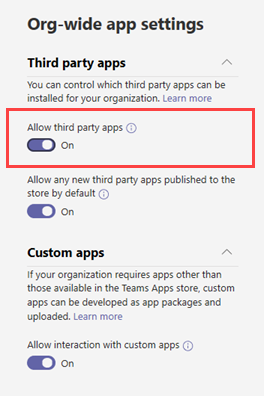

# Consentimiento específico de recursos en Microsoft TeamsResource-specific consent in Microsoft Teams

[!INCLUDE [preview-feature](includes/preview-feature.md)]

El consentimiento específico de los recursos en Microsoft Teams permite que los propietarios de equipos den su consentimiento a las aplicaciones para acceder a los datos del equipo.Resource-specific consent in Microsoft Teams lets team owners give consent to apps to access team data. Entre los ejemplos de este tipo de acceso se incluye la posibilidad de leer mensajes del canal, crear y eliminar canales, así como de crear y quitar fichas de canal.Examples of such access include the ability to read channel messages, create and delete channels, and create and remove channel tabs.

Como administrador, puede controlar si los propietarios de los equipos de su organización pueden dar su consentimiento mediante las opciones de configuración que configure mediante el módulo PowerShell de Azure Active Directory (Azure AD) o el Portal de Azure y el Centro de administración de Microsoft Teams.As an admin, you control whether team owners in your organization can give consent through settings that you configure by using the Azure Active Directory (Azure AD) PowerShell module or the Azure portal and the Microsoft Teams admin center.  

## Establecer si los propietarios de equipos pueden dar su consentimiento a las aplicacionesSet whether team owners can give consent to apps

Estas son las opciones de configuración que debe establecer para controlar si los propietarios de equipos pueden dar su consentimiento a las aplicaciones.Here are the settings that you must set to control whether team owners can give consent to apps. Asegúrese de revisar todos los ajustes siguientes.Be sure to review all the following settings.

### Configuración de Azure ADSettings in Azure AD

Las dos opciones siguientes determinan si los propietarios del equipo pueden dar su consentimiento a las aplicaciones.The following two settings determine whether team owners can give consent to apps.

> [!IMPORTANT]
> El cambio de cualquiera de estas opciones de configuración no afecta al acceso a datos para aplicaciones que ya tienen el consentimiento concedido.Changing any of these settings doesn't affect data access for apps that were already granted consent. Por ejemplo, si configura estas opciones para evitar que los propietarios del equipo concedan su consentimiento, estos cambios no quitarán el acceso a los datos ya concedidos.For example, if you configure these settings to prevent team owners from giving consent, these changes don't remove data access that's already been granted.

#### La configuración "Los usuarios pueden dar su consentimiento para que las aplicaciones accedan a los datos de la empresa en su nombre".The "Users can consent to apps accessing company data on their behalf" setting

Esta configuración controla si los usuarios de su organización pueden dar su consentimiento para las aplicaciones en su nombre.This setting controls whether users in your organization can consent to apps on their behalf. Para permitir que los propietarios del equipo puedan dar su consentimiento, esta configuración debe establecerse en **Sí.**To enable team owners to give consent, this setting must be set to **Yes**. Para administrar esta configuración, haga lo siguiente:To manage this setting, do the following:

1. En el Portal de Azure, vaya a **Configuración de usuario de aplicaciones**  >  **empresariales.**In the Azure portal, go to **Enterprise applications** > **User settings**.
2. En **Aplicaciones empresariales,** establezca **que los usuarios puedan dar su** consentimiento para que las aplicaciones accedan a los datos de la empresa en su nombre en **No** o **Sí.**Under **Enterprise applications**, set **Users can consent to apps accessing company data on their behalf** to **No** or **Yes**.

También puede administrar esta configuración con PowerShell.You can also manage this setting using PowerShell. Para obtener más información, vea [Configurar contenido de usuario en aplicaciones.](https://docs.microsoft.com/azure/active-directory/manage-apps/configure-user-consent#configure-user-consent-to-applications)To learn more, see [Configure user content to applications](https://docs.microsoft.com/azure/active-directory/manage-apps/configure-user-consent#configure-user-consent-to-applications).

#### La configuración "EnableGroupSpecificConsent"The "EnableGroupSpecificConsent" setting

Esta configuración controla si los usuarios de su organización pueden dar su consentimiento para que las aplicaciones accedan a los datos de la compañía de los grupos de los que son propietarios.This setting controls whether users in your organization can consent to apps accessing company data for the groups that they own. Esta configuración debe estar habilitada para que los propietarios del equipo puedan dar su consentimiento.This setting must be enabled for team owners to give consent. Para ver los pasos para administrar esta configuración con PowerShell, vea El consentimiento del propietario del grupo para acceder a los datos [de grupo de las aplicaciones.](https://docs.microsoft.com/azure/active-directory/manage-apps/configure-user-consent#configure-group-owner-consent-to-apps-accessing-group-data)For steps on how to manage this setting by using PowerShell, see [Configure group owner consent to apps accessing group data](https://docs.microsoft.com/azure/active-directory/manage-apps/configure-user-consent#configure-group-owner-consent-to-apps-accessing-group-data).

### Configuración en el Centro de administración de Microsoft TeamsSettings in the Microsoft Teams admin center

Además de la configuración de Azure [AD,](manage-apps.md#manage-org-wide-app-settings) la configuración de aplicaciones para toda la  organización en la  página Administrar aplicaciones determina si una aplicación está bloqueada o está permitida en la página Administrar aplicaciones, y la directiva de permisos de aplicación asignada al propietario del equipo determina si el propietario del equipo puede dar su consentimiento. In addition to settings in Azure AD, [org-wide app settings](manage-apps.md#manage-org-wide-app-settings) on the [Manage apps](manage-apps.md) page, whether an app is blocked or allowed on the [Manage apps](manage-apps.md#allow-and-block-apps) page, and the [app permission policy](teams-app-permission-policies.md) assigned to the team owner determine whether a team owner can give consent.

> [!IMPORTANT]
> El cambio de cualquiera de estas opciones de configuración no afecta al acceso a datos para aplicaciones que ya tienen el consentimiento concedido.Changing any of these settings doesn't affect data access for apps that were already granted consent. Por ejemplo, si deshabilita aplicaciones de terceros en toda la organización o bloquea aplicaciones específicas para impedir que los propietarios del equipo concedan su consentimiento, estos cambios no quitan el acceso a los datos ya concedidos.For example, if you disable third-party apps org-wide or if you block specific apps to prevent team owners from giving consent, these changes don't remove data access that's already been granted.  

#### La configuración "Permitir aplicaciones de terceros" en la configuración de la aplicación para toda la organizaciónThe "Allow third party apps" setting in org-wide app settings

Esta configuración de aplicaciones para toda la organización controla si los usuarios de su organización pueden usar aplicaciones de terceros.This org-wide app setting controls whether users in your organization can use third-party apps. Esta configuración debe estar activa para permitir que los propietarios de equipos puedan dar su consentimiento.This setting must be on to enable team owners to give consent. Para administrar esta configuración, haga lo siguiente:To manage this setting, do the following:

1. En el panel de navegación izquierdo del Centro de administración de Microsoft Teams, vaya a Administrar aplicaciones de **Teams** y, a continuación, haga clic en Configuración  >  de aplicaciones para toda **la organización.**In the left navigation of the Microsoft Teams admin center, go to **Teams apps** > **Manage apps**, and then click **Org-wide app settings**.
2. En **Aplicaciones de terceros,** desactiva o activa Permitir **aplicaciones de terceros.**Under **Third party apps**, turn off or turn on **Allow third party apps**.

    

Es posible que tenga que esperar hasta 24 horas para que sus cambios surtan efecto.You may have to wait up to 24 hours for your changes to take effect.

#### Permitir o bloquear la aplicación en el nivel de organizaciónAllow or block the app at the org level

Al bloquear o permitir una  aplicación en la página Administrar aplicaciones, esa aplicación se bloquea o se permite para todos los usuarios de la organización.When you block or allow an app on the [Manage apps](manage-apps.md#allow-and-block-apps) page, that app is blocked or allowed for all users in your organization. Los propietarios de los equipos solo pueden dar su consentimiento a una aplicación si se permite.Team owners can only give consent to an app if the app is allowed. Para permitir o bloquear una aplicación en el nivel de la organización, haga lo siguiente:To allow or block an app at the org level, do the following:

1. En el panel de navegación izquierdo del Centro de administración de Microsoft Teams, vaya a **Administrar aplicaciones**  >  **de** Teams.In the left navigation of the Microsoft Teams admin center, go to **Teams apps** > **Manage apps**.
2. En la página Administrar aplicaciones, seleccione  la aplicación y, a continuación, haga clic en Bloquear para bloquearla o haga clic en Permitir **para** permitirla.On the Manage apps page, select the app, and then click **Block** to block it or click **Allow** to allow it.

    

#### Directiva de permisos de aplicación asignada al propietario del equipoApp permission policy assigned to the team owner

Los propietarios del equipo solo pueden dar su consentimiento a las aplicaciones que la directiva de permisos de aplicación les permita ejecutar.Team owners can only give consent to apps that their app permission policy allows them to run. Para ver y administrar la directiva de permisos de aplicación que se asigna a un propietario del equipo, haga lo siguiente:To view and manage the app permission policy that's assigned to a team owner, do the following:

1. En el panel de navegación izquierdo del Centro de administración de Microsoft Teams, vaya a **Usuarios.**In the left navigation of the Microsoft Teams admin center, go to **Users**.
2. Haga doble clic en el nombre para mostrar del propietario del equipo y, a continuación, haga clic en **Directivas.**Double-click the display name of the team owner, and then click **Policies**.
3. La directiva asignada al propietario del equipo se enumera en la **directiva de permisos de aplicación.**The policy assigned to the team owner is listed under **App permission policy**.
    - Para asignar una directiva diferente, haga clic **en Editar** y, a continuación, seleccione la directiva que desea asignar.To assign a different policy, click **Edit**, and then select the policy that you want to assign.
    - Para editar la configuración de la directiva asignada al propietario del equipo, haga clic en el nombre de la directiva y luego realice los cambios que desee.To edit the settings of the policy that's assigned to the team owner, click the policy name, and then make the changes that you want.  

## Cargar aplicaciones personalizadasUploading custom apps

Al cargar una aplicación personalizada (también conocida como instalación de lado) que usa el consentimiento específico de los recursos, la aplicación debe proceder del inquilino en el que se está instalando.When uploading a custom app (also known sideloading) that uses resource-specific consent, the app must come from the tenant that it's being installed to. En otras palabras, el registro de aplicaciones de Azure AD debe ser de este inquilino.In other words, the Azure AD app registration must be from this tenant. Los administradores globales están exentos de esta restricción y pueden cargar aplicaciones personalizadas desde cualquier espacio empresarial, ya sea directamente a un equipo (instalación de equipo) o al catálogo de aplicaciones de espacio empresarial.Global admins are exempted from this restriction, and can upload custom apps from any tenant, either directly to a team (sideloading) or to the tenant app catalog.

## Temas relacionadosRelated topics

- [Permisos de RSC disponiblesAvailable RSC permissions](https://aka.ms/teams-rsc)
- [Microsoft GraphMicrosoft Graph](https://developer.microsoft.com/graph)
- [Administrar las aplicaciones en el Centro de administración de Microsoft TeamsManage your apps in the Microsoft Teams admin center](manage-apps.md)
- [Administrar directivas de permisos de aplicación en TeamsManage app permission policies in Teams](teams-app-permission-policies.md)
