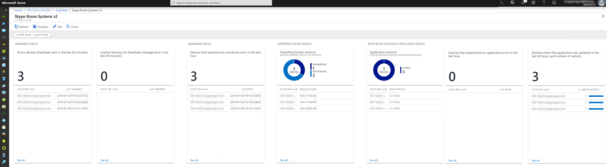

# <a name="deploy-microsoft-teams-rooms-management-with-azure-monitor"></a><span data-ttu-id="237af-103">Implementar la administración de salas de equipos de Microsoft con el Monitor de Azure</span><span class="sxs-lookup"><span data-stu-id="237af-103">Deploy Microsoft Teams Rooms management with Azure Monitor</span></span>

<span data-ttu-id="237af-104">En este artículo se describe cómo configurar e implementar administración integrada, end-to-end de dispositivos de salas de equipos de Microsoft con el Monitor de Azure.</span><span class="sxs-lookup"><span data-stu-id="237af-104">This article discusses how to set up and deploy integrated, end-to-end management of Microsoft Teams Rooms devices by using Azure Monitor.</span></span>

<span data-ttu-id="237af-105">Puede configurar análisis de registro dentro de Monitor de Azure para proporcionar básico telemetry y alertas que le ayudarán a administración las salas de los equipos de Microsoft dispositivos de sala de la reunión.</span><span class="sxs-lookup"><span data-stu-id="237af-105">You can configure Log Analytics within Azure Monitor to provide basic telemetry and alerts that will help you manage Microsoft Teams Rooms meeting room devices.</span></span> <span data-ttu-id="237af-106">A medida que crezca la solución de administración, decide implementar datos adicionales y capacidades de administración para crear una vista más detallada de la disponibilidad de dispositivos y el rendimiento.</span><span class="sxs-lookup"><span data-stu-id="237af-106">As your management solution matures, you might decide to deploy additional data and management capabilities to create a more detailed view of device availability and performance.</span></span>

<span data-ttu-id="237af-107">Siguiendo esta guía, puede usar un panel similar al ejemplo siguiente para obtener el estado detallado de informes de disponibilidad de dispositivo, aplicación y mantenimiento de hardware y aplicación de salas de equipos de Microsoft y distribución de la versión de sistema operativo.</span><span class="sxs-lookup"><span data-stu-id="237af-107">By following this guide, you can use a dashboard like the following example to get detailed status reporting for device availability, application and hardware health, and Microsoft Teams Rooms application and operating system version distribution.</span></span>

<span data-ttu-id="237af-108">![Vista de análisis de registro de ejemplo para salas de equipos de Microsoft] (../media/Deploy-Azure-Monitor-1.png "Vista de análisis de registro de ejemplo para salas de equipos de Microsoft")</span><span class="sxs-lookup"><span data-stu-id="237af-108"></span></span>

<span data-ttu-id="237af-109">A un mayor nivel, debe realizar las siguientes tareas:</span><span class="sxs-lookup"><span data-stu-id="237af-109">At a high level, you need to perform the following tasks:</span></span>


1.  [<span data-ttu-id="237af-110">Validar la configuración del análisis de registro</span><span class="sxs-lookup"><span data-stu-id="237af-110">Validate Log Analytics configuration</span></span>](azure-monitor-deploy.md#validate_LogAnalytics)
2.  [<span data-ttu-id="237af-111">Configurar dispositivos de prueba para el programa de instalación de administración de análisis de registro</span><span class="sxs-lookup"><span data-stu-id="237af-111">Configure test devices for Log Analytics management setup</span></span>](azure-monitor-deploy.md#configure_test_devices)
3.  [<span data-ttu-id="237af-112">Asignar campos personalizados</span><span class="sxs-lookup"><span data-stu-id="237af-112">Map custom fields</span></span>](azure-monitor-deploy.md#Custom_fields)
4.  [<span data-ttu-id="237af-113">Definir las vistas de salas de equipos de Microsoft en el registro de análisis</span><span class="sxs-lookup"><span data-stu-id="237af-113">Define the Microsoft Teams Rooms views in Log Analytics</span></span>](azure-monitor-deploy.md#Define_Views)
5.  [<span data-ttu-id="237af-114">Definir alertas</span><span class="sxs-lookup"><span data-stu-id="237af-114">Define alerts</span></span>](azure-monitor-deploy.md#Alerts)
6.  [<span data-ttu-id="237af-115">Configurar todos los dispositivos de supervisión</span><span class="sxs-lookup"><span data-stu-id="237af-115">Configure all devices for Monitoring</span></span>](azure-monitor-deploy.md#configure_all_devices)
7.  [<span data-ttu-id="237af-116">Configurar las soluciones de Monitor de Azure adicionales</span><span class="sxs-lookup"><span data-stu-id="237af-116">Configure additional Azure Monitor solutions</span></span>](azure-monitor-deploy.md#Solutions)

> [!IMPORTANT]
> <span data-ttu-id="237af-117">Aunque con la configuración mínima, análisis de registro del Monitor de Azure puede supervisar un equipo que ejecute un sistema operativo Windows, aún hay algunos pasos Microsoft Teams salones específicas que se deben tomar antes de iniciar la implementación de agentes a todos los Teams Microsoft Dispositivos de salas.</span><span class="sxs-lookup"><span data-stu-id="237af-117">Although with minimal configuration, Azure Monitor Log Analytics can monitor a computer running a Windows operating system, there are still some Microsoft Teams Rooms–specific steps that you need to take before you start deploying agents to all Microsoft Teams Rooms devices.</span></span>
> <span data-ttu-id="237af-118">Por lo tanto, se recomienda encarecidamente que realizar todos los pasos de configuración en el orden correcto para un controlado el programa de instalación y configuración.</span><span class="sxs-lookup"><span data-stu-id="237af-118">Therefore, we highly recommend you perform all configuration steps in the right order for a controlled setup and configuration.</span></span> <span data-ttu-id="237af-119">La calidad del resultado final depende mucho de la calidad de la configuración inicial.</span><span class="sxs-lookup"><span data-stu-id="237af-119">The quality of the end result very much depends on the quality of the initial configuration.</span></span>

## <a name="validate-log-analytics-configuration"></a><span data-ttu-id="237af-120">Validar la configuración del análisis de registro</span><span class="sxs-lookup"><span data-stu-id="237af-120">Validate Log Analytics configuration</span></span>
<span data-ttu-id="237af-121"><a name="validate_LogAnalytics"> </a></span><span class="sxs-lookup"><span data-stu-id="237af-121"></span></span>

<span data-ttu-id="237af-122">Debe tener un área de trabajo de análisis de registro para iniciar la recopilación de registros de dispositivos de salas de equipos de Microsoft.</span><span class="sxs-lookup"><span data-stu-id="237af-122">You need to have a Log Analytics workspace to start collecting logs from Microsoft Teams Rooms devices.</span></span> <span data-ttu-id="237af-123">Un área de trabajo es un entorno de análisis de registro único con su propio repositorio de datos, orígenes de datos y soluciones.</span><span class="sxs-lookup"><span data-stu-id="237af-123">A workspace is a unique Log Analytics environment with its own data repository, data sources, and solutions.</span></span> <span data-ttu-id="237af-124">Si ya tiene un área de trabajo de análisis de registro existente, puede utilizarlo para supervisar la implementación de salas de equipos de Microsoft o de forma alternativa, puede crear un área de trabajo de análisis de registro dedicado específico para sus salones de los equipos de Microsoft necesidades de monitoreo.</span><span class="sxs-lookup"><span data-stu-id="237af-124">If you already have an existing Log Analytics workspace, you might use it to monitor your Microsoft Teams Rooms deployment or alternatively, you can create a dedicated Log Analytics workspace specific to your Microsoft Teams Rooms monitoring needs.</span></span>

<span data-ttu-id="237af-125">Si necesita crear una nueva área de trabajo de análisis de registro, siga las instrucciones que aparecen en el artículo [crear un área de trabajo de análisis de registro en el portal de Azure](https://docs.microsoft.com/azure/azure-monitor/learn/quick-create-workspace)</span><span class="sxs-lookup"><span data-stu-id="237af-125">If you need to create a new Log Analytics workspace, follow the instructions in the article [Create a Log Analytics workspace in the Azure portal](https://docs.microsoft.com/azure/azure-monitor/learn/quick-create-workspace)</span></span>

> [!NOTE]
> <span data-ttu-id="237af-126">Para usar el análisis de registro con el Monitor de Azure, debe tener una suscripción de Azure activa.</span><span class="sxs-lookup"><span data-stu-id="237af-126">To use Log Analytics with Azure Monitor, you need to have an active Azure subscription.</span></span> <span data-ttu-id="237af-127">Si no dispone de una suscripción de Azure, puede crear [una suscripción de prueba gratuita](https://azure.microsoft.com/free) como punto de partida.</span><span class="sxs-lookup"><span data-stu-id="237af-127">If you don’t have an Azure subscription, you can create [a free trial subscription](https://azure.microsoft.com/free) as a starting point.</span></span>

### <a name="configure-log-analytics-to-collect-microsoft-teams-rooms-event-logs"></a><span data-ttu-id="237af-128">Configurar el registro de análisis para recopilar los registros de eventos de salas de equipos de Microsoft</span><span class="sxs-lookup"><span data-stu-id="237af-128">Configure Log Analytics to collect Microsoft Teams Rooms event logs</span></span>

<span data-ttu-id="237af-129">Análisis de registro sólo recopila eventos de los registros de eventos de Windows que se especifican en la configuración.</span><span class="sxs-lookup"><span data-stu-id="237af-129">Log Analytics only collects events from the Windows event logs that are specified in the settings.</span></span> <span data-ttu-id="237af-130">Para cada registro, se recopilan sólo los eventos con los niveles de gravedad seleccionados.</span><span class="sxs-lookup"><span data-stu-id="237af-130">For each log, only the events with the selected severities are collected.</span></span>

<span data-ttu-id="237af-131">Debe configurar el registro de análisis para recopilar los registros necesarios para supervisar el estado de dispositivo y la aplicación de salas de equipos de Microsoft.</span><span class="sxs-lookup"><span data-stu-id="237af-131">You need to configure Log Analytics to collect the logs required to monitor Microsoft Teams Rooms device and application status.</span></span> <span data-ttu-id="237af-132">Los dispositivos de salas de equipos de Microsoft usan el registro de eventos **Del sistema de sala de Skype** .</span><span class="sxs-lookup"><span data-stu-id="237af-132">Microsoft Teams Rooms devices use the **Skype Room System** event log.</span></span>

<span data-ttu-id="237af-133">Para configurar el registro de análisis para recopilar los eventos de salas de equipos de Microsoft, vea [orígenes de datos de registro de eventos de Windows en el Monitor de Azure](https://docs.microsoft.com/azure/azure-monitor/platform/data-sources-windows-events)</span><span class="sxs-lookup"><span data-stu-id="237af-133">To configure Log Analytics to collect the Microsoft Teams Rooms events, see [Windows event log data sources in Azure Monitor](https://docs.microsoft.com/azure/azure-monitor/platform/data-sources-windows-events)</span></span>

<span data-ttu-id="237af-134">![Configuración del registro de eventos] (../media/Deploy-Azure-Monitor-2.png "Configuración del registro de eventos")</span><span class="sxs-lookup"><span data-stu-id="237af-134"></span></span>

> [!IMPORTANT]
> <span data-ttu-id="237af-135">Configurar las opciones de registro de eventos de Windows y escriba **Del sistema de sala de Skype** como nombre de registro de eventos y, a continuación, seleccione las casillas de verificación **Error**, **Advertencia**e **información** .</span><span class="sxs-lookup"><span data-stu-id="237af-135">Configure Windows Event Log settings and enter **Skype Room System** as event log name, and then select the **Error**, **Warning**, and **Information** check boxes.</span></span>

## <a name="configure-test-devices-for-azure-monitoring"></a><span data-ttu-id="237af-136">Configurar dispositivos de prueba para la supervisión de Azure</span><span class="sxs-lookup"><span data-stu-id="237af-136">Configure test devices for Azure Monitoring</span></span>
<span data-ttu-id="237af-137"><a name="configure_test_devices"> </a></span><span class="sxs-lookup"><span data-stu-id="237af-137"></span></span>

<span data-ttu-id="237af-138">Debe preparar análisis de registro para poder supervisar los eventos relacionados con salas de equipos de Microsoft.</span><span class="sxs-lookup"><span data-stu-id="237af-138">You need to prepare Log Analytics to be able to monitor Microsoft Teams Rooms–related events.</span></span> <span data-ttu-id="237af-139">Para empezar con, deberá implementar Microsoft Monitoring agentes a uno o dos dispositivos de salas de equipos de Microsoft que tienen acceso físico a y obtenerlos dispositivos de prueba generar algunos datos e inserción al área de trabajo de análisis de registro.</span><span class="sxs-lookup"><span data-stu-id="237af-139">To start with, you need to deploy Microsoft Monitoring agents to just one or two Microsoft Teams Rooms devices that you have physical access to, and get those test devices generate some data and push it to the Log Analytics workspace.</span></span>

### <a name="install-microsoft-monitoring-agents-to-test-devices"></a><span data-ttu-id="237af-140">Instalar los agentes de Microsoft Monitoring para los dispositivos de prueba</span><span class="sxs-lookup"><span data-stu-id="237af-140">Install Microsoft Monitoring agents to test devices</span></span>

<span data-ttu-id="237af-141">Implementar al agente de Microsoft Monitoring en los dispositivos de prueba mediante el uso de las instrucciones proporcionadas en [equipos Windows conectarse al servicio de registro de análisis de Azure](https://docs.microsoft.com/azure/azure-monitor/platform/agent-windows).</span><span class="sxs-lookup"><span data-stu-id="237af-141">Deploy the Microsoft Monitoring agent to the test devices by using the instructions provided in [Connect Windows computers to the Log Analytics service in Azure](https://docs.microsoft.com/azure/azure-monitor/platform/agent-windows).</span></span> <span data-ttu-id="237af-142">En este artículo se proporciona información detallada sobre los pasos para la implementación de supervisión de Microsoft Agent para Windows, instrucciones para obtener el ***Identificador del área de trabajo*** de análisis de registro y la ***clave principal*** para obtener los dispositivos de salas de equipos de Microsoft conectado a su implementación de Monitor de Azure y los pasos para comprobar la conectividad del agente a instancia de análisis de registro.</span><span class="sxs-lookup"><span data-stu-id="237af-142">This article provides detailed information about the steps for deploying Microsoft Monitoring Agent for Windows, instructions for obtaining the Log Analytics ***Workspace ID*** and the ***primary key*** to get Microsoft Teams Rooms devices connected to your Azure Monitor deployment, and steps to verify agent connectivity to Log Analytics instance.</span></span>

### <a name="generate-sample-microsoft-teams-rooms-events"></a><span data-ttu-id="237af-143">Generar eventos de ejemplo salones de los equipos de Microsoft</span><span class="sxs-lookup"><span data-stu-id="237af-143">Generate sample Microsoft Teams Rooms events</span></span>

<span data-ttu-id="237af-144">Después de que el agente de Microsoft Monitoring se implementa en los dispositivos de prueba, compruebe que se recopilan los datos de registro de eventos necesarios por el Monitor de Azure.</span><span class="sxs-lookup"><span data-stu-id="237af-144">After the Microsoft Monitoring agent is deployed onto the test devices, verify that the required event log data is collected by Azure Monitor.</span></span>

> [!NOTE]
> <span data-ttu-id="237af-145">Reiniciar el dispositivo tras la instalación del agente Microsoft Monitoring y asegúrese de que esa aplicación de reunión de salas de equipos de Microsoft se ha iniciado, por lo que puede generar eventos de nuevo en el registro de eventos.</span><span class="sxs-lookup"><span data-stu-id="237af-145">Reboot the device after the installation of the Microsoft Monitoring agent, and make sure that Microsoft Teams Rooms Meeting app is started, so that it can generate new events into the Event Log.</span></span>

1.  <span data-ttu-id="237af-146">Inicie sesión el [portal de Microsoft Azure](https://portal.azure.com) y vaya al análisis de registro y seleccione el área de trabajo.</span><span class="sxs-lookup"><span data-stu-id="237af-146">Sign in to the [Microsoft Azure portal](https://portal.azure.com) and go to Log Analytics and select your workspace.</span></span>

2.  <span data-ttu-id="237af-147">Se enumeran los eventos de latido generados por un dispositivo de salas de equipos de Microsoft:</span><span class="sxs-lookup"><span data-stu-id="237af-147">List the heartbeat events generated by a Microsoft Teams Rooms device:</span></span>
    1.  <span data-ttu-id="237af-148">Seleccione el área de trabajo y vaya a **registros** y usar una consulta para recuperar los registros de latido que tendrán los campos personalizados para salas de equipos de Microsoft.</span><span class="sxs-lookup"><span data-stu-id="237af-148">Select your workspace and go to **Logs** and use a query to retrieve the heartbeat records that will have the custom fields for Microsoft Teams Rooms.</span></span>
    2.  <span data-ttu-id="237af-149">Consulta de ejemplo:`Event | where Source == "SRS-App" and EventID == 2000`</span><span class="sxs-lookup"><span data-stu-id="237af-149">Sample query: `Event | where Source == "SRS-App" and EventID == 2000`</span></span>

3.  <span data-ttu-id="237af-150">Asegúrese de que la consulta devuelve los registros de registro que incluyen los eventos generados por la aplicación de las reuniones de salas de equipos de Microsoft.</span><span class="sxs-lookup"><span data-stu-id="237af-150">Make sure that the query returns log records that include events generated by the Microsoft Teams Rooms meetings app.</span></span>

4.  <span data-ttu-id="237af-151">Generar un problema de hardware y validar que se registran los eventos necesarios en análisis de registro de Azure.</span><span class="sxs-lookup"><span data-stu-id="237af-151">Generate a hardware issue, and validate that the required events are logged in Azure Log Analytics.</span></span>
    1.  <span data-ttu-id="237af-152">Desconecte uno de los dispositivos periféricos en la prueba del sistema de salas de equipos de Microsoft.</span><span class="sxs-lookup"><span data-stu-id="237af-152">Unplug one of the peripheral devices on the test Microsoft Teams Rooms system.</span></span> <span data-ttu-id="237af-153">Podría tratarse de la cámara, altavoz, micrófono o para mostrar de la sala de frente</span><span class="sxs-lookup"><span data-stu-id="237af-153">This could be the camera, speakerphone, microphone, or Front Room Display</span></span>
    2.  <span data-ttu-id="237af-154">Espere 10 minutos para el registro de eventos se rellene de análisis de registro de Azure.</span><span class="sxs-lookup"><span data-stu-id="237af-154">Wait 10 minutes for the event log to be populated in Azure Log Analytics.</span></span>
    3.  <span data-ttu-id="237af-155">Utilizar una consulta para los eventos de error de hardware de lista:`Event | where Source == "SRS-App" and EventID == 3001`</span><span class="sxs-lookup"><span data-stu-id="237af-155">Use a query to list hardware error events: `Event | where Source == "SRS-App" and EventID == 3001`</span></span>

5.  <span data-ttu-id="237af-156">Generar un problema de la aplicación y validar que se registran los eventos necesarios.</span><span class="sxs-lookup"><span data-stu-id="237af-156">Generate an application issue, and validate that the required events are logged.</span></span>
    1.  <span data-ttu-id="237af-157">Modificar la configuración de la aplicación de salas de equipos de Microsoft, y escriba un par de dirección y contraseña de protocolo de inicio de sesión (SIP) incorrecta.</span><span class="sxs-lookup"><span data-stu-id="237af-157">Modify Microsoft Teams Rooms application configuration, and type an incorrect Session Initiation Protocol (SIP) address/password pair.</span></span>
    2.  <span data-ttu-id="237af-158">Espere 10 minutos para el registro de eventos se rellene de análisis de registro de Azure.</span><span class="sxs-lookup"><span data-stu-id="237af-158">Wait 10 minutes for the event log to be populated in Azure Log Analytics.</span></span>
    3.  <span data-ttu-id="237af-159">Utilizar una consulta para los eventos de error de aplicación de lista:`Event | where Source == "SRS-App" and EventID == 2001 and EventLevel == 1`</span><span class="sxs-lookup"><span data-stu-id="237af-159">Use a query to list application error events: `Event | where Source == "SRS-App" and EventID == 2001 and EventLevel == 1`</span></span>

> [!IMPORTANT]
> <span data-ttu-id="237af-160">Estos registros de eventos de ejemplo se requieren antes de que se pueden configurar los campos personalizados.</span><span class="sxs-lookup"><span data-stu-id="237af-160">These sample event logs are required before custom fields can be configured.</span></span> <span data-ttu-id="237af-161">No continúe con el siguiente paso hasta que haya recopilado los registros de eventos necesarios.</span><span class="sxs-lookup"><span data-stu-id="237af-161">Don’t proceed to the next step until you have collected the required event logs.</span></span>

## <a name="map-custom-fields"></a><span data-ttu-id="237af-162">Asignar campos personalizados</span><span class="sxs-lookup"><span data-stu-id="237af-162">Map custom fields</span></span>
<span data-ttu-id="237af-163"><a name="Custom_fields"> </a></span><span class="sxs-lookup"><span data-stu-id="237af-163"></span></span>

<span data-ttu-id="237af-164">Usar campos personalizados para extraer datos específicos de los registros de eventos.</span><span class="sxs-lookup"><span data-stu-id="237af-164">You use custom fields to extract specific data from the event logs.</span></span> <span data-ttu-id="237af-165">Debe definir los campos personalizados que se usará más adelante con los mosaicos, vistas de panel y alertas.</span><span class="sxs-lookup"><span data-stu-id="237af-165">You need to define custom fields that will be used later with your tiles, dashboard views, and alerts.</span></span> <span data-ttu-id="237af-166">Vea [campos personalizados de análisis de registro de](https://docs.microsoft.com/azure/azure-monitor/platform/custom-fields) y a familiarizarse con los conceptos antes de empezar a crear los campos personalizados.</span><span class="sxs-lookup"><span data-stu-id="237af-166">See [Custom fields in Log Analytics](https://docs.microsoft.com/azure/azure-monitor/platform/custom-fields) and become familiar with the concepts before you start creating your custom fields.</span></span>

<span data-ttu-id="237af-167">Para extraer los campos personalizados fuera de los registros de eventos capturados, siga estos pasos:</span><span class="sxs-lookup"><span data-stu-id="237af-167">To extract your custom fields out of the captured event logs, follow these steps:</span></span>

1.  <span data-ttu-id="237af-168">Inicie sesión el [portal de Microsoft Azure](https://portal.azure.com) y vaya al análisis de registro y seleccione el área de trabajo.</span><span class="sxs-lookup"><span data-stu-id="237af-168">Sign in to the [Microsoft Azure portal](https://portal.azure.com) and go to Log Analytics and select your workspace.</span></span>

2. <span data-ttu-id="237af-169">Se enumeran los eventos generados por un dispositivo de salas de equipos de Microsoft:</span><span class="sxs-lookup"><span data-stu-id="237af-169">List the events generated by a Microsoft Teams Rooms device:</span></span>
   1.  <span data-ttu-id="237af-170">Vaya a **registros** y usar una consulta para recuperar los registros que va a tener el campo personalizado.</span><span class="sxs-lookup"><span data-stu-id="237af-170">Go to **Logs** and use a query to retrieve the records that will have the custom field.</span></span>
   2.  <span data-ttu-id="237af-171">Consulta de ejemplo:`Event | where Source == "SRS-App" and EventID == 2000`</span><span class="sxs-lookup"><span data-stu-id="237af-171">Sample query: `Event | where Source == "SRS-App" and EventID == 2000`</span></span>

3. <span data-ttu-id="237af-172">Seleccione uno de los registros, seleccione el botón situado a la izquierda e iniciar al Asistente para la extracción de campo.</span><span class="sxs-lookup"><span data-stu-id="237af-172">Select one of the records, select the button to the left, and start the field extraction wizard.</span></span>
4. <span data-ttu-id="237af-173">Resalte los datos que le gustaría extraer el RenderedDescription y proporcione un título de campo.</span><span class="sxs-lookup"><span data-stu-id="237af-173">Highlight the data you’d like to extract from the RenderedDescription and provide a Field Title.</span></span> <span data-ttu-id="237af-174">Se proporcionan los nombres de campo que se deben usar en la tabla 1.</span><span class="sxs-lookup"><span data-stu-id="237af-174">The field names that you should use are provided in Table 1.</span></span>

   <span data-ttu-id="237af-175">![Definición de campos personalizados] (../media/Deploy-Azure-Monitor-4.png "Definición de campos personalizados")</span><span class="sxs-lookup"><span data-stu-id="237af-175"></span></span>

5. <span data-ttu-id="237af-176">Use las asignaciones que se muestra en la *tabla 1*.</span><span class="sxs-lookup"><span data-stu-id="237af-176">Use the mappings shown in *Table 1*.</span></span> <span data-ttu-id="237af-177">Análisis de registro se anexará automáticamente la \*\* \_CF\*\* al definir el nuevo campo de cadena.</span><span class="sxs-lookup"><span data-stu-id="237af-177">Log Analytics will automatically append the **\_CF** string when you define the new field.</span></span>

> [!IMPORTANT]
> <span data-ttu-id="237af-178">Recuerde que todos los campos de análisis de registro y JSON distinguen mayúsculas de minúsculas.</span><span class="sxs-lookup"><span data-stu-id="237af-178">Remember that all JSON and Log Analytics fields are case-sensitive.</span></span>
> 
> <span data-ttu-id="237af-179">Preste atención a las consultas requeridas para cada campo personalizado en la tabla siguiente.</span><span class="sxs-lookup"><span data-stu-id="237af-179">Pay attention to the queries required for each custom field in the table below.</span></span> <span data-ttu-id="237af-180">Debe utilizar las consultas de análisis de registro correctas para extraer correctamente los valores de campo personalizado.</span><span class="sxs-lookup"><span data-stu-id="237af-180">You need to use the correct queries for Log Analytics to successfully extract custom field values.</span></span>
> 
 <span data-ttu-id="237af-181">![Definición de campos personalizados] (../media/Deploy-Azure-Monitor-5.png "Definición de campos personalizados")</span><span class="sxs-lookup"><span data-stu-id="237af-181"></span></span>

<span data-ttu-id="237af-182">**Tabla 1**</span><span class="sxs-lookup"><span data-stu-id="237af-182">**Table 1**</span></span>

| <span data-ttu-id="237af-183">**Campo JSON**</span><span class="sxs-lookup"><span data-stu-id="237af-183">**JSON field**</span></span>                   | <span data-ttu-id="237af-184">**Campo personalizado de análisis de registro**</span><span class="sxs-lookup"><span data-stu-id="237af-184">**Log Analytics custom field**</span></span> | <span data-ttu-id="237af-185">**Nivel del**</span><span class="sxs-lookup"><span data-stu-id="237af-185">**Event ID**</span></span> | <span data-ttu-id="237af-186">**Para usar con la extracción de consulta**</span><span class="sxs-lookup"><span data-stu-id="237af-186">**Query to use with the extraction**</span></span>                   |
|:---------------------------------|:-------------------------------|:-------------|:-------------------------------------------------------|
| <span data-ttu-id="237af-187">Descripción</span><span class="sxs-lookup"><span data-stu-id="237af-187">Description</span></span>                      | <span data-ttu-id="237af-188">SRSEventDescription</span><span class="sxs-lookup"><span data-stu-id="237af-188">SRSEventDescription</span></span>         | <span data-ttu-id="237af-189">**2000**</span><span class="sxs-lookup"><span data-stu-id="237af-189">**2000**</span></span>     | <span data-ttu-id="237af-190">Evento \| de origen donde == "SRS-App" y EventID == 2000</span><span class="sxs-lookup"><span data-stu-id="237af-190">Event \| where Source == "SRS-App" and EventID == 2000</span></span> |
| <span data-ttu-id="237af-191">ResourceState</span><span class="sxs-lookup"><span data-stu-id="237af-191">ResourceState</span></span>                    | <span data-ttu-id="237af-192">SRSResourceState</span><span class="sxs-lookup"><span data-stu-id="237af-192">SRSResourceState</span></span>            | <span data-ttu-id="237af-193">**2000**</span><span class="sxs-lookup"><span data-stu-id="237af-193">**2000**</span></span>     | <span data-ttu-id="237af-194">Evento \| de origen donde == "SRS-App" y EventID == 2000</span><span class="sxs-lookup"><span data-stu-id="237af-194">Event \| where Source == "SRS-App" and EventID == 2000</span></span> |
| <span data-ttu-id="237af-195">OperationName</span><span class="sxs-lookup"><span data-stu-id="237af-195">OperationName</span></span>                    | <span data-ttu-id="237af-196">SRSOperationName</span><span class="sxs-lookup"><span data-stu-id="237af-196">SRSOperationName</span></span>            | <span data-ttu-id="237af-197">**2000**</span><span class="sxs-lookup"><span data-stu-id="237af-197">**2000**</span></span>     | <span data-ttu-id="237af-198">Evento \| de origen donde == "SRS-App" y EventID == 2000</span><span class="sxs-lookup"><span data-stu-id="237af-198">Event \| where Source == "SRS-App" and EventID == 2000</span></span> |
| <span data-ttu-id="237af-199">OperationResult</span><span class="sxs-lookup"><span data-stu-id="237af-199">OperationResult</span></span>                  | <span data-ttu-id="237af-200">SRSOperationResult</span><span class="sxs-lookup"><span data-stu-id="237af-200">SRSOperationResult</span></span>          | <span data-ttu-id="237af-201">**2000**</span><span class="sxs-lookup"><span data-stu-id="237af-201">**2000**</span></span>     | <span data-ttu-id="237af-202">Evento \| de origen donde == "SRS-App" y EventID == 2000</span><span class="sxs-lookup"><span data-stu-id="237af-202">Event \| where Source == "SRS-App" and EventID == 2000</span></span> |
| <span data-ttu-id="237af-203">Sistema operativo</span><span class="sxs-lookup"><span data-stu-id="237af-203">OS</span></span>                               | <span data-ttu-id="237af-204">SRSOSVersion</span><span class="sxs-lookup"><span data-stu-id="237af-204">SRSOSVersion</span></span>                | <span data-ttu-id="237af-205">**2000**</span><span class="sxs-lookup"><span data-stu-id="237af-205">**2000**</span></span>     | <span data-ttu-id="237af-206">Evento \| de origen donde == "SRS-App" y EventID == 2000</span><span class="sxs-lookup"><span data-stu-id="237af-206">Event \| where Source == "SRS-App" and EventID == 2000</span></span> |
| <span data-ttu-id="237af-207">OSVersion</span><span class="sxs-lookup"><span data-stu-id="237af-207">OSVersion</span></span>                        | <span data-ttu-id="237af-208">SRSOSLongVersion</span><span class="sxs-lookup"><span data-stu-id="237af-208">SRSOSLongVersion</span></span>            | <span data-ttu-id="237af-209">**2000**</span><span class="sxs-lookup"><span data-stu-id="237af-209">**2000**</span></span>     | <span data-ttu-id="237af-210">Evento \| de origen donde == "SRS-App" y EventID == 2000</span><span class="sxs-lookup"><span data-stu-id="237af-210">Event \| where Source == "SRS-App" and EventID == 2000</span></span> |
| <span data-ttu-id="237af-211">Alias</span><span class="sxs-lookup"><span data-stu-id="237af-211">Alias</span></span>                            | <span data-ttu-id="237af-212">SRSAlias</span><span class="sxs-lookup"><span data-stu-id="237af-212">SRSAlias</span></span>                    | <span data-ttu-id="237af-213">**2000**</span><span class="sxs-lookup"><span data-stu-id="237af-213">**2000**</span></span>     | <span data-ttu-id="237af-214">Evento \| de origen donde == "SRS-App" y EventID == 2000</span><span class="sxs-lookup"><span data-stu-id="237af-214">Event \| where Source == "SRS-App" and EventID == 2000</span></span> |
| <span data-ttu-id="237af-215">DisplayName</span><span class="sxs-lookup"><span data-stu-id="237af-215">DisplayName</span></span>                      | <span data-ttu-id="237af-216">SRSDisplayName</span><span class="sxs-lookup"><span data-stu-id="237af-216">SRSDisplayName</span></span>              | <span data-ttu-id="237af-217">**2000**</span><span class="sxs-lookup"><span data-stu-id="237af-217">**2000**</span></span>     | <span data-ttu-id="237af-218">Evento \| de origen donde == "SRS-App" y EventID == 2000</span><span class="sxs-lookup"><span data-stu-id="237af-218">Event \| where Source == "SRS-App" and EventID == 2000</span></span> |
| <span data-ttu-id="237af-219">AppVersion</span><span class="sxs-lookup"><span data-stu-id="237af-219">AppVersion</span></span>                       | <span data-ttu-id="237af-220">SRSAppVersion</span><span class="sxs-lookup"><span data-stu-id="237af-220">SRSAppVersion</span></span>               | <span data-ttu-id="237af-221">**2000**</span><span class="sxs-lookup"><span data-stu-id="237af-221">**2000**</span></span>     | <span data-ttu-id="237af-222">Evento \| de origen donde == "SRS-App" y EventID == 2000</span><span class="sxs-lookup"><span data-stu-id="237af-222">Event \| where Source == "SRS-App" and EventID == 2000</span></span> |
| <span data-ttu-id="237af-223">IPv4Address</span><span class="sxs-lookup"><span data-stu-id="237af-223">IPv4Address</span></span>                      | <span data-ttu-id="237af-224">SRSIPv4Address</span><span class="sxs-lookup"><span data-stu-id="237af-224">SRSIPv4Address</span></span>              | <span data-ttu-id="237af-225">**2000**</span><span class="sxs-lookup"><span data-stu-id="237af-225">**2000**</span></span>     | <span data-ttu-id="237af-226">Evento \| de origen donde == "SRS-App" y EventID == 2000</span><span class="sxs-lookup"><span data-stu-id="237af-226">Event \| where Source == "SRS-App" and EventID == 2000</span></span> |
| <span data-ttu-id="237af-227">IPv6Address</span><span class="sxs-lookup"><span data-stu-id="237af-227">IPv6Address</span></span>                      | <span data-ttu-id="237af-228">SRSIPv6Address</span><span class="sxs-lookup"><span data-stu-id="237af-228">SRSIPv6Address</span></span>              | <span data-ttu-id="237af-229">**2000**</span><span class="sxs-lookup"><span data-stu-id="237af-229">**2000**</span></span>     | <span data-ttu-id="237af-230">Evento \| de origen donde == "SRS-App" y EventID == 2000</span><span class="sxs-lookup"><span data-stu-id="237af-230">Event \| where Source == "SRS-App" and EventID == 2000</span></span> |
| <span data-ttu-id="237af-231">Estado de micrófono de conferencia</span><span class="sxs-lookup"><span data-stu-id="237af-231">Conference Microphone status</span></span>     | <span data-ttu-id="237af-232">SRSConfMicrophoneStatus</span><span class="sxs-lookup"><span data-stu-id="237af-232">SRSConfMicrophoneStatus</span></span>     | <span data-ttu-id="237af-233">**3001**</span><span class="sxs-lookup"><span data-stu-id="237af-233">**3001**</span></span>     | <span data-ttu-id="237af-234">Evento \| de origen donde == "SRS-App" y EventID == 3001</span><span class="sxs-lookup"><span data-stu-id="237af-234">Event \| where Source == "SRS-App" and EventID == 3001</span></span> |
| <span data-ttu-id="237af-235">Estado de altavoz de conferencia</span><span class="sxs-lookup"><span data-stu-id="237af-235">Conference Speaker status</span></span>        | <span data-ttu-id="237af-236">SRSConfSpeakerStatus</span><span class="sxs-lookup"><span data-stu-id="237af-236">SRSConfSpeakerStatus</span></span>        | <span data-ttu-id="237af-237">**3001**</span><span class="sxs-lookup"><span data-stu-id="237af-237">**3001**</span></span>     | <span data-ttu-id="237af-238">Evento \| de origen donde == "SRS-App" y EventID == 3001</span><span class="sxs-lookup"><span data-stu-id="237af-238">Event \| where Source == "SRS-App" and EventID == 3001</span></span> |
| <span data-ttu-id="237af-239">Estado del altavoz predeterminado</span><span class="sxs-lookup"><span data-stu-id="237af-239">Default Speaker status</span></span>           | <span data-ttu-id="237af-240">SRSDefaultSpeakerStatus</span><span class="sxs-lookup"><span data-stu-id="237af-240">SRSDefaultSpeakerStatus</span></span>     | <span data-ttu-id="237af-241">**3001**</span><span class="sxs-lookup"><span data-stu-id="237af-241">**3001**</span></span>     | <span data-ttu-id="237af-242">Evento \| de origen donde == "SRS-App" y EventID == 3001</span><span class="sxs-lookup"><span data-stu-id="237af-242">Event \| where Source == "SRS-App" and EventID == 3001</span></span> |
| <span data-ttu-id="237af-243">Estado de la cámara</span><span class="sxs-lookup"><span data-stu-id="237af-243">Camera status</span></span>                    | <span data-ttu-id="237af-244">SRSCameraStatus</span><span class="sxs-lookup"><span data-stu-id="237af-244">SRSCameraStatus</span></span>             | <span data-ttu-id="237af-245">**3001**</span><span class="sxs-lookup"><span data-stu-id="237af-245">**3001**</span></span>     | <span data-ttu-id="237af-246">Evento \| de origen donde == "SRS-App" y EventID == 3001</span><span class="sxs-lookup"><span data-stu-id="237af-246">Event \| where Source == "SRS-App" and EventID == 3001</span></span> |
| <span data-ttu-id="237af-247">Parte delantera del estado de visualización de salón</span><span class="sxs-lookup"><span data-stu-id="237af-247">Front of Room Display status</span></span>     | <span data-ttu-id="237af-248">SRSFORDStatus</span><span class="sxs-lookup"><span data-stu-id="237af-248">SRSFORDStatus</span></span>               | <span data-ttu-id="237af-249">**3001**</span><span class="sxs-lookup"><span data-stu-id="237af-249">**3001**</span></span>     | <span data-ttu-id="237af-250">Evento \| de origen donde == "SRS-App" y EventID == 3001</span><span class="sxs-lookup"><span data-stu-id="237af-250">Event \| where Source == "SRS-App" and EventID == 3001</span></span> |
| <span data-ttu-id="237af-251">Estado del Sensor de movimiento</span><span class="sxs-lookup"><span data-stu-id="237af-251">Motion Sensor status</span></span>             | <span data-ttu-id="237af-252">SRSMotionSensorStatus</span><span class="sxs-lookup"><span data-stu-id="237af-252">SRSMotionSensorStatus</span></span>       | <span data-ttu-id="237af-253">**3001**</span><span class="sxs-lookup"><span data-stu-id="237af-253">**3001**</span></span>     | <span data-ttu-id="237af-254">Evento \| de origen donde == "SRS-App" y EventID == 3001</span><span class="sxs-lookup"><span data-stu-id="237af-254">Event \| where Source == "SRS-App" and EventID == 3001</span></span> |
| <span data-ttu-id="237af-255">Estado de ingesta HDMI</span><span class="sxs-lookup"><span data-stu-id="237af-255">HDMI Ingest status</span></span>               | <span data-ttu-id="237af-256">SRSHDMIIngestStatus</span><span class="sxs-lookup"><span data-stu-id="237af-256">SRSHDMIIngestStatus</span></span>         | <span data-ttu-id="237af-257">**3001**</span><span class="sxs-lookup"><span data-stu-id="237af-257">**3001**</span></span>     | <span data-ttu-id="237af-258">Evento \| de origen donde == "SRS-App" y EventID == 3001</span><span class="sxs-lookup"><span data-stu-id="237af-258">Event \| where Source == "SRS-App" and EventID == 3001</span></span> |


## <a name="define-the-microsoft-teams-rooms-views-in-log-analytics"></a><span data-ttu-id="237af-259">Definir las vistas de salas de equipos de Microsoft en el registro de análisis</span><span class="sxs-lookup"><span data-stu-id="237af-259">Define the Microsoft Teams Rooms views in Log Analytics</span></span>
<span data-ttu-id="237af-260"><a name="Define_Views"> </a></span><span class="sxs-lookup"><span data-stu-id="237af-260"></span></span>

<span data-ttu-id="237af-261">Una vez que se recopilan los datos y se asignan los campos personalizados, puede usar el Diseñador de vistas para desarrollar un panel que contiene varios mosaicos para supervisar los eventos de salas de equipos de Microsoft.</span><span class="sxs-lookup"><span data-stu-id="237af-261">After data is collected and custom fields are mapped, you can use View Designer to develop a dashboard containing various tiles to monitor Microsoft Teams Rooms events.</span></span> <span data-ttu-id="237af-262">Use Diseñador de vistas para crear los siguientes iconos.</span><span class="sxs-lookup"><span data-stu-id="237af-262">Use View Designer to create the following tiles.</span></span> <span data-ttu-id="237af-263">Para obtener más información, vea [crear vistas personalizadas mediante el Diseñador de vista de análisis de registro](https://docs.microsoft.com/azure/azure-monitor/platform/view-designer)</span><span class="sxs-lookup"><span data-stu-id="237af-263">For more information, see [Create custom views by using View Designer in Log Analytics](https://docs.microsoft.com/azure/azure-monitor/platform/view-designer)</span></span>

> [!NOTE]
> <span data-ttu-id="237af-264">Deben haber completado los pasos anteriores en esta guía para que los mosaicos del panel funcionen correctamente.</span><span class="sxs-lookup"><span data-stu-id="237af-264">Previous steps in this guide should have been completed for the dashboard tiles to work properly.</span></span>

### <a name="create-a-microsoft-teams-rooms-dashboard-by-using-the-import-method"></a><span data-ttu-id="237af-265">Crear un panel de salas de equipos de Microsoft mediante el método de importación</span><span class="sxs-lookup"><span data-stu-id="237af-265">Create a Microsoft Teams Rooms dashboard by using the import method</span></span>

<span data-ttu-id="237af-266">Puede importar un panel de salas de equipos de Microsoft e iniciar supervisión rápidamente sus dispositivos.</span><span class="sxs-lookup"><span data-stu-id="237af-266">You can import an Microsoft Teams Rooms dashboard and start monitoring your devices quickly.</span></span> <span data-ttu-id="237af-267">Lleve a cabo los siguientes pasos para importar el panel:</span><span class="sxs-lookup"><span data-stu-id="237af-267">Take the following steps to import the dashboard:</span></span>

1.  <span data-ttu-id="237af-268">Obtenga el archivo del panel de [SkypeRoomSystems_v2.omsview](https://go.microsoft.com/fwlink/?linkid=835675) .</span><span class="sxs-lookup"><span data-stu-id="237af-268">Get the [SkypeRoomSystems_v2.omsview](https://go.microsoft.com/fwlink/?linkid=835675) dashboard file.</span></span>
2.  <span data-ttu-id="237af-269">Inicie sesión el [portal de Microsoft Azure](https://portal.azure.com) y vaya al análisis de registro y seleccione el área de trabajo.</span><span class="sxs-lookup"><span data-stu-id="237af-269">Sign in to the [Microsoft Azure portal](https://portal.azure.com) and go to Log Analytics and select your workspace.</span></span>
3.  <span data-ttu-id="237af-270">Abra el **Diseñador de vistas**.</span><span class="sxs-lookup"><span data-stu-id="237af-270">Open **View Designer**.</span></span>
4.  <span data-ttu-id="237af-271">Seleccione **Importar**y, a continuación, seleccione el archivo **SkypeRoomSystems_v2.omsview** .</span><span class="sxs-lookup"><span data-stu-id="237af-271">Select **Import**, and then select the **SkypeRoomSystems_v2.omsview** file.</span></span>
5.  <span data-ttu-id="237af-272">Seleccione **Guardar**.</span><span class="sxs-lookup"><span data-stu-id="237af-272">Select **Save**.</span></span>

### <a name="create-a-microsoft-teams-rooms-dashboard-manually"></a><span data-ttu-id="237af-273">Crear un panel de salas de equipos de Microsoft de forma manual</span><span class="sxs-lookup"><span data-stu-id="237af-273">Create a Microsoft Teams Rooms dashboard manually</span></span>

<span data-ttu-id="237af-274">Como alternativa, puede crear su propio escritorio y agregar sólo los mosaicos que desea supervisar.</span><span class="sxs-lookup"><span data-stu-id="237af-274">Alternatively, you can create your own dashboard and add only the tiles that you wish to monitor.</span></span>

#### <a name="configure-the-overview-tile"></a><span data-ttu-id="237af-275">Configurar el icono de información general</span><span class="sxs-lookup"><span data-stu-id="237af-275">Configure the Overview Tile</span></span>

1.  <span data-ttu-id="237af-276">Abra el **Diseñador de vistas**.</span><span class="sxs-lookup"><span data-stu-id="237af-276">Open **View Designer**.</span></span>
2.  <span data-ttu-id="237af-277">Seleccione el **Icono de información general sobre**y, a continuación, seleccione **dos números** de la galería.</span><span class="sxs-lookup"><span data-stu-id="237af-277">Select **Overview Tile**, and then select **Two numbers** from the gallery.</span></span>
3.  <span data-ttu-id="237af-278">Nombre el mosaico **Salones de los equipos de Microsoft**.</span><span class="sxs-lookup"><span data-stu-id="237af-278">Name the tile **Microsoft Teams Rooms**.</span></span>
4.  <span data-ttu-id="237af-279">Definir el **primer mosaico**:</span><span class="sxs-lookup"><span data-stu-id="237af-279">Define the **First Tile**:</span></span><br>
    <span data-ttu-id="237af-280">**Leyenda:** Dispositivos que se ha enviado un latido al menos una vez dentro del último mes</span><span class="sxs-lookup"><span data-stu-id="237af-280">**Legend:** Devices that sent a heartbeat at least once within the last month</span></span><br>
    <span data-ttu-id="237af-281">**Consulta:**```Event | where EventLog == "Skype Room System" and TimeGenerated > ago(30d) | summarize TotalSRSDevices = dcount(Computer)```</span><span class="sxs-lookup"><span data-stu-id="237af-281">**Query:** ```Event | where EventLog == "Skype Room System" and TimeGenerated > ago(30d) | summarize TotalSRSDevices = dcount(Computer)```</span></span>
5.  <span data-ttu-id="237af-282">Defina el **segundo icono**:</span><span class="sxs-lookup"><span data-stu-id="237af-282">Define the **Second Tile**:</span></span><br>
    <span data-ttu-id="237af-283">**Leyenda:** Dispositivos activos que envían un latido dentro de la última hora</span><span class="sxs-lookup"><span data-stu-id="237af-283">**Legend:** Active devices that sent a heartbeat within the last hour</span></span><br>
    <span data-ttu-id="237af-284">**Consulta:**```Event | where EventLog == "Skype Room System" and SRSOperationName_CF == "Heartbeat" and TimeGenerated > ago(1h) | summarize TotalSRSDevices = dcount(Computer)```</span><span class="sxs-lookup"><span data-stu-id="237af-284">**Query:** ```Event | where EventLog == "Skype Room System" and SRSOperationName_CF == "Heartbeat" and TimeGenerated > ago(1h) | summarize TotalSRSDevices = dcount(Computer)```</span></span>
6.  <span data-ttu-id="237af-285">Seleccione **Aplicar**.</span><span class="sxs-lookup"><span data-stu-id="237af-285">Select **Apply**.</span></span>

### <a name="create-a-tile-that-displays-active-devices"></a><span data-ttu-id="237af-286">Crear un icono que muestra los dispositivos de activos</span><span class="sxs-lookup"><span data-stu-id="237af-286">Create a tile that displays active devices</span></span>

1.  <span data-ttu-id="237af-287">Seleccione el **Panel de vista** para empezar a agregar los mosaicos.</span><span class="sxs-lookup"><span data-stu-id="237af-287">Select **View Dashboard** to start adding your tiles.</span></span>
2.  <span data-ttu-id="237af-288">Seleccione la **lista & de número** de la Galería</span><span class="sxs-lookup"><span data-stu-id="237af-288">Select **Number & list** from the gallery</span></span>
3.  <span data-ttu-id="237af-289">Definir las propiedades **generales** :</span><span class="sxs-lookup"><span data-stu-id="237af-289">Define the **General** properties:</span></span><br>
    <span data-ttu-id="237af-290">**Título de grupo:** Estado del latido</span><span class="sxs-lookup"><span data-stu-id="237af-290">**Group Title:** Heartbeat Status</span></span><br>
    <span data-ttu-id="237af-291">**Nuevo grupo:** Seleccionado</span><span class="sxs-lookup"><span data-stu-id="237af-291">**New Group:** Selected</span></span>
4.  <span data-ttu-id="237af-292">Definir las propiedades de **icono** :</span><span class="sxs-lookup"><span data-stu-id="237af-292">Define the **Tile** properties:</span></span><br>
    <span data-ttu-id="237af-293">**Leyenda:** Dispositivos activos (latido enviado en los últimos 20 minutos)</span><span class="sxs-lookup"><span data-stu-id="237af-293">**Legend:** Active devices (heartbeat sent in the last 20 minutes)</span></span><br>
    <span data-ttu-id="237af-294">\*\*Consulta de icono: \*\* ```Event | where EventLog == "Skype Room System" and SRSOperationName_CF == "Heartbeat" and TimeGenerated > ago(20m) | summarize AggregatedValue = count() by Computer | count```</span><span class="sxs-lookup"><span data-stu-id="237af-294">**Tile Query:** ```Event | where EventLog == "Skype Room System" and SRSOperationName_CF == "Heartbeat" and TimeGenerated > ago(20m) | summarize AggregatedValue = count() by Computer | count```</span></span>
5.  <span data-ttu-id="237af-295">Definir las propiedades de **lista** :</span><span class="sxs-lookup"><span data-stu-id="237af-295">Define the **List** properties:</span></span><br>
    <span data-ttu-id="237af-296">**Consulta de lista:**```Event | where EventLog == "Skype Room System" and SRSOperationName_CF == "Heartbeat" and TimeGenerated > ago(20m) | summarize TimeGenerated = max(TimeGenerated) by Computer | order by TimeGenerated```</span><span class="sxs-lookup"><span data-stu-id="237af-296">**List Query:** ```Event | where EventLog == "Skype Room System" and SRSOperationName_CF == "Heartbeat" and TimeGenerated > ago(20m) | summarize TimeGenerated = max(TimeGenerated) by Computer | order by TimeGenerated```</span></span>
6.  <span data-ttu-id="237af-297">Definir **los títulos de columna**:</span><span class="sxs-lookup"><span data-stu-id="237af-297">Define **Column Titles**:</span></span><br>
    <span data-ttu-id="237af-298">**Nombre:** Nombre del equipo</span><span class="sxs-lookup"><span data-stu-id="237af-298">**Name:** Computer Name</span></span><br>
    <span data-ttu-id="237af-299">**Valor:** Último latido</span><span class="sxs-lookup"><span data-stu-id="237af-299">**Value:** Last Heartbeat</span></span>
7.  <span data-ttu-id="237af-300">Definir **consultas de navegación**.</span><span class="sxs-lookup"><span data-stu-id="237af-300">Define **Navigation Query**.</span></span><br>
    ```search {selected item} | where EventLog == "Skype Room System" and SRSOperationName_CF == "Heartbeat" | summarize arg_max(TimeGenerated, *) by Computer | project TimeGenerated, Computer, SRSAlias_CF, SRSAppVersion_CF, SRSOSVersion_CF, SRSOSLongVersion_CF, SRSIPv4Address_CF, SRSIPv6Address_CF, SRSOperationName_CF, SRSOperationResult_CF, SRSResourceState_CF, SRSEventDescription_CF```
8.  <span data-ttu-id="237af-301">Seleccione **Aplicar**y, a continuación, en **Cerrar**.</span><span class="sxs-lookup"><span data-stu-id="237af-301">Select **Apply**, and then **Close**.</span></span>

### <a name="create-a-tile-that-displays-devices-that-have-connectivity-issues"></a><span data-ttu-id="237af-302">Crear un icono que muestra los dispositivos que tienen problemas de conectividad</span><span class="sxs-lookup"><span data-stu-id="237af-302">Create a tile that displays devices that have connectivity issues</span></span>

1.  <span data-ttu-id="237af-303">Seleccione **lista & de número** de la galería y, a continuación, agregue un nuevo mosaico.</span><span class="sxs-lookup"><span data-stu-id="237af-303">Select **Number & list** from the gallery, and then add a new tile.</span></span>
2.  <span data-ttu-id="237af-304">Definir las propiedades **generales** :</span><span class="sxs-lookup"><span data-stu-id="237af-304">Define the **General** properties:</span></span><br>
    <span data-ttu-id="237af-305">**Título de grupo:** Deje en blanco</span><span class="sxs-lookup"><span data-stu-id="237af-305">**Group Title:** Leave empty</span></span><br>
    <span data-ttu-id="237af-306">**Nuevo grupo:** No seleccionado</span><span class="sxs-lookup"><span data-stu-id="237af-306">**New Group:** Not Selected</span></span>
3.  <span data-ttu-id="237af-307">Definir las propiedades de **icono** :</span><span class="sxs-lookup"><span data-stu-id="237af-307">Define the **Tile** properties:</span></span><br>
    <span data-ttu-id="237af-308">**Leyenda:** Dispositivos inactivos (ningún mensaje de latido enviado en los últimos 20 minutos)</span><span class="sxs-lookup"><span data-stu-id="237af-308">**Legend:** Inactive Devices (no heartbeat message sent in the last 20 minutes)</span></span><br>
    <span data-ttu-id="237af-309">\*\*Consulta de icono: \*\* ```Event | where EventLog == "Skype Room System" and SRSOperationName_CF == "Heartbeat" | summarize LastHB = max(TimeGenerated) by Computer | where LastHB < ago(20m) | count```</span><span class="sxs-lookup"><span data-stu-id="237af-309">**Tile Query:** ```Event | where EventLog == "Skype Room System" and SRSOperationName_CF == "Heartbeat" | summarize LastHB = max(TimeGenerated) by Computer | where LastHB < ago(20m) | count```</span></span>
4.  <span data-ttu-id="237af-310">Definir las propiedades de **lista** :</span><span class="sxs-lookup"><span data-stu-id="237af-310">Define the **List** properties:</span></span><br>
    <span data-ttu-id="237af-311">**Consulta de lista:**```Event | where EventLog == "Skype Room System" and SRSOperationName_CF == "Heartbeat" | summarize TimeGenerated = max(TimeGenerated) by Computer | where TimeGenerated < ago(20m) | order by TimeGenerated```</span><span class="sxs-lookup"><span data-stu-id="237af-311">**List Query:** ```Event | where EventLog == "Skype Room System" and SRSOperationName_CF == "Heartbeat" | summarize TimeGenerated = max(TimeGenerated) by Computer | where TimeGenerated < ago(20m) | order by TimeGenerated```</span></span>
5.  <span data-ttu-id="237af-312">Definir **los títulos de columna**:</span><span class="sxs-lookup"><span data-stu-id="237af-312">Define **Column Titles**:</span></span><br>
    <span data-ttu-id="237af-313">**Nombre:** Nombre del equipo</span><span class="sxs-lookup"><span data-stu-id="237af-313">**Name:** Computer Name</span></span><br>
    <span data-ttu-id="237af-314">**Valor:** Último latido</span><span class="sxs-lookup"><span data-stu-id="237af-314">**Value:** Last Heartbeat</span></span>
6.  <span data-ttu-id="237af-315">Definir **consultas de navegación**:</span><span class="sxs-lookup"><span data-stu-id="237af-315">Define **Navigation Query**:</span></span><br>
    ```search {selected item} | where EventLog == "Skype Room System" and SRSOperationName_CF == "Heartbeat" | summarize arg_max(TimeGenerated, *) by Computer | project TimeGenerated, Computer, SRSAlias_CF, SRSAppVersion_CF, SRSOSVersion_CF, SRSOSLongVersion_CF, SRSIPv4Address_CF, SRSIPv6Address_CF, SRSOperationName_CF, SRSOperationResult_CF, SRSResourceState_CF, SRSEventDescription_CF```
7.  <span data-ttu-id="237af-316">Seleccione **Aplicar**y, a continuación, en **Cerrar**.</span><span class="sxs-lookup"><span data-stu-id="237af-316">Select **Apply**, and then **Close**.</span></span>

### <a name="create-a-tile-that-displays-devices-that-have-a-hardware-error"></a><span data-ttu-id="237af-317">Crear un icono que muestra los dispositivos que tienen un error de hardware</span><span class="sxs-lookup"><span data-stu-id="237af-317">Create a tile that displays devices that have a hardware error</span></span>

1.  <span data-ttu-id="237af-318">Seleccione **lista & de número** de la galería y, a continuación, agregue un nuevo mosaico.</span><span class="sxs-lookup"><span data-stu-id="237af-318">Select **Number & list** from the gallery, and then add a new tile.</span></span>
2.  <span data-ttu-id="237af-319">Definir las propiedades **generales** :</span><span class="sxs-lookup"><span data-stu-id="237af-319">Define the **General** properties:</span></span><br>
    <span data-ttu-id="237af-320">**Título de grupo:** Estado de hardware</span><span class="sxs-lookup"><span data-stu-id="237af-320">**Group Title:** Hardware Status</span></span><br>
    <span data-ttu-id="237af-321">**Nuevo grupo:** Seleccionado</span><span class="sxs-lookup"><span data-stu-id="237af-321">**New Group:** Selected</span></span>
3.  <span data-ttu-id="237af-322">Definir las propiedades de **icono** :</span><span class="sxs-lookup"><span data-stu-id="237af-322">Define the **Tile** properties:</span></span><br>
    <span data-ttu-id="237af-323">**Leyenda:** Dispositivos que ha experimentado un error de hardware en la última hora</span><span class="sxs-lookup"><span data-stu-id="237af-323">**Legend:** Devices that experienced a hardware error in the last hour</span></span><br>
    <span data-ttu-id="237af-324">\*\*Consulta de icono: \*\* ```Event | where EventLog == "Skype Room System" and EventLevelName == "Error" and EventID == "3001" and TimeGenerated > ago(1h) | summarize AggregatedValue = count() by Computer | count```</span><span class="sxs-lookup"><span data-stu-id="237af-324">**Tile Query:** ```Event | where EventLog == "Skype Room System" and EventLevelName == "Error" and EventID == "3001" and TimeGenerated > ago(1h) | summarize AggregatedValue = count() by Computer | count```</span></span>
4.  <span data-ttu-id="237af-325">Definir las propiedades de **lista** :</span><span class="sxs-lookup"><span data-stu-id="237af-325">Define the **List** properties:</span></span><br>
    <span data-ttu-id="237af-326">**Consulta de lista:**```Event | where EventLog == "Skype Room System" and EventLevelName == "Error" and EventID == "3001" and TimeGenerated > ago(1h) | summarize TimeGenerated = max(TimeGenerated) by Computer | order by TimeGenerated```</span><span class="sxs-lookup"><span data-stu-id="237af-326">**List Query:** ```Event | where EventLog == "Skype Room System" and EventLevelName == "Error" and EventID == "3001" and TimeGenerated > ago(1h) | summarize TimeGenerated = max(TimeGenerated) by Computer | order by TimeGenerated```</span></span>
5.  <span data-ttu-id="237af-327">Definir **los títulos de columna**:</span><span class="sxs-lookup"><span data-stu-id="237af-327">Define **Column Titles**:</span></span><br>
    <span data-ttu-id="237af-328">**Nombre:** Nombre del equipo</span><span class="sxs-lookup"><span data-stu-id="237af-328">**Name:** Computer Name</span></span><br>
    <span data-ttu-id="237af-329">**Valor:** Último Error</span><span class="sxs-lookup"><span data-stu-id="237af-329">**Value:** Last Error</span></span>
6.  <span data-ttu-id="237af-330">Definir **consultas de navegación**:</span><span class="sxs-lookup"><span data-stu-id="237af-330">Define **Navigation Query**:</span></span><br>
    ```search {selected item} | where EventLog == "Skype Room System" and EventID == 3001 and EventLevelName == "Error" | summarize arg_max(TimeGenerated, *) by Computer | project TimeGenerated, Computer, SRSAlias_CF, SRSAppVersion_CF, SRSOSVersion_CF, SRSOSLongVersion_CF, SRSIPv4Address_CF, SRSIPv6Address_CF, SRSOperationName_CF, SRSOperationResult_CF, SRSResourceState_CF, SRSConfMicrophoneStatus_CF, SRSConfSpeakerStatus_CF, SRSDefaultSpeakerStatus_CF, SRSCameraStatus_CF, SRSFORDStatus_CF, SRSMotionSensorStatus_CF, SRSHDMIIngestStatus_CF, SRSEventDescription_CF | sort by TimeGenerated desc```
7.  <span data-ttu-id="237af-331">Seleccione **Aplicar**y, a continuación, en **Cerrar**.</span><span class="sxs-lookup"><span data-stu-id="237af-331">Select **Apply**, and then **Close**.</span></span>

### <a name="create-a-tile-that-displays-microsoft-teams-rooms-operating-system-versions"></a><span data-ttu-id="237af-332">Crear un icono que muestra las versiones del sistema operativo de salas de equipos de Microsoft</span><span class="sxs-lookup"><span data-stu-id="237af-332">Create a tile that displays Microsoft Teams Rooms Operating System versions</span></span>

1.  <span data-ttu-id="237af-333">Seleccione **lista de & rosquilla** desde la Galería de y, a continuación, agregue un nuevo mosaico.</span><span class="sxs-lookup"><span data-stu-id="237af-333">Select **Donut & list** from the gallery, and then add a new tile.</span></span>
2.  <span data-ttu-id="237af-334">Definir las propiedades **generales** :</span><span class="sxs-lookup"><span data-stu-id="237af-334">Define the **General** properties:</span></span><br>
    <span data-ttu-id="237af-335">**Título de grupo:** Detalles del sistema operativo</span><span class="sxs-lookup"><span data-stu-id="237af-335">**Group Title:** Operating System details</span></span><br>
    <span data-ttu-id="237af-336">**Nuevo grupo:** Seleccionado</span><span class="sxs-lookup"><span data-stu-id="237af-336">**New Group:** Selected</span></span>
3.  <span data-ttu-id="237af-337">Definir las propiedades de **encabezado** :</span><span class="sxs-lookup"><span data-stu-id="237af-337">Define the **Header** properties:</span></span><br>
    <span data-ttu-id="237af-338">**Título:** Versiones de sistema operativo</span><span class="sxs-lookup"><span data-stu-id="237af-338">**Title:** Operating System versions</span></span><br>
    <span data-ttu-id="237af-339">**Subtítulo:** Dispositivos que ejecutan versiones específicas del sistema operativo</span><span class="sxs-lookup"><span data-stu-id="237af-339">**Subtitle:** Devices running specific OS versions</span></span>
4.  <span data-ttu-id="237af-340">Definir las propiedades de **anillo** :</span><span class="sxs-lookup"><span data-stu-id="237af-340">Define the **Donut** properties:</span></span><br>
    <span data-ttu-id="237af-341">**Consulta:**```Event | where EventLog == "Skype Room System" and SRSOperationName_CF == "Heartbeat" | summarize OS_Version = max(SRSOSLongVersion_CF) by Computer | summarize AggregatedValue = count() by OS_Version | sort by OS_Version asc```</span><span class="sxs-lookup"><span data-stu-id="237af-341">**Query:** ```Event | where EventLog == "Skype Room System" and SRSOperationName_CF == "Heartbeat" | summarize OS_Version = max(SRSOSLongVersion_CF) by Computer | summarize AggregatedValue = count() by OS_Version | sort by OS_Version asc```</span></span><br>
    <span data-ttu-id="237af-342">**Del centro de texto:** Dispositivos</span><span class="sxs-lookup"><span data-stu-id="237af-342">**Center Text:** Devices</span></span><br>
    <span data-ttu-id="237af-343">**Operación:** Suma</span><span class="sxs-lookup"><span data-stu-id="237af-343">**Operation:** Sum</span></span>
5.  <span data-ttu-id="237af-344">Definir las propiedades de la **lista** .</span><span class="sxs-lookup"><span data-stu-id="237af-344">Define the **List** properties.</span></span><br>
    <span data-ttu-id="237af-345">**Consulta de lista:**```Event | where EventLog == "Skype Room System" and SRSOperationName_CF == "Heartbeat" | summarize SRSOSLongVersion_CF = max(SRSOSLongVersion_CF) by Computer | sort by Computer asc```</span><span class="sxs-lookup"><span data-stu-id="237af-345">**List Query:** ```Event | where EventLog == "Skype Room System" and SRSOperationName_CF == "Heartbeat" | summarize SRSOSLongVersion_CF = max(SRSOSLongVersion_CF) by Computer | sort by Computer asc```</span></span><br>
    <span data-ttu-id="237af-346">**Ocultar gráfico:** Seleccionado</span><span class="sxs-lookup"><span data-stu-id="237af-346">**Hide Graph:** Selected</span></span><br>
    <span data-ttu-id="237af-347">**Habilitar minigráficos:** No seleccionado</span><span class="sxs-lookup"><span data-stu-id="237af-347">**Enable Sparklines:** Not selected</span></span>
6.  <span data-ttu-id="237af-348">Definir **los títulos de columna**.</span><span class="sxs-lookup"><span data-stu-id="237af-348">Define **Column Titles**.</span></span><br>
    <span data-ttu-id="237af-349">**Nombre:** Nombre del equipo</span><span class="sxs-lookup"><span data-stu-id="237af-349">**Name:** Computer Name</span></span><br>
    <span data-ttu-id="237af-350">**Valor:** Deje en blanco</span><span class="sxs-lookup"><span data-stu-id="237af-350">**Value:** Leave Empty</span></span>
7.  <span data-ttu-id="237af-351">Definir **consultas de navegación**.</span><span class="sxs-lookup"><span data-stu-id="237af-351">Define **Navigation Query**.</span></span><br>
    ```search {selected item} | where EventLog == "Skype Room System" and SRSOperationName_CF == "Heartbeat" | summarize arg_max(TimeGenerated, *) by Computer | project TimeGenerated, Computer, SRSDisplayName_CF, SRSAlias_CF, SRSAppVersion_CF, SRSOSVersion_CF, SRSOSLongVersion_CF, SRSIPv4Address_CF, SRSIPv6Address_CF, SRSOperationName_CF, SRSOperationResult_CF, SRSResourceState_CF, SRSEventDescription_CF```
8.  <span data-ttu-id="237af-352">Seleccione **Aplicar** y, a continuación, en **Cerrar**.</span><span class="sxs-lookup"><span data-stu-id="237af-352">Select **Apply** and then **Close**.</span></span>

### <a name="create-a-tile-that-displays-microsoft-teams-rooms-application-versions"></a><span data-ttu-id="237af-353">Crear un icono que muestra las versiones de la aplicación de salas de equipos de Microsoft</span><span class="sxs-lookup"><span data-stu-id="237af-353">Create a tile that displays Microsoft Teams Rooms application versions</span></span>

1.  <span data-ttu-id="237af-354">Seleccione **lista de & rosquilla** desde la Galería de y, a continuación, agregue un nuevo mosaico.</span><span class="sxs-lookup"><span data-stu-id="237af-354">Select **Donut & list** from the gallery, and then add a new tile.</span></span>
2.  <span data-ttu-id="237af-355">Definir las propiedades **generales** :</span><span class="sxs-lookup"><span data-stu-id="237af-355">Define the **General** properties:</span></span><br>
    <span data-ttu-id="237af-356">**Título de grupo:** Detalles de la aplicación de salas de equipos de Microsoft</span><span class="sxs-lookup"><span data-stu-id="237af-356">**Group Title:** Microsoft Teams Rooms application details</span></span><br>
    <span data-ttu-id="237af-357">**Nuevo grupo:** Seleccionado</span><span class="sxs-lookup"><span data-stu-id="237af-357">**New Group:** Selected</span></span>
3.  <span data-ttu-id="237af-358">Definir las propiedades de **encabezado** :</span><span class="sxs-lookup"><span data-stu-id="237af-358">Define the **Header** properties:</span></span><br>
    <span data-ttu-id="237af-359">**Título:** Versiones de la aplicación</span><span class="sxs-lookup"><span data-stu-id="237af-359">**Title:** Application versions</span></span><br>
    <span data-ttu-id="237af-360">**Subtítulo:** Dispositivos que ejecutan versiones de la aplicación específica</span><span class="sxs-lookup"><span data-stu-id="237af-360">**Subtitle:** Devices running specific application versions</span></span>
4.  <span data-ttu-id="237af-361">Definir las propiedades de **anillo** :</span><span class="sxs-lookup"><span data-stu-id="237af-361">Define the **Donut** properties:</span></span><br>
    <span data-ttu-id="237af-362">**Consulta:**```Event | where EventLog == "Skype Room System" and SRSOperationName_CF == "Heartbeat" | summarize App_Version = max(SRSAppVersion_CF) by Computer | summarize AggregatedValue = count() by App_Version | sort by App_Version asc```</span><span class="sxs-lookup"><span data-stu-id="237af-362">**Query:** ```Event | where EventLog == "Skype Room System" and SRSOperationName_CF == "Heartbeat" | summarize App_Version = max(SRSAppVersion_CF) by Computer | summarize AggregatedValue = count() by App_Version | sort by App_Version asc```</span></span><br>
    <span data-ttu-id="237af-363">**Del centro de texto:** Dispositivos</span><span class="sxs-lookup"><span data-stu-id="237af-363">**Center Text:** Devices</span></span><br>
    <span data-ttu-id="237af-364">**Operación:** Suma</span><span class="sxs-lookup"><span data-stu-id="237af-364">**Operation:** Sum</span></span>
5.  <span data-ttu-id="237af-365">Definir las propiedades de la **lista** .</span><span class="sxs-lookup"><span data-stu-id="237af-365">Define the **List** properties.</span></span><br>
    <span data-ttu-id="237af-366">**Consulta de lista:**```Event | where EventLog == "Skype Room System" and SRSOperationName_CF == "Heartbeat" | summarize SRSAppVersion_CF = max(SRSAppVersion_CF) by Computer | sort by Computer asc```</span><span class="sxs-lookup"><span data-stu-id="237af-366">**List Query:** ```Event | where EventLog == "Skype Room System" and SRSOperationName_CF == "Heartbeat" | summarize SRSAppVersion_CF = max(SRSAppVersion_CF) by Computer | sort by Computer asc```</span></span><br>
    <span data-ttu-id="237af-367">**Ocultar gráfico:** Seleccionado</span><span class="sxs-lookup"><span data-stu-id="237af-367">**Hide Graph:** Selected</span></span><br>
    <span data-ttu-id="237af-368">**Habilitar minigráficos:** No seleccionado</span><span class="sxs-lookup"><span data-stu-id="237af-368">**Enable Sparklines:** Not selected</span></span>
6.  <span data-ttu-id="237af-369">Definir **los títulos de columna**.</span><span class="sxs-lookup"><span data-stu-id="237af-369">Define **Column Titles**.</span></span><br>
    <span data-ttu-id="237af-370">**Nombre:** Nombre del equipo</span><span class="sxs-lookup"><span data-stu-id="237af-370">**Name:** Computer Name</span></span><br>
    <span data-ttu-id="237af-371">**Valor:** Deje en blanco</span><span class="sxs-lookup"><span data-stu-id="237af-371">**Value:** Leave Empty</span></span>
7.  <span data-ttu-id="237af-372">Definir **consultas de navegación**.</span><span class="sxs-lookup"><span data-stu-id="237af-372">Define **Navigation Query**.</span></span><br>
    ```search {selected item} | where EventLog == "Skype Room System" and SRSOperationName_CF == "Heartbeat" | summarize arg_max(TimeGenerated, *) by Computer | project TimeGenerated, Computer, SRSAlias_CF, SRSAppVersion_CF, SRSOSVersion_CF, SRSOSLongVersion_CF, SRSIPv4Address_CF, SRSIPv6Address_CF, SRSOperationName_CF, SRSOperationResult_CF, SRSResourceState_CF, SRSEventDescription_CF```
8.  <span data-ttu-id="237af-373">Seleccione **Aplicar** y, a continuación, en **Cerrar**.</span><span class="sxs-lookup"><span data-stu-id="237af-373">Select **Apply** and then **Close**.</span></span>

### <a name="create-a-tile-that-displays-devices-that-have-an-application-error"></a><span data-ttu-id="237af-374">Crear un icono que muestra los dispositivos que tienen un error de aplicación</span><span class="sxs-lookup"><span data-stu-id="237af-374">Create a tile that displays devices that have an application error</span></span>

1.  <span data-ttu-id="237af-375">Seleccione **lista & de número** de la galería y, a continuación, agregue un nuevo mosaico.</span><span class="sxs-lookup"><span data-stu-id="237af-375">Select **Number & list** from the gallery, and then add a new tile.</span></span>
2.  <span data-ttu-id="237af-376">Definir las propiedades **generales** .</span><span class="sxs-lookup"><span data-stu-id="237af-376">Define the **General** properties.</span></span><br>
    <span data-ttu-id="237af-377">**Título de grupo:** Deje en blanco</span><span class="sxs-lookup"><span data-stu-id="237af-377">**Group Title:** Leave empty</span></span><br>
    <span data-ttu-id="237af-378">**Nuevo grupo:** No seleccionado</span><span class="sxs-lookup"><span data-stu-id="237af-378">**New Group:** Not Selected</span></span>
3.  <span data-ttu-id="237af-379">Definir las propiedades de **mosaico** .</span><span class="sxs-lookup"><span data-stu-id="237af-379">Define the **Tile** properties.</span></span><br>
    <span data-ttu-id="237af-380">**Leyenda:** Dispositivos que se produjo un error de aplicación en la última hora</span><span class="sxs-lookup"><span data-stu-id="237af-380">**Legend:** Devices that experienced an application error in the last hour</span></span><br>
    <span data-ttu-id="237af-381">\*\*Consulta de icono: \*\* ```Event | where EventLog == "Skype Room System" and EventLevelName == "Error" and EventID == "2001" and TimeGenerated > ago(1h) | summarize AggregatedValue = count() by Computer | count```</span><span class="sxs-lookup"><span data-stu-id="237af-381">**Tile Query:** ```Event | where EventLog == "Skype Room System" and EventLevelName == "Error" and EventID == "2001" and TimeGenerated > ago(1h) | summarize AggregatedValue = count() by Computer | count```</span></span>
4.  <span data-ttu-id="237af-382">Definir las propiedades de la **lista** .</span><span class="sxs-lookup"><span data-stu-id="237af-382">Define the **List** properties.</span></span><br>
    <span data-ttu-id="237af-383">**Consulta de lista:**```Event | where EventLog == "Skype Room System" and EventLevelName == "Error" and EventID == "2001" and TimeGenerated > ago(1h) | summarize TimeGenerated = max(TimeGenerated) by Computer | order by TimeGenerated```</span><span class="sxs-lookup"><span data-stu-id="237af-383">**List Query:** ```Event | where EventLog == "Skype Room System" and EventLevelName == "Error" and EventID == "2001" and TimeGenerated > ago(1h) | summarize TimeGenerated = max(TimeGenerated) by Computer | order by TimeGenerated```</span></span>
5.  <span data-ttu-id="237af-384">Definir **los títulos de columna**.</span><span class="sxs-lookup"><span data-stu-id="237af-384">Define **Column Titles**.</span></span><br>
    <span data-ttu-id="237af-385">**Nombre:** Nombre del equipo</span><span class="sxs-lookup"><span data-stu-id="237af-385">**Name:** Computer Name</span></span><br>
    <span data-ttu-id="237af-386">**Valor:** Último Error</span><span class="sxs-lookup"><span data-stu-id="237af-386">**Value:** Last Error</span></span>
6.  <span data-ttu-id="237af-387">Definir **consultas de navegación**.</span><span class="sxs-lookup"><span data-stu-id="237af-387">Define **Navigation Query**.</span></span><br>
    ```search {selected item} | where EventLog == "Skype Room System" and EventID == 2001 and EventLevelName == "Error" | summarize arg_max(TimeGenerated, *) by Computer | project TimeGenerated, Computer, SRSAlias_CF, SRSAppVersion_CF, SRSOSVersion_CF, SRSOSLongVersion_CF, SRSIPv4Address_CF, SRSIPv6Address_CF, SRSOperationName_CF, SRSOperationResult_CF, SRSResourceState_CF, SRSEventDescription_CF | sort by TimeGenerated desc```
7.  <span data-ttu-id="237af-388">Seleccione **Aplicar** y, a continuación, en **Cerrar**.</span><span class="sxs-lookup"><span data-stu-id="237af-388">Select **Apply** and then **Close**.</span></span>

### <a name="create-a-tile-that-displays-devices-that-have-been-restarted"></a><span data-ttu-id="237af-389">Crear un icono que muestra los dispositivos que se haya reiniciado</span><span class="sxs-lookup"><span data-stu-id="237af-389">Create a tile that displays devices that have been restarted</span></span>

1.  <span data-ttu-id="237af-390">Seleccione **lista & de número** de la galería y, a continuación, agregue un nuevo mosaico.</span><span class="sxs-lookup"><span data-stu-id="237af-390">Select **Number & list** from the gallery, and then add a new tile.</span></span>
2.  <span data-ttu-id="237af-391">Definir las propiedades **generales** .</span><span class="sxs-lookup"><span data-stu-id="237af-391">Define the **General** properties.</span></span><br>
    <span data-ttu-id="237af-392">**Título de grupo:** Deje en blanco</span><span class="sxs-lookup"><span data-stu-id="237af-392">**Group Title:** Leave empty</span></span><br>
    <span data-ttu-id="237af-393">**Nuevo grupo:** No seleccionado</span><span class="sxs-lookup"><span data-stu-id="237af-393">**New Group:** Not Selected</span></span>
3.  <span data-ttu-id="237af-394">Definir las propiedades de **mosaico** .</span><span class="sxs-lookup"><span data-stu-id="237af-394">Define the **Tile** properties.</span></span><br>
    <span data-ttu-id="237af-395">**Leyenda:** Dispositivos donde se ha reiniciado la aplicación en el último 24 horas y el número de reinicios</span><span class="sxs-lookup"><span data-stu-id="237af-395">**Legend:** Devices where the application was restarted in the last 24 hours, and number of restarts</span></span><br>
    <span data-ttu-id="237af-396">\*\*Consulta de icono: \*\* ```Event | where EventLog == "Skype Room System" and EventID == "4000" and TimeGenerated > ago(24h) | summarize AggregatedValue = count() by Computer | count```</span><span class="sxs-lookup"><span data-stu-id="237af-396">**Tile Query:** ```Event | where EventLog == "Skype Room System" and EventID == "4000" and TimeGenerated > ago(24h) | summarize AggregatedValue = count() by Computer | count```</span></span>
4.  <span data-ttu-id="237af-397">Definir las propiedades de la **lista** .</span><span class="sxs-lookup"><span data-stu-id="237af-397">Define the **List** properties.</span></span><br>
    <span data-ttu-id="237af-398">**Consulta de lista:**```Event | where EventLog == "Skype Room System" and EventID == "4000" and TimeGenerated > ago(24h) | order by TimeGenerated | summarize AggregatedValue = count(EventID) by Computer```</span><span class="sxs-lookup"><span data-stu-id="237af-398">**List Query:** ```Event | where EventLog == "Skype Room System" and EventID == "4000" and TimeGenerated > ago(24h) | order by TimeGenerated | summarize AggregatedValue = count(EventID) by Computer```</span></span>
5.  <span data-ttu-id="237af-399">Definir **los títulos de columna**.</span><span class="sxs-lookup"><span data-stu-id="237af-399">Define **Column Titles**.</span></span><br>
    <span data-ttu-id="237af-400">**Nombre:** Nombre del equipo</span><span class="sxs-lookup"><span data-stu-id="237af-400">**Name:** Computer Name</span></span><br>
    <span data-ttu-id="237af-401">**Valor:** Número de reinicios</span><span class="sxs-lookup"><span data-stu-id="237af-401">**Value:** Number of Restarts</span></span>
6.  <span data-ttu-id="237af-402">Definir **consultas de navegación**.</span><span class="sxs-lookup"><span data-stu-id="237af-402">Define **Navigation Query**.</span></span><br>
    ```search {selected item} | where EventLog == "Skype Room System" and EventID == "4000" and TimeGenerated > ago(24h) | project TimeGenerated, Computer, SRSAlias_CF, SRSAppVersion_CF, SRSOSVersion_CF, SRSOSLongVersion_CF, SRSIPv4Address_CF, SRSIPv6Address_CF, SRSOperationName_CF, SRSOperationResult_CF, SRSResourceState_CF, SRSEventDescription_CF```
7.  <span data-ttu-id="237af-403">Seleccione **Aplicar** y, a continuación, en **Cerrar**.</span><span class="sxs-lookup"><span data-stu-id="237af-403">Select **Apply** and then **Close**.</span></span>
8.  <span data-ttu-id="237af-404">Seleccione **Guardar** para guardar el panel.</span><span class="sxs-lookup"><span data-stu-id="237af-404">Select **Save** to save your dashboard.</span></span>

<span data-ttu-id="237af-405">Ahora ha completado la creación de las vistas.</span><span class="sxs-lookup"><span data-stu-id="237af-405">Now you’ve completed creating your views.</span></span>

## <a name="configure-alerts-in-azure-monitor"></a><span data-ttu-id="237af-406">Configurar las alertas en el Monitor de Azure</span><span class="sxs-lookup"><span data-stu-id="237af-406">Configure Alerts in Azure Monitor</span></span>
<span data-ttu-id="237af-407"><a name="Alerts"> </a></span><span class="sxs-lookup"><span data-stu-id="237af-407"></span></span>

<span data-ttu-id="237af-408">Monitor de Azure puede generar alertas para notificar a los administradores, cuando encuentra un problema con una consola de salas de equipos de Microsoft.</span><span class="sxs-lookup"><span data-stu-id="237af-408">Azure Monitor can raise alerts to notify the administrators, when a Microsoft Teams Rooms console encounters an issue.</span></span>

<span data-ttu-id="237af-409">El Monitor de Azure incluye un mecanismo de alerta integrado que se ejecuta a través de las búsquedas de registro programadas a intervalos regulares.</span><span class="sxs-lookup"><span data-stu-id="237af-409">Azure Monitor includes a built-in alerting mechanism that runs through scheduled log searches at regular intervals.</span></span> <span data-ttu-id="237af-410">Si los resultados de la búsqueda de registro coinciden con algunos criterios determinados, se crea un registro de alerta.</span><span class="sxs-lookup"><span data-stu-id="237af-410">If the results of the log search match some particular criteria, an alert record is created.</span></span>

<span data-ttu-id="237af-411">La regla, a continuación, puede ejecutar automáticamente una o más acciones para informarle de la alerta de manera proactiva o invocar otro proceso.</span><span class="sxs-lookup"><span data-stu-id="237af-411">The rule can then automatically run one or more actions to proactively notify you of the alert or invoke another process.</span></span> <span data-ttu-id="237af-412">Las opciones posibles con las alertas son:</span><span class="sxs-lookup"><span data-stu-id="237af-412">The possible options with alerts are:</span></span>
-   <span data-ttu-id="237af-413">Enviar un correo electrónico</span><span class="sxs-lookup"><span data-stu-id="237af-413">Sending an email</span></span>
-   <span data-ttu-id="237af-414">Invocación de un proceso externo a través de una solicitud HTTP POST</span><span class="sxs-lookup"><span data-stu-id="237af-414">Invoking an external process through an HTTP POST request</span></span>
-   <span data-ttu-id="237af-415">Iniciar un runbook en servicios de automatización de Azure</span><span class="sxs-lookup"><span data-stu-id="237af-415">Starting a runbook in Azure Automation service</span></span>

<span data-ttu-id="237af-416">Vea [iniciar las alertas en el Monitor de Azure](https://docs.microsoft.com/azure/azure-monitor/platform/alerts-unified-log) para obtener más información acerca de las alertas en el Monitor de Azure.</span><span class="sxs-lookup"><span data-stu-id="237af-416">See [Log alerts in Azure Monitor](https://docs.microsoft.com/azure/azure-monitor/platform/alerts-unified-log) to learn more about the alerts in Azure Monitor.</span></span>

> [!NOTE]
> <span data-ttu-id="237af-417">Los siguientes ejemplos envían alertas de correo electrónico cuando un dispositivo de salas de equipos de Microsoft genera un hardware o un error de aplicación.</span><span class="sxs-lookup"><span data-stu-id="237af-417">The following examples send email alerts when a Microsoft Teams Rooms device generates a hardware or an application error.</span></span>

### <a name="configure-an-email-alert-for-microsoft-teams-rooms-hardware-issues"></a><span data-ttu-id="237af-418">Configurar una alerta de correo electrónico para problemas de hardware de salas de equipos de Microsoft</span><span class="sxs-lookup"><span data-stu-id="237af-418">Configure an email alert for Microsoft Teams Rooms hardware issues</span></span>

<span data-ttu-id="237af-419">Configurar una regla de alerta que comprueba para dispositivos de salas de equipos de Microsoft que se encontraron problemas de hardware dentro de la última hora.</span><span class="sxs-lookup"><span data-stu-id="237af-419">Configure an alert rule that checks for Microsoft Teams Rooms devices that have encountered hardware issues within the last hour.</span></span>
1.  <span data-ttu-id="237af-420">Inicie sesión el [portal de Microsoft Azure](https://portal.azure.com) y vaya al análisis de registro y seleccione el área de trabajo.</span><span class="sxs-lookup"><span data-stu-id="237af-420">Sign in to the [Microsoft Azure portal](https://portal.azure.com) and go to Log Analytics and select your workspace.</span></span>

2. <span data-ttu-id="237af-421">Navegue hasta el área de trabajo de análisis de registro y seleccione **las alertas** y, a continuación, seleccione **nueva regla de alerta**</span><span class="sxs-lookup"><span data-stu-id="237af-421">Navigate to your Log Analytics workspace and select **Alerts** and then select **New alert rule**</span></span>

3. <span data-ttu-id="237af-422">Seleccione **Agregar condición** y, a continuación, la **búsqueda de registro personalizada**</span><span class="sxs-lookup"><span data-stu-id="237af-422">Select **Add condition** and then **Custom log search**</span></span>

4.  <span data-ttu-id="237af-423">Escriba la siguiente consulta en el cuadro de texto de consulta de búsqueda.</span><span class="sxs-lookup"><span data-stu-id="237af-423">Enter the following query to the Search query text box.</span></span><br>
    ```
    Event
    | where EventLog == "Skype Room System" and EventLevelName == "Error" and EventID == "3001" and TimeGenerated > ago(1h)
    | summarize arg_max(TimeGenerated, *) by Computer
    | project TimeGenerated, Computer, SRSAlias_CF, SRSAppVersion_CF, SRSOSVersion_CF, SRSOSLongVersion_CF, SRSIPv4Address_CF, SRSIPv6Address_CF, SRSOperationName_CF, SRSOperationResult_CF, SRSResourceState_CF, SRSConfMicrophoneStatus_CF, SRSConfSpeakerStatus_CF, SRSDefaultSpeakerStatus_CF, SRSCameraStatus_CF, SRSFORDStatus_CF, SRSMotionSensorStatus_CF, SRSHDMIIngestStatus_CF, SRSEventDescription_CF
    |sort by TimeGenerated desc
    ```

5.  <span data-ttu-id="237af-424">Configurar las opciones de alerta lógica:</span><span class="sxs-lookup"><span data-stu-id="237af-424">Configure the Alert logic settings:</span></span><br>
    <span data-ttu-id="237af-425">**Basado en:** Número de resultados</span><span class="sxs-lookup"><span data-stu-id="237af-425">**Based on:** Number of results</span></span><br>
    <span data-ttu-id="237af-426">**Condición:** A continuación, mayor</span><span class="sxs-lookup"><span data-stu-id="237af-426">**Condition:** Greater then</span></span><br>
    <span data-ttu-id="237af-427">**Umbral:** 0</span><span class="sxs-lookup"><span data-stu-id="237af-427">**Treshold:** 0</span></span><br>

6. <span data-ttu-id="237af-428">Configurar las opciones de evaluación y seleccione **hecho**:</span><span class="sxs-lookup"><span data-stu-id="237af-428">Configure Evaluation settings and select **Done**:</span></span> <br>
    <span data-ttu-id="237af-429">**Período (en minutos):** 60</span><span class="sxs-lookup"><span data-stu-id="237af-429">**Period (in minutes):** 60</span></span><br>
    <span data-ttu-id="237af-430">**Frecuencia (en minutos):** 60</span><span class="sxs-lookup"><span data-stu-id="237af-430">**Frequency (in minutes):** 60</span></span><br>

7. <span data-ttu-id="237af-431">Configurar grupos de acciones:</span><span class="sxs-lookup"><span data-stu-id="237af-431">Configure action groups:</span></span>
    1.  <span data-ttu-id="237af-432">Seleccione **crear nuevos**</span><span class="sxs-lookup"><span data-stu-id="237af-432">Select **Create New**</span></span>
    2.  <span data-ttu-id="237af-433">Proporcionar nombres adecuados para los campos *nombre de grupo de acción* y el *Nombre corto* .</span><span class="sxs-lookup"><span data-stu-id="237af-433">Provide suitable names for the *Action group name* and *Short Name* fields.</span></span>
    3.  <span data-ttu-id="237af-434">Especificar un único *Nombre de la acción* y seleccione **Correo electrónico o SMS/inserción/voz**y, a continuación, seleccione **Editar detalles**.</span><span class="sxs-lookup"><span data-stu-id="237af-434">Specify a unique *Action Name* and select **Email/SMS/Push/Voice**, and then select **Edit details**.</span></span>
    4.  <span data-ttu-id="237af-435">Seleccione la casilla de verificación de correo electrónico y proporcione la dirección de correo electrónico de la persona o grupo que va a recibir las alertas.</span><span class="sxs-lookup"><span data-stu-id="237af-435">Select the Email checkbox and provide the email address of the person or group that will recieve the alerts.</span></span>
    5.  <span data-ttu-id="237af-436">También puede proporcionar su número de teléfono para recibir una notificación con SMS, una llamada de voz o ambos.</span><span class="sxs-lookup"><span data-stu-id="237af-436">You may also provide your phone number to get notified with SMS, a voice call or both.</span></span>
    6. <span data-ttu-id="237af-437">Haga **clic en Aceptar**.</span><span class="sxs-lookup"><span data-stu-id="237af-437">Select **OK**.</span></span>

8. <span data-ttu-id="237af-438">**Personalizar acciones** si desea invalidar la línea de asunto de los correos electrónicos de alerta.</span><span class="sxs-lookup"><span data-stu-id="237af-438">**Customize Actions** if you like to override the subject line of the alert emails.</span></span>

9. <span data-ttu-id="237af-439">Especifique un nombre de la regla y una descripción.</span><span class="sxs-lookup"><span data-stu-id="237af-439">Specify a rule name and description.</span></span><br>
    <span data-ttu-id="237af-440">**Nombre de la regla:** Alerta de error de Hardware de salas de equipos de Microsoft</span><span class="sxs-lookup"><span data-stu-id="237af-440">**Rule Name:** Microsoft Teams Rooms Hardware Failure Alert</span></span><br>
    <span data-ttu-id="237af-441">**Descripción:** Lista de los dispositivos que se encuentra un problema de hardware dentro de la última hora</span><span class="sxs-lookup"><span data-stu-id="237af-441">**Description:** List of devices that encountered a hardware issue within the last hour</span></span><br>

10. <span data-ttu-id="237af-442">Seleccione la gravedad prevista y asegúrese de que la regla está habilitada.</span><span class="sxs-lookup"><span data-stu-id="237af-442">Select the intended severity and make sure the rule is enabled.</span></span>

11. <span data-ttu-id="237af-443">Seleccione **Crear regla de alertas**.</span><span class="sxs-lookup"><span data-stu-id="237af-443">Select **Create alert rule**.</span></span>

### <a name="configure-an-email-alert-for-microsoft-teams-rooms-application-issues"></a><span data-ttu-id="237af-444">Configurar una alerta de correo electrónico para problemas de aplicaciones de salas de equipos de Microsoft</span><span class="sxs-lookup"><span data-stu-id="237af-444">Configure an email alert for Microsoft Teams Rooms application issues</span></span>

<span data-ttu-id="237af-445">Repita el mismo procedimiento, pero use la siguiente consulta en los dispositivos de lista que se encontraron problemas de aplicaciones dentro de la última hora.</span><span class="sxs-lookup"><span data-stu-id="237af-445">Repeat the same procedure but use the following query to list devices that have encountered application issues within the last hour.</span></span>

    ```
    Event
    | where EventLog == "Skype Room System" and EventLevelName == "Error" and EventID == "2001" and TimeGenerated > ago(1h)
    | summarize arg_max(TimeGenerated, *) by Computer
    | project TimeGenerated, Computer, SRSAlias_CF, SRSAppVersion_CF, SRSOSVersion_CF, SRSOSLongVersion_CF, SRSIPv4Address_CF, SRSIPv6Address_CF, SRSOperationName_CF, SRSOperationResult_CF, SRSResourceState_CF, SRSEventDescription_CF
    | sort by TimeGenerated desc
    ```

<span data-ttu-id="237af-446">Ahora ha completado las alertas de definición.</span><span class="sxs-lookup"><span data-stu-id="237af-446">Now you’ve completed defining alerts.</span></span> <span data-ttu-id="237af-447">Puede definir alertas adicionales mediante el uso de los ejemplos anteriores.</span><span class="sxs-lookup"><span data-stu-id="237af-447">You can define additional alerts by using the examples above.</span></span>

<span data-ttu-id="237af-448">Cuando se genera una alerta, obtendrá un correo electrónico que se enumera los dispositivos que encontraron un problema durante la última hora.</span><span class="sxs-lookup"><span data-stu-id="237af-448">When an alert is generated, you’ll get an email that lists the devices that encountered an issue within the last hour.</span></span>

<span data-ttu-id="237af-449">![Correo electrónico de alerta de Monitor de Azure de ejemplo] (../media/Deploy-Azure-Monitor-6.png "Correo electrónico de alerta de Monitor de Azure de ejemplo")</span><span class="sxs-lookup"><span data-stu-id="237af-449"></span></span>

## <a name="configure-all-devices-for-azure-monitoring"></a><span data-ttu-id="237af-450">Configurar todos los dispositivos para la supervisión de Azure</span><span class="sxs-lookup"><span data-stu-id="237af-450">Configure all devices for Azure Monitoring</span></span>
<span data-ttu-id="237af-451"><a name="configure_all_devices"></a> Una vez configuradas los paneles y las alertas, puede configurar y configurar el agente de Microsoft Monitoring en todos los dispositivos de salas de equipos de Microsoft para llevar a cabo la implementación de supervisión.</span><span class="sxs-lookup"><span data-stu-id="237af-451"><a name="configure_all_devices"> </a> After the dashboards and alerts are configured, you can set up and configure Microsoft Monitoring agent on all Microsoft Teams Rooms devices to complete your monitoring deployment.</span></span>

<span data-ttu-id="237af-452">Aunque se puede instalar y configurar al agente de Microsoft Monitoring manualmente en cada dispositivo, se recomienda encarecidamente que aprovechar los métodos y herramientas de implementación de software existente.</span><span class="sxs-lookup"><span data-stu-id="237af-452">Although you can install and configure the Microsoft Monitoring agent manually on each device, we highly recommend you leverage existing software deployment tools and methods.</span></span>

<span data-ttu-id="237af-453">Si va a crear los dispositivos de salas de equipos de Microsoft por primera vez, es posible que desee incluir los pasos del programa de instalación y configuración del agente de Microsoft Monitoring como parte del proceso de compilación.</span><span class="sxs-lookup"><span data-stu-id="237af-453">If you’re building your Microsoft Teams Rooms devices for the first time, you might want to include the Microsoft Monitoring agent setup and configuration steps as part of your build process.</span></span> <span data-ttu-id="237af-454">Para obtener más información, vea [instalar al agente mediante la línea de comandos](https://docs.microsoft.com/azure/azure-monitor/platform/agent-windows#install-the-agent-using-the-command-line).</span><span class="sxs-lookup"><span data-stu-id="237af-454">For more information, see [Install the agent using the command line](https://docs.microsoft.com/azure/azure-monitor/platform/agent-windows#install-the-agent-using-the-command-line).</span></span>

### <a name="deploying-microsoft-monitoring-agent-by-using-a-group-policy-object-gpo"></a><span data-ttu-id="237af-455">Implementar el agente de Microsoft Monitoring mediante el uso de un objeto de directiva de grupo (GPO)</span><span class="sxs-lookup"><span data-stu-id="237af-455">Deploying Microsoft Monitoring agent by using a Group Policy Object (GPO)</span></span>

<span data-ttu-id="237af-456">Si ya ha implementado los dispositivos de salas de equipos de Microsoft antes de implementar la supervisión de Azure, puede usar la secuencia de comandos para instalar y configurar a los agentes mediante el uso de objetos de directiva de grupo de Active Directory.</span><span class="sxs-lookup"><span data-stu-id="237af-456">If you already deployed your Microsoft Teams Rooms devices before you implement Azure Monitoring, you can use the provided script to set up and configure the agents by using Active Directory group policy objects.</span></span>

1.  <span data-ttu-id="237af-457">Crear una ruta de acceso de red compartida y conceder acceso de lectura al grupo de **Equipos del dominio** .</span><span class="sxs-lookup"><span data-stu-id="237af-457">Create a shared network path and grant read access to **Domain Computers** group.</span></span>

2.  <span data-ttu-id="237af-458">Descargar la versión de 64 bits de Microsoft supervisión agente para Windows desde<https://go.microsoft.com/fwlink/?LinkID=517476></span><span class="sxs-lookup"><span data-stu-id="237af-458">Download the 64-bit version of the Microsoft Monitoring Agent for Windows from <https://go.microsoft.com/fwlink/?LinkID=517476></span></span>

3.  <span data-ttu-id="237af-459">Extraiga el contenido del paquete del programa de instalación en el recurso compartido de red.</span><span class="sxs-lookup"><span data-stu-id="237af-459">Extract the contents of the setup package into the network share.</span></span>
    1.  <span data-ttu-id="237af-460">Abra una ventana del símbolo del sistema y, a continuación, ejecutar **MMASetup-AMD64.exe /c**</span><span class="sxs-lookup"><span data-stu-id="237af-460">Open a Command Prompt window, and then execute **MMASetup-AMD64.exe /c**</span></span>
    2.  <span data-ttu-id="237af-461">Especifique el recurso compartido que acaba de crear y extraiga el contenido.</span><span class="sxs-lookup"><span data-stu-id="237af-461">Specify the share you just created, and extract the content.</span></span>

4.  <span data-ttu-id="237af-462">Crear un nuevo objeto de directiva de grupo y asignar a la unidad organizativa donde se encuentran las cuentas de máquina de salas de equipos de Microsoft.</span><span class="sxs-lookup"><span data-stu-id="237af-462">Create a new Group Policy Object and assign it to the organizational unit where Microsoft Teams Rooms machine accounts are located.</span></span>

5.  <span data-ttu-id="237af-463">Configurar la directiva de ejecución de PowerShell:</span><span class="sxs-lookup"><span data-stu-id="237af-463">Configure PowerShell execution policy:</span></span>
    1.  <span data-ttu-id="237af-464">Editar el objeto de directiva de grupo recién creada y vaya a configuración del equipo \\ directivas \\ plantillas administrativas \\ componentes de Windows \\ Windows PowerShell</span><span class="sxs-lookup"><span data-stu-id="237af-464">Edit the newly created Group Policy Object and navigate to Computer Configuration \\ Policies \\ Administrative Templates \\ Windows Components \\ Windows PowerShell</span></span>
    2.  <span data-ttu-id="237af-465">Habilite la **activar la ejecución del Script** y establecer la **Directiva de ejecución** para **Permitir que los Scripts de Local**.</span><span class="sxs-lookup"><span data-stu-id="237af-465">Enable the **Turn on Script Execution** and set **Execution Policy** to **Allow Local Scripts**.</span></span>

6.  <span data-ttu-id="237af-466">Configurar el script de inicio:</span><span class="sxs-lookup"><span data-stu-id="237af-466">Configure the startup script:</span></span>
    1.  <span data-ttu-id="237af-467">Copie la siguiente secuencia de comandos y guárdelo como Install-MMAgent.ps1.</span><span class="sxs-lookup"><span data-stu-id="237af-467">Copy the following script and save it as Install-MMAgent.ps1.</span></span>
    2.  <span data-ttu-id="237af-468">Modificar parámetros WorkspaceId, WorkspaceKey y SetupPath para que coincida con la configuración.</span><span class="sxs-lookup"><span data-stu-id="237af-468">Modify WorkspaceId, WorkspaceKey, and SetupPath parameters to match your configuration.</span></span>
    3.  <span data-ttu-id="237af-469">Editar el mismo objeto de directiva de grupo y vaya a configuración del equipo \\ directivas \\ configuración de Windows \\ secuencias de comandos (inicio/apagado)</span><span class="sxs-lookup"><span data-stu-id="237af-469">Edit the same Group Policy Object and navigate to Computer Configuration \\ Policies \\ Windows Settings \\ Scripts (Startup/Shutdown)</span></span>
    4.  <span data-ttu-id="237af-470">Haga doble clic para seleccionar el **Inicio**y, a continuación, seleccione **Las secuencias de comandos de PowerShell**.</span><span class="sxs-lookup"><span data-stu-id="237af-470">Double-click to select **Startup**, and then select **PowerShell Scripts**.</span></span>
    5.  <span data-ttu-id="237af-471">Seleccione **Mostrar archivos**y, a continuación, copie el archivo de **Instalación MMAgent.ps1** a esa carpeta.</span><span class="sxs-lookup"><span data-stu-id="237af-471">Select **Show Files**, and then copy the **Install-MMAgent.ps1** file to that folder.</span></span>
    6.  <span data-ttu-id="237af-472">Seleccione **Agregar**y, a continuación, **busque**.</span><span class="sxs-lookup"><span data-stu-id="237af-472">Select **Add**, and then **Browse**.</span></span>
    7.  <span data-ttu-id="237af-473">Seleccione la secuencia de comandos ps1 que acaba de copiar.</span><span class="sxs-lookup"><span data-stu-id="237af-473">Select the ps1 script you just copied.</span></span>

7.  <span data-ttu-id="237af-474">Dispositivos de salas de equipos de Microsoft deben instalar y configurar al agente de Microsoft Monitoring con el segundo reinicio.</span><span class="sxs-lookup"><span data-stu-id="237af-474">Microsoft Teams Rooms devices should install and configure the Microsoft Monitoring agent with the second reboot.</span></span>

```
# Install-MMAgent.ps1
<#
Date:        04/20/2018
Script:      Install-MMAgent.ps1
Version:     1.0
#>

# Set the parameters
$WorkspaceId = "<your workspace id>"
$WorkspaceKey = "<your workspace key>"
$SetupPath = "\\Server\Share"

$SetupParameters = "/qn NOAPM=1 ADD_OPINSIGHTS_WORKSPACE=1 OPINSIGHTS_WORKSPACE_AZURE_CLOUD_TYPE=0 OPINSIGHTS_WORKSPACE_ID=$WorkspaceId OPINSIGHTS_WORKSPACE_KEY=$WorkspaceKey AcceptEndUserLicenseAgreement=1"

# $SetupParameters = $SetupParameters + " OPINSIGHTS_PROXY_URL=<Proxy server URL> OPINSIGHTS_PROXY_USERNAME=<Proxy server username> OPINSIGHTS_PROXY_PASSWORD=<Proxy server password>"

# Start PowerShell logging
Start-Transcript -Path C:\Temp\MMA-Install.Log

# Check if the Microsoft Monitoring Agent is installed
$mma = New-Object -ComObject 'AgentConfigManager.MgmtSvcCfg'

# Check if the Microsoft Monitoring agent is installed
if (!$mma)
{
    #Install agent
    Start-Process -FilePath "$SetupPath\Setup.exe" -ArgumentList $SetupParameters -ErrorAction Stop -Wait
}

# Check if the agent has a valid configuration
$CheckMMA = $mma.GetCloudWorkspace($WorkspaceId).AgentId
if (!$CheckMMA)
{
    # Apply new configuration
    $mma.AddCloudWorkspace($WorkspaceId, $WorkspaceKey)
    $mma.ReloadConfiguration()
}

Stop-Transcript
```

> [!NOTE]
> <span data-ttu-id="237af-475">Puede consultar el artículo de [administrar y mantener al agente de análisis de registro](https://docs.microsoft.com/azure/azure-monitor/platform/agent-manage) cuando es necesario volver a configurar a un agente, moverlo a un área de trabajo diferente, o modificar la configuración de proxy después de la instalación inicial.</span><span class="sxs-lookup"><span data-stu-id="237af-475">You can refer to the article [Managing and maintaining the Log Analytics agent](https://docs.microsoft.com/azure/azure-monitor/platform/agent-manage) when you need to reconfigure an agent, move it to a different workspace, or modify proxy settings after the initial installation.</span></span>

## <a name="additional-solutions"></a><span data-ttu-id="237af-476">Soluciones adicionales</span><span class="sxs-lookup"><span data-stu-id="237af-476">Additional Solutions</span></span>
<span data-ttu-id="237af-477"><a name="Solutions"> </a></span><span class="sxs-lookup"><span data-stu-id="237af-477"></span></span>

<span data-ttu-id="237af-478">Monitor de Azure proporciona soluciones de administración integradas a través de su [Galería de soluciones](https://docs.microsoft.com/azure/azure-monitor/insights/solutions) que aún más, le ayudarán a supervisar el entorno.</span><span class="sxs-lookup"><span data-stu-id="237af-478">Azure Monitor provides built-in management solutions through its [solution gallery](https://docs.microsoft.com/azure/azure-monitor/insights/solutions) to further help you monitor your environment.</span></span> <span data-ttu-id="237af-479">Se recomienda que agregue las soluciones de [Administración de alertas](https://docs.microsoft.com/azure/azure-monitor/platform/alert-management-solution) y [Mantenimiento del agente de análisis de Azure registro](https://docs.microsoft.com/azure/azure-monitor/insights/solution-agenthealth) a su área de trabajo.</span><span class="sxs-lookup"><span data-stu-id="237af-479">We highly recommend that you add [Alert Management](https://docs.microsoft.com/azure/azure-monitor/platform/alert-management-solution) and [Azure Log Analytics Agent Health](https://docs.microsoft.com/azure/azure-monitor/insights/solution-agenthealth) solutions to your workspace as well.</span></span>

> [!NOTE]
> <span data-ttu-id="237af-480">La solución de mantenimiento de agente puede ayudar a identificar a anticuados o rotos agentes Microsoft Monitoring dentro de su entorno y la solución de administración de alertas proporciona información detallada acerca de las alertas que se han desencadenado dentro de un período determinado.</span><span class="sxs-lookup"><span data-stu-id="237af-480">The Agent Health solution can help you identify outdated or broken Microsoft Monitoring agents within your environment, and the Alert Management solution provides details about the alerts that have been raised within a given period.</span></span>

## <a name="see-also"></a><span data-ttu-id="237af-481">Vea también</span><span class="sxs-lookup"><span data-stu-id="237af-481">See also</span></span>

[<span data-ttu-id="237af-482">Planeación de la administración de salas de equipos de Microsoft con el Monitor de Azure</span><span class="sxs-lookup"><span data-stu-id="237af-482">Plan Microsoft Teams Rooms management with Azure Monitor</span></span>](azure-monitor-plan.md)

[<span data-ttu-id="237af-483">Administrar dispositivos de salas de equipos de Microsoft con el Monitor de Azure</span><span class="sxs-lookup"><span data-stu-id="237af-483">Manage Microsoft Teams Rooms devices with Azure Monitor</span></span>](azure-monitor-manage.md)