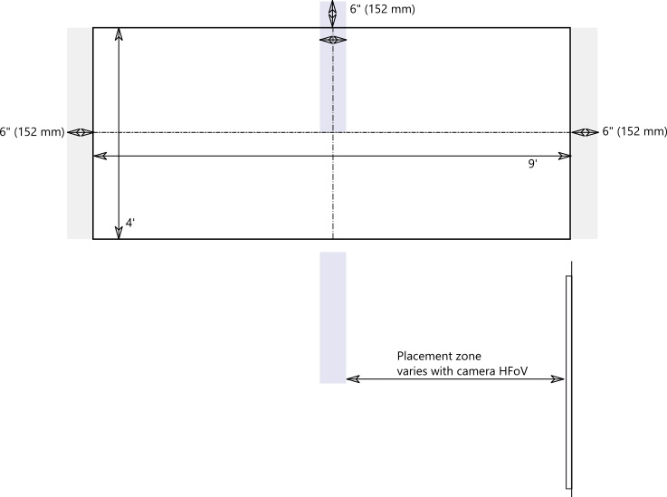

# Cámaras de contenidoContent cameras

Ahora puede usar una cámara de contenido con un sistema de salas de Microsoft Teams.You can now use a content camera with a Microsoft Teams Room system. Una cámara de contenido interactúa con un software de procesamiento de imágenes especial y una pizarra para permitir que un moderador dibuje en una pizarra analógica y comparta el contenido con los participantes remotos.A content camera interacts with special image-processing software and a whiteboard to allow a presenter to draw on an analog whiteboard and share the content with remote participants.

Vea el vídeo [: como se encuentra en un solo lugar, con salas de Microsoft Teams, donde](https://youtu.be/1XvgH2rNpmk?t=350) encontrará ejemplos de funcionalidad de cámara de contenido.See the video [Work like you are in one place, with Microsoft Teams Rooms](https://youtu.be/1XvgH2rNpmk?t=350) for examples of content camera functionality.

## Configurar una cámara de contenidoSet up a content camera

> [!NOTE]
> Adherirse siempre al código de construcción de tu país o área, que puede definir una distancia mínima desde el piso o un requisito que garantice que el equipo se asegure a un balsa u otra estructura.Always adhere to your country or area's building code, which may define a minimum distance from the floor or a requirement that ceiling-mounted equipment be secured to a rafter or other structure. Siga las instrucciones de montaje del hardware proporcionado con la cámara que ha seleccionado.Follow the mounting instruction for the hardware provided with the camera you‘ve selected. Los kits de montaje de cámaras OEM incluyen una cámara, prolongadores USB 2,0 y un cable necesario.OEM camera mounting kits include a camera, USB 2.0 extenders and required cabling.

El tamaño de la pizarra que se usa para compartir afecta a la colocación de la cámara.The size of the whiteboard used for sharing affects the placement of the camera. Las recomendaciones de tamaño del panel son:Board size recommendations are:

- 3-6 m (0,9-1,8 m) de anchura: compatible3–6 ft. (0.9–1.8 m) wide — Supported
- 6 – 9 m (1,8-2,7 m) de ancho: recomendado6–9 ft. (1.8–2.7 m) wide — Recommended
- 9 – 12 m (2,7 – 3,6 m) de anchura: compatibles9–12 ft. (2.7–3.6 m) wide — Supported
- Por encima de la 3,6 m (12 pies) de anchura, la cámara cubre 9 – 12 ft (2,7 – 3.6 m) y recorta el resto.Above 12 ft. (3.6 m) wide — camera covers 9–12 ft. (2.7–3.6 m) and crops the rest.

## Ubicación de la cámaraCamera location

La colocación ideal de una cámara de contenido está centrada vertical y horizontalmente en la pizarra.Ideal placement of a content camera is centered vertically and horizontally on the whiteboard. Los códigos de construcción locales pueden tener restricciones de alto que requieren que la cámara se eleva más allá de la parte superior del panel blanco.Local building codes may have height restrictions that require the camera be elevated higher than the top of the white board.

Puedes instalar la cámara hasta 6 en.You can install the camera up to 6 in. (152 mm) más allá de la parte superior de la pizarra y se centra en la pizarra, tal y como se muestra.(152 mm) higher than the top of the whiteboard, and centered on the white board as shown. Asegúrate de que la imagen de la cámara incluya al menos un 6 en.Make sure that the camera image includes at least a 6 in. (152 mm) borde horizontal en ambas caras.(152 mm) border on both sides horizontally. Puede usar la vista previa de la cámara en la aplicación salas de Microsoft Teams para determinar la colocación final de la cámara.You can use the camera preview in the Microsoft Teams Rooms app to determine final placement of the camera.

### Distancias de la cámaraCamera distances

Con los marcadores de pizarra típicos, la experiencia de usuario remota óptima es compartir trazos de lápiz en el intervalo de 1 a 2 mm por píxel en la imagen de la cámara de contenido y los mejores resultados usan 1,5 mm por píxel.Using typical whiteboard markers, the optimal remote user experience is to share ink strokes in the 1–2 mm per pixel range in the content camera image, and the best results use 1.5 mm per pixel. Todas las cámaras compatibles proporcionan una resolución de 1920 x 1080 y otras pueden exceder esa resolución.All supported cameras provide 1920 x 1080 resolution, and some can exceed that resolution.

La distancia entre la cámara y la pizarra se combina con la resolución de la cámara y HFoV para determinar la distancia desde la pizarra.The distance of the camera from the whiteboard combines with the camera resolution and HFoV to determine the distance from the whiteboard. En la tabla siguiente se muestran ejemplos de distancias para varios tamaños de pizarra.The following table shows examples of distances for various whiteboard sizes. Puede usar estos valores como puntos de partida para determinar la ubicación final de la cámara de contenido.You can use these values as starting points to determine final placement of the content camera.

**Distancia de la cámara desde la pizarra****Camera distance from whiteboard**

| Cámara HFoVCamera HFoV |3 m (0,91 m)3 ft. (0.91 m)     | 6 ft (1,8 m)6 ft. (1.8 m)    | 2,74 m (9 ft)9 ft. (2.74 m)        |12 m.  (3,65 m)12 ft.  (3.65 m)         | Distancia máxima desde pizarraMax distance from Whiteboard  |
|:---         |:---               |:---                |:---                 |:---             | :--- |
| 80 °80°         | 1,79 ft (0,54 m)1.79 ft. (0.54 m) | 3,58 ft (1,09 m)3.58 ft. (1.09 m)  | 5,36 ft (1,6 m)5.36 ft. (1.6 m)    |7,15 ft (2,17 m)7.15 ft. (2.17 m) |7,51 ft (2,28 m)7.51 ft. (2.28 m) |
| 90 °90°         | 1,5 ft (0,45 m)1.5 ft. (0.45 m) | 3,00 ft (0,91 m)3.00 ft. (0.91 m)   | 4,5 ft (1,37 m)4.5 ft. (1.37 m)    |6,0 ft (1,82 m)6.0 ft. (1.82 m)    |6,3 ft (1,92 m)6.3 ft. (1.92 m) |
| 100 °100°        | 1,26 ft (0,38 m)1.26 ft. (0.38 m)| 2,52 ft (0,77 m)2.52 ft. (0.77 m)   | 3,78 ft (1,15 m)3.78 ft. (1.15 m)   |5,03 ft (1,53 m)5.03 ft. (1.53 m)   |5,29 ft (1,61 m)5.29 ft. (1.61 m) |
| 110 °110°        | 1,05 ft (0,32 m)1.05 ft. (0.32 m)| 2,10 ft (0,64 m)2.10 ft. (0.64 m)   | 3,15 ft (0,96 m)3.15 ft. (0.96 m)   |4,2 ft (1,28 m)4.2 ft. (1.28 m)    |4,41 ft (1,31 m)4.41 ft. (1.31 m) |
| 120 °120°        | 0,87 ft (0,26 m)0.87 ft. (0.26 m)| 1,73 ft (0,52 m)1.73 ft. (0.52 m)   | 2,60 ft (0,79 m)2.60 ft. (0.79 m)   |3,46 ft (1,05 m)3.46 ft. (1.05 m)   |3,64 ft (1,10 m)3.64 ft. (1.10 m) |
|             |               |                  |                  |        |                    |                  |

La distancia entre la cámara de contenido y el muro en el que se monta la pizarra depende de la HFoV para ese modelo de cámara, que varía.The distance between the content camera and the wall the whiteboard is mounted on depends on the HFoV for that model of camera, which varies. Instala cámaras con un HFoV más grande (por ejemplo, 120 grados) cerca de la pared y cámaras con un HFoV más estrecho lejos de la pared.Install cameras with a larger HFoV (120 degrees for example) closer to the wall, and cameras with a narrower HFoV farther away from the wall. Comprueba el HFoV antes de empezar a instalar la cámara elegida.Check the HFoV before you start to install the chosen camera.

Si hay pizarras de más de 12 m (3,65 m) o sin esquinas (como pizarras de pared completa), puedes colocar la cámara en cualquier lugar del medio.If you have whiteboards larger than 12 ft. (3.65 m) or with no corners (like full wall whiteboards), you can place the camera anywhere in the middle. El software de mejora selecciona un área en el medio si no encuentra las esquinas de la pizarra.The enhancement software selects an area in the middle if it fails to find whiteboard corners.

> [!NOTE]
> Puede usar cinta de color oscuro u otros elementos para crear un área de cámara de contenido definida en un panel blanco de pared completa.You can use dark-colored tape or other items to create a defined content camera area on a full-wall white board.
>
> Puede optar por montar la cámara en un trípode móvil en lugar de montarla de manera permanente.You can choose to have the camera mounted on a moveable tripod instead of a permanent mount. Coloca el trípode en el centro de la pizarra.Place the tripod centered on the whiteboard. Esta configuración puede ser temporal o utilizarse en caso de que haya pocas posibilidades de derribar el equipo.This setup may be temporary or used where there is little chance of knocking over the equipment. Si usa un montaje temporal, recuerde que la mejora del contenido se verá afectada si mueve la cámara después del uso compartido inicial y necesitará volver a compartirla para corregir el movimiento.If you use a temporary mount, remember that content enhancement will be impacted if you move the camera after the initial share and you will need to re-share to correct for movement.
>
> No se admite un panel de escritura que no sea blanco.A writing board that isn't white is not supported.

## Cámaras compatiblesSupported cameras

Para determinar si puede usar una cámara como cámara de contenido, consulte [versiones de firmware certificadas para periféricos de audio y vídeo USB](requirements.md#certified-firmware-versions-for-usb-audio-and-video-peripherals).To determine whether you can use a camera as a content camera, refer to [Certified firmware versions for USB audio and video peripherals](requirements.md#certified-firmware-versions-for-usb-audio-and-video-peripherals).

O bien, consulte los kits de cámaras de contenido admitidos en Microsoft Teams Devices en [aka.ms/teamsdevices](https://aka.ms/teamsdevices).Or, refer to the Microsoft Teams devices marketplace for supported Content Camera Kits at [aka.ms/teamsdevices](https://aka.ms/teamsdevices).

## Configuración de la cámaraCamera settings

Una vez instalada la cámara en la sala, configúrelo en la consola de salas de Microsoft Teams de la sala:Once the camera is installed in the room, set it up on that room's Microsoft Teams Rooms console:

1. Seleccione configuración de configuración](../media/70f1b43f-16d6-4172-9139-71d845c4ed5c.png), inicie sesión como administrador y seleccione **configuración del dispositivo**. \*\*\*\* ,  log in as Admin, and select **Device Settings**.
2. En la sección valores predeterminados de **cámara** , seleccione la cámara de contenido y asegúrese de que esté seleccionada la opción **mejoras de contenido** .In the **Camera Defaults** section, select the content camera and make sure that the **Content enhancements** option is selected.
3. Faculta Si la cámara se instaló al revés porque la cámara se montó desde el techo, active la opción **rotar la cámara de contenido 180 °** .(Optional) If the camera was installed upside down because the camera was mounted from the ceiling, check the **Rotate content camera 180°** option.
4. Seleccione **Guardar y salir**.Select **Save and exit**.

También puede ajustar esta configuración de forma remota con un [archivo de configuración XML](xml-config-file.md).You can also adjust these settings remotely using an [XML configuration file](xml-config-file.md).

## Vea tambiénSee also

[Administrar de forma remota la configuración de la consola de salas de Microsoft Teams con un archivo de configuración XMLManage a Microsoft Teams Rooms console settings remotely with an XML configuration file](xml-config-file.md)

[Requisitos de salas de Microsoft TeamsMicrosoft Teams Rooms requirements](requirements.md)
