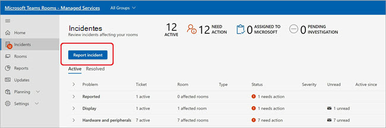
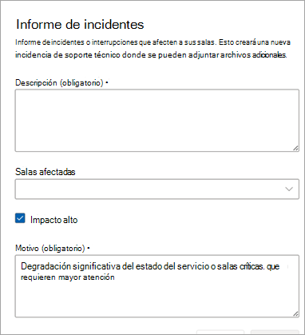
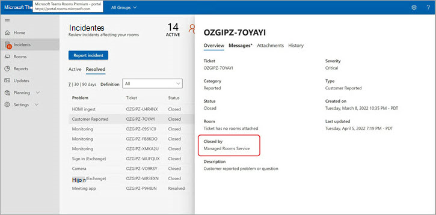

# Incidencias notificadas por el cliente

Para cualquier tipo de incidente que Microsoft no haya marcado, o para preguntas sobre el servicio o las características, los clientes o asociados en nombre de los clientes pueden usar la característica Informar de incidentes para avisar a Microsoft de que investigue el problema o responda a la pregunta.

En el campo Descripción, describe lo mejor posible el problema con el que necesitas ayuda de Microsoft. Puede agregar una o más salas.

Compruebe  **Alto impacto** si el incidente está causando una degradación significativa del estado del servicio o de una sala crítica. Para ayudar a Microsoft a priorizar correctamente tu solicitud, describe detalladamente el motivo por el que esto tiene un gran impacto.

> [!NOTE]
> No use este campo para preguntas generales, salas o problemas que no tengan mitigación disponible.

Los incidentes notificados por el cliente (CRIs) se consideran incidencias críticas, lo que significa que el Centro de Operaciones de Servicio de Salas de Teams primero clasifique estos vales. Consulte el SLA de descripción de servicio para incidentes notificados por el cliente [aquí](microsoft-teams-rooms-premium.md). Cuando se selecciona una sala (o se seleccionan salas) como parte del CRI, cada sala se marcará como **No saludable** hasta que se cierre el CRI.

## Cierre de incidencias notificadas por el cliente

Los incidentes notificados por el cliente pueden cerrarlos el cliente, los partners que administran las salas en nombre de los clientes o los ingenieros del Centro de operaciones de servicio de Microsoft.

**Para cerrar un incidente**

1. Selecciona **Cerrar ticket**.

   

1. Elija un motivo para el cierre seleccionando una categoría de la lista.

   Una vez que hayas confirmado el motivo del cierre, el ticket se cerrará y se moverá a **Resuelto**.

   

La sección Información general de detalles del vale muestra que el vale fue cerrado por el Servicio de salas administradas (Microsoft) o el nombre del cliente o partner.  

 

## Preguntas más frecuentes

**¿Alguien puede cerrar entradas?**

Solo los incidentes notificados por el cliente los puede cerrar un usuario o el Centro de operaciones de servicio de salas administradas de Microsoft. Los clientes que hayan asignado un partner para administrar sus salas con permisos de administración de vales podrán cerrar incidentes notificados por el cliente.

**¿Puedo restringir quién puede cerrar entradas?**

No en este momento. Todos los usuarios con permisos de administración de vales pueden cerrar un CRI.

**¿Recibiré una notificación cuando se cierre un vale de incidencia notificado por el cliente?**

No en este momento.