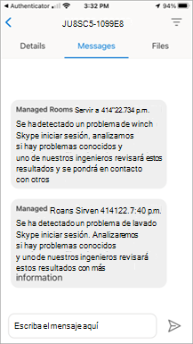
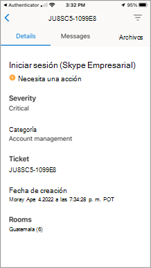
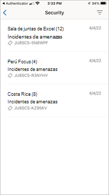
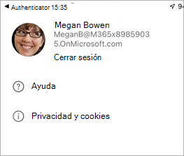

# Salas de Teams características de la aplicación cliente móvil

Puede haber ocasiones en las que necesite administrar Salas de Teams Servicios administrados (MTMS) desde su dispositivo móvil. La aplicación móvil tiene muchas capacidades que puede administrar desde su dispositivo móvil o tableta.
## Antes de empezar

Debe ser administrador de una organización Microsoft 365 para poder usar la aplicación móvil de Salas de Teams.
Descarga la aplicación móvil Salas de Teams desde el [App Store de Apple](https://apps.apple.com/app/apple-store/id761397963?pt=80423&ct=docsaboutadminapp&mt=8) o desde el [Google Play Store](https://play.google.com/store/search?q=Microsoft%20Teams%20Rooms&c=apps).

**Para obtener la aplicación móvil MTMS**

1. Busca Salas de Teams Servicios administrados en la tienda de aplicaciones de tu dispositivo e instálala.
2. Inicie sesión con su dirección de correo electrónico de administrador global y vea el panel para ver el estado del servicio, supervisar las licencias de usuario y ver mensajes y solicitudes de servicio.
## Administrar incidentes

Estas son algunas de las funcionalidades que tiene en la aplicación móvil para administrar incidentes.

- Recibir notificaciones de inserción para nuevos incidentes.
- Pulse la notificación para abrir y ver los detalles de incidentes inmediatamente.
- Enumere todos los incidentes activos y resueltos, incluido el estado de leído y no leído en los mensajes.
- Vea los detalles básicos del incidente con información de incidencias, incluidos los mensajes.
- Ver archivos y datos adjuntos de vales.
- Cerrar sesión en un panel de usuario (las notificaciones o mensajes se deshabilitan si se ha cerrado la sesión).

### Página incidentes

La página Incidentes muestra los tipos de incidentes abiertos.

imagen aprobada por autor <!--Microsoft por autor.>

## Administración de entradas
Estas son algunas de las funcionalidades que tienes en la aplicación móvil para administrar entradas.

- Acuse de recibo del incidente (marcar como leído).
- Leer, publicar y responder mensajes en una incidencia.
- Cambie a Modo oscuro.
- Agregue datos adjuntos (tome y cargue imágenes).
- Informar sobre un incidente (crear un vale).

### Mensajes de vales

### Detalles del billete

### Informar de un incidente

### Ver un incidente por categoría

imagen aprobada por autor <!--Microsoft por autor.>
### Seguridad administrada con Microsoft Defender

### Comunicación con expertos

### Cerrar sesión

imagen aprobada por autor <!--Microsoft por autor.>
## Preguntas más frecuentes

A continuación se ofrecen respuestas a las preguntas más frecuentes.

**¿Qué tengo que hacer para poder usar la aplicación?**

Para usar la aplicación, debe tener permisos de administrador y una suscripción de Microsoft 365 válida.

**¿Qué idiomas admite la aplicación?**

**¿Cómo puedo compartir los incidentes y mensajes con el resto de mi organización?**

**¿Puedo usar esta aplicación con varias cuentas o inquilinos?**

**No puedo iniciar sesión o mi aplicación actúa de forma divertida. ¿Qué puedo hacer para solucionar el problema?**

Puedes probar algunos pasos comunes de solución de problemas de aplicaciones móviles:
- Cierre y vuelva a abrir la aplicación.
- Desinstala y vuelve a instalar la aplicación. Asegúrese de que se encuentra en la versión más reciente de la aplicación.
- Si tienes Microsoft Authenticator o aplicación del portal de empresa instalada en el dispositivo, intenta volver a instalarla o actualizar a la versión más reciente. Si esto no funciona, puede enviarnos un correo electrónico en feedback365@microsoft.com para informarnos.

**¿Qué hago si no encuentro la respuesta a mi pregunta?**

## Pasos siguientes

El cliente móvil ofrece tanto la creación de incidencias como la administración de capacidades de incidentes dentro de su organización.

**Para usar la aplicación móvil Salas de Teams**

1. Descarga la aplicación desde el [App Store de Apple]() o desde el [Google Play Store]()
1. Asegúrese de que tiene una suscripción de Microsoft 365 válida.
1. Use las credenciales de trabajo que usa para acceder a la aplicación de escritorio Salas de Teams.
