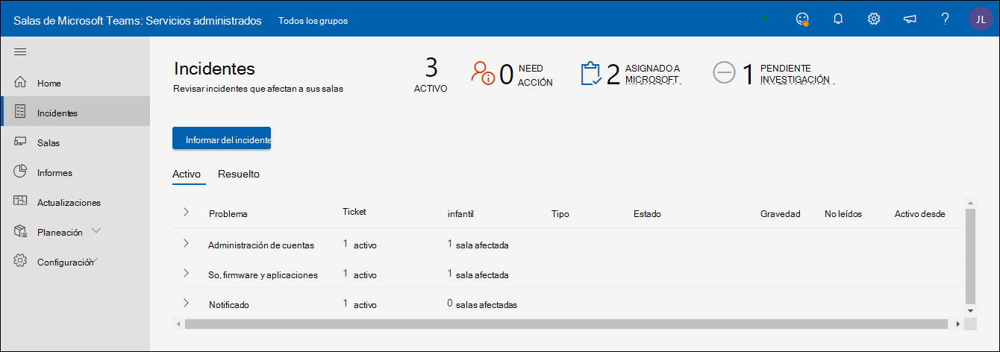

# Portal de salas de reuniones administradas de Microsoft

## Información general

El Portal de salas de reuniones administradas ("Portal de salas") proporciona una vista del estado de las salas de reuniones. Una vista de cliente de este portal es para su visibilidad y comentarios, y para facilitar las herramientas y prácticas de supervisión existentes.

El ámbito de la supervisión es

- Vista de incidentes
  - Principales problemas que afectan a sus salas
  - Acciones necesarias para restaurar salas en estado correcto
  - Problemas que microsoft está investigando
- Vista de Microsoft Teams dispositivos room
  - Instantánea del estado en Salas de Microsoft Teams de dispositivo (MTR)
  - Historial básico y detalles para cada dispositivo

**Vista de Microsoft Teams dispositivos room**

- Instantánea del estado en Salas de Microsoft Teams de dispositivo (MTR)
- Historial básico y detalles para cada dispositivo

> [!Important]
> Revise [**Asignar usuarios al rol de**](enrolling-mtrp-managed-service.md#assign-users-to-the-managed-service-administrator-role) administrador de servicio administrado y asegúrese de que el acceso al portal está limitado en función de sus necesidades empresariales.

## Terminología

Estos son los términos que se usan con frecuencia en el portal.

|Término |Significado |
| :- | :- |
|**Software de supervisión** |Agente de supervisión que se implementa en cada uno de los Microsoft Teams room. |
|**Aplicación** |Microsoft Teams aplicación de sistema room (independientemente de si usa Skype Empresarial o Microsoft Teams como servicio de colaboración. |
|**Sala/dispositivo** |El dispositivo Microsoft Teams sistema Room certificado. |
|**Sin supervisión** | El software de supervisión de Microsoft implementado como parte de los servicios administrados no puede conectarse a los servicios en la nube. No recibimos telemetría sobre el dispositivo. |
|
**En buen estado /** 

**No está en buen estado** 
|Anomalías en dispositivos/periféricos. |
|**Suprimido** |Si se sabe que un dispositivo está en mantenimiento y sus alertas deben ignorarse, el dispositivo se puede suprimir deliberadamente. |
|**Incorporación** |El estado de un dispositivo de sala mientras se agrega la configuración, pero no está listo como una sala compatible con regularidad. |
|**Incidente** |Un problema que afecta a las experiencias de reunión de los usuarios finales que necesitan acción. |
|**Mal configurado** |La configuración detectada no es correcta o se usa con frecuencia. |
|**Vale de soporte técnico** |Identificador de seguimiento interno de Microsoft que realiza un seguimiento de todas las comunicaciones o acciones relacionadas con un incidente. |

## Vista Incidentes

Esta vista es una descripción general de la pestaña Incidentes en el Portal de salas administradas. Esta página es la página principal predeterminada del portal.

### Resumen de nivel superior 
El resumen de nivel superior muestra de un vistazo los problemas que afectan a sus salas, lo que necesita hacer y lo que Microsoft está haciendo al respecto:

|# |Explicación |
| :- | :- |
|1 |Tipos de incidentes que afectan a sus salas |
|2 |**ACCIÓN NECESARIA:** elementos que requieren su intervención para resolver. |
|3 |**ASIGNADO A MICROSOFT:** elementos que el personal de Microsoft investiga actualmente. |
|4 |**INVESTIGACIÓN PENDIENTE:** Elementos en la cola que debe investigar el personal de Microsoft. |

Se espera que los incidentes estén en uno de tres estados:

- **Necesidad de acción:** Se le ha asignado para la acción
- **Asignado a Microsoft:** Asignado a Microsoft para la siguiente acción
- **Investigación pendiente:** Se está investigando para los pasos siguientes

### Revisar incidentes

La siguiente imagen enumera todos los incidentes que están activos actualmente en sus salas. Los que se le han asignado están *en la parte superior:* estos son los que debe buscar para los pasos siguientes. Además, los asignados a Microsoft o a la investigación pendiente tienen detalles que puede usar para intervenir.

Al hacer clic en cualquiera de los elementos que tienen el estado **"Necesita acción"** se muestran detalles adicionales sobre el incidente.

## Tipos de incidentes

Los incidentes se clasifican en dos tipos de gravedad generales:

- **Importante:** Los incidentes que probablemente estén causando problemas en las reuniones y que deben priorizarse.
- **Advertencia:** incidentes que son notificaciones para planear acciones de mantenimiento. Si no se encargan de ello, con el tiempo las salas son más propensas a tener un problema. Las advertencias están pensadas para darle tiempo para planear y organizar el soporte técnico.

Una advertencia puede pasar a **"Importante"** si no se atendió durante un tiempo.

## Estado de estado del dispositivo y los incidentes

Los incidentes que se clasifican como **"Importantes"** en gravedad afectarán al estado de salud de un dispositivo. Si hay al menos un incidente de **Gravedad = "Importante"** asociado a un dispositivo, se clasifica como **_dispositivo en mal_** estado.

Los incidentes clasificados como **gravedad "Advertencia"** no afectan al estado de salud notificado en un dispositivo. Sin embargo, si un dispositivo tiene incidentes de nivel de advertencia asociados con él, se mostrará con el estado de estado del dispositivo de la siguiente manera.

A continuación se enumeran algunos de los tipos de incidentes que puede ver y las explicaciones de cada tipo. Para cada tipo, la acción asociada al incidente será más específica dependiendo del problema.

**Tabla 1: Incidentes con gravedad "Importante"**

|Tipo |Explicación |
| :- | :- |
|**Pantalla** |La pantalla conectada al dispositivo no parece estar en buen estado.|
|**Micrófono de conferencia, altavoz de conferencia** |Los dispositivos de audio (micrófono/altavoz) parecen estar mal configurados. |
|**Cámara** |La cámara conectada al dispositivo no parece estar en buen estado. |
|**Ingerir HDMI** |La ingestión de HDMI no está en buen estado. |
|**Inicio de sesión** (Exchange) |Microsoft Teams aplicación De salón accede a la información del calendario desde Exchange y cualquier problema con el éxito del inicio de sesión se notifica con un incidente de inicio de sesión. |
|**Inicio de sesión** (Teams) |Microsoft Teams la aplicación Room inicia sesión en el dispositivo y el error de inicio de sesión se notifica con este incidente (si el cliente usa Teams). |
|**Inicio de sesión** (Skype Empresarial) |Microsoft Teams de la aplicación Room inicia sesión en el dispositivo y el error de inicio de sesión se notifica con este incidente (si el cliente usa Skype Empresarial) |
|**Sensor de proximidad** |Microsoft Teams aplicación Sala invita a los asistentes a unirse a una reunión si están cerca. Los errores de esta característica se notifican en este incidente. |

**Tabla 2: Incidentes con gravedad "Advertencia"**

|Tipo |Explicación |
| :- | :- |
|**Versión de la aplicación** |La versión de la aplicación Microsoft Teams room que se ejecuta en el dispositivo no es actual. Las versiones obsoletas son causas conocidas de problemas experimentados por los usuarios. |
|**Versión del sistema operativo** |La versión del Windows operativo que se ejecuta en la sala de reuniones ya no se recomienda. |
|**Red** |Esto se eliminará como un tipo de advertencia a corto plazo debido al trabajo adicional necesario después de la evaluación. |

## Responder a incidentes

Los incidentes se divide en tres categorías: Necesita acción, Investigación pendiente o Asignado a Microsoft.

### Incidentes "Necesita acción"

Los incidentes que tengan el estado establecido en **"Necesita acción"** se le asignan para realizar una acción correctiva.

Cada incidente de este tipo tendrá un campo de acción con una acción recomendada de Microsoft de la siguiente manera:

- Si ha realizado la acción, puede responder al incidente con las notas en el cuadro Responder y, después, elegir "Asignar a Microsoft" antes de publicar.
- También es posible que la notificación sea incorrecta en función de la revisión. En ese caso, proporcione los comentarios y vuelva a asignarlos a Microsoft.
- Por último, si desea agregar un comentario para proporcionar contexto adicional para su propio equipo o para el equipo de Microsoft, publique el mensaje sin activar "Asignar a Microsoft".

>[!NOTE]
>La acción correctiva puede solucionar el problema y que la supervisión de salas administradas borre ese incidente de la lista. En la situación anterior, es posible que no tenga la oportunidad de resolver el problema y asignarlo de nuevo a Microsoft. Este problema se solucionará en una versión futura.

### Incidentes de "Investigación pendiente"

Para los incidentes en investigación, el campo de descripción contiene información sobre el incidente, las causas típicas y las resoluciones que pueden ser útiles para resolver determinados problemas para que pueda actuar sin demora.

### Incidentes "Asignados a Microsoft"

Para los incidentes asignados a Microsoft, el campo "Acción" contendrá breves detalles sobre los pasos correctivos planeados o progresados. Estos pasos pueden necesitar colaboración con su equipo y la colaboración extendida se realizará a través del correo electrónico o las llamadas según sea necesario. Una vez que se resuelvan estos problemas, desaparecerán del portal y, en el futuro, habrá un historial para realizar un seguimiento de estos incidentes y su resolución.

## Vista Salas

Cada dispositivo es un proxy para una sala y sus periféricos conectados. Un dispositivo en buen estado representa una sala en buen estado y un dispositivo en mal estado representa una sala que probablemente causa problemas durante las reuniones. Además de la vista Incidentes, el Portal de salas administradas también proporciona información general sobre el estado de la sala y le ayuda a solucionar problemas de detalles del dispositivo y a comprender los errores repetidos con el historial de incidentes.

**En buen estado, sin estado, desconectado** El panel superior de la vista Salas proporciona una instantánea rápida de cuántos de sus dispositivos están en buen estado("Correcto"), cuántos se ven afectados por problemas ("En mal estado"), cuántos no proporcionan telemetría ("Desconectado") y cuántos dispositivos se suprimen de alertas (como invalidación). Se supervisa el estado de los salas con criterios y heurística en evolución. El objetivo es reflejar la realidad de la experiencia del usuario en la sala con la mayor precisión posible y hacer que sea más fácil de usar.

Salas en buen estado o **en mal estado:**

Los dispositivos o periféricos que no tienen incidentes de gravedad "Importantes" cumplen los criterios actuales de estado se marcan como correctos. Sin embargo, no implica que haya una interrupción de la sala para todos los dispositivos en mal estado del portal. La parte de descripción y acción del incidente contiene detalles más específicos sobre el problema y el posible impacto en la experiencia del usuario.

**Dispositivo desconectado:**

El agente de supervisión de Microsoft implementado como parte del piloto salas administradas está desconectado de los servicios en la nube de salas administradas. No recibimos telemetría sobre la sala y no tenemos el estado de estado más reciente. Esto puede ocurrir debido a problemas de red, cambios en la directiva de firewall o si se realizan cambios en la imagen del dispositivo.

## Detalle del salón: Estado y cambios

**Detalles del salón: Estado** La pestaña *Estado del* dispositivo proporciona una vista consolidada del estado de un dispositivo, todos los problemas activos para el dispositivo, las acciones necesarias para resolverlos o que están en curso. La pestaña Estado también contiene el desglose de los distintos componentes del estado del dispositivo en *la pestaña Incidentes.* Si un dispositivo está desconectado, los detalles de estado no estarán disponibles.

**Mostrar todas las señales:** Para ver todas las señales contenidas en una categoría de señal, habilite el botón de alternancia Mostrar todas las señales. Las flechas de expansión aparecerán junto a los encabezados de categoría en los que se puede hacer clic para expandir la vista de acordeón.

**Suprimir o desaprimir vale** Cuando se inscriba un salón, indica que desea recibir notificaciones de cambios en la telemetría del salón. Hay ocasiones en las que un dispositivo o periférico determinado se encuentra en un estado conocido en el que no desea que se generen entradas o notificaciones. Con la función Suprimir vale, silenciará cualquier notificación sobre esa señal en particular. Cuando esté listo para que el servicio le supervise y le notifique sobre esa señal, simplemente desactúe la señal individual.

**Expansión de categoría de vales activos** En cada categoría de vale, se mostrará cualquier vale activo o resuelto más reciente junto con la gravedad y la última vez que se actualizó el vale. Al hacer clic en la flecha de expansión, todas las entradas aparecerán con un vínculo activo a la información de la entrada.

Expansión de categoría de vale activa: en cada categoría de vale, se mostrará cualquier vale activo o resuelto más reciente junto con la gravedad y la última vez que se actualizó el vale. Al hacer clic en la flecha de expansión, todas las entradas aparecerán con un vínculo activo a la información de la entrada.

## Vale activo: Información general

Cada incidente que se crea identifica el problema que se ha detectado y la acción correctiva que debe realizarse para restaurar el salón a un estado correcto. El vale generado transmitirá información general sobre incidentes con los mensajes generados por la inteligencia artificial de los servicios administrados, así como por el equipo de ingeniería de servicios de Microsoft que investiga el problema. Se mostrarán todos los datos adjuntos que se han recopilado para la solución de problemas de incidentes. La pestaña historial proporciona las fechas en las que se han identificado los problemas.

Vale activo: mensajes La interfaz de usuario de mensajes es la herramienta de comunicación principal para interactuar con los ingenieros de servicio de Microsoft que trabajan para corregir el problema identificado. Es importante que reconozca las comunicaciones de Microsoft para asegurarse de que le proporcionamos el mejor servicio posible. Si ha realizado las acciones recomendadas, responda a este incidente con las notas en el cuadro Responder y vuelva a asignar a Microsoft haciendo clic en "Asignar a Microsoft" antes de publicar.
También es posible que la notificación sea incorrecta en función de la revisión. En ese caso, proporcione los comentarios y vuelva a asignarlos a Microsoft.
Por último, si desea agregar un comentario para proporcionar contexto adicional para su propio equipo o para el equipo de Microsoft, simplemente publique el mensaje sin activar "Asignar a Microsoft

Vale activo: Datos adjuntos Hay ocasiones en las que los ingenieros de servicio de Microsoft necesitan información adicional para aumentar su investigación del problema. La pestaña datos adjuntos le permite cargar imágenes, vídeos o registros solicitados.

Entrada activa: Historial Cada señal de sala solo tiene un número de vale que se le asigna a propósito. Un dispositivo de sala o periférico persiste en una sala y puede tener problemas a lo largo del tiempo. Al mantener esta información en un identificador de vale único específico, se mantiene toda la información histórica y se puede analizar para buscar patrones de comportamiento. La interfaz de usuario del historial proporciona una vista de todas las acciones de vales creadas y resueltas para esta señal.

Preguntas más frecuentes ¿Cómo afectan las entradas dinámicas a mí y a las operaciones de mis salas?  
Los clientes verán la creación de vales y correcciones más inteligentes que se expanden más allá de solo un vale de señal binaria. Por ejemplo, puede haber hasta tres pantallas en un Sala de reuniones (Pantalla 1, Mostrar 2 & la pantalla del panel táctil MTR). Sin embargo, solo hay 1 (una) señal de visualización que es en buen estado o en mal estado. Con las nuevas entradas dinámicas, ahora podemos generar entradas únicas para cada señal de visualización.
