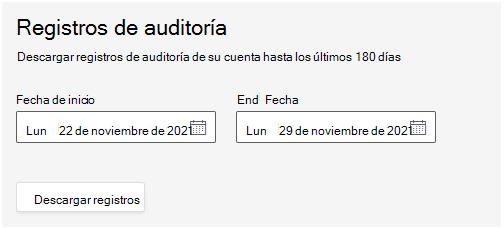

# Registro de auditoría en el Salas de Teams administrado

La auditoría en Salas de Teams administración (TRM) le permite buscar registros de auditoría para las actividades realizadas en el portal por usuarios y administradores. Esta característica está habilitada de forma predeterminada. Solo el administrador del servicio administrado tiene permiso para exportar y, a continuación, ver los registros.

> [!NOTE]
> Las acciones realizadas en el servicio TRM no se registran en Microsoft 365 o Office 365 auditoría 

## Exportar registros

Al exportar todos los resultados de una búsqueda de registro de auditoría, los datos sin procesar del registro de auditoría unificado se copian en un archivo de valores separados por comas (CSV) que se descarga en el equipo local. 

**Para descargar registros** 

1. Vaya a **Configuración > General > registros de auditoría**.
1. Para definir el intervalo de fechas para los registros de interés, escriba la **fecha de inicio y** la fecha de **finalización.**

   > [!NOTE]
   > Los registros solo están disponibles durante un máximo de 180 días.

1. Seleccione **Descargar registros.**

   

   Un mensaje que se muestra en la parte inferior de la ventana le pide que abra o guarde el archivo CSV. 

1. Seleccione **Guardar**  >  **como** y guarde el archivo CSV en el equipo local. 

1. Se tarda un tiempo en descargar muchos resultados de búsqueda al buscar todas las actividades o en un amplio intervalo de fechas. Cuando el archivo CSV haya terminado de descargarse, se mostrará un mensaje en la parte inferior de la ventana.

## Propiedades detalladas en el registro de auditoría

En la tabla siguiente se describen las propiedades que se incluyen en el ARCHIVO CSV.

|Propiedad|Descripción|
| - | - |
|activity.category|
La categoría del objeto en el que se realizó la acción was. Valores posibles:

**Usuario, Tarea, PartnerInvitation, Rol**
|
|activity.objectName|El nombre del objeto modificado.|
|activity.operation|El tipo de operación realizada. Los valores posibles son: **Crear, Actualizar, Eliminar** |
|activity.resultStatus|
Indica si la acción (especificada en la **propiedad activity.operation)** se ha realizado correctamente o no.

El valor es **Correcto o** **Error.**
|
|activity.tenantId|El GUID del espacio empresarial en el que se realizó la acción|
|creationTime|La fecha y hora en hora universal coordinada (UTC) en el formato ISO cuando el usuario realizó la actividad.|
|user.userId|El usuario que realizó la acción que hizo que se registrara el registro.|
|user.userTenantId|El GUID del inquilino para el usuario que realizó la acción|

