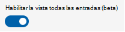

# Administración de clientes multiinquilino para partners

La administración de varios inquilinos (MTM) en el servicio Salas de Teams administrado (TRM) ayuda a las organizaciones asociadas a administrar varios clientes en un solo lugar, con sus propias credenciales de dominio. Los usuarios asociados solo verán los salas de clientes que están asignados a administrar. Es posible aplicar roles personalizados para cada cliente en el espacio empresarial MTM, lo que permite a las organizaciones asociadas controlar pormenorizados los permisos a los recursos del cliente. 

Se puede acceder al portal MTM a través de este [vínculo.](https://partner.rooms.microsoft.com/)

> [!Note] 
> Las organizaciones asociadas no pueden administrar sus propios salas a través del portal MTM. Estos salas se pueden administrar en el [portal de TRM.](https://portal.rooms.microsoft.com/) 

## Requisitos previos para administrar sus clientes a través de la experiencia MTM

Para obtener acceso al portal de MTM, su organización debe incorporarse como partner de elite para el servicio TRM. Para convertirse en un contacto de partner elite askelite@microsoft.com.

## Clientes que se alojen

Para administrar clientes a través del portal de TRM-MTM, debe establecerse una relación entre el inquilino de la organización asociada y el cliente a través de una invitación enviada por el cliente. 

### Invitación del cliente

El partner proporciona los nombres de principio de usuario (UPN) de los usuarios que serán administradores principales asignados al cliente. Solo los usuarios identificados en la invitación pueden ver y aceptar la invitación al iniciar sesión en el portal de TRM-MTM. 

> [!Note]
> Incluso si tiene privilegios elevados como administrador global, no verá la invitación a menos que se le agregó explícitamente. 

Los detalles de la invitación al cliente se describen en [Administración multiempresa para clientes.](multi-tenant-management-customer.md)

**Para aceptar una invitación pendiente**

1. Inicie sesión en el portal de TRM-MTM como uno de los usuarios de la invitación.
1. Vaya a **Clientes.**
1. Seleccione la invitación que se muestra con el estado "Pendiente".
1. Revise los detalles de la invitación.
1. Seleccione **Aceptar** para establecer la relación partner-cliente.

   Al seleccionar **Denegar,** se elimina la invitación para el usuario que lo deniega. La invitación sigue estando disponible para otros usuarios que aún no han actuado.

   > [!Note]
   > La invitación es única e independiente para cada usuario. El primer usuario que acepta establece el vínculo entre el partner y el inquilino del cliente. No hay ninguna asociación permanente con el usuario que establezca el vínculo. Los usuarios posteriores que acepten la invitación se agregarán como administradores principales.

   > [!Note]
   > *Si un usuario asociado deniega accidentalmente la invitación, es mejor que otro usuario simplemente los agregue al rol de partner (o a cualquier otro rol de RBAC) para ese cliente.* 

Después de aceptar la invitación, el usuario se agrega automáticamente como administrador principal del inquilino de este cliente. 

Para revisar la configuración de este inquilino, seleccione el cliente en la **lista** Clientes.

## Clientes que no se alojen

Para quitar a un cliente, debe quitarlo de la lista Clientes.

**Para quitar un cliente** 

1. Inicie sesión en el portal de TRM-MTM como administrador principal del cliente que desea quitar.
1. Vaya a **Clientes.**
1. Seleccione el cliente que desea quitar.
1. En el panel de detalles del cliente, seleccione **Quitar cliente.**
1. Seleccione **Eliminar** en el mensaje de confirmación para finalizar la asociación entre su inquilino y el cliente.

## Administrar roles de partner

Los roles de partner permiten la delegación de responsabilidades a personal adicional. El concepto de estos roles es el mismo que se describe en control de acceso basado en [roles,](microsoft-teams-rooms-premium-rbac.md)pero en contexto de cada cliente. Además, es importante tener en cuenta que los roles de partner son distintos de los roles del cliente. El cliente puede eliminar los roles de partner. 

El **rol** administradores principales es el único rol integrado para cada cliente integrado y tiene casi todos los permisos (en contexto del cliente) para el servicio TRM (vea la tabla 1). Los permisos de rol de partner** solo se extienden hasta las salas designadas por el cliente. Por ejemplo, si el cliente es una organización global y asigna el partner para administrar todos los salas de EE. UU., el administrador principal solo podrá administrar y delegar permisos para esos salas. El Partner no tiene visibilidad de otras salas que el Cliente pueda tener en otros países. 

> [!Important]
> Siempre debe haber al menos un usuario en el **rol de administradores** principales.

**Para administrar usuarios en el **rol de** partner de un cliente**

1. Vaya a **Configuración > roles**. 
1. Seleccione el cliente de la lista desplegable para la que desea editar el rol de partner.
1. Seleccione el **rol integrado Administradores** principales de la lista.
1. Seleccione **Tareas.**
1. En la lista, seleccione **Administradores invitados.**
1. Seleccione **Miembros.**
1. Haga clic en **Seleccionar editar.** 
1. Busque el usuario o grupo de seguridad que desea agregar en la barra de búsqueda.
1. Seleccione el usuario o grupo .
1. Haga clic en **Seleccionar** guardar para confirmar los cambios.

### Administrar roles de partners personalizados para un cliente

Como partner, puede crear roles personalizados que se adapten a sus requisitos operativos. Por ejemplo, puede crear un rol de servicio de ayuda que solo tenga permisos de administración de incidentes. 

**Para administrar roles**

1. Vaya a **Configuración > roles**. 
1. Seleccione el cliente del menú desplegable para el que desea editar el rol de partner.
1. Crear un [rol personalizado](microsoft-teams-rooms-premium-rbac.md#built-in-roles).

|Característica|Permiso|**Administrador de MMR**|**Cliente potencial del sitio**|**Site Tech**|**Administradores principales**|
| :- | :- | :- | :- | :- | :- |
|Salas|Ver| &#10004;|&#10004;|&#10004;|&#10004;|
||Modificar|&#10004;|&#10004;|&#10004;|&#10004;|
||Tecla Restablecer|&#10004;||||
||Clave de descarga|&#10004;|&#10004;|&#10004;||
||Desenrollar|&#10004;|&#10004;|&#10004;||
||Crear |&#10004;|&#10004;|||
|Administración de grupos|Ver|&#10004;|&#10004;||&#10004;|
||Modificar|&#10004;|&#10004;|||
||Crear |&#10004;|&#10004;|||
|Actualizar la administración de anillos|Ver|&#10004;|&#10004;||&#10004;|
||Modificar|&#10004;|&#10004;||&#10004;|
|Informes|Ver|&#10004;|&#10004;||&#10004;|
||Crear un incidente de cliente|&#10004;|&#10004;|&#10004;|&#10004;|
|Administración de entradas|Ver|&#10004;|&#10004;|&#10004;|&#10004;|
||Actualización|&#10004;|&#10004;|&#10004;|&#10004;|
|Mmr Configuración|Ver|&#10004;||||
||Modificar|&#10004;||||
|Administración de roles|Ver |&#10004;|||&#10004;|
||Modificar|&#10004;|||&#10004;|

> [!Note]
> Un usuario asignado como administrador principal del cliente A tiene permisos completos en el servicio TRM solo para ese cliente. Los permisos del usuario en el Cliente A no tienen ninguna influencia en otros clientes.

## Seguridad

Los clientes finales conservan el control sobre el acceso a sus datos y pueden quitar por completo un partner o roles específicos en cualquier momento.

Con la característica de acceso delegado, un partner no obtiene ningún otro privilegio fuera del portal de servicio de TRM. Por ejemplo, si usa esta característica para invitar a un partner a administrar salas en el servicio TRM, no se concede ningún permiso a AAD ni al Centro de administración de Teams ni a ningún otro producto de Microsoft. Además, los partners no tienen acceso a ver o modificar salas no definidas en el ámbito de invitación.

Una vez establecida la relación entre partners y clientes (como se describe en "Clientes de incorporación" de este documento), el partner puede ver los datos del salón en el servicio TRM. Esto incluye todos los datos presentes en el servicio TRM, pero derivados de otros productos de Microsoft. Por ejemplo, los informes de calidad de llamadas en el portal de TRM se derivan de Teams de calidad de llamadas.

Los datos residen en el inquilino del cliente y no se copian en el inquilino del partner. 

El portal MTM usa AAD autenticación para validar las credenciales de inicio de sesión del partner. Es importante tener en cuenta que, en este momento, las directivas de autenticación del cliente no se aplicarán al partner. Por ejemplo, si el cliente tiene una directiva de autenticación multifactor, no se traduce al partner.

El cliente puede extraer registros de auditoría para el servicio TRM, que incluye la actividad de los partners. Vea [Registro de auditoría en el Salas de Teams administrado](multi-tenant-auditing.md).

> [!Note]
> AAD auditoría y auditoría de O365 no capturan registros del portal de TRM.

## Navegar por el portal MTM

El portal MTM tiene dos modelos interactivos para navegar entre los datos de los clientes:

- Agregar vistas en las que los datos de todos los clientes se consolidan en una única lista y se pueden filtrar.

  > [!Note]
  > Esta vista solo es compatible en la página **Incidentes** cuando la vista Habilitar todas las **entradas** está activa.

  

 - Cambio de inquilino donde  solo se muestran los datos del cliente seleccionado en la lista desplegable.
