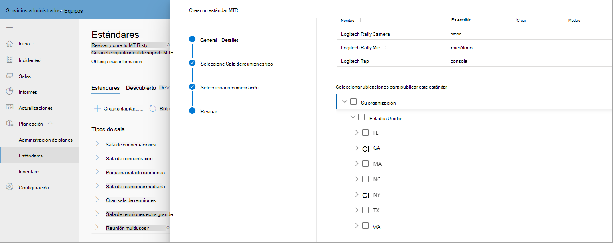
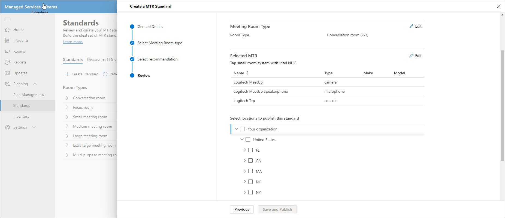
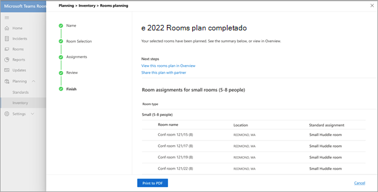

# Estándares y planificador de sala

Con las recomendaciones inteligentes de su entorno, puede crear y seleccionar estándares. A continuación, puede publicar sus estándares en una región, sitio, edificio o una sala de reuniones específica para compartir salas planeadas con asociados para realizar un seguimiento de las implementaciones de salas.

## Ver tipos de salas de reuniones

En esta página, puede ver los tipos de espacio de salas o reuniones de su organización. Una rápida ruptura de cuántos estándares tiene para salas de reuniones, cuántos nuevos dispositivos se han detectado y número de dispositivos que requieren una acción que realizar.

Esta página también tiene una barra de comandos desde la que puede iniciar el flujo de trabajo Crear un flujo de trabajo estándar o ir  **a** Dispositivos detectados, Cambiar registros y Archivar.

### Crear estándares

Use el **flujo de trabajo Crear** estándar para crear un estándar.

**Para iniciar el flujo de trabajo**

1. Seleccione **Crear un estándar MTR** y, a continuación, proporcione detalles generales, como el nombre y la descripción del estándar.

   

1. Seleccione el tipo de sala de reuniones para este estándar.

   

1. Seleccione una de las Teams de sala certificadas recomendadas en el inventario de hardware. La lista varía según el tipo de salón seleccionado en el paso anterior.

   

1. Revise la información estándar de MTR.

   

1. Publique los estándares en una región, sitio, edificio o una sala de reuniones específica.

   

Una vez publicados, los estándares se usan con fines de planificación.

### Dispositivos detectados

En Estándares, seleccione **Dispositivos detectados** para ver todos los dispositivos detectados no estándar de su organización.

Puede realizar acciones para revisar y crear estándares a partir de estos dispositivos detectados en su inventario.

## Planificación de sala

Planee salas con estándares para la expansión de reuniones con el **Asistente para el planificador de** salas.

Para iniciar el planificador de sala con una experiencia guiada:

1. En el panel de navegación izquierdo, seleccione Inventario y, a continuación, **elija Planear salas**.

   

1. Agregue salas al planificador desde el directorio de ubicación.

   

1. Establezca las preferencias de asignación de estándares de la siguiente manera:

   - Si tiene un partner de planificación registrado, puede seleccionar Hacer que mi **partner asigne la mejor solución para todas estas salas**. Esta opción hace que el partner seleccione la mejor solución local para su cliente.

   - Si planea la expansión de reuniones internamente, seleccione El administrador de la organización asignará la mejor solución para todas las salas con los estándares **de la organización**. Los estándares se asignan automáticamente a partir de lo aprobado y publicado por la organización en la vista Estándares.

1. Seleccione **El administrador de la organización asignará la mejor solución...**

   

Puede asignar estándares en masa a varios salas.

1. Compruebe varias salas debajo **de Nombre de la sala**.

   

   

Si tiene más de un estándar disponible para una ubicación, región o sitio, seleccione un estándar de la lista  Asignación estándar para asignarlo a una sala de reuniones que se muestra debajo del **nombre del salón**.

Revise las tareas estándar y finalice el plan. Puede imprimir el plan en PDF para compartirlo con los partners.

## Control de acceso

El asistente para el planificador de sala está habilitado de forma predeterminada para el rol administrador del servicio administrado. Para clientes y todos los demás roles integrados, establezca los permisos para la administración de inventario en **la pestaña Permisos** .

