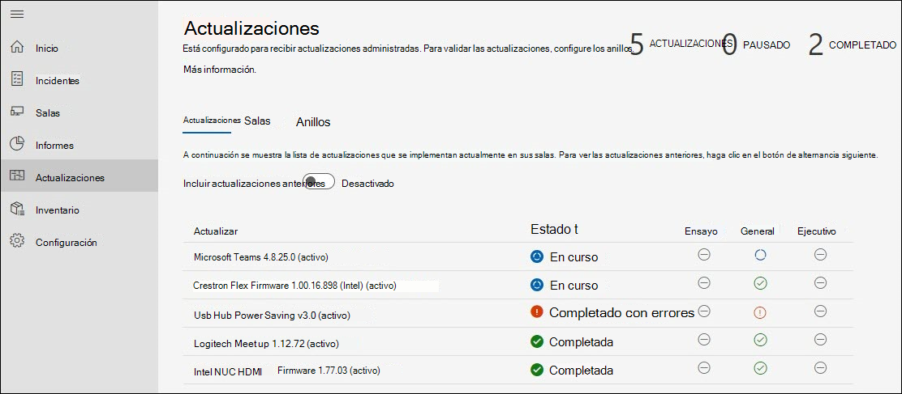

# Administración de actualizaciones 
Una sala de reuniones moderna está equipada con un dispositivo Salas de Microsoft Teams y otros periféricos, como una cámara, un micrófono o un altavoz, y potencialmente más dispositivos para crear una experiencia de reunión inclusiva y eficaz. Los equipos de diferentes tipos de OEM proporcionan la experiencia organizativa exacta deseada; sin embargo, deben mantenerse con software y firmware de forma continua.  

Los servicios administrados para Salas de Microsoft Teams ofrece la garantía de que cada salón de su organización se mantendrá en los niveles recomendados para ofrecer una sala que siempre esté lista y funcione correctamente. El objetivo de Microsoft es reducir la complejidad y el trabajo de sus empleados operativos con inteligencia y automatización. La solución de problemas o diagnósticos se realiza lo más rápido posible. 

## Transición de un dispositivo a servicios administrados 
La incorporación de dispositivos de salón a los Servicios administrados suele tener un historial de administración de cambios y una práctica que es diferente de nuestras instrucciones.  

- Para beneficiarse de los Servicios administrados, debe cambiar la administración de cambios para todas las actualizaciones en cartera de servicios administrados.
- Varios orígenes de administración de cambios afectan a los SLA de incidentes, ya que hay una detección y corrección que se reiniciará de nuevo si se produce un incidente en la sala.
- Microsoft ha implementado controles y comprobaciones para implementar directivas que pueden diferir de una organización a otra y la capacidad de intervenir en situaciones excepcionales.
- Finalmente, los dispositivos de la sala se actualizarán a estándares comunes, excepto excepciones debido a problemas con una instalación de hardware específica.  

## Dispositivos de transición: Comprobaciones básicas de preparación 
La mayoría de los errores inesperados surgen de cambios en la imagen base con un historial incierto de administración de cambios. 

Se recomienda seguir las comprobaciones de preparación sencillas:  

- **Imagen base:** la imagen base debe ser del OEM específico. Si el dispositivo se ha reconstruido en el pasado y muestra errores inesperados o comportamientos en tareas comunes, la imagen base debe restaurarse. Podemos proporcionar asistencia, pero no reconstruir de forma remota el dispositivo de la sala, por lo que necesitará un técnico de sitio local.  
- **Base OS, Edición:** El sistema operativo base y la edición deben cumplir los requisitos de Salas de Microsoft Teams dispositivos. Si esto no es así, debe corregirse como parte de la incorporación. Salas de Microsoft Teams requiere las Windows 10 IoT Enterprise o Windows 10 Enterprise SKU en Semi-Annual de mantenimiento del canal. Consulte las instrucciones [oficiales de MTR](rooms-lifecycle-support.md#windows-10-release-support) para obtener más información.

## Comprobaciones de preparación   
Hay algunos requisitos previos para recibir actualizaciones de servicios administrados: 

|Software |Instrucciones |
| :- | :- |
|Logitech Sync Services  |Debe instalarse y ejecutarse en los dispositivos de la sala de reuniones logitech. Los servicios de sincronización necesarios se instalarán automáticamente desde Windows actualizaciones a menos que se bloqueen. También se puede instalar el paquete de sincronización completo. |
|Windows del sistema operativo |Debe mantenerse habilitado y no redirigido a WSUS, ni bloqueado desde una perspectiva de red. No se deben usar directivas de GPO ni MDM para administrar las actualizaciones del sistema operativo. |
|Microsoft Store actualizaciones   |Debe estar desactivado. Los Servicios administrados desactivarán las actualizaciones de store si se encuentran en. |
|Software antivirus |Si ejecuta software AV en estos dispositivos, debe asegurarse de que AV tiene exclusiones en su lugar para Teams y Skype dll. Vea aquí para obtener más información. |
|Software adicional |Es necesario revisar software adicional como la visualización de escritorio remoto de terceros, etc. con Servicios administrados para descartar efectos secundarios. |
|Administración de cambios adicional|Puede interferir con las actualizaciones cubiertas y no debe introducirse. |

## Actualizaciones administradas: cómo funciona 
Hay dos formas principales de administrar las actualizaciones:  

- **Administración automática:** las actualizaciones se instalan en el dispositivo de la sala en función de la evaluación de servicios administrados. No se requiere intervención para las actualizaciones administradas en nuestra cartera.
- **Anillo validado:** Configure un sistema de anillos para obtener una vista previa de las actualizaciones en dispositivos específicos para que pueda supervisarlas sin el trabajo asociado de las piernas. La configuración de anillo proporciona una capa adicional de diligencia debida antes de los lanzamientos generales.  

### Administrado automáticamente

Si decide que se administra automáticamente, no es necesario realizar ninguna acción para las actualizaciones de su parte. Sin embargo, debe revisar la cartera actual de actualizaciones admitidas por Servicios administrados. La cartera está recibiendo continuamente nuevas adiciones y es nuestra prioridad cubrir las actualizaciones más frecuentes e impactantes para garantizar la estabilidad de la sala. Compruebe la lista actual (en la sección "Administración de actualizaciones" de este documento) para planear cualquier administración de cambios adicional necesaria para su organización.  

**Recomendación:** No instale actualizaciones que estén cubiertas por Los Servicios administrados en cualquier dispositivo administrado por su cuenta. Si encuentra algún problema, informe de un incidente en el portal.

### Validación de llamada

Al elegir la validación de anillos, revise las siguientes secciones sobre cómo funcionan los anillos en Los servicios administrados y las opciones disponibles para personalizarla para su organización. Incluso con la validación de anillos, Los servicios administrados intentan asegurarse de que los salas no vencen con las actualizaciones recomendadas. Dependiendo de la situación, es posible que un salón reciba actualizaciones de "ponerse al día" para asegurarse de que cumple con las recomendaciones de servicio administrado.  

 Compruebe si hay anuncios en la página principal del portal y en la documentación de Servicios administrados a medida que los nuevos tipos de software y firmware estén disponibles en la cartera. Dado que los expertos de Servicios administrados revisan las versiones de actualización diariamente en nuestra cartera de dispositivos, abordan problemas específicos y las actualizaciones de destino en función de las necesidades.  

### Programar 
Las actualizaciones administradas se programan para salas en función del equipamiento de la sala y si no reúnen los estándares de Servicios administrados para el software y el firmware aplicables.  

- Para ayudar a nuestros clientes a cumplir los requisitos de administración de cambios, actualice la implementación los miércoles **en** el anillo de ensayo. Si se requiere una actualización crítica, omitiremos esta programación y publicaremos la actualización tan pronto como esté disponible. 

- Las actualizaciones se secuencian en función de la necesidad de un salón en particular. 
- Si tiene anillos de configuración para validar las actualizaciones, la actualización seguirá el orden de llamada. 
- Una nueva actualización puede reemplazar una actualización que está en cola si determinamos que se mejora la estabilidad del salón en función de su situación.  
- Las actualizaciones se aplican normalmente durante la ventana de mantenimiento nocturno, que es hora local de **12:00 a.m. a 5:00** a.m. para evitar cualquier tipo de interrupción. 

## Microsoft Teams directiva de ciclo de vida de actualización de aplicaciones de sala 
La directiva de soporte técnico del equipo de ingeniería de MTR indica que todo el soporte técnico finaliza después de que haya expirado el ciclo de vida de doce (12) meses de una versión o si se han publicado más de dos actualizaciones desde entonces. A continuación, los clientes deben actualizar a una versión compatible. Consulta el [Salas de Microsoft Teams versión de la aplicación: Microsoft Teams | Microsoft Docs para ](rooms-lifecycle-support.md)obtener una descripción detallada del servicio. 

Para mantener un estándar uniforme en todas nuestras salas administradas y permitirnos identificar de forma eficiente los problemas de tendencia, admitiremos e implementaremos las dos últimas versiones principales o secundarias (N, N-1) del software de la aplicación MTR según los Términos y condiciones de soporte técnico y servicios de suscripción. Actualizaremos automáticamente las salas no compatibles, omitiendo los anillos de actualización según sea necesario. 

La directiva N-1 también se aplica al software de terceros.  

## Experiencia de administración de actualizaciones  
Para ver las actualizaciones, inicie sesión en el portal de Servicios administrados y vaya a la página Actualizaciones. 

 

El panel Actualizaciones muestra información general de alto nivel sobre la administración de actualizaciones para sus salas con las siguientes pestañas: 

- **Actualizaciones:** actualizaciones de software o firmware que Los servicios administrados están organizando a través de su organización.  
- **Salas:** la pestaña Salas proporciona una vista de las salas y anillos a los que pertenecen cada uno. 
- **Anillos:** la pestaña Anillos muestra los anillos de salas de su organización. 

### Actualizaciones  

En esta vista se muestran las actualizaciones relevantes para el inquilino y su estado respectivo. Para ver las actualizaciones anteriores que ya no están activas, seleccione el botón de alternancia Incluir **actualizaciones anteriores** a ACTIVADO.  

Cualquier actualización puede estar en uno de los siguientes estados: 

|Estado |Descripción |
| :- | :- |
|Programado |Se programa una actualización para las salas de un anillo determinado. Tenga en cuenta que una actualización solo se mostrará Programada después de que la progresión llegue al anillo en el que se encuentra la sala. Por ejemplo, si una nueva actualización se encuentra en el anillo Ensayo, solo se mostrará Programada para salas en el anillo Ensayo. Otros anillos tendrán el estado "No obligatorio" hasta que la actualización avance a ese anillo.    |
|En curso |Hay una actualización en curso y los anillos individuales muestran el estado. Este estado muestra el estado de llamada general y, por lo tanto, si una actualización se aplica a una sola sala en el anillo Ensayo del inquilino, la actualización tendrá un estado "En curso" hasta que se alcance el anillo Ejecutivo.    |
|Completado con errores |Una actualización ha completado la progresión a través de todos los anillos configurados y ha fallado en al menos un salón. |
|Completado |Una actualización ha completado la progresión a través de todos los anillos configurados y se ha instalado correctamente en todas las salas aplicables. |
|En desuso |Se ha desactivado una actualización. Se detiene la implementación adicional. Esto es típico porque la actualización se ha reemplazado por una nueva versión.  |
|Pausado |Una actualización está en estado pausado.  |
|No obligatorio |La actualización aún no se evalúa para la sala o no se aplica a la sala.  |

### Salas  

La pestaña Salas muestra todas las salas de su inquilino y a qué anillo pertenecen.  

 

Para configurar la llamada a la que debe pertenecer un salón:  

1. Haga clic en la sala para mostrar la vista detallada.  
1. En "Anillo", haga clic en el botón "Cambiar".  
1. Seleccione el anillo al que debe pertenecer el salón.  
1. Haga clic en Asignar.  

La vista de salón detallada muestra las actualizaciones relevantes y su estado en el nodo "Actualizaciones".  

 

### Anillos  

Los anillos se usan para reducir el riesgo de problemas derivados de la implementación de las actualizaciones de características. Esto se realiza mediante la implementación gradual de la actualización en todo el sitio. Cada anillo debe tener una lista de Microsoft Teams salas y una programación de implementación correspondiente. Definir anillos suele ser un evento de una sola vez 

(o al menos poco frecuente), pero LA debe volver a visitar estos grupos de vez en cuando para asegurarse de que la secuenciación sigue siendo correcta.  

La pestaña "Anillos" enumera todos los anillos del inquilino. Hay tres anillos preconfigurados:  

**Ensayo**  

Asigne salas al anillo Ensayo, que es el fondo de prueba. Todas las actualizaciones nuevas se mostrarán aquí primero. Por lo general, querrá asegurarse de que el anillo de ensayo representa salas con la diversidad de tipos de dispositivos de su entorno. Si hay ciertos tipos de salas con una configuración poco común o un historial de ver problemas, considere representarlos en La puesta en escena.

**General**  

De forma predeterminada, todas las salas se colocan en este anillo. La mayoría de los dispositivos de salón que se usan en toda la empresa entran en esta categoría. 

**Ejecutivos**  

Este grupo debe incluir las salas de mayor perfil en las que desea minimizar la interrupción de forma proactiva. Un buen ejemplo es una gran sala de conferencias que se usa para reuniones ejecutivas o reuniones de grupo grandes. 

### Especificar la escala de tiempo de implementación 

Las actualizaciones no pueden superar los 60 días para completarse en todos los anillos.  

|**Parámetro** |**Explicación** |
| :- | :- |
|
 

Período de aplazamiento 
|
Una vez que una actualización comienza con el primer anillo, el período de aplazamiento es el retraso en días antes de que se inicie la actualización en este anillo.  

 
|
|
 

Duración de la implementación  

 
|
Una vez que la actualización comience en este anillo, este es el momento de implementarlo en este anillo. Por ejemplo, si la duración es de 5 días, se implementará durante 5 días en las salas de este anillo una vez que se inicie la actualización en este anillo. 

 
|
|
 

Período de prueba 
|

El número de días para probar o validar la actualización en un anillo una vez aplicado al anillo. El período de prueba comienza después de que se complete la implementación y, una vez completada, la actualización se moverá al siguiente anillo. 

 
|
|
 

Tiempo de finalización 
|
 

La columna "Tiempo de finalización" indica el número total de días (duración de la implementación + período de prueba) para que se complete este anillo.  

 
|
|
 

Tiempo total 
|
 

En la parte inferior se encuentra la fila "Total", que indica cuánto tiempo llevará una actualización completar desde el primer hasta el último anillo. 

 

 
|

### Crear anillos personalizados 

1. Vaya a la pestaña "Anillos".  
1. Haga clic en "Agregar anillo".  
1. Especifique el orden en que este anillo recibirá la actualización, donde 1 es el primero y 9 es el último.  
1. Asigne un nombre a este anillo.  
1. Proporcione una descripción si lo desea.  
1. Especifique el número de días que se llevará a cabo la actualización en este anillo.  
1. Especifique el período de prueba.  
1. Haga clic en Enviar.  

> [!NOTE]
> El "Días establecidos por otros anillos" es el número total de días que una actualización llevará completar en todos los anillos. Los "días restantes" indican los días máximos para *que se complete* este anillo. La suma de "Duración de la implementación en días" y "Período de prueba en días" no puede superar esta cantidad.  

**Editar un anillo** 

1. Vaya a la pestaña "Anillos".  
1. Haga clic en el anillo que se editará.  
1. Haga clic en "Editar anillo".  
1. Edite el número de días de implementación y pruebas, según sea necesario. 

**Eliminar un anillo** 

1. Vaya a la pestaña "Anillos".  
1. Haga clic en el anillo que se eliminará.  
1. Haga clic en "Eliminar anillo".  

> [!NOTE]
> Los anillos predeterminados no se pueden eliminar.  

**Mover salas** 

Mover salas de un anillo a otro es posible de dos maneras: 

1. Vaya a la pestaña "Anillos".  
1. Haga clic en el anillo desde el que desea mover salas  
1. Haga clic en "Mover salas".  
1. Seleccione las salas que desea mover en la "Lista de salas".  
1. Elija el anillo Destino al que se moverán las salas seleccionadas en la lista desplegable.  
1. Haga clic en "Mover salas".  

**O bien,**

1. Abra los detalles de la sala para el salón que desea mover (ya sea a través de Incidentes, Salas o Actualizaciones -> Salas).   

1. Haga clic en la pestaña "Actualizaciones".  
1. En "Anillo asignado" haga clic en "Cambiar"  
1. En la lista desplegable, seleccione el nuevo anillo.  
1. Haga clic en "Asignar". 

## Actualizaciones administradas: visibilidad y control  
Los servicios administrados orquestan actualizaciones en toda la organización. Sin embargo, tiene la visibilidad y el control para intervenir si es necesario. Estas son las formas: 

- En caso de error de actualización, se genera automáticamente un vale con el equipo de Operaciones de servicio administrado de Microsoft. El equipo de operaciones realizará los pasos necesarios para corregir el error y participar en usted si es necesario.  
- Si ve una actualización que causa problemas, puede pausar la actualización con el **botón** Pausar. Al pulsar el botón Pausa, se creará un vale para que el centro de operaciones investigue. Asegúrese de proporcionar detalles mientras pausa una actualización para ayudar a agilizar la respuesta a incidentes.  
- Si ve que una actualización ha fallado en un salón y ha corregido un motivo verosímil como la desconexión de red, puede volver a intentar la actualización con el botón Reintentar todos los errores.   
- Es posible que haya situaciones urgentes en las que decidas hacer que una actualización esté disponible antes. En este caso, puede usar el **botón Forzar** actualizaciones. Al usar la opción Forzar actualización, tiene la opción de forzar la actualización inmediatamente o cuando la sala siguiente esté disponible.  

<!---->  

> [!NOTE]
> **No se recomienda "Forzar actualizaciones"** como estrategia general de administración de actualizaciones. Si inserta una actualización que todavía está en nuestro pase de validación, es posible que encuentre problemas que ya conocemos. En estos casos, la resolución de incidentes para estas salas se realizará en el mejor de los casos.  

- Además, para garantizar buenas prácticas de administración de cambios, registraremos todas las actualizaciones de fuerza internamente en el servicio. En el futuro, esperamos que esto también sea visible para usted. 

<!-- 

## Managed updates: FAQS 
1. **An update was announced, but I don’t see it on my Updates tab.** 

Updates roll out through our update rings. It won’t display in your tab until the update has passed the staging ring. 

2. **Will my new rooms automatically get updated?** 

Yes. We catch up with any new rooms on the necessary updates. 
**

3. **What if I have an Anti-virus running? Do I need to add exclusions?** 

Suppose you are using an anti-virus or just started using a new anti-virus. In that case, it might cause failures to launch meetings in the room console by interfering with the launch of related software libraries and executables from Teams or Skype for Business. Please contact our support team to get assistance on this issue. 

4. **I reimaged a room. Will the updates automatically get installed?** 

Unfortunately, not at this time. Previous updates need to be manually reinstalled. We are working on a feature to address this scenario. 

5. **I see an update failed. What action should I take to make it successful?** 

Our 24/7 operations team troubleshoot all update failures and will contact you if you need to take any action.  

6. **What updates can we force?** 

Any and all active updates can be forced. 

7. **When is my update starting?** 

Staging rings start on Wednesday. We are making improvements to the portal so you can see what day each of your rings starts depending on your configuration. If a critical update is required, we will bypass this schedule and release the update as soon as it’s available. -->

