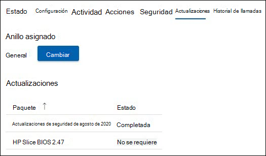

# Administración de actualizaciones 
Una sala de reuniones moderna está equipada con un dispositivo de Salas de Microsoft Teams y otros periféricos, como una cámara, micrófono o altavoz, y potencialmente más dispositivos para crear una experiencia de reunión inclusiva y eficaz. El equipo de diferentes tipos de OEM proporciona la experiencia organizativa exacta deseada; sin embargo, deben mantenerse con software y firmware de forma continuada.  

Salas de Microsoft Teams Pro Management garantiza que cada sala de su organización se mantendrá en los niveles recomendados para ofrecer una sala que siempre esté lista y funcione correctamente. El objetivo de Microsoft es reducir la complejidad y el trabajo en las piernas del personal operativo con inteligencia y automatización. La solución de problemas o los diagnósticos se realizan lo más rápido posible. 

## Transición de un dispositivo a Administración profesional 
La incorporación de dispositivos de sala a Pro Management suele tener un historial y una práctica de administración de cambios diferentes de nuestra guía.  

- Para beneficiarte de Pro Management, debes realizar la transición de administración de cambios para todas las actualizaciones de la cartera de Administración pro.
- Varios orígenes de incidencias de incidencia de administración de cambios, ya que hay una detección y corrección que se reiniciará de nuevo si se produce un incidente en la sala.
- Microsoft ha implementado controles y comprobaciones para implementar directivas que pueden diferir de una organización a otra y la capacidad de intervenir en situaciones excepcionales.
- Finalmente, los dispositivos de la sala se actualizarán según los estándares comunes, excepto las excepciones debido a problemas con una instalación de hardware específica.  

## Dispositivos de transición: comprobaciones de preparación básicas 
La mayoría de los errores inesperados se producen debido a cambios en la imagen base con un historial incierto de administración de cambios. 

Se recomienda realizar las siguientes comprobaciones de preparación sencillas:  

- **Imagen base**: la imagen base debe ser del OEM específico. Si el dispositivo se ha reconstruido en el pasado y muestra errores o comportamientos inesperados en tareas comunes, la imagen base debe restaurarse. Podemos proporcionar asistencia, pero no podemos reconstruir de forma remota el dispositivo de la sala, por lo que necesitará un técnico del sitio local.  
- **Base OS, Edición:** El sistema operativo base y la edición deben cumplir los requisitos de los dispositivos Salas de Microsoft Teams. Si esto no es así, debe corregirse como parte de la incorporación. Salas de Microsoft Teams requiere la Windows 10 IoT Enterprise o Windows 10 Enterprise SKU en las opciones de servicio del Canal Semi-Annual. Consulte la guía oficial de [MTR](rooms-lifecycle-support.md#windows-10-release-support) para obtener más información.

## Comprobaciones de preparación

Hay algunos requisitos previos para recibir actualizaciones a través del servicio Pro Management: 

|Software |Instrucciones |
|:- |:- |
|Servicios de Sincronización de Logitech  |Debe instalarse y ejecutarse en los dispositivos de la sala de reuniones logitech. Los servicios de sincronización requeridos se instalarán automáticamente desde Windows Novedades a menos que se bloqueen. También se puede instalar el paquete de sincronización completo. |
|Actualizaciones del sistema operativo Windows |Debe mantenerse habilitado y no redirigido a WSUS, ni bloqueado desde una perspectiva de red. No se deben usar directivas GPO ni MDM para administrar las actualizaciones del sistema operativo. |
|Actualizaciones de Microsoft Store   |Debería estar desactivada. Servicios administrados desactivará las actualizaciones de la Store si se encuentran activadas. |
|Software antivirus |Si está ejecutando software AV en estos dispositivos, debe asegurarse de que AV tiene exclusiones en su lugar para los dll de Teams y Skype. Consulta aquí para obtener más detalles. |
|Software adicional |Es necesario revisar software adicional, como la visualización de escritorio remoto de terceros, etc. con Servicios administrados para descartar los efectos secundarios. |
|Administración de cambios adicionales|Puede interferir con las actualizaciones cubiertas y no debería introducirse. |

## Actualizaciones administradas: cómo funciona 
Hay dos formas principales de administrar las actualizaciones:  

- **Administración automática**: Novedades se instalan en el dispositivo de la sala en función de la evaluación de Pro Management. No es necesaria intervención para las actualizaciones administradas en nuestra cartera.
- **Anillo validado**: Configure un sistema de anillos para obtener una vista previa de las actualizaciones en dispositivos específicos para que pueda supervisarlos sin el trabajo de las piernas asociadas. La configuración del anillo proporciona una capa adicional de diligencia debida antes de la amplia implementación.  

### Administración automática

Si elige que se administre automáticamente, no es necesario realizar ninguna acción para las actualizaciones de su parte. Sin embargo, debes revisar la cartera actual de actualizaciones admitidas por el servicio De administración de Pro. La cartera está recibiendo constantemente nuevas adiciones, y es nuestra prioridad cubrir las actualizaciones más frecuentes e impactantes para garantizar la estabilidad de su sala. Compruebe la lista actual (en la sección "Administración de actualizaciones" de este documento) para planear cualquier administración de cambios adicional necesaria para su organización.  

**Recomendación:** No instales actualizaciones cubiertas por el servicio De administración de Pro en ningún dispositivo administrado por tu cuenta. 

### Validación de anillos

Al elegir la validación de anillos, revise las siguientes secciones sobre cómo funcionan los anillos en el portal de administración de Pro y las opciones disponibles para personalizarla para su organización. Incluso con la validación de anillos, se intentan asegurarse de que las salas no han vencido en las actualizaciones recomendadas. Según la situación, una sala podría recibir actualizaciones de "ponerse al día" para asegurarse de que cumple con las recomendaciones de Microsoft.  

 Busca anuncios en la página principal del portal y en la documentación de Administración profesional a medida que estén disponibles nuevos tipos de software y firmware en la cartera. 

### Programar 
Novedades se programan para las salas en función del equipo de la sala y si no cumplen los estándares recomendados para el software y el firmware aplicables. 

- Para ayudar a nuestros clientes a cumplir los requisitos de administración de cambios, la implementación de actualización se inicia **los miércoles** en el anillo de pruebas. Si se requiere una actualización crítica, se omitirá esta programación y la actualización se publicará en cuanto esté disponible. 
- Novedades se secuencian en función de la necesidad de una sala determinada. 
- Si tienes anillos de configuración para validar las actualizaciones, la actualización avanzará por el orden de llamada. 
- Una nueva actualización puede reemplazar a una actualización que se pone en cola si se determina que la estabilidad de la sala mejorará, en función de su situación.  
- Novedades se aplican normalmente durante la ventana de mantenimiento nocturno, que es de la habitación de **12:00 a 5:00 a.m**. para evitar cualquier tipo de interrupción. 

## directiva de ciclo de vida de actualización de Salas de Microsoft Teams aplicación 
La directiva de soporte técnico del equipo de ingeniería de MTR indica que todo el soporte finaliza después de que haya expirado el ciclo de vida de doce (12) meses de una versión o si se han publicado más de dos actualizaciones desde entonces. A continuación, los clientes deben actualizar a una versión compatible. Consulta [el soporte técnico de la versión de la aplicación Salas de Microsoft Teams: Microsoft Teams | Microsoft Docs](rooms-lifecycle-support.md) para obtener una descripción detallada del servicio. 

## Tutorial de la experiencia de administración de actualizaciones  
Para ver las actualizaciones, inicia sesión en el Portal de administración de Pro y ve a la página de Novedades.

En el panel Novedades se muestra una descripción general de la administración de actualizaciones de los salones con las siguientes pestañas:

- **Novedades**: actualizaciones de software o firmware aplicables a tu organización.  
- **Habitaciones**: La pestaña Habitaciones ofrece vistas a las habitaciones y anillos a los que pertenece cada habitación.
- **Anillos**: la pestaña Anillos muestra los anillos de salas de su organización.

### Novedades  

Esta vista muestra las actualizaciones relevantes para su inquilino y su estado respectivo. Para ver las actualizaciones anteriores que ya no están activas, selecciona el botón de alternancia **Incluir actualizaciones anteriores** a Activado.  

Cualquier actualización puede estar en uno de los siguientes estados:

| Estado | Descripción |
|:- |:- |
| Programado | Se ha programado una actualización para las salas de un anillo determinado. Tenga en cuenta que una actualización solo mostrará Programado después de que la progresión llegue al anillo en el que se encuentra la sala. Por ejemplo, si una nueva actualización está en el anillo de ensayo, solo se mostrará Programado para salas en el anillo de ensayo.  
 Otros anillos tendrán el estado "No necesario" hasta que la actualización avance a ese anillo.
 |
| En curso | Se está actualizando y los anillos individuales muestran el estado. Este estado muestra el estado general del anillo y, por lo tanto, si una actualización se aplica a una única sala del anillo de ensayo de su inquilino, la actualización tendrá el estado "En curso" hasta que se alcance el anillo ejecutivo. |
| Completado con errores | Una actualización ha completado la progresión a través de todos los anillos configurados y ha fallado en al menos una sala. |
| Completado | Una actualización ha completado la progresión a través de todos los anillos configurados y se ha instalado correctamente en todas las salas aplicables.|
| Obsoleto | Se ha desactivado una actualización. Se detendrá la implementación posterior. Esto es típico porque la actualización se ha reemplazado por una nueva versión. |
| Pausa | Una actualización está en estado de pausa. |
| No necesario | La actualización aún no se evalúa para la sala o no se aplica a la sala. |

### Habitaciones  

La pestaña Salas muestra todas las salas de su inquilino y a las que pertenecen.  

Para configurar a qué anillo debe pertenecer un salón:  

1. Haga clic en la sala para mostrar la vista detallada.  
1. En **Llamar**, haga clic en **Cambiar**.  
1. Seleccione el Anillo al que debe pertenecer la sala.  
1. Haga clic en **Asignar**.  

La vista de salón detallada muestra las actualizaciones relevantes y su estado en el nodo **Novedades**.  

### Anillos  

Los anillos se usan para reducir el riesgo de problemas derivados de la implementación de las actualizaciones de características. Para ello, implemente gradualmente la actualización en todo el sitio. Cada anillo debe tener una lista de salas de salas de Microsoft Teams y una programación de lanzamiento correspondiente. La definición de anillos es generalmente un evento de una sola vez (o al menos poco frecuente), pero TI debe volver a visitar estos grupos de vez en cuando para asegurarse de que la secuencia sigue siendo correcta.  

La pestaña **Anillos** enumera todos los anillos de su inquilino. Hay tres anillos preconfigurados:  

- **Ensayo**: asigne salas al anillo de ensayo, que es su testbed. Todas las nuevas actualizaciones se implementarán aquí primero. Por lo general, querrá asegurarse de que el anillo de ensayo representa salas con la diversidad de tipos de dispositivos en su entorno. Si hay ciertos tipos de salas con una configuración poco común o un historial de problemas, considere la posibilidad de representarlos en el ensayo.

- **General**: De forma predeterminada, todas las habitaciones se colocan en este anillo. La mayoría de los dispositivos de sala que se usan en toda la empresa se encuentran en esta categoría. 

- **Ejecutivo**: Este grupo debe incluir sus salas de mayor perfil en las que desee minimizar las interrupciones de forma proactiva. Un buen ejemplo es una sala de conferencias grande que se usa para reuniones ejecutivas o reuniones de equipo grandes. 

### Especificar la escala de tiempo de implementación

Novedades no pueden superar los 60 días en todos los anillos.  

|Parámetro |Explicación |
|:- |:- |
|Período de aplazamiento|Una vez que una actualización comienza con el primer anillo, el período de aplazamiento es el retraso en días antes de iniciar la actualización en esta anillo.|
|Duración de la implementación|
Una vez que comience la actualización en este anillo, este es el momento de implementar en este anillo. Por ejemplo, si la duración es de 5 días, se implementará en las salas de este anillo durante 5 días una vez que se inicie la actualización en este anillo.|
|Período de prueba|El número de días para probar o validar la actualización en un anillo una vez aplicada al anillo. El período de prueba comienza después de que se complete la implementación y, una vez completada, la actualización pasará al siguiente canal.|
|Hora de finalización|La columna "Tiempo de finalización" indica el número total de días (duración de implementación + período de prueba) para que se complete este anillo.|
|Tiempo total|En la parte inferior se encuentra la fila "Total" que indica el tiempo que tardará una actualización en completarse desde el primero hasta el último anillo.|

### Crear anillos personalizados

1. Vaya a la pestaña **Anillos** .  
1. Haga clic en **Agregar anillo**.  
1. Especifique el orden en el que este anillo recibirá la actualización, donde 1 es el primero y 9 es el último.  
1. Ponle un nombre a este anillo.  
1. Proporcione una descripción si lo desea.  
1. Especifique el número de días que se implementará la actualización en esta anillo.  
1. Especifique el período de prueba.  
1. Haga clic en **Enviar**.  

> [!NOTE]
> "Días establecidos por otros anillos" es el número total de días que tardará una actualización en completarse en todos los anillos. Los "Días restantes" indican los días máximos que *debe completar este* anillo. La suma de "Duración de la implementación en días" y "Período de prueba en días" no puede superar esta cantidad.  

**Editar un anillo**

1. Vaya a la pestaña **Anillos** .
1. Haz clic en el anillo para eliminarlo.  
1. Haga clic en **Editar anillo**.  
1. Edite el número de días de implementación y pruebas, según sea necesario.

**Eliminar un anillo**

1. Vaya a la pestaña **Anillos** .  
1. Haz clic en el anillo para eliminarlo.  
1. Haga clic en **Eliminar anillo**.  

> [!NOTE]
> No se pueden eliminar los anillos predeterminados.  

**Mover salas**

Mover salas de un anillo a otro es posible de dos maneras:

1. Vaya a la pestaña **Anillos** .  
1. Haga clic en el anillo desde el que desea mover salas  
1. Haga clic en **Mover salas**.  
1. Seleccione las salas que desea mover en la **Lista de salas**.  
1. Elija el anillo de destino al que se moverán las salas seleccionadas en la lista desplegable.  
1. Haga clic en **Mover salas**.  

**O**

1. Abra los detalles de la sala que desea mover (ya sea a través de Incidentes, Salas o Novedades -> Salas).
1. Haga clic en la pestaña **Novedades**.  
1. En **Anillo asignado**, haga clic en **Cambiar**.
1. En la lista desplegable, selecciona el nuevo anillo.  
1. Haga clic en **Asignar**.

## Actualizaciones automatizadas: Visibilidad y control

Las actualizaciones automatizadas de Pro Management orquestan las actualizaciones en toda la organización. Sin embargo, usted tiene la visibilidad y el control para intervenir si es necesario. Estas son las formas de hacerlo: 

- En caso de error de actualización, se genera automáticamente un vale para realizar el seguimiento. 
- Si ves una actualización que causa problemas, puedes pausar la actualización con el botón **Pausar** . Pulsar el botón Pausa le pedirá a su equipo que investigue la creación de un vale de problema Grabar un vale de problema.
- Si ves que se ha producido un error en una actualización en una sala y has corregido un motivo plausible, como la desconexión de red, puedes reintentar la actualización con el botón **Reintentar todos los errores** .  
- Puede haber situaciones urgentes cuando decidas hacer que una actualización esté disponible anteriormente. En este caso, puedes usar el botón **Forzar actualizaciones** . Al usar la opción Forzar actualización, tiene la opción de forzar la actualización inmediatamente o cuando esté disponible al lado de la sala.  

> [!NOTE]
> **No recomendamos "Forzar Novedades"** como estrategia de administración de actualizaciones general, ya que es posible que se produzcan problemas conocidos con esas actualizaciones.

- Además, para garantizar buenas prácticas de administración de cambios, registraremos todas las actualizaciones de fuerza internamente en el servicio. En el futuro, esperamos que también lo hagas visible para ti.
