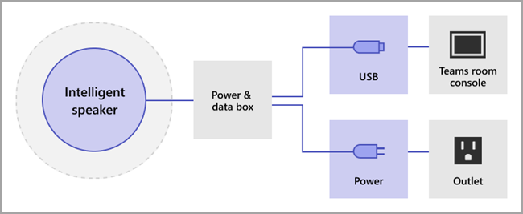

# Administrar controles de tecnología de reconocimiento de voz para un altavoz inteligente

Un orador inteligente usa la información de perfil de voz para reconocer quién dijo qué en la transcripción en directo. Cuando una Salas de Microsoft Teams para Windows de reunión está equipada con un altavoz inteligente, se puede usar la transcripción en directo durante la reunión. En este artículo se explica cómo usted, un administrador de inquilinos, controla la generación de perfiles de voz que se usa para el reconocimiento de voz para generar la transcripción en directo. Puede controlar hasta qué punto la organización usa el reconocimiento de voz y las siguientes características:

- Edite el nombre del orador en transcripciones.
- Cambie el orador de una sola expresión en la transcripción o cambie el orador en todas las expresiones de la transcripción (pero no en transcripciones futuras).
- Cambie la identificación del orador para las personas que aparecen en la reunión.
- Quite la identificación de una o más expresiones identificadas como ese orador en cada transcripción.

## Revisar los requisitos del altavoz inteligente

Un altavoz inteligente incluye una matriz especial de siete micrófonos. El sistema usa información de perfil de voz para identificar las voces de hasta 10 personas en las salas de reuniones.

Los siguientes elementos son requisitos de Altavoz inteligente:

- El inquilino del cliente debe estar ubicado en ee. UU. (Norteamérica). 1
- La sala de reuniones debe tener un máximo de 10 personas presentes en persona.
- La sala de reuniones tiene un vínculo de carga de 7 Mbps como mínimo.

 1 Un altavoz inteligente y el perfil de voz y el uso asociados solo estarán disponibles en el idioma en-EE. UU. y para los inquilinos de EE. UU. (región NA-EE. UU.). Ambas condiciones deben cumplirse para que un usuario de inquilino se inscriba y use un altavoz inteligente para la transcripción atribuida.

## Configurar un altavoz inteligente

Un altavoz inteligente se conecta directamente mediante USB a Salas de Teams consola. Para obtener los mejores resultados, se debe usar un altavoz inteligente de la marca Yealink con una consola de marca Yealink.

> [!NOTE]
> Un altavoz inteligente Yealink **debe** usarse con una consola de Yealink.

> [!NOTE]
> No se admite un altavoz inteligente conectado a Logitech Surface Pro Salas de Microsoft Teams. Hay un problema conocido que Salas de Teams no puede reconocer el altavoz inteligente a través del dock.

Un altavoz inteligente debe colocarse como mínimo a 20 cm de distancia de las paredes y objetos grandes, como portátiles. Si el cable USB del altavoz inteligente no es lo suficientemente largo para su configuración, use extensores de cable.

1. Inicie sesión en la consola como administrador.
2. Establezca la configuración Teams dispositivo para que coincida con el micrófono y el altavoz del Altavoz inteligente.
   También puede hacerlo a través del portal de TAC en lugar de hacerlo en la consola de la sala.

   El diagrama muestra cómo el altavoz inteligente está conectado al dispositivo si el dispositivo incluye un cuadro de datos.

   

   El diagrama muestra cómo el altavoz inteligente está conectado al dispositivo si el dispositivo no incluye un cuadro de datos.

   

> [!Note]
> Los dispositivos EPOS y Yealink deben tener el prefijo "EPS" o "Yealink" y contener "UAC2_RENDER" en el nombre del altavoz y "UAC2_TEAMS" en el nombre del micrófono. Si no encuentra estos nombres de micrófono y altavoz en el menú desplegable, reinicie el dispositivo De altavoz inteligente.

## Habilitar un reconocimiento de usuario de Altavoz inteligente

Los datos de perfil de voz se pueden usar en cualquier reunión con un altavoz inteligente. Vea [Teams de reuniones y](../meeting-policies-in-teams.md#allow-transcription) los cmdlets de reunión de [PowerShell](/powershell/module/skype/set-csteamsmeetingpolicy?view=skype-ps) para obtener información sobre la configuración de la reunión.

Los datos de perfil de voz del usuario se crean cuando la directiva se establece para distinguir o un invitado que no es de reunión entra durante la reunión. Los datos de perfil de voz se descartan al final de la reunión.

Las siguientes son las directivas necesarias para establecer un altavoz inteligente y un reconocimiento de usuario.

|Directiva|Descripción|Valores y comportamiento|
|-|-|-|
|enrollUserOverride|Se usa para establecer la captura de perfil de voz o la inscripción en Teams configuración de un inquilino. |**Deshabilitado** <ul><li> Los usuarios que nunca se han inscrito no pueden ver, inscribirse o volver a inscribirse.<li>El punto de entrada al flujo de inscripción se ocultará.<li>Si los usuarios seleccionan un vínculo a la página de inscripción, verán un mensaje que indica que esta característica no está habilitada para su organización.  <li>Los usuarios que se han inscrito pueden ver y quitar su perfil de voz en la Teams configuración. Una vez que quiten su perfil de voz, no podrán ver, acceder ni completar el flujo de inscripción.</li></ul> **Habilitado** <ul><li> Los usuarios pueden ver, acceder y completar el flujo de inscripción.<li>El punto de entrada se mostrará en la Teams de configuración de la pestaña **Reconocimiento.**</li></ul>|
|roomAttributeUserOverride|Controle la identificación de usuario basada en voz en salas de reuniones. Esta configuración es necesaria para Salas de Teams cuentas.| **Desactivado** <ul><li>El Salas de Teams no enviará el ancho de banda de almacenamiento en secuencias de audio desde la sala. <li>Los usuarios de salas de reuniones no se atribuirán ni distinguirán y sus firmas de voz no se recuperarán ni se usarán en absoluto.<li>Se desconocen los usuarios de la sala de reuniones.</li></ul>  **Atributo** <ul><li>Los usuarios de salas se atribuirán en función de su estado de inscripción.<li>Los usuarios inscritos se muestran con su nombre en la transcripción.  <li>Los usuarios que no están inscritos se muestran como Altavoz n.<li>El Salas de Teams de audio enviará siete transmisiones de audio desde la sala.</ul>  **Distinguir**  *Esta configuración estará disponible más adelante.*|
|AllowTranscription|Necesario para cuentas de Teams y salas.|**Verdadero** y **Falso**|
||||

En el Teams de administración, establezca la **directiva Permitir transcripción.** Configuración están **desactivados** de forma predeterminada.

## Preguntas más frecuentes (P+F)

**¿Dónde se almacenan los datos del perfil de voz?**

Los datos de perfil de voz se almacenan en Office 365 nube con contenido de usuario.

**¿Cuál es la línea de tiempo y la directiva de retención?**

La directiva de retención general se indica en información general [sobre la retención de datos.](/compliance/assurance/assurance-data-retention-deletion-and-destruction-overview) Además, los datos de perfil de voz de un usuario se eliminarán después de 3 años si el usuario no está invitado a ninguna reunión con un orador inteligente dentro de ese período de 3 años. Los datos no se usan en ninguna reunión para los empleados existentes. Si un empleado ha abandonado la empresa, los datos de perfil de voz se consideran contenido de usuario y se tratan como tales Office 365 directiva de retención de datos descrita en información general sobre retención [de datos.](/compliance/assurance/assurance-data-retention-deletion-and-destruction-overview)

**¿Se usan datos de perfil de voz en servicios Microsoft?**

No, los datos de perfil de voz solo se usan para el propósito para el que el usuario ha dado su consentimiento. Microsoft no usará los datos de perfil de voz excepto en Teams escenarios de reconocimiento de voz.

Por ejemplo, Microsoft no usará los datos en las situaciones siguientes:

**¿Se usan mis datos de perfil de voz al unirse a una reunión de otra organización?**

No solo en reuniones organizadas por un usuario de su organización.

**¿Cómo puedo exportar mi perfil de voz?**

El administrador de TI puede exportar los datos de audio en cualquier momento.

## Temas relacionados

[Artículo de soporte técnico: Usar altavoces inteligentes para identificar participantes en la sala ](https://support.microsoft.com/office/use-teams-intelligent-speakers-to-identify-in-room-participants-in-meeting-transcription-a075d6c0-30b3-44b9-b218-556a87fadc00)
