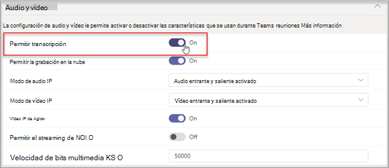

# Administrar controles de tecnología de reconocimiento de voz para un altavoz inteligenteManage voice recognition technology controls for an Intelligent Speaker

Un orador inteligente usa la información de perfil de voz para reconocer quién dijo qué en la transcripción en directo.An Intelligent Speaker uses voice profile information to recognize who said what in live transcription. Cuando una Salas de Microsoft Teams para Windows de reunión está equipada con un altavoz inteligente, se puede usar la transcripción en directo durante la reunión.When a Microsoft Teams Rooms for Windows meeting room is equipped with an Intelligent Speaker, live transcription can be used during the meeting. En este artículo se explica cómo usted, un administrador de inquilinos, controla la generación de perfiles de voz que se usa para el reconocimiento de voz para generar la transcripción en directo.This article explains how you, a tenant admin, control the voice profiling that's used for voice recognition to generate live transcription. Puede controlar hasta qué punto la organización usa el reconocimiento de voz y las siguientes características:You can control to what degree the organization is using voice recognition and the following features:

- Edite el nombre del orador en transcripciones.Edit the speaker's name in transcripts.
- Cambie el orador de una sola expresión en la transcripción o cambie el orador en todas las expresiones de la transcripción (pero no en transcripciones futuras).Change the speaker of a single utterance in the transcript or change the speaker in all the utterances in the transcript (but not on future transcripts).
- Cambie la identificación del orador para las personas que aparecen en la reunión.Change the speaker identification for the people who are listed in the meeting.
- Quite la identificación de una o más expresiones identificadas como ese orador en cada transcripción.Remove the identification of one or more utterances identified as that speaker, on every transcript.

## Revisar los requisitos del altavoz inteligenteReview Intelligent Speaker requirements

Un altavoz inteligente incluye una matriz especial de siete micrófonos.An Intelligent Speaker includes a special seven-microphone array. El sistema usa información de perfil de voz para identificar las voces de hasta 10 personas en las salas de reuniones.The system uses voice profile information to identify voices of up to 10 people in meeting rooms.

Los siguientes elementos son requisitos de Altavoz inteligente:The following items are Intelligent Speaker requirements:

- El inquilino del cliente debe estar ubicado en ee. UU. (Norteamérica). 1The customer tenant must be located in the U.S. (North America).1
- La sala de reuniones debe tener un máximo de 10 personas presentes en persona.The meeting room should have a maximum of 10 people present in person.
- La sala de reuniones tiene un vínculo de carga de 7 Mbps como mínimo.The meeting room has an upload link of minimum 7 Mbps.

 1 Un altavoz inteligente y el perfil de voz y el uso asociados solo estarán disponibles en el idioma en-EE. UU. y para los inquilinos de EE. UU. (región NA-EE. UU.).1 An Intelligent Speaker and associated voice profile and usage will only be available in EN-US language and for US (NA-US region) tenants. Ambas condiciones deben cumplirse para que un usuario de inquilino se inscriba y use un altavoz inteligente para la transcripción atribuida.Both conditions must be true for a tenant user to enroll and use an Intelligent Speaker for attributed transcription.

## Configurar un altavoz inteligenteSet up an Intelligent Speaker

Un altavoz inteligente se conecta directamente mediante USB a Salas de Teams consola.An Intelligent Speaker connects directly using USB to the Teams Rooms console. Para obtener los mejores resultados, se debe usar un altavoz inteligente de la marca Yealink con una consola de marca Yealink.For best results, a Yealink brand Intelligent Speaker should be used with a Yealink brand console.

> [!NOTE]
> Un altavoz inteligente Yealink **debe** usarse con una consola de Yealink.A Yealink Intelligent Speaker **must** be used with a Yealink console.

> [!NOTE]
> No se admite un altavoz inteligente conectado a Logitech Surface Pro Salas de Microsoft Teams.We don't support an Intelligent Speaker connected to Logitech Surface Pro Microsoft Teams Rooms. Hay un problema conocido que Salas de Teams no puede reconocer el altavoz inteligente a través del dock.There is a known issue that Teams Rooms can't recognize the Intelligent Speaker through the dock.

Un altavoz inteligente debe colocarse como mínimo a 20 cm de distancia de las paredes y objetos grandes, como portátiles.An Intelligent Speaker should be placed at least 8 inches (20 cm) away from walls and large objects, such as laptops. Si el cable USB del altavoz inteligente no es lo suficientemente largo para su configuración, use extensores de cable.If the Intelligent Speaker USB cable isn't long enough for your setup, use cable extenders.

1. Inicie sesión en la consola como administrador.Sign in to the console as administrator.
2. Establezca la configuración Teams dispositivo para que coincida con el micrófono y el altavoz del Altavoz inteligente.Set the Teams device settings to match the Intelligent Speaker microphone and speaker.
   También puede hacerlo a través del portal de TAC en lugar de hacerlo en la consola de la sala.You can also do this through the TAC portal instead of at the room console.

   El diagrama muestra cómo el altavoz inteligente está conectado al dispositivo si el dispositivo incluye un cuadro de datos.The diagram shows how the Intelligent Speaker is connected to the device if the device includes a data box.

   ![La configuración del altavoz inteligente con el altavoz, el cuadro de datos y la potencia.The Intelligent Speaker setup with the speaker, the power and data box. Una línea va al puerto USB de la consola y la otra línea a la alimentación.One line goes to the USB port of the console, and the other line goes to power. ](../media/intelligent-speakers1.png)

   El diagrama muestra cómo el altavoz inteligente está conectado al dispositivo si el dispositivo no incluye un cuadro de datos.The diagram shows how the Intelligent Speaker is connected to the device if the device doesn't include a data box.

   

> [!Note]
> Los dispositivos EPOS y Yealink deben tener el prefijo "EPS" o "Yealink" y contener "UAC2_RENDER" en el nombre del altavoz y "UAC2_TEAMS" en el nombre del micrófono.EPOS and Yealink devices should have "EPOS" or "Yealink" prefix and contain "UAC2_RENDER" in the speaker name and "UAC2_TEAMS" in the microphone name. Si no encuentra estos nombres de micrófono y altavoz en el menú desplegable, reinicie el dispositivo De altavoz inteligente.If you don't find these microphone and speaker names in the dropdown menu, restart the Intelligent Speaker device.

## Habilitar un reconocimiento de usuario de Altavoz inteligenteEnable an Intelligent Speaker user recognition

Los datos de perfil de voz se pueden usar en cualquier reunión con un altavoz inteligente.Voice profile data can be used in any meeting with an Intelligent Speaker. Vea [Teams de reuniones y](../meeting-policies-in-teams.md#allow-transcription) los cmdlets de reunión de [PowerShell](/powershell/module/skype/set-csteamsmeetingpolicy?view=skype-ps) para obtener información sobre la configuración de la reunión.See [Teams meetings policies](../meeting-policies-in-teams.md#allow-transcription) and the [PowerShell meeting cmdlets](/powershell/module/skype/set-csteamsmeetingpolicy?view=skype-ps) for information on the meeting settings.

Los datos de perfil de voz del usuario se crean cuando la directiva se establece para distinguir o un invitado que no es de reunión entra durante la reunión.The voice profile data of the user is created when the policy is set to distinguish or a non-meeting invitee walks in during the meeting. Los datos de perfil de voz se descartan al final de la reunión.The voice profile data is dismissed at the end of the meeting.

Las siguientes son las directivas necesarias para establecer un altavoz inteligente y un reconocimiento de usuario.The following are the required policies to set an Intelligent Speaker and user recognition.

|DirectivaPolicy|DescripciónDescription|Valores y comportamientoValues and Behavior|
|-|-|-|
|enrollUserOverrideenrollUserOverride|Se usa para establecer la captura de perfil de voz o la inscripción en Teams configuración de un inquilino.Use to set voice profile capture, or enrollment, in Teams settings for a tenant. |**Deshabilitado****Disabled** <ul><li> Los usuarios que nunca se han inscrito no pueden ver, inscribirse o volver a inscribirse.Users who have never enrolled can't view, enroll, or re-enroll.<li>El punto de entrada al flujo de inscripción se ocultará.The entry point to the enrollment flow will be hidden.<li>Si los usuarios seleccionan un vínculo a la página de inscripción, verán un mensaje que indica que esta característica no está habilitada para su organización.If users select a link to the enrollment page, they'll see a message that states this feature isn't enabled for their organization.  <li>Los usuarios que se han inscrito pueden ver y quitar su perfil de voz en la Teams configuración.Users who have enrolled can view and remove their voice profile in the Teams settings. Una vez que quiten su perfil de voz, no podrán ver, acceder ni completar el flujo de inscripción.Once they remove their voice profile, they won't be able to view, access, or complete the enrollment flow.</li></ul> **Habilitado****Enabled** <ul><li> Los usuarios pueden ver, acceder y completar el flujo de inscripción.Users can view, access, and complete the enrollment flow.<li>El punto de entrada se mostrará en la Teams de configuración de la pestaña **Reconocimiento.**The entry point will show on Teams settings page under the **Recognition** tab.</li></ul>|
|roomAttributeUserOverrideroomAttributeUserOverride|Controle la identificación de usuario basada en voz en salas de reuniones.Control the voice-based user identification in meeting rooms. Esta configuración es necesaria para Salas de Teams cuentas.This setting is required for Teams Rooms accounts.| **Desactivado****Off** <ul><li>El Salas de Teams no enviará el ancho de banda de almacenamiento en secuencias de audio desde la sala.The Teams Rooms device won't send audio stream-saving bandwidth from the room. <li>Los usuarios de salas de reuniones no se atribuirán ni distinguirán y sus firmas de voz no se recuperarán ni se usarán en absoluto.Meeting room users won't be attributed or distinguished, and their voice signatures won't be retrieved or used at all.<li>Se desconocen los usuarios de la sala de reuniones.Meeting room users are unknown.</li></ul>  **Atributo****Attribute** <ul><li>Los usuarios de salas se atribuirán en función de su estado de inscripción.Rooms users will be attributed based on their enrollment status.<li>Los usuarios inscritos se muestran con su nombre en la transcripción.Users who are enrolled are shown with their name in the transcription.  <li>Los usuarios que no están inscritos se muestran como Altavoz n.Users who aren't enrolled show as Speaker n.<li>El Salas de Teams de audio enviará siete transmisiones de audio desde la sala.The Teams Rooms device will send seven audio streams from the room.</ul>  **Distinguir****Distinguish**  *Esta configuración estará disponible más adelante.**This setting will be available at a later date.*|
|AllowTranscriptionAllowTranscription|Necesario para cuentas de Teams y salas.Required for user and Teams rooms accounts.|**Verdadero** y **Falso****True** and **False**|
||||

En el Teams de administración, establezca la **directiva Permitir transcripción.**In the Teams admin center, set the **Allow transcription** policy. Configuración están **desactivados** de forma predeterminada.Settings are **Off** by default.

## Preguntas más frecuentes (P+F)Frequently asked questions (FAQ)

**¿Dónde se almacenan los datos del perfil de voz?****Where is the voice profile data stored?**

Los datos de perfil de voz se almacenan en Office 365 nube con contenido de usuario.Voice profile data is stored in Office 365 cloud with user content.

**¿Cuál es la línea de tiempo y la directiva de retención?****What is the retention timeline and policy?**

La directiva de retención general se indica en información general [sobre la retención de datos.](/compliance/assurance/assurance-data-retention-deletion-and-destruction-overview)General retention policy is stated in the [Data retention overview](/compliance/assurance/assurance-data-retention-deletion-and-destruction-overview). Además, los datos de perfil de voz de un usuario se eliminarán después de 3 años si el usuario no está invitado a ninguna reunión con un orador inteligente dentro de ese período de 3 años.In addition, a user's voice profile data will be deleted after 3 years  if the user isn't invited to any meetings with an Intelligent Speaker within that 3-year period. Los datos no se usan en ninguna reunión para los empleados existentes.Data isn't used in any meetings for existing employees. Si un empleado ha abandonado la empresa, los datos de perfil de voz se consideran contenido de usuario y se tratan como tales Office 365 directiva de retención de datos descrita en información general sobre retención [de datos.](/compliance/assurance/assurance-data-retention-deletion-and-destruction-overview)If an employee has left the company, voice profile data is considered user content and is treated as such per Office 365 data retention policy described in the [Data retention overview](/compliance/assurance/assurance-data-retention-deletion-and-destruction-overview).

**¿Se usan datos de perfil de voz en servicios Microsoft?****Is voice profile data used across Microsoft services?**

No, los datos de perfil de voz solo se usan para el propósito para el que el usuario ha dado su consentimiento.No, voice profile data is only used for the purpose for which the user has provided consent. Microsoft no usará los datos de perfil de voz excepto en Teams escenarios de reconocimiento de voz.Microsoft will not use the voice profile data except within Teams voice recognition scenarios.

Por ejemplo, Microsoft no usará los datos en las situaciones siguientes:For example, Microsoft won't use the data in the following situations:

**¿Se usan mis datos de perfil de voz al unirse a una reunión de otra organización?****Is my voice profile data used when I join a meeting in another organization?**

No solo en reuniones organizadas por un usuario de su organización.No only in meetings organized by a user in your organization.

**¿Cómo puedo exportar mi perfil de voz?****How can I export my voice profile?**

El administrador de TI puede exportar los datos de audio en cualquier momento.Your IT admin can export your audio data at any time.

## Temas relacionadosRelated topics

[Artículo de soporte técnico: Usar altavoces inteligentes para identificar participantes en la sala Support article: Use Intelligent Speakers to Identify in-room participants ](https://support.microsoft.com/office/use-teams-intelligent-speakers-to-identify-in-room-participants-in-meeting-transcription-a075d6c0-30b3-44b9-b218-556a87fadc00)
