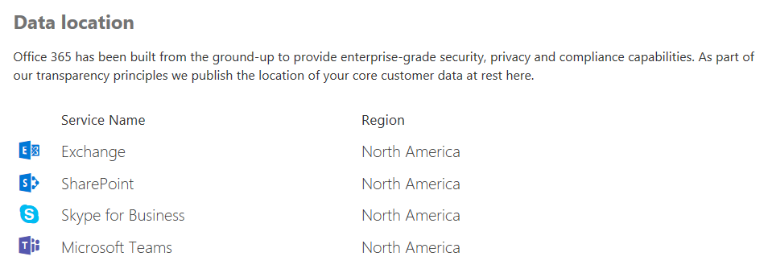

# Seguridad y cumplimiento en Microsoft Teams

> [!IMPORTANT]
> Para obtener más información sobre cómo asegurar mejor **la seguridad mientras todos trabajan desde casa durante el brote COVID-19**, lea estos artículos:
>  - [Las 12 tareas principales de los equipos de seguridad para dar soporte al trabajo desde casa](https://docs.microsoft.com/microsoft-365/security/top-security-tasks-for-remote-work)
>  - [Optimizar la conectividad de Microsoft 365 u Office 365 para usuarios remotos que usan túnel dividido de VPN](https://docs.microsoft.com/Office365/Enterprise/office-365-vpn-split-tunnel)
>  - Actualizado el 2 de abril de 2020: [Guía de seguridad de Teams](teams-security-guide.md)

Microsoft Teams está integrado en la nube de Microsoft 365 y de Office 365 de nivel empresarial, que ofrece las funcionalidades avanzadas de seguridad y cumplimiento que nuestros clientes esperan. Para obtener más información sobre cómo planear la seguridad en Microsoft 365 u Office 365, [la guía básica de seguridad](https://docs.microsoft.com/microsoft-365/security/office-365-security/security-roadmap) es un buen lugar para comenzar. Para obtener más información sobre cómo planear el cumplimiento en Microsoft 365 u Office 365, puede empezar con [el artículo Plan for Security and Compliance](https://docs.microsoft.com/microsoft-365/compliance/plan-for-security-and-compliance) .

En este artículo se proporciona más información sobre la seguridad y el cumplimiento específicos de Teams. No pierdas estos videos mecánicos de Microsoft sobre seguridad y cumplimiento:

- [Microsoft Teams Essentials para ti: seguridad y cumplimiento](https://youtu.be/91lHNKVVvQ4) (12:42 mín)
- [Controles de Microsoft Teams para seguridad y cumplimiento](https://www.youtube.com/watch?v=Km4T4hMM__k) (10:54 min)

> [!IMPORTANT]
> Como cliente de Microsoft 365 u Office 365, usted es el propietario y el control de sus datos. Microsoft no utiliza tus datos para nada más que proporcionar el servicio al que te suscribiste. Como proveedor de servicios, no analizamos el correo electrónico, los documentos ni los equipos para anunciar o para fines no relacionados con el servicio. Microsoft no tiene acceso al contenido cargado. Como OneDrive y SharePoint en Microsoft 365, los datos del cliente se conservan en el espacio empresarial. Puede consultar más información sobre la confianza y la información relacionada con la seguridad en el [centro de confianza de Microsoft](https://microsoft.com/trustcenter). Teams sigue las mismas instrucciones y principios que el centro de confianza de Microsoft.

## Seguridad

Teams aplica la autenticación en dos fases de todo el equipo y de toda la organización, el inicio de sesión único a través de Active Directory y el cifrado de datos en tránsito y en reposo. Los archivos se almacenan en SharePoint y están respaldados por el cifrado de SharePoint. Las notas se almacenan en OneNote y están respaldadas por el cifrado de OneNote. Los datos de OneNote se almacenan en el sitio de SharePoint de grupo. La ficha wiki también se puede usar para tomar notas y su contenido también se almacena en el sitio de SharePoint de grupo.

Lea [modelos de identidad y autenticación](identify-models-authentication.md) para obtener más información sobre la autenticación y los equipos, y [Cómo funciona la](sign-in-teams.md) autenticación moderna con la autenticación moderna en particular.

Debido a que Teams funciona en colaboración con SharePoint, OneNote, Exchange y mucho más, debe sentirse cómodo con la administración de la seguridad en Microsoft 365 u Office 365 todo. Para obtener más información, Lea acerca de [Cómo configurar su organización de Microsoft 365 u Office 365 para mayor seguridad](https://docs.microsoft.com/office365/securitycompliance/tenant-wide-setup-for-increased-security).

> [!NOTE]
> En la actualidad, los [canales privados](private-channels.md) admiten características de seguridad y cumplimiento limitadas. La compatibilidad con el conjunto completo de características de seguridad y cumplimiento de los canales privados estará disponible próximamente.

### Protección contra amenazas avanzada (ATP)

La protección contra amenazas avanzada (ATP) está disponible para Microsoft Teams, junto con SharePoint y OneDrive, aplicaciones que se integran con Teams para la administración de contenido. ATP le permite determinar si el contenido de estas aplicaciones es malintencionado y bloquear este contenido del acceso de los usuarios.

Cómo se administra el contenido afectado después de la detección se corresponde con la configuración que ha seleccionado en Microsoft 365 u Office 365. Le recomendamos encarecidamente considerar todas las aplicaciones cuando se trata de configurar ATP y, para obtener más información, el artículo [ATP para SharePoint, OneDrive y Microsoft Teams](https://docs.microsoft.com/microsoft-365/security/office-365-security/atp-for-spo-odb-and-teams) tendrá información detallada sobre cómo comenzar.

### Vínculos seguros

Si bien, en este momento, los vínculos seguros de protección contra amenazas avanzada (ATP) no están disponibles en Microsoft Teams, ahora se encuentran en la [versión preliminar pública](https://docs.microsoft.com/microsoft-365/security/office-365-security/atp-safe-links-for-teams?view=o365-worldwide) a través del programa de adopción de tecnología (TAP), y si bien no se establece una fecha de lanzamiento para la disponibilidad general, Actualizaremos este artículo cuando llegue ese momento. Mientras tanto, para obtener información sobre los vínculos seguros de Microsoft 365 u Office 365, consulte los [vínculos seguros ATP](https://docs.microsoft.com/office365/securitycompliance/atp-safe-links#how-to-get-atp-safe-links-protection). Los vínculos seguros ATP están disponibles tanto en el plan [1 de ATP como en el plan ATP 2](https://docs.microsoft.com/microsoft-365/security/office-365-security/office-365-atp?view=o365-worldwide).

### Datos adjuntos seguros

Los datos adjuntos seguros son una característica diseñada para mejorar la seguridad del usuario mediante la comprobación de datos adjuntos maliciosos y detectados. Los administradores globales o de seguridad crean [directivas](https://docs.microsoft.com/microsoft-365/security/office-365-security/set-up-atp-safe-attachments-policies?view=o365-worldwide) para controlar estos datos adjuntos maliciosos con el fin de evitar que se envíen a los usuarios, haga clic en ellos y se los refieran. Protección de datos adjuntos seguros está disponible para SharePoint, OneDrive y Microsoft Teams, y Microsoft 365 u Office 365 [plan de protección contra amenazas avanzado 1 y 2](https://docs.microsoft.com/microsoft-365/security/office-365-security/office-365-atp?view=o365-worldwide) tienen esta capacidad. Obtenga más información sobre datos adjuntos seguros y cómo pueden ayudarle a proteger su organización [aquí](https://docs.microsoft.com/microsoft-365/security/office-365-security/atp-safe-attachments?view=o365-worldwide).

### Cómo funcionan las directivas de acceso condicional para Teams

Microsoft Teams depende en gran medida de Exchange Online, SharePoint y Skype empresarial online para escenarios de productividad principales, como reuniones, calendarios, chats interoperativos y archivos compartidos. Las directivas de acceso condicional que se configuran para estas aplicaciones en la nube se aplican a Microsoft Teams cuando un usuario inicia sesión directamente en Microsoft Teams, en cualquier cliente.

Microsoft Teams se admite por separado como una aplicación de nube en las directivas de acceso condicional de Azure Active Directory. Las directivas de acceso condicional que se establecen para la aplicación en la nube de Microsoft Teams se aplican a Microsoft Teams cuando un usuario inicia sesión. Sin embargo, sin las directivas correctas en otras aplicaciones como Exchange Online y SharePoint, los usuarios pueden seguir teniendo acceso directamente a esos recursos. Para obtener más información sobre cómo configurar una directiva de acceso condicional en el portal de Azure, vaya a: [Inicio rápido de Azure Active Directory](https://docs.microsoft.com/azure/active-directory/active-directory-conditional-access-azure-portal-get-started).

Los clientes de escritorio de Microsoft Teams para Windows y Mac son compatibles con la autenticación moderna. La autenticación moderna ofrece inicio de sesión basado en la biblioteca de autenticación de Azure Active Directory (ADAL) para las aplicaciones cliente de Microsoft Office en todas las plataformas.

La aplicación de escritorio de Microsoft Teams es compatible con AppLocker.  Para obtener más información sobre los requisitos previos de AppLocker, consulte: requisitos para usar [AppLocker](https://docs.microsoft.com/windows/security/threat-protection/windows-defender-application-control/applocker/requirements-to-use-applocker).

## Respeto

Teams tiene una amplia variedad de información para ayudarle en áreas de cumplimiento, como el cumplimiento de las comunicaciones de canales, chats y datos adjuntos, directivas de retención, protección de pérdida de datos (DLP), eDiscovery y retención legal para canales, chats y archivos, la búsqueda de registros de auditoría, así como la administración de aplicaciones para dispositivos móviles con Microsoft Intune. Le proporcionamos cierta información sobre todos estos temas y puede ir al centro de cumplimiento de [Microsoft 365](https://compliance.microsoft.com) para administrar esta configuración.

### Barreras de la información

Las barreras de la información son las directivas que los administradores de equipos organizan en contexto para hacer cosas como mantener las personas o grupos para que se comuniquen entre sí (cuando no es necesario que lo haga la empresa, o una razón normativo para bloquearlos), y también le permite establecer directivas relacionadas con las búsquedas y la exhibición de datos (descritas a continuación). Estas directivas pueden afectar a los usuarios de chats de 1:1, chats grupales o a nivel de equipo.

Para obtener más información sobre este tema, vaya a [barreras de la información en Microsoft Teams](information-barriers-in-teams.md).

### Cumplimiento de la comunicación

El cumplimiento de la comunicación en Microsoft 365 le permite agregar usuarios a directivas dentro del ámbito que se pueden configurar para examinar las comunicaciones de Microsoft Teams en busca de lenguaje ofensivo, información confidencial e información relacionada con los estándares internos y normativos. Las comunicaciones por chat y los datos adjuntos asociados de los canales de los equipos públicos y privados, los chats individuales y los datos adjuntos se pueden analizar para minimizar los riesgos de comunicación en la organización. Para obtener más información sobre cómo puede configurar directivas que le ayuden a detectar, capturar y tomar medidas para comunicaciones de equipos inadecuadas, consulte [cumplimiento de la comunicación en Microsoft 365](https://docs.microsoft.com/microsoft-365/compliance/communication-compliance).

### Directivas de retención

Las directivas de retención de Microsoft Teams le permiten mantener los datos importantes para su organización, que se requieran por razones normativas, legales, empresariales o de otro modo, así como quitar el contenido y las comunicaciones que no son relevantes para su retención. También puede usar directivas de retención para mantener los datos durante un período de tiempo y, a continuación, eliminarlos. Para obtener más información, revise el artículo [directivas de retención en Microsoft Teams](retention-policies.md) .

### Prevención de pérdida de datos (DLP)

La prevención de pérdida de datos (DLP) en Microsoft Teams, así como la mayor historia de DLP para Microsoft 365 u Office 365, gira en relación con la preparación para la empresa cuando se trata de proteger documentos y datos confidenciales. Independientemente de si tiene alguna preocupación por la información confidencial de mensajes o documentos, las directivas DLP podrán ayudar a garantizar que los usuarios no compartan estos datos confidenciales con personas incorrectas.

Para obtener información sobre la prevención de pérdida de datos en Teams, revise [DLP para Microsoft Teams](https://docs.microsoft.com/microsoft-365/compliance/dlp-microsoft-teams). Un buen artículo para los asuntos de DLP [de O365 es información general sobre la prevención de pérdida de datos](https://docs.microsoft.com/microsoft-365/compliance/data-loss-prevention-policies).

### eDiscovery

El descubrimiento electrónico, o eDiscovery, es el aspecto electrónico para identificar, recopilar y producir información almacenada electrónicamente (ESI) en respuesta a una solicitud de producción en un traje o una investigación de derecho. Las capacidades incluyen administración de casos, preservación, búsqueda, análisis y exportación de datos de equipos. Esto incluye chat, mensajería y archivos, reuniones y resúmenes de llamadas. Para las reuniones y las llamadas de Teams, se crea un resumen de los eventos que se produjeron en la reunión y la llamada en eDiscovery.

Para obtener más información sobre cómo realizar Microsoft 365 u Office 365 eDiscovery en el centro de seguridad y el centro de cumplimiento y ejecutar la búsqueda de contenido de cumplimiento para el contenido de Teams, vaya a los siguientes vínculos:

[eDiscovery](https://docs.microsoft.com/microsoft-365/compliance/manage-legal-investigations)

[Búsqueda de contenido](https://docs.microsoft.com/microsoft-365/compliance/search-for-content)

Tenemos un artículo específico de equipos para obtener más información, [eDiscovery de los chats invitados a invitado](eDiscovery-investigation.md).

Los clientes pueden aprovechar eDiscovery o eDiscovery [avanzado](https://docs.microsoft.com/microsoft-365/compliance/office-365-advanced-ediscovery) según sus necesidades. La siguiente tabla muestra las diferencias entre estos dos métodos:

| |eDiscovery  |eDiscovery avanzado  |
|---------|---------|---------|
|Administración de casos     |X        |X         |
|Control de acceso  |X         |X         |
|Búsquedas de contenido     |X         | X        |
|Suspensiones   |X         | X        |
|Exportación     |X         |X         |
|Detección de duplicados     |-         |X         |
|Búsquedas por relevancia con aprendizaje automático    |-         |X         |
|Análisis de datos estructurados      |-         |X         |

### Suspensión legal

Durante los litigios, es posible que necesite que todos los datos asociados con un usuario (custodia) o un equipo se conserven como inmutables, de modo que pueda usarlos como prueba para el caso. Puede hacerlo colocando un usuario (buzón de usuario) o un equipo en retención legal. Para una retención legal de un equipo, el buzón del equipo se puede poner en las siguientes suspensiones:

- Conservación local (un subconjunto del buzón o de la colección de sitios a través de consultas de destino o contenido filtrado se pone en espera), o bien
- Retención por juicio (el buzón de correo o la colección de sitios completos se coloca en espera).

En cualquiera de los casos, una vez configurada la espera, se asegurará de que, aunque los usuarios finales eliminen o editen los mensajes de canal que se encuentren en el buzón del grupo, se mantengan copias inmutables de ese contenido y estarán disponibles a través de la búsqueda de exhibición Las retenciones legales generalmente se aplican en el contexto de un caso de exhibición.

Consulte el artículo [información general sobre las directivas de retención](https://docs.microsoft.com/microsoft-365/compliance/retention-policies) para obtener más información sobre preservación y retención en el centro de cumplimiento de Microsoft 365. Para obtener información específica sobre otros equipos sobre la retención legal, también tenemos nuestro [usuario o equipo de Microsoft Teams en](legal-hold.md) el artículo de la espera legal para obtener más información.

### Búsqueda de contenido de cumplimiento

La búsqueda de contenido se puede usar para buscar todos los datos de Teams mediante funciones de filtrado avanzadas. Los datos resultantes pueden exportarse a un contenedor específico para la compatibilidad con litigios y cumplimiento. Esto puede hacerse con o sin un caso de exhibición de eDiscovery. Esto permite a los administradores de cumplimiento recopilar datos de Teams en todos los usuarios, revisarlos y exportarlos para su procesamiento posterior. Para obtener más información sobre cómo realizar una búsqueda de contenido de cumplimiento para Microsoft Teams y otro contenido de Microsoft 365 u Office 365 en el centro de cumplimiento de Microsoft 365, consulte este artículo de [búsqueda de contenido](https://docs.microsoft.com/microsoft-365/compliance/content-search) .

> [!TIP]
> Mediante la búsqueda de contenido, puede filtrar hasta solo contenido de Microsoft Teams, como mensajes de chat y de canal, reuniones y llamadas, si es necesario.

Si desea más información específica sobre la configuración de la búsqueda de contenido, revise el artículo [búsqueda de contenido en Microsoft Teams](content-search.md) .

### Auditoría y generación de informes

Los complementos de búsqueda de registros de auditoría directamente en el centro de cumplimiento de Microsoft 365 y le ofrecen la posibilidad de establecer alertas, así como informar sobre eventos de auditoría, permitiendo la exportación de conjuntos de eventos genéricos o específicos de la carga de trabajo para que el administrador los utilice e investigue en una escala de tiempo ilimitada de auditoría. Puede configurar alertas para todos los datos de registro de auditoría en el centro de cumplimiento de Microsoft 365, y filtrar y exportar estos datos para analizarlos más a la vez. Para obtener más información sobre cómo realizar una búsqueda de registros de auditoría en Microsoft 365 u Office 365, consulte el artículo [Buscar en el registro de auditoría](https://docs.microsoft.com/microsoft-365/compliance/search-the-audit-log-in-security-and-compliance) . Para obtener más información sobre la búsqueda de eventos de Microsoft Teams en el centro de cumplimiento de Microsoft 365, también tenemos activado la auditoría en el artículo de [Teams](audit-log-events.md) para que lo revise.

## Privacidad

En Microsoft, proteger sus datos es nuestra máxima prioridad. Para obtener más información sobre nuestras prácticas de privacidad, lea [privacidad en Microsoft](https://www.microsoft.com/trust-center/privacy).

## Arquitectura de protección de la información

La siguiente ilustración indica el flujo de recopilación de datos de Teams para archivos y mensajes de Exchange y SharePoint para Teams.

La siguiente ilustración indica el flujo de recopilación de las reuniones de Teams y los datos de llamadas a Exchange.

> [!IMPORTANT]
> Puede haber un retraso de hasta 24 horas para descubrir el contenido de un equipo.

## Licencias

Cuando se trata de capacidades de protección de la información, las suscripciones a Microsoft 365, las suscripciones a Office 365 y las licencias independientes asociadas determinarán el conjunto de características disponibles.

Para obtener información sobre cómo determinar las licencias que necesita para implementar características de seguridad y cumplimiento, consulte las [licencias de Office 365 o Microsoft 365](https://download.microsoft.com/download/8/7/7/877B1713-671E-43AA-BB79-AF8478C64AFF/Licensing-Microsoft-365.pdf).

> [!NOTE]
> No es necesario habilitar la búsqueda de contenido y la exhibición de mensajes en el centro de cumplimiento de seguridad & para que funcione.

## Ubicación de los datos en Teams

Los datos de Teams residen en la región geográfica asociada a su organización de Microsoft 365 u Office 365. Para ver qué regiones se admiten actualmente, revise la [Ubicación de los datos en Microsoft Teams](location-of-data-in-teams.md).

Si necesita ver la región que hospeda los datos de su inquilino, vaya al perfil de la organización del [centro de administración de 365 de Microsoft](https://portal.office.com/adminportal/home)  >  **Settings**  >  **Organization profile**. Desplácese hasta **Data location** (Ubicación de datos).

## Normas de cumplimiento

Teams usa los siguientes estándares: [iso 27001](https://docs.microsoft.com/microsoft-365/compliance/offering-iso-27001), [ISO 27018](https://docs.microsoft.com/microsoft-365/compliance/offering-iso-27018), [SSAE16 SOC 1 y SOC 2](https://docs.microsoft.com/microsoft-365/compliance/offering-soc), [HIPAA](https://docs.microsoft.com/microsoft-365/compliance/offering-hipaa-hitech)y las [cláusulas de modelo de la UE (EUMC)](https://docs.microsoft.com/microsoft-365/compliance/offering-eu-model-clauses). En Microsoft Compliance Framework, Microsoft clasifica las aplicaciones y los servicios de Microsoft 365 y Office 365 en cuatro categorías. Cada categoría está definida por compromisos de cumplimiento específicos que deben cumplirse para que un servicio Microsoft 365 u Office 365, o un servicio de Microsoft relacionado, se enumeren en esa categoría.

Puede encontrar más información en los [recursos de protección de datos](https://servicetrust.microsoft.com/ViewPage/TrustDocumentsV3?command=Download&downloadType=Document&downloadId=b7d05b86-c69b-41ba-8245-21161b9febf9&tab=7f51cb60-3d6c-11e9-b2af-7bb9f5d2d913&docTab=7f51cb60-3d6c-11e9-b2af-7bb9f5d2d913_Compliance_Guides). Teams también cumple con los requisitos de Cloud Security Alliance.

## Temas relacionados

[Seguridad de Microsoft 365](https://docs.microsoft.com/microsoft-365/security/)

[Cumplimiento de Microsoft 365](https://docs.microsoft.com/microsoft-365/compliance/)

[Ofertas de cumplimiento de Microsoft](https://docs.microsoft.com/microsoft-365/compliance/offering-home)
