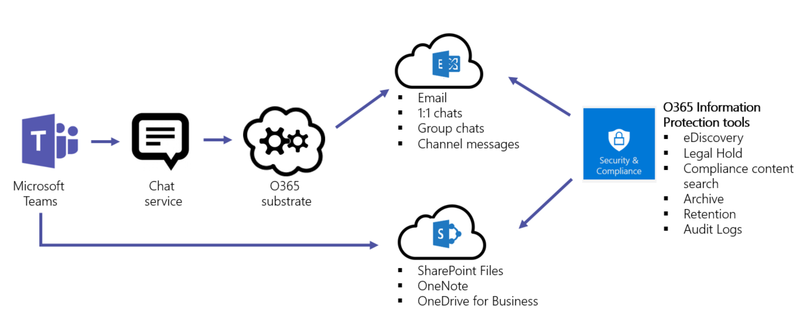

# Seguridad y cumplimiento en Microsoft TeamsSecurity and compliance in Microsoft Teams

> [!IMPORTANT]
> Para obtener información sobre cómo garantizar mejor la seguridad mientras todos trabajan desde casa durante el brote **de COVID-19,** lea estos artículos:To learn how to best ensure **security while everyone's working from home during the COVID-19 outbreak**, read these articles:
>  - [Las 12 tareas principales de los equipos de seguridad para dar soporte al trabajo desde casaTop 12 tasks for security teams to support working from home](/microsoft-365/security/top-security-tasks-for-remote-work)
>  - [Optimizar la conectividad de Microsoft 365 u Office 365 para usuarios remotos que usan túnel dividido de VPNOptimize Microsoft 365 or Office 365 connectivity for remote users using VPN split tunnelling](/Office365/Enterprise/office-365-vpn-split-tunnel)
>  - Actualizado el 2 de abril de 2020: Guía [de seguridad de Teams](teams-security-guide.md)Updated April 2, 2020: [Teams security guide](teams-security-guide.md)

Microsoft Teams se basa en la nube de nivel empresarial y hiperespacio de Microsoft 365 y Office 365, lo que ofrece las capacidades avanzadas de seguridad y cumplimiento que esperan nuestros clientes.Microsoft Teams is built on the Microsoft 365 and Office 365 hyper-scale, enterprise-grade cloud, delivering the advanced security and compliance capabilities our customers expect. Para obtener más información sobre la planificación de la seguridad  en Microsoft 365 u Office 365, el plan de seguridad es un buen lugar para empezar.For more information on planning for security in Microsoft 365 or Office 365, [the security roadmap](/microsoft-365/security/office-365-security/security-roadmap) is a good place to start. Para obtener más información sobre la planificación del cumplimiento en Microsoft 365 u Office 365, puede empezar con Plan de seguridad [& cumplimiento.](/microsoft-365/compliance/plan-for-security-and-compliance)For more information on planning for compliance in Microsoft 365 or Office 365, you can start with [Plan for security & compliance](/microsoft-365/compliance/plan-for-security-and-compliance).

En este artículo se proporcionará más información sobre la seguridad y el cumplimiento específicos de Teams.This article will provide further information about Teams-specific security and compliance. No se pierda estos vídeos de Microsoft Mechanics sobre seguridad y cumplimiento:Don't miss these Microsoft Mechanics videos about security and compliance:

- [Microsoft Teams Essentials para TI: Seguridad y cumplimiento](https://youtu.be/91lHNKVVvQ4) (12:42 min)[Microsoft Teams Essentials for IT: Security and Compliance](https://youtu.be/91lHNKVVvQ4) (12:42 min)
- [Controles de seguridad y cumplimiento de Microsoft Teams](https://www.youtube.com/watch?v=Km4T4hMM__k) (10:54 min)[Microsoft Teams Controls for Security and Compliance](https://www.youtube.com/watch?v=Km4T4hMM__k) (10:54 min)

> [!IMPORTANT]
> Como cliente de Microsoft 365 u Office 365, es el propietario y el control de los datos.As a customer of Microsoft 365 or Office 365, you own and control your data. Microsoft no usa tus datos para nada que no sea proporcionarte el servicio al que te has suscrito.Microsoft does not use your data for anything other than providing you with the service that you have subscribed to. Como proveedor de servicios, no analizamos su correo electrónico, documentos o equipos para publicidad o para fines que no estén relacionados con el servicio.As a service provider, we do not scan your email, documents, or teams for advertising or for purposes that are not service-related. Microsoft no tiene acceso al contenido cargado.Microsoft doesn't have access to uploaded content. Al igual que OneDrive y SharePoint en Microsoft 365, los datos de los clientes permanecen dentro del espacio empresarial.Like OneDrive and SharePoint in Microsoft 365, customer data stays within the tenant. Puede consultar más información sobre nuestra confianza y seguridad en el [Centro de confianza de Microsoft.](https://microsoft.com/trustcenter)You can check out more about our trust and security related information at the [Microsoft Trust Center](https://microsoft.com/trustcenter). Teams sigue las mismas directrices y principios que el Centro de confianza de Microsoft.Teams follows the same guidance and principles as the Microsoft Trust Center.

## SeguridadSecurity

Teams exige la autenticación en dos fases para todo el equipo y para toda la organización, el inicio de sesión único a través de Active Directory y el cifrado de datos en tránsito y en reposo.Teams enforces team-wide and organization-wide two-factor authentication, single sign-on through Active Directory, and encryption of data in transit and at rest. Los archivos se almacenan en SharePoint y se copian con el cifrado de SharePoint.Files are stored in SharePoint and are backed by SharePoint encryption. Las notas se almacenan en OneNote y se copian con el cifrado de OneNote.Notes are stored in OneNote and are backed by OneNote encryption. Los datos de OneNote se almacenan en el sitio de SharePoint de grupo.The OneNote data is stored in the team SharePoint site. La pestaña Wiki también se puede usar para tomar notas y su contenido también se almacena en el sitio de SharePoint de grupo.The Wiki tab can also be used for note taking and its content is also stored within the team SharePoint site.

Lea [Modelos de identidad y autenticación](identify-models-authentication.md) para obtener más información sobre la autenticación y Teams, y Cómo funciona la autenticación moderna le ayudará en particular con la autenticación moderna. Read [Identity models and authentication](identify-models-authentication.md) for more insight into authentication and Teams, and [How modern authentication works](sign-in-teams.md) will help with modern authentication in particular.

Dado que Teams trabaja en asociación con SharePoint, OneNote, Exchange y mucho más, debería estar cómodo administrando la seguridad en Microsoft 365 u Office 365 all-up.Because Teams works in partnership with SharePoint, OneNote, Exchange, and more, you should be comfortable managing security in Microsoft 365 or Office 365 all-up. Para obtener más información, lea cómo configurar su organización de [Microsoft 365 u Office 365 para aumentar la seguridad.](/office365/securitycompliance/tenant-wide-setup-for-increased-security)To learn more, read about [how to configure your Microsoft 365 or Office 365 organization for increased security](/office365/securitycompliance/tenant-wide-setup-for-increased-security).

> [!NOTE]
> Actualmente, [los canales privados](private-channels.md) admiten características de seguridad y cumplimiento limitadas.Currently, [private channels](private-channels.md) supports limited security and compliance features. Próximamente se ofrece soporte técnico para el conjunto completo de características de seguridad y cumplimiento en canales privados.Support for the full set of security and compliance features in private channels is coming soon.

### Protección contra amenazas avanzada (ATP)Advanced Threat Protection (ATP)

Protección contra amenazas avanzada (ATP) está disponible para Microsoft Teams, junto con SharePoint y OneDrive, aplicaciones que se integran con Teams para la administración de contenido.Advanced Threat protection (ATP) is available for Microsoft Teams, along with SharePoint and OneDrive, applications that integrate with Teams for content management. ATP le permite determinar si el contenido de estas aplicaciones es de naturaleza malintencionada y bloquear este contenido del acceso de los usuarios.ATP allows you to determine if content in these applications is malicious in nature, and block this content from user access.

El modo en que se administra el contenido afectado después de la detección está en la configuración que ha seleccionado en Microsoft 365 u Office 365.How the affected content is managed after detection is up to the settings you've selected in Microsoft 365 or Office 365. Le recomendamos que tenga en cuenta todas las aplicaciones cuando se trata de configurar ATP y, para obtener más información, ATP para [SharePoint, OneDrive](/microsoft-365/security/office-365-security/atp-for-spo-odb-and-teams) y Microsoft Teams tendrá información detallada sobre cómo empezar.We strongly recommend you consider all applications when it comes to configuring ATP, and for further reading, [ATP for SharePoint, OneDrive, and Microsoft Teams](/microsoft-365/security/office-365-security/atp-for-spo-odb-and-teams) will have detailed information on how to get started.

### Vínculos segurosSafe Links

Aunque, en este momento, los vínculos seguros de protección contra amenazas  avanzadas (ATP) no están disponibles en Microsoft Teams, ahora están en versión preliminar pública a través de nuestro Programa de adopción de tecnología (TAP) (TAP) y, aunque no se establece una fecha de lanzamiento para disponibilidad general, actualizaremos este artículo cuando llegue esa hora.While, at this time, Advanced Threat Protection (ATP) safe links are not available in Microsoft Teams, they are now in [public preview](/microsoft-365/security/office-365-security/atp-safe-links-for-teams?view=o365-worldwide) through our Technology Adoption Program (TAP), and while a release date for general availability isn't set, we'll update this article when that time arrives. Mientras tanto, para obtener información sobre Vínculos seguros de Microsoft 365 u Office 365, consulte Vínculos seguros [de ATP.](/office365/securitycompliance/atp-safe-links#how-to-get-atp-safe-links-protection)Meanwhile, for information on Microsoft 365 or Office 365 Safe Links, please review [ATP Safe Links](/office365/securitycompliance/atp-safe-links#how-to-get-atp-safe-links-protection). Los vínculos seguros de ATP están disponibles tanto en [el Plan 1 de ATP como en el Plan 2 de ATP.](/microsoft-365/security/office-365-security/office-365-atp?view=o365-worldwide)ATP Safe links is available in both [ATP Plan 1 and ATP Plan 2](/microsoft-365/security/office-365-security/office-365-atp?view=o365-worldwide).

### Datos adjuntos segurosSafe Attachments

Datos adjuntos seguros es una característica diseñada para mejorar la seguridad de los usuarios mediante la comprobación y detección de datos adjuntos malintencionados.Safe attachments is a feature designed to enhance user security by checking for, and detecting, malicious attachments. Los administradores de  seguridad o global crean directivas para administrar estos datos adjuntos malintencionados sospechosos para evitar que se envíen a los usuarios, se haga clic y se actúe sobre ellos.Global- or Security Administrators create [policies](/microsoft-365/security/office-365-security/set-up-atp-safe-attachments-policies?view=o365-worldwide) for handling these suspected malicious attachments to prevent them from being sent to users, clicked, and acted upon. La protección contra datos adjuntos seguros está disponible para SharePoint, OneDrive y Microsoft Teams, y Microsoft 365 u Office 365 [Advanced Threat Protection Plan 1 y 2](/microsoft-365/security/office-365-security/office-365-atp?view=o365-worldwide) tienen esta capacidad.Safe attachment protection is available to SharePoint, OneDrive, and Microsoft Teams, and Microsoft 365 or Office 365 [Advanced Threat Protection Plan 1 and 2](/microsoft-365/security/office-365-security/office-365-atp?view=o365-worldwide) have this capability. Obtenga más información sobre datos adjuntos seguros y cómo pueden ayudar a proteger su organización en Datos adjuntos seguros en [Microsoft Defender para Office 365.](/microsoft-365/security/office-365-security/atp-safe-attachments?view=o365-worldwide)Read more about Safe Attachments and how they can help protect your organization in [Safe Attachments in Microsoft Defender for Office 365](/microsoft-365/security/office-365-security/atp-safe-attachments?view=o365-worldwide).

### Puntuación seguraSecure Score

Puntuación segura de Microsoft es una medida de la posición de seguridad de una organización, con un número más alto que indica que se han realizado más acciones de mejora.Microsoft Secure Score is a measurement of an organization's security posture, with a higher number indicating more improvement actions taken. Se puede encontrar en el centro de [seguridad de Microsoft 365.](https://security.microsoft.com/securescore)It can be found in the [Microsoft 365 security center](https://security.microsoft.com/securescore). Seguir las recomendaciones de puntuación segura puede proteger a su organización de amenazas.Following the Secure Score recommendations can protect your organization from threats. Desde un panel centralizado en el centro de seguridad de Microsoft 365, las organizaciones pueden supervisar y trabajar en la seguridad de sus identidades, aplicaciones y dispositivos de Microsoft 365.From a centralized dashboard in the Microsoft 365 security center, organizations can monitor and work on the security of their Microsoft 365 identities, apps, and devices. Microsoft Teams ahora tiene recomendaciones sobre puntuación segura y se recomienda a los administradores que supervisen su posición de seguridad en la plataforma.Microsoft Teams now has recommendations on Secure Score and administrators are encouraged to monitor their security stance on the platform.

Puntuación segura ayuda a las organizaciones:Secure Score helps organizations:
- Informe sobre el estado actual de la posición de seguridad de la organización.Report on the current state of the organization's security posture.
- Mejore su posición de seguridad proporcionando detectabilidad, visibilidad, guía y control.Improve their security posture by providing discoverability, visibility, guidance, and control.
- Compare con los puntos de referencia y establezca indicadores clave de rendimiento (KPI).Compare with benchmarks and establish key performance indicators (KPIs).

### Cómo funcionan las directivas de acceso condicional para TeamsHow Conditional Access policies work for Teams

Microsoft Teams depende en gran medida de Exchange Online, SharePoint y Skype Empresarial Online para escenarios de productividad principales, como reuniones, calendarios, chats de interoperabilidad y uso compartido de archivos.Microsoft Teams relies heavily on Exchange Online, SharePoint, and Skype for Business Online for core productivity scenarios, like meetings, calendars, interop chats, and file sharing. Las directivas de acceso condicional que se establecen para estas aplicaciones en la nube se aplican a Microsoft Teams cuando un usuario inicia sesión directamente en Microsoft Teams, en cualquier cliente.Conditional access policies that are set for these cloud apps apply to Microsoft Teams when a user directly signs in to Microsoft Teams - on any client.

Microsoft Teams se admite por separado como una aplicación en la nube en las directivas de acceso condicional de Azure Active Directory.Microsoft Teams is supported separately as a cloud app in Azure Active Directory conditional access policies. Las directivas de acceso condicional que se establecen para la aplicación en la nube de Microsoft Teams se aplican a Microsoft Teams cuando un usuario inicia sesión.Conditional access policies that are set for the Microsoft Teams cloud app apply to Microsoft Teams when a user signs in. Sin embargo, sin las directivas correctas en otras aplicaciones como Exchange Online y SharePoint, es posible que los usuarios puedan acceder a esos recursos directamente.However, without the correct policies on other apps like Exchange Online and SharePoint, users may still be able to access those resources directly. Para obtener más información sobre cómo configurar una directiva de acceso condicional en Azure Portal, vea Inicio rápido [de Azure Active Directory.](/azure/active-directory/active-directory-conditional-access-azure-portal-get-started)For more information about setting up a conditional access policy in the Azure portal, see [Azure Active Directory Quickstart](/azure/active-directory/active-directory-conditional-access-azure-portal-get-started).

Los clientes de escritorio de Microsoft Teams para Windows y Mac admiten la autenticación moderna.Microsoft Teams desktop clients for Windows and Mac support modern authentication. La autenticación moderna proporciona el inicio de sesión basado en la Biblioteca de autenticación de Azure Active Directory (ADAL) para Microsoft Office aplicaciones cliente en distintas plataformas.Modern authentication brings sign-in based on the Azure Active Directory Authentication Library (ADAL) to Microsoft Office client applications across platforms.

La aplicación de escritorio de Microsoft Teams admite AppLocker.Microsoft Teams desktop application supports AppLocker.  Para obtener más información sobre los requisitos previos de AppLocker, vea: Requisitos para usar [AppLocker.](/windows/security/threat-protection/windows-defender-application-control/applocker/requirements-to-use-applocker)For more information about AppLocker prerequisites, please see: Requirements to use [AppLocker](/windows/security/threat-protection/windows-defender-application-control/applocker/requirements-to-use-applocker).

## CumplimientoCompliance

Teams tiene una amplia gama de información para ayudarle con las áreas de cumplimiento, incluido el cumplimiento de comunicaciones para canales, chats y datos adjuntos, directivas de retención, protección contra pérdida de datos (DLP), exhibición de documentos electrónicos y retención legal para canales, chats y archivos, búsqueda de registros de auditoría, así como administración de aplicaciones móviles con Microsoft Intune.Teams has a wide range of information to help you with compliance areas, including communication compliance for channels, chats, and attachments, retention policies, Data Loss Protection (DLP), eDiscovery and legal hold for channels, chats and files, audit log search, as well as mobile application management with Microsoft Intune. Hemos proporcionado información sobre todos estos temas a continuación y puede ir al Centro de cumplimiento de [Microsoft 365](https://compliance.microsoft.com) para administrar esta configuración.We've provided some information on all these topics below, and you can go to the [Microsoft 365 compliance center](https://compliance.microsoft.com) to manage these settings.

### Barreras de informaciónInformation Barriers

Las barreras de información son directivas establecidas por los administradores de Teams para evitar que personas o grupos se comuniquen entre sí (cuando no hay necesidad empresarial para que lo hagan, o un motivo normativo para impedir que lo hagan), y también le permite establecer directivas relacionadas con cosas como búsquedas y exhibición de documentos electrónicos (que se tratan a continuación).Information barriers are policies put in-place by Teams administrators to do things like keep people or groups from communicating with one another (when there is no business need for them to do so, or a regulatory reason to block them from doing so), and it also allows you to set policies relating to things like lookups and eDiscovery (covered below). Estas directivas pueden afectar a los usuarios en chats 1:1, chats grupales o a nivel de equipo.These policies can impact users in 1:1 chats, group chats, or at a team-level. La característica Barrera de información está disponible en la nube pública y a partir de enero de 2021 se ha lanzado a la nube de GCC.The Information Barrier feature is available in the public cloud and starting January 2021 it has been rolled out to the GCC cloud.

Para obtener más información sobre este tema, vaya a [Barreras de información en Microsoft Teams.](information-barriers-in-teams.md)For further reading on this topic, go to [Information barriers in Microsoft Teams](information-barriers-in-teams.md).

### Cumplimiento de las comunicacionesCommunication compliance

El cumplimiento de las comunicaciones en Microsoft 365 le permite agregar usuarios a directivas dentro del ámbito que se pueden configurar para examinar las comunicaciones de Microsoft Teams en busca de lenguaje ofensivo, información confidencial e información relacionada con estándares internos y normativos.Communication compliance in Microsoft 365 allows you to add users to in-scope policies that can be configured to examine Microsoft Teams communications for offensive language, sensitive information, and information related to internal and regulatory standards. Las comunicaciones de chat y los datos adjuntos asociados en canales de Teams públicos y privados, chats individuales y datos adjuntos se pueden analizar para ayudar a minimizar los riesgos de comunicación en su organización.Chat communications and associated attachments in both public and private Teams channels, individual chats, and attachments can be scanned to help minimize communication risks in your organization. Para obtener más información sobre cómo puede configurar directivas para ayudarle a detectar, capturar y tomar medidas para comunicaciones inapropiadas de Teams, vea Cumplimiento de comunicaciones [en Microsoft 365.](/microsoft-365/compliance/communication-compliance)For more information on how you can configure policies to help you detect, capture, and take action for inappropriate Teams communications, see [Communication compliance in Microsoft 365](/microsoft-365/compliance/communication-compliance).

### Directivas de retenciónRetention policies

Las directivas de retención de Microsoft Teams le permiten conservar datos que son importantes para su organización, por motivos normativos, legales, empresariales u otros, y también para quitar contenido y comunicaciones que no son relevantes para conservarse.Retention policies in Microsoft Teams allows you to both retain data that's important for your organization to keep, for regulatory, legal, business, or other reasons, and also to remove content and communications that are not relevant to be retained. También puede usar directivas de retención para conservar los datos durante un período de tiempo y, después, eliminarlos.You can also use retention policies to keep data for a period of time and then delete it. Para obtener más información, consulte [Directivas de retención en Microsoft Teams.](retention-policies.md)For further information, review [Retention policies in Microsoft Teams](retention-policies.md).

## Etiquetas de confidencialidadSensitivity labels

Aplique [etiquetas de confidencialidad](/microsoft-365/compliance/sensitivity-labels) para proteger y regular el acceso al contenido organizativo confidencial creado durante la colaboración en equipos.Apply [sensitivity labels](/microsoft-365/compliance/sensitivity-labels) to protect and regulate access to sensitive organizational content created during collaboration within teams. Por ejemplo, aplique etiquetas que configuren la privacidad (pública o privada) de los equipos, controle el acceso de invitado y el uso compartido externo y administre el acceso desde dispositivos no administrados.For example, apply labels that configure the privacy (public or private) of teams, control guest access and external sharing, and manage access from unmanaged devices. Para obtener más información, revise [Etiquetas de confidencialidad en Microsoft Teams.](sensitivity-labels.md)For further information, review [Sensitivity labels in Microsoft Teams](sensitivity-labels.md).

### Prevención de pérdida de datos (DLP)Data Loss Prevention (DLP)

La prevención de pérdida de datos (DLP) en Microsoft Teams, así como la historia DLP más grande para Microsoft 365 u Office 365, gira en torno a la preparación empresarial a la hora de proteger documentos y datos confidenciales.Data Loss Prevention (DLP) in Microsoft Teams, as well as the larger DLP story for Microsoft 365 or Office 365, revolves around business readiness when it comes to protecting sensitive documents and data. Tanto si tiene dudas sobre la información confidencial en mensajes o documentos, las directivas DLP podrán ayudar a garantizar que los usuarios no compartan estos datos confidenciales con las personas equivocadas.Whether you have concerns around sensitive information in messages or documents, DLP policies will be able to help ensure your users don't share this sensitive data with the wrong people.

Para obtener información sobre prevención de pérdida de datos en Teams, consulte [DLP para Microsoft Teams.](/microsoft-365/compliance/dlp-microsoft-teams)For information on Data Loss Prevention in Teams, please review [DLP for Microsoft Teams](/microsoft-365/compliance/dlp-microsoft-teams). Un buen artículo para las preocupaciones de DLP de O365 es Información general sobre la prevención [de pérdida de datos.](/microsoft-365/compliance/data-loss-prevention-policies)A good article for O365 DLP concerns is [Overview of data loss prevention](/microsoft-365/compliance/data-loss-prevention-policies).

### eDiscoveryeDiscovery

La detección electrónica o exhibición de documentos electrónicos es el aspecto electrónico de identificar, recopilar y producir información almacenada electrónicamente (ESI) en respuesta a una solicitud de producción en un procedimiento legal o una investigación.Electronic discovery, or eDiscovery, is the electronic aspect of identifying, collecting and producing electronically stored information (ESI) in response to a request for production in a law suit or investigation. Las capacidades incluyen la administración de casos, la conservación, la búsqueda, el análisis y la exportación de datos de Teams.Capabilities include case management, preservation, search, analysis, and export of Teams data. Esto incluye chat, mensajería y archivos, resúmenes de reuniones y llamadas.This includes chat, messaging and files, meeting and call summaries. Para las reuniones y llamadas de Teams, se crea un resumen de los eventos ocurridos en la reunión y la llamada y se hace disponible en eDiscovery.For Teams meetings and Calls, a summary of the events that happened in the meeting and call are created and made available in eDiscovery.

Para obtener más información sobre cómo realizar exhibición de documentos electrónicos de Microsoft 365 u Office 365 en el centro de seguridad y el centro de cumplimiento y ejecutar la búsqueda de contenido de cumplimiento para el contenido de Teams, vaya a los vínculos siguientes:For more details about how to do Microsoft 365 or Office 365 eDiscovery in the security center and compliance center and run compliance content search for Teams content, please go to the links below:

 - [eDiscoveryeDiscovery](/microsoft-365/compliance/manage-legal-investigations)

 - [Búsqueda de contenidoContent Search](/microsoft-365/compliance/search-for-content)

Tenemos un artículo específico de Teams para obtener más información, [eDiscovery de](eDiscovery-investigation.md)chats de invitado a invitado.We have a Teams-specific article for more information, [eDiscovery of guest-to-guest chats](eDiscovery-investigation.md).

Los clientes pueden aprovechar eDiscovery o [eDiscovery avanzado según](/microsoft-365/compliance/office-365-advanced-ediscovery) sus requisitos.Customers can leverage eDiscovery or [Advanced eDiscovery](/microsoft-365/compliance/office-365-advanced-ediscovery) per their requirements. La siguiente tabla muestra las diferencias entre estos dos métodos:The following table outlines the differences between the two:

| |eDiscoveryeDiscovery  |eDiscovery avanzadoAdvanced eDiscovery  |
|---------|---------|---------|
|Administración de casosCase Management     |XX        |XX         |
|Control de accesoAccess Control  |XX         |XX         |
|Búsquedas de contenidoContent Searches     |XX         | XX        |
|SuspensionesHold(s)   |XX         | XX        |
|ExportaciónExport     |XX         |XX         |
|Detección de duplicadosDuplication Detection     |-         |XX         |
|Búsquedas por relevancia con aprendizaje automáticoRelevance Searches with Machine Learning    |-         |XX         |
|Análisis de datos estructuradosUnstructured Data Analysis      |-         |XX         |

### Suspensión legalLegal Hold

Durante el litigio, es posible que necesite que todos los datos asociados con un usuario (custodio) o un equipo se conserven como inmutables, de modo que se puedan usar como evidencia para el caso.During litigation, you may need all data associated with a user (custodian) or a Team to be preserved as immutable, so that it can be used as evidence for the case. Para ello, coloque a un usuario (buzón de usuario) o a un equipo en retención legal.You can do this by placing either a user (user mailbox) or a Team on legal hold. Para una retención legal del equipo, el buzón del equipo se puede colocar en las siguientes retenciones:For a team legal hold, the team's mailbox can be put on the following holds:

- In-Place (un subconjunto del buzón o la colección de sitios a través de consultas dirigidas o el contenido filtrado se pone en espera) oIn-Place Hold (a subset of the mailbox or site collection through targeted queries or filtered content is put on hold), or
- Retención por juicio (todo el buzón o la colección de sitios está en espera).Litigation Hold (the entire mailbox or site collection is placed on hold).

En cualquier caso, una vez establecida la retención, se asegura de que, incluso si los usuarios finales eliminan o editan mensajes de canal que están en el buzón de grupo, las copias inmutables de ese contenido se mantienen y están disponibles mediante la búsqueda de exhibición de documentos electrónicos.In either case, once the hold is set it ensures that, even if end users delete or edit channel messages that are in the group mailbox, immutable copies of that content are maintained and available through eDiscovery search. Las retenciones legales se aplican generalmente en el contexto de un caso de exhibición de documentos electrónicos.Legal holds are generally applied within the context of an eDiscovery case.

Vea Información [general sobre las directivas de retención](/microsoft-365/compliance/retention-policies) para obtener más información sobre conservación y retenciones en el centro de cumplimiento de Microsoft 365.Please see [Overview of retention policies](/microsoft-365/compliance/retention-policies) to understand more about preservation and holds in the Microsoft 365 compliance center. Para obtener más información específica de Teams sobre la retención legal, también tenemos un usuario o equipo de [Microsoft Teams](legal-hold.md) en retención legal para que obtenga más información.For more Teams-specific information on legal hold, we also have [Place a Microsoft Teams user or team on legal hold](legal-hold.md) for you to learn more.

### Búsqueda de contenido de cumplimientoCompliance Content Search

La búsqueda de contenido se puede usar para buscar todos los datos de Teams mediante funciones de filtrado enriquecido.Content search can be used to search for all Teams data through rich filtering capabilities. Los datos resultantes se pueden exportar a un contenedor específico para soporte técnico de cumplimiento y litigios.The resulting data can be exported to a specific container for compliance and litigation support. Esto se puede hacer con o sin un caso de exhibición de documentos electrónicos.This can be done with or without an eDiscovery case. Esto permite a los administradores de cumplimiento recopilar datos de Teams entre todos los usuarios, revisarlos y exportarlos para su procesamiento posterior.This enables compliance admins to gather Teams data across all users, review and export it for further processing. Consulte Búsqueda  de contenido para obtener más información sobre cómo realizar una búsqueda de contenido de cumplimiento para Microsoft Teams y otros contenidos de Microsoft 365 u Office 365 en el Centro de cumplimiento de Microsoft 365.Please refer to [Content Search](/microsoft-365/compliance/content-search) to learn more about how to conduct a compliance content search for Microsoft Teams and other Microsoft 365 or Office 365 content in the Microsoft 365 compliance center.

> [!TIP]
> Con la búsqueda de contenido, puede filtrar solo a contenido de Microsoft Teams, como Chat y mensajes de canal, reuniones y llamadas, si es necesario.Using content search, you can filter down to Microsoft Teams only content, such as Chat and Channel Messages, Meetings, and Calls, if necessary.

Si desea obtener más información específica de Teams sobre cómo configurar la búsqueda de contenido, revise [Búsqueda de contenido en Microsoft Teams.](content-search.md)If you'd like further Teams-specific information on configuring content search, review [Content search in Microsoft Teams](content-search.md).

### Auditoría y generación de informesAuditing and Reporting

La búsqueda de registros de auditoría se conecta directamente al centro de cumplimiento de Microsoft 365 y le ofrece la capacidad de establecer alertas, así como de informar sobre eventos de auditoría, al permitir la exportación de conjuntos de eventos específicos o genéricos de carga de trabajo para el uso de administradores y la investigación en una escala de tiempo de auditoría ilimitada.Audit log search plugs right into the Microsoft 365 compliance center and gives you the ability to set alerts, as well as report on audit events, by allowing the export of workload specific or generic event sets for admin use and investigation across an unlimited auditing timeline. Puede configurar alertas para todos los datos de registro de auditoría en el centro de cumplimiento de Microsoft 365, así como filtrar y exportar estos datos para realizar un análisis más exhaustivo.You can set up alerts for all audit Log data within the Microsoft 365 compliance center, and filter and export this data for further analysis. Consulte Buscar en [el registro](/microsoft-365/compliance/search-the-audit-log-in-security-and-compliance) de auditoría para obtener más información sobre cómo realizar una búsqueda de registro de auditoría para Microsoft 365 u Office 365.Please refer to [Search the audit log](/microsoft-365/compliance/search-the-audit-log-in-security-and-compliance) to learn more about how to conduct an Audit log search for Microsoft 365 or Office 365. Para obtener más información sobre cómo buscar eventos de Microsoft Teams en el centro de cumplimiento de Microsoft 365, también tenemos activar la auditoría en [Teams](audit-log-events.md) para que la revise.To learn more about searching for Microsoft Teams events in the Microsoft 365 compliance center, we also have [Turn on auditing in Teams](audit-log-events.md) for you to review.

## Clave de clienteCustomer Key

Microsoft 365 ofrece una capa adicional de cifrado sobre el cifrado de servicio para su contenido.Microsoft 365 offers an additional layer of encryption on top of service encryption for your content. Con las claves que proporcione, clave de cliente cifra varios tipos diferentes de datos en Microsoft Teams.Using keys you provide, Customer Key encrypts several different types of data in Microsoft Teams. Con la clave de cliente en el nivel de aplicación, clave de cliente cifra los archivos de Teams almacenados en SharePoint Online.Using Customer Key at the application level, Customer Key encrypts Teams files stored in SharePoint Online. Para obtener información, vea [Cifrado de servicio con clave de cliente.](/microsoft-365/compliance/customer-key-overview)For information, see [Service encryption with Customer Key](/microsoft-365/compliance/customer-key-overview). 

Con la clave de cliente en el nivel de inquilino, clave de cliente cifra:Using Customer Key at the tenant level, Customer Key encrypts:
- Mensajes de chat de Teams (chats de 1:1, chats grupales, chats de reunión y conversaciones de canal)Teams chat messages (1:1 chats, group chats, meeting chats, and channel conversations)
- Mensajes multimedia de Teams (imágenes, fragmentos de código, vídeos e imágenes wiki)Teams media messages (images, code snippets, videos, and wiki images)
- Grabaciones de llamadas y reuniones de Teams almacenadas en el almacenamiento de TeamsTeams call and meeting recordings stored in Teams storage
- Notificaciones de chat de TeamsTeams chat notifications
- Sugerencias de chat de Teams de CortanaTeams chat suggestions by Cortana
- Mensajes de estado de Teams Para obtener más información, vea Información general sobre la clave de cliente de [Microsoft 365](/microsoft-365/compliance/customer-key-tenant-level) en el nivel de inquilino y lea el blog de Microsoft Teams que trata el soporte de clave de cliente para Microsoft Teams ahora en versión preliminar [pública.](https://techcommunity.microsoft.com/t5/microsoft-teams-blog/customer-key-support-for-microsoft-teams-now-in-public-preview/ba-p/1999893)Teams status messages For more information, see [Overview of Customer Key for Microsoft 365 at the tenant level](/microsoft-365/compliance/customer-key-tenant-level) and read the Microsoft Teams blog that covers [Customer Key support for Microsoft Teams now in Public Preview](https://techcommunity.microsoft.com/t5/microsoft-teams-blog/customer-key-support-for-microsoft-teams-now-in-public-preview/ba-p/1999893). Para obtener información sobre la versión de Microsoft Information Protection que incluía clave de cliente en el nivel de inquilino, lea Anunciar nuevas capacidades de Protección de información de Microsoft para conocer y proteger [sus datos confidenciales.](https://techcommunity.microsoft.com/t5/microsoft-security-and/announcing-new-microsoft-information-protection-capabilities-to/ba-p/1999692)For information about the Microsoft Information Protection release that included Customer Key at the tenant level, read [Announcing new Microsoft Information Protection capabilities to know and protect your sensitive data](https://techcommunity.microsoft.com/t5/microsoft-security-and/announcing-new-microsoft-information-protection-capabilities-to/ba-p/1999692).

## PrivacidadPrivacy

En Microsoft, proteger los datos es nuestra prioridad más alta.At Microsoft, protecting your data is our highest priority. Para obtener información sobre nuestras prácticas de privacidad, lea:To learn about our privacy practices, read:  

- [Privacidad en MicrosoftPrivacy at Microsoft](https://www.microsoft.com/trust-center/privacy)
- [Nuestro compromiso con la privacidad y la seguridad en Microsoft TeamsOur commitment to privacy and security in Microsoft Teams](https://www.microsoft.com/en-us/microsoft-365/blog/2020/04/06/microsofts-commitment-privacy-security-microsoft-teams/)
- [Para profesionales de TI: Privacidad y seguridad en Microsoft TeamsFor IT professionals: Privacy and security in Microsoft Teams](https://www.microsoft.com/en-us/microsoft-365/blog/2020/04/06/it-professionals-privacy-security-microsoft-teams/#:~:text=We%20safeguard%20your%20privacy%20by,and%20distribution%20of%20your%20data.)

## Arquitectura de protección de la informaciónInformation Protection Architecture

En la siguiente ilustración se indica el flujo de ingestión de datos de Teams a los archivos y mensajes de Exchange y SharePoint para Teams.The following figure indicates the ingestion flow of Teams data to both Exchange and SharePoint for Teams Files and Messages.

> [!div class="mx-imgBorder"]
> 

La siguiente ilustración indica el flujo de ingestión de reuniones de Teams y datos de llamadas a Exchange.The following figure indicates the ingestion flow of Teams Meetings and calling data to Exchange.

> [!div class="mx-imgBorder"]
> 

> [!IMPORTANT]
> Puede haber hasta un retraso de 24 horas para descubrir el contenido de Teams.There can be up to a 24-hour delay to discover Teams content.

## LicenciasLicensing

En lo que respecta a las capacidades de protección de la información, las suscripciones de Microsoft 365, las suscripciones de Office 365 y las licencias independientes asociadas determinarán el conjunto de características disponibles.When it comes to information protection capabilities, Microsoft 365 subscriptions, Office 365 subscriptions, and the associated standalone licenses will determine the available feature set.

Para obtener información sobre cómo determinar las necesidades de  licencias para implementar características de seguridad y cumplimiento, revise los requisitos de licencia para las características de seguridad y cumplimiento.For information on determining the licensing needs to implement features for security and compliance, please review the [licensing requirements](/office365/servicedescriptions/microsoft-365-service-descriptions/microsoft-365-tenantlevel-services-licensing-guidance/microsoft-365-security-compliance-licensing-guidance) for security and compliance features.

> [!NOTE]
> La búsqueda de contenido y la exhibición de documentos electrónicos no tienen por qué estar habilitadas en el Centro de & cumplimiento para funcionar.Content Search and eDiscovery do not need to be enabled in the Security & Compliance Center to work.

## Ubicación de los datos en TeamsLocation of data in Teams

Los datos de Teams residen en la región geográfica asociada con su organización de Microsoft 365 u Office 365.Data in Teams resides in the geographic region associated with your Microsoft 365 or Office 365 organization. Para ver qué regiones son compatibles actualmente, revise [Ubicación de los datos en Microsoft Teams.](location-of-data-in-teams.md)To see what regions are supported currently, please review [Location of data in Microsoft Teams](location-of-data-in-teams.md).

Si necesita ver qué región aloja los datos de su inquilino, vaya al perfil de Organización de configuración del Centro de administración de [Microsoft 365.](https://portal.office.com/adminportal/home)  >    >  If you need to see which region houses data for your tenant, go to the [Microsoft 365 admin center](https://portal.office.com/adminportal/home) > **Settings** > **Organization profile**. Desplácese hacia abajo hasta **Ubicación de datos**.Scroll down to **Data location**.

> [!div class="mx-imgBorder"]
> 

## Estándares de cumplimientoCompliance standards

Teams usa los siguientes estándares: [ISO 27001](/microsoft-365/compliance/offering-iso-27001), [ISO 27018,](/microsoft-365/compliance/offering-iso-27018) [SSAE18 SOC 1 y SOC 2,](/microsoft-365/compliance/offering-soc) [HIPAA](/microsoft-365/compliance/offering-hipaa-hitech)y Cláusulas modelo de la UE [(EUMC).](/microsoft-365/compliance/offering-eu-model-clauses)Teams uses the following standards: [ISO 27001](/microsoft-365/compliance/offering-iso-27001), [ISO 27018](/microsoft-365/compliance/offering-iso-27018), [SSAE18 SOC 1 and SOC 2](/microsoft-365/compliance/offering-soc), [HIPAA](/microsoft-365/compliance/offering-hipaa-hitech), and [EU Model Clauses (EUMC)](/microsoft-365/compliance/offering-eu-model-clauses). Dentro del marco de cumplimiento de Microsoft, Microsoft clasifica las aplicaciones y servicios de Microsoft 365 y Office 365 en cuatro categorías.Within the Microsoft compliance framework, Microsoft classifies Microsoft 365 and Office 365 applications and services into four categories. Cada categoría se define por compromisos de cumplimiento específicos que deben cumplirse para que un servicio de Microsoft 365 u Office 365, o un servicio de Microsoft relacionado, aparezca en esa categoría.Each category is defined by specific compliance commitments that must be met for a Microsoft 365 or Office 365 service, or a related Microsoft service, to be listed in that category.

Los detalles se pueden encontrar en los [Recursos de protección de datos.](https://servicetrust.microsoft.com/ViewPage/TrustDocumentsV3?command=Download&downloadType=Document&downloadId=b7d05b86-c69b-41ba-8245-21161b9febf9&tab=7f51cb60-3d6c-11e9-b2af-7bb9f5d2d913&docTab=7f51cb60-3d6c-11e9-b2af-7bb9f5d2d913_Compliance_Guides)Details can be found in the [Data Protection Resources](https://servicetrust.microsoft.com/ViewPage/TrustDocumentsV3?command=Download&downloadType=Document&downloadId=b7d05b86-c69b-41ba-8245-21161b9febf9&tab=7f51cb60-3d6c-11e9-b2af-7bb9f5d2d913&docTab=7f51cb60-3d6c-11e9-b2af-7bb9f5d2d913_Compliance_Guides). Teams también admite el cumplimiento de Cloud Security Alliance.Teams also supports Cloud Security Alliance compliance.

## Temas relacionadosRelated topics

[Seguridad de Microsoft 365Microsoft 365 Security](/microsoft-365/security/)

[Cumplimiento de Microsoft 365Microsoft 365 Compliance](/microsoft-365/compliance/)

[Ofertas de cumplimiento de MicrosoftMicrosoft compliance offerings](/microsoft-365/compliance/offering-home)