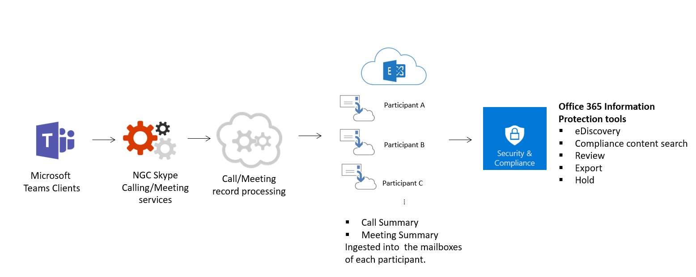

# Seguridad y cumplimiento en Microsoft Teams

> [!IMPORTANT]
> Para obtener información sobre cómo garantizar mejor la seguridad mientras todos trabajan desde casa durante el brote **COVID-19,** lea estos artículos:
>  - [Las 12 tareas principales de los equipos de seguridad para dar soporte al trabajo desde casa](https://docs.microsoft.com/microsoft-365/security/top-security-tasks-for-remote-work)
>  - [Optimizar la conectividad de Microsoft 365 u Office 365 para usuarios remotos que usan túnel dividido de VPN](https://docs.microsoft.com/Office365/Enterprise/office-365-vpn-split-tunnel)
>  - Actualización: 2 de abril de 2020: Guía [de seguridad de Teams](teams-security-guide.md)

Microsoft Teams se ha creado en la nube de nivel empresarial y a gran escala de Microsoft 365 y Office 365, lo que ofrece las capacidades avanzadas de seguridad y cumplimiento que esperan nuestros clientes. Para obtener más información sobre la planeación de la seguridad  en Microsoft 365 u Office 365, el mapa de ruta de seguridad es un buen punto de inicio. Para obtener más información sobre la planeación del cumplimiento en Microsoft 365 u Office 365, puede empezar con Plan para la seguridad [y & cumplimiento.](https://docs.microsoft.com/microsoft-365/compliance/plan-for-security-and-compliance)

Este artículo le proporcionará más información sobre la seguridad y el cumplimiento específicos de Teams. No se pierda estos vídeos de Microsoft Mechanics sobre seguridad y cumplimiento:

- [Microsoft Teams Essentials para TI: Seguridad y cumplimiento](https://youtu.be/91lHNKVVvQ4) (12:42 min)
- [Controles de seguridad y cumplimiento de Microsoft Teams](https://www.youtube.com/watch?v=Km4T4hMM__k) (10:54 min)

> [!IMPORTANT]
> Como cliente de Microsoft 365 u Office 365, usted es propietario de sus datos y los controla. Microsoft no usa sus datos con ningún otro tipo de servicio que no sea proporcionarle el servicio al que se suscribió. Como proveedor de servicios, no escaneamos su correo electrónico, documentos o equipos con fines publicitarios o no relacionados con el servicio. Microsoft no tiene acceso al contenido cargado. Al igual que OneDrive y SharePoint en Microsoft 365, los datos de los clientes permanecen dentro del espacio empresarial. Puede consultar más información sobre nuestra confianza y la información relacionada con la seguridad en el [Centro de confianza de Microsoft.](https://microsoft.com/trustcenter) Teams sigue las mismas instrucciones y principios que el Centro de confianza de Microsoft.

## Seguridad

Teams aplica la autenticación en dos fases para todo el equipo y la organización, el inicio de sesión único a través de Active Directory y el cifrado de datos en tránsito y en reposo. Los archivos se almacenan en SharePoint y se copian con el cifrado de SharePoint. Las notas se almacenan en OneNote y se copian con el cifrado de OneNote. Los datos de OneNote se almacenan en el sitio de SharePoint del grupo. La pestaña Wiki también se puede usar para tomar notas y su contenido también se almacena en el sitio de SharePoint del equipo.

Lea [los modelos de identidad y la](identify-models-authentication.md)  autenticación para obtener más información sobre la autenticación y Teams, y el funcionamiento de la autenticación moderna ayudará en particular con la autenticación moderna.

Como Teams funciona en asociación con SharePoint, OneNote, Exchange y mucho más, debería estar cómodo administrando la seguridad de todo en Microsoft 365 u Office 365. Para obtener más información, obtenga información sobre cómo configurar su organización de [Microsoft 365 u Office 365 para aumentar la seguridad.](https://docs.microsoft.com/office365/securitycompliance/tenant-wide-setup-for-increased-security)

> [!NOTE]
> Actualmente, los [canales privados](private-channels.md) admiten características limitadas de seguridad y cumplimiento. Muy pronto se admitirá el conjunto completo de características de seguridad y cumplimiento de los canales privados.

### Protección contra amenazas avanzada (ATP)

La Protección contra amenazas avanzada (ATP) está disponible para Microsoft Teams, junto con SharePoint y OneDrive, aplicaciones que se integran con Teams para la administración de contenido. ATP le permite determinar si el contenido de estas aplicaciones es malintencionado y bloquear este contenido para que el usuario acceda a ellos.

La forma en que se administra el contenido afectado después de la detección es hasta la configuración que haya seleccionado en Microsoft 365 u Office 365. Le recomendamos encarecidamente que tenga en cuenta todas las aplicaciones a la hora de configurar ATP, y para leerla más detalladamente, ATP para [SharePoint, OneDrive](https://docs.microsoft.com/microsoft-365/security/office-365-security/atp-for-spo-odb-and-teams) y Microsoft Teams contendrán información detallada sobre cómo empezar.

### Vínculos seguros

Aunque, en este momento, los vínculos seguros de protección contra amenazas  avanzada (ATP) no están disponibles en Microsoft Teams, ahora están en versión preliminar pública a través de nuestro servicio Programa de adopción de tecnología (TAP) (TAP) y, aunque no se ha establecido una fecha de lanzamiento para la disponibilidad general, actualizaremos este artículo cuando llegue la hora. Mientras tanto, para obtener información sobre vínculos seguros de Microsoft 365 u Office 365, revise los [vínculos seguros de ATP.](https://docs.microsoft.com/office365/securitycompliance/atp-safe-links#how-to-get-atp-safe-links-protection) Los vínculos seguros de ATP están disponibles tanto en [el Plan 1 de ATP como en el Plan 2 de ATP.](https://docs.microsoft.com/microsoft-365/security/office-365-security/office-365-atp?view=o365-worldwide)

### Datos adjuntos seguros

Datos adjuntos seguros es una característica diseñada para mejorar la seguridad del usuario al buscar y detectar datos adjuntos malintencionados. Los administradores globales  o de seguridad crean directivas para tratar estos posibles datos adjuntos malintencionados con el fin de evitar que se envíen a los usuarios, se haga clic y se a actuar sobre ellos. Protección segura de datos adjuntos está disponible para SharePoint, OneDrive y Microsoft Teams, y Microsoft 365 u Office 365 plan de protección contra amenazas avanzada 1 y [2](https://docs.microsoft.com/microsoft-365/security/office-365-security/office-365-atp?view=o365-worldwide) tienen esta capacidad. Obtenga más información sobre datos adjuntos seguros y cómo pueden ayudar a proteger su organización en Datos adjuntos seguros [en Microsoft Defender para Office 365.](https://docs.microsoft.com/microsoft-365/security/office-365-security/atp-safe-attachments?view=o365-worldwide)

### Puntuación segura

La Puntuación segura de Microsoft es una medición de la posición de seguridad de una organización, con un número más elevado que indica que se han realizado más acciones de mejora. Puede encontrarse en el centro de seguridad de [Microsoft 365.](https://security.microsoft.com/securescore) Si sigue las recomendaciones de Puntuación segura, su organización no podrá protegerse de las amenazas. Desde un panel centralizado en el centro de seguridad de Microsoft 365, las organizaciones pueden supervisar y trabajar en la seguridad de sus identidades, aplicaciones y dispositivos de Microsoft 365. Microsoft Teams tiene ahora recomendaciones sobre Puntuación segura y se recomienda a los administradores que supervisen su seguridad en la plataforma.

Puntuación segura ayuda a las organizaciones a:
- Informe sobre el estado actual de la posición de seguridad de la organización.
- Mejore su posición de seguridad proporcionando detectabilidad, visibilidad, orientación y control.
- Compare con bancos de pruebas y establezca indicadores clave de rendimiento (KPI).

### Cómo funcionan las directivas de acceso condicional en Teams

Microsoft Teams depende en gran medida de Exchange Online, SharePoint y Skype Empresarial Online para los escenarios de productividad principales, como reuniones, calendarios, chats interoperabilidad y uso compartido de archivos. Las directivas de acceso condicional que se establecen para estas aplicaciones en la nube se aplican a Microsoft Teams cuando un usuario inicia sesión directamente en Microsoft Teams en cualquier cliente.

Microsoft Teams se admite por separado como aplicación en la nube en las directivas de acceso condicional de Azure Active Directory. Las directivas de acceso condicional que se establecen para la aplicación en la nube de Microsoft Teams se aplican a Microsoft Teams cuando un usuario inicia sesión. Sin embargo, sin las directivas correctas en otras aplicaciones como Exchange Online y SharePoint, es posible que los usuarios puedan obtener acceso a esos recursos directamente. Para obtener más información sobre cómo configurar una directiva de acceso condicional en Azure Portal, consulte [Inicio rápido de Azure Active Directory.](https://docs.microsoft.com/azure/active-directory/active-directory-conditional-access-azure-portal-get-started)

Los clientes de escritorio de Microsoft Teams para Windows y Mac admiten la autenticación moderna. La autenticación moderna ofrece inicio de sesión basado en la Biblioteca de autenticación de Azure Active Directory (ADAL) para Microsoft Office cliente en todas las plataformas.

La aplicación de escritorio de Microsoft Teams es compatible con AppLocker.  Para obtener más información sobre los requisitos previos de AppLocker, consulta: Requisitos para usar [AppLocker.](https://docs.microsoft.com/windows/security/threat-protection/windows-defender-application-control/applocker/requirements-to-use-applocker)

## Cumplimiento

Teams tiene una amplia variedad de información para ayudarle con las áreas de cumplimiento, como el cumplimiento de comunicaciones para canales, chats y datos adjuntos, directivas de retención, Protección de pérdida de datos (DLP), exhibición de documentos electrónicos y retención legal para canales, chats y archivos, búsqueda de registros de auditoría, así como la administración de aplicaciones móviles con Microsoft Intune. A continuación proporcionamos información sobre todos estos temas y puede ir al Centro de cumplimiento de [Microsoft 365](https://compliance.microsoft.com) para administrar esta configuración.

### Barreras de información

Las barreras de información son directivas puestas en marcha por los administradores de Teams para hacer cosas como impedir que las personas o grupos se comuniquen entre sí (cuando no hay necesidad empresarial para hacerlo, o un motivo reglamentario para impedirles hacerlo) y también le permite establecer directivas relacionadas con aspectos como búsquedas y exhibición de documentos electrónicos (cubiertos a continuación). Estas directivas pueden afectar a los usuarios en chats individuales, chats grupales o en el nivel de equipo.

Para leer más sobre este tema, vaya a [las barreras de información en Microsoft Teams.](information-barriers-in-teams.md)

### Cumplimiento de comunicaciones

El cumplimiento de comunicaciones en Microsoft 365 le permite agregar usuarios a directivas dentro del ámbito que se pueden configurar para examinar las comunicaciones de Microsoft Teams por lenguaje ofensivo, información confidencial e información relacionada con los estándares internos y normativos. Las comunicaciones de chat y los datos adjuntos asociados en los canales de Teams públicos y privados, los chats individuales y los datos adjuntos se pueden analizar para ayudar a minimizar los riesgos de comunicación en su organización. Para obtener más información sobre cómo puede configurar directivas para ayudarle a detectar, capturar y tomar medidas para comunicaciones de Teams inapropiadas, consulte Cumplimiento de comunicaciones [en Microsoft 365.](https://docs.microsoft.com/microsoft-365/compliance/communication-compliance)

### Directivas de retención

Las directivas de retención de Microsoft Teams le permiten conservar los datos importantes para su organización por motivos normativos, legales, empresariales u otros, así como quitar contenido y comunicaciones que no sean relevantes para su conservación. También puede usar directivas de retención para conservar los datos durante un período de tiempo y, después, eliminarlos. Para obtener más información, revise [las directivas de retención de Microsoft Teams.](retention-policies.md)

## Etiquetas de confidencialidad

Aplique [etiquetas de confidencialidad](https://docs.microsoft.com/microsoft-365/compliance/sensitivity-labels) para proteger y regular el acceso al contenido organizativo confidencial creado durante la colaboración dentro de los equipos. Por ejemplo, aplique etiquetas que configuren la privacidad (pública o privada) de los equipos, controle el acceso de invitados y el uso compartido externo, y administre el acceso desde dispositivos no administrados. Para obtener más información, revise las [etiquetas de confidencialidad en Microsoft Teams.](sensitivity-labels.md)

### Prevención de pérdida de datos (DLP)

Prevención de pérdida de datos (DLP) en Microsoft Teams, así como la historia de DLP más grande para Microsoft 365 u Office 365, gira en torno a la preparación de la empresa a la hora de proteger los documentos y datos confidenciales. Si tiene inquietudes acerca de la información confidencial de los mensajes o documentos, las directivas DLP podrán ayudar a garantizar que los usuarios no compartan estos datos confidenciales con las personas equivocadas.

Para obtener información sobre la prevención de pérdida de datos en Teams, revise [DLP para Microsoft Teams.](https://docs.microsoft.com/microsoft-365/compliance/dlp-microsoft-teams) Un buen artículo para cuestiones de O365 DLP es información [general sobre la prevención de pérdida de datos.](https://docs.microsoft.com/microsoft-365/compliance/data-loss-prevention-policies)

### eDiscovery

La exhibición de documentos electrónicos es el aspecto electrónico de identificación, recopilación y producción de información almacenada por medios electrónicos (ESI) en respuesta a una solicitud de producción en una investigación o demanda legal. Entre las funcionalidades se incluyen la administración de casos, la conservación, la búsqueda, el análisis y la exportación de datos de Teams. Esto incluye chat, mensajería y archivos, resúmenes de reuniones y llamadas. Para las reuniones y llamadas de Teams, se crea un resumen de los eventos que han sucedido en la reunión y la llamada y que están disponibles en la exhibición de documentos electrónicos.

Para obtener más información sobre cómo realizar eDiscovery de Microsoft 365 u Office 365 en el centro de seguridad y el centro de cumplimiento, y ejecutar la búsqueda de contenido de cumplimiento para el contenido de Teams, vaya a los siguientes vínculos:

 - [eDiscovery](https://docs.microsoft.com/microsoft-365/compliance/manage-legal-investigations)

 - [Búsqueda de contenido](https://docs.microsoft.com/microsoft-365/compliance/search-for-content)

Tenemos un artículo específico de Teams para obtener más información, [eDiscovery de chats](eDiscovery-investigation.md)de invitado a invitado.

Los clientes pueden aprovechar la exhibición de documentos electrónicos o [la exhibición avanzada de](https://docs.microsoft.com/microsoft-365/compliance/office-365-advanced-ediscovery) documentos electrónicos según sus requisitos. La siguiente tabla muestra las diferencias entre estos dos métodos:

| |eDiscovery  |eDiscovery avanzado  |
|---------|---------|---------|
|Administración de casos     |X        |X         |
|Control de acceso  |X         |X         |
|Búsquedas de contenido     |X         | X        |
|Suspensiones   |X         | X        |
|Exportación     |X         |X         |
|Detección de duplicados     |-         |X         |
|Búsquedas por relevancia con aprendizaje automático    |-         |X         |
|Análisis de datos estructurados      |-         |X         |

### Suspensión legal

Durante los litigios, es posible que necesite conservar como inmutables todos los datos asociados a un usuario (servidor) o un equipo, de modo que se puedan usar como evidencia para el caso. Para ello, coloque un usuario (buzón de usuario) o un equipo en retención legal. Para una retención legal de grupo, el buzón del equipo puede colocarse en las siguientes retenciones:

- In-Place existente (un subconjunto del buzón o la colección de sitios a través de consultas de destino o de contenido filtrado puesto en espera), o bien
- Retención por juicio (todo el buzón o la colección de sitios se ha puesto en espera).

En cualquier caso, una vez establecida la retención, se asegura de que, incluso si los usuarios finales eliminan o editan los mensajes del canal que están en el buzón de grupo, se mantienen las copias inmutables de ese contenido y están disponibles a través de la búsqueda de exhibición de documentos electrónicos. Por lo general, las retenciones legales se aplican en el contexto de un caso de exhibición de documentos electrónicos.

Vea información general [sobre las directivas de retención](https://docs.microsoft.com/microsoft-365/compliance/retention-policies) para obtener más información sobre conservación y retenciones en el Centro de cumplimiento de Microsoft 365. Para obtener más información específica de Teams sobre la retención legal, también disponemos de poner en retención legal a un usuario o equipo de [Microsoft Teams](legal-hold.md) para que obtenga más información.

### Búsqueda de contenido de cumplimiento

La búsqueda de contenido se puede usar para buscar todos los datos de Teams a través de funciones avanzadas de filtrado. Los datos resultantes se pueden exportar a un contenedor específico para admitir el cumplimiento y los litigios. Esto se puede hacer con o sin un caso de exhibición de documentos electrónicos. Esto permite a los administradores de cumplimiento recopilar datos de Teams entre todos los usuarios, revisarlos y exportarlos para un procesamiento posterior. Consulte Búsqueda  de contenido para obtener más información sobre cómo llevar a cabo una búsqueda de contenido de cumplimiento para Microsoft Teams y otros contenidos de Microsoft 365 u Office 365 en el Centro de cumplimiento de Microsoft 365.

> [!TIP]
> Si usa la búsqueda de contenido, puede filtrar solo el contenido de Microsoft Teams, como mensajes de canal y chat, reuniones y llamadas, si es necesario.

Si desea más información específica de Teams sobre cómo configurar la búsqueda de contenido, revise la [búsqueda de contenido en Microsoft Teams.](content-search.md)

### Auditoría y generación de informes

La búsqueda de registros de auditoría se conecta directamente al centro de cumplimiento de Microsoft 365 y le ofrece la capacidad de establecer alertas, así como de informar sobre eventos de auditoría, al permitir la exportación de conjuntos de eventos específicos o genéricos de carga de trabajo para su uso por parte del administrador e investigación en una escala de tiempo de auditoría ilimitada. Puede configurar alertas para todos los datos de registro de auditoría en el Centro de cumplimiento de Microsoft 365, y filtrar y exportar estos datos para realizar un análisis más exhaustivo. Consulte Buscar en [el registro de auditoría](https://docs.microsoft.com/microsoft-365/compliance/search-the-audit-log-in-security-and-compliance) para obtener más información sobre cómo realizar una búsqueda de registros de auditoría para Microsoft 365 u Office 365. Para obtener más información sobre la búsqueda de eventos de Microsoft Teams en el Centro de cumplimiento de Microsoft 365, también tenemos Activar la auditoría en [Teams](audit-log-events.md) para que la revise.

## Privacidad

En Microsoft, nuestra máxima prioridad es proteger tus datos. Para obtener información sobre nuestras prácticas de privacidad, lea:  

- [Privacidad en Microsoft](https://www.microsoft.com/trust-center/privacy)
- [Nuestro compromiso con la privacidad y la seguridad en Microsoft Teams](https://www.microsoft.com/en-us/microsoft-365/blog/2020/04/06/microsofts-commitment-privacy-security-microsoft-teams/)
- [Para profesionales de TI: Privacidad y seguridad en Microsoft Teams](https://www.microsoft.com/en-us/microsoft-365/blog/2020/04/06/it-professionals-privacy-security-microsoft-teams/#:~:text=We%20safeguard%20your%20privacy%20by,and%20distribution%20of%20your%20data.)

## Arquitectura de la protección de la información

La figura siguiente indica el flujo de ingestión de datos de Teams tanto a archivos y mensajes de Exchange como de SharePoint para Teams.

> [!div class="mx-imgBorder"]
> 

La figura siguiente indica el flujo de administración de datos de llamadas y reuniones de Teams a Exchange.

> [!div class="mx-imgBorder"]
> 

> [!IMPORTANT]
> Puede haber hasta 24 horas de retraso para descubrir el contenido de Teams.

## Licencias

En lo que respecta a las capacidades de protección de información, las suscripciones de Microsoft 365, las suscripciones de Office 365 y las licencias independientes asociadas determinarán el conjunto de características disponibles.

Para obtener información sobre cómo determinar las necesidades de  la licencia para implementar características de seguridad y cumplimiento, revise los requisitos de licencia para las características de seguridad y cumplimiento.

> [!NOTE]
> No es necesario habilitar la búsqueda de contenido ni la exhibición de documentos electrónicos en el Centro de cumplimiento & seguridad.

## Ubicación de los datos en Teams

Los datos de Teams residen en la región geográfica asociada con su organización de Microsoft 365 u Office 365. Para ver qué regiones son compatibles actualmente, revise [la ubicación de los datos en Microsoft Teams.](location-of-data-in-teams.md)

Si necesita ver qué región aloja datos para su inquilino, vaya al perfil de organización de configuración del Centro de administración de [Microsoft 365.](https://portal.office.com/adminportal/home)  >    >   Desplácese hacia abajo hasta **Ubicación de datos**.

> [!div class="mx-imgBorder"]
> 

## Estándares de cumplimiento

Teams utiliza los siguientes estándares: [ISO 27001,](https://docs.microsoft.com/microsoft-365/compliance/offering-iso-27001) [ISO 27018,](https://docs.microsoft.com/microsoft-365/compliance/offering-iso-27018) [SSAE18 SOC 1 y SOC 2,](https://docs.microsoft.com/microsoft-365/compliance/offering-soc) [HIPAA](https://docs.microsoft.com/microsoft-365/compliance/offering-hipaa-hitech)y cláusulas modelo de la UE [(EUMC).](https://docs.microsoft.com/microsoft-365/compliance/offering-eu-model-clauses) Dentro del marco de cumplimiento normativo de Microsoft, microsoft clasifica las aplicaciones y servicios de Microsoft 365 y Office 365 en cuatro categorías. Cada categoría está definida por unos compromisos específicos de cumplimiento que deben cumplirse para que un servicio de Microsoft 365 u Office 365, o un servicio de Microsoft relacionado, aparezca en esa categoría.

Los detalles pueden encontrarse en los [Recursos de protección de datos.](https://servicetrust.microsoft.com/ViewPage/TrustDocumentsV3?command=Download&downloadType=Document&downloadId=b7d05b86-c69b-41ba-8245-21161b9febf9&tab=7f51cb60-3d6c-11e9-b2af-7bb9f5d2d913&docTab=7f51cb60-3d6c-11e9-b2af-7bb9f5d2d913_Compliance_Guides) Teams también cumple con el cumplimiento de Cloud Security Alliance.

## Temas relacionados

[Seguridad de Microsoft 365](https://docs.microsoft.com/microsoft-365/security/)

[Cumplimiento de Microsoft 365](https://docs.microsoft.com/microsoft-365/compliance/)

[Ofertas de cumplimiento de Microsoft](https://docs.microsoft.com/microsoft-365/compliance/offering-home)
