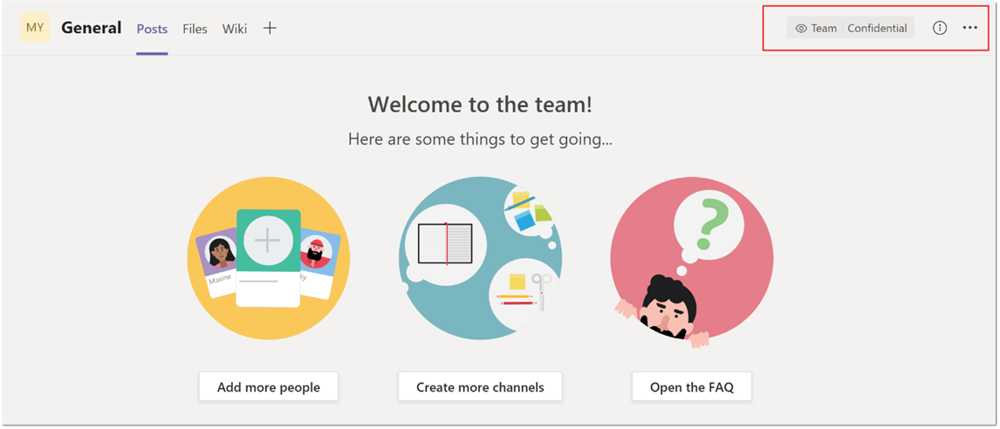

# Etiquetas de confidencialidad de Microsoft TeamsSensitivity labels for Microsoft Teams

[Las etiquetas de](https://docs.microsoft.com/microsoft-365/compliance/sensitivity-labels) confidencialidad permiten a los administradores de Teams proteger y regular el acceso al contenido organizativo confidencial creado durante la colaboración dentro de los equipos.[Sensitivity labels](https://docs.microsoft.com/microsoft-365/compliance/sensitivity-labels) allow Teams admins to protect and regulate access to sensitive organizational content created during collaboration within teams. Después de configurar las etiquetas de confidencialidad con las directivas asociadas en el Centro de cumplimiento [de Microsoft,](https://docs.microsoft.com/microsoft-365/compliance/go-to-the-securitycompliance-center)estas etiquetas se pueden aplicar a los equipos de su organización.After you configure sensitivity labels with their associated policies in the [Microsoft compliance center](https://docs.microsoft.com/microsoft-365/compliance/go-to-the-securitycompliance-center), these labels can be applied to teams in your organization.

Las etiquetas de confidencialidad no son compatibles actualmente para los clientes que usan SKU de Teams Educación.Sensitivity labels are currently unsupported for customers using Teams Education SKUs. Para obtener más información sobre las licencias, consulte la [descripción del servicio Microsoft Teams.](https://docs.microsoft.com/office365/servicedescriptions/teams-service-description)To learn more about licensing, see [Microsoft Teams service description](https://docs.microsoft.com/office365/servicedescriptions/teams-service-description).

## ¿Cuál es la diferencia entre las etiquetas de confidencialidad y las etiquetas de clasificación de Teams?What's the difference between sensitivity labels and Teams classification labels?

Las etiquetas de confidencialidad son diferentes de las etiquetas de clasificación, también conocidas como clasificación de grupos de Azure AD.Sensitivity labels are different from classification labels, also known as Azure AD group classification. Las etiquetas de clasificación son cadenas de texto que se pueden asociar con un grupo de Microsoft 365 pero que no tienen directivas reales asociadas.Classification labels are text strings that can be associated with a Microsoft 365 group but don't have any actual policies associated with them. Las etiquetas de clasificación se usan como metadatos y, a continuación, se deben usar otros métodos, como herramientas internas y scripts, para aplicar directivas.You use classification labels as metadata and then must use other methods such as internal tools and scripts, to enforce policies.

La ventaja de usar etiquetas de confidencialidad es que sus directivas se aplican automáticamente de un extremo a otro mediante una combinación de la plataforma de Grupos de Microsoft 365, el centro de cumplimiento y los servicios de Teams.The benefit of using sensitivity labels is that their policies are automatically enforced end-to-end through a combination of the Microsoft 365 Groups platform, the compliance center, and Teams services. Las etiquetas de confidencialidad ofrecen una potente compatibilidad de infraestructura para proteger los datos confidenciales de su organización y garantizar el cumplimiento de las directivas internas o normativas.Sensitivity labels provide powerful infrastructure support for securing your organization's sensitive data and ensuring compliance with your internal policies or regulations.

Si actualmente usa etiquetas de clasificación, consulte la siguiente documentación para obtener más información e instrucciones sobre cómo migrarlas a etiquetas de confidencialidad: clasificación de grupos de [Azure AD clásica.](https://docs.microsoft.com/microsoft-365/compliance/sensitivity-labels-teams-groups-sites#classic-azure-ad-group-classification)If you currently use classification labels, see the following documentation for more information and instructions how to migrate them to sensitivity labels: [Classic Azure AD group classification](https://docs.microsoft.com/microsoft-365/compliance/sensitivity-labels-teams-groups-sites#classic-azure-ad-group-classification).

## Escenarios de ejemplo para etiquetas de confidencialidadExample scenarios for sensitivity labels

Escenarios de ejemplo para usar etiquetas de confidencialidad con Teams en su organización:Example scenarios for how you can use sensitivity labels with Teams in your organization:

- [Establecer el nivel de privacidad (público o privado) para los equiposSet the privacy level (public or private) for teams](#set-the-privacy-level-for-teams)
- [Controlar el acceso de invitados a los equiposControl guest access to teams](#control-guest-access-to-teams)

### Establecer el nivel de privacidad para teamsSet the privacy level for teams

Puede crear y configurar una etiqueta de confidencialidad que, cuando se aplique durante la creación de equipos, permita a los usuarios crear equipos con una configuración de privacidad específica (pública o privada).You can create and configure a sensitivity label that, when applied during team creation, allows users to create teams with a specific privacy (public or private) setting.

Por ejemplo, puede crear y publicar una etiqueta de confidencialidad denominada "Confidencial" que tenga la opción de privacidad de etiqueta configurada como **Privado.**For example, you create and publish a sensitivity label named "Confidential" that has the label privacy option configured as **Private**. Como resultado, cualquier equipo que se cree con esta etiqueta debe ser un equipo privado.As a result, any team that's created with this label must be a private team. 

Cuando un usuario crea un equipo  y selecciona la etiqueta Confidencial, la única opción de privacidad que está disponible para el usuario es **Privado.**When a user creates a new team and selects the **Confidential** label, the only privacy option that's available to the user is **Private**. Otras opciones de privacidad, como Público y toda la organización, no están disponibles para que el usuario seleccione:Other privacy options such as Public and Org-wide aren't available for the user to select:

De forma similar, cree y publique una etiqueta de confidencialidad denominada "General" que tenga la opción de privacidad de etiqueta configurada como **Pública.**Similarly, you create and publish a sensitivity label named "General" that has the label privacy option configured as **Public**. Cuando un usuario crea un equipo, solo puede crear equipos públicos o para toda la organización al seleccionar esta etiqueta:When a user creates a new team, they can only create public or org-wide teams when they select this label:

Cuando se crea un equipo, la etiqueta de confidencialidad está visible en la esquina superior derecha de los canales del equipo.When a team is created, the sensitivity label is visible in the upper-right corner of channels in the team.

El propietario de un equipo puede cambiar la etiqueta de confidencialidad y la configuración de privacidad del equipo en cualquier momento si va al equipo y, a continuación, hace clic **en Editar equipo.**A team owner can change the sensitivity label and the privacy setting of the team at any time by going to the team, and then click **Edit team**.

### Controlar el acceso de invitados a los equiposControl guest access to teams

Puede usar etiquetas de confidencialidad para controlar el acceso de invitados a sus equipos.You can use sensitivity labels to control guest access to your teams. Los equipos creados con una etiqueta que no permite el acceso de invitado solo están disponibles para los usuarios de su organización.Teams created with a label that doesn't allow guest access are only available to users in your organization. Las personas de fuera de su organización no se pueden agregar al equipo.People outside your organization can't be added to the team.

## Centro de administración de Microsoft TeamsMicrosoft Teams admin center

Puede aplicar etiquetas de confidencialidad al crear o editar un equipo en el Centro de administración de Microsoft Teams.You can apply sensitivity labels when you create or edit a team in the Microsoft Teams admin center. 

Las etiquetas de confidencialidad también  están visibles en las propiedades del equipo y en la columna Clasificación de la página Administrar equipos del Centro de administración de Microsoft Teams. Sensitivity labels are also visible in team properties and in the **Classification** column on the **Manage teams** page of the Microsoft Teams admin center.

## LimitacionesLimitations

Antes de usar etiquetas de confidencialidad para Teams, tenga en cuenta las siguientes limitaciones:Before you use sensitivity labels for Teams, be aware of the following limitations:

- **Los nombres de etiqueta principal no se muestran para las sublabelas****Parent label names aren't displayed for sublabels**
    
    Teams admite subatiquetas, pero no muestra el nombre de la etiqueta principal.Teams supports sublabels but doesn't display the name of the parent label. Por ejemplo, **Confidencial** \\ **para todos los empleados** se muestra como **Todos los empleados.**For example, **Confidential** \\ **All Employees** displays as **All Employees**.

- **Las etiquetas de confidencialidad no son compatibles con las API de Teams Graph, los cmdlets de PowerShell y las plantillas****Sensitivity labels aren't supported by Teams Graph APIs, PowerShell cmdlets, and templates**
    
    Los usuarios no podrán aplicar etiquetas de confidencialidad a los equipos que se crean directamente a través de las API de Teams Graph, los cmdlets de PowerShell de Teams y las plantillas de Teams.Users won't be able to apply sensitivity labels on teams that are created directly through Teams Graph APIs, Teams PowerShell cmdlets, and Teams templates.

- **Compatibilidad con canales privados****Support for private channels**
    
    Los canales privados que se crean en un equipo heredan la etiqueta de confidencialidad que se aplicó en un equipo.Private channels that are created in a team inherit the sensitivity label that was applied on a team. La misma etiqueta se aplica automáticamente en la colección de sitios de SharePoint para el canal privado.The same label is automatically applied on the SharePoint site collection for the private channel.
    
    Sin embargo, si un usuario cambia directamente la etiqueta de confidencialidad en un sitio de SharePoint para un canal privado, ese cambio de etiqueta no se refleja en el cliente de Teams.However, if a user directly changes the sensitivity label on a SharePoint site for a private channel, that label change isn't reflected in the Teams client. En este escenario, los usuarios seguirán ven la etiqueta de confidencialidad original aplicada al equipo en el encabezado de canal privado.In this scenario, users continue to see the original sensitivity label applied on the team in the private channel header.

## Cómo crear y configurar etiquetas de confidencialidad para TeamsHow to create and configure sensitivity labels for Teams

Use las instrucciones de la documentación de Microsoft 365 para crear y configurar etiquetas de confidencialidad para Teams:Use the instructions from the Microsoft 365 documentation to create and configure sensitivity labels for Teams: 

- [Use etiquetas de confidencialidad para proteger el contenido en Microsoft Teams, grupos de Microsoft 365 y sitios de SharePoint.](https://docs.microsoft.com/microsoft-365/compliance/sensitivity-labels-teams-groups-sites)[Use sensitivity labels to protect content in Microsoft Teams, Microsoft 365 groups, and SharePoint sites](https://docs.microsoft.com/microsoft-365/compliance/sensitivity-labels-teams-groups-sites).
