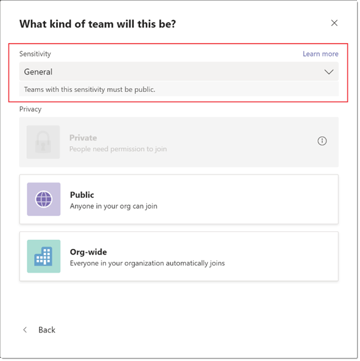

# <a name="sensitivity-labels-for-microsoft-teams"></a><span data-ttu-id="596a1-103">Etiquetas de confidencialidad de Microsoft Teams</span><span class="sxs-lookup"><span data-stu-id="596a1-103">Sensitivity labels for Microsoft Teams</span></span>

<span data-ttu-id="596a1-104">[Las etiquetas de](https://docs.microsoft.com/microsoft-365/compliance/sensitivity-labels) confidencialidad permiten a los administradores de Teams regular el acceso al contenido organizativo confidencial creado durante la colaboración dentro de los equipos.</span><span class="sxs-lookup"><span data-stu-id="596a1-104">[Sensitivity labels](https://docs.microsoft.com/microsoft-365/compliance/sensitivity-labels) allow Teams admins to regulate access to sensitive organizational content created during collaboration within teams.</span></span> <span data-ttu-id="596a1-105">Puede definir etiquetas de confidencialidad y sus directivas asociadas en el [Centro de cumplimiento.](https://docs.microsoft.com/microsoft-365/compliance/go-to-the-securitycompliance-center)</span><span class="sxs-lookup"><span data-stu-id="596a1-105">You can define sensitivity labels and their associated policies in the [Compliance Center](https://docs.microsoft.com/microsoft-365/compliance/go-to-the-securitycompliance-center).</span></span> <span data-ttu-id="596a1-106">Estas etiquetas y directivas se aplican automáticamente a los equipos de su organización.</span><span class="sxs-lookup"><span data-stu-id="596a1-106">These labels and policies are automatically applied to teams in your organization.</span></span>  

## <a name="whats-the-difference-between-sensitivity-labels-and-teams-classification-labels"></a><span data-ttu-id="596a1-107">¿Cuál es la diferencia entre las etiquetas de confidencialidad y las etiquetas de clasificación de Teams?</span><span class="sxs-lookup"><span data-stu-id="596a1-107">What's the difference between sensitivity labels and Teams classification labels?</span></span>

<span data-ttu-id="596a1-108">Las etiquetas de confidencialidad son diferentes de las etiquetas de clasificación.</span><span class="sxs-lookup"><span data-stu-id="596a1-108">Sensitivity labels are different from classification labels.</span></span> <span data-ttu-id="596a1-109">Las etiquetas de clasificación son cadenas de texto que se pueden asociar a un grupo de Microsoft 365 pero que no tienen directivas reales asociadas.</span><span class="sxs-lookup"><span data-stu-id="596a1-109">Classification labels are text strings that can be associated with a Microsoft 365 Group but don't have any actual policies associated with them.</span></span> <span data-ttu-id="596a1-110">Las etiquetas de clasificación se usan como metadatos para aplicar manualmente las directivas mediante scripts y herramientas internas.</span><span class="sxs-lookup"><span data-stu-id="596a1-110">You use classification labels as metadata to manually enforce policies through internal tools and scripts.</span></span>

<span data-ttu-id="596a1-111">Por otro lado, las etiquetas de confidencialidad y sus directivas se aplican automáticamente de un extremo a otro mediante una combinación de la plataforma Groups, el Centro de cumplimiento de & y los servicios de Teams.</span><span class="sxs-lookup"><span data-stu-id="596a1-111">On the other hand, sensitivity labels and their policies are automatically enforced end-to-end through a combination of the Groups platform, Security & Compliance Center, and Teams services.</span></span> <span data-ttu-id="596a1-112">Las etiquetas de confidencialidad proporcionan una potente compatibilidad de infraestructura para proteger los datos confidenciales de su organización.</span><span class="sxs-lookup"><span data-stu-id="596a1-112">Sensitivity labels provide powerful infrastructure support for securing your organization's sensitive data.</span></span>  

<span data-ttu-id="596a1-113">Para migrar los grupos existentes desde el uso de etiquetas de clasificación hasta el uso de etiquetas de confidencialidad, use las instrucciones de clasificación y etiquetas de confidencialidad de Azure Active Directory para grupos [de Microsoft 365.](https://docs.microsoft.com/microsoft-365/compliance/migrate-aad-classification-sensitivity-labels)</span><span class="sxs-lookup"><span data-stu-id="596a1-113">To migrate your existing groups from using classification labels to using sensitivity labels, use the instructions in [Azure Active Directory classification and sensitivity labels for Microsoft 365 groups](https://docs.microsoft.com/microsoft-365/compliance/migrate-aad-classification-sensitivity-labels).</span></span>

## <a name="create-manage-and-publish-sensitivity-labels-for-teams"></a><span data-ttu-id="596a1-114">Crear, administrar y publicar etiquetas de confidencialidad para Teams</span><span class="sxs-lookup"><span data-stu-id="596a1-114">Create, manage, and publish sensitivity labels for Teams</span></span>

<span data-ttu-id="596a1-115">Para obtener información sobre cómo habilitar, crear y publicar etiquetas de confidencialidad para Teams, consulte Usar etiquetas de confidencialidad para proteger el contenido de Microsoft Teams, grupos de [Microsoft 365](https://docs.microsoft.com/microsoft-365/compliance/sensitivity-labels-teams-groups-sites)y sitios de SharePoint.</span><span class="sxs-lookup"><span data-stu-id="596a1-115">For how to enable, create, and publish sensitivity labels for Teams, see [Use sensitivity labels to protect content in Microsoft Teams, Microsoft 365 groups, and SharePoint sites](https://docs.microsoft.com/microsoft-365/compliance/sensitivity-labels-teams-groups-sites).</span></span>

>[!IMPORTANT]
><span data-ttu-id="596a1-116">Para crear, actualizar y eliminar etiquetas de confidencialidad es necesario un orden de orden cuidadoso con la publicación de etiquetas para los usuarios.</span><span class="sxs-lookup"><span data-stu-id="596a1-116">Creating, updating and deleting sensitivity labels require careful sequencing with publishing labels to users.</span></span> <span data-ttu-id="596a1-117">Cualquier desviación de la secuencia puede provocar errores persistentes en la creación de equipos para todos los usuarios.</span><span class="sxs-lookup"><span data-stu-id="596a1-117">Any deviation in the sequence can result in persistent team creation errors for all users.</span></span> <span data-ttu-id="596a1-118">Por lo tanto, es fundamental hacer <a href="#createpublishlabels"></a>lo siguiente cuando cree y publique etiquetas, <a href="#modifydeletelabels">modifique</a>y elimine etiquetas publicadas, y administre los errores de creación <a href="#manageerrors">de equipos.</a></span><span class="sxs-lookup"><span data-stu-id="596a1-118">Therefore, it's critical to do the following when you <a href="#createpublishlabels">create and publish labels</a>, <a href="#modifydeletelabels">modify and delete published labels</a>, and <a href="#manageerrors">manage team creation errors</a>.</span></span>

<span data-ttu-id="596a1-119">**Crear y publicar etiquetas** <a name="createpublishlabels"></a></span><span class="sxs-lookup"><span data-stu-id="596a1-119">**Create and publish labels** <a name="createpublishlabels"> </a></span></span>

<span data-ttu-id="596a1-120">Cuando se crea y publica una etiqueta en el Centro de cumplimiento, la etiqueta puede tardar hasta 10 minutos en verse en la interfaz de creación de Teams.</span><span class="sxs-lookup"><span data-stu-id="596a1-120">When a label is created and published in the Compliance Center, it can take up to 10 minutes for the label to become visible in the teams creation interface.</span></span> <span data-ttu-id="596a1-121">Siga estos pasos para publicar la etiqueta para todos los usuarios del inquilino:</span><span class="sxs-lookup"><span data-stu-id="596a1-121">Use the following steps to publish the label for all users in the tenant:</span></span>
1. <span data-ttu-id="596a1-122">Crear la etiqueta y publicarla para unas pocas cuentas de usuario en el espacio empresarial.</span><span class="sxs-lookup"><span data-stu-id="596a1-122">Create the label and publish it for a few select user accounts in the tenant.</span></span>
2. <span data-ttu-id="596a1-123">Cuando la etiqueta se publique, espere 10 minutos.</span><span class="sxs-lookup"><span data-stu-id="596a1-123">When the label is published, wait 10 minutes.</span></span>
3. <span data-ttu-id="596a1-124">Después de 10 minutos, intente crear un equipo con la etiqueta con una de las cuentas de usuario que tienen acceso a la etiqueta.</span><span class="sxs-lookup"><span data-stu-id="596a1-124">After 10 minutes, try to create a team with the label using one of the user accounts that have access to the label.</span></span>
4. <span data-ttu-id="596a1-125">Si el equipo se creó correctamente en el paso 3, a continuación, publique la etiqueta para el resto de los usuarios en el espacio empresarial.</span><span class="sxs-lookup"><span data-stu-id="596a1-125">If the team successfully created in step 3, then go ahead and publish the label for the remaining users in the tenant.</span></span>

<span data-ttu-id="596a1-126">**Modificar y eliminar etiquetas publicadas** <a name="modifydeletelabels"></a></span><span class="sxs-lookup"><span data-stu-id="596a1-126">**Modify and delete published labels** <a name="modifydeletelabels"> </a></span></span>

<span data-ttu-id="596a1-127">Eliminar o modificar la etiqueta mientras está asociada con directivas de confidencialidad puede provocar errores en la creación de equipos en el espacio empresarial.</span><span class="sxs-lookup"><span data-stu-id="596a1-127">Deleting or modifying the label while it's associated with sensitivity policies can result in team creation failures across the tenant.</span></span> <span data-ttu-id="596a1-128">Por lo tanto, antes de eliminar o modificar una etiqueta, primero debe desasociar la etiqueta de las directivas asociadas.</span><span class="sxs-lookup"><span data-stu-id="596a1-128">Therefore, before you delete or modify a label, you must first disassociate the label from its associated policies.</span></span> <span data-ttu-id="596a1-129">Siga estos pasos</span><span class="sxs-lookup"><span data-stu-id="596a1-129">Use the following steps</span></span>  
<span data-ttu-id="596a1-130">para eliminar o modificar una etiqueta:</span><span class="sxs-lookup"><span data-stu-id="596a1-130">to delete or modify a label:</span></span>
1. <span data-ttu-id="596a1-131">Quite la etiqueta de todas las directivas que usan la etiqueta.</span><span class="sxs-lookup"><span data-stu-id="596a1-131">Remove the label from all policies that use the label.</span></span> <span data-ttu-id="596a1-132">Como alternativa, también puede eliminar las propias directivas.</span><span class="sxs-lookup"><span data-stu-id="596a1-132">Alternatively, you can also delete the policies themselves.</span></span>
2. <span data-ttu-id="596a1-133">Cuando la etiqueta se quite de las directivas o se eliminen, espere 10 minutos antes de continuar.</span><span class="sxs-lookup"><span data-stu-id="596a1-133">When the label is removed from the policies or the policies themselves are deleted, wait 10 minutes before proceeding further.</span></span>
3. <span data-ttu-id="596a1-134">Después de 10 minutos, inicie la interfaz de creación del equipo y asegúrese de que la etiqueta ya no está visible para ningún usuario en el espacio empresarial.</span><span class="sxs-lookup"><span data-stu-id="596a1-134">After 10 minutes, launch the team creation interface and ensure that the label is no longer visible for any user in the tenant.</span></span>
4. <span data-ttu-id="596a1-135">Ahora puede eliminar o modificar la etiqueta de forma segura.</span><span class="sxs-lookup"><span data-stu-id="596a1-135">Now you can safely delete or modify the label.</span></span>

<span data-ttu-id="596a1-136">**Administrar errores de creación de equipos** <a name="manageerrors"></a></span><span class="sxs-lookup"><span data-stu-id="596a1-136">**Manage team creation errors** <a name="manageerrors"> </a></span></span>

<span data-ttu-id="596a1-137">Si la creación de equipos empieza a fallar en cualquier momento durante la vista previa pública, tiene dos opciones:</span><span class="sxs-lookup"><span data-stu-id="596a1-137">If team creation begins to fail at any point during the public preview, you have two options:</span></span>
 - <span data-ttu-id="596a1-138">Asegúrese de que las etiquetas de confidencialidad no sean obligatorias para ningún usuario durante la creación de un equipo.</span><span class="sxs-lookup"><span data-stu-id="596a1-138">Ensure that sensitivity labels are not mandatory for any user during team creation.</span></span>
 - <span data-ttu-id="596a1-139">Desactive las etiquetas de confidencialidad con los scripts [en Habilitar esta vista previa.](https://docs.microsoft.com/microsoft-365/compliance/sensitivity-labels-teams-groups-sites#enable-this-preview)</span><span class="sxs-lookup"><span data-stu-id="596a1-139">Turn off sensitivity labels using the scripts in [Enable this preview](https://docs.microsoft.com/microsoft-365/compliance/sensitivity-labels-teams-groups-sites#enable-this-preview).</span></span>

<span data-ttu-id="596a1-140">Tenga en cuenta que el valor de EnableMIPLabels debe establecerse en false de la siguiente manera:</span><span class="sxs-lookup"><span data-stu-id="596a1-140">Note that the EnableMIPLabels setting must be set to false as follows:</span></span>

```console
$setting["EnableMIPLabels"] = "False"
```

## <a name="using-sensitivity-labels-with-teams"></a><span data-ttu-id="596a1-141">Usar etiquetas de confidencialidad con Teams</span><span class="sxs-lookup"><span data-stu-id="596a1-141">Using sensitivity labels with Teams</span></span>

<span data-ttu-id="596a1-142">Estos son algunos escenarios de ejemplo de cómo puede usar etiquetas de confidencialidad con Teams en su organización.</span><span class="sxs-lookup"><span data-stu-id="596a1-142">Here are some example scenarios of how you can use sensitivity labels with Teams in your organization.</span></span>

### <a name="privacy-setting-of-teams"></a><span data-ttu-id="596a1-143">Configuración de privacidad de los equipos</span><span class="sxs-lookup"><span data-stu-id="596a1-143">Privacy setting of teams</span></span>

<span data-ttu-id="596a1-144">Puede crear una etiqueta de confidencialidad que, cuando se aplique durante la creación del equipo, permita a los usuarios crear equipos con una configuración de privacidad específica (pública o privada).</span><span class="sxs-lookup"><span data-stu-id="596a1-144">You can create a sensitivity label that, when applied during team creation, allows users to create teams with a specific privacy (public or private) setting.</span></span>

<span data-ttu-id="596a1-145">Por ejemplo, si crea una etiqueta denominada "Confidencial" en el Centro de cumplimiento de & Seguridad y configura Teams, todos los equipos que se creen con esta etiqueta deben ser un equipo privado.</span><span class="sxs-lookup"><span data-stu-id="596a1-145">For example, you create a label named “Confidential” in the Security & Compliance Center and you configure Teams so that any team that's created with this label must be a private team.</span></span> <span data-ttu-id="596a1-146">Cuando un usuario crea un equipo  y selecciona la etiqueta Confidencial, la única opción de privacidad que está disponible para el usuario es **Privado.**</span><span class="sxs-lookup"><span data-stu-id="596a1-146">When a user creates a new team and selects the **Confidential** label, the only privacy option that's available to the user is **Private**.</span></span> <span data-ttu-id="596a1-147">Otras opciones de privacidad, como Público y toda la organización, están deshabilitadas para el usuario.</span><span class="sxs-lookup"><span data-stu-id="596a1-147">Other privacy options such as Public and Org-wide are disabled for the user.</span></span>


<span data-ttu-id="596a1-149">De forma similar, si el usuario selecciona **General** al crear un nuevo equipo, solo podrá crear equipos públicos o para toda la organización.</span><span class="sxs-lookup"><span data-stu-id="596a1-149">Similarly, if the user selects **General** when they create a new team, they can only create public or org-wide teams.</span></span>



<span data-ttu-id="596a1-151">Cuando se crea el equipo, la etiqueta de confidencialidad está visible en la esquina superior derecha de los canales del equipo.</span><span class="sxs-lookup"><span data-stu-id="596a1-151">When the team is created, the sensitivity label is visible in the upper-right corner of channels in the team.</span></span>


<span data-ttu-id="596a1-153">El propietario de un equipo puede cambiar la etiqueta de confidencialidad y la configuración de privacidad del equipo en cualquier momento si va al equipo y hace clic en **Editar equipo.**</span><span class="sxs-lookup"><span data-stu-id="596a1-153">A team owner can change the sensitivity label and the privacy setting of the team at any time by going to the team, and then clicking **Edit team**.</span></span>


### <a name="guest-access-to-teams"></a><span data-ttu-id="596a1-155">Acceso de invitado a teams</span><span class="sxs-lookup"><span data-stu-id="596a1-155">Guest access to teams</span></span>

<span data-ttu-id="596a1-156">Puede especificar si un equipo creado con una etiqueta específica permite el acceso de invitado.</span><span class="sxs-lookup"><span data-stu-id="596a1-156">You can specify whether a team created with a specific label allows guest access.</span></span> <span data-ttu-id="596a1-157">Los equipos creados con una etiqueta que no permite el acceso de invitado solo están disponibles para los usuarios de su organización.</span><span class="sxs-lookup"><span data-stu-id="596a1-157">Teams created with a label that doesn't allow guest access are only available to users in your organization.</span></span> <span data-ttu-id="596a1-158">Las personas de fuera de su organización no se pueden agregar al equipo.</span><span class="sxs-lookup"><span data-stu-id="596a1-158">People outside your organization can't be added to the team.</span></span>

### <a name="sensitivity-labels-in-the-microsoft-teams-admin-center"></a><span data-ttu-id="596a1-159">Etiquetas de confidencialidad en el Centro de administración de Microsoft Teams</span><span class="sxs-lookup"><span data-stu-id="596a1-159">Sensitivity labels in the Microsoft Teams admin center</span></span>

<span data-ttu-id="596a1-160">Puede establecer etiquetas de confidencialidad al crear o editar un equipo en el Centro de administración de Microsoft Teams.</span><span class="sxs-lookup"><span data-stu-id="596a1-160">You can set sensitivity labels when you create or edit a team in the Microsoft Teams admin center.</span></span> <span data-ttu-id="596a1-161">Las etiquetas de confidencialidad también  están visibles en las propiedades del equipo y en la columna Clasificación de la página Administrar equipos del Centro de administración de Microsoft Teams.</span><span class="sxs-lookup"><span data-stu-id="596a1-161">Sensitivity labels are also visible in team properties and in the **Classification** column on the Manage teams page of the Microsoft Teams admin center.</span></span>

## <a name="known-issues"></a><span data-ttu-id="596a1-162">Problemas conocidos</span><span class="sxs-lookup"><span data-stu-id="596a1-162">Known issues</span></span>

<span data-ttu-id="596a1-163">**Compatibilidad con etiquetas de confidencialidad en las API de Teams Graph, cmdlets y plantillas de PowerShell**</span><span class="sxs-lookup"><span data-stu-id="596a1-163">**Support for sensitivity labels in Teams Graph APIs, PowerShell cmdlets and templates**</span></span>

<span data-ttu-id="596a1-164">Actualmente, los usuarios no pueden aplicar etiquetas de confidencialidad a los equipos que se crean directamente a través de API de Graph, cmdlets de PowerShell y plantillas.</span><span class="sxs-lookup"><span data-stu-id="596a1-164">Currently, users won't be able to apply sensitivity labels on teams that are created directly through Graph APIs, PowerShell cmdlets, and templates.</span></span>

<span data-ttu-id="596a1-165">**Compatibilidad con etiquetas de confidencialidad en SKU de Teams EDU**</span><span class="sxs-lookup"><span data-stu-id="596a1-165">**Support for sensitivity labels in Teams EDU SKUs**</span></span>

<span data-ttu-id="596a1-166">Las etiquetas de confidencialidad no son compatibles actualmente para los clientes que usan SKU de Teams Educación.</span><span class="sxs-lookup"><span data-stu-id="596a1-166">Sensitivity labels are currently unsupported for customers using Teams Education SKUs.</span></span>

<span data-ttu-id="596a1-167">**Editar etiquetas de confidencialidad directamente en una colección de sitios de SharePoint para canales privados**</span><span class="sxs-lookup"><span data-stu-id="596a1-167">**Editing sensitivity labels directly on a SharePoint site collection for private channels**</span></span>

<span data-ttu-id="596a1-168">Los canales privados que se crean en un equipo heredan la etiqueta de confidencialidad que se aplicó en un equipo.</span><span class="sxs-lookup"><span data-stu-id="596a1-168">Private channels that are created in a team inherit the sensitivity label which was applied on a team.</span></span> <span data-ttu-id="596a1-169">Además, la misma etiqueta se aplica automáticamente en la colección de sitios de SharePoint para el canal privado.</span><span class="sxs-lookup"><span data-stu-id="596a1-169">Furthermore, the same label is automatically applied on the SharePoint site collection for the private channel.</span></span>

<span data-ttu-id="596a1-170">Si un usuario actualiza directamente la etiqueta de confidencialidad de una colección de sitios de SharePoint para un canal privado, esa etiqueta no se actualizará en el cliente de Teams.</span><span class="sxs-lookup"><span data-stu-id="596a1-170">If a user directly updates the sensitivity label on a SharePoint site collection for a private channel, that label isn't updated in the Teams client.</span></span> <span data-ttu-id="596a1-171">En este escenario, los usuarios seguirán ver la etiqueta de confidencialidad aplicada a un equipo en el encabezado de canal privado.</span><span class="sxs-lookup"><span data-stu-id="596a1-171">In this scenario, users will continue to see the sensitivity label applied on a team in the private channel header.</span></span>

<span data-ttu-id="596a1-172">**Tiempos de propagación de cambios aplicados a etiquetas de confidencialidad fuera de la aplicación de Teams**</span><span class="sxs-lookup"><span data-stu-id="596a1-172">**Propagation times for changes applied to sensitivity labels outside the Teams app**</span></span>

<span data-ttu-id="596a1-173">Los cambios realizados en las etiquetas de confidencialidad fuera de la aplicación Teams pueden tardar hasta 24 horas en reflejarse en la aplicación teams.</span><span class="sxs-lookup"><span data-stu-id="596a1-173">Changes made to sensitivity labels outside the Teams app can take up to 24 hours to reflect in the Teams app.</span></span> <span data-ttu-id="596a1-174">Esto se aplica a los cambios realizados para habilitar o deshabilitar las etiquetas para un inquilino, los cambios en los nombres de etiqueta, la configuración y las directivas.</span><span class="sxs-lookup"><span data-stu-id="596a1-174">This applies to any changes made to enable or disable labels for a tenant, changes to label names, settings, and policies.</span></span>

<span data-ttu-id="596a1-175">Además, cualquier cambio realizado en una etiqueta directamente en un grupo o una colección de sitios de SharePoint que haga copia de seguridad del equipo puede tardar hasta 24 horas en propagarse a la aplicación Teams.</span><span class="sxs-lookup"><span data-stu-id="596a1-175">Additionally, any changes to a label made directly to a group or SharePoint site collection that backs the team can take up to 24 hours to propagate to the Teams app.</span></span>
