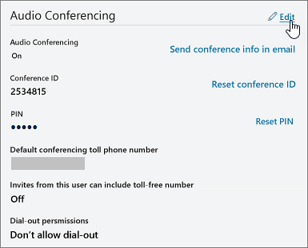

# Establecer los números de teléfono incluidos en las invitaciones en Microsoft TeamsSet the phone numbers included on invites in Microsoft Teams

Las audioconferencias en Microsoft 365 y Office 365 permiten a los usuarios de su organización crear reuniones Microsoft Teams y, a continuación, permitir que los usuarios llamen a esas reuniones con un teléfono.Audio Conferencing in Microsoft 365 and Office 365 enables users in your organization to create Microsoft Teams meetings, and then allow users to dial in to those meetings using a phone.
  
Un puente de conferencias le proporciona un conjunto de números de teléfono de acceso telefónico local para su organización.A conferencing bridge gives you a set of dial-in phone numbers for your organization. Todas ellas se pueden usar para unirse a las reuniones que ha creado un organizador de la reunión, pero puede seleccionar las que se incluirán en sus invitaciones de reunión.All of them can be used to join the meetings that a meeting organizer has created, but you can select which ones will be included on their meeting invites.
  
> [!NOTE]
> Puede haber un máximo de un número de teléfono gratuito y un número de teléfono gratuito en la invitación de reunión para un organizador de la reunión, pero también hay un vínculo situado en la parte inferior de cada invitación a la reunión que abre la lista completa de todos los números de teléfono de acceso telefónico local que se pueden usar para unirse a una reunión.There can be a maximum of one toll and one toll-free phone number on the meeting invite for a meeting organizer, but there is also a link located at the bottom of each meeting invite that opens the full list of all dial-in phone numbers that can be used to join a meeting.

> [!NOTE]
> [!INCLUDE [updating-admin-interfaces](includes/updating-admin-interfaces.md)]
  
## Asignación inicial de números de teléfono que se incluyen en las invitaciones de reunión para nuevos usuariosInitial assignment of phone numbers that are included in the meeting invites for new users

Los números de teléfono que se incluyen en las invitaciones de reunión de los usuarios habilitados para las audioconferencias se definen por el número de teléfono de pago de conferencia predeterminado y la configuración predeterminada del usuario de número de teléfono gratuito de conferencias.The phone numbers that get included in the meeting invites of users enabled for Audio Conferencing are defined by the default conferencing toll phone number and the default conferencing toll-free phone number user's settings. Cada configuración especifica qué número de pago y gratuito se incluirán en la invitación a la reunión de un usuario determinado.Each setting specifies which toll and toll-free number will be included in the meeting invite of a given user. Como se ha indicado anteriormente, cada invitación a la reunión contiene un número de pago, un número gratuito opcional y un vínculo que abre la lista completa de todos los números de teléfono de acceso telefónico telefónico que se pueden usar para unirse a una reunión determinada.As noted above, each meeting invite contains one toll number, one optional toll-free number and a link that opens the full list of all dial-in phone numbers that can be used to join a given meeting.

Para un nuevo usuario, los números de pago de conferencia predeterminados se asignan en función de la ubicación de uso que se establece en el centro de administración de Microsoft 365 del usuario cuando el usuario está habilitado para el servicio de audioconferencia.For a new user, the default conferencing toll numbers is assigned based on the Usage Location that is set in the Microsoft 365 administration center of the user when the user is enabled for the Audio Conferencing service. Si hay un número de pago en el puente de conferencia que coincida con el país del usuario, ese número se asignará automáticamente como el número de pago predeterminado del usuario.If there is a toll number in the conference bridge that matches the country of the user, that number will be automatically assigned as the default toll number of the user. Si no hay ninguna, el número que se define como el número de peaje predeterminado del puente de conferencia se asignará como el número de pago predeterminado del usuario.If there isn't one, the number that is defined as the default toll number of the conference bridge will be assigned as the default toll number of the user.  

Una vez que el usuario está habilitado para el servicio de audioconferencia, el administrador de inquilinos puede cambiar los números de teléfono gratuitos y de pago predeterminados del usuario a partir de sus valores iniciales en cualquier momento.Once the user is enabled for the Audio Conferencing service, the default toll and toll-free phone numbers of the user can be changed by the tenant administrator from their initial values at any moment.

## Establecer o cambiar el número de teléfono de audioconferencia predeterminado para un organizador o usuario de la reuniónSet or change the default audio conferencing phone number for a meeting organizer or user

 **Usando el centro de administración de Microsoft Teams** **Using the Microsoft Teams admin center**

Debe ser administrador de servicio de Teams para poder realizar estos cambios.You must be a Teams service admin to make these changes. Consulte [Usar los roles de administrador de Teams para administrar Teams](./using-admin-roles.md) para obtener información sobre cómo obtener roles de administrador y permisos.See [Use Teams administrator roles to manage Teams](./using-admin-roles.md) to read about getting admin roles and permissions.

1. Inicie sesión en el Microsoft Teams de administración.Log in to the Microsoft Teams admin center.

2. En el panel de navegación izquierdo, haga clic en **Usuarios.**In the left navigation, click **Users**.

    

3. Haga clic en el nombre de usuario de la lista de usuarios disponibles.Click the user name from the list of available users.

4. Junto a **Audioconferencia,** haga clic en **Editar.**Next to **Audio Conferencing**, click **Edit**.

    

5. Use los **campos Número de pago** o **Número** gratuito para escribir los números del usuario.Use the **Toll number** or **Toll-free number** fields to enter the numbers for the user.

> [!IMPORTANT]
> Al cambiar la configuración de audioconferencia de un usuario, las reuniones periódicas y futuras Microsoft Teams deben actualizarse y enviarse a los asistentes.When you change a user's audio conferencing settings, recurring and future Microsoft Teams meetings must be updated and sent to attendees.

## ¿Desea usar Windows PowerShellWant to use Windows PowerShell

Windows PowerShell se centra en la administración de usuarios y en las acciones que se les está permitido o no realizar.Windows PowerShell is all about managing users and what users are allowed or not allowed to do. Con Windows PowerShell, puede administrar Microsoft 365 o Office 365 mediante un único punto de administración que puede simplificar su trabajo diario cuando tiene varias tareas que hacer.With Windows PowerShell, you can manage Microsoft 365 or Office 365 by using a single point of administration that can simplify your daily work when you have multiple tasks to do. To get started with Windows PowerShell, see these topics:To get started with Windows PowerShell, see these topics:

- [Seis motivos por los que posiblemente quiera usar Windows PowerShell para administrar Office 365Why you need to use Office 365 PowerShell](/microsoft-365/enterprise/why-you-need-to-use-microsoft-365-powershell)

- [Las mejores formas de administrar Microsoft 365 o Office 365 con Windows PowerShell](/previous-versions//dn568025(v=technet.10))[Best ways to manage Microsoft 365 or Office 365 with Windows PowerShell](/previous-versions//dn568025(v=technet.10))

Para obtener más información sobre Windows PowerShell, consulte la [referencia de PowerShell para Microsoft Teams](/powershell/module/teams/?view=teams-ps).For more information about Windows PowerShell, see the [Microsoft Teams PowerShell reference](/powershell/module/teams/?view=teams-ps) for more information.
  
## Temas relacionadosRelated topics

[Pruebe o compre Audioconferencia en Microsoft 365 o Office 365Try or purchase Audio Conferencing in Microsoft 365 or Office 365](/SkypeForBusiness/audio-conferencing-in-office-365/try-or-purchase-audio-conferencing-in-office-365)

[Cambiar los números de teléfono de su puente de AudioconferenciaChange the phone numbers on your Audio Conferencing bridge](change-the-phone-numbers-on-your-audio-conferencing-bridge.md)