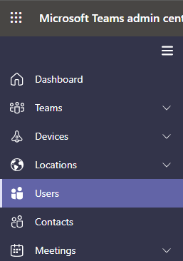

# Establecer los números de teléfono incluidos en las invitaciones en Microsoft Teams

Las audioconferencias en Microsoft 365 y Office 365 permiten a los usuarios de su organización crear reuniones Microsoft Teams y, a continuación, permitir que los usuarios llamen a esas reuniones con un teléfono.
  
Un puente de conferencias le proporciona un conjunto de números de teléfono de acceso telefónico local para su organización. Todas ellas se pueden usar para unirse a las reuniones que ha creado un organizador de la reunión, pero puede seleccionar las que se incluirán en sus invitaciones de reunión.
  
> [!NOTE]
> Puede haber un máximo de un número de teléfono gratuito y un número de teléfono gratuito en la invitación de reunión para un organizador de la reunión, pero también hay un vínculo situado en la parte inferior de cada invitación a la reunión que abre la lista completa de todos los números de teléfono de acceso telefónico local que se pueden usar para unirse a una reunión.

> [!NOTE]
> [!INCLUDE [updating-admin-interfaces](includes/updating-admin-interfaces.md)]
  
## Asignación inicial de números de teléfono que se incluyen en las invitaciones de reunión para nuevos usuarios

Los números de teléfono que se incluyen en las invitaciones de reunión de los usuarios habilitados para las audioconferencias se definen por el número de teléfono de pago de conferencia predeterminado y la configuración predeterminada del usuario de número de teléfono gratuito de conferencias. Cada configuración especifica qué número de pago y gratuito se incluirán en la invitación a la reunión de un usuario determinado. Como se ha indicado anteriormente, cada invitación a la reunión contiene un número de pago, un número gratuito opcional y un vínculo que abre la lista completa de todos los números de teléfono de acceso telefónico telefónico que se pueden usar para unirse a una reunión determinada.

Para un nuevo usuario, los números de pago de conferencia predeterminados se asignan en función de la ubicación de uso que se establece en el centro de administración de Microsoft 365 del usuario cuando el usuario está habilitado para el servicio de audioconferencia. Si hay un número de pago en el puente de conferencia que coincida con el país del usuario, ese número se asignará automáticamente como el número de pago predeterminado del usuario. Si no hay ninguna, el número que se define como el número de peaje predeterminado del puente de conferencia se asignará como el número de pago predeterminado del usuario.  

Una vez que el usuario está habilitado para el servicio de audioconferencia, el administrador de inquilinos puede cambiar los números de teléfono gratuitos y de pago predeterminados del usuario a partir de sus valores iniciales en cualquier momento.

## Establecer o cambiar el número de teléfono de audioconferencia predeterminado para un organizador o usuario de la reunión

 **Usando el centro de administración de Microsoft Teams**

Debe ser administrador de servicio de Teams para poder realizar estos cambios. Consulte [Usar los roles de administrador de Teams para administrar Teams](./using-admin-roles.md) para obtener información sobre cómo obtener roles de administrador y permisos.

1. Inicie sesión en el Microsoft Teams de administración.

2. En el panel de navegación izquierdo, haga clic en **Usuarios.**

    

3. Haga clic en el nombre de usuario de la lista de usuarios disponibles.

4. Junto a **Audioconferencia,** haga clic en **Editar.**

    

5. Use los **campos Número de pago** o **Número** gratuito para escribir los números del usuario.

> [!IMPORTANT]
> Al cambiar la configuración de audioconferencia de un usuario, las reuniones periódicas y futuras Microsoft Teams deben actualizarse y enviarse a los asistentes.

## ¿Desea usar Windows PowerShell

Windows PowerShell se centra en la administración de usuarios y en las acciones que se les está permitido o no realizar. Con Windows PowerShell, puede administrar Microsoft 365 o Office 365 mediante un único punto de administración que puede simplificar su trabajo diario cuando tiene varias tareas que hacer. To get started with Windows PowerShell, see these topics:

- [Seis motivos por los que posiblemente quiera usar Windows PowerShell para administrar Office 365](/microsoft-365/enterprise/why-you-need-to-use-microsoft-365-powershell)

- [Las mejores formas de administrar Microsoft 365 o Office 365 con Windows PowerShell](/previous-versions//dn568025(v=technet.10))

Para obtener más información sobre Windows PowerShell, consulte la [referencia de PowerShell para Microsoft Teams](/powershell/module/teams/?view=teams-ps).
  
## Temas relacionados

[Pruebe o compre Audioconferencia en Microsoft 365 o Office 365](/SkypeForBusiness/audio-conferencing-in-office-365/try-or-purchase-audio-conferencing-in-office-365)

[Cambiar los números de teléfono de su puente de Audioconferencia](change-the-phone-numbers-on-your-audio-conferencing-bridge.md)