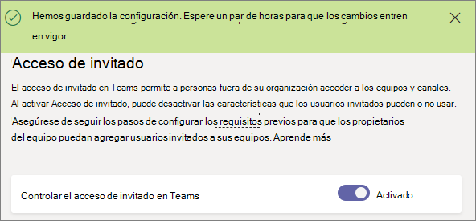

Active o desactive el acceso de invitado a Microsoft Teams
===================================================

Por defecto, el acceso de invitados está desactivado. Como administrador de Office 365, debe activar el acceso de invitados para equipos antes de que los propietarios del equipo o administrador puedan agregar invitados. Para activar el acceso de invitados, use la [lista de comprobación de acceso de invitados](guest-access-checklist.md). 

Después de activar el acceso de invitado, los cambios pueden demorar algunas horas en surtir efecto. Si un usuario ve el mensaje "Póngase en contacto con el administrador" cuando intenta agregar un invitado a su equipo, es posible que el acceso de invitado no se haya activado o que la configuración aún no sea efectiva.

> [!IMPORTANT]
> Activar el acceso de invitados depende de la configuración de Azure Active Directory, Office 365, SharePoint Online y Teams. Para obtener más información, consulte [autorizar el acceso de invitados en Teams](Teams-dependencies.md).

## Configurar el acceso de invitado en el centro de administración de Teams

1.    Inicie sesión en el centro de administración de Microsoft Teams.

2.    Seleccione **Configuración de toda la organización** > **Acceso de invitado**.

3. Establezca **permitir acceso de invitado en Microsoft Teams** en **activado**.

    

4.    En **llamadas**, **reuniones**y **Mensajería**, seleccione **activado** o **desactivado** para cada función, en función de lo que desee permitir a los usuarios invitados.

    - **Realizar llamadas privadas**: cambie esta opción a **Activado** para permitir que los invitados realicen llamadas entre compañeros.
    - **Permitir vídeo IP**: cambie esta opción a **Activado** para permitir que los invitados usen vídeo en sus llamadas y reuniones.
    - **Modo de pantalla compartida**: esta configuración controla la disponibilidad de la pantalla compartida para los usuarios invitados. 
       - Establezca esta opción como **Desactivado** para eliminar la posibilidad de que los invitados compartan sus pantallas en Teams. 
       - Establezca esta opción como **Solicitud única** para permitir el uso compartido de aplicaciones individuales. 
       - Establezca esta opción como **Pantalla completa** para permitir el uso de pantalla completa compartida.
    - **Permitir Reunirse ahora**: establezca esta opción como **Activado** para permitir que los invitados usen la característica Reunirse ahora en Microsoft Teams.
    - **Editar mensajes enviados**: establezca esta opción como **Activado** para permitir que los invitados editen los mensajes que han enviado anteriormente.
    - **Los invitados pueden eliminar mensajes enviados**: establezca esta opción como **Activado** para permitir que los invitados eliminen los mensajes que han enviado anteriormente.
    - **Chat**: establezca esta opción como **Activado** para permitir a los invitados usar el chat en Teams.
    - **Usar Giphy en conversaciones**: establezca esta opción como **Activado** para permitir que los invitados usen Giphy en conversaciones. Giphy es una base de datos en línea y un motor de búsqueda que permite a los usuarios buscar y compartir archivos GIF animados. A cada Giphy se le asigna una clasificación de contenido.
    - **Clasificación de contenido Giphy**: seleccione una clasificación de la lista desplegable:
       - **Permitir todo el contenido**: los invitados podrán insertar todos los Giphy en chats, independientemente de la clasificación de contenido.
       - **Moderado**: los invitados pueden insertar imágenes Giphy en los chats, pero el contenido para adultos estará restringido de forma moderada.
       - **Estricto**: los invitados pueden insertar imágenes Giphy en los chats, pero el contenido para adultos estará restringido de forma estricta.
    - **Use memes en conversaciones**: establezca esta opción como **Activado** para permitir que los invitados usen Memes en conversaciones.
    - **Usar adhesivos en conversaciones**: establezca esta opción como **Activado** para permitir que los invitados usen adhesivos en conversaciones. 

5.    Haga clic en **Guardar **.

## Usar PowerShell para activar o desactivar el acceso de invitados
Leer [use PowerShell para activar o desactivar el acceso de invitados](guest-access-PowerShell.md#use-powershell-to-turn-guest-access-on-or-off)

## Vídeo: agregar invitados en Teams

|  |  |
|---------|---------|
| Agregar invitados en Microsoft Teams   | <iframe width="350" height="200" src="https://www.youtube.com/embed/1daMBDyBLZc" frameborder="0" allowfullscreen></iframe>   | 

## Acceso externo (federación) frente a acceso de invitado

[!INCLUDE [guest-vs-external-access](includes/guest-vs-external-access.md)]