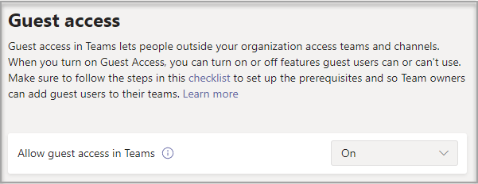

# Active o desactive el acceso de invitado a Microsoft Teams

> [!Note]

> Hasta **febrero de 2021,** el acceso de invitado está desactivado de forma predeterminada. Debe habilitar el acceso de invitado para Teams antes de que los administradores o los propietarios del equipo puedan agregar invitados. Después de activar el acceso de invitado, es posible que los cambios tarden unas horas en tener efecto. Si los usuarios  ven el mensaje Póngase en contacto con el administrador cuando intenten agregar un invitado a su equipo, es probable que no se haya activado el acceso de invitado o que la configuración aún no sea efectiva.

> Después de febrero de **2021,** el acceso de invitado en Microsoft Teams estará activado de forma predeterminada para los nuevos clientes & clientes existentes que no hayan configurado esta configuración. Cuando se implemente este cambio, si aún no ha configurado la capacidad de acceso de invitado en Microsoft Teams, esa capacidad se habilitará en el espacio empresarial. Si desea que el acceso de invitado permanezca deshabilitado para su organización, tendrá que confirmar que la configuración de acceso de invitado está establecida en **Desactivado** en lugar de **Servicio predeterminado.**

> [!IMPORTANT]
> El habilitar el acceso de invitado depende de las características de Azure Active Directory, Microsoft 365, SharePoint y Teams. Para obtener más información, consulte [Colaborar con invitados en un equipo](/microsoft-365/solutions/collaborate-as-team).

## Configurar el acceso de invitado en el centro de administración de Teams

1. Inicie sesión en el [Centro de administración de Microsoft Teams](https://admin.teams.microsoft.com/).

2. Seleccione **Configuración de toda la organización** > **Acceso de invitado**.

3. Establezca cambiar **Permitir el acceso de invitado en Microsoft Teams** en **Activado**.

    

4. En **Llamadas**, **Reunión** y **Mensajería** seleccione **Activado** o **Desactivado** según se requiera, según las funciones que quiera permitir para los usuarios invitados.

      - **Realizar llamadas privadas**: cambie esta opción a **Activado** para permitir que los invitados realicen llamadas entre compañeros.
      - **Permitir vídeo IP**: cambie esta opción a **Activado** para permitir que los invitados usen vídeo en sus llamadas y reuniones.
      - **Modo de pantalla compartida**: esta configuración controla la disponibilidad de la pantalla compartida para los usuarios invitados.
          - Establezca esta opción como **Desactivado** para eliminar la posibilidad de que los invitados compartan sus pantallas en Teams.
          - Establezca esta opción como **Solicitud única** para permitir el uso compartido de aplicaciones individuales.
          - Establezca esta opción como **Pantalla completa** para permitir el uso de pantalla completa compartida.
      - **Permitir Reunirse ahora**: establezca esta opción como **Activado** para permitir que los invitados usen la característica Reunirse ahora en Microsoft Teams.
      - **Editar mensajes enviados**: establezca esta opción como **Activado** para permitir que los invitados editen los mensajes que han enviado anteriormente.
      - **Los invitados pueden eliminar mensajes enviados**: establezca esta opción como **Activado** para permitir que los invitados eliminen los mensajes que han enviado anteriormente.
      - **Chat**: establezca esta opción como **Activado** para permitir a los invitados usar el chat en Teams.
      - **Usar Giphy en conversaciones**: establezca esta opción como **Activado** para permitir que los invitados usen Giphy en conversaciones. Giphy es una base de datos en línea y un motor de búsqueda que permite a los usuarios buscar y compartir archivos GIF animados. A cada Giphy se le asigna una clasificación de contenido.
      - **Clasificación de contenido Giphy**: seleccione una clasificación de la lista desplegable:
          - **Permitir todo el contenido**: los invitados podrán insertar todos los Giphy en chats, independientemente de la clasificación de contenido.
          - **Moderado**: los invitados pueden insertar imágenes Giphy en los chats, pero el contenido para adultos estará restringido de forma moderada.
          - **Estricto:** los invitados pueden insertar Giphys en chats, pero no podrán insertar contenido para adultos.
      - **Use memes en conversaciones**: establezca esta opción como **Activado** para permitir que los invitados usen Memes en conversaciones.
      - **Usar adhesivos en conversaciones**: establezca esta opción como **Activado** para permitir que los invitados usen adhesivos en conversaciones.

    

5. Seleccione **Guardar**.

## Acceso externo (federación) frente a acceso de invitado

[!INCLUDE [guest-vs-external-access](includes/guest-vs-external-access.md)]

## Consulte también

[Configurar la colaboración moderna con Microsoft 365](/microsoft-365/solutions/setup-secure-collaboration-with-teams)

[Bloquear el acceso de usuarios invitados a un equipo específico](/microsoft-365/solutions/per-group-guest-access)

[Set-CsTeamsClientConfiguration](/powershell/module/skype/set-csteamsclientconfiguration)