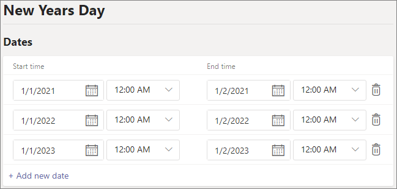

# Configurar vacaciones en Microsoft TeamsSet up holidays in Microsoft Teams

Puede usar la característica de días festivos de Teams para programar fechas y horas específicas en las que los usuarios de su organización tendrán tiempo libre de trabajo y no estarán disponibles.You can use the Teams Holidays feature to schedule specific dates and times when people in your organization will be taking time off from work and won't be available. Por ejemplo, puede crear un día festivo para los años nuevos días festivos cuando muchos de sus empleados no están en el trabajo.For example, you might create a holiday for the New Years holiday when many of your employees aren't at work.

Los días no laborables que crea aquí están disponibles al [configurar un operador automático](create-a-phone-system-auto-attendant.md), cada uno con su propio saludo y la configuración de enrutamiento de llamadas.The holidays you create here are available when you [set up an auto attendant](create-a-phone-system-auto-attendant.md), each with its own greeting and call routing settings.

## Crear un día festivoCreate a holiday

Para crear un día festivo:To create a holiday:

1. En el centro de administración de Microsoft Teams, vaya a **configuración de toda la organización**  >  **días festivos**.In the Microsoft Teams admin center, go to **Org-wide settings** > **Holidays**.

2. Seleccione **vacaciones nuevas**.Select **New holiday**.

3. Escriba un nombre para los días no laborables.Enter a name for the holiday.

4. Seleccione **Agregar nueva fecha**.Select **Add new date**.

5. En **hora de inicio**, seleccione el icono del calendario y elija la fecha en la que desea que comiencen los días no laborables.Under **Start time**, select the calendar icon and choose the date when you'd like the holiday to begin.

6. Use la lista desplegable para seleccionar una hora de inicio para las vacaciones.Use the drop-down list to select a start time for the holiday.

7. En **hora de finalización**, seleccione el icono del calendario y elija la fecha en la que desea que finalicen los días festivos.Under **End time**, select the calendar icon and choose the date when you'd like the holiday to end. Si los días no laborables son de un día, debe ser la misma fecha que la que elegiste en **hora de inicio**.If the holiday is one day only, this should be the same date as the one you chose under **Start time**.

8. Use la lista desplegable para seleccionar una hora de finalización para los días no laborables.Use the drop-down list to select an end time for the holiday.

9. De manera opcional, puede agregar más fechas para las vacaciones recurrentes.Optionally, add more dates for recurring holidays.

10. Seleccione **Guardar**.Select **Save**.

    

## Cambiar un día festivoChange a holiday

Para cambiar un día festivo:To change a holiday:

1. En el centro de administración de Microsoft Teams, vaya a **configuración de toda la organización**  >  **días festivos**.In the Microsoft Teams admin center, go to **Org-wide settings** > **Holidays**.

2. Seleccione el día festivo de la lista.Select the holiday from the list.

3. En **hora de inicio**, seleccione el icono del calendario y elija la fecha en la que desea que comiencen los días no laborables.Under **Start time**, select the calendar icon and choose the date when you'd like the holiday to begin.

4. Use la lista desplegable para seleccionar una hora de inicio para las vacaciones.Use the drop-down list to select a start time for the holiday.

5. En **hora de finalización**, seleccione el icono del calendario y elija la fecha en la que desea que finalicen los días festivos.Under **End time**, select the calendar icon and choose the date when you'd like the holiday to end. 

6. Use la lista desplegable para seleccionar una hora de finalización para los días no laborables.Use the drop-down list to select an end time for the holiday.

7. Seleccione **Guardar**.Select **Save**.

## Temas relacionadosRelated topics

[Planear los operadores automáticos de Teams y las colas de llamadasPlan for Teams auto attendants and call queues](plan-auto-attendant-call-queue.md)
