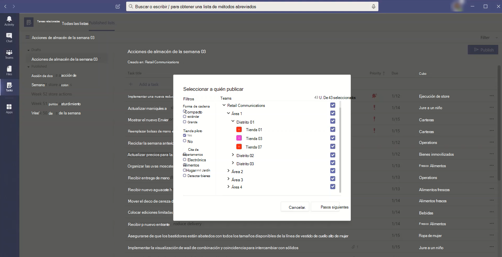

# <a name="set-up-your-team-targeting-hierarchy"></a><span data-ttu-id="4ce91-103">Configurar la jerarquía de destinos de equipo</span><span class="sxs-lookup"><span data-stu-id="4ce91-103">Set up your team targeting hierarchy</span></span>

<span data-ttu-id="4ce91-104">Configurar una jerarquía de segmentación de equipos permitirá a su organización publicar contenido en un gran conjunto de equipos.</span><span class="sxs-lookup"><span data-stu-id="4ce91-104">Setting up a team targeting hierarchy will allow your organization to publish content to a large set of teams.</span></span> <span data-ttu-id="4ce91-105">La jerarquía de segmentación de equipos define cómo todos los equipos de la jerarquía están relacionados entre sí, qué usuarios pueden publicar tareas y en qué equipos los usuarios tienen permisos para publicar.</span><span class="sxs-lookup"><span data-stu-id="4ce91-105">The team targeting hierarchy defines how all the teams in your hierarchy are related to each other, which users can publish tasks, and which teams users have permissions to publish to.</span></span> <span data-ttu-id="4ce91-106">Las características de publicación están deshabilitadas para todos los usuarios, a menos que se configure una jerarquía de segmentación de equipos para su organización.</span><span class="sxs-lookup"><span data-stu-id="4ce91-106">Publishing features are disabled for all users unless a team targeting hierarchy is set up for your organization.</span></span> <span data-ttu-id="4ce91-107">Para configurar una jerarquía de segmentación de equipos, deberá crear un archivo que defina la jerarquía y, después, cargarlo en Teams para aplicarlo a su organización.</span><span class="sxs-lookup"><span data-stu-id="4ce91-107">To set up a team targeting hierarchy, you'll need to create a file that defines the hierarchy and then upload it to Teams to apply it to your organization.</span></span> <span data-ttu-id="4ce91-108">Después de cargar el esquema, las aplicaciones de Teams pueden usarla.</span><span class="sxs-lookup"><span data-stu-id="4ce91-108">After the schema is uploaded, apps within Teams can use it.</span></span>

> [!IMPORTANT]
> <span data-ttu-id="4ce91-109">Para la versión inicial, solo la aplicación Tareas admite equipos jerárquicos.</span><span class="sxs-lookup"><span data-stu-id="4ce91-109">For the initial release, only the Tasks app supports hierarchical teams.</span></span>  <span data-ttu-id="4ce91-110">Aplicar una jerarquía de segmentación de equipos a su organización habilitará la publicación [de tareas](https://support.microsoft.com/office/publish-task-lists-to-create-and-track-work-in-your-organization-095409b3-f5af-40aa-9f9e-339b54e705df) en la aplicación Tareas.</span><span class="sxs-lookup"><span data-stu-id="4ce91-110">Applying a team targeting hierarchy to your organization will enable [task publishing](https://support.microsoft.com/office/publish-task-lists-to-create-and-track-work-in-your-organization-095409b3-f5af-40aa-9f9e-339b54e705df) in the Tasks app.</span></span> <span data-ttu-id="4ce91-111">No verá una jerarquía de equipos en otras áreas de Microsoft Teams.</span><span class="sxs-lookup"><span data-stu-id="4ce91-111">You won't see a hierarchy of teams in other areas of Microsoft Teams.</span></span>

<span data-ttu-id="4ce91-112">Este es un ejemplo de cómo se representa la jerarquía en la aplicación Tareas de Teams.</span><span class="sxs-lookup"><span data-stu-id="4ce91-112">Here's an example of how the hierarchy is represented in the Tasks app in Teams.</span></span> <span data-ttu-id="4ce91-113">Después de crear una lista de tareas, los miembros del equipo de publicación pueden seleccionar los equipos destinatarios a los que enviar (publicar) la lista de tareas.</span><span class="sxs-lookup"><span data-stu-id="4ce91-113">After a task list is created, members of the publishing team can then select the recipient teams to send (publish) the task list to.</span></span> <span data-ttu-id="4ce91-114">Al seleccionar equipos, el equipo de publicación puede filtrar por jerarquía, por atributos o por una combinación de ambos.</span><span class="sxs-lookup"><span data-stu-id="4ce91-114">When selecting teams, the publishing team can filter by hierarchy, by attributes, or a combination of both.</span></span><br>



## <a name="terminology"></a><span data-ttu-id="4ce91-116">Terminología</span><span class="sxs-lookup"><span data-stu-id="4ce91-116">Terminology</span></span>

<span data-ttu-id="4ce91-117">Los siguientes términos serán importantes a medida que navegue por las jerarquías.</span><span class="sxs-lookup"><span data-stu-id="4ce91-117">The following terms will be important as you navigate hierarchies.</span></span> <span data-ttu-id="4ce91-118">Teams se denominará **nodos.**</span><span class="sxs-lookup"><span data-stu-id="4ce91-118">Teams will be referred to as **nodes**.</span></span>

* <span data-ttu-id="4ce91-119">**Los nodos raíz** son los nodos superiores de la jerarquía.</span><span class="sxs-lookup"><span data-stu-id="4ce91-119">**Root nodes** are the topmost nodes in the hierarchy.</span></span> <span data-ttu-id="4ce91-120">En el ejemplo, Retail Communications es un nodo raíz.</span><span class="sxs-lookup"><span data-stu-id="4ce91-120">In the example, Retail Communications is a root node.</span></span>
* <span data-ttu-id="4ce91-121">**Los nodos principales** y **los nodos secundarios** son términos que representan una relación entre dos nodos conectados.</span><span class="sxs-lookup"><span data-stu-id="4ce91-121">**Parent nodes** and **child nodes** are terms that represent a relationship between two connected nodes.</span></span> <span data-ttu-id="4ce91-122">En el ejemplo, el Distrito 01 es un nodo secundario del área 1.</span><span class="sxs-lookup"><span data-stu-id="4ce91-122">In the example, District 01 is a child node of Area 1.</span></span>
* <span data-ttu-id="4ce91-123">Varios niveles de niños se denominan **descendientes.**</span><span class="sxs-lookup"><span data-stu-id="4ce91-123">Multiple levels of children are referred to as **descendants**.</span></span> <span data-ttu-id="4ce91-124">Distrito 01, Tienda 01, Tienda 03, Tienda 07, Distrito 02 y Distrito 03 son descendientes del Área 1.</span><span class="sxs-lookup"><span data-stu-id="4ce91-124">District 01, Store 01, Store 03, Store 07, District 02, and District 03 are all descendants of Area 1.</span></span>
* <span data-ttu-id="4ce91-125">Un nodo sin hijos se denomina nodo **hoja.**</span><span class="sxs-lookup"><span data-stu-id="4ce91-125">A node with no children is called a **leaf node**.</span></span> <span data-ttu-id="4ce91-126">Están en la parte inferior de una jerarquía.</span><span class="sxs-lookup"><span data-stu-id="4ce91-126">They are at the bottom of a hierarchy.</span></span>
* <span data-ttu-id="4ce91-127">**Los equipos destinatarios** son equipos que se han seleccionado para recibir un conjunto específico de contenido que se va a publicar.</span><span class="sxs-lookup"><span data-stu-id="4ce91-127">**Recipient teams** are teams that have been selected to receive a specific set of content to be published.</span></span> <span data-ttu-id="4ce91-128">Deben ser nodos hoja.</span><span class="sxs-lookup"><span data-stu-id="4ce91-128">They must be leaf nodes.</span></span>

## <a name="plan-your-hierarchy"></a><span data-ttu-id="4ce91-129">Planear la jerarquía</span><span class="sxs-lookup"><span data-stu-id="4ce91-129">Plan your hierarchy</span></span>

<span data-ttu-id="4ce91-130">Antes de crear el esquema que define la jerarquía, debe hacer algo de planeación y decidir cómo desea dar forma a su organización.</span><span class="sxs-lookup"><span data-stu-id="4ce91-130">Before you create the schema that defines your hierarchy, you need to do some planning and decide how you want to shape your organization.</span></span>  <span data-ttu-id="4ce91-131">Una de las primeras prioridades es decidir qué grupos organizativos necesitan publicar tareas en otros grupos.</span><span class="sxs-lookup"><span data-stu-id="4ce91-131">One of the first priorities is deciding which organizational groups need to publish tasks to other groups.</span></span> <span data-ttu-id="4ce91-132">Cada nodo de la jerarquía representa un grupo de trabajo o grupo de grupos.</span><span class="sxs-lookup"><span data-stu-id="4ce91-132">Each node in the hierarchy represents a working group or group of groups.</span></span>

### <a name="permissions-to-publish"></a><span data-ttu-id="4ce91-133">Permisos para publicar</span><span class="sxs-lookup"><span data-stu-id="4ce91-133">Permissions to publish</span></span>

<span data-ttu-id="4ce91-134">El permiso para publicar depende de si un usuario es miembro de algún equipo de la jerarquía, además de la relación de ese equipo o conjunto de equipos con otros equipos de la jerarquía.</span><span class="sxs-lookup"><span data-stu-id="4ce91-134">Permission to publish depends on whether a user is a member of any teams in the hierarchy plus the relationship of that team or set of teams to other teams in the hierarchy.</span></span>

> [!NOTE]
> <span data-ttu-id="4ce91-135">Al propietario de un equipo también se le conceden permisos de publicación.</span><span class="sxs-lookup"><span data-stu-id="4ce91-135">The owner of a team is also granted publishing permissions.</span></span>

* <span data-ttu-id="4ce91-136">Si un usuario es miembro de al menos un equipo que tiene descendientes en la jerarquía, ese usuario puede publicar a esos descendientes sin ser miembro de todos los equipos en los que desea publicar.</span><span class="sxs-lookup"><span data-stu-id="4ce91-136">If a user is a member of at least one team that has descendants in the hierarchy, that user can publish to those descendants without being a member of all teams they want to publish to.</span></span>
* <span data-ttu-id="4ce91-137">Si un usuario es miembro de al menos un equipo de la jerarquía pero no es miembro de ningún equipo con descendientes en la jerarquía, ese usuario puede ver y recibir contenido publicado de su organización.</span><span class="sxs-lookup"><span data-stu-id="4ce91-137">If a user is a member of a least one team in the hierarchy but isn't a member of any team with descendants in the hierarchy, that user can see and receive published content from their organization.</span></span>
* <span data-ttu-id="4ce91-138">Si un usuario no es miembro de ningún equipo de la jerarquía, ese usuario no verá ninguna funcionalidad relacionada con la publicación.</span><span class="sxs-lookup"><span data-stu-id="4ce91-138">If a user isn't a member of any team in the hierarchy, that user won't see any publishing-related functionality.</span></span>

### <a name="guidelines"></a><span data-ttu-id="4ce91-139">Directrices</span><span class="sxs-lookup"><span data-stu-id="4ce91-139">Guidelines</span></span>

* <span data-ttu-id="4ce91-140">Solo puede haber un archivo de jerarquía aplicado por organización.</span><span class="sxs-lookup"><span data-stu-id="4ce91-140">There can only be one hierarchy file applied per organization.</span></span> <span data-ttu-id="4ce91-141">Sin embargo, puede incluir diferentes partes de su organización conjuntamente como jerarquías distintas de nodos dentro de un archivo CSV.</span><span class="sxs-lookup"><span data-stu-id="4ce91-141">However, you can include different parts of your organization together as distinct hierarchies of nodes within one CSV file.</span></span> <span data-ttu-id="4ce91-142">Por ejemplo, Contoso Pharmaceuticals tiene un nodo raíz de farmacia y un nodo raíz minorista.</span><span class="sxs-lookup"><span data-stu-id="4ce91-142">For example, Contoso Pharmaceuticals has a Pharmacy root node and a Retail root node.</span></span> <span data-ttu-id="4ce91-143">Ambos nodos raíz tienen varias filas de descendientes y no hay ninguna superposición entre ellos.</span><span class="sxs-lookup"><span data-stu-id="4ce91-143">Both root nodes have multiple rows of descendants and there's no overlap between them.</span></span>
* <span data-ttu-id="4ce91-144">Solo los nodos hoja pueden ser destinatarios de una publicación.</span><span class="sxs-lookup"><span data-stu-id="4ce91-144">Only leaf nodes can be recipients of a publication.</span></span> <span data-ttu-id="4ce91-145">Otros nodos de la jerarquía son útiles para seleccionar destinatarios de una publicación.</span><span class="sxs-lookup"><span data-stu-id="4ce91-145">Other nodes in the hierarchy are helpful for selecting recipients of a publication.</span></span>
* <span data-ttu-id="4ce91-146">Un equipo solo se puede representar una vez en una jerarquía.</span><span class="sxs-lookup"><span data-stu-id="4ce91-146">A team can only be represented one time in a hierarchy.</span></span>
* <span data-ttu-id="4ce91-147">Una jerarquía puede contener hasta 15 000 nodos.</span><span class="sxs-lookup"><span data-stu-id="4ce91-147">A hierarchy can contain up to 15,000 nodes.</span></span> <span data-ttu-id="4ce91-148">Tenemos previsto trabajar con los clientes para aumentar este límite para las organizaciones más grandes.</span><span class="sxs-lookup"><span data-stu-id="4ce91-148">We plan to work with customers to raise this limit for larger organizations.</span></span>

### <a name="example-hierarchy"></a><span data-ttu-id="4ce91-149">Jerarquía de ejemplo</span><span class="sxs-lookup"><span data-stu-id="4ce91-149">Example hierarchy</span></span>

<span data-ttu-id="4ce91-150">Por ejemplo, en la siguiente jerarquía, Recuperar, Comunicaciones y RRHH puede publicar tareas en todos los nodos inferiores (equipo) de la jerarquía, pero zona noreste solo puede publicar tareas en los equipos de la Tienda Nueva York y la Tienda Boston.</span><span class="sxs-lookup"><span data-stu-id="4ce91-150">For example, in the following hierarchy, Recall, Communications, and HR can publish tasks to every bottom node (team) in the hierarchy, but Northeast Zone can only publish tasks to the New York Store and Boston Store teams.</span></span> <span data-ttu-id="4ce91-151">La jerarquía de ejemplo permite a los grupos Recuperar, Comunicaciones y RRHH publicar tareas que se aplican a toda la empresa, como información de beneficios o mensajes del director general.</span><span class="sxs-lookup"><span data-stu-id="4ce91-151">The example hierarchy allows the Recall, Communications, and HR groups to publish tasks that apply to the entire company, such as benefits information or messages from the CEO.</span></span> <span data-ttu-id="4ce91-152">Zona noreste puede publicar tareas como programación de personal, información meteorológica, entre otras, solo en los equipos de la Tienda Nueva York y la Tienda Boston.</span><span class="sxs-lookup"><span data-stu-id="4ce91-152">Northeast Zone can publish tasks like personnel scheduling, weather information, and so on, only to the New York Store and Boston Store teams.</span></span>


## <a name="create-your-hierarchy"></a><span data-ttu-id="4ce91-154">Crear la jerarquía</span><span class="sxs-lookup"><span data-stu-id="4ce91-154">Create your hierarchy</span></span>

> [!NOTE]
> <span data-ttu-id="4ce91-155">En el resto de este artículo se describe la configuración de una jerarquía de equipos en el contexto de la publicación de tareas en los equipos destinatarios.</span><span class="sxs-lookup"><span data-stu-id="4ce91-155">The remainder of this article discusses setting up a team hierarchy in the context of publishing tasks to recipient teams.</span></span> <span data-ttu-id="4ce91-156">Consulte Administrar [la aplicación Tareas](https://docs.microsoft.com/MicrosoftTeams/manage-tasks-app) de su organización en Teams para obtener información general sobre la aplicación Tareas, donde aparece la publicación de tareas cuando está habilitada.</span><span class="sxs-lookup"><span data-stu-id="4ce91-156">Refer to [Manage the Tasks app for your organization in Teams](https://docs.microsoft.com/MicrosoftTeams/manage-tasks-app) for an overview of the Tasks app, where task publishing appears when enabled.</span></span>

<span data-ttu-id="4ce91-157">El esquema que define la jerarquía se basa en un archivo de valores separados por comas (CSV).</span><span class="sxs-lookup"><span data-stu-id="4ce91-157">The schema that defines your hierarchy is based on a comma-separated values (CSV) file.</span></span> <span data-ttu-id="4ce91-158">Cada fila del archivo CSV corresponde a un nodo dentro de la jerarquía de equipos.</span><span class="sxs-lookup"><span data-stu-id="4ce91-158">Each row in the CSV file corresponds to one node within the hierarchy of teams.</span></span> <span data-ttu-id="4ce91-159">Cada fila contiene información que denomina el nodo dentro de la jerarquía, opcionalmente lo vincula a un equipo e incluye atributos que se pueden usar para filtrar equipos en aplicaciones que lo admitan.</span><span class="sxs-lookup"><span data-stu-id="4ce91-159">Each row contains information that names the node within the hierarchy, optionally links it to a team, and includes attributes that can be used to filter teams in apps that support it.</span></span>

<span data-ttu-id="4ce91-160">También puede definir **cubos,** que son categorías que el equipo de publicación puede usar para organizar el contenido enviado a los equipos destinatarios para que les resulte más fácil ver, ordenar y centrarse en el contenido relevante.</span><span class="sxs-lookup"><span data-stu-id="4ce91-160">You can also define **buckets**, which are categories that the publishing team can use to organize content sent to recipient teams to make it easier for them to view, sort, and focus on relevant content.</span></span>

### <a name="add-required-columns"></a><span data-ttu-id="4ce91-161">Agregar columnas necesarias</span><span class="sxs-lookup"><span data-stu-id="4ce91-161">Add required columns</span></span>

<span data-ttu-id="4ce91-162">El archivo CSV debe contener las tres columnas siguientes, en el orden siguiente, empezando en la primera columna.</span><span class="sxs-lookup"><span data-stu-id="4ce91-162">The CSV file must contain the following three columns, in the following order, starting at the first column.</span></span> <span data-ttu-id="4ce91-163">Un nodo debe estar vinculado a un equipo para que reciba tareas.</span><span class="sxs-lookup"><span data-stu-id="4ce91-163">A node must be linked to a team for it to receive tasks.</span></span>

| <span data-ttu-id="4ce91-164">Nombre de columna</span><span class="sxs-lookup"><span data-stu-id="4ce91-164">Column name</span></span>   | <span data-ttu-id="4ce91-165">Obligatorio</span><span class="sxs-lookup"><span data-stu-id="4ce91-165">Required</span></span> | <span data-ttu-id="4ce91-166">Descripción</span><span class="sxs-lookup"><span data-stu-id="4ce91-166">Description</span></span>   |
----------------|----------|---------------|
| <span data-ttu-id="4ce91-167">DisplayName</span><span class="sxs-lookup"><span data-stu-id="4ce91-167">DisplayName</span></span>    | <span data-ttu-id="4ce91-168">Sí</span><span class="sxs-lookup"><span data-stu-id="4ce91-168">Yes</span></span>      | <span data-ttu-id="4ce91-169">Este campo es el nombre del nodo.</span><span class="sxs-lookup"><span data-stu-id="4ce91-169">This field is the name of the node.</span></span> <span data-ttu-id="4ce91-170">El nombre puede tener hasta 100 caracteres de longitud y contener solo los caracteres A-Z, a-z y 0-9.</span><span class="sxs-lookup"><span data-stu-id="4ce91-170">The name can be up to 100 characters long and contain only the characters A-Z, a-z, and 0-9.</span></span> <span data-ttu-id="4ce91-171">Los nombres de nodo deben ser únicos.</span><span class="sxs-lookup"><span data-stu-id="4ce91-171">Node names must be unique.</span></span> |
| <span data-ttu-id="4ce91-172">ParentName</span><span class="sxs-lookup"><span data-stu-id="4ce91-172">ParentName</span></span>    | <span data-ttu-id="4ce91-173">Sí</span><span class="sxs-lookup"><span data-stu-id="4ce91-173">Yes</span></span>       | <span data-ttu-id="4ce91-174">Este es el nombre del nodo primario.</span><span class="sxs-lookup"><span data-stu-id="4ce91-174">This is the name of the parent node.</span></span> <span data-ttu-id="4ce91-175">El valor que especifique aquí debe coincidir exactamente con el valor del campo **DisplayName** del nodo primario.</span><span class="sxs-lookup"><span data-stu-id="4ce91-175">The value you specify here must match the value in the **DisplayName** field of the parent node exactly.</span></span> <span data-ttu-id="4ce91-176">Si desea agregar más de un nodo primario, separe cada nombre de nodo primario con un punto y coma (;).</span><span class="sxs-lookup"><span data-stu-id="4ce91-176">If you want to add more than one parent node, separate each parent node name with a semicolon (;).</span></span> <span data-ttu-id="4ce91-177">Puede agregar hasta 25 nodos primarios y cada nombre de nodo primario puede tener hasta 2500 caracteres.</span><span class="sxs-lookup"><span data-stu-id="4ce91-177">You can add up to 25 parent nodes, and each parent node name can be up to 2500 characters long.</span></span> <span data-ttu-id="4ce91-178">Un nodo solo puede tener varios nodos primarios si los nodos primarios son nodos raíz.</span><span class="sxs-lookup"><span data-stu-id="4ce91-178">A node can have multiple parent nodes only if the parent nodes are root nodes.</span></span>   <br><br><span data-ttu-id="4ce91-179">**IMPORTANTE** Tenga cuidado de no crear un bucle en el que un elemento primario superior de la jerarquía haga referencia a un nodo secundario en la jerarquía.</span><span class="sxs-lookup"><span data-stu-id="4ce91-179">**IMPORTANT** Be careful not to create a loop where a parent higher up in the hierarchy references a child node lower in the hierarchy.</span></span> <span data-ttu-id="4ce91-180">Esto no es compatible.</span><span class="sxs-lookup"><span data-stu-id="4ce91-180">This isn't supported.</span></span> |
| <span data-ttu-id="4ce91-181">TeamId</span><span class="sxs-lookup"><span data-stu-id="4ce91-181">TeamId</span></span>        | <span data-ttu-id="4ce91-182">Sí, si el equipo publica tareas o recibe tareas de un nodo primario</span><span class="sxs-lookup"><span data-stu-id="4ce91-182">Yes, if the team publishes tasks or receives tasks from a parent node</span></span>       | <span data-ttu-id="4ce91-183">Este contiene el id. del equipo al que desea vincular un nodo.</span><span class="sxs-lookup"><span data-stu-id="4ce91-183">This contains the ID of the team you want to link a node to.</span></span> <span data-ttu-id="4ce91-184">Cada nodo debe hacer referencia a un equipo único, por lo que cada valor de TeamId puede aparecer solo una vez en el archivo de jerarquía.</span><span class="sxs-lookup"><span data-stu-id="4ce91-184">Each node must refer to a unique team, so each TeamId value may appear only once in the hierarchy file.</span></span> <span data-ttu-id="4ce91-185">Para obtener el id. de un equipo al que desea vincular un nodo, ejecute el siguiente comando de PowerShell: `Get-Team | Export-Csv TeamList.csv` .</span><span class="sxs-lookup"><span data-stu-id="4ce91-185">To get the ID of a team you want to link a node to, run the following PowerShell command: `Get-Team | Export-Csv TeamList.csv`.</span></span> <span data-ttu-id="4ce91-186">Este comando enumera los equipos de su organización e incluye el nombre y el id. de cada equipo.</span><span class="sxs-lookup"><span data-stu-id="4ce91-186">This command lists the teams in your organization and includes the name and ID for each team.</span></span> <span data-ttu-id="4ce91-187">Busque el nombre del equipo al que desea vincular y, a continuación, copie el id. en este campo.</span><span class="sxs-lookup"><span data-stu-id="4ce91-187">Find the name of the team you want to link to, and then copy the ID into this field.</span></span>|

> [!NOTE]
> <span data-ttu-id="4ce91-188">Si un nodo no es un nodo raíz o un nodo hoja y no necesita la pertenencia al equipo para conceder los permisos correspondientes para publicar e informar, puede dejar el IdDe Equipo en blanco.</span><span class="sxs-lookup"><span data-stu-id="4ce91-188">If a node isn't a root node or a leaf node and you don't need the team membership to grant the corresponding permissions for publishing and reporting, you can leave the TeamId blank.</span></span> <span data-ttu-id="4ce91-189">Este método se puede usar para agregar más granularidad al elegir equipos de destinatarios o para ver informes de finalización sin tener un equipo correspondiente.</span><span class="sxs-lookup"><span data-stu-id="4ce91-189">This method can be used to add more granularity when choosing recipient teams or for viewing completion reports without having a corresponding team.</span></span>

### <a name="add-attribute-columns"></a><span data-ttu-id="4ce91-190">Agregar columnas de atributo</span><span class="sxs-lookup"><span data-stu-id="4ce91-190">Add attribute columns</span></span>

<span data-ttu-id="4ce91-191">Después de agregar las tres columnas necesarias, puede agregar columnas de atributo opcionales.</span><span class="sxs-lookup"><span data-stu-id="4ce91-191">After you add the three required columns, you can add optional attribute columns.</span></span> <span data-ttu-id="4ce91-192">Estos atributos se pueden usar para filtrar nodos para que pueda seleccionar más fácilmente los que desea publicar tareas.</span><span class="sxs-lookup"><span data-stu-id="4ce91-192">These attributes can be used to filter nodes so that you can more easily select the ones you want to publish tasks to.</span></span> <span data-ttu-id="4ce91-193">Hay dos formas de definir los atributos, dependiendo de si los valores de ese atributo son mutuamente excluyentes.</span><span class="sxs-lookup"><span data-stu-id="4ce91-193">There are two ways to define your attributes, depending on whether values for that attribute are mutually exclusive.</span></span>

|<span data-ttu-id="4ce91-194">Formas de agregar atributos</span><span class="sxs-lookup"><span data-stu-id="4ce91-194">Ways to add attributes</span></span>|<span data-ttu-id="4ce91-195">Descripción</span><span class="sxs-lookup"><span data-stu-id="4ce91-195">Description</span></span> |<span data-ttu-id="4ce91-196">Ejemplo</span><span class="sxs-lookup"><span data-stu-id="4ce91-196">Example</span></span>  |
|---|---------|---------|
|<span data-ttu-id="4ce91-197">Si los valores de un atributo son mutuamente excluyentes, el nombre de columna que especifique se convertirá en el nombre del atributo.</span><span class="sxs-lookup"><span data-stu-id="4ce91-197">If the values for an attribute are mutually exclusive, the column name you specify becomes the name of the attribute.</span></span>|<span data-ttu-id="4ce91-198">Cada fila puede contener un valor para ese atributo y cada columna de atributo puede tener hasta 50 valores únicos.</span><span class="sxs-lookup"><span data-stu-id="4ce91-198">Each row can contain one value for that attribute, and each attribute column can have up to 50 unique values.</span></span> <span data-ttu-id="4ce91-199">Cada valor puede tener hasta 100 caracteres.</span><span class="sxs-lookup"><span data-stu-id="4ce91-199">Each value can be up to 100 characters long.</span></span> <span data-ttu-id="4ce91-200">El conjunto de valores de atributo que especifique en la columna de atributo se mostrará como valores de filtro para ese atributo al seleccionar equipos de destinatarios con la jerarquía de destino del equipo.</span><span class="sxs-lookup"><span data-stu-id="4ce91-200">The set of attribute values you specify in the attribute column will be displayed as filter values for that attribute when selecting recipient teams using the team targeting hierarchy.</span></span>|<span data-ttu-id="4ce91-201">Desea que los usuarios puedan filtrar almacenes por diseño.</span><span class="sxs-lookup"><span data-stu-id="4ce91-201">You want users to be able to filter stores by layout.</span></span> <span data-ttu-id="4ce91-202">Los valores de este atributo se excluyen mutuamente porque un almacén solo puede tener un diseño.</span><span class="sxs-lookup"><span data-stu-id="4ce91-202">The values for this attribute are mutually exclusive because a store can have only one layout.</span></span> <br><br><span data-ttu-id="4ce91-203">Para agregar un atributo para filtrar almacenes por diseño, agregue una columna denominada Diseño de tienda.</span><span class="sxs-lookup"><span data-stu-id="4ce91-203">To add an attribute to filter stores by layout, add a column named Store layout.</span></span> <span data-ttu-id="4ce91-204">En este ejemplo, los valores del atributo de diseño Store son Compacto, Estándar y Grande.</span><span class="sxs-lookup"><span data-stu-id="4ce91-204">In this example, values for the Store layout attribute are Compact, Standard, and Large.</span></span>
|<span data-ttu-id="4ce91-205">Si necesita indicar varios valores para un atributo y los valores no son mutuamente exclusivos, use el formato **AttributeName:UniqueValue** para los nombres de columna.</span><span class="sxs-lookup"><span data-stu-id="4ce91-205">If you need to indicate multiple values for an attribute and the values aren't mutually exclusive, use the **AttributeName:UniqueValue** format for the column names.</span></span> <br><br><span data-ttu-id="4ce91-206">**IMPORTANTE** Asegúrese de usar los dos puntos solo en inglés (:) como unicode no es compatible como delimitador de columna de atributo.</span><span class="sxs-lookup"><span data-stu-id="4ce91-206">**IMPORTANT** Make sure to use the English-only colon (:) as unicode isn't supported as an attribute column delimiter.</span></span> |<span data-ttu-id="4ce91-207">La cadena de texto antes de los dos puntos (:) se convierte en el nombre del atributo.</span><span class="sxs-lookup"><span data-stu-id="4ce91-207">The text string before the colon (:) becomes the name of the attribute.</span></span> <span data-ttu-id="4ce91-208">Todas las columnas que contienen la misma cadena de texto antes de los dos puntos (:) se agrupan en una sección del menú de filtrado.</span><span class="sxs-lookup"><span data-stu-id="4ce91-208">All columns that contain the same text string before the colons (:) are grouped together into a section in the filtering menu.</span></span> <span data-ttu-id="4ce91-209">Cada una de las cadenas después de los dos puntos se convierten en los valores de esa sección.</span><span class="sxs-lookup"><span data-stu-id="4ce91-209">Each of the strings after the colon become the values for that section.</span></span><br><br><span data-ttu-id="4ce91-210">Cada fila puede tener un valor de 0 (cero) o 1 para ese atributo.</span><span class="sxs-lookup"><span data-stu-id="4ce91-210">Each row can have a value of 0 (zero) or 1 for that attribute.</span></span> <span data-ttu-id="4ce91-211">Un valor de 0 significa que el atributo no se aplica al nodo y un valor de 1 significa que el atributo se aplica a ese nodo.</span><span class="sxs-lookup"><span data-stu-id="4ce91-211">A value of 0 means that the attribute doesn't apply to the node and a value of 1 means that the attribute applies to that node.</span></span>|<span data-ttu-id="4ce91-212">Desea que los usuarios puedan filtrar las tiendas por departamento.</span><span class="sxs-lookup"><span data-stu-id="4ce91-212">You want users to be able to filter stores by department.</span></span> <span data-ttu-id="4ce91-213">Una tienda puede tener varios departamentos, por lo que los valores de este atributo no se excluyen mutuamente.</span><span class="sxs-lookup"><span data-stu-id="4ce91-213">A store can have multiple departments and so the values for this attribute aren't mutually exclusive.</span></span><br><br><span data-ttu-id="4ce91-214">En este ejemplo, agregamos Departamentos:Ropa, Departamentos:Electrónica, Departamentos:Alimentos, Departamentos:Hogar y Jardín, Departamentos:Artículos deportivos como columnas de atributo.</span><span class="sxs-lookup"><span data-stu-id="4ce91-214">In this example, we add Departments:Clothing, Departments:Electronics, Departments:Foods, Departments:Home and Garden, Departments:Sporting goods as attribute columns.</span></span> <span data-ttu-id="4ce91-215">Los departamentos se convierten en el nombre del atributo y los usuarios pueden filtrar por los departamentos de Ropa, Electrónica, Alimentos, Hogar y Jardín y Artículos deportivos.</span><span class="sxs-lookup"><span data-stu-id="4ce91-215">Departments becomes the attribute name and users can filter by the Clothing, Electronics, Foods, Home and Garden, and Sporting goods departments.</span></span>|

<span data-ttu-id="4ce91-216">Al agregar una columna de atributo, tenga en cuenta lo siguiente:</span><span class="sxs-lookup"><span data-stu-id="4ce91-216">When you add an attribute column, keep the following in mind:</span></span>

* <span data-ttu-id="4ce91-217">El nombre de columna que especifique o el nombre de columna que especifique antes de los dos puntos (:) se convierte en el nombre del atributo.</span><span class="sxs-lookup"><span data-stu-id="4ce91-217">The column name you specify or the column name that you specify before the colon (:) becomes the name of the attribute.</span></span> <span data-ttu-id="4ce91-218">Este valor se mostrará en las aplicaciones de Teams que usan la jerarquía.</span><span class="sxs-lookup"><span data-stu-id="4ce91-218">This value will be displayed in the Teams apps that use the hierarchy.</span></span>
* <span data-ttu-id="4ce91-219">Puede tener hasta 50 columnas de atributo en la jerarquía.</span><span class="sxs-lookup"><span data-stu-id="4ce91-219">You can have up to 50 attribute columns in your hierarchy.</span></span>
* <span data-ttu-id="4ce91-220">El nombre de columna puede tener hasta 100 caracteres de longitud y contener solo los caracteres A-Z, a-z y 0-9 y espacios.</span><span class="sxs-lookup"><span data-stu-id="4ce91-220">The column name can be up to 100 characters long and contain only the characters A-Z, a-z, and 0-9, and spaces.</span></span> <span data-ttu-id="4ce91-221">Los nombres de columna deben ser únicos.</span><span class="sxs-lookup"><span data-stu-id="4ce91-221">Column names must be unique.</span></span>

### <a name="add-bucket-columns"></a><span data-ttu-id="4ce91-222">Agregar columnas de cubo</span><span class="sxs-lookup"><span data-stu-id="4ce91-222">Add bucket columns</span></span>

<span data-ttu-id="4ce91-223">Puede agregar columnas de cubo para crear cubos, que son agrupaciones en las que se pueden organizar las tareas.</span><span class="sxs-lookup"><span data-stu-id="4ce91-223">You can add bucket columns to create buckets, which are groupings into which tasks can be organized.</span></span> <span data-ttu-id="4ce91-224">Cada cubo obtiene su propia columna en el archivo CSV.</span><span class="sxs-lookup"><span data-stu-id="4ce91-224">Each bucket gets its own column in the CSV file.</span></span> <span data-ttu-id="4ce91-225">Los cubos que cree estarán disponibles para el equipo de publicación.</span><span class="sxs-lookup"><span data-stu-id="4ce91-225">The buckets you create are made available to the publishing team.</span></span> <span data-ttu-id="4ce91-226">A continuación, el equipo de publicación puede usar estos cubos para clasificar las tareas de los equipos destinatarios.</span><span class="sxs-lookup"><span data-stu-id="4ce91-226">The publishing team can then use these buckets to categorize tasks for the recipient teams.</span></span> <span data-ttu-id="4ce91-227">Si un cubo aún no existe en un equipo, los cubos se crean a petición cuando se publican las tareas.</span><span class="sxs-lookup"><span data-stu-id="4ce91-227">If a bucket doesn't already exist on a team, buckets are created on-demand when tasks are published.</span></span>

<span data-ttu-id="4ce91-228">Al clasificar los elementos de trabajo una vez de forma centralizada, el equipo de publicación puede organizar previamente la lista de tareas para todas las decenas, cientos o miles de equipos de destinatarios que reciben la lista de tareas.</span><span class="sxs-lookup"><span data-stu-id="4ce91-228">By categorizing the work items one time centrally, the publishing team can pre-organize the task list for all the tens, hundreds, or thousands of recipient teams that receive the task list.</span></span> <span data-ttu-id="4ce91-229">Los equipos destinatarios pueden ordenar y filtrar sus tareas por cubo para centrarse en el área más relevante para su trabajo.</span><span class="sxs-lookup"><span data-stu-id="4ce91-229">The recipient teams can then sort and filter their tasks by bucket to focus on the area most relevant to their work.</span></span>

<span data-ttu-id="4ce91-230">Al agregar una columna de cubo, tenga en cuenta lo siguiente:</span><span class="sxs-lookup"><span data-stu-id="4ce91-230">When you add a bucket column, note the following:</span></span>

* <span data-ttu-id="4ce91-231">El nombre de columna se convierte en el nombre del cubo.</span><span class="sxs-lookup"><span data-stu-id="4ce91-231">The column name becomes the name of the bucket.</span></span> <span data-ttu-id="4ce91-232">Cada cubo que especifique aparecerá en la lista Cubos en las aplicaciones de Teams que usan la jerarquía.</span><span class="sxs-lookup"><span data-stu-id="4ce91-232">Each bucket you specify will appear in the Buckets list in the Teams apps that use the hierarchy.</span></span>
* <span data-ttu-id="4ce91-233">Le recomendamos que no incluya información confidencial en los nombres de los cubos.</span><span class="sxs-lookup"><span data-stu-id="4ce91-233">We recommend that you don't include sensitive information in bucket names.</span></span> <span data-ttu-id="4ce91-234">En este momento, los equipos de publicación no pueden quitar un cubo a través de la publicación después de crearlo.</span><span class="sxs-lookup"><span data-stu-id="4ce91-234">At this time, publishing teams can't remove a bucket through publishing after it's created.</span></span>
* <span data-ttu-id="4ce91-235">El nombre de la columna debe ir precedido de un hashtag (#).</span><span class="sxs-lookup"><span data-stu-id="4ce91-235">The column name must be preceded by a hashtag (#).</span></span> <span data-ttu-id="4ce91-236">Puede tener hasta 100 caracteres de longitud y contener solo los caracteres A-Z, a-z y 0-9.</span><span class="sxs-lookup"><span data-stu-id="4ce91-236">It can be up to 100 characters long and contain only the characters A-Z, a-z, and 0-9.</span></span> <span data-ttu-id="4ce91-237">Por ejemplo, #Operations y #Frozen bienes.</span><span class="sxs-lookup"><span data-stu-id="4ce91-237">For example, #Operations and #Frozen Goods.</span></span>
* <span data-ttu-id="4ce91-238">Una jerarquía puede contener hasta 25 columnas de cubo.</span><span class="sxs-lookup"><span data-stu-id="4ce91-238">A hierarchy may contain up to 25 bucket columns.</span></span> <span data-ttu-id="4ce91-239">Tenemos previsto trabajar con los clientes para aumentar este límite para organizaciones más grandes.</span><span class="sxs-lookup"><span data-stu-id="4ce91-239">We plan to work with customers to increase this limit for larger organizations.</span></span>

### <a name="example"></a><span data-ttu-id="4ce91-240">Ejemplo</span><span class="sxs-lookup"><span data-stu-id="4ce91-240">Example</span></span>

<span data-ttu-id="4ce91-241">Este es un ejemplo de un archivo CSV de esquema que se crearía para admitir la jerarquía que se muestra en la imagen anterior.</span><span class="sxs-lookup"><span data-stu-id="4ce91-241">Here's an example of a schema CSV file that would be created to support the hierarchy shown in the previous image.</span></span> <span data-ttu-id="4ce91-242">Este esquema contiene lo siguiente:</span><span class="sxs-lookup"><span data-stu-id="4ce91-242">This schema contains the following:</span></span>

* <span data-ttu-id="4ce91-243">Tres columnas necesarias con `TargetName` el nombre `ParentName` , y `TeamId`</span><span class="sxs-lookup"><span data-stu-id="4ce91-243">Three required columns named `TargetName`, `ParentName`, and `TeamId`</span></span>
* <span data-ttu-id="4ce91-244">Tres columnas de atributo `Store layout` denominadas , `Departments:Clothing` y `Departments:Foods`</span><span class="sxs-lookup"><span data-stu-id="4ce91-244">Three attribute columns named `Store layout`, `Departments:Clothing`, and `Departments:Foods`</span></span>
* <span data-ttu-id="4ce91-245">Tres columnas de cubo `Fresh Foods` denominadas `Frozen Foods` , y `Women's Wear`</span><span class="sxs-lookup"><span data-stu-id="4ce91-245">Three bucket columns named `Fresh Foods`, `Frozen Foods`, and `Women's Wear`</span></span>

<span data-ttu-id="4ce91-246">El `Store layout` atributo tiene valores que incluyen , y `Compact` `Standard` `Large` .</span><span class="sxs-lookup"><span data-stu-id="4ce91-246">The `Store layout` attribute has values that include `Compact`, `Standard`, and `Large`.</span></span> <span data-ttu-id="4ce91-247">Las `Departments` columnas de atributo se pueden establecer en un valor de `0` (cero) o `1` .</span><span class="sxs-lookup"><span data-stu-id="4ce91-247">The `Departments` attribute columns can be set to a value of `0` (zero) or `1`.</span></span> <span data-ttu-id="4ce91-248">El `Store` diseño y los atributos no se muestran en la imagen `Departments` anterior.</span><span class="sxs-lookup"><span data-stu-id="4ce91-248">The `Store` layout and `Departments` attributes aren't shown in the image above.</span></span> <span data-ttu-id="4ce91-249">Se agregan aquí para ayudar a mostrar cómo se pueden agregar atributos a las entradas de nodo.</span><span class="sxs-lookup"><span data-stu-id="4ce91-249">They're added here to help show how attributes can be added to node entries.</span></span> <span data-ttu-id="4ce91-250">Lo mismo ocurre con las tres columnas de cubo.</span><span class="sxs-lookup"><span data-stu-id="4ce91-250">The same is true for the three bucket columns.</span></span>

```CSV
TargetName,ParentName,TeamId,Store layout,Departments:Clothing,Departments:Foods,#Fresh Foods,#Frozen Foods,#Women's Wear
Recall,,db23e6ba-04a6-412a-95e8-49e5b01943ba,,,,,,
Communications,,145399ce-a761-4843-a110-3077249037fc,,,,,,
HR,,,,,,,,
East Regional Office,,,,,,,,
West Regional Office,,,,,,,,
Northeast Zone,East Regional Office,,,,,,,
Southeast Zone,East Regional Office,,,,,,,
New York Store,Northeast Zone,e2ba65f6-25e7-488b-b8f0-b8562d5de60a,Large,1,1,,,
Boston Store,Northeast Zone,0454f08a-0507-437c-969a-682eb2fae7fc,Standard,1,1,,,
Miami Store,Southeast Zone,619d6e4e-5f68-4b36-8e1f-16c98d7396c1,Compact,0,1,,,
New Orleans Store,Southeast Zone,6be960b8-72af-4561-a343-9ac4711874eb,Compact,0,1,,,
Seattle Store,West Regional Zone,487c0d20-4e55-4dc2-8187-a24c826e0fee,Standard,1,1,,,
Los Angeles Store,West Regional Zone,204a1287-2efb-4a8a-88e0-56fbaf5a2389,Large,1,1,,,
```

## <a name="apply-your-hierarchy"></a><span data-ttu-id="4ce91-251">Aplicar la jerarquía</span><span class="sxs-lookup"><span data-stu-id="4ce91-251">Apply your hierarchy</span></span>

<span data-ttu-id="4ce91-252">Una vez que haya definido la jerarquía en el archivo CSV del esquema, estará listo para cargarlo en Teams.</span><span class="sxs-lookup"><span data-stu-id="4ce91-252">After you've defined your hierarchy in the schema CSV file, you're ready to upload it to Teams.</span></span> <span data-ttu-id="4ce91-253">Para ello, ejecute el siguiente comando.</span><span class="sxs-lookup"><span data-stu-id="4ce91-253">To do this, run the following command.</span></span> <span data-ttu-id="4ce91-254">Para realizar este paso, debe ser administrador global o administrador del servicio de Teams.</span><span class="sxs-lookup"><span data-stu-id="4ce91-254">You must be a global admin or Teams service admin to do this step.</span></span>

```powershell
Set-TeamTargetingHierarchy -FilePath "C:\ContosoTeamSchema.csv"
```

### <a name="update-your-hierarchy"></a><span data-ttu-id="4ce91-255">Actualizar la jerarquía</span><span class="sxs-lookup"><span data-stu-id="4ce91-255">Update your hierarchy</span></span>

<span data-ttu-id="4ce91-256">Puede cargar una nueva jerarquía para reemplazar la anterior con el mismo comando de PowerShell que el anterior.</span><span class="sxs-lookup"><span data-stu-id="4ce91-256">You can upload a new hierarchy to replace the old one using the same PowerShell command as above.</span></span> <span data-ttu-id="4ce91-257">Cada vez que carga una nueva jerarquía, reemplaza a la jerarquía anterior.</span><span class="sxs-lookup"><span data-stu-id="4ce91-257">Each time you upload a new hierarchy, it replaces the previous hierarchy.</span></span>

### <a name="check-the-status-of-your-hierarchy"></a><span data-ttu-id="4ce91-258">Comprobar el estado de la jerarquía</span><span class="sxs-lookup"><span data-stu-id="4ce91-258">Check the status of your hierarchy</span></span>

<span data-ttu-id="4ce91-259">Puede ejecutar el siguiente comando para comprobar el estado de la carga de la jerarquía.</span><span class="sxs-lookup"><span data-stu-id="4ce91-259">You can run the following command to check the status of your hierarchy upload.</span></span>

```powershell
Get-TeamTargetingHierarchyStatus
```

<span data-ttu-id="4ce91-260">El comando devolverá los siguientes campos:</span><span class="sxs-lookup"><span data-stu-id="4ce91-260">The command will return the following fields:</span></span>

<span data-ttu-id="4ce91-261">Campo</span><span class="sxs-lookup"><span data-stu-id="4ce91-261">Field</span></span>|<span data-ttu-id="4ce91-262">Descripción</span><span class="sxs-lookup"><span data-stu-id="4ce91-262">Description</span></span>
-----|------------
<span data-ttu-id="4ce91-263">Id.</span><span class="sxs-lookup"><span data-stu-id="4ce91-263">Id</span></span> | <span data-ttu-id="4ce91-264">El id. único para la carga.</span><span class="sxs-lookup"><span data-stu-id="4ce91-264">The unique ID for the upload.</span></span>
<span data-ttu-id="4ce91-265">Estado</span><span class="sxs-lookup"><span data-stu-id="4ce91-265">Status</span></span> | <span data-ttu-id="4ce91-266">Estado de carga.</span><span class="sxs-lookup"><span data-stu-id="4ce91-266">Upload status.</span></span> <span data-ttu-id="4ce91-267">Los valores **incluyen Inicio,** **Validación,** **Correcto** y **Error**</span><span class="sxs-lookup"><span data-stu-id="4ce91-267">Values include **Starting**, **Validating**, **Successful**, and **Failed**</span></span>
<span data-ttu-id="4ce91-268">ErrorDetails</span><span class="sxs-lookup"><span data-stu-id="4ce91-268">ErrorDetails</span></span> | <span data-ttu-id="4ce91-269">Detalles si hay un error de carga.</span><span class="sxs-lookup"><span data-stu-id="4ce91-269">Details if there's an upload error.</span></span> <span data-ttu-id="4ce91-270">Para obtener más información sobre los detalles del error, vea la sección Solución de problemas.</span><span class="sxs-lookup"><span data-stu-id="4ce91-270">For more information about the error details, see the Troubleshooting section.</span></span> <span data-ttu-id="4ce91-271">Si no hay ningún error, este campo está en blanco.</span><span class="sxs-lookup"><span data-stu-id="4ce91-271">If there's no error, this field is blank.</span></span>
<span data-ttu-id="4ce91-272">LastUpdatedAt</span><span class="sxs-lookup"><span data-stu-id="4ce91-272">LastUpdatedAt</span></span> | <span data-ttu-id="4ce91-273">Marca de tiempo y fecha de la última actualización del archivo.</span><span class="sxs-lookup"><span data-stu-id="4ce91-273">Timestamp and date of when the file was last updated.</span></span>
<span data-ttu-id="4ce91-274">LastModifiedBy</span><span class="sxs-lookup"><span data-stu-id="4ce91-274">LastModifiedBy</span></span> | <span data-ttu-id="4ce91-275">El id. del último usuario que modificó el archivo.</span><span class="sxs-lookup"><span data-stu-id="4ce91-275">The ID of the last user who modified the file.</span></span>
<span data-ttu-id="4ce91-276">FileName</span><span class="sxs-lookup"><span data-stu-id="4ce91-276">FileName</span></span> | <span data-ttu-id="4ce91-277">El nombre de archivo del ARCHIVO CSV.</span><span class="sxs-lookup"><span data-stu-id="4ce91-277">The file name of the CSV.</span></span>

## <a name="remove-your-hierarchy"></a><span data-ttu-id="4ce91-278">Quitar la jerarquía</span><span class="sxs-lookup"><span data-stu-id="4ce91-278">Remove your hierarchy</span></span>

<span data-ttu-id="4ce91-279">Si desea deshabilitar inmediatamente la pestaña **Listas publicadas** para todos los usuarios de su organización, puede quitar la jerarquía.</span><span class="sxs-lookup"><span data-stu-id="4ce91-279">If you want to immediately disable the **Published lists** tab for all users in your organization, you can remove your hierarchy.</span></span> <span data-ttu-id="4ce91-280">Los usuarios no tendrán acceso a la pestaña **Listas publicadas** ni a ninguna de las funcionalidades de la pestaña.  Esto incluye la capacidad de crear nuevas listas de tareas para publicar, acceder a listas de borradores, publicar, anular la publicación y duplicar listas y ver informes.</span><span class="sxs-lookup"><span data-stu-id="4ce91-280">Users won't have access to the **Published lists** tab or any of the functionalities on the tab.  This includes the ability to create new task lists to publish, access draft lists, publish, unpublish, and duplicate lists, and view reporting.</span></span> <span data-ttu-id="4ce91-281">Al quitar la jerarquía, no se publican las tareas que se publicaron anteriormente.</span><span class="sxs-lookup"><span data-stu-id="4ce91-281">Removing the hierarchy doesn't unpublish tasks that were previously published.</span></span> <span data-ttu-id="4ce91-282">Estas tareas permanecerán disponibles para que los equipos de destinatarios completen.</span><span class="sxs-lookup"><span data-stu-id="4ce91-282">These tasks will remain available for recipient teams to complete.</span></span>

<span data-ttu-id="4ce91-283">Para quitar la jerarquía, ejecute el siguiente comando.</span><span class="sxs-lookup"><span data-stu-id="4ce91-283">To remove your hierarchy, run the following command.</span></span> <span data-ttu-id="4ce91-284">Debe ser administrador para realizar este paso.</span><span class="sxs-lookup"><span data-stu-id="4ce91-284">You must be an admin to perform this step.</span></span>

```powershell
Remove-TeamTargetingHierarchy
```

<span data-ttu-id="4ce91-285">Al confirmar la eliminación, el mensaje de estado seguirá presentando el esquema anterior, aunque intentar eliminar de nuevo devuelve un error de que el objeto es nulo.</span><span class="sxs-lookup"><span data-stu-id="4ce91-285">When confirming deletion, the status message will still display the previous schema is present, although attempting to delete again returns an error that the object is null.</span></span>

## <a name="create-a-sample-hierarchy"></a><span data-ttu-id="4ce91-286">Crear una jerarquía de ejemplo</span><span class="sxs-lookup"><span data-stu-id="4ce91-286">Create a sample hierarchy</span></span>

### <a name="install-the-teams-powershell-module"></a><span data-ttu-id="4ce91-287">Instalar el módulo de PowerShell de Teams</span><span class="sxs-lookup"><span data-stu-id="4ce91-287">Install the Teams PowerShell module</span></span>

> [!IMPORTANT]
> <span data-ttu-id="4ce91-288">Para realizar este paso, debe instalar y usar el módulo de vista previa pública de PowerShell de Teams desde la [Galería de PowerShell.](https://www.powershellgallery.com/packages/MicrosoftTeams/)</span><span class="sxs-lookup"><span data-stu-id="4ce91-288">To perform this step, you must install and use the Teams PowerShell public preview module from the [PowerShell Gallery](https://www.powershellgallery.com/packages/MicrosoftTeams/).</span></span> <span data-ttu-id="4ce91-289">Para ver los pasos sobre cómo instalar el módulo, vea [Instalar PowerShell de Teams.](teams-powershell-install.md)</span><span class="sxs-lookup"><span data-stu-id="4ce91-289">For steps on how to install the module, see [Install Teams PowerShell](teams-powershell-install.md).</span></span>

### <a name="sample-script"></a><span data-ttu-id="4ce91-290">Ejemplo de script</span><span class="sxs-lookup"><span data-stu-id="4ce91-290">Sample script</span></span>

<span data-ttu-id="4ce91-291">El siguiente script se puede usar para crear los equipos y cargar un archivo .csv en el espacio empresarial de Microsoft Teams.</span><span class="sxs-lookup"><span data-stu-id="4ce91-291">The following script can be used to create the teams and upload a .csv file to your Microsoft Teams tenant.</span></span> <span data-ttu-id="4ce91-292">Si tiene una jerarquía existente, este script lo reemplazará.</span><span class="sxs-lookup"><span data-stu-id="4ce91-292">If you have an existing hierarchy, this script will replace it.</span></span>

#### <a name="create-teams-for-a-simple-hierarchy"></a><span data-ttu-id="4ce91-293">Crear equipos para una jerarquía sencilla</span><span class="sxs-lookup"><span data-stu-id="4ce91-293">Create teams for a simple hierarchy</span></span>

```powershell
$tm1 = New-Team -DisplayName "HQ"
$tm2 = New-Team -DisplayName "North"
$tm3 = New-Team -DisplayName "Store 1"
$tm4 = New-Team -DisplayName "Store 2"
$tm5 = New-Team -DisplayName "South"
$tm6 = New-Team -DisplayName "Store 3"
$tm7 = New-Team -DisplayName "Store 4"
```

#### <a name="use-team-data-to-create-comma-separated-output-displayname-parentname-teamid"></a><span data-ttu-id="4ce91-294">Usar los datos del equipo para crear resultados separados por comas (NombreDe Display, Nombre_Primario, IdDe Equipo)</span><span class="sxs-lookup"><span data-stu-id="4ce91-294">Use team data to create comma-separated output (DisplayName, ParentName, TeamId)</span></span>

```powershell
$csvOutput = "DisplayName" + "," + "ParentName" + "," + "TeamId" + "`n"
$csvOutput = $csvOutput + $tm1.DisplayName + "," + "," + $tm1.GroupID + "`n"
$csvOutput = $csvOutput + $tm2.DisplayName + "," + $tm1.DisplayName + "," + $tm2.GroupID + "`n"
$csvOutput = $csvOutput + $tm3.DisplayName + "," + $tm2.DisplayName + "," + $tm3.GroupID + "`n"
$csvOutput = $csvOutput + $tm4.DisplayName + "," + $tm2.DisplayName + "," + $tm4.GroupID + "`n"
$csvOutput = $csvOutput + $tm5.DisplayName + "," + $tm1.DisplayName + "," + $tm5.GroupID + "`n"
$csvOutput = $csvOutput + $tm6.DisplayName + "," + $tm5.DisplayName + "," + $tm6.GroupID + "`n"
$csvOutput = $csvOutput + $tm7.DisplayName + "," + $tm5.DisplayName + "," + $tm7.GroupID 
```

#### <a name="save-output-to-a-csv-file-in-the-downloads-folder"></a><span data-ttu-id="4ce91-295">Guardar el resultado en un archivo .csv en la **carpeta Descargas**</span><span class="sxs-lookup"><span data-stu-id="4ce91-295">Save output to a .csv file in the **Downloads** folder</span></span>

```powershell
$csvOutputPath = $env:USERPROFILE + "\downloads\testhierarchy-" + (Get-Date -Format "yyyy-MM-dd-hhmmss") + ".csv" 
$csvOutput | Out-File $csvOutputPath
```

#### <a name="upload-the-hierarchy"></a><span data-ttu-id="4ce91-296">Cargar la jerarquía</span><span class="sxs-lookup"><span data-stu-id="4ce91-296">Upload the hierarchy</span></span>

```powershell
Set-TeamTargetingHierarchy -FilePath $csvOutputPath
Get-TeamTargetingHierarchyStatus
```

## <a name="troubleshooting"></a><span data-ttu-id="4ce91-297">Solución de problemas</span><span class="sxs-lookup"><span data-stu-id="4ce91-297">Troubleshooting</span></span>

### <a name="how-to-view-error-details"></a><span data-ttu-id="4ce91-298">Cómo ver los detalles del error</span><span class="sxs-lookup"><span data-stu-id="4ce91-298">How to view error details</span></span>

<span data-ttu-id="4ce91-299">Puede ejecutar el siguiente comando para comprender lo que causa un error y devolver los detalles del error.</span><span class="sxs-lookup"><span data-stu-id="4ce91-299">You can run the following command to understand what is causing an error and return the error details.</span></span>

```powershell
(Get-TeamTargetingHierarchyStatus).ErrorDetails.ErrorMessage
```

### <a name="you-receive-an-error-message-when-you-upload-your-schema-csv-file"></a><span data-ttu-id="4ce91-300">Recibe un mensaje de error al cargar el archivo CSV de esquema</span><span class="sxs-lookup"><span data-stu-id="4ce91-300">You receive an error message when you upload your schema CSV file</span></span>

<span data-ttu-id="4ce91-301">Tome nota del mensaje de error, ya que debe incluir información de solución de problemas para indicar por qué no se pudo cargar el esquema.</span><span class="sxs-lookup"><span data-stu-id="4ce91-301">Take note of the error message as it should include troubleshooting information to indicate why the schema couldn't be uploaded.</span></span> <span data-ttu-id="4ce91-302">Revise y edite el archivo CSV de esquema en función de la información del mensaje de error y vuelva a intentarlo.</span><span class="sxs-lookup"><span data-stu-id="4ce91-302">Review and edit your schema CSV file based on the information in the error message and then try again.</span></span>

### <a name="you-receive-an-error-invalidteamid-error-message-when-you-upload-your-schema-csv-file"></a><span data-ttu-id="4ce91-303">Recibe un mensaje de error "Error: InvalidTeamId" al cargar el archivo CSV de esquema</span><span class="sxs-lookup"><span data-stu-id="4ce91-303">You receive an "Error: InvalidTeamId" error message when you upload your schema CSV file</span></span>

<span data-ttu-id="4ce91-304">Cuando intenta cargar el archivo CSV de esquema, recibe el siguiente mensaje de error:</span><span class="sxs-lookup"><span data-stu-id="4ce91-304">When you try to upload your schema CSV file, you get the following error message:</span></span>

```console
Error: InvalidTeamId
Description: TeamID in row # doesn't match a valid Group ID. Please view our documentation to learn how to get the proper GroupID for each team.
```

<span data-ttu-id="4ce91-305">Compruebe que está usando el IdDe Equipo correcto para el equipo en el archivo CSV de esquema.</span><span class="sxs-lookup"><span data-stu-id="4ce91-305">Check to make sure that you're using the correct TeamId for the team in your schema CSV file.</span></span> <span data-ttu-id="4ce91-306">El id. de equipo debe ser el mismo que el id. de grupo del grupo de Microsoft 365 que hace una copia de seguridad del equipo.</span><span class="sxs-lookup"><span data-stu-id="4ce91-306">The TeamId should be the same as the Group ID of the Microsoft 365 group that backs the team.</span></span> <span data-ttu-id="4ce91-307">Puede buscar el id. de grupo del equipo en el Centro de administración de Microsoft Teams.</span><span class="sxs-lookup"><span data-stu-id="4ce91-307">You can look up the Group ID of the team in the Microsoft Teams admin center.</span></span>

1. <span data-ttu-id="4ce91-308">En el panel de navegación izquierdo del Centro de administración de [Microsoft Teams,](https://admin.teams.microsoft.com/)vaya a Administrar equipos de   >  **Teams.**</span><span class="sxs-lookup"><span data-stu-id="4ce91-308">In the left navigation of the [Microsoft Teams admin center](https://admin.teams.microsoft.com/), go to **Teams** > **Manage teams**.</span></span>
2. <span data-ttu-id="4ce91-309">Si la **columna Id.** de grupo no se muestra en la tabla, seleccione **Editar** columnas en la esquina superior derecha de la tabla y, después, active Id. **de grupo.**</span><span class="sxs-lookup"><span data-stu-id="4ce91-309">If the **Group ID** column isn't displayed in the table, select **Edit columns** in the upper-right corner of the table, and then turn on **Group ID**.</span></span>
3. <span data-ttu-id="4ce91-310">Busque el equipo en la lista y, a continuación, busque el id. de grupo.</span><span class="sxs-lookup"><span data-stu-id="4ce91-310">Find the team in the list, and then locate the Group ID.</span></span>

<span data-ttu-id="4ce91-311">Asegúrese de que el id. de equipo del archivo CSV del esquema coincida con el id. de grupo que se muestra en el Centro de administración de Microsoft Teams.</span><span class="sxs-lookup"><span data-stu-id="4ce91-311">Make sure that the TeamId in your schema CSV file matches the Group ID that's displayed in the Microsoft Teams admin center.</span></span>

## <a name="related-topics"></a><span data-ttu-id="4ce91-312">Temas relacionados</span><span class="sxs-lookup"><span data-stu-id="4ce91-312">Related topics</span></span>

* [<span data-ttu-id="4ce91-313">Administrar la aplicación Tareas de su organización en Teams</span><span class="sxs-lookup"><span data-stu-id="4ce91-313">Manage the Tasks app for your organization in Teams</span></span>](manage-tasks-app.md)
* [<span data-ttu-id="4ce91-314">Descripción de PowerShell para Teams</span><span class="sxs-lookup"><span data-stu-id="4ce91-314">Teams PowerShell overview</span></span>](teams-powershell-overview.md)
