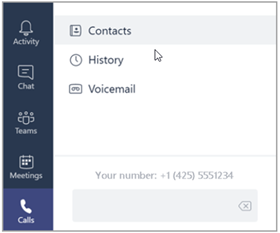

# Configurar el Sistema telefónico en su organizaciónSetting up Phone System in your organization

The following is a step-by-step guide for setting up Phone System in Office 365. Links to additional, detailed information are available at the end of each step.The following is a step-by-step guide for setting up Phone System in Office 365. Links to additional, detailed information are available at the end of each step.

## Paso 1: asegurarse de que el sistema telefónico está disponible en su país o regiónStep 1: Make sure that Phone System is available in your country or region

1.  En primer lugar vaya a [Disponibilidad de país y región para los planes de audioconferencia y llamadas](country-and-region-availability-for-audio-conferencing-and-calling-plans/country-and-region-availability-for-audio-conferencing-and-calling-plans.md) y seleccione su país o región en la lista de la parte superior de la página.First go to [Country and region availability for Audio Conferencing and Calling Plans](country-and-region-availability-for-audio-conferencing-and-calling-plans/country-and-region-availability-for-audio-conferencing-and-calling-plans.md), and select your country or region from the list at the top of the page. 
2.  Bajo **Sistema telefónico**, revise la lista de las características y los detalles.Under **Phone System**, review the list of features and details. 
3.  Si el sistema telefónico está disponible, vaya al paso 2.If Phone System is available, go to step 2. 

**Para obtener más información acerca de la disponibilidad regional del sistema telefónico y de la audioconferencia, consulte [Disponibilidad de país y región para los planes de audioconferencia y llamadas](country-and-region-availability-for-audio-conferencing-and-calling-plans/country-and-region-availability-for-audio-conferencing-and-calling-plans.md).****To learn more about regional availability of Phone System and Audio Conferencing, see [Country and region availability for Audio Conferencing and Calling Plans](country-and-region-availability-for-audio-conferencing-and-calling-plans/country-and-region-availability-for-audio-conferencing-and-calling-plans.md).**

## Paso 2: comprar y asignar licencias del sistema telefónico y del plan de llamadasStep 2: Buy and assign Phone System and Calling Plan licenses

Para asignar una licencia del sistema telefónico y del plan de llamadas a un solo usuario los pasos son los mismos que para asignar una licencia de Office 365.To assign a Phone System and Calling Plan license to a single user the steps are the same as assigning an Office 365 license. Vea [las licencias de asignar los equipos de Microsoft](assign-teams-licenses.md).See [Assign Microsoft Teams licenses](assign-teams-licenses.md). Si desea asignar a varios usuarios de forma masiva, vea [licencias de asignar los equipos de Microsoft](assign-teams-licenses.md).If you want to assign multiple users in bulk, see [Assign Microsoft Teams licenses](assign-teams-licenses.md).

## Paso 3: Obtener los números de teléfono para los usuariosStep 3: Get phone numbers for your users

[] Para poder configurar los usuarios de su organización para que puedan recibir y realizar llamadas telefónicas, debe usar el Centro de administración de Skype Empresarial para obtener los números de teléfono.Before you can set up users in your organization to make and receive phone calls, you must get phone numbers for them.

Existen tres maneras de obtener números para los usuarios:You have three ways of getting numbers for your users:
- Obtener números nuevos con el Centro de administración de Skype Empresarial.Get new numbers using the Skype for Business admin center.
- Obtener números nuevos que no están disponibles en el centro de administración de Skype for Business.Get new numbers that aren't available in the Skype for Business admin center.
- Realizar la portabilidad de los números existentes de su proveedor de servicios u operador telefónico actual, o transferirlos.Port or transfer your existing numbers from your current service provider or phone carrier to Office 365.

You must use the **Add new user numbers** page to see, search, acquire, and reserve those numbers. You can search by Country/Region, State, and City, and then enter the number of phone numbers you will need for your users.You must use the **Add new user numbers** page to see, search, acquire, and reserve those numbers. You can search by Country/Region, State, and City, and then enter the number of phone numbers you will need for your users.

### Obtener los nuevos números de teléfono del usuarioGet new user phone numbers 
 
 **utilizando el Skype para el centro de administración de negocio** **Using the Skype for Business admin center**

1. Inicie sesión en Office 365 con su cuenta profesional o educativa.Sign in to Office 365 with your work or school account.

2. Vaya a **Centro de administración de Office 365** > **Skype Empresarial**.Go to the **Office 365 admin center** > **Skype for Business**.
    
3. En el panel de navegación izquierdo, vaya a **voz** > **los números de teléfono**, haga clic en **Agregar nuevo número** y, a continuación, haga clic en **nuevo usuario los números**.In the left navigation go to **Voice** > **Phone numbers**, click **Add new number** , and then click **New user numbers**.
    
### Obtener números nuevos que no están disponibles en el centro de administración de Skype for BusinessGet new numbers that aren't available in the Skype for Business admin center
  
Sometimes (depending on your country/region) you won't be able to get your new numbers using the Skype for Business admin center. In this case, you will need to download a form and send it back to us. See [Manage phone numbers for your organization](manage-phone-numbers-for-your-organization/manage-phone-numbers-for-your-organization.md) to learn how to request new user numbers.Sometimes (depending on your country/region) you won't be able to get your new numbers using the Skype for Business admin center. In this case, you will need to download a form and send it back to us. See [Manage phone numbers for your organization](manage-phone-numbers-for-your-organization/manage-phone-numbers-for-your-organization.md) to learn how to request new user numbers.   
  
### Realizar la portabilidad de los números de su proveedor de servicios u operador telefónico o transferirlosPort or transfer phone numbers from your service provider or phone carrier
  
- If you need 999 or fewer phone numbers for your users, you can use the **New Local Number Port Order** wizard in the Skype for Business admin center. Follow the steps found in [Transfer phone numbers to Office 365](transfer-phone-numbers-to-office-365.md) to transfer your phone numbers over to Skype for Business Online.If you need 999 or fewer phone numbers for your users, you can use the **New Local Number Port Order** wizard in the Skype for Business admin center. Follow the steps found in [Transfer phone numbers to Office 365](transfer-phone-numbers-to-office-365.md) to transfer your phone numbers over to Skype for Business Online.
    
- Si necesita más de 999 números de teléfono de puerto, vea [administrar los números de teléfono para su organización](manage-phone-numbers-for-your-organization/manage-phone-numbers-for-your-organization.md) para enviar una solicitud de servicio de orden de puerto o el orden para obtener todos estos números de teléfono que se pongan en puerto a Office 365.If you need to port more than 999 phone numbers, see [Manage phone numbers for your organization](manage-phone-numbers-for-your-organization/manage-phone-numbers-for-your-organization.md) to submit a port order service request or order to get all of these phone numbers ported over to Office 365. 

**Para obtener información detallada acerca de la obtención de nuevos números de teléfono o sobre transferir los números existentes, consulte [Administrar los números de teléfono de su organización](manage-phone-numbers-for-your-organization/manage-phone-numbers-for-your-organization.md).****For detailed information about getting new phone numbers or transferring existing numbers, see [Manage phone numbers for your organization](manage-phone-numbers-for-your-organization/manage-phone-numbers-for-your-organization.md).**

## Paso 4: obtener los números de teléfono de servicio (audioconferencia, colas de llamadas, operadores automáticos)Step 4: Get service phone numbers (audio conferencing, call queues, auto attendants)

In addition to getting phone numbers for your users from Office 365, you can search and acquire toll or toll-free phone numbers for services such as audio conferencing (for conference bridges), auto attendants, and call queues (also called service numbers). Service phone numbers have a higher concurrent calling capacity than user or subscriber phone numbers. For example, a service number can handle 100s of calls simultaneously, whereas a user's phone number can only handle a few calls simultaneously.In addition to getting phone numbers for your users from Office 365, you can search and acquire toll or toll-free phone numbers for services such as audio conferencing (for conference bridges), auto attendants, and call queues (also called service numbers). Service phone numbers have a higher concurrent calling capacity than user or subscriber phone numbers. For example, a service number can handle 100s of calls simultaneously, whereas a user's phone number can only handle a few calls simultaneously.

### Obtener nuevos números de servicioGet new service numbers

 **utilizando el Skype para el centro de administración de negocio** **Using the Skype for Business admin center**

1. Inicie sesión en Office 365 con su cuenta profesional o educativa.Sign in to Office 365 with your work or school account.

2. Vaya a **Centro de administración de Office 365** > **Skype Empresarial**.Go to the **Office 365 admin center** > **Skype for Business**.

3. En el panel de navegación izquierdo, vaya a **voz** > **los números de teléfono** > **Agregar nuevo número**y, a continuación, haga clic en **los números de servicio nueva**.In the left navigation go to **Voice** > **Phone numbers** > **Add new number**, and then click **New service numbers**.

    > [!IMPORTANT]
    > Para que pueda ver la opción de **voz** en la izquierda en la Skype para el centro de administración de negocio, primero debe comprar una licencia adicional para **Conferencias de Audio** , una licencia adicional para **El sistema de teléfono** o al menos una **licencia Enterprise E5**.For you to see the **Voice** option in the left navigation in the Skype for Business admin center, you must first buy at least one **Enterprise E5 license**, one **Phone System** add-on license, or one **Audio Conferencing** add-on license.

### Obtener números nuevos que no están disponibles en el centro de administración de Skype for BusinessGet new numbers that aren't available in the Skype for Business admin center
  
Sometimes (depending on your country/region) you won't be able to get your new numbers using the Skype for Business admin center. In this case, you will need to download a form and send it back to us. See [Manage phone numbers for your organization](manage-phone-numbers-for-your-organization/manage-phone-numbers-for-your-organization.md) to learn how to request new numbers.Sometimes (depending on your country/region) you won't be able to get your new numbers using the Skype for Business admin center. In this case, you will need to download a form and send it back to us. See [Manage phone numbers for your organization](manage-phone-numbers-for-your-organization/manage-phone-numbers-for-your-organization.md) to learn how to request new numbers. 

### Portabilidad o trasferencia de números de servicio existentesPort or transfer existing service numbers

If you want to transfer service numbers from your current service provider or carrier, you need to manually submit a port order to Microsoft. You have to submit separate port orders for each type of service number (toll vs. toll-free) that you will be transferring using a Letter of Authorization (LOA). In the Letter of Authorization (LOA), you must select the correct type of service number. When contacting Microsoft support, please make sure you specify that you are transferring a service number (*and not a user or subscriber number*), or the concurrent calling capacity may not be enough to handle call volumes. If you want to transfer phone numbers or do other things with your phone numbers, see [Manage phone numbers for your organization](manage-phone-numbers-for-your-organization/manage-phone-numbers-for-your-organization.md).If you want to transfer service numbers from your current service provider or carrier, you need to manually submit a port order to Microsoft. You have to submit separate port orders for each type of service number (toll vs. toll-free) that you will be transferring using a Letter of Authorization (LOA). In the Letter of Authorization (LOA), you must select the correct type of service number. When contacting Microsoft support, please make sure you specify that you are transferring a service number (*and not a user or subscriber number*), or the concurrent calling capacity may not be enough to handle call volumes. If you want to transfer phone numbers or do other things with your phone numbers, see [Manage phone numbers for your organization](manage-phone-numbers-for-your-organization/manage-phone-numbers-for-your-organization.md).

## Paso 5: si desea configurar planes de llamadasStep 5: If you want to set up Calling Plans

If you have been following the steps above, you have already bought and assigned Phone System and licenses and a Calling Plan (step 2) and acquired phone numbers for your users (step 3), so your calling plan is partially set up. Follow the three procedures below to complete the setup of your Calling Plan.If you have been following the steps above, you have already bought and assigned Phone System and licenses and a Calling Plan (step 2) and acquired phone numbers for your users (step 3), so your calling plan is partially set up. Follow the three procedures below to complete the setup of your Calling Plan.

### Agregar direcciones de emergencias y ubicaciones para su organizaciónAdd emergency addresses and locations for your organization

1. En la página **Voz**, elija **Ubicaciones de emergencia** > **Agregar**.On the **Voice** page, choose **Emergency locations** > **Add new address**.

2. En el panel **Nueva dirección**, introduzca un nombre para la dirección y, a continuación, complete los cuadros restantes.In the **New address** pane, enter a name for your address, and then complete the remaining boxes.
    
     
  
    > [!TIP]
    > Para los clientes que hablan inglés, si el nombre de la calle es un número, asegúrese de incluir "st" o "th" al final, como se muestra en la imagen anterior.For English customers, if the street name is a number, be sure to include "st" or "th" at the end, as shown in the above picture.

3. Elija **Validar**.Choose **Validate**.

    Si es necesario, se le pedirá que realice correcciones a la dirección.If needed, you'll be prompted to make corrections to the address.

    > [!CAUTION]
    > Validar una dirección civil o postal implica asegurarse de que sea legítima y tenga el formato correcto. Es posible que una dirección de emergencia parcialmente correcta, por ejemplo con el nombre de la ciudad mal escrito, pueda seguir pasando como válida. Incluso si está mal escrita, pero pasó la validación, la combinación del nombre de la ciudad mal escrito junto con las demás partes correctas de la dirección constituye información suficiente para dirigir la llamada al centro de distribución emergencia correspondiente.Validating a street or civic address involves making sure that it is legitimate and correctly formatted. It is possible that a partially correct emergency address, such as if you mistyped the name of the city, may still pass validation. Even though it's misspelled and passed validation, the combination of the misspelled name of city along with the other correct parts of the address are enough information to route the call to the appropriate emergency dispatch center.

    > [!TIP]
    > Si es necesario corregir la dirección para una respuesta de emergencia, se mostrará un banner verde que le informa que la dirección se ha actualizado.If the address needs to be corrected for emergency response, a green banner will appear notifying you that the address was updated.

4. Después de validar la dirección, elija **Guardar**.After the address is validated, choose **Save**.

### Asigne números de teléfono y direcciones de emergencia a los usuariosAssign phone numbers and emergency addresses to users

> [!TIP]
> Si agrega más personas a la empresa justo antes de realizar este paso, es posible que demoren **varias horas** en aparecer en la página **Usuarios de voz**. Existe latencia.If you add more people to your business right before doing this step, it may take **several hours** for them to appear on the **Voice users** page. There's a latency.

1. En la página **Usuarios de voz**, elija la persona a la que quiera asignar un número de teléfono y una dirección de emergencia.On the **Voice users** page, select the people who you want to assign a phone number and emergency address to.

2. Elija **Asignar número**.In the Action pane, click **Assign number**.

3. En la página **Asignar número**, en el menú desplegable **Seleccione el número que desea asignar**, seleccione el número de teléfono para el usuario.On the **Assign number** page, in the **Select number to assign** list, select the phone number for the user.

4. Para seleccionar una dirección de emergencia, escriba el nombre de la ciudad en el cuadro **Buscar ciudad** y elija Buscar.To select an emergency address, enter name of the city in the box and choose **Search**.

    > [!IMPORTANT]
    > Si se encuentra fuera de los Estados Unidos, los números ya tienen una dirección de emergencia, pero puede cambiarla ahora. Consulte [Asignar o cambiar la dirección de emergencia de un usuario](/skypeforbusiness/what-are-calling-plans-in-office-365/assign-or-change-an-emergency-address-for-a-user).If you are outside the United States, your numbers already have an emergency address, but you can change it now. See [Assign or change an emergency address for a user](/skypeforbusiness/what-are-calling-plans-in-office-365/assign-or-change-an-emergency-address-for-a-user). 
  
5. Después de asignar el número de teléfono y la dirección de emergencia, elija **Guardar**.After you assign both the phone number and emergency address, choose **Save**.

### Indique a los usuarios acerca de sus números de teléfono nuevoTell your users about their new phone numbers

Recomendamos enviar correo o usar el método de comunicación preferido de su empresa para informar a sus miembros los nuevos números de teléfono.We recommend sending mail or using your business's preferred communication method to tell the people about their new phone numbers.

Aquí es cómo pueden ver ese número de teléfono en su aplicación de **Skype para la empresa** :Here's how they can see that phone number in their **Skype for Business** app:

1. Inicie sesión en Skype Empresarial en el escritorio.Sign in to Skype for Business on your desktop.
    
2. Elija **Configuración** > **Herramientas** > **Opciones**.Choose **Settings** > **Tools** > **Options**. 
    
     
  
3. A continuación, elija **Teléfonos**.Then choose **Phones**. 
    
    
 
In **Microsoft Teams**, users can see their phone number by clicking **Calls** in the left navigation. The phone number is shown above the dial pad.In **Microsoft Teams**, users can see their phone number by clicking **Calls** in the left navigation. The phone number is shown above the dial pad.

**Para obtener información más detallada acerca de todos los pasos necesarios para configurar un plan de llamadas, consulte [Configurar planes de llamadas](set-up-calling-plans.md).****For more detailed information about all of the steps involved in setting up a Calling Plan, see [Set up Calling Plans](set-up-calling-plans.md).**

## Paso 6: si desea configurar la audioconferenciaStep 6: If you want to set up Audio Conferencing

Sometimes people in your organization will need to use a phone to call in to a meeting. Skype for Business and Microsoft Teams include the audio conferencing feature for just this situation! People can call in to Skype for Business or Microsoft Teams meetings using a phone, instead of using the Skype for Business or Microsoft Teams app on a mobile device or PC.Sometimes people in your organization will need to use a phone to call in to a meeting. Skype for Business and Microsoft Teams include the audio conferencing feature for just this situation! People can call in to Skype for Business or Microsoft Teams meetings using a phone, instead of using the Skype for Business or Microsoft Teams app on a mobile device or PC.

You only need to set up Audio Conferencing for people who plan to schedule or lead meetings. Meeting attendees who dial in don't need any licenses assigned to them or other setup.You only need to set up Audio Conferencing for people who plan to schedule or lead meetings. Meeting attendees who dial in don't need any licenses assigned to them or other setup.
  
Para ver las preguntas más frecuentes acerca de las audioconferencias, consulte [Preguntas frecuentes sobre audioconferencias](audio-conferencing-common-questions.md).For frequently asked questions about Audio Conferencing, see [Audio Conferencing common questions](audio-conferencing-common-questions.md).
    
1. Si ha comprado licencias del complemento de **audioconferencia** y licencias de créditos de comunicaciones, asígnelas también.If you purchased **Audio Conferencing** add-on licenses and Communications Credits licenses, assign them too. Para obtener instrucciones, vea [licencias de asignar los equipos de Microsoft](assign-teams-licenses.md).For instructions, see [Assign Microsoft Teams licenses](assign-teams-licenses.md).

    Decide on your audio conferencing provider. An audio conferencing provider supplies an audio conferencing bridge. The conferencing bridge sets your dial-in phone numbers, PINs, and conference IDs for meetings. Decide whether to use Microsoft or a third-party audio conferencing provider:Decide on your audio conferencing provider. An audio conferencing provider supplies an audio conferencing bridge. The conferencing bridge sets your dial-in phone numbers, PINs, and conference IDs for meetings. Decide whether to use Microsoft or a third-party audio conferencing provider:

    > [!NOTE]
    > Los usuarios de Microsoft Teams no usuario un proveedor de conferencia de audio de terceros.Microsoft Teams users can't user a third-party audio conferencing provider.

    - **Microsoft como su proveedor de audioconferencias**: si busca la solución más sencilla, elija a Microsoft como su proveedor de audioconferencias.**Microsoft as your audio conferencing provider**: If you want the easiest solution for audio conferencing, choose Microsoft as your audio conferencing provider.
    
    - **Third party as your audio conferencing provider**: If you are in a country where Audio Conferencing in Office 365 isn't available, the service quality isn't great because of its location, or you have an existing contract, choose a third-party audio conferencing provider. To find a provider, go to [Microsoft PinPoint](http://go.microsoft.com/fwlink/?LinkId=797530).**Third party as your audio conferencing provider**: If you are in a country where Audio Conferencing in Office 365 isn't available, the service quality isn't great because of its location, or you have an existing contract, choose a third-party audio conferencing provider. To find a provider, go to [Microsoft PinPoint](http://go.microsoft.com/fwlink/?LinkId=797530).
 
2. Assign the audio conferencing provider to people who lead or schedule meetings. See [Assign Microsoft as the audio conferencing provider](/skypeforbusiness/audio-conferencing-in-office-365/assign-microsoft-as-the-audio-conferencing-provider).Assign the audio conferencing provider to people who lead or schedule meetings. See [Assign Microsoft as the audio conferencing provider](/skypeforbusiness/audio-conferencing-in-office-365/assign-microsoft-as-the-audio-conferencing-provider).

3. Set up meeting invitations. The following steps are optional, but a lot of admins like to do them:Set up meeting invitations. The following steps are optional, but a lot of admins like to do them: 
  
   1. [Personalizar invitaciones a reuniones en Skype para la empresa](/skypeforbusiness/set-up-skype-for-business-online/customize-meeting-invitations).[Customize meeting invitations in Skype for Business](/skypeforbusiness/set-up-skype-for-business-online/customize-meeting-invitations). Los números de acceso telefónico que se establecen para el usuario se agregan automáticamente a las invitaciones de las reuniones que se envían a los asistentes.The dial-in numbers that are set for the user will be automatically added to the meeting invitations that are sent to attendees. Sin embargo, puede agregar sus propios vínculos de ayuda y de avisos legales, un mensaje de texto y un pequeño distintivo gráfico de la empresa.However, you can add your own help and legal links, a text message, and small company graphic.
    
   2. Establecer los números de teléfono de conferencia de Audio para los organizadores que están incluidos en la reunión invitaciones [en Skype para la empresa](/skypeforbusiness/audio-conferencing-in-office-365/set-the-phone-numbers-included-on-invites) o [en los equipos de Microsoft](set-the-phone-numbers-included-on-invites-in-teams.md).Set the Audio Conferencing phone numbers for meeting organizers that are included on invites [in Skype for Business](/skypeforbusiness/audio-conferencing-in-office-365/set-the-phone-numbers-included-on-invites) or [in Microsoft Teams](set-the-phone-numbers-included-on-invites-in-teams.md). Este es el número de teléfono que se mostrará en la reunión que está programada por el usuario.This is the phone number that will show up in the meeting that is scheduled by the user.
    
   3. Establecer los idiomas de operador automático para conferencias de Audio [en Skype para la empresa](/skypeforbusiness/audio-conferencing-in-office-365/set-auto-attendant-languages-for-audio-conferencing) o [en los equipos de Microsoft](set-auto-attendant-languages-for-audio-conferencing-in-teams.md) que usa el operador automático de conferencia de audio para saludar a un autor de la llamada al conectarse a un número de teléfono de conferencia de Audio.Set auto attendant languages for Audio Conferencing [in Skype for Business](/skypeforbusiness/audio-conferencing-in-office-365/set-auto-attendant-languages-for-audio-conferencing) or [in Microsoft Teams](set-auto-attendant-languages-for-audio-conferencing-in-teams.md) that the audio conferencing auto attendant uses to greet a caller when they dial in to an Audio Conferencing phone number. Este paso solo se aplica si está utilizando Microsoft como su proveedor de audioconferencias.This step only applies if you're using Microsoft as your audio provider.
    
   4. Establecer la longitud del eje para las reuniones de conferencia de Audio [en los equipos de Microsoft](set-the-pin-length-for-audio-conferencing-meetings-in-teams.md).Set the length of the PIN for Audio Conferencing meetings [in Microsoft Teams](set-the-pin-length-for-audio-conferencing-meetings-in-teams.md).
    
      > [!NOTE]
      > This feature is not yet available to customers using Office 365 operated by 21Vianet in China. To learn more, see [Learn about Office 365 operated by 21Vianet](https://support.office.com/article/A8AB5061-3346-4DA0-BB7C-5260822B53AE).This feature is not yet available to customers using Office 365 operated by 21Vianet in China. To learn more, see [Learn about Office 365 operated by 21Vianet](https://support.office.com/article/A8AB5061-3346-4DA0-BB7C-5260822B53AE).

**Para obtener más información acerca de las audioconferencias, consulte [Configurar las audioconferencias](/skypeforbusiness/audio-conferencing-in-office-365/set-up-audio-conferencing).****For more information about Audio Conferencing, see [Set up Audio Conferencing](/skypeforbusiness/audio-conferencing-in-office-365/set-up-audio-conferencing).**

## Paso 7: si desea configurar una cola de llamadas del sistema telefónicoStep 7: If you want to set up a Phone System call queue

Phone System call queues include greetings that are used when someone calls in to a phone number for your organization, the ability to automatically put the calls on hold, and the ability to search for the next available call agent to handle the call while the people who call are listening to music on hold. You can create single or multiple call queues for your organization.Phone System call queues include greetings that are used when someone calls in to a phone number for your organization, the ability to automatically put the calls on hold, and the ability to search for the next available call agent to handle the call while the people who call are listening to music on hold. You can create single or multiple call queues for your organization.

Before you can create and set up your call queues, you will need to get or transfer your existing toll or toll-free service numbers. After you get the toll or toll-free service phone numbers, they will show up in **Skype for Business admin center** > **Voice** > **Phone numbers**, and the **Number type** listed will be listed as **Service - Toll-Free**. To get your service numbers, see [Getting service phone numbers for Skype for Business and Microsoft Teams](/SkypeForBusiness/what-is-phone-system-in-office-365/getting-service-phone-numbers) or if you want to transfer and existing service number, see [Transfer phone numbers to Office 365](transfer-phone-numbers-to-office-365.md).Before you can create and set up your call queues, you will need to get or transfer your existing toll or toll-free service numbers. After you get the toll or toll-free service phone numbers, they will show up in **Skype for Business admin center** > **Voice** > **Phone numbers**, and the **Number type** listed will be listed as **Service - Toll-Free**. To get your service numbers, see [Getting service phone numbers for Skype for Business and Microsoft Teams](/SkypeForBusiness/what-is-phone-system-in-office-365/getting-service-phone-numbers) or if you want to transfer and existing service number, see [Transfer phone numbers to Office 365](transfer-phone-numbers-to-office-365.md).
  
> [!NOTE]
> If you are outside the United States, you can't use the Skype for Business admin center to get service numbers. Go to [Manage phone numbers for your organization](manage-phone-numbers-for-your-organization/manage-phone-numbers-for-your-organization.md) instead to see how to do it from the outside of the United States.If you are outside the United States, you can't use the Skype for Business admin center to get service numbers. Go to [Manage phone numbers for your organization](manage-phone-numbers-for-your-organization/manage-phone-numbers-for-your-organization.md) instead to see how to do it from the outside of the United States.

Para crear una nueva cola de llamadas, en el **Centro de administración de Skype for Business**, haga clic en **Enrutamiento de llamadas** > **Colas de llamadas**, luego haga clic en **Agregar nuevo** y a continuación siga las instrucciones que aparecen en el **Paso 3** de [Crear una cola de llamadas del sistema telefónico](/SkypeForBusiness/what-is-phone-system-in-office-365/create-a-phone-system-call-queue#step-3---create-a-new-call-queue).To create a new call queue, in the **Skype for Business admin center**, click **Call routing** > **Call queues**, click **Add new**, and then follow the instructions in **Step 3** of  [Create a Phone System call queue](/SkypeForBusiness/what-is-phone-system-in-office-365/create-a-phone-system-call-queue#step-3---create-a-new-call-queue).

**Para obtener más información acerca de las colas, consulte [Crear una cola de llamadas del sistema telefónico](/SkypeForBusiness/what-is-phone-system-in-office-365/create-a-phone-system-call-queue).****For more details about call queues, see [Create a Phone System call queue](/SkypeForBusiness/what-is-phone-system-in-office-365/create-a-phone-system-call-queue).**

## Paso 8: si desea configurar un operador automático del sistema telefónicoStep 8: If you want to set up a Phone System auto attendant

Auto attendants let people that call in to your organization and navigate a menu system to get them to the right department, call queue, person, or the operator. You can create an auto attendant for your organization by using the Skype for Business admin center.Auto attendants let people that call in to your organization and navigate a menu system to get them to the right department, call queue, person, or the operator. You can create an auto attendant for your organization by using the Skype for Business admin center.

Para crear un nuevo operador automático, en el centro de administración de Skype for Business, haga clic en **Enrutamiento de llamadas** > **Operadores automáticos**, y luego haga clic en **Agregar nuevo** y a continuación siga las instrucciones para cada página en el **Paso 2** de [Configurar un operador automático del sistema telefónico](/SkypeForBusiness/what-is-phone-system-in-office-365/set-up-a-phone-system-auto-attendant#step-2---create-a-new-auto-attendant).To create a new auto attendant, in the Skype for Business admin center, click **Call routing** > **Auto attendants**, click **Add new**, and then follow the instructions for each page in **Step 2** of [Set up a Phone System auto attendant](/SkypeForBusiness/what-is-phone-system-in-office-365/set-up-a-phone-system-auto-attendant#step-2---create-a-new-auto-attendant).

**Para obtener más información sobre los operadores automáticos, consulte [Configurar un operador automático del sistema telefónico](/SkypeForBusiness/what-is-phone-system-in-office-365/set-up-a-phone-system-auto-attendant).****For more details about Phone System auto attendants, see [Set up a Phone System auto attendant](/SkypeForBusiness/what-is-phone-system-in-office-365/set-up-a-phone-system-auto-attendant).**

## Paso 9: asignar los números de teléfono de servicio (audioconferencia, colas de llamadas, operadores automáticos)Step 9: Assign service phone numbers (audio conferencing, call queues, auto attendants)

Once you have your service numbers from **Step 4 above**, you need to assign them to each type of service that you want. For example, if you want a dedicated service phone number (toll or toll-free), you will need to assign the number to the conferencing bridge.Once you have your service numbers from **Step 4 above**, you need to assign them to each type of service that you want. For example, if you want a dedicated service phone number (toll or toll-free), you will need to assign the number to the conferencing bridge.

- Para audioconferencias, puede asignar un número dedicado a un puente de conferencias yendo al **Centro de administración de Office 365** > **Centros de administración** > **Skype for Business** > **Audioconferencias** y haciendo clic en el puente de conferencia, o consultando [Cambiar los números de teléfono de pago o gratuitos en su puente de audioconferencias](change-the-phone-numbers-on-your-audio-conferencing-bridge.md).For Audio Conferencing, you can assign a dedicated number to a conferencing bridge by going to **Office 365 admin center** > **Admin centers** > **Skype for Business** > **Audio conferencing** and click on the conference bridge or by seeing  [Change the toll or toll-free numbers on your Audio Conferencing bridge](change-the-phone-numbers-on-your-audio-conferencing-bridge.md).

- For Auto Attendants, you can assign a dedicated number to an auto attendant by going to **Office 365 admin center** > **Admin centers** > **Skype for Business** > **Call routing** > **Auto attendants** and click on the auto attendant. On the **General** page the service number you already have will be listed in the **Phone number** drop down. For details, see [Set up a Phone System Auto Attendant](/SkypeForBusiness/what-is-phone-system-in-office-365/set-up-a-phone-system-auto-attendant).For Auto Attendants, you can assign a dedicated number to an auto attendant by going to **Office 365 admin center** > **Admin centers** > **Skype for Business** > **Call routing** > **Auto attendants** and click on the auto attendant. On the **General** page the service number you already have will be listed in the **Phone number** drop down. For details, see [Set up a Phone System Auto Attendant](/SkypeForBusiness/what-is-phone-system-in-office-365/set-up-a-phone-system-auto-attendant).

- For Call Queues, you can assign a dedicated number to a call queue by going to **Office 365 admin center** > **Admin centers** > **Skype for Business** > **Call routing** > **Call queues** and click on the call queue. On the **General** page the service number you already have will be listed in the **Phone number** drop down. For details, see [Create a Phone System call queue](/SkypeForBusiness/what-is-phone-system-in-office-365/create-a-phone-system-call-queue).For Call Queues, you can assign a dedicated number to a call queue by going to **Office 365 admin center** > **Admin centers** > **Skype for Business** > **Call routing** > **Call queues** and click on the call queue. On the **General** page the service number you already have will be listed in the **Phone number** drop down. For details, see [Create a Phone System call queue](/SkypeForBusiness/what-is-phone-system-in-office-365/create-a-phone-system-call-queue).

**Para ver información detallada sobre cómo obtener nuevos números de servicio y hacer la portabilidad de otros ya existentes, consulte [Obtener números de teléfono de servicio](/SkypeForBusiness/what-is-phone-system-in-office-365/getting-service-phone-numbers).****For detailed information about getting new service numbers and porting existing service numbers, see [Getting service phone numbers](/SkypeForBusiness/what-is-phone-system-in-office-365/getting-service-phone-numbers).**

## Paso 10: Configurar Communications créditos para su organizaciónStep 10: Set up Communications Credits for your organization

You will need to set up Communications Credits if you would like to use toll-free numbers with Skype for Business and Microsoft Teams. Also, we recommend that you set up Communications Credits for your Calling Plans (Domestic or International) and Audio Conferencing users who need the ability to dial out to **any destination**. Many countries/regions are included, but some destinations may not be included in your Calling Plan or Audio Conferencing subscriptions. If you don't set up Communications Credits billing and assign a **Communications Credits** license to your users and you run out minutes for your organization (depending on your Calling Plan or Audio Conferencing plan in your country/region), those users won't be able to make calls or dial out from Audio Conferencing meetings. You can get more information, including recommended funding amounts, by reading [What are Communications Credits?](what-are-communications-credits.md)You will need to set up Communications Credits if you would like to use toll-free numbers with Skype for Business and Microsoft Teams. Also, we recommend that you set up Communications Credits for your Calling Plans (Domestic or International) and Audio Conferencing users who need the ability to dial out to **any destination**. Many countries/regions are included, but some destinations may not be included in your Calling Plan or Audio Conferencing subscriptions. If you don't set up Communications Credits billing and assign a **Communications Credits** license to your users and you run out minutes for your organization (depending on your Calling Plan or Audio Conferencing plan in your country/region), those users won't be able to make calls or dial out from Audio Conferencing meetings. You can get more information, including recommended funding amounts, by reading [What are Communications Credits?](what-are-communications-credits.md)
  
> [!NOTE]
> Para saber cuánto cuesta, [consulte aquí las tarifas](https://go.microsoft.com/fwlink/p/?LinkId=799523 ).To find out how much it costs, [see the rates here](https://go.microsoft.com/fwlink/p/?LinkId=799523 ).

### Configurar créditos de comunicacionesTo set up Communications Credits

1. Inicie sesión en Office 365 con su cuenta profesional o educativa.Sign in to Office 365 with your work or school account.

2. En el panel de navegación izquierdo del centro de administración de Office 365, vaya a **Facturación** > **Suscripciones** > **Complementos** > **Comprar complementos**, y a continuación elija **Créditos de comunicaciones** > **Comprar ahora**.In the left navigation of the Office 365 admin center, go to **Billing** > **Subscriptions** > **Add-ons** > **Buy add-ons**, and then choose **Communications Credits** > **Buy now**.

3. En la página de suscripción de los **Créditos de comunicaciones**, rellene la información y después haga clic en **Siguiente**.On the **Communications Credits** subscription page, fill in your information, and then click **Next**.

4. Escriba la información de pago y haga clic en **Realizar pedido**.Enter your payment information and click **Place order**.
    >[!IMPORTANT]
    >If you are a volume licensing customer, you may choose your enterprise agreement number for payment. If you have multiple enterprise agreement numbers, you will be able to select which enterprise agreement you would like to use for payment. You will also be given an opportunity to specify a purchase order number to associate with the enterprise agreement number (if applicable).If you are a volume licensing customer, you may choose your enterprise agreement number for payment. If you have multiple enterprise agreement numbers, you will be able to select which enterprise agreement you would like to use for payment. You will also be given an opportunity to specify a purchase order number to associate with the enterprise agreement number (if applicable).
    
**Para obtener información más detallada acerca de cómo configurar créditos de comunicaciones, consulte [Configurar créditos de comunicaciones para su organización](set-up-communications-credits-for-your-organization.md).****For more detailed information about setting up Communications Credits, see [Set up Communications Credits for your organization](set-up-communications-credits-for-your-organization.md).**
  
### Asignar una licencia de créditos de comunicaciones a los usuariosAssign a Communications Credits license to users

1. Inicie sesión en Office 365 con su cuenta profesional o educativa.Sign in to Office 365 with your work or school account.

2. En la izquierda el centro de administración de Office 365, vaya a **los usuarios** > **usuarios activos**y, a continuación, seleccione un usuario o usuarios de la lista.In the left navigation of the Office 365 admin center, go to **Users** > **Active users**, and then select a user or users from the list.

3. En el panel de acciones, en **Licencias de productos**, haga clic en **Editar**.In the Action pane under **Product licenses**, click **Edit**.

4. En la página **licencias de producto** , alternar **Communications créditos** **en** para asignar esta licencia y, a continuación, haga clic en **Guardar**.On the **Product licenses** page, toggle **Communications Credits** to **On** to assign this license, and then click **Save**.

    > [!NOTE]
    > Incluso si tiene usuarios que tengan asignados una licencia **Enterprise E5** , sigue siendo recomendable hacer esto.Even if you have users who are assigned an **Enterprise E5** license, it's still recommended that you do this.

**Para obtener más información acerca de la asignación de licencias de créditos de comunicaciones, consulte [Configurar créditos de comunicaciones para su organización](set-up-communications-credits-for-your-organization.md).****To learn more about assigning Communications Credits licenses, see [Set up Communications Credits for your organization](set-up-communications-credits-for-your-organization.md).**

## Temas relacionadosRelated topics
[Esto es lo obtiene con el Sistema telefónico de Office 365Here's what you get with Phone System in Office 365](here-s-what-you-get-with-phone-system.md)

[Obtener números de teléfono de servicio para Skype Empresarial y Microsoft TeamsGetting service phone numbers for Skype for Business and Microsoft Teams](/SkypeForBusiness/what-is-phone-system-in-office-365/getting-service-phone-numbers)

[Países y regiones donde Audioconferencia y Planes de llamada están disponiblesCountry and region availability for Audio Conferencing and Calling Plans](country-and-region-availability-for-audio-conferencing-and-calling-plans/country-and-region-availability-for-audio-conferencing-and-calling-plans.md)
    
  
 
