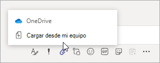

# Compartir archivos en Microsoft TeamsSharing files in Microsoft Teams

En Microsoft Teams, los usuarios pueden compartir contenido con otros usuarios de Teams dentro y fuera de su organización.In Microsoft Teams, users can share content with other Teams users within and outside their organization. El uso compartido en Teams se basa en la configuración establecida en SharePoint y OneDrive, por lo que todo lo que configure para SharePoint y OneDrive controlará también el uso compartido en Teams.Sharing in Teams is based on the settings configured in SharePoint and OneDrive, so whatever you set up for SharePoint and OneDrive will control sharing in Teams as well.

## Información generalOverview

Los usuarios pueden compartir archivos de OneDrive, desde los equipos y los sitios a los que tienen acceso y desde su equipo.Users can share files from OneDrive, from teams and sites they have access to, and from their computer. Para compartir un archivo, los usuarios pueden hacer lo siguiente:To share a file, users can do the following:

- En un canal, haga clic en **adjuntar** (el icono de clip), seleccione **recientes**, **examinar equipos y canales**, **OneDrive**o **cargar desde mi equipo**y, a continuación, elija el archivo que desea compartir.In a channel, click **Attach** (the paperclip icon), select **Recent**, **Browse Teams and Channels**, **OneDrive**, or **Upload from my computer**, and then choose the file they want to share.   
    
- En un chat, haga clic en **adjuntar** (el icono de clip), seleccione o **OneDrive** o **cargar desde mi equipo**y, a continuación, elija el archivo que desea compartir.In a chat, click **Attach** (the paperclip icon), select  or **OneDrive** or **Upload from my computer**, and then choose the file they want to share.  
    
- Copie y pegue el vínculo para compartir en el cuadro de redacción.Copy and paste the sharing link in the compose box. 
    

### Lo que debe saber sobre la experiencia de uso compartido de archivosWhat you need to know about the file sharing experience

### Permisos de archivos compartidos y vínculos de uso compartidoPermissions of shared files and sharing links

Cuando los usuarios comparten un archivo desplazándose hasta él en OneDrive o en equipos y canales, a todos los destinatarios se les concede acceso junto con los [permisos predeterminados que se establecen en el nivel de la organización](https://docs.microsoft.com/sharepoint/change-default-sharing-link).When users share a file by browsing to it in OneDrive or teams and channels, all recipients are granted access along with the [default permission that's set at the organization level](https://docs.microsoft.com/sharepoint/change-default-sharing-link).

Cuando un usuario copia y pega un vínculo de uso compartido, se consiguen los permisos establecidos en ese vínculo para compartir y la dirección URL de SharePoint se acorta al nombre de archivo.When a user copies and pastes a sharing link, the permissions set on that sharing link are honored and the SharePoint URL is shortened to the file name. En otras palabras, Teams usa solo el nombre de archivo para vincular a un archivo.In other words, Teams uses just the file name to link to a file.

Cuando los usuarios comparten un archivo desde Teams, pueden establecer quién puede acceder al archivo de la misma manera que en Microsoft 365.When users share a file from within Teams, they can set who can access the file just like they do across Microsoft 365. Pueden dar acceso a cualquier persona, a las personas de su organización, a personas con acceso existente o a personas específicas (que pueden incluir a las personas en un chat de 1:1, una conversación grupal o un canal).They can give access to anyone, people in your organization, people with existing access, or specific people (which can include the people in a 1:1 chat, group chat, or channel).  Cuando un archivo está compartido, la vista previa del archivo está disponible en el mensaje, junto con todas las acciones de archivo, como **abrir en línea**, **Descargar**y **Copiar vínculo**.When a file is shared, the file preview is available in the message, along with all file actions such as **Open online**, **Download**, and **Copy link**. De forma predeterminada, el archivo se abre en Teams.By default, the file opens in Teams. En ocasiones, es posible que el vínculo para compartir no se haya convertido a una vista previa de archivo en el momento en que un usuario envía el mensaje.Sometimes, the sharing link may not have converted to a file preview by the time a user sends the message. El sistema generará la vista previa del archivo, pero en este escenario, el vínculo para compartir no se acortará al único nombre de archivo.The file preview will be generated by the system, but in this scenario, the sharing link won't be shortened to the only the file name.

Cuando los usuarios comparten un archivo en un canal o una conversación, se les notifica si algunos o todos los destinatarios no tienen permiso para ver el archivo.When users share a file in a chat or channel, they're notified whether some or all recipients don't have permission to view the file. Pueden cambiar los permisos del archivo antes de compartirlo haciendo clic en la flecha situada junto a la vista previa del archivo que aparece en el mensaje.They can change the permissions on the file before they share it by clicking the arrow next to the file preview that now appears in the message.

### Copiar un vínculo para compartir en TeamsCopy a sharing link in Teams

Los usuarios pueden copiar un vínculo para compartir de SharePoint y cambiar los permisos de uso compartido del mismo modo que en Microsoft 365.Users can copy a SharePoint sharing link and change sharing permissions just like they do across Microsoft 365. Pueden conceder acceso a cualquier persona, a personas de su organización, a personas con acceso existente o a personas específicas.They can give access to anyone, people in your organization, people with existing access, or specific people. El permiso predeterminado del vínculo es el mismo que el conjunto de permisos predeterminado en el nivel de la organización, a menos que los permisos del nivel del sitio de SharePoint lo reemplacen.The default permission of the link is the same as the default permission set at the organization level unless SharePoint site level permissions override it.

## Configurar el uso compartido en OneDrive y SharePointConfigure sharing in OneDrive and SharePoint

Para obtener más información sobre cómo compartir archivos en OneDrive y SharePoint, incluido cómo configurar el uso compartido y cómo activar y desactivar el uso compartido, vea:For more information about sharing files in OneDrive and SharePoint, including how to configure sharing and how to turn sharing on and off, see:

- [Información general sobre el uso compartido externo](https://docs.microsoft.com/sharepoint/external-sharing-overview) : describe lo que ocurre cuando los usuarios comparten, en función de lo que estén compartiendo y con quién.[External sharing overview](https://docs.microsoft.com/sharepoint/external-sharing-overview) - describes what happens when users share, depending on what they're sharing and with whom.

- [Administrar la configuración de uso compartido](https://docs.microsoft.com/sharepoint/turn-external-sharing-on-or-off) : describe cómo los administradores globales y de SharePoint pueden cambiar la configuración de uso compartido en el nivel de organización para SharePoint y OneDrive.[Manage sharing settings](https://docs.microsoft.com/sharepoint/turn-external-sharing-on-or-off) - describes how global and SharePoint admins can change their organization-level sharing settings for SharePoint and OneDrive.

- [Activar o desactivar el uso compartido externo en un sitio](https://docs.microsoft.com/sharepoint/change-external-sharing-site) : describe cómo los administradores globales y de SharePoint pueden activar o desactivar el uso compartido externo en un sitio.[Turn external sharing on or off for a site](https://docs.microsoft.com/sharepoint/change-external-sharing-site) – describes how global and SharePoint admins can turn external sharing on or off for a site.

- [Cambiar el tipo de vínculo predeterminado para un sitio](https://docs.microsoft.com/sharepoint/change-default-sharing-link) : describe cómo establecer el tipo de vínculo predeterminado para que sea más restrictivo.[Change the default link type for a site](https://docs.microsoft.com/sharepoint/change-default-sharing-link) - describes how to set the default link type so that it's more restrictive.

## Más informaciónMore information

- [Interacción de SharePoint Online y OneDrive para la Empresa con Microsoft TeamsHow SharePoint Online and OneDrive for Business interact with Microsoft Teams](sharepoint-onedrive-interact.md)

- [SharePoint y Teams: mejor juntosSharePoint and Teams: better together](https://techcommunity.microsoft.com/t5/Microsoft-SharePoint-Blog/SharePoint-and-Teams-Better-Together/ba-p/189593)

- [Compartir archivos y carpetas de OneDriveShare OneDrive files and folders](https://support.office.com/article/Share-OneDrive-files-and-folders-9fcc2f7d-de0c-4cec-93b0-a82024800c07#OS_Type=OneDrive_-_Business)

- [Compartir archivos o carpetas de SharePointShare SharePoint files or folders](https://support.office.com/article/share-sharepoint-files-or-folders-1fe37332-0f9a-4719-970e-d2578da4941c)
