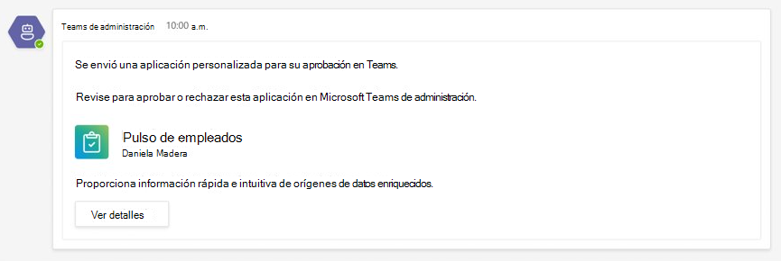
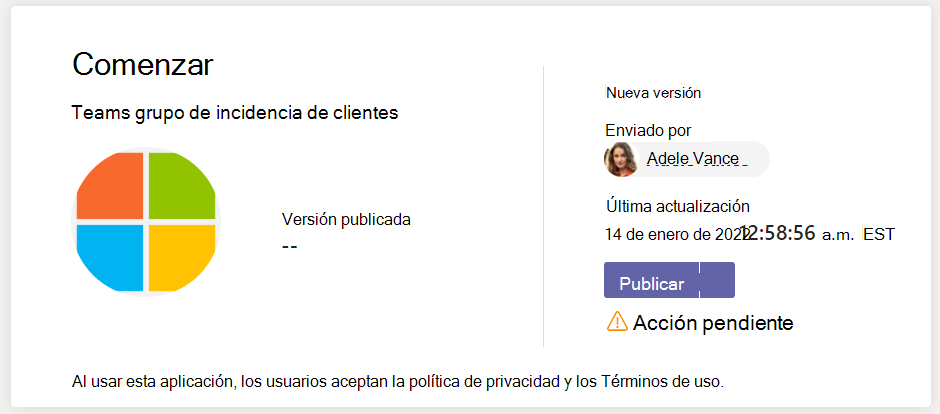

# Publicar una aplicación personalizada enviada a través de la API Teams de envío de aplicaciones

## Información general

> [!NOTE]
> Cuando publica una aplicación Teams personalizada, está disponible para los usuarios en la tienda de aplicaciones de su organización. Hay dos formas de publicar una aplicación personalizada y la forma en que se usa depende de cómo obtenga la aplicación. **Este artículo se centra en cómo** aprobar y publicar una aplicación personalizada que un desarrollador envía a través de la API Teams de envío de aplicaciones. El otro método, cargar una aplicación personalizada, se usa cuando un desarrollador le envía un paquete de aplicación .zip formato. Para obtener más información sobre ese método, vea [Publicar una aplicación personalizada cargando un paquete de aplicación](/microsoftteams/upload-custom-apps). El widget aprobar aplicación no está disponible en GCC inquilinos.

> [!IMPORTANT]
> Este método no está disponible actualmente para GCC entornos. Debe usar el método *de carga de una aplicación* personalizada.

En este artículo se proporcionan instrucciones de un extremo a otro sobre cómo llevar la aplicación Teams desde el desarrollo hasta la implementación hasta la detección. Encontrará información general sobre las experiencias conectadas que Teams proporciona en todo el ciclo de vida de la aplicación para simplificar cómo desarrollar, implementar y administrar aplicaciones personalizadas en la tienda de aplicaciones de su organización.

Abarcaremos cada paso del ciclo de vida, incluida la manera en que los desarrolladores pueden usar la API de envío de aplicaciones de Teams para enviar aplicaciones personalizadas directamente al Centro de administración de Microsoft Teams para que pueda revisarlas y aprobarlas, cómo establecer directivas para administrar aplicaciones para los usuarios de su organización y cómo los usuarios las descubren en Teams.

Esta guía se centra en los Teams de la aplicación y está destinada a administradores y profesionales de TI. Para obtener información sobre cómo Teams aplicaciones, vea la documentación Teams [desarrollador.](/microsoftteams/platform)

## Desarrollar

### Crear la aplicación

La Microsoft Teams de desarrolladores facilita a los desarrolladores la integración de sus propias aplicaciones y servicios para mejorar la productividad, tomar decisiones más rápidamente y crear colaboración en torno al contenido y flujos de trabajo existentes. Las aplicaciones integradas en Teams plataforma son puentes entre el cliente Teams y sus servicios y flujos de trabajo, lo que las lleva directamente al contexto de su plataforma de colaboración. Para obtener más información, vaya a la Teams [del desarrollador](/microsoftteams/platform).

### Enviar la aplicación

Cuando la aplicación esté lista para su uso en producción, el desarrollador puede enviar la aplicación mediante la API de envío de aplicaciones de Teams Graph, que se puede llamar desde una [API](/graph/api/teamsapp-publish?view=graph-rest-beta&tabs=http#example-2-upload-a-new-application-for-review-to-an-organizations-app-catalog), un entorno de desarrollo integrado (IDE) como Visual Studio Code o una plataforma como Power Apps y Power Virtual Agents. Al hacerlo, la aplicación está disponible en  la página Administrar aplicaciones del centro de administración de Microsoft Teams, donde puede revisarla y aprobarla.

La API de envío de aplicaciones de Teams, integrada en [Microsoft Graph](/graph/api/teamsapp-publish?tabs=http&view=graph-rest-beta#example-2-upload-a-new-application-for-review-to-an-organizations-app-catalog), permite que su organización se desarrolle en la plataforma que prefiera y automatiza el proceso de envío a aprobación para aplicaciones personalizadas en Teams.

Este es un ejemplo del aspecto que tiene este paso de envío de aplicaciones en Visual Studio Code:

Tenga en cuenta que esto todavía no publica la aplicación en la tienda de aplicaciones de su organización. Este paso envía la aplicación al centro de administración de Microsoft Teams donde puede aprobarla para su publicación en la tienda de aplicaciones de su organización.

Para obtener más información sobre cómo usar la API Graph para enviar aplicaciones, vea [aquí](/graph/api/teamsapp-publish?tabs=http&view=graph-rest-beta#example-2-upload-a-new-application-for-review-to-an-organizations-app-catalog).

## Notificar

Puede activar las notificaciones para que sepa cuándo los desarrolladores envían una nueva aplicación para su revisión y aprobación. También verá notificaciones cuando los desarrolladores envíen actualizaciones de aplicaciones. Para habilitar las notificaciones de envío de aplicaciones en el centro de administración de Teams, vaya a Notificaciones [**&** **alertsRulesApp** >  >  **submissions**](https://admin.teams.microsoft.com/notifications/rules) y active la regla cambiando el estado a Activo. Esta configuración está desactivada de forma predeterminada. Debe ser administrador global o administrador Teams para activar esta configuración.

Después de activar esta configuración, verá notificaciones en el equipo **alertas** y notificaciones de administrador en un nuevo canal denominado **Envíos de aplicaciones**. Como alternativa, puede elegir un equipo y un canal existentes para que las notificaciones se entreguen a un equipo y canal especificados. Para ello, siga estos pasos:

1. En la **regla Envíos de** aplicaciones, seleccione la casilla **Alerta de canal** en **Acciones**.
1. Elija el **botón Seleccionar canal** .
1. Busque un equipo para agregar.
1. Busque un canal para agregar.
1. Seleccione **Aplicar**.

    

> [!NOTE]
> Seleccione la **casilla Alerta de canal** predeterminada para recibir notificaciones al equipo **alertas** y notificaciones de administrador en el canal **Envíos de** aplicaciones.

También puede configurar las notificaciones en un webhook externo especificando una dirección URL de webhook pública después de seleccionar la casilla **Webhook** . Se enviará una carga de notificación JSON a la dirección URL del webhook.

Después de configurar la regla de envíos de aplicaciones, puede revisar las tarjetas de notificación en el canal especificado para ver los detalles  de la aplicación y seleccionar Ver detalles para abrir aplicaciones en el centro de administración de Teams.

## Validar

La [página Administrar aplicaciones](/microsoftteams/manage-apps) del centro de administración de Microsoft Teams (en el panel de navegación izquierdo, vaya [**Teams aplicaciones** >  **De**](https://admin.teams.microsoft.com/manage-apps) administración de aplicaciones), le ofrece una vista de todas las Teams de su organización. El **widget De aprobación** pendiente en la parte superior de la página le permite saber cuándo se envía una aplicación personalizada para su aprobación.

En la tabla, una aplicación recién enviada muestra automáticamente un estado **de** publicación de **Enviado** y **Estado** de **bloqueado**. Puede ordenar la **columna Estado de publicación** en orden descendente para buscar rápidamente la aplicación.

Haga clic en el nombre de la aplicación para ir a la página de detalles de la aplicación. En la **pestaña** Acerca de, puede ver detalles sobre la aplicación, como la descripción, el estado, el enviador y el id. de la aplicación.

Para obtener más información sobre cómo usar la API Graph para comprobar el estado **de publicación**, vea [aquí](/graph/api/appcatalogs-list-teamsapps?tabs=http&view=graph-rest-beta#example-3-find-application-based-on-the-teams-app-manifest-id).

## Publicar

Cuando esté listo para que la aplicación esté disponible para los usuarios, publique la aplicación.

1. En el panel de navegación izquierdo del Centro de administración de Microsoft Teams, vaya a **Aplicaciones de Teams** > **Administrar aplicaciones**.
2. Haga clic en el nombre de la aplicación para ir a la página de detalles de la aplicación y, a continuación, en el cuadro Estado **de publicación** , seleccione **Publicar**.

    

Después de publicar la aplicación, el estado **De publicación** cambia a  Publicado **y el estado** cambia automáticamente a **Permitido**.

## Configurar y administrar

### Controlar el acceso a la aplicación

De forma predeterminada, todos los usuarios de su organización pueden acceder a la aplicación en la tienda de aplicaciones de su organización. Para restringir y controlar quién tiene permiso para usar la aplicación, puede crear y asignar una directiva de permisos de aplicación. Para obtener más información, consulte [Administrar configuración y directivas de aplicación personalizadas en Teams](teams-app-permission-policies.md).

### Anclar e instalar la aplicación para que los usuarios lo descubran

De forma predeterminada, para que los usuarios encuentren la aplicación que tienen que ir a la tienda de aplicaciones de su organización y examinarla o buscarla. Para que sea más fácil para los usuarios acceder a la aplicación, puede anclar la aplicación a la barra de aplicaciones en Teams. Para ello, cree una directiva de configuración de la aplicación y asígnela a los usuarios. Para obtener más información, consulte [Administrar las directivas de configuración de aplicaciones en Teams](teams-app-setup-policies.md).

### Buscar en el registro de auditoría Teams eventos de la aplicación

Puede buscar en el registro de auditoría para ver Teams de aplicaciones de su organización. Para obtener más información sobre cómo buscar en el registro de auditoría y ver una lista de las actividades de Teams que se registran en el registro de auditoría, vea Buscar eventos en el registro de auditoría en [Teams](audit-log-events.md).

Para que pueda buscar en el registro de auditoría, primero debe activar la característica de auditoría en el [Centro de seguridad y cumplimiento](https://sip.protection.office.com/). Para obtener más información, consulte [Activar o desactivar la búsqueda de registros de auditoría](/microsoft-365/compliance/turn-audit-log-search-on-or-off?view=o365-worldwide). Tenga en cuenta que los datos de auditoría solo están disponibles desde el momento en que activó la característica de auditoría.

## Descubrir y adoptar

Los usuarios que tengan permisos para la aplicación pueden encontrarla en la tienda de aplicaciones de su organización. Vaya a **Nombre de la *organización integrado*** en la página Aplicaciones para buscar las aplicaciones personalizadas de su organización.

Si creó y asignó una directiva de configuración de aplicaciones, la aplicación se ancla a la barra de aplicaciones en Teams para facilitar el acceso a los usuarios a los que se les asignó la directiva.

## Actualización

Para actualizar una aplicación, los desarrolladores deben seguir los pasos de la [sección](#develop) Desarrollar.

Cuando el desarrollador envíe una actualización a una aplicación personalizada publicada, se le notificará en **el widget De** aprobación pendiente de la [página](/microsoftteams/manage-apps) Administrar aplicaciones. En la tabla, el **estado de publicación** de la aplicación se establecerá en **Actualizar enviado**. También se le notificará en el equipo **alertas** y notificaciones de administrador en el canal de  envío de aplicaciones si ha activado las notificaciones de envío de aplicaciones. La tarjeta de notificación tendrá un vínculo para llevarte directamente a la aplicación en el Teams de administración. Para obtener más información sobre cómo activar las notificaciones de envío de aplicaciones, vea [Notificar](#notify).

Para revisar y publicar una actualización de la aplicación:

1. En el panel de navegación izquierdo del Centro de administración de Microsoft Teams, vaya a **Aplicaciones de Teams** > **Administrar aplicaciones**.
2. Haga clic en el nombre de la aplicación para ir a la página de detalles de la aplicación y, a continuación, **seleccione Actualizar disponible** para revisar los detalles de la actualización.

    
3. Cuando esté listo, seleccione **Publicar** para publicar la actualización. Al hacerlo, se reemplaza la aplicación existente, se actualiza el número de versión y se cambia el estado **de publicación** a **Publicado**. Todas las directivas de permisos de la aplicación y las directivas de configuración de la aplicación siguen siendo obligatorias para la aplicación actualizada.

    Si rechaza la actualización, la versión anterior de la aplicación permanecerá publicada.

Tenga en cuenta lo siguiente:

- Cuando se aprueba una aplicación, cualquiera puede enviar una actualización a la aplicación. Esto significa que otros desarrolladores, incluido el desarrollador que envió originalmente la aplicación, pueden enviar una actualización a la aplicación.
- Cuando un desarrollador envía una aplicación y la solicitud está pendiente, solo ese mismo desarrollador puede enviar una actualización a la aplicación. Otros desarrolladores pueden enviar una actualización solo después de aprobar la aplicación.

Para obtener más información sobre el uso de la API Graph para actualizar aplicaciones, vea [aquí](/graph/api/teamsapp-update?view=graph-rest-1.0&tabs=http).

## Temas relacionados

- [Publicar una aplicación personalizada cargando un paquete de aplicación](upload-custom-apps.md)
- [Administrar las aplicaciones en el centro Microsoft Teams administración](manage-apps.md)
- [Administrar configuración y directivas de aplicación personalizadas en Teams](teams-custom-app-policies-and-settings.md)
- [Administrar directivas de permisos de aplicación en Teams](teams-app-permission-policies.md)
- [Administrar directivas de configuración de aplicación en Teams](teams-app-setup-policies.md)
- [Teams y alertas](alerts/teams-admin-alerts.md)
- [API de Graph microsoft para Teams aplicaciones](alerts/teams-admin-alerts.md)
