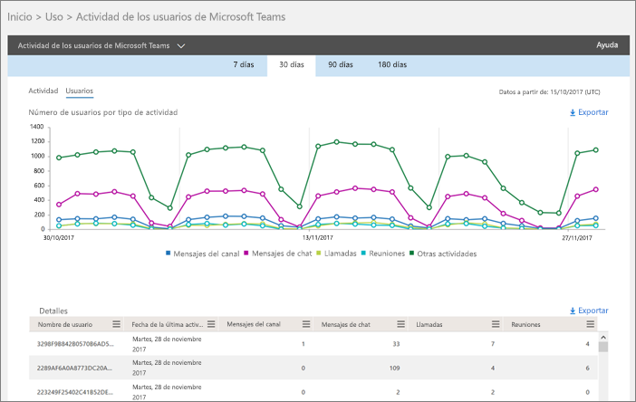
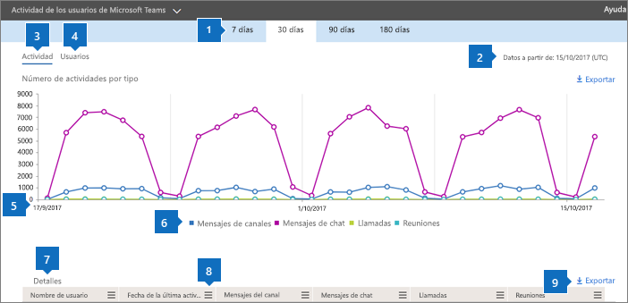
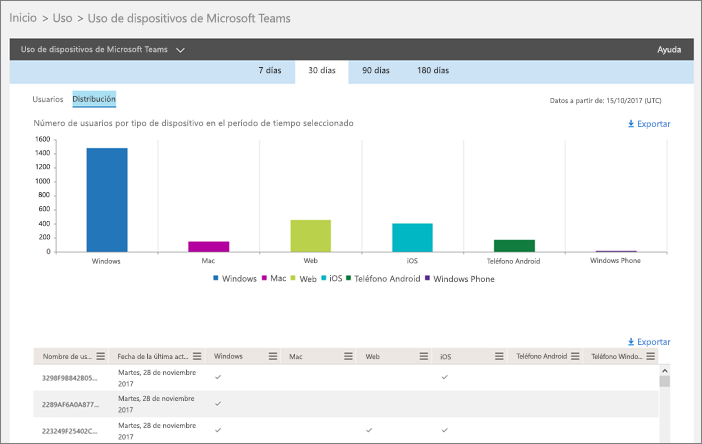
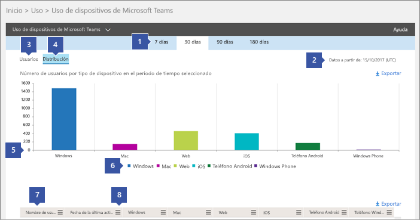
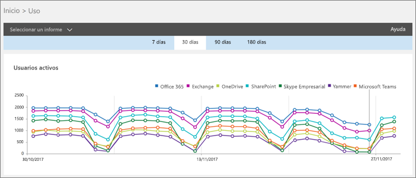
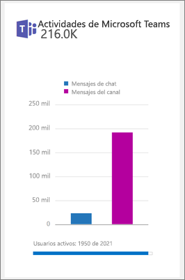

Use los informes de actividades de Microsoft Teams 
========================================

Puede usar informes de actividades en el centro de administración de Microsoft 365 para ver cómo los usuarios de su organización usan Microsoft Teams. Por ejemplo, si algunos usuarios no usan Microsoft Teams, es posible que no sepan cómo empezar o comprender cómo pueden usar Teams para ser más productivos y colaborativos. Su organización puede usar los informes de actividad para decidir dónde debe dar prioridad a los esfuerzos de aprendizaje y comunicación.

## Cómo ver los informes de Teams en el panel de informes

1. En el [centro de administración de Microsoft 365](https://portal.office.com/adminportal/home), seleccione**uso**de **informes** > .
 
2. En la página **uso** , elija **seleccionar un informe**y, a continuación, en **Microsoft Teams** , en la lista de informes, elija el informe que desea ver.

## Informes de actividad de teams que están disponibles

Actualmente existen dos informes de actividades que puede ver:

- [Informe de actividad de usuario de Microsoft Teams](#microsoft-teams-user-activity-report) 
- [Informe de uso de dispositivos de Microsoft Teams](#microsoft-teams-device-usage-report) 

### Informe de actividad de usuario de Microsoft Teams

El informe actividad de usuarios de Teams ofrece una vista de las actividades más comunes que los usuarios realizan en Teams. Esto incluye el número de personas que participan en un chat en un canal, cuánto se comunican a través del mensaje privado de chat y cuántos participan en las llamadas o en las reuniones. Puede ver esta información para toda la organización, así como para cada usuario individual.

#### Interpretar el informe de actividad de los usuarios de Microsoft Teams

Puede obtener una vista de la actividad de los usuarios de Teams consultando los gráficos **actividad** y **usuarios** .

|Globo |Descripción  |
|--------|-------------|
|**1**   |El informe actividad de usuarios de Teams se puede visualizar para las tendencias de los últimos 7 días, 30 días, 90 días o 180 días. Sin embargo, si hace clic en un intervalo de tiempo determinado en el informe, la tabla (7) mostrará los datos durante 30 días, hasta la fecha (2) cuando se generó el informe. |
|**2**   |Cada informe tiene la fecha del momento en que se generó. Normalmente, el informe refleja una latencia de 24 a 48 horas desde el momento de actividad. |
|**3**   |En la vista **actividad** se muestra el número de actividades de Microsoft Teams por tipo de actividad. Los tipos de actividades son el número de mensajes de chat de equipo, mensajes de chat privados, llamadas y reuniones. |
|**4**   |La vista **usuarios** muestra el número de usuarios por tipo de actividad. Los tipos de actividades son el número de mensajes de chat de equipo, mensajes de chat privados, llamadas y reuniones. |
|**5**   |El eje X de los gráficos es el intervalo de fechas seleccionado para el informe específico. <ul><li>En el gráfico **actividad** , el eje Y es el recuento de la actividad especificada.</ul></li> <ul><li>En el gráfico **usuarios** , el eje y es el número de usuarios que participan en conversaciones de Teams, chats privados, llamadas o reuniones.</ul></li> |
|**6**   |Puede filtrar las series que aparecen en el gráfico haciendo clic en un elemento de la leyenda. Por ejemplo, en el gráfico **actividad** , haga clic o pulse en **mensajes de canal**, **mensajes**instantáneos, **llamadas**o **reuniones** para ver solo la información relacionada con cada uno de ellos. Cambiar esta selección no cambia la información en la tabla de la cuadrícula. |
|**7**   |La lista de equipos activos en el tiempo de informes más amplio (día de 180).  El recuento de actividades variará en función de la selección de fecha.    Para ver la siguiente información en la tabla, asegúrese de agregar las columnas a la tabla. <ul><li>**Username** es la dirección de correo electrónico del usuario. Puede mostrar la dirección de correo electrónico real o convertir este campo en anónimo.</ul></li> <ul><li>**Última fecha de actividad (UTC)** hace referencia a la última fecha en la que el usuario participó en una actividad de Microsoft Teams.</ul></li> <ul><li>**Mensajes de canal** es el número de mensajes únicos que el usuario ha publicado en un chat de equipo durante el período de tiempo especificado.</ul></li> <ul><li>**Mensajes de chat** es el número de mensajes únicos que el usuario ha publicado en una conversación privada durante el período de tiempo especificado.</ul></li> <ul><li>**Llamadas** es el número de llamadas en las que el usuario participó durante el período de tiempo especificado.</ul></li> <ul><li>**Reuniones** es el número de reuniones en línea en las que ha participado el usuario durante el período de tiempo especificado.</ul></li> <ul><li>**Otra actividad** es el número de otras actividades de equipo de su usuario, algunas de las cuales incluyen y no limitadas a: gustos de mensajes, aplicaciones, trabajo en archivos, búsqueda, seguimiento de equipos y canales, y añadiendo.</ul></li> <ul><li>**Eliminado** indica si el equipo se ha eliminado. Si se elimina el equipo, pero tenía actividad en el período de informes, aparecerá en la cuadrícula con el valor eliminado establecido en true.</ul></li> <ul><li>**Fecha de eliminación** es la fecha en la que el usuario se ha eliminado.</ul></li> <ul><li>**Producto asignado** es la lista de productos que se asignan al usuario.</ul></li>Si las directivas de la organización le impiden ver los informes en los que la información del usuario es identificable, puede cambiar la configuración de privacidad de todos estos informes. Consulte la sección **¿Cómo oculto los detalles de nivel de usuario?** de los [informes de actividades de la vista previa del centro de administración de Microsoft 365](https://support.office.com/article/activity-reports-in-the-office-365-admin-center-0d6dfb17-8582-4172-a9a9-aed798150263).</ui> |
|**4,8**   |Haga clic o pulse en **columnas** para agregar o quitar columnas de la tabla. |
|**99,999**   |Haga clic o pulse **exportar** para exportar datos del informe a un archivo. csv de Excel. De esta forma se exportan los datos de todos los usuarios, a los que puede aplicar orden y filtros simples para realizar más análisis. Si tiene menos de 2.000 usuarios, puede ordenar y filtrar dentro de la tabla en el informe en sí. Si tiene más de 2.000 usuarios, tendrá que exportar los datos para filtrarlos y ordenarlos. 

### Informe de uso de dispositivos de Microsoft Teams

El informe de uso de dispositivos de Teams le proporciona información sobre cómo se conectan los usuarios a Teams, incluidas las aplicaciones móviles. El informe le ayuda a comprender qué dispositivos son populares en su organización y cuántos usuarios trabajan en cualquier oficina.

### Interpretar el informe de uso de dispositivos de Microsoft Teams

Puede obtener una vista del uso de los dispositivos de Teams consultando los gráficos **usuarios** y **distribución** .

|Globo |Descripción  |
|--------|-------------|
|**1**   |El informe de dispositivos de equipos se puede visualizar para las tendencias de los últimos 7 días, 30 días, 90 días o 180 días. Sin embargo, si hace clic en un intervalo de tiempo determinado en el informe, la tabla (7) mostrará los datos durante 30 días, hasta la fecha (2) cuando se generó el informe. |
|**2**   |Cada informe tiene la fecha del momento en que se generó. Normalmente, el informe refleja una latencia de 24 a 48 horas desde el momento de actividad. |
|**3**   |La vista **usuarios** muestra el número de usuarios diarios por tipo de dispositivo. |
|**4**   |La vista **distribución** muestra el número de usuarios por dispositivo durante el período de tiempo seleccionado.  |
|**5**   | <ul><li>En el gráfico **usuarios** , el eje X es el intervalo de fechas seleccionado para el informe y el eje y es el número de usuarios por tipo de dispositivo.</ul></li> <ul><li>En el gráfico **distribución** , el eje X muestra los distintos dispositivos usados para conectarse a los equipos y el eje y es el número de usuarios que usan el dispositivo.</ul></li> |
|**6**   |Puede filtrar las series que aparecen en el gráfico haciendo clic en un elemento de la leyenda. Por ejemplo, en el gráfico **distribución** , haga clic o pulse en **Windows**, **Mac**, **Linux**, **Web**, **iOS**o **Android** para ver solo la información relacionada con cada uno de ellos. Cambiar esta selección no cambia la información en la tabla de la cuadrícula. |
|**7**   |La lista de equipos activos en el tiempo de informes más amplio (día de 180).  El recuento de actividades variará en función de la selección de fecha.    Para ver la siguiente información en la tabla, asegúrese de agregar las columnas a la tabla. <ul><li>**Username** es la dirección de correo electrónico del usuario. Puede mostrar la dirección de correo electrónico real o convertir este campo en anónimo.</ul></li> <ul><li>**Última fecha de actividad (UTC)** hace referencia a la última fecha en la que el usuario participó en una actividad de Teams.</ul></li> <ul><li>**Eliminado** indica si el equipo se ha eliminado. Si se elimina el equipo, pero tenía actividad en el período de informes, aparecerá en la cuadrícula con el valor eliminado establecido en true.</ul></li><ul><li>**Fecha de eliminación** es la fecha en la que el usuario se ha eliminado.</ul></li> <ul><li>**Windows** se selecciona si el usuario ha estado activo en el cliente de escritorio de Teams en un equipo basado en Windows.</ul></li> <ul><li>**Mac** está seleccionado si el usuario ha estado activo en el cliente de escritorio de Teams en un equipo Mac OS.</ul></li>  <ul><li>**Linux** está seleccionado si el usuario ha estado activo en el cliente de escritorio de Teams en un equipo Linux.</ul></li>   <ul><li>La **Web** está seleccionada si el usuario ha estado activo en el cliente web de Teams.</ul></li> <ul><li>**iOS** está seleccionado si el usuario ha estado activo en el cliente móvil de Teams para iOS.</ul></li> <ul><li>**Teléfono Android** está seleccionado si el usuario ha estado activo en el cliente móvil de Teams para Android.</ul></li></li> <ui>Si las directivas de su organización le impiden ver informes en los que la información del usuario es identificable, puede cambiar la configuración de privacidad de todos estos informes. Consulte la sección **¿Cómo oculto los detalles de nivel de usuario?** de los [informes de actividades de la vista previa del centro de administración de Microsoft 365](https://support.office.com/article/activity-reports-in-the-office-365-admin-center-0d6dfb17-8582-4172-a9a9-aed798150263).</ui> |
|**4,8**   |Haga clic o pulse en **columnas** para agregar o quitar columnas de la tabla. |
|**99,999**   |Haga clic o pulse **exportar** para exportar datos del informe a un archivo. csv de Excel. De esta forma se exportan los datos de todos los usuarios, a los que puede aplicar orden y filtros simples para realizar más análisis. Si tiene menos de 2.000 usuarios, puede ordenar y filtrar dentro de la tabla en el informe en sí. Si tiene más de 2.000 usuarios, tendrá que exportar los datos para filtrarlos y ordenarlos. 

## ¿Quién puede acceder a los informes de actividad de Teams?

Los usuarios asignados pueden obtener acceso a los informes de actividades:

- Rol de administrador global de Office 365
- Rol de administrador específico de producto (Exchange, Skype empresarial o SharePoint)
- Rol lector de informes

### Rol lector de informes

Puede asignar el rol de *lector de informes* a personal que no es de ti y que desea que tenga acceso a estos informes. Al asignar este rol a los administradores o a las partes interesadas de su empresa, puede asegurarse de que tengan acceso a la información útil para impulsar y hacer un seguimiento de la adopción de Teams.

## Otra información en el panel informes

### Widget de actividad de un vistazo

El panel informes incluye los datos de uso de Teams en el widget de actividad de un vistazo, que le ofrece una vista de producto cruzado de cómo los usuarios se comunican y colaboran con los otros servicios de Office 365.

### Tarjeta de actividades de Teams

La tarjeta de actividades de Teams del panel informes le ofrece una descripción general de la actividad de Teams, incluido el número de usuarios activos, para que pueda comprender rápidamente cuántos usuarios usan el servicio. Al hacer clic en la tarjeta de actividades del panel, irá al informe actividad de usuarios de Teams. 

