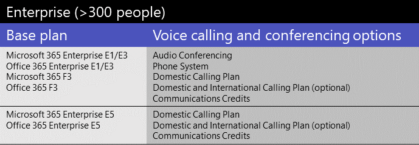

# Licencias de complementos de Microsoft TeamsMicrosoft Teams add-on licenses

## ¿Qué son las licencias complementarias?What are add-on licenses?

Las licencias de complementarias son licencias para características específicas de Microsoft Teams.Add-on licenses are licenses for specific Microsoft Teams features. Le ofrecen la flexibilidad de agregar características solo para los usuarios de su organización que las necesiten.They give you the flexibility to add features only for users in your organization who need them. Para agregar una característica, compre una licencia complementaria para cada usuario que la usará.To add a feature, buy one add-on license for each user who will use it.

## ¿Qué características puedo obtener con las licencias complementarias?What features can I get with add-on licenses?

Esta es una lista de características que puede agregar con licencias de complementos de Teams.Here's a list of features that you can add with Teams add-on licenses. Las opciones de licencias de complementos disponibles dependen del plan de Microsoft 365 u Office 365 que tenga.The add-on licensing options available to you depend on the Microsoft 365 or Office 365 plan you have.

|||||
|:-----|:-----|:-----|:-----|
|**Característica****Feature**   |**Descripción****Description**   |**Pequeña empresa (<300 usuarios)****Small business (<300 users)**|**Grandes empresas (>300 usuarios)****Large business (>300 users)**|
**Microsoft 365 Empresa Voice****Microsoft 365 Business Voice**   | [Business Voice](../business-voice/whats-business-voice.md) es una solución de telefonía diseñada para pequeñas y medianas empresas de hasta 300 usuarios que agrupa Sistema telefónico, Audioconferencia, un plan de llamadas nacionales y mucho más.[Business Voice](../business-voice/whats-business-voice.md) is a telephony solution designed for small and medium businesses of up to 300 users that bundles Phone System, Audio Conferencing, a Domestic Calling Plan, and more. Entre las funcionalidades de Sistema telefónico que se incluyen el correo de voz, la identificación de llamadas, el estacion de llamadas, el reenvío de llamadas, los operadores automáticos y las colas de llamadas.Phone System capabilities that you'll get include voicemail, caller ID, call park, call forwarding, auto attendants, and call queues.   Para saber si Business Voice está disponible en su país o región, consulte Disponibilidad de País y [región para Business Voice.](../business-voice/country-region-availability.md)To find out whether Business Voice is available in your country or region, see [Country and region availability for Business Voice](../business-voice/country-region-availability.md). Para obtener información sobre los precios, [consulta Precios de Business Voice.](https://go.microsoft.com/fwlink/?linkid=2127221)For pricing info, see [Pricing for Business Voice](https://go.microsoft.com/fwlink/?linkid=2127221).   |&#x2713;&#x2713;||
|**Audioconferencia****Audio Conferencing**   |A veces, en su organización, los usuarios de su organización tendrán que usar un teléfono para llamar a una reunión de Teams en su lugar.Sometimes people in your organization will need to use a phone to call in to a Teams meeting instead their computer. Configure [Audioconferencia para los](../audio-conferencing-in-office-365.md) usuarios que programan o guían reuniones.Set up [Audio Conferencing](../audio-conferencing-in-office-365.md) for users who schedule or leads meetings.   Para averiguar si la audioconferencia está disponible en su país o región, vea [Disponibilidad de país y región para las audioconferencias y los planes de llamadas](../country-and-region-availability-for-audio-conferencing-and-calling-plans/country-and-region-availability-for-audio-conferencing-and-calling-plans.md).To find out whether Audio Conferencing is available in your country or region, see [Country and region availability for Audio Conferencing and Calling Plans](../country-and-region-availability-for-audio-conferencing-and-calling-plans/country-and-region-availability-for-audio-conferencing-and-calling-plans.md). Para obtener información sobre precios, consulte [Precios para participar en audio conferencia.](https://go.microsoft.com/fwlink/?linkid=799762)For pricing info, see [Pricing for Audio Conferencing](https://go.microsoft.com/fwlink/?linkid=799762).     Si es una empresa pequeña o mediana con hasta 300 usuarios y actualmente no tiene licencias de Audioconferencia, puede conseguir Audioconferencia gratuita durante un año.If you're a small or medium-sized business with up to 300 users and you currently don’t have Audio Conferencing licenses, you can get Audio Conferencing free for one year. A partir del 1 de octubre de 2020, la oferta gratuita de Audioconferencia está disponible para los usuarios que tengan licencias de Microsoft 365 Empresa Basic, Empresa Estándar, Empresa Premium, Enterprise E1 o Enterprise E3.Starting October 1, 2020, the free Audio Conferencing offer is available to users who have Microsoft 365 Business Basic, Business Standard, Business Premium, Enterprise E1, or Enterprise E3 licenses. Para obtener más información, [vea Configurar Audioconferencia para pequeñas y medianas empresas.](../audio-conferencing-smb.md)To learn more, see [Set up Audio Conferencing for small and medium businesses](../audio-conferencing-smb.md).|&#x2713;&#x2713;|&#x2713;&#x2713;|
|**Números gratuitos****Toll free numbers** |Si desea números gratuitos para Audioconferencia, operadores automáticos o colas de llamadas, debe configurar [créditos de comunicaciones.](../set-up-communications-credits-for-your-organization.md)If you want toll-free numbers for Audio Conferencing, auto attendants, or call queues, you must [set up Communications Credits](../set-up-communications-credits-for-your-organization.md).   |&#x2713;&#x2713;|&#x2713;&#x2713;|
|**Sistema telefónico****Phone System**   |[Sistema telefónico](../what-is-phone-system-in-office-365.md) es un servicio telefónico hospedado que le proporciona control de llamadas y funcionalidades de central de conmutación (PBX), con opciones para conectarse a la red telefónica conmutada (RTC).[Phone System](../what-is-phone-system-in-office-365.md) is a hosted telephone service that gives you call control and Private Branch Exchange (PBX) capabilities, with options for connecting to the Public Switched Telephone Network (PSTN). Entre las características del sistema telefónico se incluyen el correo de voz en la nube, la identificación de llamadas, el parque de llamadas, el reenvío de llamadas, los operadores automáticos, las colas de llamadas, la transferencia de llamadas, la identificación de llamadas y mucho más.Phone System features include cloud voicemail, caller ID, call park, call forwarding, auto attendants, call queues, call transfer, caller ID, and more.  Para obtener más información, [vea Esto es lo que obtiene con Sistema telefónico.](../here-s-what-you-get-with-phone-system.md)To learn more, see [Here's what you get with Phone System](../here-s-what-you-get-with-phone-system.md). Para obtener información sobre los precios, [consulta Precios del sistema telefónico.](https://go.microsoft.com/fwlink/?linkid=799763)For pricing info, see [Pricing for Phone System](https://go.microsoft.com/fwlink/?linkid=799763).    |&#x2713;1&#x2713;1|&#x2713;&#x2713;|
|**Planes de llamadas****Calling Plans**   |Si desea que los usuarios puedan llamar a números de teléfono de fuera de su organización, obtenga un [plan de llamadas.](../calling-plans-for-office-365.md)If you want users to be able to call phone numbers outside your organization, get a [Calling Plan](../calling-plans-for-office-365.md). Hay planes de llamadas nacionales y planes de llamadas nacionales e internacionales.There are Domestic Calling Plans and Domestic and International Calling Plans. Para obtener información sobre los precios, [consulta Precios para planes de llamadas.](https://go.microsoft.com/fwlink/?linkid=799761 )For pricing info, see [Pricing for Calling Plans](https://go.microsoft.com/fwlink/?linkid=799761 ).    |&#x2713;1&#x2713;1|&#x2713;&#x2713;|
|**Salas de Microsoft Teams****Microsoft Teams Rooms**   |[Salas de Microsoft Teams](../rooms/index.md) no es un complemento, sino una característica que acerca el uso compartido de vídeo, audio y contenido a las salas de conferencias.[Microsoft Teams Rooms](../rooms/index.md) isn't an add-on, but a feature that brings video, audio, and content sharing to conference rooms. Consulte Licencias [de salas de reuniones de Teams.](../rooms/rooms-licensing.md)See [Teams Meeting Room Licensing](../rooms/rooms-licensing.md).    |&#x2713;&#x2713;|&#x2713;&#x2713;|
|**Advanced Communications****Advanced Communications**   |[Las comunicaciones avanzadas](advanced-communications.md) incluyen herramientas y personalización de reuniones avanzadas para administrar las directivas de comunicación de su organización.[Advanced Communications](advanced-communications.md) includes advanced meetings customization and tools to manage your organization's communication policies. Entre las características adicionales se incluye una sala de espera personalizada con su marca para adaptar las reuniones y herramientas para supervisar, seguir y analizar datos en usuarios y dispositivos.Additional features include custom branded meeting lobby to tailor your meetings, and tools to monitor, track, and analyze data on users and devices.   |&#x2713;&#x2713;|&#x2713;&#x2713;|

1 Si es una empresa pequeña o mediana que tiene un plan de Microsoft 365 Enterprise, aún puede comprar licencias de complementos para estas características de voz, pero le recomendamos que considere un plan de [Microsoft 365 Business](https://www.microsoft.com/microsoft-365/compare-all-microsoft-365-products?&activetab=tab:primaryr2) y [Business Voice.](https://www.microsoft.com/microsoft-365/business/business-voice)1 If you're a small or medium-sized business who has a Microsoft 365 Enterprise plan, you can still buy add-on licenses for these voice features, however, we recommend that you consider a [Microsoft 365 Business](https://www.microsoft.com/microsoft-365/compare-all-microsoft-365-products?&activetab=tab:primaryr2) plan and [Business Voice](https://www.microsoft.com/microsoft-365/business/business-voice).

## ¿Qué características de voz están disponibles con mi plan?What voice features are available with my plan?

Vea qué licencias de complementos necesita para obtener características de voz en Teams, dependiendo del plan que tenga.See what add-on licenses you need to get voice features in Teams, depending on the plan you have.

Según las características de voz que quiera, le recomendamos comparar si le resulta más rentable cambiar a un plan que incluya esas características.Depending on the voice features that you want, we recommend comparing whether it's more cost effective for you to switch to a plan that includes those features. Por ejemplo, para la mayoría de las organizaciones grandes, comprar un paquete de software en un plan de Microsoft 365 Enterprise tendrá como resultado un coste total menor.For example, for most large organizations, buying a bundle of software in a Microsoft 365 Enterprise plan will result in lower overall cost. Normalmente, cuando compra varias licencias de complementos individualmente en lugar de como parte de un plan, puede acabar con un costo combinado mayor.Typically, when you buy several add-on licenses individually instead of as part of a plan, you may end up with a higher combined cost.

#### [**Pequeña empresa****Small business**](#tab/small-business/)

Si es una empresa pequeña o mediana (menos de 300 usuarios), tiene cuatro formas de obtener características de voz:If you're a small or medium-sized business (less than 300 users), you have four ways to get voice features:

- Compre un plan de Microsoft 365 Empresa y Microsoft 365 Business Voice.Buy a Microsoft 365 Business plan and Microsoft 365 Business Voice.
- Compre un plan Enterprise E1 o E3 y Microsoft 365 Business Voice.Buy an Enterprise E1 or E3 plan and Microsoft 365 Business Voice.
- Compre un plan Enterprise E1 o E3 y agregue características de voz individualmente.Buy an Enterprise E1 or E3 plan and add voice features individually.
- Compre un plan Enterprise E5, que incluye características de voz.Buy an Enterprise E5 plan, which includes voice features.

Para Microsoft 365 Business Voice, tiene dos opciones entre las que elegir:For Microsoft 365 Business Voice, you have two options to choose from:

- **Microsoft 365 Business Voice** con un plan de llamadas: obtenga esto si quiere que Microsoft controle toda la facturación y la administración de números de teléfono.**Microsoft 365 Business Voice with a Calling Plan**: Get this if you want all phone number management and billing to be handled by Microsoft.
- **Microsoft 365 Business Voice** sin un plan de llamadas (enrutamiento directo): obtenga esto si quiere que su proveedor telefónico de terceros controle toda la administración y facturación de números de teléfono.**Microsoft 365 Business Voice without a Calling Plan (Direct Routing)**: Get this if you want all phone number management and billing to be handled by your third-party telephone provider. Tendrá que configurar e implementar  enrutamiento directo para conectar los controladores de borde de sesión (SBCs) local a Microsoft 365 u Office 365.You'll need to set up and deploy [Direct Routing](../direct-routing-landing-page.md) to connect your on-premises Session Border Controllers (SBCs) to Microsoft 365 or Office 365.

Para obtener más información, [consulte ¿Qué tengo que comprar para usar Microsoft 365 Business Voice?](../business-voice/what-to-buy.md).To learn more, see [What do I need to buy to use Microsoft 365 Business Voice?](../business-voice/what-to-buy.md).

Este es un resumen, basado en el plan de licencias.Here's a summary, based on licensing plan.

  

Si la audioconferencia no es compatible en su país o región, tiene la opción de obtener un plan de Microsoft 365 Enterprise E5 sin un plan de Audioconferencia o un plan de Office 365 Enterprise E5 sin plan de Audioconferencia.If Audio Conferencing isn't supported in your country or region, you have the option to get a Microsoft 365 Enterprise E5 without Audio Conferencing plan or an Office 365 Enterprise E5 without Audio Conferencing plan.

Si ya tiene un plan de Microsoft 365 Enterprise u Office 365 Enterprise, aún puede comprar licencias de complementos para características de voz individuales.If you already have a Microsoft 365 Enterprise or Office 365 Enterprise plan, you can still buy add-on licenses for individual voice features. Sin embargo, tiene la opción de cambiar a un plan de [Microsoft 365 Empresa](https://www.microsoft.com/microsoft-365/compare-all-microsoft-365-products?&activetab=tab:primaryr2) y [a Microsoft 365 Business Voice.](https://www.microsoft.com/microsoft-365/business/business-voice)However, you have the option to switch to a [Microsoft 365 Business](https://www.microsoft.com/microsoft-365/compare-all-microsoft-365-products?&activetab=tab:primaryr2) plan and [Microsoft 365 Business Voice](https://www.microsoft.com/microsoft-365/business/business-voice). En algunos casos, dependiendo de las características que desee, puede ser más rentable obtener un plan de Microsoft 365 Empresa con Microsoft 365 Business Voice.In some cases, depending on the features that you want, it might be more cost effective to get a Microsoft 365 Business plan with Microsoft 365 Business Voice.

> [!NOTE]
> Si necesita usar un servicio telefónico de [terceros,](../direct-routing-landing-page.md) el enrutamiento directo se implementa en su organización, o si los planes de llamadas no están disponibles en su país o región, debe usar el enrutamiento directo para las características de voz.If you need to use a third-party telephone service, [Direct Routing](../direct-routing-landing-page.md) is deployed in your organization, or if Calling Plans aren't available in your country or region, you need to use Direct Routing for voice features.

#### [**Enterprise****Enterprise**](#tab/enterprise/)

Si es una organización empresarial grande (más de 300 usuarios), puede obtener las características de voz de dos maneras:If you're a large business or enterprise organization (more than 300 users), you have two ways to get voice features:

- Compre un plan Enterprise E1 o E3 y agregue características de voz individualmente.Buy an Enterprise E1 or E3 plan and add voice features individually.
- Compre un plan Enterprise E5, que incluye características de voz.Buy an Enterprise E5 plan, which includes voice features.

Este es un resumen, basado en el plan de licencias.Here's a summary, based on licensing plan.

  

Si la audioconferencia no es compatible en su país o región, tiene la opción de obtener un plan de Microsoft 365 Enterprise E5 sin un plan de Audioconferencia o un plan de Office 365 Enterprise E5 sin plan de Audioconferencia.If Audio Conferencing isn't supported in your country or region, you have the option to get a Microsoft 365 Enterprise E5 without Audio Conferencing plan or an Office 365 Enterprise E5 without Audio Conferencing plan.

Para obtener más información, [consulte planes de Microsoft 365 Enterprise y](https://www.microsoft.com/microsoft-365/compare-microsoft-365-enterprise-plans) planes de Office [365 Enterprise.](https://www.microsoft.com/microsoft-365/business/compare-more-office-365-for-business-plans)To learn more, see [Microsoft 365 Enterprise plans](https://www.microsoft.com/microsoft-365/compare-microsoft-365-enterprise-plans) and [Office 365 Enterprise plans](https://www.microsoft.com/microsoft-365/business/compare-more-office-365-for-business-plans).

> [!NOTE]
> Si necesita usar un servicio telefónico de [terceros,](../direct-routing-landing-page.md) el enrutamiento directo se implementa en su organización, o si los planes de llamadas no están disponibles en su país o región, debe usar el enrutamiento directo para las características de voz.If you need to use a third-party telephone service, [Direct Routing](../direct-routing-landing-page.md) is deployed in your organization, or if Calling Plans aren't available in your country or region, you need to use Direct Routing for voice features.

#### [**Educación****Education**](#tab/education/)

Para las escuelas y otras organizaciones académicas, tiene tres maneras de obtener características de voz.For schools and other academic organizations, you have three ways to get voice features.

- Compre un plan EDU A1 o A3 y Microsoft 365 Business Voice.Buy an EDU A1 or A3 plan and Microsoft 365 Business Voice.
- Compre un plan EDU A1 o A3 y agregue características de voz individualmente.Buy an EDU A1 or A3 plan and add voice features individually.
- Compre un plan edu a5, que incluye características de voz.Buy an EDU A5 plan, which includes voice features.

Este es un resumen, basado en el plan de licencias.Here's a summary, based on licensing plan.

  

  1 Solo disponible para organizaciones con menos de 300 usuarios.1 Only available for organizations with less than 300 users.

Para obtener más información, [consulte los planes de Microsoft 365 Educación](https://www.microsoft.com/education/buy-license/microsoft365) y Office [365 Educación.](https://www.microsoft.com/education/products/office)To learn more, see [Microsoft 365 Education](https://www.microsoft.com/education/buy-license/microsoft365) and [Office 365 Education plans](https://www.microsoft.com/education/products/office).

> [!NOTE]
> Si necesita usar un servicio telefónico de [terceros,](../direct-routing-landing-page.md) el enrutamiento directo se implementa en su organización, o si los planes de llamadas no están disponibles en su país o región, debe usar el enrutamiento directo para las características de voz.If you need to use a third-party telephone service, [Direct Routing](../direct-routing-landing-page.md) is deployed in your organization, or if Calling Plans aren't available in your country or region, you need to use Direct Routing for voice features.

#### [**Administración general****Government**](#tab/government/)

Para las organizaciones gubernamentales de Estados Unidos (GCC solo), hay tres maneras de obtener características de voz.For US government organizations (GCC only), there are three ways to get voice features.

- Compre un plan GOV G1 o G3 y Microsoft 365 Business Voice.Buy a GOV G1 or G3 plan and Microsoft 365 Business Voice.
- Compre un plan GOV G1 o G3 y agregue características de voz en la nube individualmente.Buy a GOV G1 or G3 plan and add cloud voice features individually.
- Compre un plan GOV G5, que incluye características de voz.Buy a GOV G5 plan, which includes voice features.

Este es un resumen, basado en el plan de licencias.Here's a summary, based on licensing plan.

  

  1 Solo disponible para organizaciones con menos de 300 usuarios.1 Only available for organizations with less than 300 users.

Para obtener más información, [consulte los planes de Microsoft 365 Government](https://www.microsoft.com/microsoft-365/government/) y Office [365 Government.](https://www.microsoft.com/microsoft-365/government/compare-office-365-government-plans)To learn more, see [Microsoft 365 Government](https://www.microsoft.com/microsoft-365/government/) and [Office 365 Government plans](https://www.microsoft.com/microsoft-365/government/compare-office-365-government-plans).

> [!NOTE]
> Si necesita usar un servicio telefónico de [terceros,](../direct-routing-landing-page.md) el enrutamiento directo se implementa en su organización, o si los planes de llamadas no están disponibles en su país o región, debe usar el enrutamiento directo para las características de voz.If you need to use a third-party telephone service, [Direct Routing](../direct-routing-landing-page.md) is deployed in your organization, or if Calling Plans aren't available in your country or region, you need to use Direct Routing for voice features.

#### [**Sin ánimo de lucro****Nonprofit**](#tab/nonprofit/)

Si es una organización sin ánimo de lucro, tiene cuatro formas de obtener características de voz.If you're a nonprofit organization, you have four ways to get voice features.

- Compre un plan De Microsoft 365 Empresa Básico para ONG o Microsoft 365 Empresa Estándar para ONG y Microsoft 365 Business Voice.Buy a Microsoft 365 Nonprofit Business Basic or Microsoft 365 Nonprofit Business Standard plan and Microsoft 365 Business Voice.
- Compre un plan E1 o E3 para ONG y Microsoft 365 Business Voice.Buy a Nonprofit E1 or E3 plan and Microsoft 365 Business Voice.
- Compre un plan E1 o E3 para ONG y agregue características de voz individualmente.Buy a Nonprofit E1 or E3 plan and add voice features individually.
- Compre un E5 para ONG, que incluye características de voz.Buy a Nonprofit E5, which includes voice features.

Este es un resumen, basado en el plan de licencias.Here's a summary, based on licensing plan.

  

  1 Solo disponible para organizaciones con menos de 300 usuarios.1 Only available for organizations with less than 300 users.

Para obtener más información, consulte las ofertas para ONG de [Microsoft 365 y Office 365.](https://www.microsoft.com/microsoft-365/nonprofit/office-365-nonprofit-plans-and-pricing)To learn more, see [Microsoft 365 and Office 365 Nonprofit offers](https://www.microsoft.com/microsoft-365/nonprofit/office-365-nonprofit-plans-and-pricing).

> [!NOTE]
> Si necesita usar un servicio telefónico de [terceros,](../direct-routing-landing-page.md) el enrutamiento directo se implementa en su organización, o si los planes de llamadas no están disponibles en su país o región, debe usar el enrutamiento directo para las características de voz.If you need to use a third-party telephone service, [Direct Routing](../direct-routing-landing-page.md) is deployed in your organization, or if Calling Plans aren't available in your country or region, you need to use Direct Routing for voice features.

#### [**Ofertas de prueba****Trial offers**](#tab/trial/)

### Ofertas de prueba para planes de licenciasTrial offers for licensing plans

Como respuesta a una mayor necesidad de que los usuarios trabajen de forma remota (o trabajen desde casa), Microsoft tiene varias ofertas gratuitas de prueba de Teams para la administración general, el centro educativo y las organizaciones sin ánimo de lucro.In response to an increased need for people to work remotely (or work from home), Microsoft has several free Teams trial offers for government, educational, and non-profit organizations. Las pruebas están disponibles para estos planes:Trials are available for these plans:

- Prueba de Office 365 Enterprise [E1](../e1-trial-license.md) (descontinuada el 1 de julio de 2020), prueba E3 y prueba E5Office 365 Enterprise [E1 trial](../e1-trial-license.md) (discontinued as of July 1, 2020), E3 trial, and E5 trial
- Prueba de Office 365 [Educación A1](../teams-edu-licensing.md)Office 365 Education [A1 trial](../teams-edu-licensing.md)
- Prueba de Office 365 Government [G1](../g1-trial-license.md) (descontinuada a partir del 1 de julio de 2020)Office 365 Government [G1 trial](../g1-trial-license.md) (discontinued as of July 1, 2020)

Para registrarse para obtener una oferta de prueba, consulte [Registrarse para obtener una oferta de prueba.](https://transform.microsoft.com/customer-trials?tab=requestnewtrial)To sign up for a trial offer, see [Sign up for a trial offer](https://transform.microsoft.com/customer-trials?tab=requestnewtrial).

### Ofertas de prueba para características de vozTrial offers for voice features

Este es un resumen de las ofertas de prueba de características de voz.Here's a summary of voice feature trial offers.

  

 El plan base no tiene por qué ser una oferta de prueba para usar ninguna de estas pruebas para las características de voz.Your base plan doesn't have to be a trial offer to use any of these trials for voice features. Puede usar un plan de Microsoft 365 Empresa o un plan Enterprise, Government, Education o Nonprofit con cualquiera de las ofertas de prueba para características de voz.You can use a Microsoft 365 Business plan or an Enterprise, Government, Education, or Nonprofit plan with any of the trial offers for voice features. Para ver las ofertas de prueba y los complementos disponibles, en el Centro de administración de Microsoft 365, ve a servicios de compra de facturación, selecciona  >   **Otras** categorías que puedan interesairte y, a continuación, selecciona Complementos. To see available trial offers and add-ons, in the Microsoft 365 admin center, go to **Billing** > **Purchase services**, select **Other categories that might interest you**, and then select **Add-ons**.

  Para cada una de estas opciones de voz y [conferencia,](../set-up-communications-credits-for-your-organization.md) se requieren créditos de comunicaciones si tiene números gratuitos o si necesita agregar minutos adicionales para que los usuarios llamen desde las reuniones o para que los usuarios realicen llamadas RTC nacionales e internacionales.For each these voice and conferencing options, [Communications Credits](../set-up-communications-credits-for-your-organization.md) are required if you have toll-free numbers or if you need to add additional minutes for users to dial out from meetings or for users to make domestic and international PSTN calls.

 Consulte también:Also, check out:

- [Versión gratuita de TeamsFree version of Teams](../manage-freemium.md)
- [Experiencia Exploratoria de Teams:](../teams-exploratory.md) actualmente no hay ninguna oferta de prueba para las características de voz para su uso con la experiencia Exploratoria de Teams.[Teams Exploratory experience](../teams-exploratory.md) - currently there are no trial offers for voice features for use with the Teams Exploratory experience.
- [Microsoft Phone System - Licencia de usuario](virtual-user.md) virtual[Microsoft Phone System - Virtual User](virtual-user.md) license

* * *

## ¿Necesitas ayuda?Need help?

¿Necesita hablar con alguien sobre las opciones del complemento?Need to talk to someone about the add-on options? [Contactar con el soporte técnico para productos empresariales: ayuda para administradores](https://support.office.com/article/32a17ca7-6fa0-4870-8a8d-e25ba4ccfd4b).[Contact support for business products - Admin Help](https://support.office.com/article/32a17ca7-6fa0-4870-8a8d-e25ba4ccfd4b).

## Temas relacionadosRelated topics

- [Asignar licencias de complementos de TeamsAssign Teams add-on licenses](assign-teams-add-on-licenses.md)
- [Gestionar acceso de los usuarios a Microsoft TeamsManage user access to Teams](../user-access.md)
- [Descripción del servicio de TeamsTeams service description](https://docs.microsoft.com/office365/servicedescriptions/teams-service-description)
