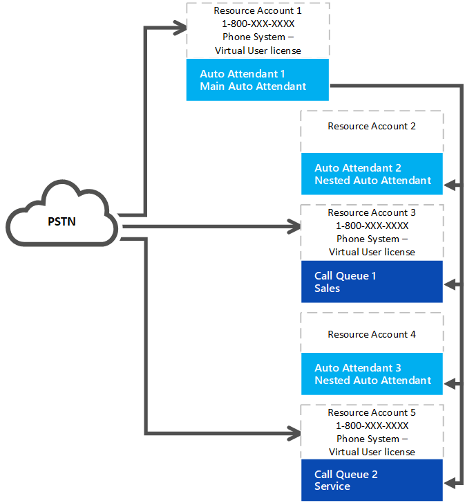

# Sistema telefónico: licencia de usuario virtual 

A partir del 2 de julio de 2019, una organización con licencia de sistema telefónico ya puede obtener y asignar un sistema telefónico gratis, una licencia de usuario virtual o una licencia de usuario de sistema telefónico de pagos a cuentas de recursos. Ya no se necesita un plan de llamadas. Todos los operadores automáticos o las colas de llamadas requieren una cuenta de recursos asociada. Las cuentas de recursos que requieren un número de teléfono necesitan un sistema telefónico gratis, una licencia de usuario virtual o una licencia de usuario de sistema telefónico de pagos antes de que se pueda aplicar un número de teléfono a la cuenta de recursos.

> [!TIP]
> No se necesita ninguna licencia para cuentas de recursos que se usarán con operadores automáticos anidados o colas de llamadas que no tengan un número de teléfono asignado. Vea el siguiente diagrama de referencia: 

## Asignación de licencia de usuario virtual

Su organización está asignada a un sistema telefónico: licencias de usuario virtual según su tamaño global. Cualquier organización que tenga al menos una licencia que incluya el sistema telefónico o tenga un sistema telefónico agregado tiene 25 licencias de usuario virtual disponibles sin costo alguno. Al agregar las licencias de usuario de un sistema de 10 teléfonos a su organización, hay disponible una licencia de usuario virtual para el sistema telefónico más.

> [!NOTE]
> Sistema telefónico es una licencia de complemento disponible con Office 365 E1 y E3. El sistema telefónico también se incluye como parte de las licencias de Office 365 E5.

Si su organización usa las licencias de usuario virtual gratuitas del sistema telefónico disponibles, en la creación de nodos de cola de llamadas o de operadores automáticos, aún puede usar las licencias de sistema telefónico de pagos con una cuenta de recursos. La mayoría de las organizaciones tendrá suficientes licencias de usuario virtual basadas en el plan de escala. 

### Ejemplo de asignación de licencias

Contoso, Inc. compró licencias 600 que incluían el sistema telefónico (una por empleado). Contoso tiene asignado un sistema de teléfono inicial de 25 más 60: licencias de usuario virtual, 85 en total. Su organización tiene 90 colas de llamadas y operadores automáticos que tienen números de teléfono. Necesitan asignar todas las licencias de usuario virtual al sistema telefónico y obtener cinco licencias de sistema telefónicos a precios regulares. 

Contoso debe considerar rediseñar el operador automático y el sistema de la cola de llamadas. Si usan menos números de teléfono y más nodos anidados que no necesitan un número de teléfono, simplifican la implementación y reducen los costos. 

## Cómo adquirir el sistema telefónico: licencias de usuario virtual 

> [!NOTE] 
> Cuando siga estas instrucciones, desactive el modo de vista previa para comprar un sistema telefónico: licencia de usuario virtual.

1. Inicie sesión en el centro de administración de Microsoft 365.
2. Ir a**suscripciones del complemento de** **servicios** > de compra de **facturación** > 
3. Desplácese hasta el final para encontrar la licencia **"sistema telefónico-usuario virtual"** . Seleccione **comprar ahora**.

> [!WARNING]
> Tenga en cuenta que aún debe **comprar** la licencia aunque tenga un costo de cero. 

## Cambiar una cuenta de recursos existente para usar un sistema telefónico: licencia de usuario virtual

Si decide cambiar la licencia de su cuenta de recursos de una licencia de sistema telefónico a un sistema telefónico: licencia de usuario virtual: 

1. Obtener la nueva licencia de usuario virtual del sistema telefónico. 
2. Siga los pasos vinculados en el centro de administración de Microsoft 365 para [mover usuarios a un plan diferente](https://docs.microsoft.com/en-us/office365/admin/subscriptions-and-billing/assign-licenses-to-users?redirectSourcePath=%252farticle%252f997596b5-4173-4627-b915-36abac6786dc&view=o365-worldwide#move-users-to-a-different-subscription). 

> [!WARNING]
> Elimine siempre una licencia de sistema telefónico completo y asigne la licencia de usuario virtual y sistema telefónico en la misma actividad de licencia. Si quita la licencia anterior, guarda los cambios de la cuenta, agrega la nueva licencia y, a continuación, vuelve a guardar la configuración de la cuenta, es posible que la cuenta de recursos ya no funcione según lo esperado. Si esto sucede, le recomendamos que cree una nueva cuenta de recursos para el sistema telefónico: licencia de usuario virtual y quite la cuenta de recursos dañados. 

## Información relacionada

[Actualización de servicio de las colas de llamadas y operadores automáticos](https://techcommunity.microsoft.com/t5/Microsoft-Teams-Blog/Auto-Attendant-and-Call-Queues-Service-Update/ba-p/564521)

[Administrar cuentas de recursos en Microsoft Teams](../manage-resource-accounts.md)
