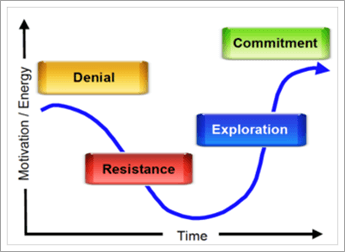

# ¿Hasta qué punto está preparada su organización para Microsoft Teams?

Ahora que su equipo de proyecto se ha unido y está empezando a ver qué puede hacer Teams para su organización, es importante evaluar la disponibilidad de su organización para la transición de Teams. Para evaluar su preparación, necesitará:

1. Evalúe a las partes interesadas.
2. Identificar a los usuarios pioneros.
3. Evalúe la disponibilidad de la organización para el cambio. 

## Evaluar a las partes interesadas

Enumrese los principales participantes y líderes empresariales de su organización. For each individual, ask the following questions:
 
1. ¿Es este líder amigable con la nueva tecnología?
2. Valora la satisfacción de este líder con tu tecnología actual.
3. ¿Está dispuesto este líder a usar tecnología sin restricciones para acelerar los resultados o crear una mejor experiencia para los miembros de su equipo?
4. ¿Este líder está bajo un alto grado de presión para ofrecer resultados empresariales clave? 
5. ¿Estará dispuesto este líder a evangelizar su experiencia con Teams para ayudar en la transición?
6. ¿Este líder tiene una relación positiva con los miembros clave del equipo de proyecto existente?
7. ¿A este líder le gusta ser visto como un "agente de cambio" dentro de la organización?  

Puede agregar preguntas adicionales que sean relevantes para su organización. En las dos fases iniciales (inicio y experimento), verá líderes que son amables con el cambio, algo insatisfecho con la tecnología actual y con los que tiene una buena relación. Estos líderes deben ser incorporados al equipo central del proyecto como asesores de negocios y pueden tener proyectos que serán esenciales para su fase de experimentación. Es importante seleccionar situaciones impactantes y reales con las que experimentar y evitar proyectos de alto riesgo para sus experimentos iniciales.
   
> [!NOTE]
> Aunque es posible asignar una puntuación a este tipo de cuestionario que minimice el impacto del elemento humano de las relaciones dentro de su organización, conducir el cambio depende de la química del equipo tanto como su habilidad técnica o capacidad empresarial. Revise esta lista con los miembros de su equipo para discutir el "ajuste" de los distintos líderes con este proyecto a medida que selecciona proyectos y personal para las fases posteriores. 

## Identificar a los usuarios pioneros

Los usuarios pioneros comparten ciertos rasgos, independientemente del tamaño o la industria que su organización pueda tener. Por lo general, los usuarios pioneros comparten estos rasgos:

- Interesado en la tecnología
- Dispuesto a ser parte del cambio
- Buscar mejoras
- Colaboración por naturaleza
- Dispuestos a compartir sus observaciones y aprendizajes con el grupo
- Son los que toman riesgos; es decir, están dispuestos a probar algo para ver si funciona

Use un formulario sencillo en Microsoft 365 o Office 365 para permitir que estas personas opten por participar en su programa de usuarios pioneros para Teams. Según el tamaño y la complejidad de su organización, puede elegir habilitar algunos o todos estos individuos para la fase de experimentación. En este programa, aceptan participar activamente en la fase de experimentación y proporcionar comentarios periódicos al equipo del proyecto. Evita tener personas que simplemente quieran probar la nueva tecnología. Indíqueles que, al proporcionar estos comentarios activos, ayudan a elaborar el resultado de su proyecto. Usará esta lista de personas en [la fase 2 - experimento](teams-adoption-phase2-experiment.md).

Nuestra Guía del programa para usuarios pioneros es un recurso útil para poner en marcha este programa en su entorno.  
 
## Evaluar la disponibilidad de su organización para el cambio

El cambio es un proceso humano que no tiene nada que ver con la tecnología. Existe psicología conductual y neurociencia que nos educa sobre la resistencia natural al cambio. Para que los cambios sean aceptables, es fundamental anticipar las necesidades de los usuarios, expresar su comprensión de su situación y crear soluciones que mejoren esa situación. Incluso al hacerlo se encontrará con resistencia natural al cambio.  

Cada enfoque de la organización cambia de manera diferente, dependiendo de la región, el estilo de trabajo, el perfil profesional y otros elementos de la organización. Para evaluar la disponibilidad de su organización, vea [Evaluar la preparación de cambios de la organización](upgrade-org-change-readiness.md). Usa las instrucciones para responder a las siguientes preguntas:

1. ¿Qué porcentaje de usuarios cae en cada cubo? (*Resistencia al cambio*)
    - **Usuarios pioneros**: soliciten la solución antes de que esté disponible.
    - **Usuarios informados**: utilicen la solución una vez que se demuestre su valor.
    - **Disentents**: retroceda en cualquier cambio.
    
   > [!TIP]
   > Los usuarios pioneros son excelentes evaluadores de pilotos y expertos de pares. Los usuarios que tardan en adoptar nuevas herramientas requieren un estímulo adicional y más tiempo para ajustarse. 

2. ¿Cuál es la competencia de los usuarios para el cambio? (*Aprendizaje*)
    - **Los arrancadores automáticos** requieren solo un vínculo a un vídeo.
    - **Los creadores de equipos** funcionan bien con el entrenamiento en grupo.
    - **Los alumnos de uno a uno** necesitan apoyo personal.

    > [!TIP]
    > Adapta el tipo y la cantidad de entrenamiento a las competencias y las personas. Mantenga la formación actualizada a medida que se conecten nuevas características.

3. Además de esta implementación de servicio, ¿cuántos cambios más están teniendo lugar? (*Adaptabilidad*)  Los cambios podrían incluir actualizaciones de Office/Windows, movimientos de office, fusiones, reorganizaciones, etc.
    - Ninguna
    - 1-3 cambios
    - Más de 3 cambios
 
    > [!TIP] 
    > Demasiados cambios pueden impedir la aceptación y la productividad. Si se están realizando más de 3 cambios, considere la posibilidad de espaciado o crear un tema para agrupar los cambios.  

Combine estos datos con los perfiles de las partes interesadas y los empleados que deseen participar en el programa de usuarios pioneros. Esto le permitirá identificar los grupos que están listos y pueden absorber cambios junto con sus deberes existentes. Este método le permitirá crear partners en cambio.

Puede usar expertos internos para solucionar el problema de tener diferentes tipos de cambios. Aquí, los comentarios son la clave del éxito: animar a las personas a compartir sus desafíos y necesidades. Abrace a los disruptores y disidentes dando un asiento a estas personas o grupos en la mesa durante la experimentación. Este procedimiento recomendado allanará el camino para una implementación más fluida y amplia de las mejoras de colaboración.  

 Siguiente: [Fase 2 de adopción de Microsoft Teams: Experimento](teams-adoption-phase2-experiment.md) 
