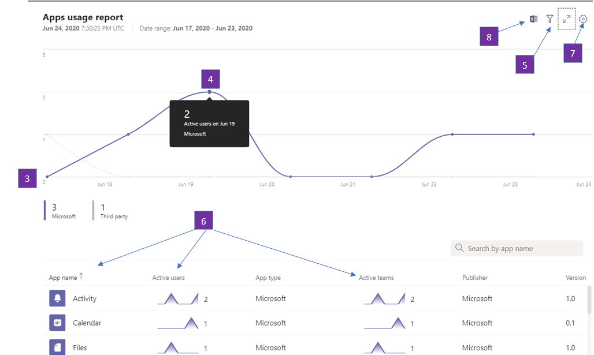

# Informe de uso de aplicaciones de Microsoft TeamsMicrosoft Teams app usage report

El informe de uso de aplicaciones de Teams en el centro de administración de Microsoft Teams le proporciona información sobre qué aplicaciones usan los usuarios en Teams.The Teams app usage report in the Microsoft Teams admin center provides you with information about which apps users are using in Teams.  

## Ver el informe de uso de aplicacionesView the App Usage report

1.  En el centro de navegación izquierdo del centro de administración de <https://teams.admin.microsoft.com> , haga clic en **análisis &** informes de \> **uso**de informes.In the left navigation of the admin center at <https://teams.admin.microsoft.com>, click **Analytics & reports** \> **Usage reports**. En la pestaña **ver informes** , en **Informe**, seleccione **uso de aplicaciones**.On the **View reports** tab, under **Report**, select **Apps Usage**.

     :::image type="content" source="media/app-usage-report1.png" alt-text="Captura de pantalla del elemento de menú informes de uso":::

2.  En **Intervalo de fechas**, seleccione un rango y haga clic en **Ejecutar informe**.Under **Date range**, select a range, and then click **Run report**.

      :::image type="content" source="media/app-usage-report2.png" alt-text="Captura de pantalla del informe de uso de aplicaciones":::

## Interpretar el informeInterpret the report

|GloboCallout |DescripciónDescription  |
|--------|-------------|
|**1****1**   |El informe de uso de las aplicaciones de Teams se puede visualizar para las tendencias de los últimos 7, 30 o 90 días.The Teams Apps usage report can be viewed for trends over the last 7, 30 or 90 days. |
|**2****2**   |Cada informe tiene una fecha en la que se generó el informe.Each report has a date for when the report was generated. Los informes suelen reflejar una latencia de 24 horas desde el momento en que se abrió una aplicación.The reports usually reflect a 24-hour latency from the time an app was opened.   |
|**3****3**    | <ul><li>El eje X de los gráficos es el intervalo de fechas seleccionado para el informe específico.The X axis on the charts is the selected date range for the specific report.</li><li>El eje Y es el número de usuarios que, durante el día dado, se desplazan sobre el gráfico, esos usuarios han abierto una aplicación al menos una vez y al hacerlo se les considera un usuario activo y se acumula el total visto por el ratón.The Y axis is the number of users who for the given day hovered over in chart, those users have opened an app at least once and by doing so are considered an Active User and accrue towards the total seen on mouse hover over.</li></ul>|
|**4****4**   |Desplace el puntero sobre el punto que representa el uso de una aplicación en una fecha determinada para ver el número de instancias de usuarios activos de esa aplicación en esa fecha determinada.Hover over the dot representing an Apps Usage on a given date to see the number of instances of that App’s Total Active Users on that given date.  |
|**5****5**   |Se incluirán todas las aplicaciones pero seleccionando el icono de filtro, estarán disponibles filtros adicionales.All Apps will be included but by choosing the Filter icon, additional filters are available.  |
|**6****6**   |La tabla ofrece un desglose de los usuarios activos y de los equipos por nombre de aplicación.The table gives you a breakdown of active users and teams by App name. <ul><li>**Nombre** de la aplicación es el nombre para mostrar de la aplicación que se usa en Teams.**App name** is the display name of the app used in Teams.</li><li>**Usuarios activos** es el número de usuarios que abrieron la aplicación al menos una vez durante el período de tiempo especificado.**Active users** is the number of users who opened the app at least once during the specified time period.</li><li>**Tipo de aplicación** es un valor estático de "Microsoft" o "de terceros".**App type** is a static value of either “Microsoft” or “Third Party”.</li><li>**Equipos activos** es el número de equipos que han abierto la aplicación al menos por un miembro del equipo y durante los períodos de tiempo especificados.**Active teams** is the number of teams who have opened the App by at least one member of the team and during the specified time periods.</li><li>**Publisher** es el editor de software de la aplicación.**Publisher** is the software publisher of the app.</li><li>**Versión** es la versión de software de la aplicación, de la aplicación Publisher.**Version** is the software version of the app, from the app publisher.</li></ul>   |
|**7****7**  |Seleccione **Editar columnas** para agregar o quitar columnas en la tabla.Select **Edit columns** to add or remove columns in the table.    |
|**4,8****8**  |Puede exportar el informe a un archivo CSV para analizarlos sin conexión.You can export the report to a CSV file for offline analysis. Haga clic en **exportar a Excel**y, a continuación, en la pestaña **descargas** , haga clic en **Descargar** para descargar el informe cuando esté listo.Click **Export to Excel**, and then on the **Downloads** tab, click **Download** to download the report when it's ready.   |
|**99,999****9**   |Al ver el informe en Excel, también verá una columna **identificador** , que representa el identificador de la aplicación.When you view the report in Excel, you'll also see an **Id** column, which represents the app ID. Un identificador de equipo suele ser una cadena alfanumérica.A team ID is typically an alphanumeric string. Si la columna **ID** se muestra como \* \* \n \* \* \* \*, significa que un usuario ha solicitado la eliminación de su información.If the **Id** column shows as \*\*\n\*\*\*\*, this means that a user requested their information to be deleted.   |

## Temas relacionadosRelated topics

- [Análisis e informes de TeamsTeams analytics and reporting](teams-reporting-reference.md)