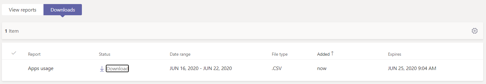

# Microsoft Teams de uso de aplicaciones

El Teams de uso de aplicaciones en el centro de administración de Microsoft Teams proporciona información sobre las aplicaciones que los usuarios usan en Teams.  

## Ver el informe uso de aplicaciones

1.  En el panel de navegación izquierdo del centro de administración en , haga <https://admin.teams.microsoft.com> clic en Análisis & informes **de** \> **uso.** En la pestaña **Ver informes,** en **Informe,** seleccione **Uso de aplicaciones.**

     :::image type="content" source="media/app-usage-report1.png" alt-text="Captura de pantalla del elemento de menú Informes de uso":::

2.  En **Intervalo de fechas**, seleccione un rango y haga clic en **Ejecutar informe**.

      :::image type="content" source="media/app-usage-report2.png" alt-text="Captura de pantalla del informe Uso de aplicaciones":::

## Interpretar el informe

|Globo |Descripción  |
|--------|-------------|
|**1**   |El Teams de uso de aplicaciones se puede ver para ver las tendencias de los últimos 7, 30 o 90 días. |
|**2**   |Cada informe tiene una fecha para cuando se generó el informe. Los informes normalmente reflejan una latencia de 24 horas desde el momento en que se abrió una aplicación.   |
|**3**    | <ul><li>En los dos gráficos, el eje X es el intervalo de fechas seleccionado para el informe específico.</li><li>El eje Y es el número de usuarios que durante un día determinado pasaron el puntero sobre el gráfico, esos usuarios han abierto una aplicación al menos una vez y, al hacerlo, se consideran usuarios activos y se acumulan hacia el total que se ve al pasar el mouse sobre.</li></ul>|
|**4**   |Mantenga el puntero sobre el punto que representa el uso de aplicaciones en una fecha determinada para ver el número de instancias del total de usuarios activos de esa aplicación en esa fecha determinada.  |
|**5**   |Se incluirán todas las aplicaciones, pero al elegir el icono Filtro, habrá filtros adicionales disponibles.  |
|**6**   |La tabla proporciona un desglose de los usuarios y equipos activos por nombre de aplicación. <ul><li>**El nombre de** la aplicación es el nombre para mostrar de la aplicación que se usa en Teams.</li><li>**Usuarios activos** es el número de usuarios que abrieron la aplicación al menos una vez durante el período de tiempo especificado.</li><li>**El tipo de** aplicación es un valor estático de "Microsoft" o "Tercero".</li><li>**Equipos activos** es el número de equipos que han abierto la aplicación por al menos un miembro del equipo y durante los períodos de tiempo especificados.</li><li>**Publisher** es el editor de software de la aplicación.</li><li>**Versión** es la versión de software de la aplicación, del editor de aplicaciones.</li></ul><b> Nota:</b> Actualmente, "Usuarios activos" y "Equipos activos" se calculan para las aplicaciones que se usan solo en los canales.     

   de aplicaciones | |**7**  | Seleccione **Editar columnas** para agregar o quitar columnas en la tabla.    Editar columnas | |**8**  | Puede exportar el informe a un archivo CSV para analizarlo sin conexión. Haga **clic en Exportar Excel** y, a continuación, en la pestaña Descargas, haga clic en Descargar para descargar el informe cuando esté listo.    Descargas | |**9** | Al ver el informe en Excel, también verá una columna **Id,** que representa el id. de la aplicación. Un id. de equipo suele ser una cadena alfanumérica. Si la **columna Id** se muestra como **\n****, esto significa que un usuario solicitó que se eliminara su información.   |

## Temas relacionados

- [Análisis e informes de Teams](teams-reporting-reference.md)