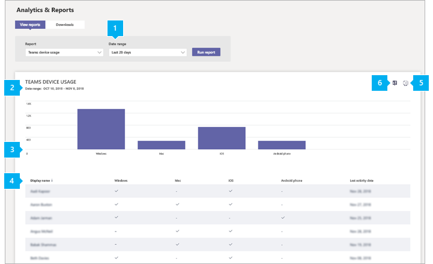

# Informe de uso de dispositivos de Microsoft Teams

El Teams de uso de dispositivos del centro de administración de Microsoft Teams proporciona información sobre cómo se conectan los usuarios a Teams. Puede usar el informe para ver los dispositivos que se usan en toda la organización, incluidos cuántos usan Teams desde sus dispositivos móviles cuando se desen marcha.  

## Ver el informe de uso del dispositivo

1. En el panel de navegación izquierdo del centro Microsoft Teams administración, haga clic **en Análisis & informes de**  >  **uso.** En la **pestaña Ver informes,** en **Informe,** **seleccione Teams uso del dispositivo.**
2. En **Intervalo de fechas**, seleccione un rango y haga clic en **Ejecutar informe**.

    

## Interpretar el informe

|Globo |Descripción  |
|--------|-------------|
|**1**   |El Teams de uso de dispositivos se puede ver para ver las tendencias de los últimos 7 o 30 días.  |
|**2**   |Cada informe tiene una fecha para cuando se generó el informe. Los informes normalmente reflejan una latencia de 24 horas desde el momento de la actividad. |
|**3**   |<ul><li>El eje X del gráfico representa los diferentes dispositivos **(Windows,** **Mac,** **Linux,** **iOS,** **Android Teléfono,** **Web)** que se usan para conectarse a Teams. </li><li>El eje Y es el número de usuarios que usan el dispositivo durante el período de tiempo seleccionado.</li> </ul>Mantenga el puntero sobre la barra que representa un dispositivo para ver el número de usuarios que usan el dispositivo para conectarse a Teams.|
|**4**   |La tabla le proporciona un desglose del uso del dispositivo por usuario. <ul><li>**Nombre** de usuario es el nombre para mostrar del usuario. Puede hacer clic en el nombre para mostrar para ir a la página de configuración del usuario en el Microsoft Teams de administración. </li><li>**Windows** se selecciona si el usuario estaba activo en el Teams de escritorio en un Windows equipo basado en Windows usuario.</li><li>**Mac** está seleccionado si el usuario estaba activo en el cliente de escritorio de Teams en un equipo macOS. </li> <li>**Linux** está seleccionado si el usuario estaba activo en el cliente de escritorio de Teams en un equipo Linux. </li> <li>**iOS** está seleccionado si el usuario estaba activo en el cliente móvil e Teams para iOS.</li><li>**El teléfono Android** está seleccionado si el usuario estaba activo en el Teams móvil para Android. <li><li>**Web** está seleccionado si el usuario estaba activo en el cliente web de Teams. <li>**La última actividad** es la última fecha (UTC) en la que el usuario participó en una Teams actividad.</li> </ul> Tenga en cuenta que si una cuenta de usuario ya no existe en Azure AD, el nombre de usuario se muestra como "--" en la tabla.   Para ver la información que quiera en la tabla, asegúrese de agregar las columnas a la tabla. |
|**5**   |Seleccione **Editar columnas** para agregar o quitar columnas en la tabla. |
|**6**   |Puede exportar el informe a un archivo CSV para analizarlo sin conexión. Haga **clic en Exportar Excel** y, a continuación, en la pestaña Descargas, haga clic en Descargar para descargar el informe cuando esté listo.    |

## Convertir en anónimos los datos específicos del usuario

Para que los datos de Teams informe de uso de dispositivos sean anónimos, debe ser administrador global. Esto ocultará información identificable, como el nombre para mostrar, el correo electrónico y el id. de AAD en el informe y su exportación.

1. En Centro de administración de Microsoft 365, vaya a  la Configuración de Configuración y, en la pestaña \> Servicios, elija **Informes.** 
    
2. Seleccione **Informes** y, a continuación, **elija Mostrar identificadores anónimos.** Esta configuración se aplica tanto a los informes de uso de Centro de administración de Microsoft 365 como a Teams centro de administración.
  
3. Seleccione **Guardar cambios**.

## Temas relacionados

- [Análisis e informes de Teams](teams-reporting-reference.md)
