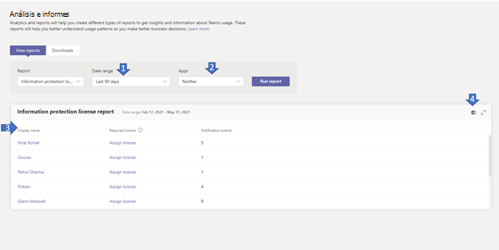

# Microsoft Teams de licencia de protección de información

El informe de licencia de protección de información  de  Teams proporciona información sobre las aplicaciones que se han suscrito para cambiar los eventos de notificación para escuchar mensajes creados, actualizados o eliminados a nivel de inquilino (es decir, /teams/getAllMessage o /chats/getAllMessages). Una notificación de cambio correspondiente al mensaje se envía correctamente solo cuando el usuario tiene la [licencia necesaria.](/graph/teams-licenses)  Puede ver cuántas notificaciones de cambio ha activado un usuario determinado.

## Ver el informe de licencia de protección de información

Debe ser administrador de servicio de Teams para poder realizar estos cambios. Consulte [Usar los roles de administrador de Teams para administrar Teams](../using-admin-roles.md) para obtener información sobre cómo obtener roles de administrador y permisos.

1. En el panel de navegación izquierdo del Microsoft Teams de administración, seleccione **Análisis & informes de**  >  **uso.** En la pestaña **Ver informes,** en **Informe,** seleccione **Licencia de protección de información.**
2. En **Intervalo de fechas,** seleccione un rango.
3. En **Aplicaciones,** seleccione una aplicación y, a continuación, **seleccione Ejecutar informe.**

    

## Interpretar el informe

|Globo |Descripción  |
|--------|-------------|
|**1**   |El informe de licencia de protección de información se puede ver para ver las tendencias de los últimos 7 días, 30 o 90 días. |
|**2**   |El nombre de la aplicación mostrará una lista de todas las aplicaciones que se han suscrito para cambiar los eventos de notificación de los mensajes en los últimos n días seleccionados en el intervalo de fechas. |
|**3**   |La tabla proporciona un desglose del uso por usuario de la aplicación seleccionada.<ul><li>**Nombre para mostrar** es el nombre para mostrar del usuario. Seleccione el nombre para mostrar para ir a la página de detalles del usuario en el Microsoft Teams de administración.</li><li>**Tiene licencia obligatoria** es sí si el usuario tiene una de las licencias necesarias como se define (aquí)[ https://docs.microsoft.com/en-us/graph/teams-licenses ]. Si el usuario no tiene la  licencia necesaria, se muestra el vínculo Asignar licencia que ha navegado a la página de detalles de la licencia del usuario en el Centro de administración de Microsoft **(Usuarios** usuarios activos > nombre de  >   usuario).</li><li>**Eventos protegidos por** licencia es el número de eventos de notificación de cambio únicos enviados a la aplicación en un mensaje creado, actualizado o eliminado por ese usuario.</li></ul> |
|**4**   |Exporte el informe a un archivo CSV para analizarlo sin conexión. Seleccione **Exportar a Excel** y, a continuación, la **pestaña** Descargas. Seleccione **Descargar** para descargar el informe cuando esté listo. |
|**5**   |Exporte el informe a un archivo CSV para analizarlo sin conexión. Seleccione **Exportar a Excel** y, a continuación, la **pestaña** Descargas. Seleccione **Descargar** para descargar el informe cuando esté listo. Cuando vea el informe en Excel, también verá una  columna **Id.** y correo electrónico, que representa el Id. de usuario y la dirección de correo electrónico del usuario. |

## Convertir los datos específicos del usuario en anónimos

Para que los datos del informe Teams actividad de usuario sean anónimos, debe ser administrador global. Esto ocultará información identificable, como el nombre para mostrar, el correo electrónico y el id. de Azure AD en informes y sus exportaciones.

1. En la Centro de administración de Microsoft 365, vaya **a Configuración** organización Configuración y, en la pestaña \> Servicios, elija **Informes.** 
    
2. Seleccione **Informes** y, a continuación, **elija Mostrar identificadores anónimos.** Esta configuración se aplica tanto a los informes de uso del Centro de administración de Microsoft 365 como al centro Teams administración.
  
3. Seleccione **Guardar cambios**.
