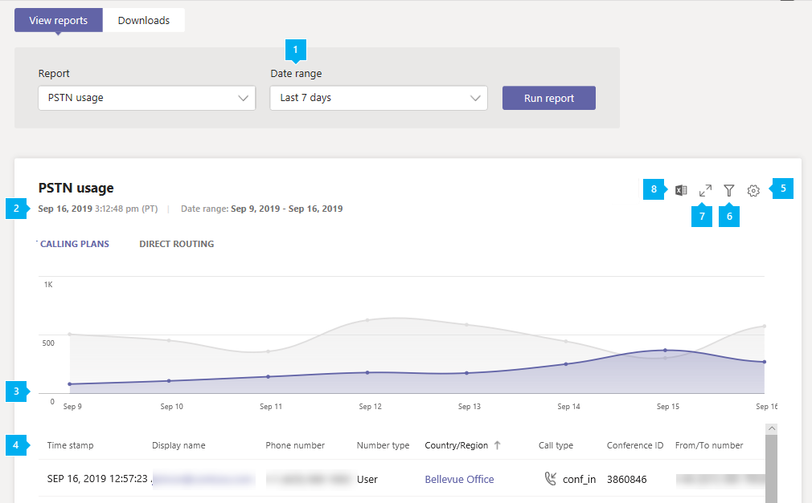

# Informe de uso de RTC de Microsoft TeamsMicrosoft Teams PSTN usage report

El informe de uso de RTC de Teams en el centro de administración de Microsoft Teams le ofrece información general sobre las llamadas y las conferencias de audio de su organización.The Teams PSTN usage report in the Microsoft Teams admin center gives you an overview of calling and audio conferencing activity in your organization. Puede ver la actividad de llamadas detalladas para los planes de llamadas si usa Microsoft como operador de telefonía y enrutamiento directo si usa su propio operador de telefonía.You can view detailed calling activity for Calling Plans if you use Microsoft as your telephony carrier and for Direct Routing if you use your own telephony carrier.

La pestaña **planes de llamada** muestra la información que incluye el número de minutos que los usuarios han invertido en llamadas RTC entrantes y salientes, así como el costo de estas llamadas.The **Calling Plans** tab shows information including the number of minutes that users spent in inbound and outbound PSTN calls and the cost of these calls. La pestaña **enrutamiento directo** muestra información que incluye la dirección SIP y las horas de inicio y finalización de la llamada.The **Direct Routing** tab shows you information including the SIP address and call start and end times. Use la información de este informe para obtener información sobre el uso de RTC en su organización y ayudarle a investigar, planear y tomar decisiones empresariales.Use the information in this report to gain insight into PSTN usage in your organization and help you to investigate, plan, and make business decisions.

## Ver el informeView the report

1. En el centro de navegación izquierdo del centro de administración de Microsoft Teams, haga clic en > **informes de uso**de **informes &**.In the left navigation of the Microsoft Teams admin center, click **Analytics & reports** > **Usage reports**. En la pestaña **ver informes** , en **Informe**, seleccione **Informe de uso de RTC**.On the **View reports** tab, under **Report**, select **PSTN usage report**.
2. En **intervalo de fechas**, seleccione un rango predefinido de 7 o 28 días, o establezca un rango personalizado y, a continuación, seleccione **Ejecutar Informe**.Under **Date range**, select a predefined range of 7 or 28 days, or set a custom range, and then select **Run report**.

## Interpretar el informeInterpret the report

### Planes de llamadasCalling Plans

|GloboCallout |DescripciónDescription  |
|--------|-------------|
|**1****1**   |El informe se puede visualizar para las tendencias de los últimos 7 días, 28 días o un intervalo de fechas personalizado que haya establecido.The report can be viewed for trends over the last 7 days, 28 days, or a custom date range that you set |
|**2****2**   |Cada informe tiene una fecha en la que se generó.Each report has a date for when it was generated. Normalmente, el informe refleja una latencia de 24 a 48 horas desde el momento de actividad.The reports usually reflect a 24 to 48 hour latency from time of activity. |
|**3****3**   |El eje X es el intervalo de fechas seleccionado para el informe específico.The X axis is the selected date range for the specific report. El eje Y es el número total de llamadas durante el período de tiempo seleccionado.The Y axis is the total number of calls over the selected time period.  Desplace el puntero sobre el punto en una fecha determinada para ver el total de llamadas en esa fecha.Hover over the dot on a given date to see the total calls on that date.  |
|**4****4**   |La tabla ofrece un desglose del uso de RTC por llamada.The table gives you a breakdown of PSTN usage per call. <ul><li>**Marca de tiempo (UTC)** es el momento en que se inició la llamada.**Time stamp (UTC)** is the time the call started.</li><li>**Nombre para mostrar** es el nombre para mostrar del usuario.**Display name** is the display name of the user. Puede hacer clic en el nombre para mostrar para ir a la página de configuración del usuario en el centro de administración de Microsoft Teams.You can click the display name to go to the user's setting page in the Microsoft Teams admin center.</li><li>**Username** es el nombre de inicio de sesión del usuario.**Username** is the user's sign in name.</li><li>**Número de teléfono** es el número que recibió la llamada de llamadas entrantes o el número marcado para llamadas salientes.**Phone number** is the number that received the call for inbound calls or the number dialed for outbound calls.</li><li>**Tipo de llamada** indica si la llamada fue una llamada entrante o saliente de RTC y el tipo de llamada, como una llamada realizada por un usuario o una conferencia de audio.**Call type** is whether the call was a PSTN outbound or inbound call and the type of call such as a call placed by a user or an audio conference. Entre las llamadas que puede ver se incluyen las siguientes:The calls types you may see include:  **Tipos de llamadas de usuario de Teams****Teams user call types**<ul><li>**user_in** : el usuario recibió una llamada RTC entrante.**user_in** - the user received an inbound PSTN call.</li><li>**user_out** : el usuario ha colocado una llamada RTC saliente**user_out** - the user placed an outbound PSTN call</li><li>**user_out_conf** : el usuario agregó dos o más participantes de la RTC a la llamada, como una llamada de conferencia de tres vías**user_out_conf** - the user added two or more PSTN participants to the call such as a three-way conference call</li><li>**user_out_transfer** : el usuario transfirió la llamada a un número RTC**user_out_transfer** - the user transferred the call to a PSTN number</li><li>**user_out_forwarding** : el usuario ha desviado la llamada a un número RTC**user_out_forwarding** - the user forwarded the call to a PSTN number</li><li>**conf_in** : una llamada entrante al puente de audioconferencia**conf_in** - an inbound call to the Audio Conferencing bridge</li><li>**conf_out** : una llamada saliente desde el puente de conferencias de audio generalmente para agregar un número RTC a la Conferencia**conf_out** - an outbound call from the Audio Conferencing bridge usually to add a PSTN number to the conference</li></ul> **Tipos de llamadas de bots de Teams****Teams bots call types**<ul><li>**ucap_in** : una llamada RTC entrante a un bot de Teams, como un operador automático o una cola de llamadas**ucap_in** - an inbound PSTN call to Teams bot such as auto attendant or call queue</li><li>**ucap_out** : una llamada RTC saliente de un bot de Teams, como un operador automático o una cola de llamadas**ucap_out** - an outbound PSTN call from a Teams bot such as auto attendant or call queue</li></ul> <li>**Llamado** es el número marcado.**Called to** is the number dialed.</li><li>**A país o región** es el país o la región marcados.**To country or region** is the country or region dialed.</li><li>**Llamado** es el número que hizo la llamada.**Called from** is the number that placed the call.</li><li>**Desde país o región** es el país o la región desde donde se realizó la llamada.**From country or region** is the country or region from where the call was placed.</li><li>**Cargo** es la cantidad de dinero o coste de la llamada que se cobra a tu cuenta.**Charge** is the amount of money or cost of the call that's charged to your account. </li><li>**Moneda** es el tipo de moneda que se usa para calcular el costo de la llamada.**Currency** is the type of currency used to calculate the cost of the call. </li><li>**Duración** muestra el tiempo durante el cual ha estado conectada la llamada.**Duration** is how long the call was connected.</li><li>**Nacional/internacional** le indica si la llamada era nacional (dentro de un país o región) o internacional (fuera de un país o región) en función de la ubicación del usuario.**Domestic/International** tells you whether the call was domestic (within a country or region) or international (outside a country or region) based on the user's location.</li><li>El **identificador de llamada** es el identificador de llamada de una llamada.**Call ID** is the call ID for a call. Es un identificador único de la llamada que puede usar al llamar al soporte técnico de Microsoft.It's a unique identifier for the call you can use when calling Microsoft Support.</li><li>**Tipo de número** es el tipo de número de teléfono del usuario, como un servicio de número gratuito.**Number type** is the user's phone number type, such as a service of toll-free number. </li><li>**País o región** es la ubicación de uso.**Country or region** is the usage location. </li> <li>El **identificador de conferencia** es el identificador de conferencia de la Conferencia de audio.**Conference ID** is the conference ID of the audio conference. </li><li>**Capacidad** es la licencia que se usa para la llamada.**Capability** is the license used for the call. Entre los tipos de licencia que puede ver se incluyen:The license types you may see include:<ul><li>**MCOPSTNPP** -créditos de comunicaciones**MCOPSTNPP** - Communications Credits</li><li>Plan de llamadas **MCOPSTN1** -nacionales (3000 min Estados unidos/1200 mín. planes de la UE)**MCOPSTN1** - Domestic Calling Plan (3000 min US / 1200 min EU plans)</li><li>Plan de llamadas **MCOPSTN2** -International**MCOPSTN2** - International Calling Plan</li><li>Plan de llamadas **MCOPSTN5** -nacionales (120)**MCOPSTN5** - Domestic Calling Plan (120 min calling plan)</li><li>Plan de llamadas **MCOPSTN6** -nacionales (240)**MCOPSTN6** - Domestic Calling Plan (240 min calling plan)</li><li>**MCOMEETADD** : audioconferencia**MCOMEETADD** - Audio Conferencing</li><li>Videoconferencias por minuto de **MCOMEETACPEA****MCOMEETACPEA** - Pay Per Minute Audio Conferencing</li></ul></li></ul> Para ver la información que quiera en la tabla, asegúrese de agregar las columnas a la tabla.To see the information that you want in the table, make sure to add the columns to the table.|
|**5****5**   |Seleccione **Editar columnas** para agregar o quitar columnas en la tabla.Select **Edit columns** to add or remove columns in the table. |
|**6****6**   |Seleccione **filtro** para filtrar el informe por nombre de usuario o llamadaSelect **Filter** to filter the report by username or call type |
|**7****7**   |Seleccione **pantalla completa** para ver el informe en modo de pantalla completa.Select **Full screen** to view the report in full screen mode. |
|**4,8****8**   |Puede exportar el informe a un archivo CSV para analizarlos sin conexión.You can export the report to a CSV file for offline analysis. Haga clic en **exportar a Excel**y, a continuación, en la pestaña **descargas** , haga clic en **Descargar** para descargar el informe cuando esté listo.Click **Export to Excel**, and then on the **Downloads** tab, click **Download** to download the report when it's ready.|

### Enrutamiento directoDirect Routing

|GloboCallout |DescripciónDescription  |
|--------|-------------|
|**1****1**   |El informe se puede visualizar para las tendencias de los últimos 7 días o 28 días.The report can be viewed for trends over the last 7 days or 28 days. |
|**2****2**   |Cada informe tiene una fecha en la que se generó.Each report has a date for when it was generated. Normalmente, el informe refleja una latencia de 24 a 48 horas desde el momento de actividad.The reports usually reflect a 24 to 48 hour latency from time of activity. |
|**3****3**   |El eje X es el intervalo de fechas seleccionado para el informe específico.The X axis is the selected date range for the specific report. El eje Y es el número total de llamadas durante el período de tiempo seleccionado.The Y axis is the total number of calls over the selected time period. Desplace el puntero sobre el punto en una fecha determinada para ver el total de llamadas en esa fecha.Hover over the dot on a given date to see the total calls on that date.  |
|**4****4**   |La tabla ofrece un desglose del uso de RTC por llamada.The table gives you a breakdown of PSTN usage per call. <ul><li>**Marca de tiempo (UTC)** es el momento en que se inició la llamada.**Time stamp (UTC)** is the time the call started.</li><li>**Nombre para mostrar** es el nombre para mostrar del usuario.**Display name** is the display name of the user. Puede hacer clic en el nombre para mostrar para ir a la página de configuración del usuario en el centro de administración de Microsoft Teams.You can click the display name to go to the user's setting page in the Microsoft Teams admin center.</li><li>**Dirección SIP** es la dirección SIP del usuario que recibió o hizo la llamada.**SIP address** is the SIP address of the user who received or made the call.</li><li>**Número de teléfono** es el número del usuario que realizó la llamada.**Phone number** is the number of the user who made the call. </li><li>**Tipo de llamada** indica si la llamada fue una llamada entrante o saliente de RTC y el tipo de llamada, como una llamada realizada por un usuario o una conferencia de audio.**Call type** is whether the call was a PSTN outbound or inbound call and the type of call such as a call placed by a user or an audio conference. Entre las llamadas que puede ver se incluyen las siguientes:The calls types you may see include:  **Tipos de llamadas de usuario de Teams****Teams user call types**<ul><li>**dr_in** : el usuario recibió una llamada RTC entrante**dr_in** - the user received an inbound PSTN call</li><li>**dr_out** : el usuario ha colocado una llamada RTC saliente**dr_out** - the user placed an outbound PSTN call</li><li>**dr_out_user_conf** : el usuario agregó un participante de RTC a la llamada**dr_out_user_conf** - the user added a PSTN participant to the call</li><li>**user_out_transfer** : el usuario transfirió la llamada a un número RTC**user_out_transfer** - the user transferred the call to a PSTN number</li><li>**dr_out_user_forwarding** : el usuario ha desviado la llamada a un número RTC**dr_out_user_forwarding** - the user forwarded the call to a PSTN number</li><li>**dr_out_user_transfer** : el usuario transfirió la llamada a un número RTC**dr_out_user_transfer** - the user transferred the call to a PSTN number</li><li>**dr_emergency_out** : el usuario realiza una llamada de emergencia**dr_emergency_out** - the user makes an emergency call</li></ul> **Tipos de llamadas de bots de Teams****Teams bots call types**<ul><li>**dr_in_ucap** : una llamada RTC entrante a un bot de Teams, como un operador automático o una cola de llamadas**dr_in_ucap** - an inbound PSTN call to a Teams bot such as auto attendant or call queue</li><li>**dr_out_ucap** : una llamada RTC saliente de un bot de Teams, como un operador automático o una cola de llamadas**dr_out_ucap** - an outbound PSTN call from a Teams bot such as auto attendant or call queue</li></ul> <li>**Llamado** es el número del usuario que recibió la llamada.**Called to** is the number of the user who received the call.</li><li>**Hora de inicio (UTC)** es la hora a la que se conecta la llamada.**Start time (UTC)** is the time the call connected.</li><li>**Hora de invitación (UTC)** es la hora en que se inició la llamada.**Invite time (UTC)** is the time when the call was initiated.</li><li>**Hora de error (UTC)** es el tiempo durante el que se produjo un error en la llamada.**Failure time (UTC)** is the time the call failed. (Solo para llamadas fallidas).(For failed calls only.)</li><li>**Hora de finalización (UTC)** es la hora de finalización de la llamada.**End time (UTC)** is the time the call ended. (Solo para llamadas correctas).(For successful calls only.)</li><li>**Duración** muestra el tiempo durante el cual ha estado conectada la llamada.**Duration** is how long the call was connected.</li><li>**Tipo de número** es el tipo de número de teléfono del usuario, como un servicio de número gratuito.**Number type** is the user's phone number type, such as a service of toll-free number. </li><li>**Omisión de elementos multimedia** que indica si el tronco se ha habilitado para la omisión de medios**Media bypass** indicates whether the trunk was enabled for media bypass </li> <li>El **FQDN de SBC** es el nombre de dominio completo (FQDN) del controlador de borde de sesión (SBC).**SBC FQDN** is the fully qualified domain name (FQDN) of the Session Border Controller (SBC). </li><li>La **región de Azure** es el centro de recursos usado para la señalización.**Azure region** is the datacenter used for signaling.</li><li>**Tipo de evento** es el tipo de evento de la llamada.**Event type** is the event type for the call. Verás el éxito de las llamadas realizadas y el intento de llamadas fallidas.You'll see Success for successful calls and Attempt for failed calls. </li><li>El **código de SIP final** es el código con el que ha finalizado la llamada.**Final SIP code** is the code with which the call ended.</li><li>El **subcódigo final de Microsoft** es un código que indica acciones específicas que se han producido.**Final Microsoft subcode** is a code that indicates specific actions that occurred.</li><li>La **frase final del SIP** es la descripción del código SIP y el subcódigo de Microsoft.**Final SIP phrase** is the description of the SIP code and Microsoft subcode.</li><li>**Identificador de coorelse** es un identificador único para la llamada que puede usar al llamar al soporte técnico de Microsoft.**Coorelation ID** is a unique identifier for the call that you can use when calling Microsoft Support.</li></ul> Para ver la información que quiera en la tabla, asegúrese de agregar las columnas a la tabla.To see the information that you want in the table, make sure to add the columns to the table.|
|**5****5**   |Seleccione **Editar columnas** para agregar o quitar columnas en la tabla.Select **Edit columns** to add or remove columns in the table. |
|**6****6**   |Seleccione **pantalla completa** para ver el informe en modo de pantalla completa.Select **Full screen** to view the report in full screen mode. |

## Temas relacionadosRelated topics

- [Análisis e informes de TeamsTeams analytics and reporting](teams-reporting-reference.md)