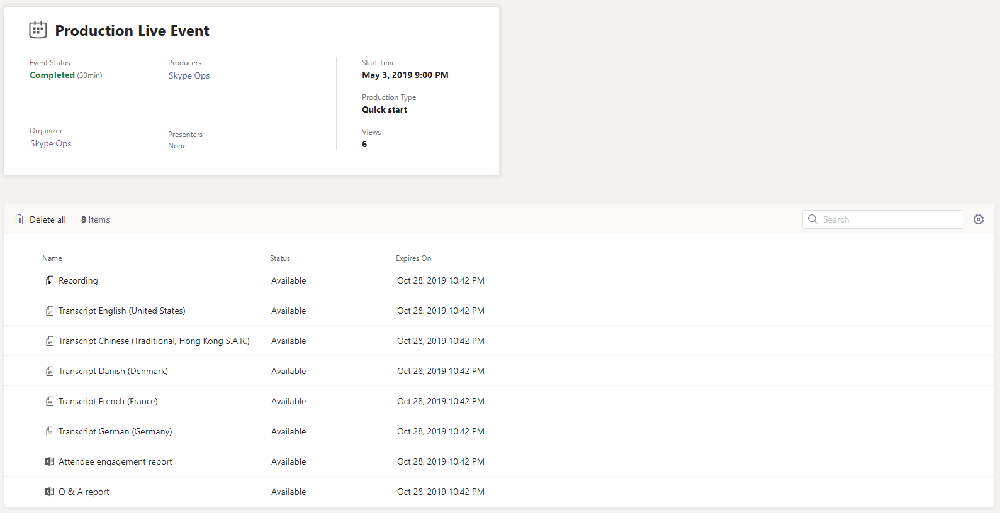

# Informe de uso de eventos de Microsoft Teams Live

El informe de uso de eventos de Teams Live en el centro de administración de Microsoft Teams le muestra la información general de actividades de eventos en vivo de su organización. Puede ver la información de uso, como el estado del evento, la hora de inicio, las vistas y el tipo de producción para cada evento. Puede obtener información sobre las tendencias de uso y saber quién en la organización programa, presenta y genera eventos en vivo.

## Ver el informe

1. En el centro de navegación izquierdo del centro de administración de Microsoft Teams, haga clic en > **informes de uso**de **informes &**. En la pestaña **ver informes** , en **Informe**, seleccione **uso de eventos de Teams Live**.
2. En **intervalo de fechas**, seleccione un rango predefinido o establezca un rango personalizado. Puede establecer un intervalo para mostrar los datos hasta un año, seis meses antes y después de la fecha actual.
3. Faculta En **Organizer**, puede elegir mostrar solo eventos en directo organizados por un usuario específico.
4. Haga clic en **Ejecutar Informe**.  

    

## Interpretar el informe

|Globo |Descripción  |
|--------|-------------|
|**1**   |El informe de eventos de Teams Live se puede visualizar para las tendencias de los últimos 7 días, 28 días o un intervalo de fechas personalizado que haya establecido. |
|**2**   |Cada informe tiene una fecha en la que se generó. El informe refleja casi la actividad en tiempo real cuando se actualiza la página. |
|**3**   |<ul><li>En el gráfico, el eje X es el intervalo de fechas seleccionado para el informe específico.</li> <li> El eje Y es el recuento total de la vista.</li> </ul>Desplace el puntero sobre el punto en una fecha determinada para ver el número de vistas en todos los eventos en directo de esa fecha.|
|**4**   |La tabla ofrece un desglose de cada evento en directo. <ul><li>**Evento** es el nombre para mostrar del evento en directo. Para [obtener más información](#view-event-details) sobre el evento, haga clic en el nombre del evento. </li> <li>**Hora de inicio** hace referencia a la fecha y la hora de inicio del evento.</li> <li>El **Estado del evento** indica si el evento se ha realizado.  </li><li>**Organizador** es el nombre del organizador de eventos.</li> <li>Los **moderadores** son los nombres de los moderadores de eventos.</li><li>Los **productores** son los nombres de los productores de eventos.</li><li>**Vistas** es el número de vistas únicas.</li><li>**Grabación** : muestra si la configuración de grabación está activada o desactivada.</li><li>**Tipo de producción** : muestra si el evento se produce en Teams o mediante una aplicación o dispositivo externo.</li></li> </ul>Tenga en cuenta que si ya no existe una cuenta de usuario en Azure AD, el nombre de usuario se muestra como "--" en la tabla.   Para ver la información que quiera en la tabla, asegúrese de agregar las columnas a la tabla. |
|**5**   |Seleccione **Editar columnas** para agregar o quitar columnas en la tabla.|

## Ver detalles del evento

La página Detalles del evento en directo le ofrece un resumen de los detalles de un evento en directo y enumera todos los archivos, incluidas las transcripciones y las grabaciones, relacionadas con el evento. Haga clic en un nombre de archivo para ver o descargar el archivo.

Si su organización está habilitada para [Hive](https://www.hivestreaming.com/partners/integration-partners/microsoft/) ECDN o [Kollective](https://kollective.com) eCDN, puede obtener análisis de asistente adicionales haciendo clic en el vínculo informe del socio.

## Temas relacionados

- [Análisis e informes de Teams](teams-reporting-reference.md)
- [¿Qué son los eventos en directo en Teams?](../teams-live-events/what-are-teams-live-events.md)