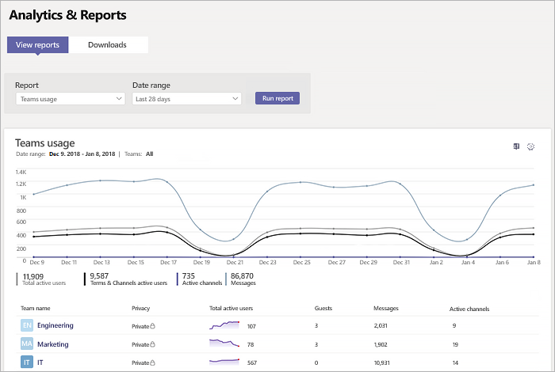

# Informe de uso de Microsoft TeamsMicrosoft Teams usage report

El informe de uso de Teams en el centro de administración de Microsoft Teams proporciona información general sobre la actividad de uso en Teams, como el número de usuarios y canales activos, para que pueda ver rápidamente cuántos usuarios en su organización usan Teams para comunicarse y colaborar.The Teams usage report in the Microsoft Teams admin center gives you an overview of the usage activity in Teams, including the number of active users and channels, so you can quickly see how many users across your organization are using Teams to communicate and collaborate. Puede ver información sobre el uso para equipos, como el número de canales y usuarios activos, invitados y mensajes en cada equipo.You can view usage information for  teams, including the number of active users and channels, guests, and messages in each team.

## Ver el informeView the report

1. Vaya al centro de administración de Microsoft Teams, en el panel de navegación izquierdo, haga clic en **Análisis e informes** y, en **Informe**, seleccione **Uso de Teams**.Go to the Microsoft Teams admin center, in the left navigation, click **Analytics & reports**, and then under **Report**, select **Teams usage**. 
2. En **Intervalo de fechas**, seleccione un rango y haga clic en **Ejecutar informe**.Under **Date range**, select a range, and then click **Run report**.

## Interpretar el informeInterpret the Skype for Business activity report

|GloboCallout |DescripciónDescription  |
|--------|-------------|
|**1****1**   |El informe de actividad de uso de Teams se puede visualizar para ver las tendencias de los últimos 7 o 28 días.The Skype for Business peer-to-peer activity report can be viewed for trends over the last 7 days, 30 days, 90 days, or 180 days. |
|**2****2**   |Cada informe tiene la fecha del momento en que se generó. Normalmente, el informe refleja una latencia de 24 a 48 horas desde el momento de actividad.Each report has a date for when this report was generated. The reports usually reflect a 24 to 48 hour latency from time of activity. |
|**3****3**   |<ul><li>En el gráfico, el eje X es el intervalo de fechas seleccionado para el informe específico.The X axis on both charts is the selected date range for this specific report.</li> <li> El eje Y es el número de elementos activos o actividad.The Y axis is the count of active items or activity.</li> </ul>Mueva el puntero sobre el punto que representa un elemento o actividad en una fecha determinada para ver el número de instancias de ese elemento o actividad en esa fecha.Hover over the dot representing an item or activity on a given date to see the number of instances of that item or activity on that given date.|
|**4****4**   |Puede filtrar lo que aparece en el gráfico haciendo clic en un elemento de la leyenda.You can filter the series you see on the chart by clicking on an item in the legend. Por ejemplo, haga clic en **Usuarios activos totales**, **Usuarios activos de Equipos y canales**, **Canales activos** o **Mensajes** para ver solo la información relacionada con cada uno.For example, click  **Total Active users**, **Teams & Channels active users**,  **Active channels**, or **Messages** to see only the info related to each one. Al cambiar esta selección no se cambia la información de la tabla.Changing this selection doesn't change the info in the grid table. |
|**5****5**   |La tabla le proporciona un desglose del uso por equipo.The table gives you a breakdown of usage by team. <ul><li>**Nombre para mostrar** es el nombre para mostrar del equipo.**Display name** is the display name of the team. Puede hacer clic en el nombre para mostrar para ir a la página de configuración del equipo en el centro de administración de Microsoft Teams.You can click the display name to go to the team's settings page in the Microsoft Teams admin center. </li> <li>**Privacidad** hace referencia a si es un equipo privado o público.**Privacy** refers to whether the team is a private team or public team.</li> <li>**Usuarios activos** es el número de usuarios activos en el equipo en el período de tiempo especificado.**Active users** is the number of active users in the team in the specified time period.</li><li>**Invitados** es el número de invitados en el equipo en el período de tiempo especificado.**Guests** is the number of guests in the team in the specified time period.</li> </li> </ul>Para ver la información que quiera en la tabla, asegúrese de agregar las columnas a la tabla.To see the information that you want in the table, make sure to add the columns to the table. |
|**6**Number 6   |Seleccione **Editar columnas** para agregar o quitar columnas en la tabla.Select **Edit columns** to add or remove columns in the table. 
|**7****7**   |Seleccione **˙˙˙** y luego **Imprimir gráfico** para imprimir el gráfico.Select **˙˙˙**, and then **Print chart** to print the chart. |

## Temas relacionadosRelated topics
- [Análisis e informes de TeamsMicrosoft Teams analytics and reporting](teams-reporting-reference.md)
- [Informe de actividad de usuario de TeamsTeams user activity report](user-activity-report.md)
- [Informe de uso de dispositivos de TeamsTeams device usage report](device-usage-report.md)
