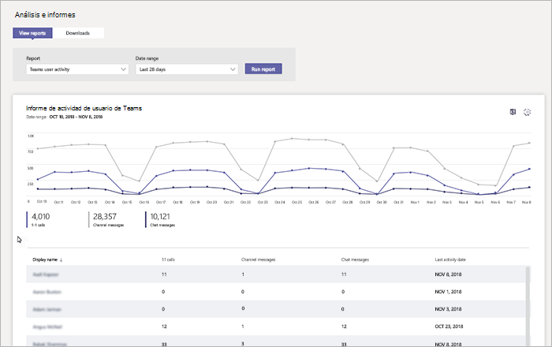

# Informe de actividad de usuario de Microsoft TeamsMicrosoft Teams user activity report

El informe de actividad de usuario de los equipos proporciona información sobre los tipos de actividades que llevar a cabo en los equipos de los usuarios de su organización.The Teams user activity report gives you insight into the types of activities that users in your organization perform in Teams. Por ejemplo, puede ver cuántos usuarios comunican a través de llamadas de 1:1, ¿cuántos usuarios comunican a través de mensajes de canal y cuántos usuarios integrarse en los mensajes de chat privado.For example, you can see how many users communicate through 1:1 calls, how many users communicate through channel messages, and how many users engage in private chat messages.

![Captura de pantalla del informe de actividad de usuario de los equipos en el centro de administración de equipos de Microsoft] (../media/teams-reports-user-activity.png "Captura de pantalla del informe de actividad de usuario de los equipos en el centro de administración de equipos de Microsoft")

## Ver el informeView the report

1. Vaya al centro de administración de Microsoft Teams, en el panel de navegación izquierdo, haga clic en **informes de análisis &** y, a continuación, en el **informe**, seleccione **actividad de usuario de los equipos**.Go to the Microsoft Teams admin center, in the left navigation, click **Analytics & reports**, and then under **Report**, select **Teams user activity**. 
2. En **Intervalo de fechas**, seleccione un rango y haga clic en **Ejecutar informe**.Under **Date range**, select a range, and then click **Run report**. 

## Interpretar el informeInterpret the report

![Captura de pantalla del informe de actividad de usuario de los equipos en el centro de administración de equipos de Microsoft con llamadas numerada] (../media/teams-reports-user-activity-with-callouts.png "Captura de pantalla del informe de actividad de usuario de los equipos en el centro de administración de equipos de Microsoft con llamadas numerada")

|GloboCallout |DescripciónDescription  |
|--------|-------------|
|**1****1**   |Puede verse el informe de actividad de usuario de los equipos de tendencias a través de últimos 7 días o 28 días.The Teams user activity report can be viewed for trends over the last 7 days or 28 days. |
|**2****2**   |Cada informe tiene la fecha del momento en que se generó. Normalmente, el informe refleja una latencia de 24 a 48 horas desde el momento de actividad.Each report has a date for when this report was generated. The reports usually reflect a 24 to 48 hour latency from time of activity. |
|**3****3**   |<ul><li>El eje X en los gráficos es el intervalo de fechas seleccionado para el informe específico.The X axis on the charts is the selected date range for the specific report. </li><li>El eje Y es el número de usuarios que participan en la actividad.The Y axis is the number of users participating in the activity.</li></ul>Mantenga el mouse sobre el punto que representa una actividad en una fecha determinada para ver el número de instancias de la actividad en esa fecha determinada.Hover over the dot representing an activity on a given date to see the number of instances of that activity on that given date. |
|**4****4**   |Puede filtrar lo que aparece en el gráfico haciendo clic en un elemento de la leyenda.You can filter what you see on the chart by clicking an item in the legend. Por ejemplo, haga clic en **llamadas de 1:1**, **los mensajes del canal**o **conversaciones de mensajes** para ver sólo la información relacionada con cada uno de ellos.For example, click **1:1 calls**, **Channel messages**, or **Chat messages** to see only the info related to each one. Cambiar la selección no cambia la información de la tabla.Changing the selection doesn’t change the information in the table. |
|**5****5**   |La tabla proporciona un desglose de uso por usuario.The table gives you a breakdown of usage by user.   <ul><li>**Nombre para mostrar** es el nombre para mostrar del usuario.**Display name** is the display name of the user. Puede hacer clic en el nombre para mostrar para ir a la página de configuración del usuario en el centro de administración de Microsoft Teams.You can click the display name to go to the user's setting page in the Microsoft Teams admin center.</li><li>**las llamadas de 1:1** es el número de llamadas de 1:1 que el usuario participó en durante el período de tiempo especificado.**1:1 calls** is the number of 1:1 calls that the user participated in during the specified time period.</li><li>**Mensajes del canal** es el número de mensajes únicos que el usuario ha realizado en una charla de equipo durante el período de tiempo especificado.**Channel messages** is the number of unique messages that the user posted in a team chat during the specified time period.</li> <li>**Mensajes de chat** es el número de mensajes únicos que el usuario registrado en privado chat durante el período de tiempo especificado.**Chat messages** is the number of unique messages that the user posted in a private chat during the specified time period.</li>  <li>**Última actividad** es la última fecha (UTC) que el usuario participó en una actividad de los equipos.**Last activity** is the last date (UTC) that the user participated in a Teams activity.</li> </ul>Para ver la información que quiera en la tabla, asegúrese de agregar las columnas a la tabla.To see the information that you want in the table, make sure to add the columns to the table.
|**6****6**   |Seleccione **Editar columnas** para agregar o quitar columnas en la tabla.Select **Edit columns** to add or remove columns in the table. |
|**7****7**   |Seleccione **˙˙˙** y luego **Imprimir gráfico** para imprimir el gráfico.Select **˙˙˙**, and then **Print chart** to print the chart. |

## Temas relacionadosRelated topics
- [Análisis e informes de TeamsTeams analytics and reporting](teams-reporting-reference.md)
- [Informes de uso de TeamsTeams usage report](teams-usage-report.md)
- [Informe de uso de dispositivos de TeamsTeams device usage report](device-usage-report.md)