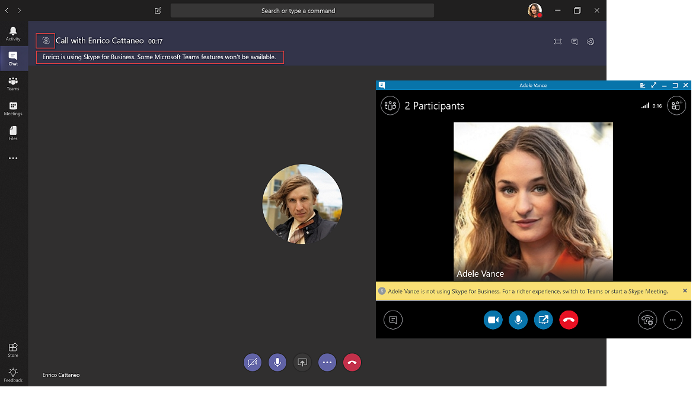

# Comprender Microsoft Teams y la coexistencia e interoperabilidad de Skype empresarialUnderstand Microsoft Teams and Skype for Business coexistence and interoperability

Este artículo forma parte de la fase de definición de proyecto de su viaje de actualización, una actividad que ha completado después de crear un Coalition de patrocinio y un equipo de proyecto y definir el ámbito, los objetivos y la visión de su proyecto.This article is part of the Project Definition stage of your upgrade journey, an activity you complete after you create a sponsorship coalition and project team and define the scope, goals, and vision for your project. Antes de continuar, confirme que ha completado las siguientes actividades:Before proceeding, confirm that you've completed the following activities:

- [Ha incorporado a las partes interesadas del proyectoEnlisted your project stakeholders](upgrade-enlist-stakeholders.md)
- [Ha definido el ámbito del proyectoDefined your project scope](https://aka.ms/SkypetoTeams-Scope)

Si su organización usa Skype empresarial hoy y está empezando a usar Teams con Skype empresarial — o está comenzando a actualizar a Teams, es importante comprender cómo cooperan las dos aplicaciones, Cuándo y cómo interoperan, y cómo administrar la migración de los usuarios hasta su eventual actualización de Skype empresarial a los equipos.If your organization uses Skype for Business today and you are starting to use Teams alongside Skype for Business—or you are starting to upgrade to Teams—it's important to understand how the two applications coexist, when and how they interoperate, and how to manage users' migration all the way to their eventual upgrade from Skype for Business to Teams.

> [!Tip]
> Mire la siguiente sesión para obtener información sobre la [coexistencia y la interoperabilidad](https://aka.ms/teams-upgrade-coexistence-interop).Watch the following session to learn about [Coexistence and Interoperability](https://aka.ms/teams-upgrade-coexistence-interop).
>
> Además, puede participar en talleres interactivos y en vivo en los que compartiremos orientación, procedimientos recomendados y recursos diseñados para la planificación e implementación de la actualización de lanzamiento.Additionally, you can join us for live, interactive workshops in which we'll share guidance, best practices, and resources designed to kick start upgrade planning and implementation.
>
> Para empezar, únase en primer lugar a la sesión [Planificar la actualización](https://aka.ms/SkypeToTeamsPlanning).Join the [Plan your upgrade](https://aka.ms/SkypeToTeamsPlanning) session first to get started.

## Coexistencia de Teams y Skype empresarialCoexistence of Teams and Skype for Business

Además de las capacidades de colaboración, Teams ofrece funciones de chat, llamadas y reuniones.In addition to collaboration capabilities, Teams delivers chat, calling, and meeting capabilities. En función de cómo decida implementar Teams, estas capacidades pueden superponerse a las capacidades que proporciona Skype empresarial para un usuario determinado.Depending on how you choose to deploy Teams, these capabilities may overlap with the capabilities delivered by Skype for Business for a given user. El modo predeterminado es ejecutar Teams junto con Skype empresarial con las capacidades superpuestas. sin embargo, a un usuario se le puede asignar uno de los diversos modos de coexistencia (también conocidos como modos de actualización) que se diseñaron para garantizar que estas funcionalidades no se solapen para ese usuario (en cuyo caso está disponible la interoperabilidad entre Teams y Skype empresarial).The default mode is to run Teams alongside Skype for Business with the capabilities overlap; however, a user can be assigned one of several coexistence modes (also known as upgrade modes) that were designed to ensure that these capabilities don't overlap for that user (in which case interoperability between Teams and Skype for Business is available). Por ejemplo, si tiene muchos activos locales de Skype empresarial Server con una compleja implementación de telefonía IP empresarial pero desea que los usuarios disfruten de las reuniones modernas lo antes posible, puede que desee evaluar las [reuniones en primer lugar](meetings-first.md) como una ruta alternativa.For example, if you have significant Skype for Business Server on-premises assets with a complex Enterprise Voice deployment but want your users to enjoy modern meetings as quickly as possible, you might want to evaluate [Meetings First](meetings-first.md) as an alternative path.

Le recomendamos que revise los siguientes modos de coexistencia para determinar qué ruta de acceso es adecuada para su organización.We recommend that you review the following coexistence modes to help determine which path is right for your organization.

> [!Important]
> La presentación de nuevas tecnologías o la realización de cambios en el entorno existente de Skype para empresas, a la vez que ofrece excelentes beneficios comerciales nuevos, puede ser perjudicial para los usuarios.Introducing new technology or making changes to your existing, familiar Skype for Business environment, while delivering great new business benefits, can be disruptive for users. Tome el tiempo de evaluar la preparación del usuario e implementar un plan de comunicación y aprendizaje antes de implementar cualquiera de los cambios descritos en este artículo.Take time to assess user readiness and implement a communication and training plan before you implement any of the changes outlined in this article. Además, le recomendamos encarecidamente que planee su plan con un grupo de usuarios seleccionado antes de implementarlo en toda la organización.In addition, we strongly encourage you to pilot your plan with a selected group of users before implementing it across your organization.

### Modo islasIslands mode

De forma predeterminada, los usuarios pueden ejecutar equipos junto con Skype empresarial como dos soluciones independientes que ofrecen capacidades similares y superpuestas, como presencia, chat, llamadas y reuniones.By default, users can run Teams alongside Skype for Business as two separate solutions that deliver similar and overlapping capabilities such as presence, chat, calling, and meetings. Los usuarios de Teams también pueden aprovechar las nuevas capacidades de colaboración, como los equipos y los canales, el acceso a los archivos de Office 365 y las aplicaciones.Teams users also can take advantage of new collaboration capabilities such as teams and channels, access to files in Office 365, and applications.

En este modo de coexistencia, denominado **islas**, cada una de las aplicaciones cliente funciona como una isla independiente.In this coexistence mode, called **Islands**, each of the client applications operates as a separate island. Skype empresarial habla con Skype empresarial y Teams se comunica con Teams.Skype for Business talks to Skype for Business, and Teams talks to Teams. Se espera que los usuarios ejecuten ambos clientes en todo momento y se puedan comunicar de forma nativa en el cliente desde el que se inició la comunicación.Users are expected to run both clients at all times and can communicate natively in the client from which the communication was initiated. Por lo tanto, no hay necesidad de interoperabilidad en el modo **islas** .As such, there's no need for interoperability in **Islands** mode.

Para evitar una experiencia de Skype empresarial confusa o recargada, las comunicaciones externas (federadas), los servicios de voz RTC y las aplicaciones de voz, la integración de Office, los controles HID para dispositivos USB y otras integraciones más siguen siendo manejadas por Skype empresarial y no están disponibles en los equipos en el modo **islas** .To avoid a confusing or regressed Skype for Business experience, external (federated) communications, PSTN voice services and voice applications, Office integration, HID controls for USB devices, and several other integrations continue to be handled by Skype for Business and are not available in Teams in **Islands** mode. El sistema telefónico no es compatible con equipos en el modo **islas** ; en este modo, el único cliente de voz empresarial es Skype empresarial.Phone System is not supported in Teams in **Islands** mode; in this mode, the only Enterprise Voice client is Skype for Business.

> [!Important]
> En el modo **islas** , todos los mensajes y las llamadas de usuarios federados (personas de fuera de la organización) se envían a Skype empresarial.In **Islands** mode, all messages and calls from federated users (people outside your organization) are delivered to Skype for Business. Después de actualizar a modo **solo para equipos** , todos los mensajes y las llamadas de fuera de la organización se envían a teams.After upgrading to **Teams Only** mode, all messages and calls from outside your organization are delivered to Teams.

> [!Tip]
> La ruta recomendada para los clientes de Skype empresarial online es empezar con el modo **islas** predeterminadas, los equipos de unidades de disco adoptan la saturación de la organización y, a continuación, se desplazan rápidamente al modo de **solo equipos** .Skype for Business Online customers recommended path is to start with the default **Islands** mode, drive Teams adoption saturation in the organization, and then move to **Teams Only** mode rapidly. En el caso de los clientes híbridos y locales, especialmente los más complejos, pueden beneficiarse de la implementación de **Skype empresarial con** el modo de colaboración de Teams como punto de partida en lugar del modo **islas** y del progreso a **Skype empresarial con el modo de colaboración y reuniones de Teams** (es decir, las reuniones en primer lugar), si es necesario, y al modo **solo de equipos** cuandoOn premises and hybrid customers, especially complex ones, might benefit from deploying the **Skype for Business with Teams Collaboration** mode as a starting point rather than **Islands** mode, and progress from there to **Skype for Business with Teams Collaboration and Meetings** mode (that is, Meetings First), if appropriate, and to **Teams Only** mode when the organization is ready to adopt Teams.

### Solo Skype EmpresarialSkype for Business only

En este modo de coexistencia, los usuarios permanecen en Skype empresarial, no en los equipos, en las capacidades de chat, reunión y llamada, y no usan Teams para equipos y canales.In this coexistence mode, users remain in Skype for Business—not Teams—for chat, meeting, and calling capabilities, and they don't use Teams for teams and channels. Este modo está disponible hoy; sin embargo, en la implementación actual, los equipos y los canales no se desactivan automáticamente para el usuario.This mode is available today; however, in the current implementation, teams and channels are not automatically turned off for the user. Esto se puede conseguir usando la Directiva permisos de la aplicación para ocultar equipos y canales.This can be achieved by using the App Permissions policy to hide teams and channels.

Este modo se puede usar antes de iniciar una implementación administrada de Teams para evitar que los usuarios comiencen a usar Teams por adelantado, o como una forma de habilitar la participación autenticada en reuniones de Teams para los usuarios de Skype empresarial, siempre y cuando los usuarios tengan una licencia de Teams.This mode can be used prior to starting a managed deployment of Teams to prevent users from starting to use Teams ahead of having built readiness, or as a way to enable authenticated participation in Teams meetings for Skype for Business users, provided the users are licensed for Teams.

### Solo equiposTeams Only

> [!IMPORTANT]
> Si desinstala el cliente de Skype Empresarial después de mover un usuario al modo **Teams solo**, la presencia dejará de funcionar en Outlook y en otras aplicaciones de Office.If you uninstall the Skype for Business client after you move a user to **Teams Only** mode, presence stops working in Outlook and other Office apps. La presencia funciona bien en Teams.Presence works fine in Teams. Solución: Para ver la presencia en Outlook (y otras aplicaciones de Office), Skype Empresarial debe estar instalado, aunque esté ejecutando Teams en el modo **solo Teams**.Workaround: To see presence in Outlook (and other Office apps), Skype for Business must be installed, even if you're running Teams in **Teams Only** mode. Microsoft es consciente de este problema y está trabajando en una solución.Microsoft is aware of this problem and is working on a fix.

Un usuario **solo de equipos** (también denominado usuario *actualizado* ) tiene acceso a todas las capacidades de Teams.A **Teams Only** user (also called an *upgraded* user) has access to all the capabilities in Teams. Pueden retener el cliente de Skype empresarial para unirse a reuniones de Skype empresarial organizadas por usuarios externos o no actualizados.They may retain the Skype for Business client to join meetings on Skype for Business that have been organized by non-upgraded users or external parties. Un usuario actualizado puede seguir comunicándose con otros usuarios de la organización que siguen usando Skype empresarial con las funciones de interoperabilidad entre Teams y Skype empresarial (siempre que estos usuarios de Skype empresarial no estén en modo **islas** ).An upgraded user can continue to communicate with other users in the organization who are still using Skype for Business by using the interoperability capabilities between Teams and Skype for Business (provided these Skype for Business users are not in **Islands** mode). Sin embargo, un usuario actualizado no puede iniciar una conversación, una llamada o una reunión de Skype empresarial.However, an upgraded user can't initiate a Skype for Business chat, call, or meeting.

Tan pronto como su organización esté lista para que algunos o todos los usuarios usen Teams como la única herramienta de comunicación y colaboración, puede actualizar esos usuarios al modo de **solo equipos** .As soon as your organization is ready for some or all users to use Teams as their only communications and collaboration tool, you can upgrade those users to **Teams Only** mode. Si está actualizando desde el modo **islas** , le recomendamos que primero saturara la adopción de Teams en toda la organización antes de comenzar el proceso de actualización.If you are upgrading from **Islands** mode, we advise that you first saturate Teams adoption throughout your organization before beginning the upgrade process. Esto evita la ruptura de los escenarios de comunicación debido a que el modo **islas** no proporciona interoperabilidad.This avoids broken communication scenarios due to **Islands** mode not providing interoperability.

Cuando se encuentra en el modo **solo de Teams** , Teams es la aplicación predeterminada para el protocolo SIP/Tel.When in **Teams Only** mode, Teams is the default app for the SIP/Tel protocol. Esto significa que los vínculos de la tarjeta de contacto de un usuario en Outlook para la llamada o la conversación serán gestionados por Teams.This means that links in a user's contact card in Outlook for calling or chat will be handled by Teams.

Para obtener más información sobre cómo cambiar al modo **solo de Teams** , vea [consideraciones del modo solo de Teams](teams-only-mode-considerations.md).For additional considerations about moving to **Teams Only** mode, see [Teams Only mode considerations](teams-only-mode-considerations.md).

### Skype empresarial con colaboración de TeamsSkype for Business with Teams Collaboration

Use este modo para presentar equipos en su entorno mientras continúa aprovechando la inversión existente en Skype empresarial.Use this mode to introduce Teams in your environment while you continue to leverage your existing investment in Skype for Business. En este modo, no se cambia Skype empresarial para las funciones de chat, llamadas y reuniones, y usted agrega capacidades de colaboración de Teams: equipos y canales, acceso a archivos de Office 365 y aplicaciones.In this mode, you leave Skype for Business unchanged for chat, calling, and meeting capabilities, and you add Teams collaboration capabilities—teams and channels, access to files in Office 365, and applications. Las capacidades de comunicaciones de Teams (conversación privada, llamadas y programación de reuniones) están desactivadas de forma predeterminada en este modo.Teams communications capabilities—private chat, calling, and scheduling meetings—are off by default in this mode.

Las organizaciones con un punto de partida de Skype empresarial Server local o híbrido deben considerar este modo como alternativa al modo **islas** si desean ofrecer a sus usuarios la interoperabilidad y la predicción de las comunicaciones, así como disponer de un calendario predecible para su actualización a Teams (en lugar de confiar en la saturación de la adopción en el modo **islas** ).Organizations with a starting point of Skype for Business Server on premises or hybrid should consider this mode as an alternative to **Islands** mode if they want to give their users interoperability and predictability for their communications, as well as having a predictable timeline for their upgrade to Teams (as opposed to relying on adoption saturation in **Islands** mode).

### Skype empresarial con la colaboración y las reuniones de Teams, también conocidas como reuniones en primer lugarSkype for Business with Teams Collaboration and Meetings, also known as Meetings First

Use este modo de coexistencia para acelerar la disponibilidad de las capacidades de reunión de los equipos de su organización, además de sus capacidades de colaboración, lo que permite a los usuarios aprovechar la experiencia de reuniones de equipos superiores: excelente calidad, capacidades innovadoras como transcripción, traducción o desenfoque de fondo, y una experiencia de usuario superior en todas las plataformas, incluidos los exploradores y dispositivos móvilesUse this coexistence mode to accelerate the availability of Teams meeting capabilities in your organization, in addition to its collaboration capabilities, enabling your users to take advantage of the superior Teams meetings experience-great quality, innovative capabilities such as transcription and translation or background blurring, and superior user experience across all platforms, including mobile devices and browsers.

Junto con el uso de Teams para las conversaciones basadas en equipos y canales en este modo, los usuarios usarán Teams para programar y dirigir sus reuniones.Along with using Teams for teams and channels–based conversations in this mode, users will use Teams to schedule and conduct their meetings. Las llamadas y chats privados permanecen en Skype empresarial.Private chat and calling remain on Skype for Business. Los equipos y Skype empresarial se benefician de una variedad de capacidades de "mejor conjunto", como la reconciliación de presencia, la retención o dessuspensión automática y la compatibilidad con dispositivos HID en ambas aplicaciones.Teams and Skype for Business benefit from a range of "better together" capabilities, such as presence reconciliation, automatic hold/unhold, and HID device support across both applications. Tenga en cuenta que es posible ocultar equipos y canales si así lo desea mediante la Directiva de permisos de aplicación.Note that it is possible to hide teams and channels if desired using the App Permissions policy.

Este modo de coexistencia es especialmente útil para las organizaciones con las implementaciones locales de Skype empresarial con telefonía IP empresarial, que probablemente tardarán algún tiempo en actualizarse a teams y desean beneficiarse de las reuniones superiores de los equipos tan pronto como sea posible.This coexistence mode is especially useful for organizations with Skype for Business on-premises deployments with Enterprise Voice, who are likely to take some time to upgrade to Teams and want to benefit from the superior Teams meetings as soon as possible.

> [!Note]
> Cuando se implementa en cualquier modo de coexistencia excepto **islas**, los equipos y Skype empresarial pueden [interoperar](#interoperability-of-teams-and-skype-for-business), lo que permite a los usuarios conversar y llamar entre sí, y garantizar que las comunicaciones permanezcan fluidas en toda la organización durante el viaje de actualización a teams.When deployed in any coexistence mode except **Islands**, Teams and Skype for Business can [interoperate](#interoperability-of-teams-and-skype-for-business), enabling users to chat with and call one another, and ensuring that communications remain fluid across your organization during your upgrade journey to Teams. Los modos de coexistencia rigen la interoperabilidad.Coexistence modes govern interoperability. El modo de coexistencia del receptor determina si estará disponible la interoperabilidad.The coexistence mode of the receiver determines whether interoperability will be available. Por ejemplo, si el receptor está en un modo en el que la conversación solo está disponible en un cliente (por ejemplo, Teams), la interoperabilidad de chat estará disponible generalmente en caso de que el iniciador use el otro cliente (en este caso, Skype empresarial) para iniciar la conversación.For example, if the receiver is in a mode in which chat is only available in one client (say, Teams), chat interoperability will generally be available in case the initiator uses the other client (in this case, Skype for Business) to start the chat. Por otro lado, si el receptor está en el modo en el que la conversación está disponible en ambos clientes (modo Islas), la interoperabilidad no estará disponible para el chat.On the other hand, if the receiver is in the mode in which chat is available in both clients (Islands mode), interoperability won't be available for the chat. El destinatario recibirá el mensaje en el mismo cliente en el que el iniciador inició la conversación.The message will be received by the receiver in the same client in which the initiator started the chat. Por lo tanto, la comunicación adecuada en el modo **islas** requiere la saturación de la adopción de equipos; es decir, todos los usuarios que usan y supervisan activamente a ambos clientes.Therefore, proper communication in **Islands** mode requires Teams adoption saturation; that is, all users actively using and monitoring both clients.

> [!TIP]
> Para ayudar a identificar el modo de actualización recomendado en función de las capacidades que desea habilitar en Teams mientras Skype empresarial aún está en uso, aproveche el [Asistente de actualización de Skype to Teams](https://aka.ms/SkypeToTeamsWizard).To help identify the recommended upgrade mode based on the capabilities you want to enable in Teams while Skype for Business is still in use, leverage the [Skype to Teams Upgrade Wizard](https://aka.ms/SkypeToTeamsWizard).

Para obtener más información sobre los modos de coexistencia, los requisitos previos y la administración, consulte [Guía de migración e interoperabilidad para las organizaciones que usan Teams junto con Skype empresarial](https://aka.ms/SkypeToTeams-Interop) y [establecer la coexistencia y la actualización de la configuración](https://aka.ms/SkypeToTeams-SetCoexistence).For more details about coexistence modes, prerequisites, and management, see [Migration and interoperability guidance for organizations using Teams together with Skype for Business](https://aka.ms/SkypeToTeams-Interop) and [Setting your coexistence and upgrade settings](https://aka.ms/SkypeToTeams-SetCoexistence).

| | | |
|---|---|---|
||Punto de decisiónDecision point|<ul><li>¿Qué modo o modos de coexistencia se adaptan mejor a las necesidades de los usuarios y de su organización?Which coexistence mode(s) best fit your organization's and users' needs?</li></ul>|
||Paso siguienteNext step|<ul><li>Elige el mejor enfoque para tu viaje de actualización.Choose the best approach for your upgrade journey.</li></ul>|

## Interoperabilidad de Teams y Skype empresarialInteroperability of Teams and Skype for Business

La interoperabilidad es la capacidad de que los equipos y los usuarios de Skype empresarial de la misma organización se comuniquen entre equipos y Skype empresarial.Interoperability is the ability for Teams and Skype for Business users in the same organization to communicate across Teams and Skype for Business.

La interoperabilidad está regida por el modo de coexistencia (también conocido como modo de actualización) del destinatario.Interoperability is governed by the coexistence mode (also known as upgrade mode) of the receiver. No hay interoperabilidad cuando el receptor está en modo **islas** .There is no interoperability when the receiver is in **Islands** mode.

### Interoperabilidad nativa y escalabilidad de interoperabilidadNative interop and interop escalation

Existen dos tipos de experiencias de interoperabilidad: nativas y de interoperabilidad.There are two types of interop experiences: native and interop escalation.

- La experiencia de _interoperabilidad nativa_ se produce en el cliente que el usuario está usando actualmente.A _native interop_ experience occurs in the client that the user is currently using. Un usuario estará en el cliente de Skype empresarial, el otro en Teams.One user will be in the Skype for Business client, the other in Teams. Una experiencia de interoperabilidad nativa no las llevará a otro cliente para comunicarse, los usuarios podrán realizar su conversación en el cliente que actualmente están usando.A native interop experience won't take them to another client to communicate, the users will be able to conduct their conversation in the client they're currently using. Las experiencias de interoperabilidad nativas son chats uno a uno y llamadas.The native interop experiences are one-to-one chat and calling.
- Una experiencia de _escalado de interoperabilidad_ significa que, como parte de ayudar a los usuarios a realizar una acción avanzada (como compartir su escritorio), el cliente facilita la creación de una reunión a la que los usuarios pueden unirse para continuar con la experiencia de esa reunión.An _interop escalation_ experience means that as part of helping users perform an advanced action (such as sharing their desktop), the client facilitates the creation of a meeting which users can join to continue the experience in that meeting. La reunión se crea en la plataforma del iniciador de la acción.The meeting is created on the platform of the initiator of the action. El usuario o los usuarios que no se encuentren en la plataforma recibirán un vínculo de unirse a la reunión.The user or users who aren't on that platform receive a meeting join link. A medida que hacen clic en este vínculo, se unen a la reunión en un cliente compatible (explorador, aplicación web o cliente completo, según la configuración).As they click this link, they are joined to the meeting in a compatible client (browser, web app, or full client, depending on configuration). La escalabilidad de interoperabilidad de Skype empresarial requiere un cliente reciente.Interop escalation from Skype for Business requires a recent client. Ahora está disponible el escalado de interoperabilidad de Teams.Interop escalation from Teams is now available. Ambas son compatibles con las experiencias de interoperabilidad de en el inquilino y para los usuarios de la comunicación federada.Both are supported in interoperability experiences in-tenant, and for federated communication cross-tenants.

### Experiencias de interoperabilidad nativasNative interop experiences

En función de los modos de coexistencia asignados a los usuarios (como se ha descrito anteriormente), están disponibles las siguientes experiencias de interoperabilidad nativa:Depending on the coexistence modes assigned to users (as previously described), the following native interop experiences are available:

Los usuarios de Skype empresarial pueden chatear uno a uno con los usuarios de Teams, y viceversa.Skype for Business users can chat one-on-one with Teams users, and vice versa. Un chat de interoperabilidad debe atravesar un Gateway de interoperabilidad que forma parte de los servicios en la nube de Teams (y, por lo tanto, solo está conectado).An interop chat needs to go through an interop gateway that's part of Teams cloud services (and therefore only exists online). Los chats interoperativos son texto sin formato: el texto enriquecido y los emoticonos no se admiten.Interop chats are plain text: rich text and emoticons aren't supported. Se notifica a los usuarios de Teams y a Skype empresarial que la conversación es una conversación de interoperabilidad.Users in Teams and in Skype for Business are notified that the conversation is an interop conversation.

<!---->

Los usuarios de Skype empresarial pueden hacer llamadas y videollamadas individuales a los usuarios de Teams, y viceversa.Skype for Business users can make one-on-one voice and video calls to Teams users, and vice versa.

<!---->

> [!Important]
> Las experiencias de interoperabilidad con una implementación local de Skype empresarial requieren que el entorno local esté en modo híbrido con Office 365 Skype empresarial.Interop experiences with an on-premises deployment of Skype for Business require that the on-premises environment is in hybrid mode with Office 365 Skype for Business. Para obtener más información, consulte [Guía de migración e interoperabilidad](https://aka.ms/SkypeToTeams-Interop).For details, see [Migration and interoperability guidance](https://aka.ms/SkypeToTeams-Interop).

Estas experiencias de interoperabilidad están disponibles para los usuarios que tienen uno de los siguientes modos de coexistencia: **Skype empresarial con colaboración de Teams**, **Skype empresarial con colaboración y reuniones de Teams**, **solo Skype**empresarial o solo para **equipos**.These interop experiences are available to and between users who have one of the following coexistence modes assigned: **Skype for Business with Teams Collaboration**, **Skype for Business with Teams Collaboration and meetings**, **Skype for Business Only**, or **Teams Only**. No hay ninguna interoperabilidad para los usuarios en el modo **islas** .There is no interoperability to users in **Islands** mode.

### Limitaciones de la experiencia de interoperabilidad nativaNative interop experience limitations

Debido a la diferencia en los protocolos y la tecnología, no es posible admitir de forma nativa todas las funciones.Because of the difference in protocols and technology, it is not possible to support all capabilities natively. En concreto, las siguientes características no están disponibles:Specifically, the following capabilities are not available:

- No se admite el descuento, el texto enriquecido ni el conjunto de emoticonos completo de equipos o de Skype empresarial.Markdown, rich text, and the full emoticon set aren't supported either from Teams or Skype for Business. No se admiten otras características nativas del cuadro de redacción en los chats de Teams.Other native features of the compose box in Teams chats aren't supported.
- La pantalla compartida (escritorio o uso compartido de aplicaciones) entre equipos y Skype empresarial no se admite de forma nativa.Screen sharing (desktop or app sharing) between Teams and Skype for Business isn't supported natively. Sin embargo, es compatible con la escala de interoperabilidad.However, it is supported through interop escalation.
- Los chats grupales (conversaciones de varios participantes) en Teams solo pueden incluir participantes que usen Teams.Group chats (multiple-party conversations) in Teams can only include participants who are using Teams.
- Las conversaciones de mensajería instantánea de varios participantes (chats grupales) en Skype empresarial solo pueden incluir participantes que usen Skype empresarial.Multiple-party IM conversations (group chats) in Skype for Business can only include participants who are using Skype for Business. Sin embargo, la escalabilidad de interoperabilidad a varios participantes está disponible en Skype empresarial.However, interop escalation to multiple-party is available from Skype for Business.
- No se admite la escala de una llamada de voz o videollamada de punto a punto continuado a una llamada de varios participantes que implique a equipos y usuarios de Skype empresarial.Escalating an ongoing peer-to-peer voice or video call to a multiple-party call involving both Teams and Skype for Business users isn't supported.
- No se admite la transferencia de archivos para chats de dos participantes o datos adjuntos en chats grupales, de equipos a Skype para empresas, y viceversa.File transfer for two-party chats, or file attachment in group chats, from Teams to Skype for Business—and vice versa—aren't supported.
- No existe una interoperabilidad con el chat persistente de Skype empresarial.There is no interoperability with Skype for Business Persistent Chat.

Para todas estas limitaciones (excepto para conversaciones persistentes), una posible solución es que un usuario inicie una reunión e invite a otro usuario a unirse a ella.For all these limitations (except for Persistent Chat), one possible workaround is for one user to start a meeting and invite the other user to join it.

Esta solución alternativa constituye la base para el escalamiento de interoperabilidad.This workaround is the basis for interop escalation. En concreto, el uso compartido de la pantalla y la escala a varias partes no se pueden realizar de manera nativa, pero sí se admiten a través de la escala de interoperabilidad.In particular, screen sharing and escalation to multiparty are not achievable natively but they are supported via interop escalation.

### Experiencias de escala de interoperabilidadInterop escalation experiences

La escalabilidad de interoperabilidad consiste en complementar las capacidades de interoperabilidad nativas con escalas administradas para reuniones.Interop escalation consists in supplementing the native interop capabilities with managed escalations to meetings. Las reuniones ofrecen experiencias ricas a disposición de cualquier persona, independientemente del cliente que tengan.Meetings offer rich experiences available to anyone, regardless of which client they have.

Cuando el usuario de Teams desencadena una escala de interoperabilidad, se crea una reunión de Teams.When interop escalation is triggered by the Teams user, a Teams meeting is created. Cuando lo desencadena el usuario de Skype empresarial, se crea una reunión de Skype empresarial.When it is triggered by the Skype for Business user, a Skype for Business meeting is created. En ambos casos, la reunión creada es una reunión **reunirse ahora** , que no se refleja en el calendario del usuario.In both cases, the meeting created is a **Meet now** meeting, which is not reflected on the user's calendar.
 
La otra persona recibe el vínculo unirse a la reunión a través de una conversación interactiva y las combinaciones haciendo clic en ese vínculo.The other party receives the meeting join link through interop chat and joins by clicking that link. Si el usuario de Skype empresarial tiene una cuenta de Teams y lo ha invitado el usuario de Teams, se unirán a la reunión autenticada.If the Skype for Business user has a Teams account and is invited by the Teams user, they will join the meeting authenticated. De lo contrario, se unirán como un participante anónimo.Otherwise, they will join as an anonymous participant. A la inversa, los usuarios de Teams casi siempre tienen una cuenta de Skype empresarial y un cliente de Skype empresarial que pueden usar para unirse a una reunión de Skype empresarial como participante autenticado, pero también se pueden unir como participante anónimo, por ejemplo, con la aplicación de reunión de Skype.Conversely, Teams users almost always have a Skype for Business account and a Skype for Business client they can use to join a Skype for Business meeting as an authenticated participant, but they might also join as an anonymous participant, for example using the Skype Meeting App.

Una vez que las partes se unen a la reunión, pueden realizar cualquier actividad que se admita en las reuniones, como el uso compartido de escritorio o de contenido, el uso compartido de archivos o la transferencia, agregar otros participantes, etc.Once the parties have joined the meeting, they can conduct any activity supported in meetings, such as desktop or content sharing, file sharing or transfer, adding other participants, and so on.

#### Escalabilidad de interoperabilidad desde Skype empresarialInterop escalation from Skype for Business

La escalabilidad de interoperabilidad y interoperabilidad de Skype empresarial se actualizó en la compilación de julio de 2019 de C2R mensual.Interop and interop escalation from Skype for Business was updated in the July 2019 build of monthly C2R. Antes, Skype empresarial no tenía conocimiento anticipado de que la persona remota estaba usando Teams.Previously, Skype for Business did not have advance awareness that the remote party was using Teams. Solo surmised que de la señal recibida después de que se haya establecido una sesión.It only surmised that from the signaling received after a session was established.

Cuando la señalización indicó que la respuesta procedía de la puerta de enlace de interoperabilidad (o a través de ella), mostraría la barra de empresa amarilla (banner) indicando que la otra persona no estaba usando Skype empresarial.When the signaling indicated that the response came from (or through) the interop gateway, it would display the yellow business bar (banner) indicating the other party was not using Skype for Business. Con la evolución de nuestro servicio, esto daba lugar a falsos positivos en los que los usuarios de Skype empresarial verían la barra de empresa cuando se conectaban al servicio de buzón de voz de nube o a otros servicios de voz en la nube, en lugar de hacerlo a un solo usuario de **equipos** reales.With the evolution of our service, this resulted in false positives where Skype for Business users would see the business bar when they were connected to the Cloud Voicemail Service or other cloud voice services, rather than to an actual **Teams Only** user.
 
Para evitar estos falsos positivos, el servicio de presencia está informando al cliente de Skype empresarial cuando la otra persona es un solo usuario real de **equipos** .To prevent these false positives, the presence service is now informing the Skype for Business client when the other party is a **Teams Only** actual user. Esto permite que Skype empresarial tenga en cuenta que necesita crear una conversación de interoperabilidad antes de que se haya creado, y la ventana de conversación para que sea específica para la interoperabilidad.This allows Skype for Business to be aware that it needs to create an interop conversation ahead of it having been created, and the conversation window to be specific to interop.

Si el usuario de Skype empresarial quiere compartir su escritorio por ejemplo, se le informa de que iniciaremos una reunión y se guiarán por los pasos.If the Skype for Business user wants to share their desktop for example, they are informed that we will start a meeting and guided through the steps.

Mientras tanto, el usuario de Teams recibe un mensaje de chat entrante con el vínculo a la reunión y se le guiará para unirse.Meanwhile, the Teams user receives an incoming chat message with the link to the meeting and are guided to join.

Esta escalación a una reunión de Skype empresarial está disponible para la interoperabilidad en espacio empresarial y las llamadas y conversaciones federadas entre inquilinos.This escalation to a Skype for Business meeting is available for both in-tenant interop and cross-tenant federated calls and chats. Está activada de forma predeterminada y no hay ninguna opción que el Administrador tenga que aprovisionar.It is on by default and there is no setting the admin has to provision.

#### Escalado de interoperabilidad de TeamsInterop escalation from Teams

La escalabilidad de interoperabilidad de Teams a una reunión de Teams ahora está disponible cuando el usuario de Teams selecciona el botón compartir escritorio en un subproceso de interoperabilidad en el inquilino con un usuario de Skype empresarial o en un subproceso de Federación de intercompañía.Interop escalation from Teams to a Teams meeting is now available when the Teams user selects the desktop sharing button in an in-tenant interop thread with a Skype for Business user or in a cross-tenant interop federation thread. Se admite la escalabilidad de interoperabilidad desde una conversación de chat de 1:1 o desde una llamada de 1:1.Interop escalation is supported from a 1:1 chat conversation or from a 1:1 call.

La funcionalidad es compatible con el cliente de escritorio de Teams para Windows, en el cliente de escritorio de Teams para Mac y en el cliente web de Teams en exploradores donde se admite el uso compartido de contenido, mientras se comunica con cualquier versión de cliente de Skype empresarial.The capability is supported in the Teams desktop client for Windows, in the Teams desktop client for Mac, and in the Teams web client on browsers where content sharing is supported, while in communication with any Skype for Business client version.

En los subprocesos de interoperabilidad y en los subprocesos de interoperabilidad de la Federación, el usuario de Teams tiene ahora controles (botón) para iniciar el uso compartido de contenido.In interoperability threads, and in federation interoperability threads, the Teams user now has the controls (button) to start content sharing. Cuando el usuario de Teams selecciona el botón, se le presenta un menú adicional que le informa de que para compartir contenido, necesitará iniciar una reunión de Teams.When the Teams user selects the button, they are presented with an additional menu that informs them that to share content, they will need to start a Teams meeting.

Si los usuarios estuvieron en una llamada, el menú también le advierte de que su llamada actual entre Teams y Skype empresarial finalizará a medida que se pongan en una reunión de Teams.If the users were in a call, the menu also warns them that their current call between Teams and Skype for Business will be terminated as they are put into a Teams meeting. Si así lo desean, pueden avisar al usuario de Skype empresarial antes de aceptarlo.If they so choose, they can warn the Skype for Business user prior to accepting.

Una vez aceptada, se ponen en la reunión de Teams; deben empezar a compartir desde la bandeja de uso compartido de la reunión.Upon acceptance, they are put in the Teams meeting; they must start sharing from the sharing tray in the meeting.
 
Mientras tanto, el usuario de Skype empresarial recibe un mensaje de chat entrante con el vínculo a la reunión y se le guiará para unirse.Meanwhile, the Skype for Business user receives an incoming chat message with the link to the meeting and are guided to join.

Esta escalación a una reunión de Teams está disponible para la interoperabilidad en espacio empresarial y las llamadas y conversaciones federadas entre inquilinos.This escalation to a Teams meeting is available for both in-tenant interop and cross-tenant federated calls and chats. Está activada de forma predeterminada y no hay ninguna opción que el Administrador tenga que aprovisionar.It is on by default and there is no setting the admin has to provision. Sin embargo, se desactiva para el usuario si el administrador establece ``-AllowPrivateMeetNow`` en ``CsTeamsMeetingPolicy`` ``$false`` .However, it is turned off for the user if the admin sets ``-AllowPrivateMeetNow`` in ``CsTeamsMeetingPolicy`` to ``$false``.

Después de revisar este artículo, vea [elegir las instrucciones para la actualización](upgrade-and-coexistence-of-skypeforbusiness-and-teams.md), [migración e interoperabilidad](https://aka.ms/SkypeToTeams-Interop), así como la [coexistencia con Skype empresarial](coexistence-chat-calls-presence.md), y [configurar la coexistencia y la configuración de actualización para los](https://aka.ms/SkypeToTeams-SetCoexistence) detalles de implementación.After you review this article, see [Choose your upgrade journey](upgrade-and-coexistence-of-skypeforbusiness-and-teams.md), [Migration and interoperability guidance](https://aka.ms/SkypeToTeams-Interop), [Coexistence with Skype for Business](coexistence-chat-calls-presence.md), and [Setting your coexistence and upgrade settings](https://aka.ms/SkypeToTeams-SetCoexistence) for implementation details.

## Vínculos relacionadosRelated Links

[Vídeo: administrar la coexistencia y la interoperabilidad entre SfB y TeamsVideo: Manage Coexistence and Interoperability between SfB and Teams](https://www.youtube.com/watch?v=wEc9u4S3GIA&list=PLaSOUojkSiGnKuE30ckcjnDVkMNqDv0Vl&index=11)
